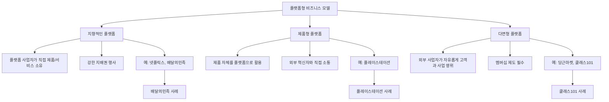
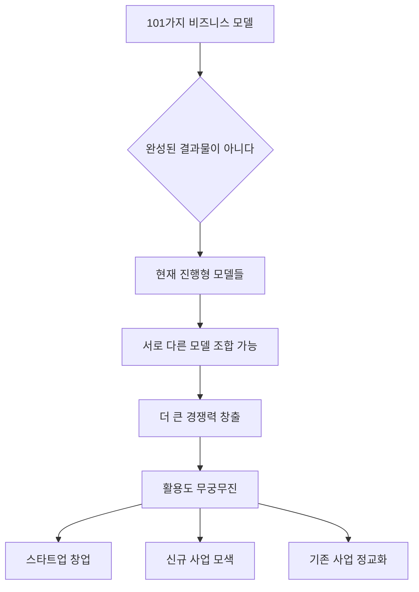

## 성공하는 스타트업을 위한 101가지 비즈니스 모델 이야기
이 책은 스타트업이 성공하기 위한 핵심 요소로 '혁신적인 비즈니스 모델'을 제시하고 있어. 다양한 기업 사례를 통해 비즈니스 모델의 개념과 구성 요소를 쉽고 재미있게 설명해 줄 거야. 특히 플랫폼형 비즈니스 모델을 중심으로 우리가 일상에서 자주 접하는 기업들이 어떻게 성공했는지 알려주는 책이라고 보면 돼.

## 1. 비즈니스 모델, 왜 중요할까? 

1. **성공하는 스타트업의 비밀**: 이 책은 성공하는 스타트업들이 어떤 비즈니스 모델을 가지고 있는지 알려주는 책이야. 
  1. 저자들은 스타트업이 성공하려면 <u>혁신적인 </u>비즈니스 모델이 꼭 필요하다고 말하고 있어. 
2. **비즈니스 모델이란 뭘까?**: 비즈니스 모델이라는 말을 지금처럼 쓰는 사람은 '폴 티머스'라는 학자인데, 그는 비즈니스 모델을 이렇게 설명했어. 
  1. 상품, 서비스, 정보가 어떻게 흘러가는지 엮어내는 <u>생각의 틀</u>이라고 보면 돼.
  2. 이 틀 안에는 사업을 하는 방법, 관련된 사람들이 어떤 역할을 하는지, 돈을 어떻게 벌 수 있는지 등이 다 포함되어 있어.
3. **기업이 왜 필요할까? (거래비용 이론)**: 우리가 물건을 살 때 왜 기업을 통해서 사야 하는지 생각해 본 적 있어? 
  1. 개인이 시장에서 직접 물건을 사고파는 것보다 <u>기업을 통하는 게 더 효율적일 때</u>만 기업이 생겨나는 거야. 
  2. 이걸 설명해 주는 이론이 바로 '로널드 코스'의 <u>거래비용 이론</u>이야. 
  - 거래비용 이론은 기업이 존재하는 이유가 <u>거래 비용을 줄이기 위해서</u>라고 말해. 
  - 시장에서 물건을 사고파는 비용이 기업 안에서 관리하는 비용보다 높을 때만 기업이 존재한다는 거지. 마치 혼자서 모든 걸 다 하는 것보다 전문가를 고용해서 일을 시키는 게 더 이득일 때 회사를 만드는 것과 같아.

## 2. 비즈니스 모델을 만드는 4가지 핵심 요소 

1. 핵심 가치** (Core Value)**: 이 비즈니스 모델이 고객에게 어떤 중요한 가치를 주는지에 대한 내용이야. 
  1. 누가 이 서비스를 이용하는 고객인지.
  2. 어떤 문제를 해결해주려고 하는지.
  3. 고객에게 어떤 편리함이나 이득을 주는지.
2. 수입 공식** (Revenue Formula)**: 돈을 어떻게 버는지, 즉 매출이 어떻게 생기는지에 대한 부분이야. 
  1. 물건을 만들거나 서비스를 제공하는 데 드는 비용(원가)은 얼마인지.
  2. 얼마나 이윤(마진)을 남길 수 있는지.
  3. 원하는 만큼의 매출을 달성하려면 기업 형태를 어떻게 해야 하는지.
3. 핵심 자원** (Key Resources)**: 기업이 돈을 잘 벌기 위해 꼭 필요한 중요한 자원들을 말해. 
  1. 이 자원들은 회사 안에 있는 것일 수도 있고, 회사 밖에 있는 것일 수도 있어. 
  2. 눈에 보이는 물건(유형)일 수도 있고, 기술이나 브랜드처럼 눈에 보이지 않는 것(무형)일 수도 있어.
4. 핵심 프로세스** (Key Processes)**: 비즈니스 모델을 실제로 실행할 때 생기는 문제들을 해결하고, 계속해서 돈을 벌 수 있도록 하는 모든 과정들을 말해. 
  1. 문제가 생겼을 때 어떻게 해결할지.
  2. 수익을 꾸준히 내기 위해 어떤 절차를 거쳐야 하는지 등 모든 과정이 포함돼.

## 3. 비즈니스 모델의 세 가지 주요 형태 

1. 플랫폼형** **비즈니스 모델: 우리가 가장 잘 알고 있고 많이 이용하는 형태야. 
  1. 상품, 서비스, 기술 같은 것들을 기반으로 해서 여러 사람들이 서로에게 필요한 것들을 주고받는 <u>생태계</u>를 말해. 
  2. 여기서 중요한 '기반'은 제품 같은 눈에 보이는 것뿐만 아니라, 기술, 저작권, 콘텐츠처럼 눈에 보이지 않는 것도 포함돼. 
  3. 누가 누구에게 무엇을 사고파는지, 그리고 그 관계가 어떻게 만들어지는지가 중요해. 
2. **사회적 가치 기반 **비즈니스 모델: 사회에 좋은 영향을 주면서 돈도 버는 모델이야.
3. **미래 지향적 비즈니스 모델**: 앞으로 새롭게 생겨날 수 있는 혁신적인 모델들을 말해.

## 4. 플랫폼형 비즈니스 모델의 세부 유형 

### 4.1. 지향적인 플랫폼: 직접 물건을 파는 가게 주인 같은 플랫폼 
1. **개념**: 플랫폼 사업자가 <u>직접 제품이나 서비스를 가지고 있으면서</u> 그걸 파는 형태를 말해. 
  1. 자기가 직접 물건을 가지고 있으니 플랫폼 전체에 <u>강한 영향력</u>을 행사할 수 있어. 
  2. 하나의 큰 덩어리처럼 움직이면서 큰 힘을 발휘하는 플랫폼들이 여기에 속해. 
  3. 대표적인 예로는 넷플릭스, 배달의민족, 데일리호텔 같은 기업들이 있어. 
2. **사례: 배달의민족**: 배달의민족은 대표적인 지향적인 플랫폼이야. 
  1. 핵심 가치:
  - 지역별 음식점 정보를 모아서 소비자에게 보여주고, 주문, 결제, 배달까지 해주는 <u>주문 정보 통합형 플랫폼</u>이야. 
  - 목표는 고객에게 <u>더 맛있고 좋은 품질의 다양한 음식</u>을 제공하는 거야. 
  - 고객은 가맹 음식점과 앱 이용자인데,
  - 가맹 음식점은 배달의민족을 <u>마케팅 도구</u>로 활용해서 메뉴를 노출하고 정보를 알릴 수 있어. 
  - 앱 이용자는 음식점 메뉴를 보고 <u>주문과 결제를 한 번에 할 수 있는 편리함</u>을 가장 큰 장점으로 느껴. 
  2. 수입 공식: 주로 가맹 음식점들이 이용하는 <u>광고 상품</u>에서 돈을 벌어. 
  - 오픈 서비스: 리스트 상단에 음식점이 무작위로 노출되는 광고인데, 주문이 성사되면 <u>5.8%의 수수료</u>를 받아. 
  - 울트라콜 서비스: 원하는 광고 주소를 직접 설정하고 그 주변 앱 사용자들에게 음식점을 계속 노출시켜 주는 서비스인데, <u>월 8만 원의 고정 광고료</u>를 받아. 
  - 배민 라이더스: 원래 배달을 하지 않던 식당에 배달 서비스를 제공해주는 건데, 건당 수수료나 배달 수수료 같은 <u>부수적인 수입</u>도 있어. 
  3. 핵심 자원:
  - 가맹 음식점에게 <u>결제 건당 수수료를 받지 않는 '주문'</u>이라는 점이 중요해. 
  - 이런 '착한' 이미지는 장기적으로 앱 사용자들이 음식점 사장님들에게 미안한 마음을 덜 느끼게 해서 성공에 큰 역할을 했어. 
  - 배민 라이더스 서비스에서는 배달의민족이 <u>직접 고용한 배달 직원</u>들이 차별화된 서비스를 제공한다는 점이 중요해. 
  4. 핵심 프로세스:
  - 처음에는 긍정적인 반응을 얻기 위해 많이 노력했지만, 지금은 대부분의 음식점이 배달의민족에 등록되어 있어서 <u>주문과 결제 같은 모든 과정이 아주 간편</u>해. 
  - 지속적인 수익을 위해 문구류를 파는 '배민문방구', 식료품 배달 서비스 'B마트', 공유 서비스 '배민키친' 등 <u>요식업계 사업을 다양하게 확장</u>해서 수익을 창출하고 있어. 

### 4.2. 제품형 플랫폼: 제품 자체가 놀이터가 되는 플랫폼 
1. **개념**: 제품 그 자체를 플랫폼으로 활용하는 형태야. 
  1. 플랫폼 사업자는 <u>외부의 혁신적인 개발자들과 직접 소통</u>할 수 있어. 
  2. 대표적인 예로는 <u>플레이스테이션</u>이 있어. 
2. **사례: 플레이스테이션**: 소니가 만든 플레이스테이션은 제품을 기반으로 한 플랫폼 비즈니스 모델을 활용하고 있어. 
  1. 핵심 가치:
  - 소니는 게임 개발사들에게 자기 기기(플레이스테이션)에 맞는 형식으로 게임 소프트웨어를 만들도록 하고, 이걸 플레이스테이션 사용자들에게 연결해주는 플랫폼 역할을 해. 
  - 게임 제작사는 플레이스테이션을 통해 <u>많은 게임 사용자들에게 쉽게 접근</u>할 수 있고, 게임 유통도 더 쉬워져. 
  - 게임 유저들은 <u>다양한 개발자들이 만든 게임</u>을 플레이스테이션이라는 플랫폼을 통해 즐길 수 있어. 
  2. 수입 공식:
  - 플레이스테이션은 <u>하드웨어(기기) 자체에서는 수익을 거의 남기지 않아</u>. 
  - 대신 <u>게임 타이틀(소프트웨어)이 팔릴 때마다 수수료</u>를 받는 것이 특징이야. 
  - 이런 판매 방식을 '면도날 형 모델'이라고 하는데, 면도기(하드웨어)는 싸게 팔고 면도날(소프트웨어)을 계속 팔아서 돈을 버는 것과 같아. 
  3. 핵심 자원:
  - 가장 중요한 자원은 <u>경쟁력 있는 게임 개발사들이 플레이스테이션 기반으로 게임을 만들도록 유치하는 것</u>이야. 
  - 콘솔 게임 산업은 하드웨어 성능 차이가 크게 나지 않기 때문에, <u>좋은 게임을 많이 만들어내는 개발사의 역할</u>이 아주 중요해. 
  - 주요 수입원이 콘텐츠 판매 수수료인 만큼, <u>플레이스테이션을 사용하는 이용자들의 규모</u>도 중요한 자원이야. 
  4. 핵심 프로세스:
  - 꾸준히 수익을 내려면 제품형 플랫폼의 특성상 <u>각 주체들을 자기 제품 아래에 꽉 묶어둬야 해</u>. 
  - 이를 위해 콘솔 게임 산업에서는 <u>다른 회사보다 더 좋은 성능의 기기를 출시</u>하는 전략을 써. 
  - 다른 콘솔 게임으로 사용자들이 떠나지 않게 막고, 고품질 게임을 만들 수 있는 개발자들을 유인해서 <u>차별성을 유지</u>하는 거야. 
  - 최근에는 4K 해상도를 지원하고 VR 기능이 탑재된 플레이스테이션을 출시하는 등 <u>고사양 하드웨어</u>를 계속 선보이고 있어. 

### 4.3. 다면형 플랫폼: 여러 사람이 자유롭게 모여 거래하는 시장 같은 플랫폼 
1. **개념**: 외부의 사업자들이 <u>자유롭게 고객들과 사업을 할 수 있는 형태</u>의 플랫폼이야. 
  1. 이런 거래에서는 플랫폼을 이용하는 사람들을 위한 <u>멤버십 제도</u>가 필수적인 요소가 돼. 
  2. 대표적인 기업으로는 당근마켓, 웹툰 플랫폼, 링크드인, 그리고 <u>클래스101</u> 등이 있어. 
2. **사례: 클래스101**: 온라인 강의를 기반으로 다양한 취미를 가르치고 배우는 사람들이 모여 있는 플랫폼이야. 
  1. 핵심 가치:
  - 다른 온라인 강의 플랫폼과 비슷해 보이지만, 클래스101은 <u>온라인 강의와 함께 실제 준비물까지 함께 제공</u>한다는 점에서 특별해. 
  - 수강하려는 사람들이 <u>가벼운 마음으로 다양한 취미 활동을 배울 수 있는 기회</u>를 제공하는 것이 핵심 가치야. 
  - 매번 강의에 대한 수요 조사를 하는데, 덕분에 새로운 강의를 열고 싶은 강사들은 수요가 없을 때 괜히 강의 준비로 고생할 필요가 없어. 
  2. 수입 공식:
  - 기본적인 수익은 <u>강의와 준비물을 판매하는 것</u>에서 나와. 
  - 강사와 클래스101이 수익을 어떤 비율로 나누는지는 정확히 공개되지 않았지만, 2020년 3월 말 기준으로 크리에이터(강사)의 첫 달 평균 수익이 약 <u>600만 원</u> 정도였다고 해. 
  3. 핵심 자원:
  - 가장 중요한 자원은 <u>수강생들이 들을 만한 질 높은 강의를 얼마나 많이 가지고 있는지</u>야. 
  - 처음에는 취미 콘텐츠로 시작했지만, 나중에는 각 분야의 유명인들이 참여하는 '시그니처 클래스' 등 <u>다양한 콘텐츠로 확장해 나가는 것</u>이 클래스101만의 핵심 자원이야. 
  4. 핵심 프로세스:
  - 클래스101이 다른 서비스와 차별화되는 점은 <u>모든 강의가 오직 온라인으로만 진행</u>되고, <u>실제 수요 조사를 바탕으로 런칭</u>된다는 거야. 
  - 수요 조사에 사람들이 적극적으로 참여하도록 <u>리워드(보상)를 제공하는 이벤트</u>도 진행하고 있어. 

## 5. 비즈니스 모델, 계속 진화하는 중! 

1. **진화하는 모델들**: 이 책에 소개된 101가지 비즈니스 모델은 <u>완성된 결과물이 아니라 지금도 계속 변하고 있는 모델들</u>이야. 
2. **조합의 힘**: 이 모델들을 <u>서로 다르게 조합해서 사용하면 더 큰 경쟁력</u>을 만들어낼 수도 있어. 
3. **무궁무진한 활용**: 이 책의 비즈니스 모델들은 스타트업 창업을 꿈꾸는 사람뿐만 아니라,
  1. 새로운 사업을 찾을 때,
  2. 지금 하고 있는 사업을 더 좋게 만들 때 등 <u>다양한 상황에서 아주 유용하게 활용</u>될 수 있을 거야. 

## 6. 스타트업의 현실과 교훈 

1. **스타트업의 짧은 **생명 주기: 이 책은 2015년에 나왔는데, 2022년에 다시 읽어보니 많은 스타트업들이 사라졌다는 것을 알 수 있어. 
  1. 스타트업의 생명 주기가 약 <u>3년</u>이라는 말이 정말 사실인 것 같아. 
  2. 책에 나온 스타트업들을 인터넷에서 찾아보면 <u>살아남은 기업이 몇 개 안 돼</u>. 
  3. 쏘카, 요기요, 패스트파이브처럼 당시에도 이미 큰 스타트업들을 제외하고는 말이야. 
  4. 이 책에 나올 정도면 어느 정도 잘나가던 스타트업이었을 텐데, 많이 안타까운 현실이야. 
  5. 그만큼 스타트업을 성공시키는 것이 <u>쉽지 않다는 이야기</u>겠지. 
2. **책에서 얻을 수 있는 교훈**: 비록 많은 스타트업이 사라졌지만, 이 책에서 배울 수 있는 중요한 점들이 있어. 
  1. 101가지 스타트업의 <u>핵심 가치와 </u>수익 모델을 알 수 있다는 거야. 
  2. 이 스타트업들이 어떻게 돈을 벌고 어떤 중요한 능력을 가지고 있었는지 쉽게 공부할 수 있는 것이 큰 장점이야. 
3. **만땅의 사례**: 특히 기억에 남는 스타트업은 '만땅'이라는 곳인데, 
  1. 핸드폰에 탈부착식 배터리가 많던 시절에 <u>배터리를 교체해주는 </u>사업 모델이었어. 
  2. 당시에 정말 고생도 많이 하고 투자도 받았지만, 외부 시장의 변화<u>(일체형 배터리 등장) 때문에 결국 어려움</u>을 겪을 수밖에 없었어. 
  3. 드라마 '스타트업'에서도 이와 비슷한 사업 모델이 팀장에게 쓴소리를 듣는 장면이 나오기도 했지. 
  4. 하지만 만땅의 대표는 포기하지 않고 도전해서 현재 '레스폰'이라는 회사의 대표가 되어 있어. 
4. **계속되는 이야기**: 이 책은 2018년 버전과 2021년 버전도 나와 있어서, 계속해서 새로운 비즈니스 모델들을 탐구할 수 있어. 

