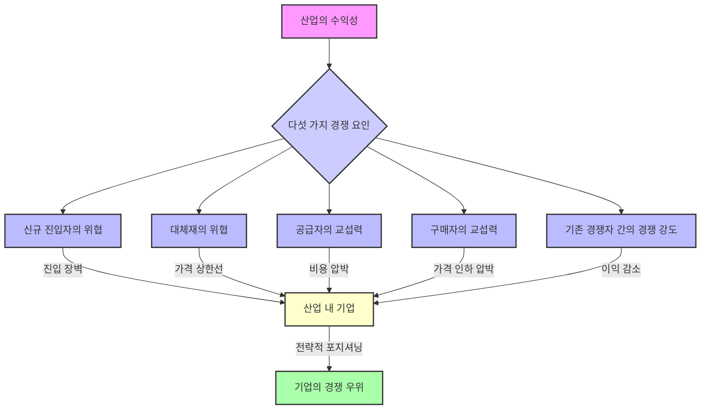
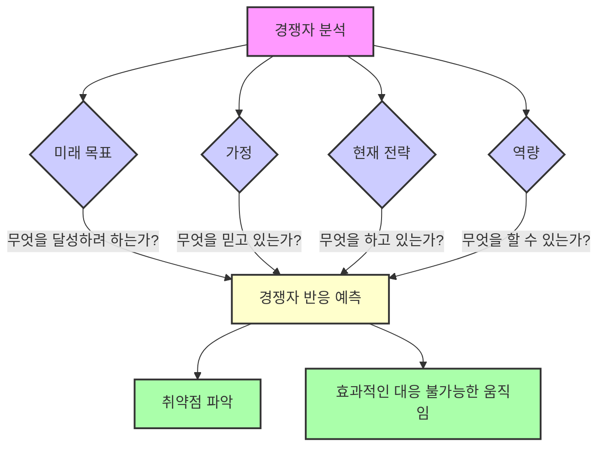

## 마이클 포터의 경쟁 전략: 산업 분석과 경쟁자 분석 기법
이 책은 기업이 경쟁이 치열한 시장에서 어떻게 성공할 수 있는지, 그리고 왜 어떤 기업은 잘나가고 어떤 기업은 힘들어하는지를 설명하는 책이다. 마이클 포터는 이 책에서 기업이 경쟁에서 이기기 위한 전략을 세우는 데 필요한 분석 도구들을 알려준다. 마치 게임의 규칙을 알려주는 설명서와 같다고 보면 된다. 

## 1. 마이클 포터는 누구일까? 

1. **경쟁 전략의 대가**: 마이클 포터는 미국의 경제학자이자 하버드 대학교 경영대학원 교수이다. 
  - 그는 경제학, 경영 전략, 사회 과정에 대한 이론으로 유명하다. 
  - 그의 책 "경쟁 전략: 산업 및 경쟁자 분석 기법"은 현대 경영 전략 분야를 만들었다고 평가받는다. 
2. **학력 및 경력**:
  - 1947년 미시간에서 태어났고, 프린스턴 대학교에서 항공 공학을 전공했다. 
  - 하버드 경영대학원에서 MBA를, 하버드 대학교에서 경영 경제학 박사 학위를 받았다. 
  - 그는 하버드에서 최고 영예인 '비숍 윌리엄 로렌스 대학교 교수'로 임명되었고, 그의 연구를 위한 연구소도 설립되었다. 
3. **주요 저서**:
  - "경쟁 전략: 산업 및 경쟁자 분석 기법" (1980) 
  - "경쟁 우위: 탁월한 성과 창출 및 유지" (1985) 
  - "국가의 경쟁 우위" (1990) 
4. **그의 능력**: 포터는 스스로 "가장 큰 재능은 엄청나게 복잡하고 통합적이며 다차원적인 문제를 개념적으로 파악하여 실무자들이 실제로 행동할 수 있도록 돕는 능력"이라고 말했다. 

## 2. 전략이란 무엇일까? 

1. **전략은 선택이다**: 전략은 단순히 최고가 되려고 경쟁하는 것이 아니라, <u>다르게 선택하는 것</u>이다. 
  - 다른 회사들과 다른 활동을 하거나, 비슷한 활동이라도 다른 방식으로 하는 것을 의미한다. 
  - 경쟁에서 이기려면 다른 회사와 차별점을 만들고, 그 차별점을 계속 유지해야 한다. 
  - 고객에게 더 큰 가치를 주거나, 더 낮은 비용으로 비슷한 가치를 제공하거나, 둘 다 해야 한다. 
2. **전략의 목표**:
  - 고객의 기대를 충족시키는 것이다. 
  - 전략은 꾸준히 이어져야 하지만, 계속해서 새롭게 만들어질 수도 있다. 
3. 경쟁 전략:
  - 회사를 경쟁자들보다 유리한 위치에 놓이게 하고, 가장 큰 전략적 이점을 주는 전략이다. 
  - 다른 회사와 차별화되는 것을 의미하며, 독특한 가치를 제공하기 위해 의도적으로 다른 활동들을 선택하는 것이다. 
  - 이는 수익성 있는 고객 관계를 만들고, 경쟁 우위를 얻으며, 경쟁자들을 분석하는 데 도움을 준다. 

## 3. 경쟁 우위와 본원적 전략: 어떻게 경쟁에서 이길까? 

1. **경쟁 우위란?**: 경쟁 우위는 회사의 제품이나 서비스가 고객이 선택할 수 있는 다른 모든 것보다 <u>뛰어나게 만드는 요소</u>이다. 
  - 다른 회사보다 더 저렴하게 만들거나, 더 좋은 품질의 제품이나 서비스를 만들 수 있게 하는 요인들을 말한다. 
  - 성공하려면 경쟁사보다 더 나은 혜택을 목표 시장에 분명하게 전달할 수 있어야 한다. 
2. **포터의 본원적 전략 (**Generic Strategies**)**: 마이클 포터는 회사가 경쟁에서 이기기 위한 세 가지 기본적인 전략을 제시했다. 
  - 이 전략들은 <u>전략의 범위</u>(넓은 시장 vs. 좁은 시장)와 <u>경쟁 우위의 원천</u>(저비용 vs. 차별화)이라는 두 가지 기준으로 나뉜다. 
  - 이 두 가지 기준을 조합하면 네 가지 일반적인 경쟁 전략이 나온다. 

### 3.1. 원가 우위 전략 (Cost Leadership Strategy) 
1. **목표**: 업계에서 가장 낮은 비용으로 제품이나 서비스를 생산하는 것이다. 
  - 운영 비용을 줄이고 낮은 가격을 책정하여 이익을 늘리는 데 집중한다. 
  - 회사는 가격으로 다른 모든 회사와 경쟁한다. 
  - 경쟁 우위는 비용을 낮추는 데서 온다. 
2. **방어막**: 원가 우위는 다섯 가지 경쟁 요인에 대한 강력한 방어막이 된다. 
  - **가격 전쟁**: 가격 전쟁이 나도 다른 회사들이 손해 볼 때도 이익을 낼 수 있다. 
  - **강력한 구매자**: 구매자들이 가격을 낮추려 해도, 다음으로 효율적인 경쟁사 수준까지만 낮출 수 있다. 
  - **강력한 공급자**: 공급자들의 비용 인상을 다른 회사보다 더 잘 흡수할 수 있다. 
  - 진입 장벽: 낮은 비용 생산자는 신규 진입자에게 진입 장벽을 만든다. 신규 진입자는 규모와 경험을 따라잡기 위해 엄청난 돈을 써야 한다. 
3. **예시**: 월마트(Walmart), 맥도날드(McDonald's), 테스코(Tesco)와 같은 회사들이 이 전략을 사용한다. 
  - 이 회사들은 매일 저렴한 가격을 내세워 시장에서 경쟁한다. 
  - 이들의 전체 시스템은 비용을 최대한 줄이도록 설계되어 있다. 
4. **위험**:
  - 다른 회사들도 기술 발전으로 비용을 낮출 수 있다. 
  - 장기적으로 원가 우위를 유지하기 어려울 수 있다. 
  - 고객들이 가격에 민감해져서 독특함보다는 가격을 선택할 수 있다. 

### 3.2. 차별화 전략 (Differentiation Strategy) 
1. **목표**: 업계 전체에서 독특하고 특별하다고 인식되는 제품이나 서비스를 만드는 것이다. 
  - 좋은 브랜딩을 통해 고객에게 가치 있게 여겨지는 독특하고 매력적인 제품이나 서비스를 만드는 데 집중한다. 
  - 제품의 독특함으로 인해 프리미엄 가격을 받을 수 있다. 
2. **방어막**: 차별화는 높은 마진을 통해 다섯 가지 경쟁 요인에 대한 방어막을 만든다. 
  - **경쟁사**: 브랜드 충성도를 만들어 경쟁사로부터 회사를 보호한다. 
  - 진입 장벽: 신규 진입자는 회사가 구축한 독특한 위치를 극복해야 하므로 진입 장벽이 된다. 
  - **구매자**: 구매자들이 회사의 제품을 대체할 만한 것이 없다고 생각하므로, 구매자들의 힘이 크게 줄어든다. 
3. **예시**: 애플(Apple), 나이키(Nike), 맥도날드(McDonald's), 메르세데스-벤츠(Mercedes-Benz)와 같은 회사들이 이 전략을 사용한다. 
  - 이 회사들은 제품 혁신을 통해 경쟁사와 차별화된다. 
  - 고객들은 이 브랜드의 제품을 정말 갖고 싶어 하고, 높은 가격을 기꺼이 지불한다. 
4. **위험**:
  - 차별화를 위한 높은 비용이 발생할 수 있다. 
  - 고객들이 가격에 민감해져서 독특함보다는 가격을 선택할 수 있다. 
  - 경쟁사들이 더 낮은 가격으로 모방하거나, 고객의 취향이 변할 수 있다. 

### 3.3. 집중 전략 (Focus Strategy) 
1. **목표**: 특정 좁은 시장(틈새 시장)에 집중하고, 그 시장을 위해 독특하거나 저렴한 제품을 개발하는 것이다. 
  - 전체 시장을 노리기보다는 소수의 시장 부문을 잘 공략하는 데 집중한다. 
  - 선택한 틈새 시장 내에서 차별화를 달성하거나, 낮은 비용을 달성하거나, 둘 다 할 수 있다. 
2. **두 가지 유형**:
  - **원가 집중 (Cost **Focus**)**: 좁은 시장을 목표로 가격 경쟁을 한다. 
  - **차별화 집중 (**Differentiation** Focus)**: 좁은 시장의 요구를 충족시키는 독특한 기능을 제공한다. 
3. **장점**:
  - 고객 충성도가 높아 다른 회사들이 간접적으로 경쟁하는 것을 막는다. 
  - 작은 연못의 큰 물고기가 되는 것과 같다. 
4. **예시**: 메르세데스-벤츠(Mercedes-Benz), 람보르기니(Lamborghini), 롤렉스(Rolex)와 같은 고급 브랜드들이 이 전략을 사용한다. 
  - 고급 자전거 매장이 전문 레이서만을 대상으로 하는 것처럼, 특정 고객층에 특화된 서비스를 제공한다. 
5. **위험**:
  - 성장 기회가 제한적이다. 
  - 회사가 시장보다 커질 수 있고, 선택한 틈새 시장이 쇠퇴할 위험이 있다. 
  - 모방의 위험이 있고, 목표 시장이 변할 수 있다. 

### 3.4. '중간에 갇히는' 위험 (Stuck in the Middle) 
1. **가장 큰 실수**: 포터는 회사가 저비용과 차별화 두 가지를 모두 달성하려고 하면 '중간에 갇히는' 가장 큰 전략적 실수를 저지를 수 있다고 경고한다. 
  - 이것은 모든 사람에게 모든 것이 되려고 하는 회사이다. 
  - 결과적으로 어떤 것도 제대로 하지 못하게 된다. 
2. **문제점**:
  - 원가 우위를 위한 시장 점유율과 투자가 부족하다. 
  - 차별화를 위한 업계 전반의 독특함이 부족하다. 
  - 집중 전략을 위한 좁은 시장에 대한 헌신이 부족하다. 
  - 기업 문화가 혼란스럽고, 조직 구조가 충돌한다. 
3. **결과**:
  - 가격에 민감한 고객은 원가 우위 회사에 빼앗기고, 품질에 민감한 고객은 차별화 회사에 빼앗긴다. 
  - 틈새 시장 고객은 집중 전략 회사에 빼앗긴다. 
  - 수익성이 낮아질 수밖에 없다. 
4. **예시**: 오늘날 많은 백화점들이 월마트와 가격 경쟁을 하려 하고, 전문 부티크와 경험 경쟁을 하려다 둘 다 실패하는 경우가 많다. 
  - 이들은 '중간에 갇힌' 상태이다. 
5. **선택의 중요성**: 훌륭한 전략은 무엇을 할지 결정하는 것뿐만 아니라, 무엇을 하지 않을지 결정하는 것이기도 하다. 
  - 모든 것을 하려고 하면 평범함으로 가는 길이다. 

## 4. 포터의 다섯 가지 경쟁 요인: 산업의 수익성을 결정하는 힘 

1. **산업 분석의 핵심**: 마이클 포터는 산업의 수익성이 운이 아니라, 그 산업의 기본적인 구조에 의해 결정된다고 주장했다. 
  - 이 구조는 다섯 가지 근본적인 힘에 의해 형성된다. 
  - 이것이 바로 그의 전설적인 '다섯 가지 경쟁 요인' 프레임워크이다. 
2. **다섯 가지 요인**: 이 모델은 산업의 경쟁 강도, 매력도, 수익성을 측정하는 데 사용된다. 
  - 신규 진입자의 위협** (Threat of New Entrants)**: 새로운 경쟁자가 시장에 얼마나 쉽게 들어올 수 있는가? 
  - 대체재의 위협** (Threat of Substitution)**: 기존 제품이나 서비스를 대체할 수 있는 다른 제품이나 서비스가 얼마나 쉽게 나올 수 있는가? 
  - 공급자의 교섭력** (**Bargaining Power of Suppliers**)**: 제품이나 서비스를 공급하는 사람들의 힘이 얼마나 강한가? 
  - 구매자의 교섭력** (**Bargaining Power of Buyers**)**: 제품이나 서비스를 구매하는 고객들의 힘이 얼마나 강한가? 
  - 기존 경쟁자 간의 경쟁** 강도 (**Rivalry Among Existing Competitors**)**: 현재 시장에 있는 회사들 간의 경쟁이 얼마나 치열한가? 
3. **전략적 목표**: 회사는 이 다섯 가지 요인으로부터 자신을 가장 잘 방어하거나, 가능하다면 이 요인들을 자신에게 유리하게 조작할 수 있도록 산업 내에서 전략적으로 위치해야 한다. 
  - 강한 요인은 수익성에 위협이 되고, 약한 요인은 기회가 된다. 

### 4.1. 신규 진입자의 위협: 새로운 경쟁자가 얼마나 쉽게 들어올까? 
1. 진입 장벽** (**Barriers to Entry**)**: 새로운 회사가 산업에 들어오기 어려운 정도를 말한다. 
  - 진입 장벽이 높을수록 기존 회사들은 안전하고 수익성이 높아진다. 
  - 마치 성을 둘러싼 해자(moat)나 성벽과 같다. 
2. **높은 진입 장벽의 예시**:
  - 규모의 경제** (**Economies of Scale**)**: 큰 회사들이 더 낮은 비용으로 제품을 만들 수 있다면, 작은 신규 회사는 불리하다. 
  - 생산, 마케팅, 유통 등 다양한 사업 기능에서 발생할 수 있다. 
  - **제품 차별화 (Product **Differentiation**)**: 기존 회사들이 이미 높은 고객 충성도를 가지고 있다면, 신규 회사는 고객을 유치하기 어렵다. 
  - 코카콜라처럼 브랜드 이름을 만드는 데 수십 년과 수십억 달러를 투자한 경우이다. 
  - **자본 요구 사항 (**Capital Requirements**)**: 산업 진입에 큰 초기 비용(공장 건설, R&D 투자 등)이 필요하면 경쟁자들이 진입을 꺼린다. 
  - 전환 비용** (Switching Costs)**: 고객이 다른 제품으로 바꾸는 데 드는 비용(재교육, 재설계 등)이 높으면 신규 회사로 바꾸기 어렵다. 
  - 아이폰에서 다른 스마트폰으로 바꾸기 싫은 이유와 같다. 
  - **비용 불이익 (Cost Disadvantages)**: 신규 회사는 학습 곡선에서 뒤처지거나 원자재 접근성이 불리할 수 있다. 
  - **정부 정책 (Governmental Policies)**: 정부가 특정 산업 진입을 완전히 막을 수 있다. 
3. **예시**:
  - **진입 장벽이 높은 산업**: 철도 산업은 엄청난 자본과 위험이 필요해서 경쟁자가 거의 없다. 
  - **진입 장벽이 낮은 산업**: 유튜브는 누구나 쉽게 채널을 시작할 수 있어서 경쟁이 매우 치열하다. 

### 4.2. 대체재의 위협: 다른 방식으로 같은 문제를 해결하는 제품은? 
1. **대체재란?**: 같은 산업에 속하지 않지만, <u>비슷한 필요를 충족시키는 제품</u>을 말한다. 
  - 예를 들어, 휴대폰은 유선 전화의 대체재이고, 소셜 미디어는 신문의 대체재이다. 
  - 커피숍의 대체재는 에너지 드링크, 집에서 만든 차, 또는 그냥 잠을 더 자는 것이다. 
2. **가격 상한선**: 대체재는 산업 전체의 가격에 상한선을 설정한다. 
  - 커피가 너무 비싸지면 사람들이 차로 바꿀 수 있다. 
3. **주목해야 할 **대체재:
  - 성능 대비 가격이 저렴해지는 대체재. 
  - 자본 수익률이 높은 대체재. 
  - 이런 대체 산업은 미래에 더 많은 진입자가 생겨 가격을 낮추고, 기존 산업에도 영향을 미칠 수 있다. 
4. **예시**:
  - **대체재가 거의 없는 산업**: 전력망 산업은 전기가 필요하고, 이를 대체할 만한 것이 거의 없다. 
  - **대체재가 많은 산업**: 신문 산업은 온라인 신문과 소셜 미디어라는 대체재 때문에 거의 사라졌다. 

### 4.3. 공급자와 구매자의 교섭력: 누가 더 힘이 셀까? 
1. 공급자의 교섭력** (**Bargaining Power of Suppliers**)**:
  - 공급자는 제품 공급을 중단하거나, 가격을 올리거나, 품질을 낮출 수 있다. 
  - **공급자가 힘이 약해지는 요인**:
  - **공급자 매출의 큰 비중**: 산업이 공급자 매출의 대부분을 차지하면, 공급자는 우호적인 관계를 유지하려 한다. 
  - **차별화되지 않은 구매**: 구매하는 제품이 일반 상품(commodity)이면 더 낮은 가격을 얻을 수 있다. 
  - **낮은 **전환 비용: 다른 공급자로 바꾸기 쉽고 저렴하면 공급자는 가격을 마음대로 올리기 어렵다. 
  - 후방 통합** 위협 (Threat of Backward Integration)**: 회사가 직접 공급자의 사업을 인수하거나 경쟁할 수 있다면 공급자는 힘이 약해진다. 
  - **구매자 품질에 중요하지 않음**: 구매하는 제품이 최종 제품의 품질에 중요하지 않으면 높은 가격을 받아들이지 않는다. 
  - **예시**: 슈퍼마켓은 공급자(상품 제조업체)에 대해 강력한 교섭력을 가진다. 
2. 구매자의 교섭력** (**Bargaining Power of Buyers**)**:
  - 구매자는 제품 구매를 중단하거나, 더 낮은 가격을 요구하거나, 더 높은 품질을 요구할 수 있다. 
  - **구매자가 힘이 강해지는 요인**:
  - **대량 구매**: 구매자가 대량으로 구매하면 더 많은 힘을 가진다. 
  - **상품성 제품**: 구매하는 제품이 일반 상품(모두 비슷함)이면 가격을 낮추기 쉽다. 
  - **낮은 전환 비용**: 다른 판매자로 바꾸는 데 비용이 거의 들지 않으면 구매자는 힘이 강하다. 
  - **예시**: 항공 산업은 에어버스(Airbus)와 보잉(Boeing)이라는 두 주요 공급자(항공기 제조업체)에 대해 교섭력이 약하다. 
  - 결혼 사진작가의 예시처럼, 고객이 선택할 수 있는 대안이 많으면 고객의 힘이 강해진다. 

### 4.4. 기존 경쟁자 간의 경쟁 강도: 누가 가장 치열하게 싸울까? 
1. **경쟁 강도**: 산업 내 기존 회사들 간의 경쟁이 얼마나 치열한지를 말한다. 
  - 가격 인하, 광고 전쟁, 신제품 출시, 고객 서비스 강화 등은 모두 회사들의 수익성을 낮춘다. 
  - 경쟁 강도가 낮은 산업에 투자하는 것이 좋다. 
2. **경쟁이 낮은 산업의 특징**:
  - **소수의 집중된 회사**: 산업이 소수의 회사에 의해 지배되면 경쟁이 덜하다. 
  - 큰 회사들이 작은 회사들을 통제할 수 있다. 
  - **높은 산업 성장률**: 산업이 성장하면 대부분의 회사들이 가격 전쟁 없이도 성장 약속을 지킬 수 있다. 
  - **낮은 고정 비용**: 고정 비용이 높으면 과잉 생산으로 이어져 회사들이 고정 비용을 충당하기 위해 낮은 가격으로 제품을 팔려는 유인이 생긴다. 
  - 자동차 제조 산업이 이런 문제를 겪었다. 
  - **높은 차별화**: 고객들이 회사 제품을 독특하다고 인식하면 가격 민감도가 낮아진다. 
  - 석유, 가스, 광업 회사와 같은 일반 상품(commodity)은 제품 차별화가 낮아 문제가 된다. 
3. **예시**:
  - **경쟁 강도가 낮은 산업**: 청량음료 산업은 주요 회사들이 강력한 브랜드를 가지고 있어서 제품이 독특하다고 인식된다. 
  - **경쟁 강도가 높은 산업**: 미용실 산업은 경쟁 강도를 잘 관리하지 못했다. 

## 5. 경쟁자 분석: 상대방을 알아야 이길 수 있다 

1. **깊이 있는 분석의 필요성**: 대부분의 사람들은 경쟁자를 광고나 가격만 보고 안다고 생각하지만, 포터는 훨씬 더 깊이 들어가야 한다고 말한다. 
  - 경쟁자를 움직이는 것이 무엇인지 파악해야 한다. 
2. **네 가지 핵심 요소**:
  - **미래 목표 (Future Goals)**: 경쟁자가 무엇을 달성하려고 하는가? 
  - 시장 점유율, 안정적인 수익성, 기술 리더십 등 목표에 따라 경쟁자의 반응을 예측할 수 있다. 
  - **가정 (Assumptions)**: 경쟁자가 자신과 산업에 대해 무엇을 믿고 있는가? 
  - 경쟁자의 가정은 그들의 맹점(blind spot)을 만든다. 
  - 맹점을 파악하면 이를 이용할 수 있다. 
  - 예를 들어, 경쟁자가 고객 충성도가 높다고 착각할 때 가격 인하를 하면 효과적일 수 있다. 
  - **현재 전략 (Current **Strategy**)**: 경쟁자가 지금 실제로 무엇을 하고 있는가? 
  - 제품, 가격, 마케팅, 유통 등에서 어떻게 경쟁하는지를 보면 그들이 무엇이 효과적이라고 믿는지 알 수 있다. 
  - **역량 (Capabilities)**: 경쟁자의 강점과 약점은 무엇인가? 
  - 재무 상태, R&D 부서, 영업력 등을 평가하여 그들의 전략적 움직임이나 대응 능력을 파악한다. 
3. **경쟁자 반응 프로필 (**Competitor Response Profile**)**: 이 네 가지 요소를 종합하면 경쟁자가 어떻게 반응할지 예측할 수 있다. 
  - 경쟁자가 어디에 취약한지, 어떤 움직임이 가장 큰 반격을 유발할지, 어떤 움직임에 효과적으로 대응하지 못할지 등을 파악한다. 
  - 이것은 마치 체스 게임과 같다. 상대방이 효과적으로 막을 수 없는 수를 두는 것이 중요하다. 
  - 예를 들어, 미니 컴퓨터가 등장했을 때 IBM은 메인프레임 사업을 해칠까 봐 적극적으로 뛰어들지 못했고, 이는 신생 기업들에게 기회가 되었다. 

## 6. 산업의 진화: 게임은 항상 변한다 

1. **끊임없이 변하는 게임**: 산업 구조, 즉 게임판 자체는 끊임없이 진화한다. 
  - 다섯 가지 경쟁 요인도 항상 변하고, 경쟁의 본질도 함께 변한다. 
2. 제품 수명 주기** (**Product Life Cycle**)**: 포터는 산업의 진화를 이해하기 위해 제품 수명 주기 개념을 사용한다. 
  - **도입기 (Introduction Phase)**:
  - 규칙이 정해지고, 기술과 전략에 대한 불확실성이 크다. 
  - 주요 과제는 고객들이 신제품을 시도하게 하는 것이다. 
  - **성장기 (Growth Phase)**:
  - 수요가 폭발적으로 증가하고, 많은 신규 경쟁자가 진입할 수 있다. 
  - 파이가 빠르게 커지므로 보통 모두에게 충분한 기회가 있다. 
  - **성숙기 (Maturity Phase)**:
  - 성장이 둔화되고, 다른 회사로부터 시장 점유율을 빼앗아야만 성장할 수 있다. 
  - 경쟁이 치열해지고, 구매자들은 더 경험 많고 까다로워진다. 
  - 가격 전쟁이 흔하며, 약한 회사들이 시장에서 퇴출되는 '정리(shakeout)' 시기이다. 
  - 이때 '중간에 갇히는' 것은 치명적이다. 
  - **쇠퇴기 (Decline Phase)**:
  - 산업 매출이 줄어드는 시기이다. 
  - 높은 퇴출 장벽(팔 수 없는 전문 자산, 감정적 애착 등)이 있으면 치열한 전쟁과 과잉 생산이 특징이다. 
  - 하지만 퇴출 장벽이 낮고 질서 있게 퇴출이 이루어지면, 남은 회사들(특히 강한 리더나 틈새 시장 플레이어)은 수익성이 좋을 수 있다. 
3. **전략가의 역할**: 진정으로 뛰어난 전략가는 이러한 변화에 단순히 반응하는 것이 아니라, <u>변화를 예측하고 주도한다</u>. 
  - 기술 변화, 고객 요구 변화, 지식 확산 등 진화 과정을 분석하여 산업 구조가 어떻게 변할지 예측한다. 
  - 다른 사람들이 알아차리기 전에 새로운 구조를 활용할 수 있도록 회사를 포지셔닝한다. 
  - 더 나아가, 자신의 강점에 유리한 방식으로 산업의 진화를 형성하려고 노력한다. 

