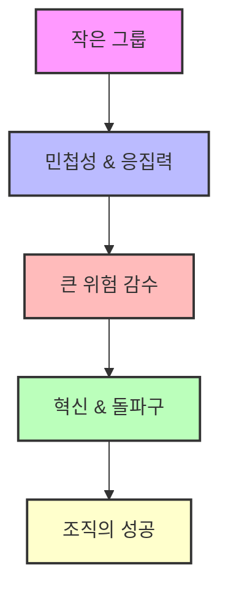
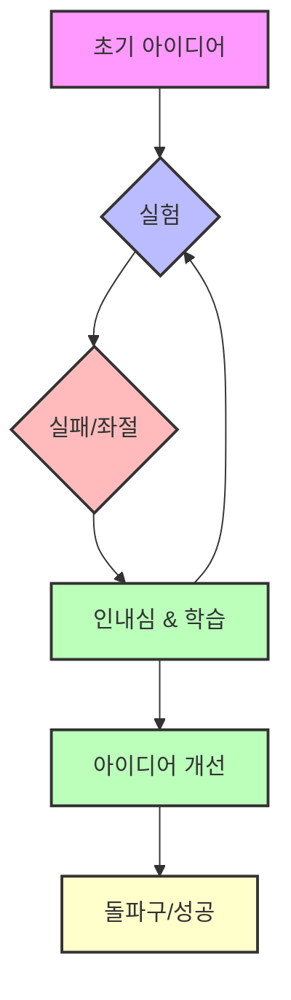

## 책 소개
이 책은 물리학자이자 바이오테크 기업 창업자인 사피 바칼이 쓴 책으로, 혁신적인 아이디어(룬샷)가 어떻게 탄생하고 성공하며, 왜 실패하는지를 물리학의 '상전이' 개념을 통해 설명한다. 조직이 혁신을 이루려면 문화보다 구조, 즉 시스템 설계가 중요하다는 메시지를 전달하며, 리더가 혁신적인 아이디어를 보호하고 성장시키는 방법을 제시한다.

## 본문 정리

## 1. 룬샷이란 무엇일까? 

1. **룬샷의 의미**: 룬샷은 마치 '나사 빠진 사람' 취급을 받으며, 많은 사람에게 무시당하고 홀대받는 아이디어나 프로젝트를 말한다.
  1. 이런 아이디어는 처음에는 '되도 않는 아이디어', '멍청한 생각'으로 여겨지기 쉽다.
  2. 하지만 룬샷은 전쟁의 양상을 바꾸고, 질병을 치료하며, 불황을 극복하는 힘이 될 수 있다.
2. **룬샷의 중요성**: 과거에는 또라이 취급을 받았던 아이디어들이 시간이 지나 천재적인 발명으로 인정받는 경우가 많다.
  1. 예를 들어, 옛날에는 상상하기 어려웠던 기술들이 지금은 우리 생활 곳곳에 스며들어 있다.
  2. 이러한 룬샷 덕분에 전 세계가 발전할 수 있었다.

## 2. 상전이와 상 분리: 조직의 변화를 이해하는 물리학 개념 

1. 상전이** (**Phase Transition**)**: 물리학에서 상전이는 물질의 상태가 변하는 현상을 말한다.
  1. 예를 들어, 물이 얼음이 되거나(액체에서 고체), 얼음이 녹아 물이 되는(고체에서 액체) 것처럼, 온도의 작은 변화가 물질의 행동을 완전히 바꾼다.
  2. 조직에서도 이와 비슷하게, 문화가 아닌 시스템의 작은 변화가 조직의 행동을 바꿀 수 있다.
  3. 마치 물 분자들이 온도가 낮아지면 갑자기 질서정연하게 얼음이 되는 것처럼, 조직도 특정 조건에서 갑자기 행동 패턴이 바뀔 수 있다.
2. 상 분리** (Phase Separation)**: 상 분리는 액체 상태와 고체 상태가 함께 공존하는 현상을 말한다.
  1. 조직에서는 혁신적인 아이디어를 탐구하는 팀(예술가)과 실제 제품을 만들고 실행하는 팀(병사)을 분리하여 각자의 역할을 잘 수행하게 하는 것을 의미한다.
  2. 이 두 팀이 서로의 영역을 침범하지 않고 독립적으로 활동하면서도, 전체적인 목표를 향해 나아가도록 균형을 맞추는 것이 중요하다.
  3. 이러한 분리가 제대로 이루어지지 않으면, 실행 중심의 팀이 혁신적인 아이디어를 억압하여 조직의 성장을 방해할 수 있다.

## 3. 룬샷과 프랜차이즈: 아이디어의 두 가지 얼굴 

1. 룬샷: 룬샷은 엉뚱하고 미친 것처럼 보이는 아이디어로, 기존의 방식에서 벗어나 새로운 가능성을 탐색하는 것을 말한다.
  1. 이러한 아이디어는 처음에는 무시당하고 조롱받기 쉽지만, 성공하면 세상을 바꾸는 엄청난 결과를 가져올 수 있다.
  2. 예를 들어, 수륙 양용 트럭이나 레이더망 같은 아이디어는 처음에는 군대에서 무시당했지만, 전쟁의 양상을 바꾸는 데 결정적인 역할을 했다.
2. **프랜차이즈**: 프랜차이즈는 이미 검증되고 성공이 보장된, 당연하고 예측 가능한 아이디어나 사업 방식을 말한다.
  1. 이는 안정적인 수익을 가져다주지만, 혁신적인 발전은 기대하기 어렵다.
  2. 예를 들어, 부동산 회사에서 아파트를 팔아 돈을 버는 행위는 프랜차이즈적인 아이디어라고 할 수 있다.
3. **조직 내 갈등**: 조직이 커질수록 룬샷을 퇴짜 놓는 경향이 강해진다.
  1. 이는 안정적인 프랜차이즈에 집중하려는 심리 때문이다.
  2. 하지만 룬샷을 무시하면 기업은 결국 침체기를 겪게 된다.

## 4. 혁신을 가로막는 함정들: 모세 함정과 가짜 실패 

1. 모세 함정** (**Moses Trap**)**: 모세 함정은 리더가 자신의 아이디어를 다른 모든 아이디어보다 중요하게 여기고, 반대 의견이나 비판적인 피드백을 억압하는 경향을 말한다.
  1. 이러한 리더는 처음에는 비전가로서 팀을 이끌지만, 시간이 지나면서 독단적으로 변하여 창의성을 억압하는 병목 현상을 일으킨다.
  2. 예를 들어, 폴라로이드의 창업자 에드윈 랜드는 즉석 사진 기술로 큰 성공을 거두었지만, 디지털 기술이 등장했을 때 자신의 아날로그 사진 비전을 고집하며 다른 의견을 묵살했다.
  3. 결국 폴라로이드는 혁신적인 아이디어가 부족해서가 아니라, 리더의 독단적인 결정 때문에 몰락했다.
2. **가짜 실패 (Fake Failure)**: 가짜 실패는 실제로는 실패가 아닌데도, 잘못된 정보나 오해로 인해 실패로 간주되어 혁신적인 아이디어가 중단되는 경우를 말한다.
  1. 엔도의 심장병 신약 개발 사례에서, 쥐 실험에서 콜레스테롤 수치가 변하지 않아 실패로 여겨졌지만, 이는 쥐와 사람의 콜레스테롤 종류가 다르기 때문이었다.
  2. 또한, 개에게 과다 투약했을 때 암 유발처럼 보이는 무해한 증상이 나타났지만, 이 역시 가짜 실패였다.
  3. 이러한 가짜 실패는 룬샷이 빛을 보지 못하고 사라지게 만드는 주된 원인이 된다.
  4. 따라서 실패를 철저히 수사하고, 그 원인을 정확히 파악하는 능력이 혁신에 매우 중요하다.

## 5. 성공적인 혁신을 위한 리더의 역할: 정원사의 마음으로 

1. **정원사의 마음**: 리더는 명령을 내리는 장군이 아니라, 식물이 잘 자랄 수 있는 환경을 만드는 정원사와 같아야 한다.
  1. 정원사는 식물의 성장을 일일이 통제하지 않고, 잡초를 뽑고, 흙에 영양분을 주고, 햇빛을 제공하여 자연스럽게 혁신이 꽃피울 수 있도록 돕는다.
  2. 이는 리더가 세부적인 결과물을 지시하기보다, 혁신이 번성할 수 있는 환경을 조성하는 데 집중해야 함을 의미한다.
2. **폴라로이드의 **에드윈 랜드: 에드윈 랜드는 직원들이 자유롭게 실험하고 위험을 감수하도록 독려하는 문화를 만들었다.
  1. 그는 창의적인 자유를 허용했을 뿐만 아니라, 혁신적인 제품을 만들겠다는 명확한 비전과 함께 실험이 진행되도록 했다.
  2. 이러한 자유와 집중의 시너지가 즉석 사진과 같은 혁신적인 제품을 탄생시켰다.
3. **노키아의 실패**: 노키아는 스마트폰 혁명 시기에 정원사의 마음가짐을 갖지 못해 몰락했다.
  1. 노키아의 경직된 리더십 구조와 관료적인 의사 결정 방식은 혁신을 억압했다.
  2. 내부 팀들은 스마트폰의 잠재력을 일찍이 인지했지만, 리더십은 기존 제품에 집착하며 혁신적인 아이디어를 외면했다.
  3. 결국 노키아는 혁신적인 아이디어가 부족해서가 아니라, 이를 키워낼 리더십의 부재로 인해 시장에서 뒤처졌다.

## 6. 인센티브 설계의 중요성: 행동을 이끄는 보이지 않는 힘 

1. **인센티브의 역할**: 인센티브는 조직 내에서 사람들의 행동을 이끄는 보이지 않는 힘이다.
  1. 인센티브가 어떻게 설계되느냐에 따라 사람들이 과감한 위험을 감수할지, 아니면 안전한 길만 택할지가 결정된다.
  2. 리더는 탐험, 끈기, 협력을 장려하는 인센티브 시스템을 만들어 룬샷의 잠재력을 최대한 끌어내야 한다.
2. **제약 산업의 실패 사례**: 1990년대 제약 산업은 인센티브가 잘못 설계되어 혁신이 정체된 대표적인 예다.
  1. 제약 회사들은 단기간에 막대한 수익을 낼 수 있는 블록버스터급 약물 개발에만 집중했다.
  2. 이는 즉각적인 고수익 프로젝트를 보상하고, 장기적인 고위험 프로젝트를 외면하는 인센티브 구조 때문이었다.
  3. 결과적으로 희귀병 치료제나 혁신적인 의료 접근법 같은 중요한 의학적 발견의 기회가 많이 사라졌다.
3. **DARPA의 성공 사례**: 미국 국방부 고등 연구 계획국(DARPA)은 잘 설계된 인센티브가 혁신을 어떻게 촉진하는지 보여준다.
  1. DARPA는 즉각적인 결과와 상관없이 과감한 실험적 프로젝트와 다학제적 협력을 장려한다.
  2. 실패를 처벌하지 않고 혁신 과정의 중요한 부분으로 여긴다.
  3. 이러한 인센티브 덕분에 인터넷, GPS, 스텔스 기술과 같은 현대 세계를 바꾼 혁신들이 탄생했다.

## 7. 작은 그룹, 큰 위험: 혁신의 엔진 

1. **작은 그룹의 힘**: 혁신은 자율성, 집중력, 책임감이 유지되는 작은 그룹에서 가장 잘 번성한다.
  1. 크고 관료적인 조직은 창의성을 억압하고 책임감을 분산시켜 혁신적인 아이디어가 나오기 어렵다.
  2. 반면, 작은 팀은 민첩하고 응집력이 있으며, 목적이 명확하여 과감한 위험을 감수하고 대담한 비전을 실행할 수 있다.
2. 맨해튼 프로젝트: 맨해튼 프로젝트는 엄청난 규모의 임무였지만, 성공의 핵심은 소수의 정예 과학자와 엔지니어 팀에 있었다.
  1. 이 팀은 전통적인 군대 계층 구조 밖에서 활동하며 관료주의의 방해 없이 원자폭탄 개발에 집중할 수 있었다.
  2. 그들의 과감한 사고와 행동은 역사를 바꾸는 결과를 가져왔다.
3. **제록스 파크의 교훈**: 제록스 파크는 뛰어난 혁신가들로 구성된 작은 팀을 보유했지만, 그들의 혁신적인 연구를 활용하지 못했다.
  1. 그래픽 사용자 인터페이스, 이더넷, 레이저 프린팅 같은 획기적인 기술을 개발했지만, 제록스 본사는 복사기 사업에만 매몰되어 이 아이디어들을 외면했다.
  2. 결국 제록스 파크의 기여는 애플과 같은 다른 회사들의 성공 기반이 되었다.
  3. 작은 팀이 혁신적인 아이디어를 만들어낼 잠재력이 있어도, 조직의 지원과 자율성이 없으면 결실을 맺기 어렵다는 것을 보여준다.

## 8. 실패에 대한 인내심: 성공으로 가는 필수 과정 

1. **실패는 혁신의 용광로**: 실패는 혁신의 적이 아니라, 돌파구가 만들어지는 용광로와 같다.
  1. 모든 룬샷은 깨지기 쉽고 불확실한 실험에서 시작되며, 좌절은 피할 수 없는 과정이다.
  2. 실패에 대한 인내심은 모든 성공적인 노력의 특징이다.
  3. 진정한 리더십은 실패를 두려워하지 않고, 성공으로 가는 중요한 과정으로 받아들이는 문화를 만드는 데 있다.
2. **팬암의 대양 횡단 비행**: 팬암의 대양 횡단 비행이라는 과감한 비전은 처음에는 비웃음과 재정적 어려움에 직면했다.
  1. 많은 사람이 광활한 대양을 가로지르는 장거리 비행의 실현 가능성을 의심했고, 회사는 수많은 좌절을 겪었다.
  2. 하지만 팬암의 리더십은 룬샷을 포기하지 않고, 모든 실패에서 배우며 항공기, 물류, 전략을 개선했다.
  3. 그들의 끈기는 결국 전 세계 여행을 혁신하고 오늘날 우리가 아는 연결된 세상을 만드는 기반이 되었다.
3. **NASA 아폴로 프로그램의 교훈**: NASA의 아폴로 프로그램은 실패에 직면한 회복력의 강력한 예시다.
  1. 아폴로 1호 비극으로 세 명의 우주비행사가 목숨을 잃었을 때, 대중의 지지는 흔들리고 프로그램의 실현 가능성에 대한 의구심이 커졌다.
  2. 그러나 NASA는 이 비극을 임무를 정의하도록 내버려두지 않고, 실패를 배우고 개선할 기회로 삼았다.
  3. 이러한 결단력과 실패에 정면으로 맞서는 의지는 결국 인류의 가장 위대한 업적 중 하나인 달 착륙으로 이어졌다.

## 9. 생존을 위한 싸움: 끊임없는 진화와 변화 

1. **진화하지 않으면 죽는다**: 생존은 주어진 것이 아니라, 끊임없는 진화와 오래된 패러다임을 버리려는 의지를 요구하는 치열한 싸움이다.
  1. 자연에서 변화하는 환경에 적응하지 못하는 종은 멸종한다.
  2. 이는 기업, 산업, 심지어 개인에게도 마찬가지다.
  3. 생존의 핵심은 게임의 규칙이 바뀌었을 때를 인지하고, 민첩하고 단호하며 용기 있게 대응하는 데 있다.
2. **IBM의 성공적인 전환**: IBM은 개인용 컴퓨터 시대의 도래에 맞춰 성공적으로 변화한 사례다.
  1. 메인프레임 컴퓨터 시장의 지배자였던 IBM은 개인용 컴퓨터와 소프트웨어 중심 솔루션으로 시장이 변화하면서 존립 위기에 처했다.
  2. 하지만 IBM은 기존 사업에 집착하지 않고, 소프트웨어 서비스와 컨설팅에 집중하며 스스로를 재창조했다.
  3. 이러한 전략적 변화는 회사를 위기에서 구했을 뿐만 아니라, 기업 솔루션 분야의 리더로 자리매김하게 했다.
3. **블랙베리의 몰락**: 한때 스마트폰 시장을 정의했던 블랙베리는 변화에 적응하지 못해 몰락했다.
  1. 블랙베리 리더십은 하드웨어 중심 모델에 집착하며 터치스크린과 앱 생태계의 잠재력을 무시했다.
  2. 애플과 구글 같은 경쟁사들이 이러한 혁신을 받아들일 때, 블랙베리는 물리적 키보드와 보안 이메일 시스템만으로 지배력을 유지할 수 있다고 믿으며 저항했다.
  3. 블랙베리가 변화를 시도했을 때는 이미 너무 늦었고, 시장 점유율을 잃고 관련성을 상실했다.
  4. 블랙베리의 실패는 경쟁 환경에서 적응을 거부하는 것이 곧 사망 선고와 같다는 냉혹한 현실을 보여준다.

