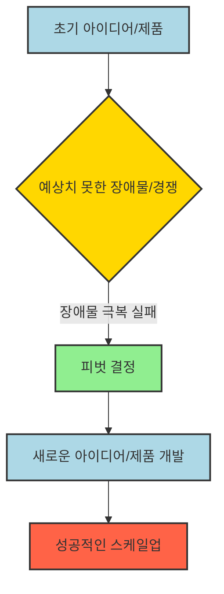
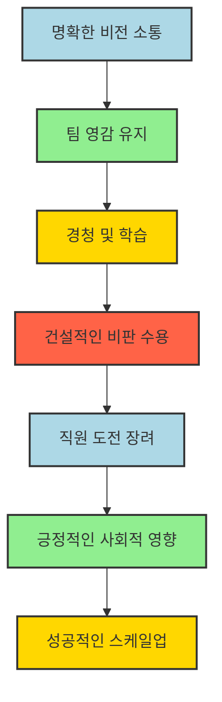

## 마스터스 오브 스케일: 거절을 성장의 기회로 삼는 10가지 성공 비법
이 책은 링크드인 공동 창업자 리드 호프먼이 세계에서 가장 성공한 기업가들의 이야기를 모아, 아무것도 없는 상태에서 무한한 성장을 이뤄낸 CEO들의 성공 비결 10가지를 정리한 책이다. 사업을 하거나 직장에서 성공하고 싶은 사람이라면 반드시 알아야 할 10가지 과목을 통해, 거절을 성장의 기회로 삼고 위기를 극복하며 스케일업(사업 확장)하는 방법을 배울 수 있다. 

## 1. 거절은 성장의 기회다: 148번의 '아니오'가 만든 성공 

사업을 시작할 때 가장 먼저 겪는 일 중 하나는 바로 거절이다. 하지만 이 거절을 어떻게 받아들이느냐에 따라 사업의 성패가 갈릴 수 있다. 거절은 단순히 실패가 아니라, 사업을 더 단단하게 만들고 성장시키는 귀한 피드백이 될 수 있다. 

1. **'**더 뮤즈**'의 148번 거절 이야기** 
  - 온라인 취업 플랫폼 '더 뮤즈(The Muse)'의 공동 창업자 테스 뮤지션은 초기 투자 유치를 위해 무려 148번이나 거절당했다. 
  - 하루에 3~4번씩 투자 피칭(사업 설명)을 하고, 매번 거절당하며 힘들었지만 포기하지 않았다. 
  - 결국 2,800만 달러(약 380억 원) 이상의 투자를 유치하고, 현재는 매년 1억 명 가까이 이용하는 미국의 대표 취업 플랫폼으로 성장했다. 
  - 이들은 "우리는 사실상 거절 때문에 성장했다"고 말한다. 

2. **거절을 성장의 기회로 바꾸는 방법** 
  - **사용자 **분석: 투자자들이 거절한 이유를 분석해보니, 그들은 '더 뮤즈'의 주 고객층인 젊은 직장인들의 애환을 이해하지 못했다. 
  - 이러한 분석을 통해 '더 뮤즈'는 자신들의 비즈니스 모델을 더욱 날카롭게 다듬고, 고객에게 어떤 가치를 제공해야 하는지 명확히 할 수 있었다. 
  - 경쟁자** 파악**: 거절은 경쟁자들이 누구인지, 그리고 그들과 어떻게 차별화해야 하는지 생각할 기회를 준다. 
  - **위험 예측**: 앞으로 발생할 수 있는 위험을 미리 경고하고, 실패를 피할 수 있도록 도와준다. 
  - **로드맵 강화**: 초기 자금 조달 과정에서 받은 수많은 거절 덕분에 '더 뮤즈'는 더 확실한 기업 로드맵(사업 계획)을 갖게 되었다. 

3. 리드** 호프먼의 거절에 대한 **조언 
  - **획기적인 아이디어는 **통념을 거스른다: 누군가에게 거절당할 정도로 획기적인 아이디어일수록 성공할 확률이 높다. 
  - **구글의 사례**: 구글은 검색 후 사용자가 바로 빠져나가는 모델이라 광고 수익이 어렵다는 이유로 처음에는 거절당했다. 하지만 구글은 검색 기능을 고수하며 온라인 광고의 법칙을 새로 썼다. 
  - **TED의 사례**: TED도 강연 동영상을 온라인에 무료로 올리면 오프라인 컨퍼런스 가치가 떨어질 것이라는 이유로 거절당했다. 하지만 온라인 강의가 인기를 끌면서 오히려 컨퍼런스 가치가 5배나 상승했다. 
  - **만장일치의 찬성은 오히려 위험 신호**: 모두가 좋다고 하는 아이디어는 너무 평범해서 이미 다른 경쟁자들이 하고 있을 가능성이 높다. 
  - **똑똑한 투자자도 틀릴 수 있다**: 링크드인 창업자 리드 호프먼도 핸드메이드 제품 플랫폼 '엣시(Etsy)'에 대한 투자를 거절하고 두고두고 후회했다. 
  - 당시에는 아마존처럼 대규모 스케일업(사업 확장)이 어렵다고 판단했지만, 엣시는 장인정신과 커뮤니티의 힘으로 크게 성장했다. 
  - **거절은 피드백이다**: 도전하는 만큼 거절당하고, 거절당한 만큼 성장한다. 거절은 나의 빈틈을 메우고, 때로는 빠르게 방향을 전환(피벗)할 수 있는 힌트가 된다. 
  - **거절당할 기회를 스스로 만들어라**: 거절당할까 봐 아무것도 제시하지 않는 것보다, 계속 도전하고 거절당하며 배우는 것이 중요하다. 

## 2. 이상적인 기업 문화 구축: 성장을 위한 핵심 기반 

투자를 유치하고 사업을 확장할 준비가 되었다면, 다음으로 중요한 것은 바로 이상적인 기업 문화를 구축하는 것이다. 탄탄한 기업 문화는 스타트업의 성장을 가속화하는 핵심 기반이 된다. 

1. **초기 단계의 중요성** 
  - 사업 초기에는 소수의 열정적인 사용자(얼리 어답터)와 비판적인 사용자들의 피드백을 깊이 있게 듣고 사업 전략을 다듬어야 한다.
  - 이때는 사업의 방향을 바꾸기 쉽지만, 일단 스케일업(사업 확장)을 시작하면 방향을 바꾸기 어려워진다.
  - 진솔하고 심층적인 피드백은 사업의 본질을 파악하는 데 도움을 준다.

2. **넷플릭스의 문화** 
  - 넷플릭스는 직원들에게 정해진 근무 시간이나 휴가 정책이 없다. 
  - 직원들이 스스로 창의적으로 일하고, 휴가를 통해 더 영감을 얻을 것이라고 믿기 때문이다. 
  - 이러한 문화는 100장이 넘는 '넷플릭스 문화 덱(Netflix Culture Deck)'에 명확하게 명시되어 있으며, 누구나 온라인에서 볼 수 있다. 
  - 이처럼 명확한 비전을 처음부터 개발하는 것이 중요하다. 일단 문화가 뿌리내리면 바꾸기 매우 어렵기 때문이다. 

3. **문화 구축의 핵심 **원칙 
  - **핵심 가치 정의**: 회사의 근본적인 가치와 직원, 고객과 어떻게 소통할지 결정해야 한다. 필요하다면 '선언문(manifesto)'을 작성하는 것도 좋다. 
  - **문화에 맞는 인재 채용**: 회사가 추구하는 문화에 공감하는 사람들을 채용해야 한다. 한 명의 직원을 채용하면 그 사람의 네트워크까지 영향을 미치기 때문이다. 
  - 다양성** 확보**: 단순히 획일적인 그룹을 채용하는 실수를 피하고, 다양한 배경을 가진 사람들을 채용하여 진정한 다양성을 확보해야 한다. 
  - 투자자** 선정**: 공동 창업자를 선택하듯이 신중하게 투자자를 선택해야 한다. 투자자들도 회사의 핵심 가치를 공유해야 한다. 

4. **문화의 긍정적 효과** 
  - 효과적으로 구축된 기업 문화는 스타트업의 분위기를 활성화하고 사기를 높인다.
  - 직원들의 노력이 사업 번창으로 이어지고, 이는 다시 더 많은 고객을 유치하는 선순환을 만든다.

## 3. 완벽함과 속도 사이의 균형: 적절한 타이밍에 움직여라 

사업을 확장할 때 가장 어려운 결정 중 하나는 바로 '언제 시작해야 하는가'이다. 너무 일찍 시작하면 미숙한 제품으로 고객을 실망시킬 수 있고, 너무 늦으면 경쟁자에게 뒤처지거나 추진력을 잃을 수 있다. 

1. **토리 버치의 사례** 
  - 패션 디자이너 토리 버치는 뉴욕 패션 위크에 맞춰 매장 오픈을 준비했지만, 주문한 주황색 문이 도착하지 않았다.
  - 그녀는 완벽해질 때까지 오픈을 미룰 것인지, 아니면 문이 없는 상태로라도 오픈할 것인지 결정해야 했다.
  - 버치는 후자를 선택했고, 그날은 엄청난 성공을 거두며 그녀의 브랜드가 찬사를 받는 계기가 되었다.

2. **이상적인 출시 시점 찾기** 
  - 사업 환경은 끊임없이 변하기 때문에, 유능한 리더는 이러한 변화를 주시하며 언제 멈추고 언제 나아가야 할지 판단해야 한다.
  - 일부 기업은 너무 빠르게 움직여 '탈출 속도(escape velocity)'에 도달하여 경쟁자들을 따돌리기도 한다.

3. **빠른 성장의 위험과 대처** 
  - **페이팔의 사례**: 페이팔 창업자 피터 틸은 초기 고객에게 10달러를 지급하는 공격적인 성장 전략을 사용했다. 
  - 이러한 빠른 확장은 큰 비용과 혼란을 동반할 수 있다. 
  - **문제 발생 시 대처**: 초기 성공에 도취되어 문제 발생을 간과하기 쉽지만, 중요한 문제에 직면했을 때는 과감하게 속도를 늦추고 문제를 해결해야 한다. 
  - **문제 우선순위**: 모든 문제가 똑같이 중요하지는 않다. 핵심 제품이나 기업 문화와 관련된 문제는 사무실 리모델링 같은 사소한 문제보다 우선순위가 높다. 
  - 만약 어떤 문제가 사업을 완전히 망가뜨릴 수 있다면, 즉시 멈추고 그 문제를 해결해야 한다. 

## 4. 고객 행동 관찰: 말보다 행동에 집중하라 

스타트업을 확장하는 핵심 비결 중 하나는 고객의 말보다는 행동을 관찰하는 것이다. 고객이 무엇을 '말하는지'보다 무엇을 '하는지'를 이해하는 것이 사업 성장에 더 중요한 정보를 제공한다. 

1. **페이스북의 사례** 
  - 마크 저커버그가 페이스북을 하버드 학생들 외 다른 대학으로 확장하겠다고 발표했을 때, 초기 사용자들은 독점성이 사라진다며 불만을 표출했다.
  - 하지만 그들은 불평하면서도 페이스북을 계속 사용했고, 이는 플랫폼 성장에 크게 기여했다.
  - 이는 고객의 말보다는 행동에 주목해야 한다는 것을 보여준다.

2. **렌트 더 런웨이의 사례** 
  - 렌트 더 런웨이(Rent the Runway) 공동 창업자 제니퍼 하이먼은 고객들이 디자이너 제이슨 우의 옷을 좋아한다고 말했지만, 실제로는 그의 옷을 대여하지 않는다는 것을 발견했다. 
  - 조사 결과, 우의 디자인이 일상생활에 실용적이지 않았기 때문이었다. 
  - 하이먼은 우와 협력하여 더 실용적인 라인 '제이슨 우 그레이(Jason Wu Grey)'를 출시했고, 이는 큰 성공을 거두었다. 
  - 또한, 고객들이 주말에 대여한 옷을 월요일 아침까지 가지고 있다가 직장에서도 활용하는 것을 발견했다. 
  - 이러한 행동을 통해 하이먼은 여러 벌의 옷을 동시에 대여할 수 있는 구독 모델을 도입했고, 사업 성장이 급증했다. 

3. 고객 행동** 관찰 방법** 
  - 포커스 그룹: 직접 포커스 그룹을 운영하여 고객의 의견을 듣고 행동을 관찰할 수 있다. 
  - 맞춤형 문구 회사 민티드(Minted)의 미리암 나이피는 현대 남성들이 결혼 계획에 더 적극적으로 참여한다는 것을 발견하고, 덜 여성스러운 디자인을 컬렉션에 추가했다. 
  - **설문조사**: 고객에게 직접 질문하여 피드백을 받을 수 있다.
  - 분석** 도구**: 사용자 참여도를 추적하는 분석 도구를 활용하여 고객의 온라인 행동을 파악할 수 있다.

## 5. 피벗의 힘: 위기 속에서 새로운 기회를 찾아라 

스타트업을 확장하는 과정에서 예상치 못한 장애물이나 치열한 경쟁에 직면했을 때, 유연하게 방향을 전환(피벗)하는 능력은 성공과 실패를 가르는 중요한 기술이 된다. 

1. **트위터의 탄생 이야기** 
  - 에브 윌리엄스는 팟캐스트 발행 플랫폼 '오데오(Odeo)'를 출시하려 했지만, 거대 경쟁사인 애플이 같은 분야에 진출한다는 소식을 들었다. 
  - 윌리엄스는 정면 대결이 어렵다고 판단하고, 팀원들과 브레인스토밍(아이디어 회의)을 통해 새로운 제품을 개발하기로 했다. 
  - 그 결과, 상태 업데이트 중심의 그룹 문자 메시지 플랫폼이 탄생했고, 이것이 바로 지금의 트위터가 되었다. 
  - 이는 스케일업(사업 확장)이 어려울 때, 피벗을 통해 더 좋은 기회를 발견할 수 있다는 것을 보여준다. 

2. **위기 속 피벗의 사례** 
  - **코로나19 팬데믹**: 전 세계적인 팬데믹은 크고 작은 기업들에게 피벗 능력을 완벽하게 만들 기회를 제공했다. 
  - **에어비앤비의 사례**: 팬데믹으로 여행 산업이 큰 타격을 입자, 에어비앤비는 생존 전략을 재고해야 했다. 
  - 그들은 기존 사무실에서 재택근무로 전환하는 추세에 맞춰, 장기 숙박 서비스를 제공하여 원격 근무자들을 유치했다. 
  - 또한, 가상 살사 레슨이나 지역 명소 투어 같은 독특한 온라인 경험을 추가하여 서비스를 풍부하게 만들었다. 
  - **쇼피파이의 탄생**: 스노보더 토비 룻케는 온라인으로 스노보드를 판매하고 싶었지만, 적합한 소프트웨어 솔루션을 찾을 수 없었다. 
  - 그는 직접 코딩 기술을 활용해 자신만의 플랫폼을 만들었고, 이것이 바로 쇼피파이(Shopify)의 시작이 되었다. 

3. **피벗과 리더십의 중요성** 
  - 전략을 바꾸거나, 사업을 완전히 재시작하는 등 시기적절한 피벗은 회사를 앞으로 나아가게 하는 원동력이 될 수 있다. 
  - 하지만 성공적인 피벗의 힘을 진정으로 활용하려면 '리더십'이라는 필수 요소가 필요하다. 
  - 훌륭한 리더는 불확실성을 헤쳐나가고, 팀에 영감을 주며, 필요할 때 어려운 결정을 내릴 수 있는 능력을 갖추고 있다.

## 6. 효과적인 리더십: 성공적인 스케일업의 필수 요소 

회사가 성장하고 확장될 때, 효과적인 리더십은 성공적인 스케일업(사업 확장)을 위한 필수적인 요소다. 리더는 비전을 소통하고, 팀에 동기를 부여하며, 변화에 적응해야 한다. 

1. **애플의 안젤라 아렌츠 사례** 
  - 안젤라 아렌츠는 버버리(Burberry)를 이끌다가 애플의 리테일(소매) 부문 책임자로 자리를 옮겼다. 
  - 그녀는 7만 명의 직원들에게 자신의 비전을 전달해야 했지만, 젊고 기술에 능숙한 팀에게 긴 이메일은 효과가 없을 것이라고 판단했다. 
  - 그래서 그녀는 아이폰으로 3분짜리 진솔한 영상을 촬영했고, 딸의 예상치 못한 전화까지 포함된 이 영상은 팀원들에게 큰 공감을 얻었다. 
  - 아렌츠는 이후 4년 동안 매주 이러한 영상을 촬영하는 것을 습관화하며 팀을 이끌었다. 

2. **리더십의 핵심 역할** 
  - **영감 유지**: 사업이 확장되면 조직의 규모가 커지면서 분위기가 크게 달라진다. 이러한 변화 속에서 리더는 팀에 목적 의식과 동기를 꾸준히 불어넣어 영감을 유지해야 한다. 
  - **경청과 학습**: 리더는 경청하고, 배우고, 조언을 받아들이는 데 개방적이어야 한다. 심지어 직급이 낮은 사람들의 조언도 귀담아들어야 한다. 
  - **건설적인 **비판** 수용**: 건설적인 비판을 수용하는 것이 중요하며, 때로는 반대 의견을 장려하는 것도 필요하다. 

3. **기업 문화의 변화와 인재 육성** 
  - **메일침프의 사례**: 메일침프(MailChimp) 창업자 벤 체스트넛은 스타트업이 해적선처럼 자유분방하지만, 규모가 커지면 해군처럼 규칙과 책임, 행동 강령을 갖춘 구조화된 조직으로 변해야 한다고 말한다. 
  - **마리사 메이어의 인재 육성**: 구글의 20번째 직원이자 리더였던 마리사 메이어는 경험 많은 MBA 출신 대신, 똑똑한 23세들을 채용하여 Gmail 관리와 같은 막중한 책임을 맡겼다. 
  - 직원들이 한 부서에 익숙해지면 다른 부서로 옮겨 새로운 기술을 습득하도록 도전시켰다. 
  - 이러한 접근 방식은 다재다능한 관리팀을 만들었을 뿐만 아니라, 다양한 업무를 처리하는 똑똑한 인재들의 시너지 효과로 혁신적인 아이디어가 쏟아져 나오게 했다. 

4. **리더십과 사회적 영향** 
  - 훌륭한 리더십은 성공적인 스케일업의 마지막 측면인 '긍정적인 사회적 영향'으로 자연스럽게 이어진다. 
  - 효과적인 리더는 직원, 고객, 지역사회의 복지를 우선시하며, 세상에 긍정적인 영향을 미치고 변화를 만들고자 노력한다. 

## 7. 사회적 영향: 규모가 커질수록 더 큰 선한 영향력을 발휘하라 

사업의 규모가 커질수록 사회에 긍정적인 변화를 만들 수 있는 능력 또한 커진다. 성공적인 기업가들은 사업 확장을 통해 사회적 책임을 다하고 선한 영향력을 발휘한다. 

1. **하워드 슐츠와 스타벅스** 
  - 스타벅스 창업자 하워드 슐츠는 어린 시절, 제2차 세계대전 참전 용사였던 아버지가 산재 사고로 의료 보험이나 혜택 없이 고통받는 것을 보며 자랐다. 
  - 훗날 스타벅스를 이끌게 된 슐츠는 이 경험을 바탕으로 이윤보다 직원을 우선시하는 회사를 만들겠다고 다짐했다. 
  - 스타벅스는 미국 기업 최초로 모든 직원(파트타임 포함)에게 종합 건강 보험을 제공했다. 
  - 이는 재정적 이득보다는 슐츠의 어린 시절 경험에 깊이 뿌리내린 사명감에서 비롯된 결정이었다. 
  - 슐츠는 중국 시장 확장 시 바리스타 직업에 대한 낮은 인식으로 이직률이 높자, 멀리 떨어진 지역의 부모들을 스타벅스 매장으로 초청하여 운영 방식을 이해시켰다. 
  - 이러한 노력은 직원들의 만족도를 높이고 이직률을 크게 낮추는 데 기여했다. 

2. **사회적 필요를 채우는 **스케일업 
  - 때로는 사업 확장이 사회적 필요를 충족시키는 계기가 되기도 한다. 
  - 레오나르도 디카프리오의 제작사에서 대본을 읽던 프랭클린 레너드는 영화화되지 못하는 좋은 대본이 너무 많다는 사실에 좌절했다. 
  - 그는 익명으로 양질의 대본을 모집하여 목록을 공개했고, 비록 이 행동으로 직장을 잃었지만, 그의 '블랙리스트(Blacklist)'는 독립 영화 제작자들에게 생명줄이 되었다. 

3. **성공을 사회에 환원하는 사례** 
  - 성공적인 기업가들은 사업 확장을 통해 엄청난 선행을 베풀 수 있다. 
  - 비스타 에쿼티 파트너스(Vista Equity Partners) CEO 로버트 D. 스미스는 덴버의 인종 차별 철폐 정책 덕분에 더 좋은 교육을 받을 수 있었던 어린 시절 경험이 자신의 성공에 큰 영향을 미쳤다고 말한다. 
  - 수십 년 후인 2019년, 스미스는 역사적으로 흑인 대학인 모어하우스(Morehouse)의 졸업식 연설에서 모든 졸업생의 학자금 대출을 갚아주겠다고 발표했다. 
  - 그의 사업 확장 여정은 수백 명의 졸업생들의 삶을 향상시키는 것으로 마무리되었다. 

## 8. 스케일업의 핵심 메시지: 긍정적인 문화와 리더십 
스케일업(사업 확장)은 흥미롭지만 동시에 어려운 과정이다. 하지만 긍정적인 문화를 의도적으로 조성하고, 영감을 주는 리더십이 있다면, 스타트업은 단순한 잠재력을 넘어 모두에게 알려지고 사랑받는 브랜드로 성장할 수 있다. 

1. **성공적인 스케일업의 중요 요소** 
  - **긍정적이고 지지적인 문화**: 직원들이 서로 협력하고 성장할 수 있는 환경을 조성하는 것이 중요하다.
  - **탁월한 **리더십: 경청하고, 배우고, 건설적인 비판을 수용하는 리더는 팀에 영감을 주고 동기를 부여한다.

2. **고객 경험에 집중** 
  - 탁월한 고객 경험을 제공하는 데 집중해야 한다.
  - 최고를 넘어 '11성급' 제품이나 서비스를 상상하며 고객 기대를 뛰어넘기 위해 노력해야 한다.
  - 이를 통해 경쟁 시장에서 두각을 나타내고, 입소문을 통해 충성도 높은 고객을 확보할 수 있다.

3. **대담하고 창의적인 마인드** 
  - 사업을 확장할 때는 대담하고, 창의적이며, 개방적인 마음가짐을 가져야 한다.
  - 새로운 아이디어를 수용하고, 계산된 위험을 감수하며, 팀에 투자함으로써 성공적인 회사를 만들고 사회에 긍정적인 영향을 미칠 수 있다.

