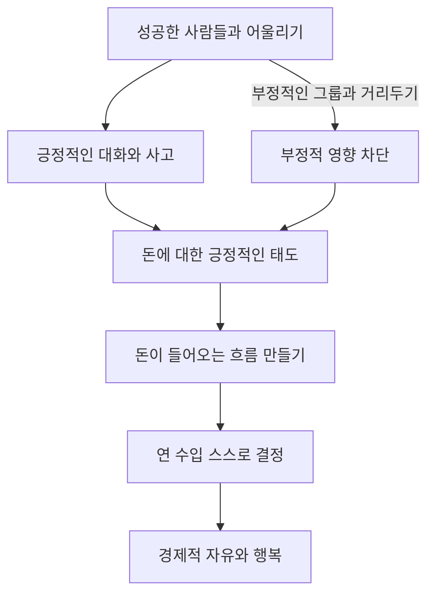
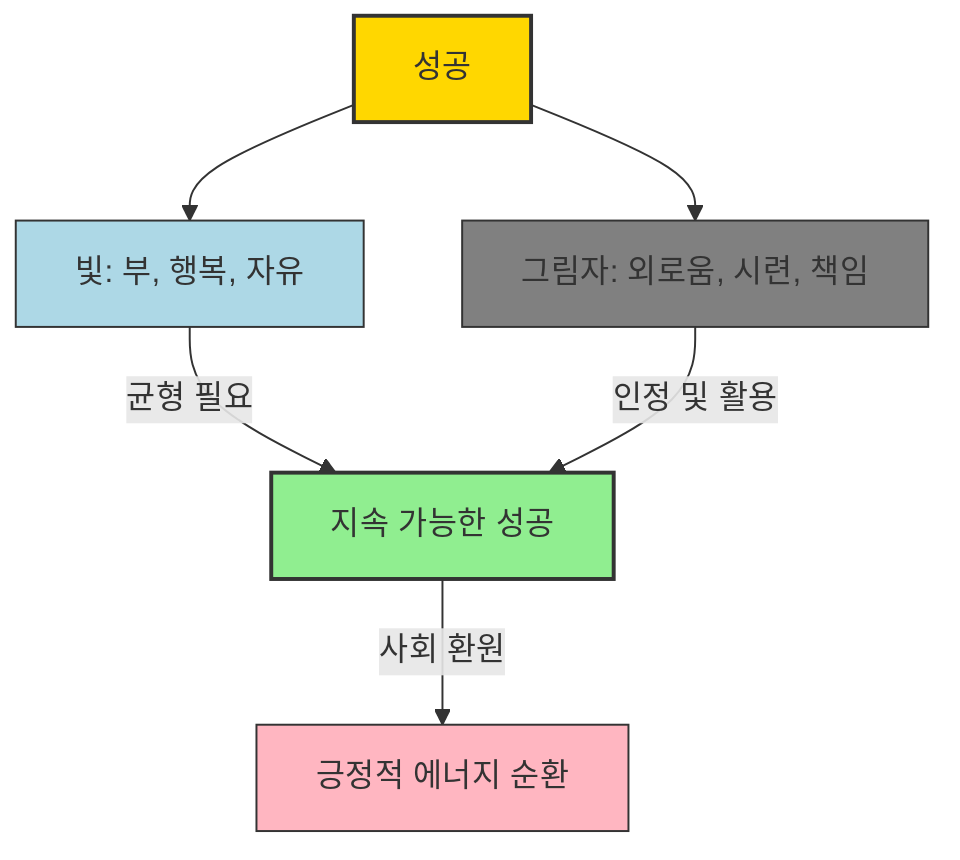

## 비상식적 성공 법칙: 부의 추월차선에 올라타는 8가지 강력한 습관
이 책은 일본의 유명한 마케터이자 경영 컨설턴트인 간다 마사노리가 쓴 '비상식적 성공 법칙'이야. 이 책은 우리가 흔히 아는 긍정적인 생각이나 정신력만 강조하는 성공법칙과는 좀 달라. 오히려 보통 사람들이 집을 사고 스포츠카를 탈 수 있도록, 즉 경제적인 자유를 얻을 수 있도록 가장 빠르고 현실적인 방법을 알려주는 실용서라고 보면 돼. 저자는 자신이 직접 샐러리맨에서 독립해 2년 만에 부자가 된 경험과 3천 개가 넘는 회사 경영자들을 컨설팅하며 얻은 실제 사례들을 바탕으로, 비상식적이지만 강력한 8가지 성공 습관을 제시하고 있어. 이 책은 성공을 위한 지름길을 찾는 사람들에게 아주 특별한 통찰을 줄 거야.

## 1. 성공은 악한 본성에서 시작된다 

성공은 우리가 생각하는 것과 다르게, 때로는 우리 안의 '악한 본성'에서 시작될 수 있다는 게 이 책의 첫 번째 비상식적인 이야기야.

1. **성공 법칙에 대한 오해** 
  - 우리가 흔히 듣는 성공 법칙들은 대부분 이미 성공한 사람들이 자신에게 하는 훈계 같은 거야.
  - "운이 좋았을 뿐이다", "행복은 돈으로 살 수 없다", "사람과의 만남이 중요하다" 같은 말들이지.
  - 이런 말들은 성공한 사람들이 자만하지 않기 위해 스스로를 다스리려고 하는 말들이야.
  - 하지만 보통 사람들이 이런 말을 그대로 받아들이면 오히려 역효과가 날 수 있어. 왜냐하면 성공한 사람들과 보통 사람들의 우선순위가 다르기 때문이야.

2. **돈과 마음의 딜레마** 
  - 세상에는 네 가지 유형의 사람이 있다고 해.
  - 돈이 많은 사람, 돈에 쪼들리는 사람, 마음이 풍요로운 사람, 마음이 가난한 사람.
  - 대부분의 사람들은 태어날 때부터 질투, 적대심, 허영심 같은 '악의 감정'에 이끌려 움직이고, 돈에도 쪼들리고 마음도 가난한 '보통 사람'으로 시작해.
  - 돈과 마음을 동시에 얻는 건 정말 어려운 일이야. 마치 갈림길에서 물과 건초 사이에서 망설이다 굶어 죽은 말처럼, 돈을 원하면서도 "돈은 중요하지 않아"라고 생각하는 딜레마에 빠지기 쉽거든.

3. **악의 에너지를 활용하는 방법** 
  - 이 책에서는 일단 우리 안에 있는 '악의 에너지'를 활용해서 단기간에 돈을 벌고, 그 다음에 마음을 풍요롭게 만드는 노력을 하라고 조언해.
  - 즉, 돈을 먼저 벌고, 그 다음에 마음을 연마하는 순서로 가는 거야.
  - '악의 에너지'는 질투, 적대심, 체면, 허영심 같은 감정들을 말해. 이런 감정들은 사실 엄청나게 강력한 에너지를 가지고 있어.
  - 예를 들어, 어릴 때 가난했거나 성적이 좋지 않았던 콤플렉스를 가진 사람들이 "보란 듯이 성공해서 사람들을 놀라게 해주겠다"는 야심으로 회사를 상장시키기도 하잖아.
  - 저자 자신도 외무성에서 도쿄대 출신들에게 밀리고, 컨설팅 회사에서 해고당하고, 고객에게 무시당했던 '분노'의 감정을 발판 삼아 독립했다고 해.
  - 이건 '악한 사람이 되라'는 말이 아니야. 악의 감정이 올라올 때 그걸 부정하지 말고, 오히려 일을 추진하는 데 사용하라는 뜻이야. 인간의 본성인 악의 감정을 인정하고, 그 에너지를 성공을 위한 추진력으로 활용하라는 거지.

## 2. 목표를 종이에 적고 잠재의식을 프로그래밍한다 

성공의 두 번째 비상식적인 법칙은 바로 '목표를 종이에 적는 것'이야. 너무 단순해 보이지만, 이게 엄청난 힘을 가지고 있다고 해.

1. **종이에 적으면 실현된다** 
  - 성공하느냐 못 하느냐는 자신의 꿈, 소망, 목표를 종이에 적느냐 안 적느냐의 차이일 뿐이야.
  - 많은 성공한 사람들이 실제로 목표를 종이에 적어두고 나중에 보면 그 목표들이 대부분 실현되어 있었다고 해.
  - 일본의 유명한 야구 선수 스즈키 이치로도 초등학교 6학년 때 "인류 프로야구 선수가 되어 계약금 10억 원 이상을 받겠다"는 일기를 썼고, 실제로 그렇게 됐지.
  - 사람들은 "그런 일이 있을 수 없어"라고 생각하기 때문에 시도조차 하지 않을 뿐이야. 하지만 종이에 적어두면 잊을 만할 때쯤 실현되어 있을 거야.

2. **좋은 목표 설정하기: 하기 싫은 일부터 찾아라** 
  - 좋은 목표를 설정하는 가장 중요한 방법은 '자신이 정말 하고 싶은 일을 찾는 것'이야.
  - 그런데 하고 싶은 일을 바로 찾으려고 하지 말고, 먼저 '하기 싫은 일'부터 종이에 적어봐.
  - 마치 결혼 상대를 고를 때, 내가 원하는 사람을 떠올리기 어렵다면 내가 원치 않는 스타일이 어떤 사람인지 먼저 떠올려 보는 것과 같아.
  - 식당에서 메뉴를 고를 때도, 먹고 싶은 게 딱히 없으면 먹고 싶지 않은 메뉴부터 제외하면 고르기가 훨씬 쉬워지잖아.
  - 가능한지 불가능한지는 따지지 말고, 그냥 떠오르는 대로 하기 싫은 일을 모조리 적는 거야.
  - 이렇게 하기 싫은 일을 명확히 골라내면, 다른 사람의 시선이나 세상의 평판, 가족의 기대 같은 것들에 물들지 않은 '진짜 내가 하고 싶은 일'이 무엇인지 찾을 수 있게 돼.

3. 미션**(사명감) 찾기** 
  - 하기 싫은 일과 하고 싶은 일을 하나하나 적다 보면, 결국 '내가 무엇을 위해 살아가고 있는가'라는 질문에 답하게 돼. 이게 바로 '미션(사명감)'이야.
  - 미션이 있으면 인생의 속도가 엄청나게 빨라져. 뇌의 안테나가 그 미션에 초점을 맞춰서 필요한 정보와 자원을 효율적으로 찾아내거든.
  - 미션을 찾는 질문은 이런 거야. "앞으로 6개월밖에 살지 못한다면 나는 무엇을 해야 할 것인가?", "남은 6개월 동안 돈을 한 푼도 벌지 못한다고 해도 내가 해야 할 일은 무엇인가?"
  - 미션은 거창할 필요 없어. 자신의 능력치를 최대한 끌어내기 위한 일종의 기술이라고 생각하면 돼.

4. 뇌의 메커니즘**: 슈퍼컴퓨터 뇌** 
  - 목표를 종이에 적으면 실현되는 이유는 우리 뇌의 특별한 메커니즘 때문이야.
  - 뇌는 마치 표적을 쫓는 미사일처럼, 어떤 질문을 받으면 24시간 내내 쉬지 않고 그 질문에 필요한 정보를 찾아내.
  - 뇌는 초당 1000만 비트가 넘는 정보를 처리하는 슈퍼컴퓨터와 같아. 시각은 1000만 비트, 청각은 40만 비트, 촉각은 100만 비트를 처리하지.
  - 지하철에서 눈을 감고 "여성은 어디에 있지?"라고 질문한 뒤 눈을 뜨면 여성이 눈에 확 들어오는 것처럼, 뇌는 질문에 따라 정보를 탐색하는 능력이 있어.
  - 하지만 목적의식 없이 질문하면 뇌는 제대로 작동하지 않아.
  - 실현하고 싶은 것을 종이에 적어 잠재의식에 목표로 입력시켜 놓으면, 뇌는 그 목표 실현에 필요한 정보를 계속해서 수집해.
  - 뇌는 병렬 컴퓨터처럼 여러 가지 작업을 동시에 처리할 수 있어서, 목표가 많을수록 더 많은 검색 엔진이 동시에 작동한다고 해.

## 3. 자신에게 최면을 걸고 현실을 컨트롤한다 

세 번째 성공 법칙은 '자기 최면'을 통해 자신의 현실을 스스로 컨트롤하는 거야. 우리가 무의식적으로 걸려 있는 최면에서 벗어나, 원하는 대로 자신을 프로그래밍하는 거지.

1. **반복되는 말의 힘: 집단 **최면 
  - 인간은 반복되는 말에 약해. 같은 말을 계속 들으면 가벼운 최면 상태에 빠지고, 그 말대로 믿고 행동하게 돼.
  - 가장 무서운 건 '집단 최면'이야.
  - 예를 들어, 강연회에서 사회자가 "지금 같은 불황에서 살아남으려면..."이라고 계속 말하면, 참석자들은 자신도 모르게 '불황'이라는 현실을 받아들이게 돼.
  - 기억은 뇌의 특정 부분에 저장되는 게 아니라, 생각이 날 때마다 매번 새롭게 만들어지는 거야.
  - 뇌 안에서는 신경회로가 만들어지고, 전기 신호가 전달되면서 기억이 떠오르는데, 이때마다 새로운 현실이 만들어지는 것과 같다고 해.
  - 이 기억 경로는 반복될수록 더 강해져. 특히 자신이 소리 내어 말하거나 다른 사람들이 동조하면 기하급수적으로 보강되지.
  - "불황이다"라는 말을 자주 하는 동료와 있으면, '불황'이라는 기억 경로가 굵어져서 모든 일을 불황 탓으로 돌리게 되고, 결국 불황이 자신에게도 현실이 되어버리는 거야.

2. **나의 현실은 내가 컨트롤한다** 
  - 우리는 다른 사람에게 현실을 컨트롤당할 것인지, 아니면 내가 내 현실을 컨트롤할 것인지 둘 중 하나를 선택해야 해.
  - 내 현실은 내가 계속 듣는 말, 나 스스로 하는 말, 그리고 다른 사람이 동조하는 말에 의해 컨트롤돼.
  - 그러니까 나에게 도움이 되는 말을 반복해서 듣고 말하기만 하면 돼. 이게 바로 '자기 최면'이야.
  - 자기 최면은 내 잠재의식을 내가 원하는 대로 프로그래밍하는 방법이야. 다른 사람에 의해 만들어진 부정적인 기억 회로를 차단하고, 나에게 유리하게 재구축하는 거지.

3. 잠재의식 프로그래밍** 방법** 
  - 잠재의식을 프로그래밍하는 방법은 아주 간단해.
  - 밤에 잠들기 전에 목표를 적은 종이를 편안한 마음으로 읽어봐.
  - 아침에 일어나서 다시 한번 더 읽는 거야. 이것만 하면 돼.
  - 두 가지 추가 방법이 있어.
  - **현재형 사용 (**어포메이션**)**: 목표를 정할 때는 "나는 ~을 한다", "나는 ~이 된다"처럼 현재형을 사용해. 긍정적인 표현을 계속 반복하는 것을 '어포메이션'이라고 하는데, 세계적인 스포츠 선수들도 기록 향상을 위해 이 방법을 사용한다고 해.
  - 기분 좋게 웃으며 상상** (**시각화**)**: 목표를 읽으면서 기분 좋게 웃으면 훨씬 효과적이야. 기분 좋게 웃으면 시야가 넓어지고 우뇌가 활성화돼서 잠재의식에 명령어를 더 쉽게 입력할 수 있거든. 이걸 '시각화'라고 해.
  - 하루 10분이면 충분해. 머리를 쓸 필요도 없어. 이런 간단한 방법으로 원하는 목표가 실현된다는데, 안 할 이유가 없지?

4. **습관의 중요성: 상위 1%의 비밀** 
  - 우리는 '성공은 소수의 사람만 이룰 수 있다'는 최면에 걸려 있어서, 목표를 종이에 적고 읽는 간단한 방법조차 시도하지 않아.
  - 주변 사람들에게 물어보면 목표가 있다고는 하지만, 그걸 종이에 적고 아침저녁으로 읽는 사람은 거의 없을 거야. 경영자 세미나에서도 1% 정도만 실천한다고 해.
  - 가장 중요한 건 '종이에 적은 목표를 읽는 습관'을 갖는 거야. 이 습관이 보통 사람과 성공한 사람의 큰 차이를 만들어.
  - 비싼 가죽 수첩이나 세미나가 필요한 게 아니야. 문구점에서 클리어 파일이나 바인더 노트를 사서 목표를 정리하고 매일 아침저녁으로 읽기만 하면 돼.

5. **목표 달성 가속화: 고성능 충전기** 
  - 클리어 파일을 가지고 다니면서 수시로 목표를 읽으면, 뇌는 무의식적으로 목표 달성을 위한 질문을 계속하게 돼.
  - 그러면 문득 아이디어가 떠오르거나, 관련된 책을 발견하거나, 만나고 싶었던 사람을 만나게 되는 등 목표 실현에 도움이 되는 일들이 생겨.
  - 목표를 더 빨리 달성하려면, 매일 10개씩 목표를 종이에 적는 습관을 들이는 게 좋아.
  - 이때 거창한 장기 목표뿐만 아니라, 몇 개월 또는 1년 안에 달성할 수 있는 단기 목표를 균형 있게 설정하는 게 중요해.
  - 단기 목표는 'SMART 원칙'에 따라 설정해야 해.
  - **S (Specific, 구체적)**: 목표가 명확해야 해.
  - **M (Measurable, 측정 가능)**: 달성 여부를 숫자로 확인할 수 있어야 해.
  - **A (Achievable, 달성 가능)**: 너무 비현실적이지 않아야 해.
  - **R (Relevant, 사실적/관련성)**: 자신의 미션과 관련이 있어야 해.
  - **T (Time-bound, 기간 명확)**: 언제까지 달성할지 기한이 있어야 해.
  - 매일 10개의 목표를 적은 뒤에는 가장 중요한 목표 하나에 동그라미를 쳐. 이 목표가 실현되면 다른 목표들도 함께 실현되는 목표를 말해.
  - 그리고 그 중요한 목표를 향해 '오늘 무엇을 해야 할까?'라고 질문하고, 아무리 사소한 행동이라도 좋으니 할 수 있는 일을 적고 바로 실행하는 거야. 첫걸음을 내딛는 빈도수를 높이면 일이 점점 더 빠르게 진행될 거야.

## 4. 내가 바라는 직함을 만들고 셀프 이미지를 개선한다 

네 번째 성공 법칙은 '셀프 이미지(자기 자신에 대한 생각)'를 바꾸는 거야. 마치 컴퓨터의 CPU를 업그레이드하는 것처럼, 자신을 새롭게 정의하는 거지.

1. 셀프** 이미지의 중요성** 
  - 성공 법칙을 아무리 배워도, 자기 스스로를 '평범한 사람'이라고 생각하는 한 성공할 수 없어.
  - 성공할 조짐이 보여도 그걸 우연으로 생각하거나, 다른 사람들이 칭찬해도 자신을 부정하게 돼.
  - 왜냐하면 익숙한 '이전의 자신'을 유지하는 게 마음 편하기 때문이야. 성공을 향해 변화하려는 순간 불안해지고, 다시 예전으로 돌아가려고 하지.
  - 마치 10년 전 컴퓨터에 최신 소프트웨어를 깔아도 작동하지 않는 것처럼, 우리의 'CPU'인 셀프 이미지가 낡으면 아무리 좋은 성공 프로그램도 소용없어.

2. **'슈퍼 아무개' **직함** 만들기** 
  - 내가 원하는 나가 되기 위해서는 제일 먼저 셀프 이미지를 개선해야 해.
  - 저자는 경영 컨설턴트로 창업했을 때, 고객을 가르치는 게 너무 싫어서 위장병까지 얻었다고 해. 그때 자신에게 '슈퍼 에너자이징 티처'라는 직함을 만들었어.
  - '에너자이징'은 사람들에게 에너지를 준다는 뜻이야. 스스로 '남들에게 활기를 불어넣는 탁월한 교사'라는 이미지를 만든 거지.
  - 그리고 세미나 전에 항상 "나는 슈퍼 에너자이징 티처다!"라고 주문처럼 외웠더니, 정말 그렇게 됐다고 해. 질문이 무섭던 예전과 달리, 이제는 질문을 받는 게 즐거워졌지.
  - 직함을 만들 때 핵심은 '슈퍼 땡땡땡'처럼 자신의 결점에 휘둘리지 않는 인물상을 표현하는 거야.
  - '슈퍼맨'의 강한 면모를 빌려오는 거지. '울트라 아무개'나 '암흑의 전문가 아무개 마스터'처럼 근사하게 만들어도 좋아.
  - 이 직함은 다른 사람에게 보여줄 필요 없어. 오직 자신만을 위한 직함이야.

3. **새로운 **셀프** 이미지 활용하기** 
  - 새로운 직함을 종이에 적어두고 매일 아침저녁으로 바라보면 돼.
  - 셀프 이미지를 바꾸지 않으면 불안감 때문에 새로운 일을 시작할 수 없지만, 셀프 이미지를 개선하면 회사를 비약적으로 성장시킬 기회가 많아져.
  - 예를 들어, 채소 가게 운영자에게 '계절 식품 제공을 통해 가족의 유대와 건강을 촉진하는 슈퍼 프로모터이자 마케터'라는 셀프 이미지를 제안했더니, 취급 상품 범위가 넓어지고 부유층 고객을 확보해서 연 수입 15억 원을 쉽게 벌 수 있게 됐다고 해.
  - 직함뿐만 아니라 옷차림, 안경, 머리 염색 등 외모를 바꾸는 것도 이전의 자신과 결별하고 새로운 자신을 연출하는 좋은 방법이야.
  - 귀찮아하지 말고, 당신도 하고 싶은 일을 쉽게 해낼 수 있는 '슈퍼 셀프 이미지'를 만들고 종이에 적어봐.

## 5. 목표 달성에 필요한 정보를 수집한다 

다섯 번째 성공 법칙은 '정보 수집'이야. 성공한 사람들은 타고난 센스가 아니라, 엄청난 양의 정보를 흡수하는 습관을 통해 센스를 키웠다고 해.

1. **센스는 정보량에 비례한다** 
  - 큰 성공을 이룬 경영자들은 경영은 타고난 센스라고 말하지만, 그들에게 센스를 어떻게 키웠냐고 물어보면 공통적으로 '책을 많이 읽는다'고 대답해.
  - 센스는 정보량에 비례해. 즉, 많은 양의 정보를 꾸준히 흡수하는 습관을 들이면 보통 사람도 센스를 기를 수 있다는 말이야.
  - 저자도 공무원 출신이라 경영 센스가 없었지만, 정보량을 늘리면서 아이디어가 샘솟고 행동력도 강해졌다고 해.

2. **효율적인 정보 수집 세 가지 방법** 
  - **책과의 만남**: 성공한 경영자들처럼 책을 많이 읽는 거야.
  - **사람과의 만남**: 훌륭한 책이나 존경하는 스승을 만났을 때처럼, 좋은 사람들과의 만남을 통해 성장할 수 있어.
  - **오디오와의 만남**: 잘 알려지지 않았지만 매우 효과적인 방법이야.

3. **오디오의 기적: 시간 벌고 아이디어 얻기** 
  - 성공한 기업가들을 보면 이동 시간 중에 하나같이 '비즈니스 관련 오디오'를 듣는다는 사실을 알 수 있어.
  - 오디오를 들으면 훌륭한 경영자의 수십 년 경험과 지혜를 불과 한두 시간 만에 배울 수 있어. 육성으로 들을 수 있어서 책으로는 전달하기 어려운 미묘한 뉘앙스까지 파악할 수 있지.
  - 오디오는 단순히 지식을 얻는 것뿐만 아니라, 시간을 벌고 발상력과 행동력까지 늘려주는 엄청난 효과가 있어.
  - 오디오를 들으면 1년이 14개월로 늘어나는 것과 같다고 해.
  - 운전하면서 오디오를 듣다가 아이디어가 떠올라 다리에 수첩을 묶어두고 메모하는 사람도 있을 정도야.
  - 오디오는 마음속에서 돌아가는 부정적인 사고를 지워버리는 역할도 해. 멍하니 있으면 부정적인 생각이 저절로 떠오르는데, 성공한 사람들의 이야기를 들으면 긍정적인 사고를 하게 되어 발전적인 아이디어가 더 쉽게 나와.
  - 책 한 번 읽고 오디오 한 번 듣는 것만으로는 부족해. 몇 번이고 반복해서 읽거나 들어야 그 지식이 피가 되고 살이 되어 필요할 때 무의식적으로 행동할 수 있게 돼.
  - 집중해서 듣지 못했다고 걱정할 필요 없어. 오히려 멍하게 있을 때 뇌파가 알파파 상태가 되어 잠재의식 속으로 지식이 더 잘 들어가거든.
  - 어리석은 사람은 자기가 할 수 있다고 착각하지만, 현명한 사람은 선배들의 지혜로부터 배워. 이어폰을 귀에 꽂고 외출할 때도 필수적으로 오디오를 들어봐.

4. 포토리딩**: 정보 처리 속도 혁명** 
  - 저자는 바쁜 와중에도 하루에 한 권씩 책을 읽을 수 있게 된 비결로 '포토리딩'을 꼽아.
  - 포토리딩은 단순한 속독이 아니라, 문서를 사진처럼 읽고 이해해서 정보 처리 속도 자체를 비약적으로 높이는 획기적인 방법이야.
  - 저자는 포토리딩을 통해 참고문헌 20여 권을 몇 시간 만에 읽고, 350페이지 책을 15분 만에 읽은 후 1시간 동안 요지에 대해 이야기할 수 있게 됐다고 해. 영어 원서도 단시간에 읽을 수 있게 됐지.

5. **포토리딩 5단계 시스템** 
  - 포토리딩은 독서의 달인들이 무의식적으로 하는 작업을 시스템화한 것으로, 누구나 단기간에 독서의 달인이 될 수 있는 방법이야.
  - **1단계: 준비 단계 (**귤 집중법**)** 
  - 독서에 의식을 집중할 수 있는 상태를 만드는 거야.
  - 후두부(머리 뒤쪽)에서 15~20cm 위쪽 공간에 귤이 떠 있다고 상상해. 이걸 '귤 집중법'이라고 해.
  - 이렇게 하면 시야가 넓어지고 잡념이 줄어드는 느낌이 들어. 고도의 집중력이 필요한 활동을 할 때 의식이 자연스럽게 후두부 쪽으로 이동하는 것과 같은 원리야.
  - **2단계: **프리뷰** (예습)** 
  - 책을 읽기 전에 책의 앞뒤 표지, 저자 프로필, 목차 등을 간단히 살펴보고 읽는 목적을 명확히 하는 거야.
  - 단 몇 분만 투자해도 뇌의 안테나가 세워져서 목적과 관련된 정보가 더 잘 눈에 띄게 돼.
  - **3단계: 포토리딩 (이미지 정보로 읽기)** 
  - 1초에 한 페이지를 넘기는 속도로 책을 팍팍 넘기는 단계야.
  - 책을 글자(텍스트 정보)가 아니라 그림(이미지 정보)으로 읽고 이해하는 작업이야. 글자 하나하나를 읽는 게 아니라, 페이지 전체를 하나의 사진처럼 뇌에 집어넣는 거지.
  - 언어 정보는 좌뇌가 처리하지만, 이미지 정보는 우뇌가 처리해. 포토리딩은 우뇌를 사용해서 정보를 처리하는 거야.
  - 미술관에서 그림을 보듯이 시야를 넓혀서, 책의 네 귀퉁이가 모두 시야에 들어오도록 좌우 양 페이지 전체를 바라봐.
  - **4단계: 복습 (**트리거 워드** 찾기)** 
  - 책에서 강조되며 계속 사용되는 핵심 단어, 즉 '트리거 워드'를 찾아내는 작업이야.
  - 책 한 권당 20~25개 정도의 트리거 워드를 추려내고, 이 단어들을 보면서 저자에게 묻고 싶은 질문을 생각해봐.
  - 복습 후에는 정보를 10~20분(가능하면 하룻밤) 정도 그냥 두는 게 좋아. 뇌가 새로운 정보와 기존 지식을 결합할 시간을 주는 거지.
  - **5단계: **활성화** (**수퍼리딩** & **티핑**)** 
  - 우뇌에 집어넣은 이미지 정보를 좌뇌(현재 의식)에서 의미 있는 정보로 파악하는 과정이야.
  - 복습할 때 만든 질문을 다시 검토하고, 그 답을 찾는 작업을 '수퍼리딩'이라고 해. 문서에서 중요한 정보를 우선으로 꺼내는 작업이지.
  - 내용 파악에 도움이 되는 중요한 문장은 전체의 4~11%뿐이라고 해. 한 페이지를 횡단하듯 눈을 움직여 읽고 싶은 문장을 찾아내고, 그 부분을 실제로 읽고 의미를 파악하는 것을 '티핑'이라고 해.
  - 이 5단계 작업은 모두 합쳐 30~60분 정도밖에 걸리지 않아. 이 시스템을 사용하면 독서뿐만 아니라 지적 활동 전반의 정보 처리 속도와 질이 향상되고, 발상력, 창조력, 행동력까지 높아져서 목표 달성 속도가 빨라질 거야.

## 6. 성공한 사람들과 어울리고 돈을 사랑한다 

여섯 번째 성공 법칙은 '어떤 사람들과 어울리는가'와 '돈을 어떻게 대하는가'에 대한 이야기야. 성공은 혼자 이루는 게 아니라, 주변 환경과 돈에 대한 태도에 크게 좌우된다고 해.

1. **성공한 사람들과 어울려야 성공한다** 
  - 미국의 한 연구기관 조사에 따르면, 성공 요인 중 가장 영향력 있는 것은 '어떤 사람과 친분이 있는가'였어.
  - 실패한 사람들과 어울리면 성공할 수 없어. 부자가 되고 싶다면 부자와 어울리는 게 중요해.
  - 뇌는 익숙한 정보에 먼저 끌리기 때문에, "불황이다"라고 말하는 모임에 참석하면 회사에서도 부정적인 면만 보게 돼. 무의식적으로 불황을 증명하려고 하거든.
  - 성공하기 위한 지름길은 간단해. 부정적인 대화를 하는 그룹과 거리를 두는 거야. '못하겠다', '어렵다', '모르겠다'고 말하는 사람은 적극적으로 멀리하는 게 좋아.
  - 단순히 인간관계를 소중히 하는 게 아니라, '훌륭한 사람과의 인간관계'를 소중히 해야 성공할 수 있어.

2. **압도적인 제안으로 부자들을 사로잡는다** 
  - 성공한 사람들과 자연스럽게 알고 지내는 사이가 되려면, 일방적으로 받으려고만 하지 말고 상대방에게 먼저 '주는 것'부터 시작해야 해.
  - 상대방이 "나를 만나지 않으면 손해다"라고 생각할 정도로 '압도적인 제안'을 할 수 있어야 해.

3. **돈을 컨트롤하기 위한 세 가지 원칙** 
  - **돈에 대한 죄악감을 갖지 않을 것**: 돈을 벌기 시작하면 스스로 제동을 걸어버리는 경우가 많아. 돈에 대한 부정적인 생각이나 죄책감을 버려야 해.
  - **돈이 들어오는 흐름을 만들 것**: 나가는 흐름보다 들어오는 흐름을 더 많이 만들어야 해. 단돈 천 원이라도 좋으니 매월 잔고가 늘어나는 흐름을 만드는 게 중요해. 돈은 돈이 있는 곳으로 모이는 습성이 있거든.
  - **나의 연 수입은 내가 결정할 것**: 자신의 연 수입은 스스로 결정할 수 있어. 자신이 생각하는 대로 되기 때문에, 연 수입을 정하지 않거나 벌려고 하지 않으면 벌지 못하는 거야.

4. **돈을 몹시 사랑한다** 
  - 부자들은 돈 자체를 좋아해. 반면 보통 사람들은 돈으로 살 수 있는 것들(자동차, 핸드백, 집, 자유 등)을 좋아하지.
  - 돈에 대해 두려움이나 죄악감을 느끼면 절대로 돈을 벌 수 없어.
  - "돈은 나중에 따라온다"는 말은 부자들이 자만하지 않기 위해 자신에게 하는 말이지, 보통 사람들이 돈을 벌기 전에 믿어야 할 진실이 아니야. 이 말은 돈을 번 다음에 하는 대사라는 걸 기억해야 해.
  - "인생에서 돈이 전부는 아니야"라고 말하거나 부자들을 질투하면 평생 돈의 혜택을 받지 못하는 인생을 살게 될 거야.
  - 우선 돈을 벌고, 그 돈으로 정의감을 가지고 철저하게 사회에 공헌하는 게 중요해. 중요한 건 벌어들인 액수가 아니라 '돈의 흐름'이야.

5. **돈이 주는 진정한 행복: 자유** 
  - 돈이 없어서 행복하지 않은 사람은 돈이 있어도 행복하지 못해. 하지만 그렇다고 돈을 부정할 필요는 없어.
  - 부자가 된 후에 알게 된 사실은, 돈이 있어서 행복하다고 느끼는 경우는 아주 사소한 일들 때문이라는 거야.
  - 피곤할 때 돈 걱정 없이 택시를 타는 것.
  - 가족과 외식할 때 가격 따지지 않고 원하는 메뉴를 선택하는 것.
  - 공부하고 싶을 때 해외로 나가서 공부할 수 있는 것.
  - 싫어하는 사람에게 고개를 숙이지 않아도 되는 것.
  - 돈이 있으면 '자유'가 생겨. 이 자유는 그 무엇으로도 대신하기 어렵지. 자유를 사기 위해 돈이 필수는 아니지만, 분명 편리한 도구인 건 확실해.

## 7. 결단 내리는 사고 과정을 배우고 영업의 달인이 된다 

일곱 번째 성공 법칙은 '결단 내리는 사고 과정'을 배우고, '영업의 달인'이 되는 거야. 망설임에서 벗어나 행동하고, 고객을 끌어당기는 방법을 익히는 거지.

1. **행동만이 현실을 바꾼다** 
  - 책을 읽고 실행에 옮기는 사람은 10명 중 한 명뿐이야. 나머지 9명은 평론가처럼 아무것도 하지 않지.
  - 행동하지 않으면 현실은 달라지지 않아. 행동하는 사람은 목표를 실현할 확률이 비약적으로 높아져.

2. **진자 상태에서 벗어나기: 첫걸음의 중요성** 
  - 인간은 어떤 일을 결정할 때, 추진하는 입장과 반대하는 입장이 반드시 생겨. 양쪽을 모두 고려해야 이성적인 결정을 할 수 있지.
  - 마치 슈퍼맨처럼 날고 싶다고 생각한 순간 빌딩에서 뛰어내리면 목숨이 몇 개라도 부족한 것처럼, 한쪽 힘만 작용하면 위험해질 수 있어.
  - 이런 이율배반적인 감정 때문에 마음이 '진자 상태(왔다 갔다 망설이는 상태)'가 돼서 5년이고 10년이고 세월만 보내게 될 수 있어.
  - 진자 상태를 해결하고 앞으로 나아가려면, 어떤 작은 단계라도 좋으니 '첫걸음'을 내딛는 행동이 중요해.
  - 첫걸음을 떼면 두 번째 걸음은 쉬워지고, 세 번째 걸음은 훨씬 더 쉬워져.
  - 중요한 건 돈이 아니라, '새로운 자신과의 만남'이야. 자기 자신을 믿고, 현실은 당신의 마음이 만드는 것이라는 걸 기억해야 해.

3. **영업의 달인으로 만드는 '**악녀의 법칙**'** 
  - 영업의 원칙은 마케팅으로 고객을 확보한 뒤, 세일즈로 고객을 걸러내는 거야. 저자는 이걸 '악녀의 법칙'이라고 불러.
  - 악녀는 먼저 상대에게 마음이 있는 것처럼 행동해서 남자의 환심을 사. 남자가 자신을 좋아한다고 생각하고 접근하면, 악녀는 "속박받고 싶지 않아"라며 냉정하게 대하지. 그러면 남자는 오히려 더 사랑이 타오르는 거야.
  - 고객도 마찬가지야.
  - 우선 매력적인 제안으로 고객의 환심을 끈 다음, "손님이 사지 않아도 저는 상관없습니다"라는 뉘앙스를 풍겨야 해.
  - 그러면 구매할 마음이 있는 고객은 "지금 사지 않으면 기회를 놓칠 것 같아"라며 적극적으로 구매 의사를 밝히기 시작해.
  - 이 원리를 완전히 습득하면 머리를 숙이고 부탁하는 영업을 할 필요 없이, 고객 쪽에서 먼저 팔아달라고 부탁하는 '임금님 영업'을 할 수 있게 돼.

## 8. 성공에는 빛과 그림자가 있음을 기억한다 

마지막 여덟 번째 성공 법칙은 '성공의 어두운 이면', 즉 빛과 그림자를 모두 이해하고 균형을 맞추는 거야. 이 부분은 다른 성공 책에서는 잘 다루지 않는 심오한 내용이라고 해.

1. **성공은 악한 본성에서 비롯된다는 진실** 
  - 이 책의 마지막 법칙은 "성공의 어두운 이면을 안다"는 거야.
  - 저자는 "성공은 악한 본성에서 비롯된다"고 말해. 이건 악해지라는 말이 아니라, 우리 안의 악한 본성을 받아들이고 그걸 철저하게 성공을 위해 이용하라는 뜻이야.
  - 성공한 후에 그 돈이나 영향력을 사회에 환원하면 된다고 해.
  - 보통의 자기계발서는 항상 긍정적인 이야기만 하고 부정적인 감정을 없애라고 하지만, 인간은 긍정적으로만 살 수 없어. 악한 마음이 올라오는 건 당연한 거야.

2. **부정적인 감정의 역할: 균형의 신호** 
  - 보통 사람들은 부정적인 생각을 하면 자신을 비난하고 자책하는 악순환에 빠져.
  - 하지만 간다 마사노리는 악한 본성이 너에게 잘못되라고 하는 게 아니라, 좋은 요소니까 잘 활용하라는 더 큰 이야기를 해줘.
  - 부정적인 감정은 사실 '균형을 맞추라'는 신호와 같아.
  - 마치 몸이 아픔을 느끼는 게 그 통증에서 벗어나라는 신호인 것처럼, 감정은 뭔가 문제가 있다는 신호인 거야.
  - 이 감정의 법칙을 알게 되면, 자기 자책에서 벗어나 "내가 왜 이렇게 됐지? 뭐가 문제지?"라고 질문하며 극복할 방법을 찾게 돼.

3. **우주의 원리: 음양의 균형** 
  - 성공학의 핵심은 '무의식적인 균형감'을 익히는 거야. 성공은 행복과 미래의 좋은 점과 나쁜 점, 과거와 현재의 좋은 점과 나쁜 점을 모두 통합적으로 파악하는 데서 와.
  - 결국 악한 본성과 선한 본성도 균형을 맞춰야 한다는 이야기지.
  - 엘리베이터가 올라가려면 추가 내려가야 하고, 근육이 수축하면 다른 쪽은 이완되는 것처럼, 우주는 항상 '음양의 균형' 원리로 이루어져 있어. 인간의 마음도 마찬가지야.
  - 인간이 결정을 내릴 때는 밀고 나가는 입장과 반항하는 입장이 반드시 생겨. 이런 구조 때문에 이성적인 결정을 할 수 있는 거야.
  - 한쪽 힘만 작용하면 오히려 위험해져. 그래서 반쪽으로 긍정적 사고만 강조하다 보면 반대 효과가 나타나고, 결국 "효과가 없다"고 말하게 되는 거지.
  - 전형적인 자기계발서는 긍정적 사고를 강조하지만, 이는 일시적인 의욕만 불러일으킬 뿐, 근본적인 문제를 해결하지 못해. 진자 상태(망설이는 상태)를 인식하고 스스로 정돈된 상태를 파괴하는 사고 프로세스를 여는 것이 중요해.

4. **성공한 후에도 지켜야 할 세 가지** 
  - 저자는 자신이 성공을 향해 달려왔던 과정에서 반성할 점들을 미리 알려주고 싶다고 해.
  - **완벽을 추구하지 말 것**: 이 세상에 완벽이란 없어. 회사도 인생도 100% 완벽할 수는 없지. 오히려 완벽하다면 어딘가에 그림자가 분출하고 있다고 생각하고 신경 쓰는 편이 좋아. 조금은 불완전한 것이 좋다는 거야.
  - 주역의 원리처럼, 한쪽으로 극단적으로 치우치면 반드시 망가지게 돼.
  - **가족을 소중히 여길 것**: 아이들과 아내는 나의 그림자를 보여주는 존재야. 가족이 마음에 들지 않으면, 그건 내 모습을 거울에 비춰주는 것과 같아. 상대방의 거슬리는 면을 볼 때마다 '나는 무엇을 배워야 할까'를 생각해야 해. 배우지 않으면 똑같은 일이 반복해서 발생하게 될 거야.
  - **돈을 유용하게 사용할 것**: 돈을 벌수록 그 돈을 사회로 어떻게 환원할 것인가에 대해 진지하게 생각해야 해. 서양의 자산가들은 수입의 10%를 반드시 기부하는 것이 관례야.
  - 돈을 에너지라고 본다면, 에너지를 기부하는 것은 그림자가 짙어지는 것을 컨트롤하는 역할을 한다고 생각해. 칼 융의 제자들도 좋은 일이 있으면 쓰레기를 치우거나 봉사를 하도록 해서 기운의 균형을 맞췄다고 해. 워렌 버핏 같은 사람도 자신의 재산 대부분을 기부하는 이유가 바로 이런 균형점을 꿰뚫어 보고 있기 때문이야.

