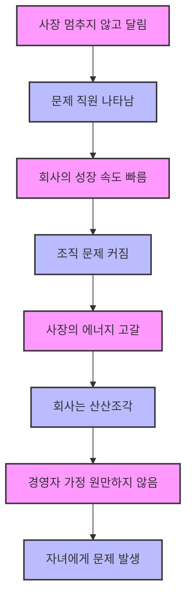
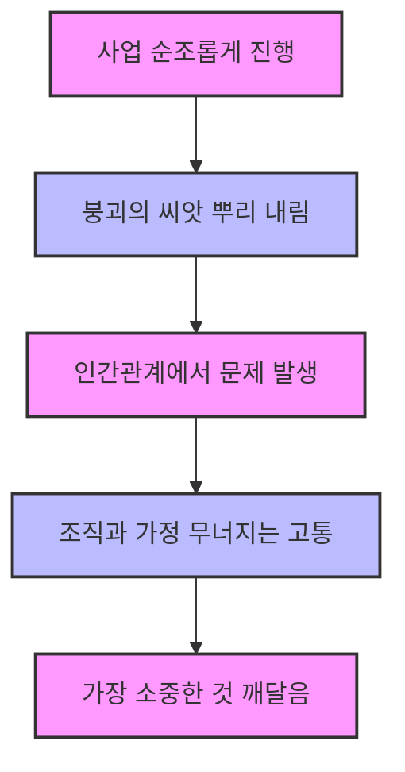
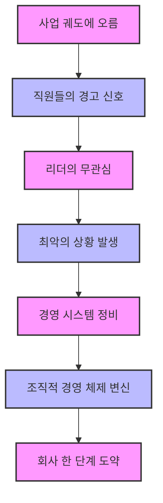

## 1. 성공의 이면: 빛과 그림자 
이 책은 학교에서 가르쳐주지 않는 삶의 지혜, 특히 성공 뒤에 숨겨진 어두운 면(그림자)에 대해 이야기하는 책이야. 성공을 향해 달려가는 사람들이 겪을 수 있는 예상치 못한 어려움과 그 극복 방법을 소설 형식으로 풀어내고 있어.

### 1.1. 간다 마사노리: 천재 사업가의 고백 

1. **일본의 천재 사업가**: 간다 마사노리는 일본에서 천재 사업가이자 최고의 경영 컨설턴트로 불리는 사람이야. 
  1. 그는 1만 명이 넘는 CEO들에게 성공 노하우를 전수했고, 수천억 대의 자산을 가진 부자 아빠이자 베스트셀러 작가이기도 해. 
  2. 30대 초반에 이미 이 책의 내용을 파악하고 저술했다는 사실에 많은 사람들이 놀라워해. 
2. **화려한 경력 뒤의 좌절**: 그의 경력은 매우 화려하지만, 그 뒤에는 수많은 위기와 좌절이 숨어 있었어. 
  1. 외무성 관료 시절에는 일류 대학 출신이 아니라는 이유로 주류에 끼지 못했고, 33세에는 명예 퇴직까지 당했어. 
  2. 늦게 시작한 공부와 MBA 취득 후에도 심각한 가정 불화와 이혼 위기를 겪는 등 마음고생이 심했지. 
  3. 하지만 그는 벼랑 끝에서 강한 집념과 동물적인 생존 감각, 탁월한 끈기로 위기를 기회로 만들며 다시 일어섰어. 
3. **경영 **소설의 형태: 이 책은 소설 형식을 빌렸지만, 사실은 저자 자신의 솔직한 인생 고백이라고 할 수 있어. 
  1. 주인공의 입을 빌려 자신이 온몸으로 체득한 성공 메시지를 전달하고 있어. 
  2. "힘내세요. 어떤 상황에서도 열정과 희망을 잃지 마세요. 당신에게도 세 번의 기회가 찾아올 거예요."라는 메시지를 전하고 있지. 

### 1.2. 성공의 함정: 예상치 못한 지뢰밭 

1. **성공 법칙의 맹점**: 우리는 보통 "열심히 노력하면 반드시 성공한다"는 성공 법칙을 굳게 믿어. 
  1. 이 믿음은 틀리지 않아서, 실제로 부자가 되고 꿈을 이루는 경우가 많아. 
  2. 하지만 성공 법칙에는 나오지 않는 것이 있는데, 바로 성공으로 가는 길 곳곳에 숨어 있는 수많은 지뢰들이야. 
  3. 성공이 눈앞에 보일 때쯤이면 이상하게도 그 성공의 크기만큼 큰 고통과 장애물이 나타나. 
2. **개인적인 부분에서 터지는 **지뢰: 이 지뢰들은 사업적인 문제뿐만 아니라, 예상치 못한 아주 개인적인 부분에서 터져 버리는 경우가 많아. 
  1. **자녀의 문제**: 세 살배기 아들이 원인을 알 수 없는 혈소판 감소증으로 입원하거나, 네 살배기 딸이 복통에 시달리는 등 자녀에게 문제가 생기기도 해. 
  2. **가정 불화**: 어느 날 밤늦게 집에 돌아가니 아내의 모습은 보이지 않고 식탁에 이혼 청구서가 놓여 있는 것처럼 가정에 큰 위기가 찾아오기도 해. 
  3. **직원 문제**: 직원들이 메니에르병(어지럼증, 이명, 난청 등이 갑자기 나타나는 질환)으로 쓰러지거나, 업무가 제대로 이루어지지 않아 고객 불만이 쇄도하는 경우도 있어. 
  4. **동료의 죽음**: 가장 친했던 동료 컨설턴트가 심한 우울증에 걸려 스스로 목숨을 끊는 비극적인 일도 발생할 수 있어. 
3. **누구나 겪는 일**: 이런 일들은 "나에게만 일어난 특수 사건"이라고 생각하기 쉽지만, 유감스럽게도 성공으로 가는 길목에서는 누구나 이런저런 장애물에 부딪히게 돼. 
  1. 성공이라는 달콤한 열매만 차지하는 경우는 거의 없어. 
  2. 단기간에 급성장한 회사의 경영자들이 이런 일을 겪는 경우가 많다는 것이 저자의 경험을 통해 얻은 진실이야. 

### 1.3. 성공의 그림자: 매스컴이 말하지 않는 것 

1. **영웅 뒤의 어둠**: 매스컴이나 언론은 성공한 사람의 사업에만 초점을 맞춰서 그들을 영웅으로 만들어. 
  1. 하지만 그 사람의 개인적인 부분에 초점을 맞추면 영웅은 한순간에 추락할 수 있어. 
  2. 마치 동화 '꽃들에게 희망을'에서 애벌레들이 구름 꼭대기에 가면 행복할 줄 알았는데, 막상 올라가 보니 힘들어하고 바닥으로 떨어지는 모습과 같지. 
2. **가정의 문제**: 성공한 사람들의 가정은 겉보기와 다르게 정상적이지 않은 경우가 많아. 
  1. 가족관계 단절, 가정 폭력, 이혼, 불륜, 자녀의 등교 거부, 학교 폭력, 은둔형 외톨이, 우울증 등 다양한 문제가 발생할 수 있어. 
  2. TV 아침 프로그램에서 다루는 청소년 범죄는 주로 사회적 지위가 높은 가정에서 일어나는 경우가 많다고 해. 
3. **진실을 은폐하는 이유**: 성공하면 그만큼 고통도 늘어난다는 이야기는 아무도 좋아하지 않아. 
  1. 열심히 사는 사람일수록 이런 이야기는 미신이라고 믿고 싶어 하지. 
  2. 좋은 이야기만 하면 말하는 사람도 듣는 사람도 마음이 편하고, 책도 더 많이 팔릴 거야. 
  3. 하지만 빛이 있으면 그림자도 있듯이, 비즈니스 성공에도 어두운 측면이 있지만, 아무도 이 사실을 언급하고 싶어 하지 않아. 
  4. 이 책은 그 어두운 주제에 한 걸음 더 깊이 들어가서 진실을 이야기하려고 해. 

## 2. 성공의 패턴과 예측: 지뢰밭을 헤쳐나가는 지혜 
이 책은 성공으로 가는 길에 숨어 있는 지뢰들을 피하는 방법을 가르쳐주기보다는, 그 지뢰들을 멋지게 극복하는 방법을 알려줘. 모든 회사와 가정에서 나타나는 문제에는 일정한 패턴이 있기 때문에, 이 패턴을 알면 미래를 예측하고 대비할 수 있어.

### 2.1. 기업 성장 시나리오의 패턴 

1. **예측 가능한 문제**: 기업의 성장 시나리오는 생각보다 복잡하지 않아. 
  1. 무대와 배우만 다를 뿐, 기본적인 패턴은 고작 서너 가지에 불과하다고 해. 
  2. 마치 수십만 편의 영화 시나리오가 모두 달라 보이지만, 실제로는 몇 종류의 전개 패턴밖에 없는 것과 같아. 
  3. 특히 90% 이상은 신화학자 조지 캠벨이 분석한 '영웅의 성장 이야기' 패턴을 따르고 있지. 
  - '스타워즈', '타이타닉', '귀여운 여인', '센과 치히로의 행방불명' 같은 영화들이 모두 비슷한 시나리오 전개 패턴을 가지고 있어. 
  - 우리는 무대와 배우만 다른 똑같은 패턴의 영화를 질리지도 않고 계속 돈을 내면서 보고 있는 셈이야. 
2. **패턴에 농락당하는 경영자**: 경영자들은 다른 회사와 비슷한 패턴으로 나아가면서도 자기 회사만의 독자적인 길을 걷고 있다고 착각하는 경우가 많아. 
  1. 패턴을 보지 못하기 때문에 똑같은 잘못을 저지르고, 문제가 겉으로 드러날 때까지 아무런 조치도 취하지 않아. 
  2. 결국 다른 회사와 똑같이 가족들이나 직원들이 희생되는 결과를 낳게 되지. 
3. **패턴을 아는 것의 중요성**: 패턴을 아는 것이 문제가 전혀 없다고 할 수는 없지만, 패턴을 보지 못해서 농락당할 위험이 훨씬 더 커. 
  1. 패턴을 알면 그 패턴에서 빠져나올 수 있고, 나아가는 길에 지뢰가 숨어 있다는 사실을 알고 있으면 미리 대처할 수 있어. 
  2. 성공의 길에 숨어 있는 고난과 장애물은 피할 수 없지만, 멋지게 극복할 수는 있어. 
  3. 하나하나 극복하다 보면 아름다운 풍경을 만날 수 있고, 이는 성공이라는 목표를 향해 나아가도록 사람을 부추기지. 

### 2.2. 기업 라이프사이클과 문제 예측 

1. **기업 라이프사이클**: 기업의 라이프사이클(생애 주기)을 보면 어떤 문제가 언제 발생할지 어느 정도 예측할 수 있어. 
  1. 놀랍게도 회사에 적용되는 라이프사이클 패턴은 우리의 삶의 패턴과 매우 유사해. 
  2. 나타나는 문제들도 그 패턴과 유형에 따라 쭉 등장하는 것을 보면, 삶의 패턴을 이해하는 것이 정말 중요하다고 할 수 있지. 
2. 성장** 단계별 문제 패턴**: 이 책에서는 사업의 성장 과정과 가정과의 관계를 4단계로 나누어 설명하고 있어. 
  1. **1단계: 성공을 향한 첫걸음**: 일은 힘들지만, 가정은 아직 원만한 시기야. 
  2. **2단계: 성공을 향해 나아감**: 일은 순조롭지만, 가정에서는 서서히 균열이 생기기 시작해. 
  - 이 균열은 가정에서 가장 취약한 부분, 특히 아이를 통해 나타나는 경우가 많아. 
  3. **3단계: 성공의 최종 목표 갈림길**: 일은 순조롭지만, 인간관계에서 문제가 발생해. 
  - 가정에서는 부부가 더 이상 서로 아무것도 기대하지 않음으로써 균형을 유지하는 체념 분위기가 될 수 있어. 
  4. **4단계: **일과 가정의 균형** 회복**: 일에서는 남을 지도하는 자리에 서게 되고, 가정에서는 주도권 분쟁 관계에서 상호 의존의 관계로 발전하게 돼. 
3. **패턴을 통한 예측**: 이런 패턴을 알게 되면 성공으로 가는 길에 숨어 있는 일들을 예측할 수 있고, 성공과 좌절에 대한 자서전을 보면 이 소설에 나오는 패턴과 놀라울 정도로 일치한다는 사실을 깨닫게 될 거야. 

### 2.3. 문제 직원의 패턴과 가정 문제 

1. **문제 직원의 등장**: 사장이 멈추지 않고 계속 달리기만 하면, 마치 그것을 제지하려는 듯이 문제 직원이 나타나. 
  1. 회사의 성장 속도가 빠를수록 조직의 문제는 더 커지게 돼. 
  2. 사장의 에너지가 고갈되면 회사는 산산조각으로 분해될 수 있어. 
2. **조직의 균열**: 수평 조직은 대부분 사장의 카리스마(강력한 리더십)로 운영되는 경우가 많아. 
  1. 창업 당시부터 있던 직원들이 사장 주위에 진을 치고, 관리부 직원들 중에는 사장이 시키는 대로 일하는 예스맨(시키는 대로만 하는 사람)이 많을 수 있어. 
  2. 이런 상태로 계속 성장하다 보면 얼마 가지 않아서 조직에 균열이 생길 수 있지. 
  3. 회사의 혼란에 불을 당기는 사람은 뜻밖에 사장이 가장 신뢰하는 오른팔인 경우가 많아. 
  4. 창업할 때부터 사장 주위에는 예스맨만 모이기 때문에, 도중에 입사한 직원은 따돌림당하기 일쑤야. 
3. **가정 문제와의 연관성**: 경영자의 가정은 원만하지 않은 경우가 많고, 특히 자녀에게 문제가 있는 경우가 많아. 
  1. 사장의 아버지가 매우 엄격한 사람이어서, 사장이 아버지에 대한 분노를 해결하지 못한 경우가 많다고 해. 
  2. 이런 정보들만으로도 경영자의 가정생활은 물론, 조직에서 지뢰가 폭발하는 타이밍까지 예측할 수 있어. 

## 3. 성공을 위한 세 가지 핵심 강조점 
이 책은 성공을 향해 나아가는 사람들이 꼭 알아야 할 세 가지 중요한 점을 강조하고 있어. 사업 모델의 발전 과정, 사업 초기 딜레마 극복, 그리고 성공할 때 싹트는 붕괴의 씨앗에 대한 이야기야.

### 3.1. 사업 모델의 발전 과정 

1. **아이디어의 확장**: 중요한 것은 비즈니스가 성공하느냐 아니냐가 아니야. 
  1. 주인공이 '홈페이지 제작'이라는 사소한 아이디어에서 출발해서 어떤 식으로 그 업계를 만들고, 그곳의 리더가 되느냐는 것이 중요해. 
  2. 이런 식으로 발상을 확대해서 한 걸음 앞으로 나아가는 사람이 늘어나면 앞으로 몇 가지 새로운 사업이 탄생할 것이라고 믿어. 
  3. 마치 작은 씨앗이 자라서 큰 나무가 되고, 그 나무에서 또 다른 가지들이 뻗어나가는 것처럼 말이야.

### 3.2. 사업 초기 딜레마 극복 

1. **창업자의 공통 문제**: 사업이 원만하게 자리를 잡을 때까지 주인공은 두 가지 문제에 부딪히게 돼. 
  1. **마케팅 문제**: 어떻게 예상 고객을 모으느냐는 문제야. 
  2. **영업 문제**: 어떻게 예상 고객과 계약하느냐는 문제야. 
2. **포기하지 않는 자세**: 이 문제들은 모든 창업자가 직면하는 문제인데, 해결 방법을 모르기 때문에 대부분 성공으로 가는 길을 포기해 버려. 
  1. 성공이 바로 코앞까지 와 있는데도 그 직전에 포기하는 경우가 많지. 
  2. 창업하는 사람은 누구나 넘어질 수 있다는 사실을 기억해 두면, 필요 이상으로 좌절하지 않고 사업을 원만하게 발전시킬 수 있을 거야. 
  3. 마치 마라톤 선수가 눈을 가리고 달리는 것과 같아. 자기가 맨 앞에서 달리는 것을 모르고 도저히 승리할 수 없다며 제풀에 지쳐 코스에서 이탈하는 꼴이지. 

### 3.3. 붕괴의 씨앗: 성공할 때 싹트는 위험 

1. **인간관계의 붕괴**: 붕괴의 씨앗은 사업이 순조롭게 진행될 때 이미 뿌리를 내리고 있어. 
  1. 이 붕괴는 가장 먼저 인간관계에서 나타나. 
  2. 아직 경험하지 못한 사람들은 쉽게 이해할 수 없을지도 몰라. 마치 실연을 당해보지 않으면 그 고통을 알 수 없는 것처럼, 조직과 가정이 무너지는 고통은 직접 겪어보지 않으면 알 수 없지. 
  3. 하지만 우리는 원래 괴로운 경험을 통해 가장 소중한 것이 무엇인지 깨닫게 돼. 
2. **사전 지식의 중요성**: 이 세 번째 사항의 중요성은 아무리 강조해도 지나치지 않아. 
  1. 이에 대한 사전 지식이 없기 때문에 성공을 향해 달리는 많은 사람이 골인 지점 직전에 발목을 잡히게 돼. 
  2. 그러므로 가슴으로 와닿지 않더라도 반드시 읽어두는 것이 좋아. 
  3. 그러면 자신이 넘어지려고 할 때, 예전에 그 책에서 한 말이 이것이었나 하는 깨달음을 얻는 동시에 적절히 대처할 방법도 찾을 수 있을 거야. 

## 4. 성공 다이어리: 지뢰밭을 헤쳐나가는 지침 
이 책은 성공으로 가는 길에 놓인 지뢰들을 피하고, 위기를 극복하며, 진정한 행복을 찾는 방법을 알려주는 지침서와 같아. 마치 보물 지도를 보면서 위험한 곳을 피해가는 것처럼 말이야.

### 4.1. 내 인생의 멘토를 찾아라 

1. **멘토의 중요성**: 나의 성공은 인생의 스승(멘토)을 만나면서 가능했어. 
  1. 그냥 스쳐 지나갈 수도 있는 우연한 만남을 행운으로 바꾸고, 그 속에서 인생의 멘토를 찾아내는 것이 성공으로 가는 첫걸음이야. 
  2. 마치 길을 잃었을 때 나침반을 보고 방향을 찾는 것처럼, 멘토는 우리에게 올바른 방향을 제시해 줄 수 있어.
2. 긍정적인 생각: 어떤 일이든 긍정적으로 생각하고, 언짢은 일이라도 긍정적인 방향으로 마음을 바꿔 먹어야 해. 
  1. 부정적이고 파괴적인 생각은 잠재의식(우리가 의식하지 못하는 마음속 깊은 곳) 속에서 부정적으로 작용해서 언젠가 현실로 나타나게 돼. 
  2. 마치 씨앗을 심는 것과 같아. 좋은 씨앗을 심으면 좋은 열매를 맺고, 나쁜 씨앗을 심으면 나쁜 열매를 맺는 것처럼 말이야.
3. **타이밍과 다이아몬드 원석**: 100% 완벽하게 준비하려다가 중요한 타이밍을 놓치지 말아야 해. 
  1. 언제 시장에 뛰어드느냐가 일의 성패를 결정하거든. 이미 무르익은 시장보다는 성장기에 있는 사업, 이제 막 상승곡선을 타기 시작하는 분야를 선택해야 해. 
  2. 마치 아직 덜 알려졌지만 크게 성장할 가능성이 있는 '다이아몬드 원석'을 찾는 것과 같아. 
  3. 신규 사업을 생각할 때 사람들은 대부분 눈앞에 있는 평범한 돌멩이를 열심히 줍지만, 성공하려면 그 속에 섞여 있는 다이아몬드 원석을 찾아야 해. 
4. **좋아하는 일**: 남들이 아무리 권해도 내가 망설여지는 분야라면 절대로 하지 마. 
  1. 자신이 좋아하는 일로 시작해야 성공할 수 있어. 오직 돈을 벌기 위해 사업을 시작하면 오래가지 못하거든. 
  2. 열정을 쏟을 수 있는 일을 선택한 후, 그 위에 비즈니스 시스템(사업을 효율적으로 운영하는 체계)을 만들어 양쪽 수레바퀴를 함께 돌려야 해. 
  3. 마치 좋아하는 게임을 할 때 밤새도록 해도 지치지 않는 것처럼, 좋아하는 일을 해야 꾸준히 할 수 있다는 뜻이야.
5. **미래를 스스로 만들어라**: 상황에 끌려다니지 말고 스스로 자신의 미래를 만들어나가야 해. 
  1. 미래를 예측할 수 있는 가장 정확한 방법은 미래에 할 일을 스스로 결정하고 추진해나가는 것이야. 
  2. 우연한 만남이나 일도 단순한 우연이 아니라 당신에게 찾아온 기회나 운명일 수 있으니 신경 써야 해. 
  3. 마치 내가 직접 배의 키를 잡고 항해하는 것처럼, 내 인생의 방향을 스스로 정해야 한다는 말이지.
6. **유연성과 이익**: 간판이나 직위(사회적 지위)에 매달리지 말고 시대의 변화에 적응할 수 있는 유연성(변화에 잘 대처하는 능력)을 길러야 해. 
  1. 현재 가지고 있는 것을 꽁꽁 틀어쥐는 데 급급해하지 말고, 모든 것을 다 버리고 다시 시작할 수 있다는 강한 마음가짐이 필요해. 
  2. 비즈니스에서 이익(돈을 버는 것)은 기쁨이야. 기름이 충분하지 않으면 자동차가 움직일 수 없듯이, 이익이 충분하지 않으면 사업도 인생도 지속할 수 없어. 
  3. 마치 유연한 갈대가 강한 바람에도 꺾이지 않는 것처럼, 변화에 유연하게 대처해야 살아남을 수 있다는 뜻이야.
7. **시간 관리와 고객의 소리**: CEO(최고 경영자)가 빠지기 쉬운 가장 큰 함정은 성공의 길에 들어서면서부터 지나치게 바빠지는 것이야. 
  1. 이것은 발에 무거운 족쇄(움직임을 제한하는 도구)를 다는 것과 같아서, 족쇄를 채우고는 제대로 일을 할 수 없지. 
  2. 고객이 없으면 공짜 상품을 주더라도 고객을 만들어야 해. 사업에서 현금(돈)을 필요로 한다면 고객의 목소리는 호흡과 같아. 
  3. 마치 숨을 쉬지 않으면 살 수 없듯이, 고객의 목소리를 듣지 않으면 사업을 유지할 수 없다는 말이야.

### 4.2. 성공의 순간, 반드시 가족과 함께 하라 

1. **가족 우선**: 아무리 바빠도 우선순위 목록에서 가족을 빠뜨리지 마. 
  1. 일을 위해 가정이 있는 것이 아니라, 가족의 행복을 위해 일이 있다는 사실을 잊어서는 안 돼. 
  2. 아무리 큰 프로젝트가 있어도 반드시 가족과 함께하는 시간을 만들어야 해. 바쁘다는 핑계로 가족을 팽개쳤다가는 가정이 흔들리면 일할 의욕조차 없어지거든. 
  3. 마치 집의 기둥이 흔들리면 집 전체가 무너지는 것처럼, 가정이 흔들리면 모든 것이 무너질 수 있다는 뜻이야.
2. **배우자의 고독**: 한쪽이 승승장구(크게 성공)하면 다른 쪽은 점점 고독(외로움)해지기 마련이야. 
  1. 이것은 주역(동양 철학의 원리)의 원리처럼, 모든 것에는 음과 양이 있어서 한쪽이 강해지면 다른 쪽은 약해지는 경향이 있다는 말이지. 
  2. 배우자와 누가 더 가정을 위해 희생하느냐는 어리석은 싸움을 하지 마. 그런 싸움은 결국 두 사람 모두를 힘들게 할 뿐이야. 
  3. 마치 시소처럼 한쪽이 너무 올라가면 다른 쪽은 너무 내려가는 것처럼, 부부 관계도 균형이 중요하다는 뜻이야.
3. **아이의 경고 신호**: 아이가 폭력을 휘두르거나 병에 걸리거나 사고를 당하는 것은 부모에게 보내는 경고 신호야. 
  1. 이것은 집단 무의식(사람들이 공유하는 무의식적인 생각이나 감정) 내에서 발생하는 시그널(신호)로 파악할 수 있어. 
  2. 배우자에게 분노를 쏟아내지 마. 배우자에게 분노를 쏟아내면 상대는 그 억울함과 분노를 다시 자식에게 쏟아내게 되거든. 
  3. 마치 도미노처럼 한쪽에서 시작된 문제가 연쇄적으로 다른 곳으로 퍼져나갈 수 있다는 뜻이야.
4. **자기혐오와 **플러스 사고: 아무리 힘들어도 자기혐오(자신을 미워하는 감정)에 빠지지 마. 
  1. 혐오감과 죄책감은 인생의 다음 단계로 넘어가는 시간을 지연시킬 뿐이야. 
  2. 지나친 플러스 사고(무조건 긍정적으로만 생각하는 것)는 경계해야 해. 지나친 플러스 사고는 가정에서나 회사에서나 반드시 그 넘치는 양만큼 마이너스 사고(부정적인 생각)를 만들어내거든. 
  3. 마치 고무줄을 너무 세게 당기면 끊어지는 것처럼, 너무 한쪽으로만 치우치면 반대쪽으로 튀어 오르는 현상이 발생한다는 말이지.
5. **평상심과 오만 버리기**: 평상심(평온한 마음)을 유지하며 꾸준히 당신의 길을 걸어가야 해. 
  1. 혼자서 모든 일을 다 하겠다는 오만(자만심)을 버려야 해. 
  2. 혼자서 좌충우돌(이리저리 부딪히며 헤매는 것)하며 모든 일을 일일이 챙기다 보면, 뛰어난 아이디어가 생각나도 그것을 구체화할(실제로 만들) 시간이 없어. 
  3. 마치 오케스트라의 지휘자가 모든 악기를 혼자 연주하려 하지 않고, 각 악기 연주자들에게 역할을 맡기는 것처럼, 혼자 모든 것을 하려 하지 말고 역할을 나누는 것이 중요하다는 뜻이야.

### 4.3. 숨어있는 경고 신호를 놓치지 마라 

1. **위기의 기회**: 사업이 어느 정도 궤도(안정적인 단계)에 오르면 직원들의 쿠데타(반란), 횡령(돈을 빼돌리는 것), 자금 압박(돈이 부족해지는 상황) 등 뜻하지 않은 위기들이 줄줄이 나타나. 
  1. 하지만 이런 위기를 해결해가는 과정에서 회사는 오히려 한 단계 더 성장할 수 있어. 
  2. '위기는 곧 새로운 기회'라는 말이 괜히 나온 게 아니지. 
  3. 마치 겨울이 지나야 봄이 오고, 폭풍우가 지나야 맑은 하늘이 보이는 것처럼, 위기를 겪어야 더 크게 성장할 수 있다는 뜻이야.
2. **경고 신호에 귀 기울이기**: 주위 사람들이 보내는 경고 신호를 무시하지 마. 
  1. 직원들이 병에 걸리거나 힘들어하는 경고 신호를 알아차리지 못하고 리더가 돈이나 실적에만 신경을 곤두세우면, 얼마 지나지 않아 최악의 상황에 빠지게 돼. 
  2. 사업이 어느 정도 자리를 잡으면 경영 시스템(회사를 운영하는 체계)을 정비하고 목표를 새롭게 정하는 등 조직적 경영 체제(체계적인 회사 운영 방식)로 변신해야 해. 
  3. 주인공은 가업(가족 사업)을 기업(체계적인 회사)으로 전환하는 단계에서 많은 어려움을 겪었지만, 그것은 회사의 지속적인 성장 발전을 위해 꼭 필요한 과정이었어. 
  4. 마치 자동차가 고장 나기 전에 경고등이 들어오는 것처럼, 직원들의 어려움은 회사의 문제점을 알려주는 경고 신호라는 말이지.
3. **시스템 경영**: CEO는 머리로만 경영하지 말고 경영을 시스템화(체계적으로 만드는 것)해야 해. 
  1. 공적인 업무 처리 과정은 물론, 직원과 고객의 감정을 소중히 하는 소프트한 부분까지 시스템화해야 해. 
  2. 경영 방식은 주로 '부엉이 스타일'(고객의 욕구를 채워주는 방식)로 하되, '호랑이 스타일'(강력한 추진력으로 밀어붙이는 방식)도 혼용해야 해. 
  3. 고도 성장기에는 물건을 만들기도 전에 고객의 수요가 많았으므로 호랑이 스타일이 효과적이었지만, 성숙기 이후에는 고객의 욕구를 채워주지 않으면 매출이 오르지 않으므로 부엉이 스타일이 더 효과적이야. 
  4. 마치 요리사가 레시피(조리법)대로 요리하되, 손님의 취향에 맞춰 양념을 조절하는 것처럼, 경영도 시스템과 유연성을 함께 가져가야 한다는 뜻이야.
4. **클레임(불만) 대응**: 클레임(고객 불만)을 따져보고 그에 맞춰 대응해야 해. 
  1. 요즘 클레임은 더 이상 상품에 대한 불만이 아니라, 고객이 소중히 대접받지 못한다고 느낄 때 발생하는 것이니, 불평을 제기하는 고객에게 진심으로 고마워해야 해. 
  2. 고객의 분노를 끝까지 들어준 다음, "어떻게 해드리면 납득하시겠어요?"라는 말 대신 "어떻게 되면 만족하시겠어요?"라고 말해야 해. 
  3. 전자의 질문은 고객의 내면에 반발감을 일으킬 수 있지만, 후자의 질문은 부드럽게 상황을 해결할 수 있도록 도와주거든. 
  4. 마치 화난 친구의 이야기를 끝까지 들어주고, "어떻게 하면 네 기분이 풀릴까?"라고 묻는 것처럼, 고객의 감정을 이해하고 만족시키는 것이 중요하다는 뜻이야.
5. **조직 문화와 **크레도: 조직을 만들 때는 부모가 아이를 키우듯이 해야 해. 
  1. 어머니의 사랑이라는 토대 위에 아버지의 규율(규칙)을 세워야 완벽한 팀을 만들 수 있어. 
  2. 흩어져 있는 구성원들의 마음을 하나로 모으는 '뉴 게임'(새로운 게임)을 실시해야 해. 
  3. 이 게임을 통해 팀은 긍정적인 사고로 똘똘 뭉친 최고의 팀으로 변신할 수 있어. 
  4. 팀원 한 사람 한 사람이 모두 소중한 존재라는 것을 느끼게 해야 해. 숫자나 실적에만 관심을 쏟지 말고, 함께 일하는 직원들의 감정에 초점을 맞춰야 해. 
  5. '크레도'(회사를 운영하는 신조나 원칙)를 만들어 실천해야 해. 크레도는 "뭐뭐 해서는 안 된다"보다는 "뭐뭐 한다"는 식의 긍정적인 말로 만드는 것이 좋아. 
  6. 마치 가족이 함께 지켜야 할 가훈을 정하고, 서로 사랑하고 존중하는 마음으로 살아가는 것처럼, 회사도 명확한 원칙과 따뜻한 마음으로 운영해야 한다는 뜻이야.

### 4.4. 행운은 내 곁에 아주 가까이 와 있다 

1. **생각의 습관**: 생각도 습관이야. 어떤 사건이든 긍정적으로 해석하는 습관을 갖도록 노력해야 해. 
  1. 아무리 끔찍한 상황이 일어나더라도 최선의 길을 향해 나아갈 때 필연적으로(반드시) 생기는 일이라고 믿어야 해. 
  2. 마치 비가 온 뒤에 땅이 더 굳어지는 것처럼, 어려운 일을 겪으면서 더 강해질 수 있다는 뜻이야.
2. **자신을 믿어라**: 내 문제를 풀 사람은 나밖에 없어. 마찬가지로 나의 엄청난 잠재력(숨겨진 능력)을 끌어낼 사람도 나밖에 없지. 
  1. 자신을 믿고, 나는 어떤 장애물도 극복할 수 있는 지혜와 용기를 가졌다고 확신해야 해. 
  2. 우리 내면에는 '미운 오리 새끼'가 아닌 '백조'의 모습이 숨어 있어. 그 백조 안에 깃들어 있는 생명력을 인식할 때, 우리는 어떤 어려움도 극복할 수 있는 힘을 얻게 돼. 
  3. 마치 잠자는 거인을 깨우는 것처럼, 우리 안에 있는 무한한 가능성을 믿고 활용해야 한다는 뜻이야.
3. 부정적인 감정** 해소**: 심각한 상황이 닥쳤을 때 가장 먼저 할 일은 부정적인 감정을 모두 밖으로 내보내는 것이야. 
  1. 최악의 밑바닥까지 떨어지더라도 낙담할(실망할) 필요는 없어. 
  2. 모든 상황을 객관적으로 판단하는 힘, 힘든 순간을 견뎌내는 힘, 잠재력과 내공(내면의 힘)을 길러 다시 날아오를 일만 남았어. 
  3. 마치 영웅의 여정에서 주인공이 맨 바닥까지 떨어졌다가 거기서 변형(트랜스포메이션)을 통해 다시 날아오르는 것처럼, 우리도 어려움을 통해 더 강해질 수 있다는 뜻이야. 
4. **반발하는 목소리에 귀 기울이기**: 새로운 시도에 반발하는 목소리에도 귀를 기울여야 해. 
  1. 공통적으로 쏟아지는 반발이라면 그 안에 분명히 귀담아들을(주의 깊게 들을) 이야기가 있어. 
  2. 구성원들의 가슴속에 쌓인 응어리(해결되지 않은 불만)를 그때그때 풀어주지 않으면 언젠가는 폭발하고 말아. 
  3. 마치 댐에 물이 너무 많이 차면 터져버리는 것처럼, 사람들의 불만을 제때 해소해주지 않으면 큰 문제가 될 수 있다는 뜻이야.
5. **역할 분담과 균형**: 창업자, CEO, 관리자, 실무자, 정리자(문제를 해결하는 사람)를 성장 곡선에 맞게 배치해야 해. 
  1. 각자의 성향에 맞는 조직 내 역할은 따로 있어. 
  2. 도입기(사업 초기)에는 창업자가 아이디어를 내면 실무자가 이를 구축해야 해. 
  3. 성장기에 들어서는 관리자가 일상 업무를 시스템화하고, 조직의 안테나(정보를 감지하는 역할)를 정리자가 문제를 빠르고 정확하게 풀어내야 해. 
  4. 구성원들이 집단 반발을 할 경우, 흥분하지 말고 원인과 갈등 요인을 파악해야 해. 
  5. 창업자, 실무자, 관리자, 정리자의 에너지가 균형을 이룰 때 갈등은 사라져. 
  6. 마치 축구팀에서 공격수, 미드필더, 수비수, 골키퍼가 각자의 역할에 맞춰 움직일 때 최고의 팀워크를 발휘하는 것처럼, 회사도 각자의 역할이 조화를 이룰 때 성공할 수 있다는 뜻이야.
6. **놀이와 아이디어**: 때로는 신나게 놀아야 해. 놀다 보면 새로운 아이디어와 기발한 아이템(상품)이 떠오르거든. 
  1. 리더가 놀아야 조직 내에 신나는 에너지가 흐르는 법이야. 
  2. 기분 좋은 상태를 잘 유지할 때 즐거운 생각이 떠오르고, 이것이 최고의 전략이 될 수 있어. 
  3. 마치 아이들이 놀면서 창의적인 생각을 떠올리는 것처럼, 어른들도 놀이를 통해 새로운 아이디어를 얻을 수 있다는 뜻이야.
7. **리더십과 회사 개념**: 지금은 한 사람의 강력한 리더가 필요한 때가 아니야. 
  1. 창업자, 실무자, 관리자, 정리자가 역할에 맞게 적절히 힘을 발휘할 때 조직 내 진정한 리더십이 뿌리를 내릴 수 있어. 
  2. 회사는 모든 사람이 본래 자기 모습을 발견하는 장소라고 생각해야 해. 
  3. 회사에서나 가정에서나 '야누스'(두 얼굴을 가진 신)처럼 충돌하면 불필요한 에너지를 소모하게 돼. 자연스러운 내 모습이 가장 강한 에너지를 발휘하거든. 
  4. 마치 가면을 쓰고 연기하는 것보다 솔직한 내 모습을 보여줄 때 더 편안하고 강해지는 것처럼, 회사에서도 진정한 나를 발견하고 표현하는 것이 중요하다는 뜻이야.

