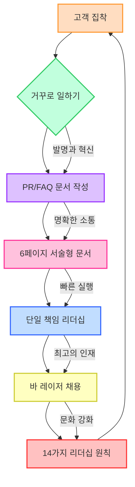

## 아마존의 성공 비결: '거꾸로 일하기' 
이 책은 아마존이 어떻게 혁신적인 기업이 되었는지, 그들만의 독특한 사업 방식과 혁신 접근법을 설명해. 고객의 필요에서 시작해 거꾸로 제품과 서비스를 개발하는 '거꾸로 일하기' 방식을 통해 아마존의 문화, 리더십 원칙, 운영 방식을 배울 수 있을 거야.

## 1. 아마존의 특별한 문화와 리더십 원칙 

아마존은 정말 특이한 회사라고 보면 돼. 다른 회사들이 단기적인 이익이나 경쟁자만 신경 쓸 때, 아마존은 오직 고객에게만 집중하고 아주 먼 미래를 내다보거든.

1. 고객 집착** (**Customer Obsession**)** 
  - 아마존은 고객이 뭘 원하는지, 뭘 불편해하는지 알아내려고 엄청 노력해.
  - 경쟁자도 보긴 하지만, 고객에게 미쳐있다고 할 정도로 고객 만족을 최우선으로 생각하는 거야.
  - 제프 베이조스(Jeff Bezos)는 "고객에게 나쁜 경험 한 번이 수백 번의 좋은 경험을 망칠 수 있다"고 강조했어. 
  - 그래서 항상 '약속은 적게, 제공은 많이' 해서 고객 기대를 뛰어넘으려고 노력해. 
2. **장기적인 사고 (Long-term Thinking)** 
  - 아마존은 당장 눈앞의 이익보다는 5년, 7년, 심지어 10년 뒤를 보고 결정해.
  - 마치 씨앗을 많이 심어 어떤 씨앗이 큰 나무로 자랄지 모르는 것처럼, 여러 아이디어에 장기적으로 투자하는 거지. 
  - 이런 장기적인 관점 덕분에 다른 회사들이 엄두도 못 낼 혁신을 시도할 수 있었어.
3. **발명과 혁신 (**Invent and Simplify**)** 
  - 아마존은 항상 새로운 것을 만들고 복잡한 것을 단순하게 만들려고 해.
  - 발명은 실패와 짝꿍이라서, 실패를 두려워하지 않고 기꺼이 받아들여. 
  - "여기서 발명된 게 아니면 안 돼"라는 생각에 갇히지 않고, 어디에서든 좋은 아이디어를 찾아내려고 해. 
  - 새로운 일을 할 때는 오랫동안 오해받을 수도 있다는 걸 받아들이는 자세가 중요하다고 생각해. 
4. 운영의 탁월함** (Operational Excellence)** 
  - 아마존은 엄청나게 큰 규모의 사업을 효율적으로 운영하는 데 자부심을 느껴.
  - 문제가 생기면 단순히 해결하는 것을 넘어, 그 문제가 다시 발생하지 않도록 근본적인 원인을 찾아 고치는 데 집중해. 
  - 마치 공장에서 불량품이 다음 공정으로 넘어가지 않도록 꼼꼼히 확인하는 것처럼, 모든 과정에서 최고 수준을 유지하려고 노력하는 거야.

## 2. '아마존 방식'을 만드는 핵심 요소: 리더십 원칙과 메커니즘 

아마존은 단순히 좋은 의도만으로는 성공할 수 없다고 믿어. 좋은 의도를 현실로 만드는 반복적인 과정, 즉 메커니즘이 필요하다고 생각하는 거지. 이 메커니즘의 바탕에는 14가지 리더십 원칙이 있어.

1. 리더십 원칙** (**Leadership Principles**)** 
  - 2005년 초, 제프 베이조스는 아마존의 모든 관리자에게 10가지 리더십 원칙을 공식적으로 발표했어. 
  - 이 원칙들은 시간이 지나면서 14가지로 늘어났고, 아마존의 모든 의사결정, 회의, 문서, 채용, 성과 평가에 깊이 스며들어 있어. 
  - 마치 회사의 살아있는 헌법처럼 작동해서, 직원들은 이 원칙들을 매일매일 실천하며 살아가게 돼. 
  - **14가지 리더십 원칙:**
2. 메커니즘** (Mechanisms)** 
  - 아마존에는 "좋은 의도는 작동하지 않고, 메커니즘이 작동한다"는 말이 있어. 
  - 문제가 발생한 근본적인 조건을 바꾸지 않으면, 그 문제는 계속해서 반복될 거라고 믿는 거야. 
  - 메커니즘은 리더십 원칙이 회사에서 매년, 매일 강화되도록 보장하는 일관되고 반복적인 프로세스야. 
  - **예시:**
  - 바 레이저** (**Bar Raiser**) 프로그램:** 최고의 인재를 효율적이고 빠르게 채용하기 위한 방법이야. 
  - **6페이지 분량의 서술형 문서 (**Six-pager** Narrative):** 회의에서 모든 사람이 프로젝트 내용을 빠르고 효율적으로 파악할 수 있도록 돕는 방법이야. 
  - **주간 사업 검토 (**Weekly Business Review**, WBR):** 지표를 통해 사업을 관리하고 개선하는 프로세스야. 

## 3. 아마존의 채용 시스템: 바 레이저 프로그램 

아마존은 회사가 빠르게 성장하면서 채용의 질이 떨어지는 것을 막기 위해 바 레이저**(**Bar Raiser**) 프로그램**이라는 독특한 채용 시스템을 만들었어. 마치 운동 경기에서 '바(bar)'를 점점 높여서 더 뛰어난 선수만 뽑는 것처럼, 아마존은 새로운 직원을 뽑을 때마다 회사의 기준을 더 높이려고 노력하는 거야.

1. 바 레이저** 프로그램의 탄생 배경** 
  - 초창기 아마존은 SAT 점수가 높은 똑똑한 사람들을 뽑으려고 했지만, 그들이 아마존에서 잘 적응할지는 알 수 없었어. 
  - 제프 베이조스는 "돈만 보고 일하는 용병(mercenaries)이 아니라, 사명감을 가진 선교사(missionaries)를 원한다"고 말했어. 
  - 회사가 급성장하면서 "새로운 사람이 또 새로운 사람을 뽑는" 상황이 생겼고, 이로 인해 채용 기준이 낮아질 위험이 커졌어. 
  - **일반적인 채용 문제점:**
  - **급박함 편향 (**Urgency Bias**):** 빨리 사람을 뽑아야 한다는 생각에 후보자의 단점을 간과하는 경향이야. 
  - **확증 편향 (Confirmation Bias):** 자신이 보고 싶은 것만 보고 후보자를 평가하는 거야. 
  - **집단 사고 (Groupthink):** 다른 사람들의 의견에 휩쓸려 독립적인 판단을 하지 못하는 거야. 
  - **개인 편향 (Personal Bias):** 개인적인 선호나 편견으로 후보자를 평가하는 거야. 
  - **공식적인 절차와 교육 부족:** 체계적인 채용 과정이 없으면 좋은 인재를 뽑기 어려워. 
2. **바 레이저 프로그램의 핵심** 
  - **목표:** 확장 가능하고, 반복 가능하며, 가르칠 수 있는 공식적인 채용 프로세스를 만들어 일관되게 성공적인 채용 결정을 내리는 거야. 
  - **바 레이저의 역할:**
  - 각 채용 과정(인터뷰 루프)에 배정되는 특별한 사람이야. 
  - 채용 관리자나 해당 팀 소속이 아니어서 객관적인 시각을 유지할 수 있어. 
  - 오직 채용 기준을 지키는 '수호자' 역할을 해. 
  - 이름처럼 "모든 신입 사원은 회사의 기준을 높여야 한다"는 메시지를 전달해. 
  - **거부권 (Veto Power):** 바 레이저는 채용 관리자가 아무리 원해도 채용을 막을 수 있는 강력한 권한을 가지고 있어. 
  - 하지만 실제로는 거부권을 거의 사용하지 않아. 대신 질문을 통해 팀원들이 스스로 올바른 결정을 내리도록 돕는 역할을 해. 
3. **바 레이저 채용 과정 8단계** 
  1. **직무 기술서 (Job Description) 작성:** 채용 관리자가 직무 책임과 필요한 기술을 명확하게 작성해. 바 레이저가 명확성을 검토해. 
  2. **이력서 검토 (Resume Review):** 채용 담당자와 채용 관리자가 이력서를 검토하고, 직무 요구 사항에 가장 잘 맞는 후보자를 선별해. 
  3. **전화 면접 (Phone Screen):** 채용 관리자가 1시간 동안 전화 면접을 진행해. 후보자의 과거 행동 사례를 묻고, 아마존 리더십 원칙과 얼마나 잘 맞는지 평가해. 
  4. **사내 면접 (In-house Interview):** 5~7시간 동안 여러 면접관이 참여하는 심층 면접이야. 
  - 행동 면접** (Behavioral Interviewing):** 후보자의 과거 행동이 아마존 리더십 원칙과 얼마나 잘 맞는지 평가하는 데 중점을 둬. 
  - STAR 기법**:** 면접관은 '상황(Situation), 과제(Task), 행동(Action), 결과(Result)'를 묻는 STAR 기법을 사용해 후보자의 구체적인 경험을 파악해. 
  - **바 레이저의 참여:** 바 레이저는 모든 면접에 참여해서 과정이 잘 지켜지는지 확인하고, 잘못된 채용 결정을 막아. 
  5. **서면 피드백 (Written Feedback):** 모든 면접관은 면접 직후 15분 동안 상세한 서면 피드백을 작성해. 다른 면접관의 의견을 보거나 논의하기 전에 자신의 피드백을 제출해야 편향을 막을 수 있어. 
  6. **결과 보고 및 채용 회의 (Debrief SL Hiring Meeting):** 면접이 끝나면 모든 면접관이 모여 피드백을 공유하고 채용 결정을 내려. 바 레이저가 회의를 주도하고, 채용 관리자의 결정을 검증해. 
  7. **레퍼런스 체크 (Reference Check):** 후보자의 이전 직장 상사나 동료에게 "다시 채용할 의향이 있는가?" 같은 질문을 통해 추가 정보를 얻어. 
  8. **제안 및 온보딩 (Offer through Onboarding):** 채용 관리자가 직접 채용 제안을 하고, 후보자가 회사와 직무에 대해 계속 흥미를 느끼도록 지속적으로 소통해. 

## 4. 빠른 혁신을 위한 조직 구조: 단일 책임 리더십 (Single-threaded Leadership) 

아마존은 회사가 커지면서 생기는 문제, 즉 '조정(coordination)에 너무 많은 시간을 쓰고, 실제 무언가를 만드는(building) 데는 시간을 덜 쓰는' 문제를 해결하기 위해 **단일 책임 리더십(Single-threaded Leadership)**이라는 혁신적인 조직 구조를 만들었어. 마치 여러 개의 실이 엉켜있으면 움직이기 어렵지만, 각 실이 독립적으로 움직이면 훨씬 빠르고 효율적인 것처럼 말이야.

1. **성장과 함께 찾아온 도전: 의존성 문제 (Dependencies)** 
  - 회사가 커지면서 팀 간의 의존성(dependencies)이 너무 많아졌어.
  - **기술적 의존성:** 하나의 소프트웨어를 수정하려면 다른 여러 팀과 조율해야 해서 개발 속도가 느려졌어. 
  - 예를 들어, 아마존의 초기 소프트웨어는 '오비도스(Obidos)'라는 거대한 코드 덩어리였는데, 작은 변경이라도 전체 웹사이트에 영향을 줄 수 있어서 수많은 팀과 조율해야 했어. 
  - **조직적 의존성:** 프로젝트 승인, 우선순위 지정, 공유 자원 할당 등을 위해 여러 부서의 승인을 받아야 해서 일이 지연됐어. 
  - 중앙 데이터베이스 변경을 위해서는 'DB 카발(DB Cabal)'이라는 고위 임원 그룹의 승인을 받아야 하는 등, 과정이 느리고 답답했어. 
  - 이런 의존성은 혁신 속도를 늦출 뿐만 아니라, 직원들의 사기를 떨어뜨리고 혁신적인 아이디어를 추구하기 어렵게 만들었어. 
2. **해결책의 진화: 투 피자 팀에서 단일 책임 리더십으로** 
  - **문제의 본질 파악:** 아마존은 '더 나은 조정'이 아니라 '팀 간 조정 비용 증가'가 진짜 문제라는 것을 깨달았어. 
  - **초기 시도: **투 피자 팀** (Two-Pizza Team)** 
  - 팀원들이 피자 두 판으로 배불리 먹을 수 있을 만큼 작은 규모(보통 6~10명)의 독립적인 팀을 만드는 아이디어였어. 
  - 각 팀은 사업의 한 부분을 소유하고, 자체 목표를 가지며, 허락을 구하지 않고도 혁신할 수 있었어. 
  - 목표는 '더 잘 조정하는 것'이 아니라 '조정을 덜 하고 더 많이 만드는 것'이었어. 
  - **투 피자 팀의 한계:** 
  - 모든 분야(기술, 비즈니스, 재무 등)에 깊은 전문성을 가진 리더를 찾기 어려웠어. 
  - 팀 성과를 측정하는 단일 지표(fitness function)는 너무 단순해서 실제 상황을 제대로 반영하지 못했어. 
  - **진화된 해결책: 단일 책임 리더 (**Single-threaded Leader**, STL)** 
  - **개념:** 한 사람이 하나의 주요 이니셔티브(중요한 프로젝트)에 100% 전념하고, 다른 책임에 얽매이지 않는 거야. 
  - **팀 구성:** 이 리더는 독립적이고 자율적인 팀을 이끌고, 오직 그 하나의 목표 달성에만 집중해. 
  - **제프 윌크(Jeff Wilke)의 설명:** '분리 가능(separable)'하다는 것은 소프트웨어의 API처럼 조직적으로도 거의 분리되어 있다는 뜻이고, '단일 책임(single-threaded)'이라는 것은 다른 어떤 일도 하지 않는다는 뜻이야. 
  - **데이브 림프(Dave Limp)의 명언:** "무언가를 발명하는 데 실패하는 가장 좋은 방법은 그것을 누군가의 파트타임 업무로 만드는 것이다." 
  - **성공 사례: **FBA** (Fulfillment by Amazon)** 
  - 아마존의 물류 창고와 배송 서비스를 외부 판매자들이 이용할 수 있게 하는 FBA 아이디어는 1년 넘게 진전이 없었어. 
  - 여러 팀의 여러 우선순위 중 하나였기 때문에 '모두의 파트타임 업무'였던 거지. 
  - 제프 윌크가 톰 테일러(Tom Taylor) 부사장에게 다른 모든 책임을 내려놓고 오직 FBA에만 집중할 팀을 주자, 그제야 FBA는 엄청난 성공을 거두게 돼. 
  - 이러한 조직 구조 덕분에 아마존은 빠르게 움직이고, 소매업부터 클라우드 컴퓨팅, 디지털 미디어까지 다양한 사업에 진출할 수 있었어. 

## 5. 아이디어 소통 방식: 6페이지 서술형 문서 (Six-Pager Narrative) 

아마존은 대부분의 회사와 달리 아이디어를 개발하고 소통하는 데 **서면 문서**를 훨씬 더 많이 활용해. 특히 **6페이지 서술형 문서(**Six-pager** Narrative)**는 아마존의 중요한 경쟁 우위 중 하나야. 마치 복잡한 설계도를 말로 설명하는 대신, 잘 정리된 도면을 보면서 깊이 있게 논의하는 것과 같다고 보면 돼.

1. **파워포인트(PowerPoint) 금지령의 배경** 
  - 2004년 초, 제프 베이조스는 고위 경영진 회의가 비효율적이라고 느꼈어. 
  - 파워포인트 슬라이드는 복잡한 아이디어를 간략한 글머리 기호(bullet points)와 화려한 그래픽으로만 보여줘서, 깊이 있는 분석과 논의를 방해했어. 
  - 회의의 질이 발표자의 말솜씨에 더 많이 좌우되는 경향이 있었어. 
  - 예일대 교수 에드워드 터프트(Edward Tufte)의 에세이 '파워포인트의 인지 스타일(The Cognitive Style of PowerPoint)'을 읽고, 제프 베이조스는 파워포인트가 복잡한 분석에 적합하지 않다는 결론을 내렸어. 
  - 2004년 6월 9일, 제프 베이조스는 "앞으로는 파워포인트 발표 금지"라는 이메일을 보냈어. 
  - 대신, 모든 아이디어는 **6페이지 분량의 서술형 메모** 형태로 제출되어야 했어. 
  - 제프는 "좋은 4페이지짜리 메모를 쓰는 것이 20페이지짜리 파워포인트를 쓰는 것보다 어려운 이유는, 메모의 서술 구조가 무엇이 더 중요하고 아이디어들이 어떻게 연결되는지에 대해 더 깊이 생각하고 이해하도록 강요하기 때문"이라고 설명했어. 
2. **6페이지 서술형 문서의 특징과 장점** 
  - **표준 형식:** 최대 6페이지 분량으로, 서식에 특별한 기교를 부리지 않아. 추가 정보는 부록으로 첨부할 수 있지만, 회의에서 필수로 읽어야 하는 내용은 아니야. 
  - **깊이 있는 사고 강요:** 글을 쓰는 행위 자체가 발표자가 파워포인트 슬라이드를 만들 때보다 더 깊이 생각하고 아이디어를 종합하도록 만들어. 
  - **논리적 연결:** 잘 쓰인 서술형 문서는 여러 사실과 분석이 어떻게 서로 연결되는지 명확하게 보여줘야 해. 
  - **회의 방식의 변화:**
  - 회의는 인사 후 20~30분 동안 모두가 침묵하며 6페이지 문서를 읽는 것으로 시작해. 
  - 참가자들은 문서를 읽으면서 메모하고 질문을 준비해. 
  - 모두가 읽기를 마친 후에야 토론이 시작돼. 
  - **장점:**
  - **평등한 논의:** 발표자의 말솜씨가 아니라 문서에 담긴 아이디어의 질이 중요해져. 
  - **고품질 의사결정:** 깊이 있는 정보와 분석을 바탕으로 더 나은 결정을 내릴 수 있어. 
  - **명확한 사고:** 글을 쓰는 과정에서 아이디어를 명확하게 정리하고, 예상 질문과 반론을 미리 다루게 돼. 
  - **FAQ 포함:** 종종 FAQ(자주 묻는 질문) 섹션을 포함해서 예상되는 반론이나 오해를 미리 해소하기도 해. 
  - **다양한 활용:** 투자 제안, 인수 계획, 신제품 개발, 사업 업데이트 등 거의 모든 종류의 아이디어를 제시하고 검토하는 데 사용돼. 
3. **피드백과 진실 추구** 
  - 제프 베이조스는 문서를 읽을 때 "모든 문장이 틀렸다고 가정하고, 그렇지 않다는 것을 증명할 때까지 의심한다"고 말했어. 
  - 이는 작성자의 의도가 아니라 내용 자체의 진실성을 파고드는 방식이야. 
  - 이러한 방식은 조직 내 효과적인 소통의 양과 질을 크게 높여줘. 

## 6. 아마존의 발명 과정: '거꾸로 일하기' (Working Backwards)와 PR/FAQ 

아마존의 발명 과정의 정점은 바로 이 책의 제목이기도 한 **'거꾸로 일하기(**Working Backwards**)'** 방식이야. 이건 마치 목적지(고객의 필요)를 먼저 정하고, 그 목적지에 도달하기 위한 경로(제품 개발)를 거꾸로 설계하는 것과 같아. 이 과정의 핵심 도구는 PR/FAQ**(**Press Release/Frequently Asked Questions**)** 문서야.

1. **'**거꾸로 일하기**'의 철학** 
  - 대부분의 회사는 '우리가 무엇을 잘하는가? 기존 기술과 자산으로 무엇을 만들 수 있는가?'라는 질문에서 시작해. (이걸 '기술 중심(skills forward)' 방식이라고 해.) 
  - 하지만 아마존은 '고객이 무엇을 필요로 하고 원하는가? 이상적인 고객 경험은 무엇일까?'라는 질문에서 시작해. 
  - 그리고 그 이상적인 고객 경험을 만들기 위해 필요한 것이 무엇인지 거꾸로 찾아나가. 설령 완전히 새로운 기술을 배우거나 새로운 역량을 구축해야 하더라도 말이야. 
  - 제프 베이조스는 이를 "새로운 근육을 사용해야 한다"고 표현했어. 
2. PR/FAQ** 문서의 역할** 
  - **개념:** 새로운 제품을 개발하기 전에 작성하는 특별한 서술형 문서야. 
  - **프레스 릴리스 (Press Release, PR):** 
  - 제품이 막 출시된 것처럼 작성하는 1페이지짜리 대외 발표문이야. 
  - 제품이 무엇인지, 어떤 문제를 해결하는지, 왜 고객이 당장 사고 싶을 만큼 매력적인지 쉽고 고객 친화적인 언어로 설명해. 
  - 만약 설득력 있는 보도자료를 쓸 수 없다면, 그 아이디어는 충분히 좋지 않다는 신호로 받아들여. 
  - 이는 첫날부터 고객 혜택이 명확하고 강력한지 확인하는 메커니즘이야. 
  - **자주 묻는 질문 (Frequently Asked Questions, FAQ):** 
  - **외부 FAQ:** 고객이나 언론인이 물을 만한 질문들(가격, 작동 방식, 호환성 등)이야. 
  - **내부 FAQ:** 팀과 리더들이 스스로에게 던지는 어려운 질문들(시장 규모, 단위 경제성, 기술적 난관, 외부 의존성 및 관리 방안 등)이야. 
  - 이 FAQ 섹션에서 가장 어려운 고민과 해결책이 나와. 
  - **집중적인 반복 과정:** PR/FAQ 작성은 매우 강도 높은 반복 과정이야. 팀은 10번 이상 초안을 작성하고, 고위 리더들과 여러 번 만나 아이디어를 논의하고 다듬어. 
  - **장점:**
  - **초기 문제 해결:** 가장 어려운 문제들을 종이 위에서 미리 해결하게 해줘. 
  - **비용 절감:** 잘못된 제품을 만들어서 수백만 대의 기기를 리콜하는 것보다 워드 문서를 수정하는 것이 훨씬 저렴해. 
  - **진실 추구:** 가정을 끊임없이 질문하고, 만들고자 하는 것에 대한 완전한 이해를 얻을 때까지 파고들어. 
  - 대부분의 PR/FAQ는 실제 제품으로 출시되지 않아. 하지만 이는 '버그'가 아니라 '기능'이야. 
  - 이 과정을 통해 팀은 새로운 제품 아이디어가 실현 불가능하게 만드는 구체적인 제약과 문제를 진정으로 이해하고 합의할 수 있어. 
  - 리더십과 경영은 '무엇을 할 것인가'보다 '무엇을 하지 않을 것인가'를 결정하는 경우가 많아. 
3. **성공 사례: **킨들** (Kindle) 개발** 
  - **2004년 상황:** 전자책 시장은 작았고, PC 화면으로 읽어야 했으며, 책값도 비싸서 독서 경험이 매우 나빴어. 
  - **'거꾸로 일하기' 적용:** 아마존 팀은 '이상적인 독서 경험은 무엇일까?'라는 질문에서 시작했어. 
  - 기기는 독서 경험을 방해하지 않고, 독자가 책에 완전히 몰입할 수 있도록 해야 한다는 비전을 세웠어. 
  - **어려운 결정들:**
  - **하드웨어 직접 개발:** 아마존은 전자상거래 회사였지, 하드웨어 회사가 아니었어. 하지만 완벽한 고객 경험을 위해 직접 기기를 만들어야 한다고 판단했어. 
  - **e-잉크(e-ink) 스크린 채택:** 당시 신기술이었던 e-잉크는 흑백이고 페이지 전환이 느렸지만, 종이와 비슷하고 햇빛 아래서도 읽을 수 있어서 독서 경험에 더 적합하다고 판단했어. 
  - **상시 연결 (Constant Connectivity):** 컴퓨터에 연결해서 책을 옮기는 '사이드로딩(sideloading)' 방식을 거부하고, 블랙베리처럼 항상 연결되어 자동으로 책을 다운로드할 수 있는 기능을 원했어. 
  - 이를 위해 킨들에 3G 모뎀을 내장하고, '위스퍼넷(Whispernet)'이라는 무료 3G 연결 서비스를 만들었어. 
  - 고객은 60초 안에 어떤 책이든 구매하고 다운로드할 수 있게 되었지. 
  - **저렴한 전자책 가격:** 전자책 시장을 활성화하기 위해 베스트셀러를 9.99달러에 판매했어. 초기에는 아마존이 손해를 봤지만, 장기적으로는 거대한 시장을 만들 것이라는 큰 도박이었어. 
  - **결과:** 킨들은 출시 첫날 6시간 만에 매진되었고, 출판 산업을 영원히 바꿔놓았어. 
4. **성공 사례: **AWS** (**Amazon Web Services**) 개발** 
  - **핵심 사업과 무관한 시작:** AWS는 아마존의 핵심 소매 사업과는 전혀 관련이 없는 분야였어. 
  - **아이디어의 씨앗:**
  - **아마존 어소시에이츠(Amazon Associates) 프로그램:** 제3자 웹사이트가 아마존 제품에 링크를 걸고 수수료를 받는 프로그램이었어. 
  - 2002년, 콜린 브라이어(Colin Bryar) 팀은 제휴사들에게 미리 포맷된 링크 대신 원시 제품 데이터(XML 형식)를 제공하는 실험적인 기능을 출시했어. 
  - 개발자들은 아마존 데이터를 활용해 상상하지 못했던 애플리케이션을 만들기 시작했고, 아마존은 '소프트웨어 개발자'라는 새로운 고객층을 발견했어. 
  - **'차별화되지 않은 고된 작업(**undifferentiated heavy lifting**)'**: 동시에 아마존은 거대한 '오비도스' 소프트웨어 아키텍처를 작은 독립 서비스로 분리하는 작업을 하고 있었어. 이 과정에서 저장, 데이터베이스, 컴퓨팅 파워 같은 확장 가능하고 신뢰할 수 있는 인프라 서비스를 구축하는 데 매우 능숙해졌어. 
  - 이것은 모든 인터넷 회사가 해야 하지만, 고객의 눈에는 제품을 차별화하지 못하는 '고된 기초 작업'이었어. 
  - **두 아이디어의 결합:** 앤디 재시(Andy Jassy)가 이끄는 팀은 이 두 아이디어를 결합했어. '아마존이 자체적으로 구축한 인프라 서비스를 세상에 제공하면 어떨까?' 
  - 이를 통해 어떤 개발자든, 심지어 기숙사 학생까지도 아마존과 동일한 세계 최고 수준의 컴퓨팅 인프라에 접근할 수 있게 되는 거지. 
  - **PR/FAQ를 통한 제품 정의:** S3(Simple Storage Service)와 EC2(Elastic Compute Cloud) 같은 서비스에 대한 PR/FAQ를 작성하면서 엄청나게 어려운 문제들을 해결해야 했어. 
  - **혁신적인 가격 모델:** S3의 초기 가격 모델은 단순한 월별 구독 방식이었지만, PR/FAQ 논의를 통해 개발자들이 서비스를 어떻게 사용할지 예측할 수 없다는 것을 깨달았어. 
  - 그래서 '사용한 만큼만 지불하는(pay-as-you-go)' 유틸리티 방식의 가격 모델을 발명했어. 저장 공간의 바이트 단위, 데이터 전송의 비트 단위까지 사용한 만큼만 지불하는 방식이었지. 
  - **결과:** AWS는 기술 스타트업의 경제학을 완전히 바꿔놓았어. 
  - 이전에는 웹사이트나 앱을 만들려면 비싼 서버를 사고 데이터 센터 공간을 빌리고 관리팀을 고용해야 하는 막대한 초기 자본 투자가 필요했어. 
  - AWS 덕분에 신용카드만 있으면 사업을 시작하고, 사업이 성장함에 따라 인프라를 확장할 수 있게 되었어. 
  - 이는 기업가 정신을 민주화하고 에어비앤비, 슬랙, 넷플릭스 스트리밍 서비스 같은 혁신적인 회사들을 탄생시켰어. 
  - 마이크로소프트, 구글, IBM 같은 기존 거대 기술 기업들도 기술과 자본이 있었지만, 그들은 '기술 중심'적인 시각으로 세상을 보고 있었어. 
  - 아마존은 '고객(개발자)에게서 시작하여 거꾸로 일하는' 방식을 통해 아무도 해결하지 못했던 필요를 발견했고, 핵심 소매 사업과는 전혀 다른 사업을 구축하며 완전히 새로운 산업을 창조했어. 

## 7. 지표 관리: 결과가 아닌 투입에 집중하기 (Manage Your Inputs, Not Your Outputs) 

아마존은 사업을 운영할 때 결과 지표**(Output Metrics)**보다는 **통제 가능한 투입 지표(**Controllable Input Metrics**)**에 집중해. 마치 시험 점수(결과) 자체를 올리려고 하기보다는, 공부 시간이나 문제 풀이량(투입)을 늘리는 데 집중하는 것과 같아. 투입을 잘 관리하면 원하는 결과는 자연스럽게 따라온다고 믿는 거지.

1. **결과 지표와 투입 지표의 차이** 
  - **결과 지표 (Output Metrics):** 주가, 매출액처럼 CEO나 경영진이 직접 통제하기 어려운 지표야. 
  - **투입 지표 (Input Metrics):** 고객 경험 개선 활동, 제품 선택의 폭 확대, 배송 속도 향상 등 직접 통제할 수 있는 활동을 측정하는 지표야. 
  - 아마존은 투입 지표를 잘 관리하면 주가 같은 결과 지표에 긍정적인 영향을 미칠 수 있다고 봐. 
2. **아마존의 성장 동력: **플라이휠** (Flywheel)** 
  - 아마존의 성공을 설명하는 유명한 개념이 바로 '플라이휠'이야.
  - **작동 방식:**
  - 이 플라이휠은 아마존 소매 사업 성공의 주요 측면을 담고 있어.
3. **지표 관리의 5단계 라이프사이클 (DMIC)** 
  - 아마존은 지표를 활용해 사업을 운영하는 데 정해진 규칙은 없지만, 다음과 같은 단계를 거쳐.
  1. **정의 (Define):** 
  - 측정하고자 하는 지표를 선택하고 정의해. 명확하고 실행 가능한 지침을 제공하는 올바른 지표여야 해. 
  - 아마존은 '선행 지표(leading indicators)'인 통제 가능한 투입 지표에 집중해. 
  - 올바른 투입 지표를 찾는 것은 시행착오를 거치는 반복적인 과정이야. 
  - 가장 중요한 것은 '시작하는 것'이야. 대부분의 주간 사업 검토(WBR)는 소박하게 시작해서 시간이 지나면서 크게 개선돼. 
  2. **측정 (Measure):** 
  - 데이터 수집 도구를 정확하게 만드는 데 시간과 노력을 투자해. 
  - 데이터는 여러 시스템에 흩어져 있을 수 있으므로, 이를 취합하고 올바르게 표시하는 데 소프트웨어 자원을 투자해야 해. 
  - 데이터가 실제로 측정하려는 것을 측정하고 있는지 확인하기 위해 '깊이 파고들기(Dive Deep)' 원칙을 적용해. 
  - 지표를 독립적으로 검증하는 정기적인 감사(audit) 프로세스를 갖는 것이 중요해. 
  3. **분석 (Analyze):** 
  - 지표를 움직이는 요인이 무엇인지 포괄적으로 이해하는 단계야. 
  - 데이터에서 '노이즈(noise)'와 '신호(signal)'를 분리하고, 근본 원인을 식별하고 해결하는 것이 목표야. 
  - 아마존 팀은 데이터에서 예상치 못한 문제나 당혹스러운 상황을 발견하면, 근본 원인을 찾을 때까지 끈질기게 파고들어. 
  - 오류 수정**(Correction of Errors, COE) 프로세스:** 도요타의 '5가지 왜(Five Whys)' 방법론을 기반으로 해. 
  - 이상이 발생하면 '왜' 일어났는지 묻고, 근본 원인에 도달할 때까지 '왜'를 반복해서 물어. 
  4. **개선 (Improve):** 
  - 앞선 세 단계를 거쳤다면, 지표를 개선하기 위한 행동이 성공할 가능성이 높아. 
  - 바로 이 단계로 뛰어들면 불완전한 정보로 작업하게 되어 원하는 결과를 얻기 어려워. 
  5. **통제 (Control):** 
  - 프로세스가 정상적으로 작동하고 시간이 지나도 성능이 저하되지 않는지 확인하는 단계야. 
  - 이 단계에서 자동화할 수 있는 프로세스를 식별하기도 해. 
4. **주간 사업 검토 (Weekly Business Review, WBR)** 
  - WBR은 지표가 실제로 적용되는 아마존의 핵심 회의야. 
  - **데이터 패키지 (Deck):** 회의는 그래프, 표, 설명 노트가 포함된 주간 데이터 패키지를 배포하는 것으로 시작해. 
  - 이 패키지는 데이터 기반의 사업 전반에 대한 시각을 제공하며, 주로 차트, 그래프, 데이터 표로 구성돼. 
  - 재무팀이 데이터의 정확성을 인증해. 
  - 모든 엔지니어링, 운영, 사업 부서에서 지표 대시보드와 보고서를 구축하고, 실시간으로 모니터링하며, 장애 발생 시 즉시 알람을 받아. 
  - **회의 진행:**
  - 아마존은 매주 동일한 순서로 동일한 데이터를 보면서 사업 전체를 파악해. 
  - 예상치 못한 '변동(variances)'에 집중하고, 사업 책임자들은 이 변동에 대해 설명할 준비를 해. 
  - 운영 및 전략적 논의는 분리해서 진행해. 
  - 실패를 공개적으로 논의하고 실수로부터 배우는 문화를 장려해. 
  - **깊이 파고들기 (Dive Deep) 원칙의 적용:** 
  - 리더는 모든 수준에서 운영하고, 세부 사항에 연결되어 있으며, 자주 감사하고, 지표와 일화가 다를 때 회의적이야. 어떤 작업도 그들 아래에 있지 않아. 
  - 예를 들어, 아마존의 모든 기업 직원은 2년에 한 번씩 며칠 동안 고객 서비스 상담원으로 일해야 해. 제프 베이조스도 예외가 아니야. 
  - 이를 통해 직원들은 고객의 문제를 직접 경험하고, '안돈 코드(andon cord)'처럼 고객 서비스 상담원이 반복되는 문제 상품을 웹사이트에서 즉시 내릴 수 있는 시스템을 만들기도 했어. 
5. **WBR의 함정** 
  - **회의 관리 부실:** 참석자 수가 너무 많아지고, 추적하려는 지표가 너무 많아지면 회의가 비효율적이고 불쾌해질 수 있어. 
  - 가장 고위직이 회의 분위기와 규칙을 설정하고, 참석자와 지표를 필수적인 것으로 제한해야 해. 
  - 높은 기준과 실수에 대해 편안하게 이야기할 수 있는 분위기 사이의 균형을 잡는 것이 중요해. 
  - **노이즈(Noise)가 신호(Signal)를 가림:** 데이터의 정상적인 변동(노이즈)과 프로세스의 근본적인 변화나 결함(신호)을 구분하는 것이 중요해. 
  - 아마존에서는 지표 소유자가 무엇이 정상적인 변동인지 이해할 책임이 있어. 
  - 경험과 고객에 대한 깊은 이해가 노이즈에서 신호를 걸러내는 가장 좋은 방법이야. 
  - 아마존의 투입 지표는 낮은 가격, 다양한 제품, 빠른 배송, 적은 고객 서비스 문의, 빠른 웹사이트/앱 등 고객이 중요하게 생각하는 것들을 설명해. 

## 8. 아마존의 발명 정신: 장기적인 사고와 고객 집착 

아마존은 단순히 큰 회사가 아니라 '발명 기계'가 되기를 원해. 마치 작은 씨앗이 오랜 시간과 인내를 거쳐 거대한 나무로 자라나는 것처럼, 아마존은 장기적인 관점과 고객에 대한 집착을 바탕으로 끊임없이 새로운 것을 만들어내.

1. **발명과 실패의 관계** 
  - 제프 베이조스는 "우리는 세상에서 실패하기 가장 좋은 곳"이라고 말했어. 
  - 발명과 실패는 떼려야 뗄 수 없는 쌍둥이와 같아. 발명하려면 실험해야 하고, 성공할 것을 미리 안다면 그건 실험이 아니기 때문이야. 
  - 대부분의 대기업은 발명을 원하지만, 그 과정에서 필연적으로 발생하는 수많은 실패를 감당하려 하지 않아. 
  - **실패는 성공의 과정:** 아마존 파이어폰(Firephone)은 엄청난 실패였지만, 거기서 얻은 교훈은 아마존 에코(Echo) 개발에 직접 적용되어 큰 성공을 거두었어. 
  - 아마존에서 실패는 성공의 반대가 아니라, 성공으로 가는 필수적인 단계로 여겨져. 
2. **발명을 이끄는 핵심 요소** 
  - **장기적인 사고 (Long-term Thinking):** 기존 역량을 활용하고, 다른 방식으로는 상상할 수 없는 새로운 일을 가능하게 해. 
  - **검소함 (Frugality):** 고객 경험 개선에 기여하지 않는 곳(예: 전시회 부스, 대규모 팀, 화려한 마케팅)에 돈을 낭비하지 않아. 
  - **인내심 (Patience):** 수년간 인내심을 가지고 신중하게 투자하면 큰 성과를 거둘 수 있어. 
3. **고객 중심의 발명 (Customer-driven Invention)** 
  - 아마존은 '고객의 필요'에서 시작하는 발명 방식을 고수해. 
  - 이는 회사의 기존 기술과 역량에 맞춰 새로운 사업 기회를 찾는 '기술 중심(skills forward)' 방식과는 근본적으로 달라. 
  - 기술 중심 방식은 새로운 기술을 익히거나 새로운 유형의 리더를 고용할 필요성을 느끼지 못하게 해. 
  - 하지만 고객의 필요에서 시작하면, 제프 베이조스의 말처럼 "새로운 근육을 사용해야" 하는 경우가 많아. 처음에는 불편하고 어색하더라도 말이야. 
  - 홈런 한 방이 엄청난 가치를 창출할 수 있기 때문에, 실패를 두려워하지 않고 크게 시도하는 것이 중요하다고 믿어. 

## 9. 아마존 방식 적용하기: 작은 시작과 메커니즘 구축 

아마존 방식은 다른 회사나 조직에도 충분히 적용할 수 있어. 아마존처럼 되는 것이 쉽지는 않겠지만, 회사와 개인 모두에게 분명하고 특별한 보상을 가져다줄 거야. 거창하게 시작할 필요 없이, 작은 것부터 시도해볼 수 있어.

1. **아마존 방식의 보편성** 
  - 아마존 방식은 비즈니스뿐만 아니라 비영리 단체나 지역 사회 조직과 같은 다른 분야에도 적용할 수 있어. 
  - 아마존의 성공은 제프 베이조스 같은 천재 한 명 때문이 아니라, 훌륭한 아이디어가 나오고, 엄격하게 검증되며, 끈질기게 실행될 수 있는 문화와 시스템을 구축했기 때문이야. 
  - 이는 고객 집착을 발명으로 바꾸는 '기계'와 같아. 
2. **실패에 대한 관점** 
  - 아마존에서는 프로젝트가 목표를 달성하지 못하거나 실패로 간주되더라도, 그 노력이 훌륭했고 아마존의 관행과 원칙을 따랐다면 개인에게 해고나 수치심이 따르지 않아. 
  - 실패는 보통 한 개인의 실패라기보다는 그룹, 프로세스, 시스템의 실패로 이해돼. 
  - 회사의 관점에서 실패는 많은 것을 배울 수 있는 '실험'으로 간주되며, 변화와 개선으로 이어질 수 있어. 
  - 아주 자주, 실패는 일시적이며 결국 성공을 낳기도 해. 
3. **아마존 방식 적용을 위한 첫걸음** 
  - **1. 새로운 아이디어가 있다면 PR/FAQ를 작성해봐.** 
  - 단 1페이지짜리 보도자료라도 좋아. 다른 어떤 일을 하기 전에, 고객 혜택을 명확하고 설득력 있게 설명하도록 스스로를 강제하는 거야.
  - 이 한 번의 연습만으로도 몇 주간의 회의보다 더 큰 명확성을 얻을 수 있어.
  - **2. 다음 팀 회의에서 파워포인트를 금지하고 6페이지 서술형 문서를 사용해봐.** 
  - 회의 시작 시 간단한 1페이지짜리 서술형 메모를 배포하고, 모두가 침묵하며 읽게 해봐.
  - 이것이 대화의 질을 어떻게 바꾸는지 직접 경험할 수 있을 거야.
  - **3. 문제가 발생하면 '왜'를 다섯 번 물어봐.** 
  - 단순히 당장의 문제를 해결하는 것을 넘어, 진정한 근본 원인을 찾을 때까지 파고들어.
  - 그리고 다음에는 '이런 실수가 다시는 발생하지 않도록 어떤 메커니즘을 구축할 수 있을까?'라고 스스로에게 질문해봐.

