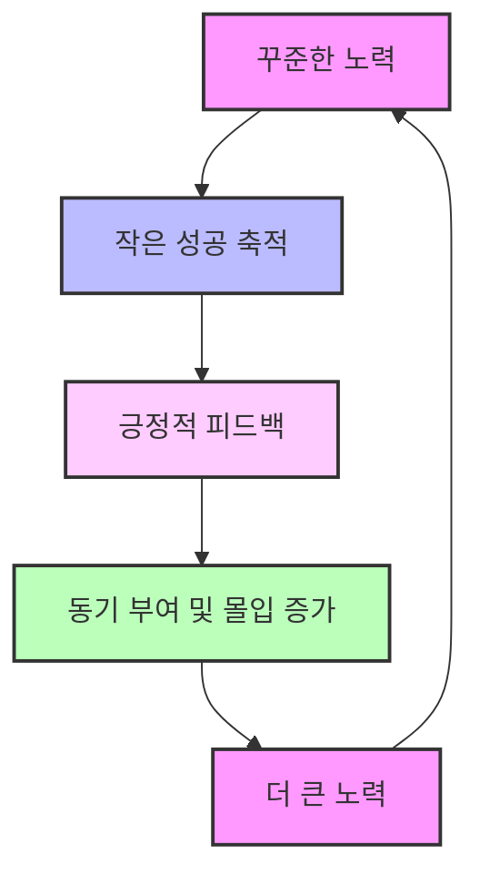
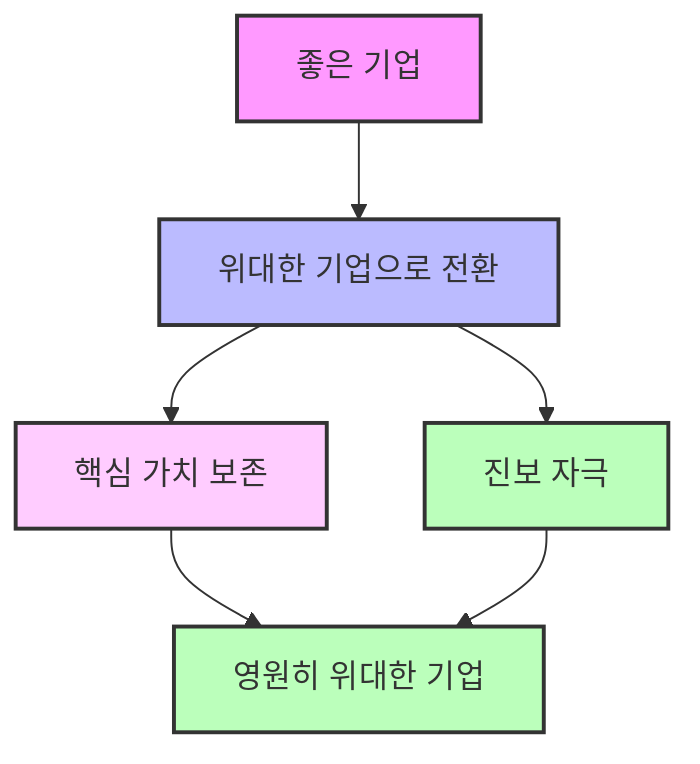

## 좋은 기업을 넘어 위대한 기업으로: 평범함을 뛰어넘는 비결
이 책은 평범한 '좋은' 회사들이 어떻게 '위대한' 회사로 도약하고, 그 위대함을 오랫동안 유지하는지에 대한 비밀을 파헤치는 책이야. 저자인 짐 콜린스와 그의 연구팀이 수많은 기업 데이터를 분석해서 찾아낸, 시대를 초월하는 성공 원칙들을 쉽고 재미있게 알려줄 거야. 마치 평범한 운동선수가 올림픽 금메달리스트가 되는 비결을 알려주는 것과 같다고 보면 돼.

## 1. '좋음'은 '위대함'의 적이다: 왜 우리는 위대해지지 못할까? 

우리는 보통 '좋다'는 말에 만족하고 멈춰버리는 경우가 많아. 하지만 이 책은 '좋음'이 오히려 '위대함'으로 가는 길을 막는 가장 큰 적이라고 말해.

1. **'좋음'에 안주하는 문제**:
  - 교육, 정부, 기업 등 다양한 분야에서 '좋음'에 만족하는 순간, 더 큰 '위대함'을 향한 노력을 멈추게 돼. 
  - 대부분의 회사들이 위대해지지 못하는 이유는 '좋음'에 안주하기 때문이야. 
  - 마치 시험에서 80점만 맞아도 만족해서 더 이상 공부하지 않는 학생과 같다고 보면 돼.

2. **연구의 시작**:
  - 1996년, 빌 미안이라는 사람이 짐 콜린스의 이전 책인 『성공하는 기업들의 8가지 습관(Built to Last)』을 비판하면서 연구가 시작됐어. 
  - 그는 "『성공하는 기업들의 8가지 습관』에 나온 회사들은 처음부터 위대했던 회사들이 대부분인데, 평범한 회사가 위대한 회사로 변할 수 있는지, 그리고 그 방법은 무엇인지"에 대한 의문을 제기했어. 
  - 이 질문이 짐 콜린스의 호기심을 자극했고, '좋은 회사가 위대한 회사가 될 수 있을까? 그렇다면 어떻게?'라는 핵심 질문으로 이어졌어. 

3. **연구 과정**:
  - 5년 동안 연구팀은 '좋은 기업을 넘어 위대한 기업으로' 전환한 회사들의 특징을 분석했어. 
  - 이 연구는 최소 15년 동안 위대한 성과를 유지한 회사들을 집중적으로 살펴봤어. 
  - 마치 보물찾기를 하듯이, 수많은 회사들 중에서 진짜 보석 같은 회사들을 찾아낸 거야.

4. **연구 단계**:
  - **1단계: 회사 찾기**: 재무 성과를 기준으로 '좋은 기업을 넘어 위대한 기업으로' 전환한 회사들을 찾아냈어. 
  - **2단계: 비교 대상 선정**: '좋은 기업을 넘어 위대한 기업으로' 전환한 회사들과 그렇지 못한 회사들을 비교했어. 
  - 마치 쌍둥이처럼 비슷한 환경에 있었지만, 한쪽은 성공하고 다른 한쪽은 실패한 회사들을 비교해서 무엇이 달랐는지 알아본 거야. 
  - **3단계: 블랙박스 들여다보기**: 심층적인 질적, 양적 분석을 통해 위대한 회사들의 차별화 요인을 찾아냈어. 
  - 마치 비행기의 블랙박스를 열어 사고 원인을 분석하듯이, 회사 내부의 비밀을 파헤친 거야.
  - **4단계: 개념 정리**: 수많은 데이터를 정리해서 위대한 조직을 만드는 핵심 원칙들을 체계적인 틀로 만들었어. 

5. **핵심 발견**:
  - 위대한 회사들은 단순히 운이 좋았던 것이 아니라, 의식적인 선택과 훈련(규율)을 통해 위대해졌다는 것을 발견했어. 
  - 마치 운동선수가 타고난 재능뿐만 아니라, 꾸준한 훈련과 노력으로 최고가 되는 것과 같다고 보면 돼.

## 2. 위대한 리더십: 겸손한 의지, 레벨 5 리더십 

위대한 회사에는 특별한 리더가 있었어. 이들은 우리가 흔히 생각하는 카리스마 넘치는 영웅 같은 리더가 아니었어. 오히려 겸손하고 조용하지만, 엄청난 의지를 가진 사람들이었지. 이들을 '레벨 5 리더'라고 불러.

1. **레벨 5 리더의 특징**:
  - **개인적인 **겸손** + 강렬한 직업적 의지**: 레벨 5 리더는 극도로 겸손하면서도, 회사 성공을 위한 강렬한 의지를 가지고 있어. 
  - 마치 조용하고 묵묵히 자기 할 일을 하지만, 목표를 향해서는 누구보다 뜨거운 열정을 가진 사람과 같다고 보면 돼.
  - **회사 성공이 최우선**: 개인적인 명예나 이득보다는 오직 회사의 장기적인 성공과 위대함을 추구해. 
  - 자신이 아닌 '회사'라는 더 큰 목표를 위해 모든 에너지와 야망을 쏟아붓는 거야.
  - **후계자 양성**: 자신의 후임자들이 성공할 수 있도록 미리 준비하고 지원해. 
  - 마치 자신이 떠난 후에도 팀이 계속 잘 나갈 수 있도록 든든한 기반을 만들어주는 감독과 같다고 보면 돼.
  - **성공은 팀 덕분, 실패는 내 책임**: 성공의 공은 팀과 외부 요인에 돌리고, 실패의 책임은 전적으로 자신이 져. 
  - 이것을 '창문과 거울의 원칙'이라고 하는데, 성공했을 때는 창밖을 보며 다른 사람들에게 공을 돌리고, 실패했을 때는 거울을 보며 자신의 책임을 인정하는 거야. 
  - **조용하고 끈질기며 단순함**: 이들은 조용하고, 끈질기게 노력하며, 복잡한 것을 단순하게 만드는 능력이 있어. 
  - 마치 묵묵히 한 우물을 파는 장인과 같다고 보면 돼.

2. **레벨 5 리더의 성장**:
  - 레벨 5 리더는 외부에서 영입되기보다는 회사 내부에서 성장하는 경우가 많아. 
  - 자기 성찰과 노력을 통해 누구나 레벨 5 리더가 될 수 있다고 해. 
  - 마치 씨앗이 자라서 큰 나무가 되듯이, 잠재력을 가진 사람들이 스스로 성장하는 거야.

3. **레벨 5 리더와 다른 리더의 차이**:
  - **레벨 4 리더 (유능한 리더)**: 카리스마가 있고, 비전을 제시하며, 사람들을 이끄는 데 능숙해. 하지만 이들의 야망은 주로 개인적인 성공과 명예에 집중되는 경향이 있어. 
  - 마치 화려한 스포트라이트를 즐기는 스타 플레이어와 같다고 보면 돼.
  - 이들은 회사가 급성장하는 데는 도움이 되지만, 이들이 떠나면 회사가 흔들릴 수 있어. 
  - **레벨 5 리더**: 겸손하고 조용하며, 자신의 명예보다는 회사의 장기적인 성공에 집중해. 
  - 마치 팀의 승리를 위해 묵묵히 뒤에서 지원하는 코치와 같다고 보면 돼.
  - 이들은 회사가 지속적으로 위대해지는 데 결정적인 역할을 해. 

4. **사례: 킴벌리 클라크의 다윈 스미스**:
  - 다윈 스미스는 1971년 킴벌리 클라크의 CEO로 취임했어. 당시 회사는 20년 동안 실적이 좋지 않았어. 
  - 그는 과감하게 수익성이 없는 제지 공장들을 팔아버리고, 그 돈을 '하기스'나 '크리넥스' 같은 경쟁력 있는 소비재 제품에 투자했어. 
  - 그 결과, 킴벌리 클라크는 평범한 제지 회사에서 세계적인 소비재 회사로 탈바꿈했고, 주식 수익률도 크게 올랐어. 
  - 다윈 스미스는 엄청난 성공을 거두었지만, 개인적인 영광을 추구하지 않고 동료들의 성장과 회사의 장기적인 성공에 집중했어. 
  - 마치 자신의 이름을 알리기보다는 팀의 우승컵을 들어 올리는 데만 집중하는 주장과 같다고 보면 돼.

## 3. '누구'를 먼저, '무엇'은 나중에: 사람을 먼저 태워라 

위대한 회사들은 "어디로 갈까?"(무엇)를 정하기 전에 "누구와 함께 갈까?"(누구)를 먼저 결정했어. 즉, 올바른 사람들을 먼저 버스에 태우고, 그 다음에 버스가 어디로 갈지 정하는 거야.

1. **사람이 먼저인 이유**:
  - **적응력 향상**: 올바른 사람들이 모이면, 회사의 방향이 바뀌어도 그들은 기꺼이 변화를 받아들이고 함께 나아갈 수 있어. 
  - 마치 끈끈한 팀워크를 가진 친구들이라면, 어떤 게임을 하든 즐겁게 참여하는 것과 같다고 보면 돼.
  - **내재적 동기 부여**: 올바른 사람들은 스스로 동기 부여가 되어 있고, 스스로 훈련(규율)이 되어 있어. 
  - 리더는 이들을 억지로 동기 부여할 필요 없이, 그들이 능력을 발휘할 수 있는 환경을 만들어주기만 하면 돼. 
  - 비전** 공유**: 올바른 사람들은 스스로 비전을 세우고, 그 비전을 달성하기 위해 노력해. 
  - 마치 각자 목표를 가진 선수들이 모여서 팀의 큰 목표를 함께 만들어가는 것과 같다고 보면 돼.

2. **인력 관리 원칙**:
  - **의심스러울 때는 채용하지 마라**: 새로운 사람을 뽑을 때는 신중하게 판단하고, 조금이라도 의심스러우면 채용하지 말고 계속 찾아봐야 해. 
  - 마치 중요한 팀원을 뽑을 때, 실력뿐만 아니라 인성까지 꼼꼼히 따져보는 것과 같다고 보면 돼.
  - **사람을 바꿔야 할 때는 과감하게 행동하라**: 팀에 맞지 않는 사람이 있다면, 아무리 힘들어도 즉시 조치를 취해야 해. 
  - 마치 팀의 분위기를 해치는 선수가 있다면, 과감하게 교체해서 팀 전체를 살리는 것과 같다고 보면 돼.
  - 이때, 해고는 비정하게 보일 수 있지만, 장기적으로는 회사와 개인 모두에게 더 나은 선택일 수 있어. 
  - **최고의 인재를 최고의 기회에 배치하라**: 가장 뛰어난 사람들을 가장 큰 문제 해결에 투입하기보다는, 가장 큰 기회가 있는 곳에 배치해서 더 큰 성과를 내도록 해야 해. 
  - 마치 최고의 공격수를 수비에 배치하기보다는, 공격의 핵심 자리에 배치해서 골을 많이 넣게 하는 것과 같다고 보면 돼.

3. **사례: 웰스 파고와 뱅크 오브 아메리카**:
  - **웰스 파고**: 딕 쿨리(Dick Kulie)는 명확한 전략 없이도 뛰어난 인재들을 먼저 채용하는 데 집중했어. 
  - 그 결과, 웰스 파고는 은행 산업의 큰 변화 속에서도 경쟁사들을 뛰어넘는 놀라운 성과를 거두었어. 
  - **뱅크 오브 아메리카**: 반면, 뱅크 오브 아메리카는 상명하복식(위에서 시키는 대로 하는) 의사결정 구조로 인해 팀원들의 주도성과 혁신이 부족했어. 
  - 마치 감독 혼자 모든 것을 결정하는 팀은 선수들의 잠재력을 충분히 끌어내지 못하는 것과 같다고 보면 돼.

## 4. 냉혹한 현실을 직시하되, 결코 믿음을 잃지 마라: 스톡데일 패러독스 

위대한 회사들은 아무리 힘들고 어려운 상황에 처해도 현실을 외면하지 않고 정면으로 마주했어. 하지만 동시에 반드시 성공할 것이라는 굳건한 믿음을 잃지 않았지. 이것을 '스톡데일 패러독스'라고 불러.

1. 스톡데일 패러독스:
  - **현실 직시 + 성공에 대한 믿음**: 아무리 잔혹한 현실에 직면하더라도, 결국에는 성공할 것이라는 흔들리지 않는 믿음을 동시에 가져야 해. 
  - 마치 암에 걸린 환자가 자신의 병을 정확히 인지하고 치료에 임하면서도, 반드시 나을 것이라는 희망을 잃지 않는 것과 같다고 보면 돼.
  - **제임스 스톡데일 제독의 경험**: 베트남 전쟁 당시 하노이 힐튼 포로수용소에 갇혔던 제임스 스톡데일 제독의 이야기에서 유래했어. 
  - 그는 8년 동안 고문과 고통 속에서도 언젠가는 자유를 찾을 것이라는 믿음을 잃지 않았어. 
  - 하지만 동시에 '크리스마스에는 나갈 수 있을 거야' 같은 막연한 낙관론을 경계했어. 
  - 오히려 '크리스마스에는 못 나갈 거야'라는 냉혹한 현실을 받아들이고, 그 안에서 살아남기 위한 방법을 찾았지. 
  - 그는 "결국에는 성공할 것이라는 흔들리지 않는 믿음을 가지면서도, 동시에 현재의 가장 잔혹한 사실들을 직시하는 훈련(규율)을 해야 한다"고 말했어. 

2. **현실 직시를 위한 문화 조성**:
  - **질문으로 이끌어라**: 리더는 답을 제시하기보다는 질문을 던져서 팀원들이 스스로 생각하고 현실을 직시하도록 유도해야 해. 
  - 마치 선생님이 학생들에게 정답을 알려주기보다는, 질문을 통해 스스로 답을 찾아가도록 돕는 것과 같다고 보면 돼.
  - **열린 대화와 토론**: 솔직하고 건설적인 대화와 토론을 장려해서, 누구든 자유롭게 의견을 말할 수 있는 분위기를 만들어야 해. 
  - 마치 친구들끼리 어떤 문제에 대해 솔직하게 이야기하고 서로의 의견을 존중하는 것과 같다고 보면 돼.
  - **비난 없는 실패 분석**: 실패했을 때는 누구를 비난하기보다는, 무엇이 잘못되었는지 철저하게 분석해서 교훈을 얻어야 해. 
  - 마치 운동 경기에서 졌을 때, 선수 탓을 하기보다는 경기 내용을 분석해서 다음 경기를 준비하는 것과 같다고 보면 돼.
  - 붉은 깃발 장치: 중요한 정보나 문제점을 숨기지 않고 드러낼 수 있는 시스템을 만들어야 해. 
  - 마치 위험을 알리는 붉은 깃발처럼, 문제가 생기면 즉시 알릴 수 있는 장치를 마련하는 거야.

3. **사례: A&P와 크로거**:
  - **A&P**: 한때 유통 시장의 강자였지만, 변화하는 소비자들의 요구(현대적인 대형 슈퍼마켓)를 외면하고 과거 방식에 집착하다가 결국 몰락했어. 
  - 마치 시대의 흐름을 읽지 못하고 과거의 영광에만 머물러 있다가 도태된 기업과 같다고 보면 돼.
  - **크로거**: 반면, 크로거는 변화하는 현실을 받아들이고 과감하게 대형 슈퍼마켓 모델로 전환하여 1990년대에 성공적으로 자리 잡았어. 
  - 마치 변화의 물결을 타고 새로운 기회를 잡은 기업과 같다고 보면 돼.

## 5. 고슴도치 컨셉: 단순함 속의 명확함 

여우는 여러 가지 꾀를 부리지만, 고슴도치는 위험할 때 몸을 웅크리는 한 가지 방법만 알아. 하지만 이 한 가지 방법이 가장 효과적이지. 위대한 회사들은 이 고슴도치처럼 복잡한 세상을 단순하고 명확한 하나의 핵심 개념으로 정리했어. 이것을 '고슴도치 컨셉'이라고 불러.

1. **고슴도치와 여우의 비유**:
  - **여우**: 여러 가지 전략을 동시에 추구하며 복잡하게 생각하는 경향이 있어. 
  - 마치 여러 가지 일을 동시에 벌이지만, 어느 하나 제대로 해내지 못하는 사람과 같다고 보면 돼.
  - **고슴도치**: 복잡한 것을 단순하고 명확한 하나의 핵심 아이디어로 정리하고, 그것에 집중해. 
  - 마치 한 가지 목표에만 집중해서 최고가 되는 사람과 같다고 보면 돼.

2. **세 가지 원의 교차점**:
  - 고슴도치 컨셉은 다음 세 가지 질문의 교차점에서 찾아낼 수 있어. 

3. 고슴도치 컨셉** 개발 과정**:
  - 고슴도치 컨셉을 찾는 데는 시간, 대화, 그리고 깊은 성찰이 필요해. 
  - '평의회'라고 불리는 지식인 그룹을 만들어 치열한 토론을 통해 이 컨셉을 찾아낼 수 있어. 
  - 평균적으로 '좋은 기업을 넘어 위대한 기업으로' 전환한 회사들은 고슴도치 컨셉을 명확히 하는 데 약 4년이 걸렸다고 해. 
  - 마치 복잡한 퍼즐을 맞추듯이, 여러 조각을 맞춰가며 전체 그림을 완성하는 과정과 같다고 보면 돼.

4. **사례: 월그린과 에어드**:
  - **월그린**: '가장 편리한 약국'이라는 단순한 고슴도치 컨셉에 집중했어. 
  - 접근성이 좋은 곳에 매장을 집중적으로 배치하고, '고객 방문당 높은 이익'을 추구하며 놀라운 성과를 거두었어. 
  - **에어드**: 반면, 에어드는 명확한 전략 없이 여러 사업을 동시에 추진하다가 결국 실패했어. 
  - 마치 여러 목표를 동시에 쫓다가 아무것도 제대로 이루지 못하는 사람과 같다고 보면 돼.

## 6. 훈련(규율)의 문화: 자유와 책임의 균형 

위대한 회사들은 엄격한 규칙이나 관료주의 대신, 스스로 훈련(규율)하는 문화를 만들었어. 이는 자유를 주되, 그에 따른 책임을 명확히 묻는 것을 의미해.

1. **훈련(**규율**)의 중요성**:
  - **관료주의의 대안**: 회사가 성장하면서 생기는 혼란에 대한 일반적인 대응은 관료주의(복잡한 규칙과 절차)를 늘리는 것이지만, 이는 창의성을 억압하고 평범함으로 이끌 수 있어. 
  - 마치 아이들이 많아지면 무조건 규칙만 늘리는 것보다, 아이들이 스스로 질서를 지키도록 가르치는 것이 더 효과적인 것과 같다고 보면 돼.
  - **자유와 책임의 균형**: 훈련(규율)의 문화는 직원들에게 자유를 주지만, 동시에 그 자유에 대한 책임을 명확히 요구해. 
  - 마치 운동선수에게 자유로운 훈련 시간을 주지만, 경기 결과에 대한 책임은 분명히 묻는 것과 같다고 보면 돼.
  - **핵심 개념과의 일관성**: 모든 행동과 결정이 회사의 고슴도치 컨셉과 일관되도록 훈련(규율)해야 해. 
  - 마치 팀의 전략에 맞춰 모든 선수들이 훈련하는 것과 같다고 보면 돼.

2. **훈련(규율) 문화의 특징**:
  - **자기 훈련(규율)하는 사람들**: 스스로 목표를 세우고, 그 목표를 달성하기 위해 노력하는 사람들이 모여 있어. 
  - 마치 누가 시키지 않아도 스스로 공부하고 운동하는 사람들과 같다고 보면 돼.
  - **'하지 않을 일' 목록**: 매력적으로 보이는 기회라도 회사의 고슴도치 컨셉과 맞지 않으면 과감하게 포기하는 '하지 않을 일' 목록을 만들어. 
  - 마치 중요한 목표를 위해 불필요한 유혹을 단호하게 거절하는 것과 같다고 보면 돼.
  - **엄격함과 완강함**: 위대한 회사들은 엄격하고 완강하며, 근면하고 정확한 특징을 가지고 있어. 
  - 마치 최고 수준의 장인이 자신의 작품에 대해 한 치의 오차도 용납하지 않는 것과 같다고 보면 돼.

3. **사례: 암젠의 조지 래스만**:
  - 조지 래스만은 1980년 암젠을 공동 설립하여 성공적인 생명공학 회사로 만들었어. 
  - 그는 회사가 성장하면서 관료주의가 생기는 것을 막기 위해 '훈련(규율)의 문화'를 강조했어. 
  - 엄격한 목표 설정과 책임 의식을 통해 직원들이 스스로 훈련(규율)하도록 만들었고, 이는 혁신과 효율성을 동시에 가져왔어. 
  - 마치 자유로운 분위기 속에서도 각자의 역할에 대한 책임감을 가지고 최고의 성과를 내는 연구소와 같다고 보면 돼.

## 7. 기술 가속 페달: 기술은 추진력이 아니라 가속기다 

위대한 회사들은 기술을 무작정 쫓아가지 않았어. 기술은 회사의 핵심 전략과 훈련(규율)이 확립된 후에, 그 추진력을 더욱 빠르게 만드는 '가속 페달' 역할을 한다고 보았지.

1. **기술에 대한 관점**:
  - **가속 페달 역할**: 기술은 회사의 성장 동력을 처음부터 만들어내는 것이 아니라, 이미 만들어진 동력에 속도를 더하는 '가속 페달' 역할을 해. 
  - 마치 이미 잘 달리는 자동차에 터보 엔진을 달아 더 빠르게 만드는 것과 같다고 보면 돼.
  - 고슴도치** 컨셉과의 연계**: 위대한 회사들은 기술을 도입할 때 항상 자신들의 고슴도치 컨셉(핵심 강점)과 연결해서 생각했어. 
  - 마치 자신의 주특기에 맞는 도구를 사용하는 운동선수와 같다고 보면 돼.
  - **'기어라, 걸어라, 달려라' 전략**: 새로운 기술을 도입할 때는 성급하게 달려들기보다는, 천천히 탐색하고(기어라), 조심스럽게 적용해보고(걸어라), 확신이 들면 전력 질주하는(달려라) 단계를 밟았어. 
  - 마치 새로운 장난감을 처음에는 조심스럽게 만져보고, 익숙해지면 신나게 가지고 노는 아이와 같다고 보면 돼.

2. **기술 함정**:
  - **기술 만능주의 경계**: 기술 하나만으로 성공할 수 있다는 단순한 생각은 위험해. 
  - 마치 최신 스마트폰만 있으면 모든 문제가 해결될 것이라고 착각하는 것과 같다고 보면 돼.
  - **두려움에 기반한 기술 도입**: 경쟁사들이 새로운 기술을 도입한다고 해서 두려움 때문에 무작정 따라 하는 것은 실패로 이어질 수 있어. 
  - 마치 친구가 유행하는 옷을 샀다고 해서 자신에게 어울리지 않는데도 무작정 따라 사는 것과 같다고 보면 돼.

3. **사례: 월그린과 드럭스토어닷컴**:
  - **드럭스토어닷컴**: 닷컴 버블 시기에 인터넷 기술에 대한 과도한 기대감으로 급성장했지만, 지속 가능한 사업 모델이 없어 결국 실패했어. 
  - 마치 거품처럼 부풀어 올랐다가 한순간에 사라진 기업과 같다고 보면 돼.
  - **월그린**: 인터넷 열풍 속에서도 자신들의 고슴도치 컨셉('가장 편리한 약국')에 맞춰 기술을 신중하게 도입했어. 
  - 온라인 서비스를 오프라인 매장과 연계하여 고객 편의성을 높였고, 그 결과 지속적인 성장을 이루었어. 
  - 마치 자신의 강점을 살려 기술을 현명하게 활용한 기업과 같다고 보면 돼.

## 8. 플라이휠 효과와 파멸의 고리: 꾸준함이 만드는 거대한 추진력 

위대한 회사들은 한 번에 큰 변화를 만들려고 하지 않았어. 대신, 꾸준하고 일관된 노력을 통해 거대한 '플라이휠'(관성 바퀴)을 천천히 돌렸지. 처음에는 힘들지만, 계속 돌리다 보면 엄청난 추진력이 생겨서 나중에는 적은 노력으로도 빠르게 움직이게 돼. 반대로, 일관성 없이 이리저리 방향을 바꾸는 것은 '파멸의 고리'로 이어질 수 있어.

1. 플라이휠 효과:
  - **점진적인 추진력**: 거대한 플라이휠을 돌리려면 처음에는 엄청난 힘이 필요해. 하지만 꾸준히 밀다 보면 점점 속도가 붙고, 나중에는 적은 힘으로도 빠르게 돌아가게 돼. 
  - 마치 무거운 썰매를 처음에는 힘들게 밀지만, 속도가 붙으면 쉽게 미끄러져 나가는 것과 같다고 보면 돼.
  - **축적과 **돌파: 위대한 회사들의 변화는 한 번의 극적인 사건이 아니라, 수많은 작은 노력들이 쌓여서 만들어진 결과야. 
  - 마치 오랜 시간 동안 꾸준히 공부한 학생이 어느 순간 시험에서 대박을 터뜨리는 것과 같다고 보면 돼.
  - **내부 동기 부여**: 플라이휠이 돌아가면서 가시적인 성과가 나타나면, 직원들은 자연스럽게 동기 부여를 받고 회사에 대한 몰입도가 높아져. 
  - 마치 팀이 연승을 거두면 선수들의 사기가 올라가고 더 열심히 뛰게 되는 것과 같다고 보면 돼.

2. 파멸의 고리:
  - **일관성 없는 **변화: 실패하는 회사들은 즉각적인 결과를 얻기 위해 전략과 리더십을 자주 바꾸는 경향이 있어. 
  - 마치 이 게임 저 게임 기웃거리다가 어느 하나 제대로 하지 못하는 사람과 같다고 보면 돼.
  - **성급한 인수합병**: 핵심 전략과 추진력이 확립되지 않은 상태에서 성급하게 다른 회사를 인수하는 것은 오히려 독이 될 수 있어. 
  - 마치 기초 체력도 없는 사람이 무리하게 운동 기구를 사서 쓰다가 다치는 것과 같다고 보면 돼.

3. **사례: 서킷 시티와 뉴코어**:
  - **서킷 시티**: 소매 모델을 점진적으로 개선하며 거의 10년 동안 꾸준히 노력한 끝에 시장에서 큰 성공을 거두었어. 
  - **뉴코어**: 여러 개의 소형 제철소를 건설하고, 시행착오를 거치며 생산 공정을 개선하는 데 수십 년을 보냈어. 그 결과, 미국에서 가장 수익성 높은 철강 회사가 되었어. 
  - 마치 오랜 시간 동안 묵묵히 기술을 연마한 장인이 결국 최고의 제품을 만들어내는 것과 같다고 보면 돼.

## 9. 좋은 기업을 넘어 위대한 기업으로, 그리고 영원히 위대한 기업으로: 지속 가능한 위대함 

이 책은 '좋은 기업을 넘어 위대한 기업으로' 가는 방법을 알려주지만, 여기서 멈추지 않아. 위대함을 오랫동안 유지하고 '영원히 위대한 기업'이 되기 위한 원칙들도 함께 제시해. 이는 짐 콜린스의 이전 책인 『성공하는 기업들의 8가지 습관(Built to Last)』과도 연결되는 내용이야.

1. **두 연구의 연결**:
  - 『좋은 기업을 넘어 위대한 기업으로』는 『성공하는 기업들의 8가지 습관』의 '프리퀄'(이전 이야기)과 같다고 보면 돼. 
  - 이 책은 평범한 회사가 위대한 성과를 내는 방법을 알려주고, 『성공하는 기업들의 8가지 습관』은 그 위대함을 오랫동안 유지하는 방법을 다루고 있어. 

2. **영원히 위대한 기업의 조건**:
  - 핵심 가치** 보존 + 진보 자극**: 회사의 핵심 가치(변하지 않는 신념)는 굳건히 지키면서도, 끊임없이 변화하고 발전하려는 노력을 해야 해. 
  - 마치 뿌리 깊은 나무가 계절에 따라 새로운 잎을 돋아내듯이, 변치 않는 본질을 유지하면서도 끊임없이 성장하는 것과 같다고 보면 돼.
  - **이익을 초월하는 목적**: 단순히 돈을 버는 것을 넘어, 사회에 긍정적인 영향을 미치고 의미 있는 가치를 창출하려는 목적을 가져야 해. 
  - 마치 돈벌이뿐만 아니라, 세상을 더 좋게 만들려는 사명감을 가진 기업과 같다고 보면 돼.
  - **크고 대담한 목표(**BHAG**)**: 회사의 핵심 목적과 일치하는, 크고 대담하며 도전적인 목표를 설정해야 해. 
  - 마치 달에 가는 것처럼, 불가능해 보이지만 도전할 가치가 있는 목표를 세우는 것과 같다고 보면 돼.

3. **지속적인 노력의 중요성**:
  - 위대함은 한 번의 성공으로 끝나는 것이 아니라, 꾸준하고 헌신적인 노력을 통해 계속해서 만들어가는 과정이야. 
  - 마치 운동선수가 한 번의 우승에 만족하지 않고, 다음 시즌을 위해 끊임없이 훈련하는 것과 같다고 보면 돼.

이 책의 원칙들은 비즈니스뿐만 아니라 교육, 정부, 비영리 단체 등 모든 종류의 조직에 적용될 수 있어.  결국, 위대함은 타고나는 것이 아니라, 의식적인 선택과 훈련(규율)을 통해 만들어지는 것이라는 메시지를 전달하고 있어.

