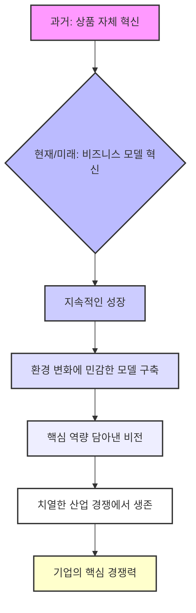

## 찾아라 나의 비즈니스 모델: 돈 버는 방법의 비밀을 파헤쳐 보자!
이 책은 기업들이 어떻게 돈을 버는지, 즉 '돈벌이 구조'에 대한 핵심적인 내용을 알려주는 책이야. 과거에는 좋은 물건만 만들면 성공했지만, 이제는 시대가 변해서 물건을 파는 방식, 즉 비즈니스 모델을 혁신해야 성공할 수 있다고 말해주고 있어. 성공한 기업들이 어떤 비즈니스 모델로 성공했는지 그 비밀을 파헤쳐 볼 거야. <doc-source-group><doc-source requestId="eceb4422-87de-45c2-a18c-6bfa4c9cdc64" index="0" /><doc-source requestId="eceb4422-87de-45c2-a18c-6bfa4c9cdc64" index="1" /><doc-source requestId="eceb4422-87de-45c2-a18c-6bfa4c9cdc64" index="2" /></doc-source-group>

## 1. 비즈니스 모델, 그게 뭔데? 

1. **비즈니스 모델은 기업의 돈벌이 설계도 같은 거야.**
  1. 기업이 어떻게 이익을 만들지 계획하는 사업 활동의 구조를 말해. <doc-source-group><doc-source requestId="7111069b-0249-4c54-8507-78588433139c" index="8" /></doc-source-group>
  2. 쉽게 말해, 기업이 돈을 어떻게 버는지에 대한 '돈벌이 구조'라고 보면 돼. <doc-source-group><doc-source requestId="7111069b-0249-4c54-8507-78588433139c" index="9" /></doc-source-group>
2. **옛날에는 물건 자체만 좋으면 됐어.**
  1. 과거에는 기술적으로 뛰어난 상품을 만들면 시장을 독점하고 성공할 수 있었지. <doc-source-group><doc-source requestId="7111069b-0249-4c54-8507-78588433139c" index="12" /></doc-source-group>
  2. 이걸 '상품 자체의 혁신(이노베이션)'이라고 불러. <doc-source-group><doc-source requestId="7111069b-0249-4c54-8507-78588433139c" index="11" /></doc-source-group>
3. **하지만 지금은 돈 버는 방식 자체를 바꿔야 해.**
  1. IT 기술이 발전하고 산업 환경이 너무 빨리 변해서, 이제는 물건만 좋아서는 성공하기 어려워졌어. <doc-source-group><doc-source requestId="7111069b-0249-4c54-8507-78588433139c" index="12" /></doc-source-group>
  2. 그래서 지금은 물건을 파는 다양한 방법, 수익을 내는 구조 등 '비즈니스 모델 전체를 혁신(이노베이션)'해야 성공할 수 있어. <doc-source-group><doc-source requestId="7111069b-0249-4c54-8507-78588433139c" index="13" /></doc-source-group>
  3. 기업은 고객과 시대, 환경 변화에 맞춰서 새로운 비즈니스 모델을 계속 만들어야 하는 거야. <doc-source-group><doc-source requestId="7111069b-0249-4c54-8507-78588433139c" index="10" /></doc-source-group>

## 2. 좋은 비즈니스 모델인지 확인하는 두 가지 질문 

1. **첫 번째 질문: '말이 되는가?' (**Make Sense**)** <doc-source-group><doc-source requestId="7111069b-0249-4c54-8507-78588433139c" index="18" /><doc-source requestId="7111069b-0249-4c54-8507-78588433139c" index="19" /></doc-source-group>
  1. 아무리 혁신적이고 멋져 보여도, 현실성이 없으면 좋은 비즈니스 모델이 아니야. <doc-source-group><doc-source requestId="7111069b-0249-4c54-8507-78588433139c" index="20" /><doc-source requestId="7111069b-0249-4c54-8507-78588433139c" index="21" /></doc-source-group>
  2. 예를 들어, "우리 회사는 혁신적이고 3배 더 긴 제품을 만들어서 대박 날 거야!"라고 해도, 그게 현실적으로 가능한 이야기인지 따져봐야 한다는 거지.
2. **두 번째 질문: '남는 장사인가?' (**Profit & Loss**)** <doc-source-group><doc-source requestId="7111069b-0249-4c54-8507-78588433139c" index="22" /></doc-source-group>
  1. 기업은 결국 돈을 벌기 위해 존재하는 거잖아. <doc-source-group><doc-source requestId="7111069b-0249-4c54-8507-78588433139c" index="23" /></doc-source-group>
  2. 그래서 이 비즈니스 모델로 정말 수익을 창출할 수 있는지, 남는 장사를 할 수 있는지를 확인해야 해. <doc-source-group><doc-source requestId="7111069b-0249-4c54-8507-78588433139c" index="24" /></doc-source-group>

## 3. 대표적인 비즈니스 모델 5가지 

1. 수직 계열화 모델** (Vertical Integration Model)** <doc-source-group><doc-source requestId="7111069b-0249-4c54-8507-78588433139c" index="26" /></doc-source-group>
  1. 이건 마치 한 회사가 물건을 만드는 모든 과정을 다 하는 거야. <doc-source-group><doc-source requestId="7111069b-0249-4c54-8507-78588433139c" index="27" /></doc-source-group>
  2. 기획부터 물건을 만들고, 마지막으로 판매까지 한 회사가 모두 운영하는 비즈니스 모델이지.
  3. **예시:** 유니클로, 애플 <doc-source-group><doc-source requestId="7111069b-0249-4c54-8507-78588433139c" index="28" /></doc-source-group>
2. 소매 모델** (Retail Model)** <doc-source-group><doc-source requestId="7111069b-0249-4c54-8507-78588433139c" index="29" /></doc-source-group>
  1. 다른 회사에서 만든 물건을 사 와서 파는 데 집중하는 모델이야. <doc-source-group><doc-source requestId="7111069b-0249-4c54-8507-78588433139c" index="30" /></doc-source-group>
  2. 우리가 흔히 아는 편의점이나 온라인 쇼핑몰이 여기에 해당해.
  3. **예시:** 세븐일레븐, 아마존 같은 이커머스(온라인 상거래) 회사들 <doc-source-group><doc-source requestId="7111069b-0249-4c54-8507-78588433139c" index="31" /><doc-source requestId="eceb4422-87de-45c2-a18c-6bfa4c9cdc64" index="3" /></doc-source-group>
3. 소모품 모델** (Consumables Model)** <doc-source-group><doc-source requestId="7111069b-0249-4c54-8507-78588433139c" index="32" /></doc-source-group>
  1. 본체(메인 제품) 가격은 싸게 팔고, 계속 써야 하는 부속품(소모품)을 팔아서 돈을 버는 모델이야. <doc-source-group><doc-source requestId="7111069b-0249-4c54-8507-78588433139c" index="33" /></doc-source-group>
  2. **예시:** 질레트 면도기(면도날), 텀블러(리필), 엡손 프린터(잉크) <doc-source-group><doc-source requestId="7111069b-0249-4c54-8507-78588433139c" index="34" /></doc-source-group>
4. 구독 모델** (**Subscription Model**)** <doc-source-group><doc-source requestId="7111069b-0249-4c54-8507-78588433139c" index="35" /></doc-source-group>
  1. 요즘 많이 쓰는 방식인데, 매달 일정 금액(월정액)을 내면 서비스나 상품을 계속 이용할 수 있는 모델이야. <doc-source-group><doc-source requestId="7111069b-0249-4c54-8507-78588433139c" index="36" /></doc-source-group>
  2. **예시:** 넷플릭스, 아마존 프라임 <doc-source-group><doc-source requestId="7111069b-0249-4c54-8507-78588433139c" index="37" /><doc-source requestId="eceb4422-87de-45c2-a18c-6bfa4c9cdc64" index="3" /></doc-source-group>
5. 광고 모델** (Advertising Model)** <doc-source-group><doc-source requestId="7111069b-0249-4c54-8507-78588433139c" index="38" /></doc-source-group>
  1. 자신이 만든 서비스나 제품에 다른 회사의 광고를 보여주고 돈을 버는 모델이야. <doc-source-group><doc-source requestId="7111069b-0249-4c54-8507-78588433139c" index="39" /></doc-source-group>
  2. **예시:** 구글(검색 엔진 광고), 프리페이퍼(무료 신문에 광고) <doc-source-group><doc-source requestId="7111069b-0249-4c54-8507-78588433139c" index="40" /></doc-source-group>

## 4. 비즈니스 모델 혁신 사례: 넷플릭스 (구독 모델) 

1. **넷플릭스는 '물건'이 아닌 '경험'을 파는 회사야.** <doc-source-group><doc-source requestId="7111069b-0249-4c54-8507-78588433139c" index="42" /></doc-source-group>
  1. 옛날 잡지 구독 모델을 생각해봐. 정해진 날짜에 잡지가 오면 그냥 받아보는 수동적인 방식이었지. <doc-source-group><doc-source requestId="7111069b-0249-4c54-8507-78588433139c" index="43" /><doc-source requestId="7111069b-0249-4c54-8507-78588433139c" index="44" /></doc-source-group>
  2. 하지만 넷플릭스는 이런 불편함을 없애고 비즈니스 모델을 혁신했어. <doc-source-group><doc-source requestId="7111069b-0249-4c54-8507-78588433139c" index="45" /></doc-source-group>
  3. **원하는 장소에서, 원하는 시간에, 원하는 콘텐츠를 마음껏 볼 수 있는 '체험'을 제공**해서 성공한 거야. <doc-source-group><doc-source requestId="7111069b-0249-4c54-8507-78588433139c" index="46" /></doc-source-group>
2. 넷플릭스** 성공의 네 가지 비결:** <doc-source-group><doc-source requestId="7111069b-0249-4c54-8507-78588433139c" index="47" /></doc-source-group>
  1. **가격 전략:** 고객의 필요에 맞춰 다양한 가격을 선택할 수 있게 했어. <doc-source-group><doc-source requestId="7111069b-0249-4c54-8507-78588433139c" index="48" /><doc-source requestId="7111069b-0249-4c54-8507-78588433139c" index="49" /></doc-source-group>
  2. **풍부한 콘텐츠:** 넷플릭스 자체 제작 콘텐츠뿐만 아니라 정말 다양한 영화, 드라마를 제공해. <doc-source-group><doc-source requestId="7111069b-0249-4c54-8507-78588433139c" index="50" /><doc-source requestId="7111069b-0249-4c54-8507-78588433139c" index="51" /></doc-source-group>
  3. 개인화 전략**:** 고객이 뭘 좋아하는지 빅데이터(아주 많은 정보)를 분석해서, 딱 맞는 콘텐츠를 추천해줘. <doc-source-group><doc-source requestId="7111069b-0249-4c54-8507-78588433139c" index="52" /><doc-source requestId="7111069b-0249-4c54-8507-78588433139c" index="53" /></doc-source-group>
  - 이런 추천 알고리즘 덕분에 사람들이 넷플릭스를 계속 보게 되는 거야.
  4. **편의성:** 사용하기 정말 편리하게 만들었어. <doc-source-group><doc-source requestId="7111069b-0249-4c54-8507-78588433139c" index="54" /></doc-source-group>
  - 가입하고 탈퇴하는 게 자유롭고, 앱을 사용할 때 광고가 전혀 없어서 몰입해서 볼 수 있지. <doc-source-group><doc-source requestId="7111069b-0249-4c54-8507-78588433139c" index="55" /></doc-source-group>

## 5. 비즈니스 모델 혁신 사례: 캐논 (소모품 모델) 

1. **캐논은 프린터를 싸게 팔고 잉크로 돈을 버는 회사야.** <doc-source-group><doc-source requestId="7111069b-0249-4c54-8507-78588433139c" index="56" /><doc-source requestId="eceb4422-87de-45c2-a18c-6bfa4c9cdc64" index="11" /></doc-source-group>
  1. 캐논 프린터를 한 번 사면, 계속 사용하려면 캐논이 만든 잉크를 사야 해. <doc-source-group><doc-source requestId="7111069b-0249-4c54-8507-78588433139c" index="57" /><doc-source requestId="7111069b-0249-4c54-8507-78588433139c" index="58" /></doc-source-group>
  2. 이 잉크를 사는 비용이 바로 '러닝 코스트(Running Cost)'라고 하는데, 프린터를 계속 쓰는 데 필요한 비용을 말해. <doc-source-group><doc-source requestId="7111069b-0249-4c54-8507-78588433139c" index="59" /><doc-source requestId="7111069b-0249-4c54-8507-78588433139c" index="60" /></doc-source-group>
  3. 캐논은 이 잉크 판매로 수익을 내고, 이 수익으로 프린터 본체를 더 싸게 팔 수 있는 구조를 가지고 있어. <doc-source-group><doc-source requestId="7111069b-0249-4c54-8507-78588433139c" index="61" /><doc-source requestId="7111069b-0249-4c54-8507-78588433139c" index="62" /><doc-source requestId="7111069b-0249-4c54-8507-78588433139c" index="63" /></doc-source-group>
2. **소모품 모델의 다양한 예시:** <doc-source-group><doc-source requestId="7111069b-0249-4c54-8507-78588433139c" index="64" /><doc-source requestId="7111069b-0249-4c54-8507-78588433139c" index="67" /></doc-source-group>
  1. 면도기(질레트)와 면도날 <doc-source-group><doc-source requestId="7111069b-0249-4c54-8507-78588433139c" index="65" /><doc-source requestId="7111069b-0249-4c54-8507-78588433139c" index="66" /></doc-source-group>
  2. 복사기와 잉크
  3. 커피 머신과 원두
  4. 카메라와 필름
  5. 게임기와 게임 소프트웨어
3. **소모품 모델의 장점:** <doc-source-group><doc-source requestId="7111069b-0249-4c54-8507-78588433139c" index="68" /></doc-source-group>
  1. 고정 고객 확보**:** 다른 회사 제품을 못 쓰게 만들어서 고객을 계속 우리 회사 제품만 쓰게 할 수 있어. <doc-source-group><doc-source requestId="7111069b-0249-4c54-8507-78588433139c" index="69" /><doc-source requestId="7111069b-0249-4c54-8507-78588433139c" index="70" /></doc-source-group>
  2. **안정적인 수익:** 고정 고객이 많으면 꾸준히 돈을 벌 수 있어. <doc-source-group><doc-source requestId="7111069b-0249-4c54-8507-78588433139c" index="71" /><doc-source requestId="7111069b-0249-4c54-8507-78588433139c" index="72" /></doc-source-group>
  - 반복 구매를 기대할 수 있어서 영업에 크게 신경 쓰지 않아도 계속 팔 수 있다는 장점이 있지.
4. **소모품 모델의 위험(리스크):** <doc-source-group><doc-source requestId="7111069b-0249-4c54-8507-78588433139c" index="73" /></doc-source-group>
  1. **높은 **초기 투자 비용**:** 프린터 같은 본체를 개발하고 만드는 데 돈이 많이 들어. <doc-source-group><doc-source requestId="7111069b-0249-4c54-8507-78588433139c" index="74" /><doc-source requestId="7111069b-0249-4c54-8507-78588433139c" index="75" /><doc-source requestId="7111069b-0249-4c54-8507-78588433139c" index="76" /></doc-source-group>
  - 본체가 많이 팔려야 잉크로 수익을 낼 수 있는데, 본체가 안 팔리면 손실이 엄청 커질 수 있어.
  2. **다른 회사 제품의 위협:** 캐논 잉크가 아닌 다른 회사에서 똑같은 규격의 잉크를 싸게 만들어서 팔 위험이 있어. <doc-source-group><doc-source requestId="7111069b-0249-4c54-8507-78588433139c" index="77" /><doc-source requestId="7111069b-0249-4c54-8507-78588433139c" index="78" /></doc-source-group>

## 6. 결론 및 시사점: 미래 기업의 생존 전략 

1. **물건이나 서비스만 좋아서는 살아남기 힘들어.** <doc-source-group><doc-source requestId="7111069b-0249-4c54-8507-78588433139c" index="80" /></doc-source-group>
  1. 미래에는 제품이나 서비스 자체만 혁신해서는 기업이 계속 성장하기 어렵다는 뜻이야.
2. **기업은 계속해서 비즈니스 모델을 혁신해야 해.** <doc-source-group><doc-source requestId="7111069b-0249-4c54-8507-78588433139c" index="81" /></doc-source-group>
  1. 비즈니스 모델 혁신은 한 번에 끝나는 게 아니야. <doc-source-group><doc-source requestId="7111069b-0249-4c54-8507-78588433139c" index="82" /></doc-source-group>
  2. 환경 변화에 맞춰서 계속 시도하고 배우면서 가장 좋은 형태로 발전시켜야 해.
3. **미래 기업의 핵심 경쟁력은 '변화에 민감한 **비즈니스 모델**'이야.** <doc-source-group><doc-source requestId="7111069b-0249-4c54-8507-78588433139c" index="83" /><doc-source requestId="7111069b-0249-4c54-8507-78588433139c" index="84" /></doc-source-group>
  1. 기업들은 명확한 목표(비전)를 가지고, 자신들이 가장 잘하는 것(핵심 역량)을 잘 담아낸 비즈니스 모델을 만들어야 해.
  2. 그래야 빠르게 변하는 산업 환경 속에서 치열한 경쟁에서 살아남을 수 있고, 이게 바로 기업의 가장 중요한 경쟁력이 될 거야.

