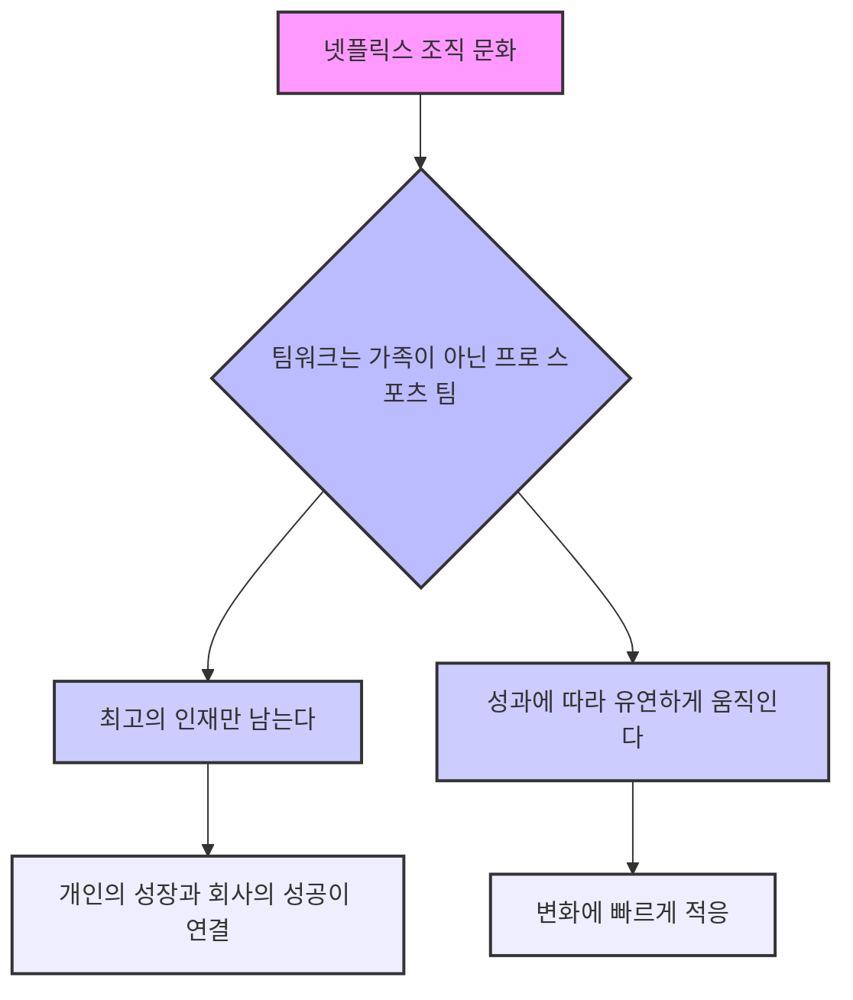

## 넷플릭스 CEO의 '규칙 없음' 요약: 자유와 책임의 문화
이 책은 넷플릭스 CEO 리드 헤이스팅스가 에린 마이어와 함께 쓴 책으로, 넷플릭스의 독특한 기업 문화인 '자유와 책임'에 대해 자세히 설명하고 있어. 넷플릭스가 어떻게 이런 문화를 만들었고, 그게 어떤 좋은 점들을 가져왔는지 알려주는 책이야. 

## 1. 넷플릭스, 끊임없이 변신하는 회사 

넷플릭스는 우리가 아는 것보다 훨씬 더 많은 변화를 겪어왔어. 마치 카멜레온처럼 계속해서 모습을 바꿔가며 성공한 회사라고 보면 돼. 

1. **DVD 우편 대여 서비스로 시작했어.** 
  1. 넷플릭스는 20년 전쯤에 DVD를 우편으로 빌려주는 회사로 시작했어. 
  2. 사람들이 DVD를 빌리고 싶으면 넷플릭스에 신청하고, 넷플릭스는 DVD를 봉투에 담아 우편으로 보내줬지. 
  3. 이때는 DVD를 포장하고 보내는 물류 회사에 가까웠어. 
2. 스트리밍** 서비스로 변신했어.** 
  1. DVD 사업이 잘 되다가 인터넷이 발달하면서 위기가 찾아왔어. 
  2. 넷플릭스는 DVD 사업을 과감히 접고, 인터넷으로 영화를 바로 볼 수 있는 스트리밍 서비스로 바꿨어. 
  3. 이때 많은 직원을 해고해야 하는 아픔도 겪었지만, 새로운 기술에 맞춰 빠르게 변신한 거야. 
3. **자체 콘텐츠 제작사로 거듭났어.** 
  1. 스트리밍 서비스도 잘 됐지만, 다른 회사 영화만 빌려주다 보니 수익이 줄어들기 시작했어. 
  2. 그래서 넷플릭스는 직접 영화나 드라마를 만들기 시작했어. 
  3. '하우스 오브 카드'나 '기묘한 이야기' 같은 넷플릭스 오리지널 시리즈가 이때부터 나온 거야. 
  4. 이제 넷플릭스는 할리우드 영화사처럼 자체 콘텐츠를 만드는 회사가 된 거지. 
4. **전 세계로 뻗어나가는 글로벌 기업이 됐어.** 
  1. 넷플릭스는 불과 4~5년 만에 100개가 넘는 나라에 진출했어. 
  2. 이렇게 빠르게 성장하면서 각 나라의 문화에 맞춰 일하는 방식도 계속 바꿔나가고 있어. 

## 2. 넷플릭스 문화의 핵심: 사람, 솔직함, 그리고 자유 

넷플릭스 문화의 가장 중요한 세 가지 기둥은 '최고의 인재 밀도', '솔직한 소통', 그리고 '통제 줄이기'야. 이 세 가지가 서로 연결되어 넷플릭스를 특별하게 만드는 거지. 

1. **최고의 **인재 밀도** (**Talent Density**)를 만들어.** 
  1. 넷플릭스는 똑똑하고 뛰어난 사람들을 많이 모으는 걸 가장 중요하게 생각해. 
  2. 마치 프로 스포츠 팀처럼, 모든 선수가 최고 실력을 갖춰야 팀 전체가 이길 수 있다고 믿는 거야. 
  3. 평범한 직원이 한 명이라도 있으면 팀 전체의 성과가 30%나 떨어진다고 생각해서, 평범한 직원은 아예 뽑지 않아. 
  4. 최고의 인재를 모으기 위해 시장에서 가장 높은 연봉을 줘. 
  1. 넷플릭스는 항상 시장에서 가장 높은 연봉을 주려고 노력해. 
  2. 직원들에게 다른 회사에서 얼마를 주는지 알아보라고 권장하고, 그 정보에 맞춰 연봉을 올려주기도 해. 
  3. 성과에 따른 보너스는 주지 않아. 왜냐하면 창의적인 일은 보너스로 동기 부여하기 어렵다고 생각하거든. 
  4. 대신 기본 연봉을 높게 책정해서 직원들이 돈 걱정 없이 일에 집중할 수 있게 해줘. 
  5. '키퍼 테스트(Keeper Test)'라는 독특한 제도가 있어. 
  1. 만약 어떤 직원이 "나 그만둘게요"라고 말했을 때, "이 사람을 꼭 잡아야 해!"라고 생각하지 않는다면, 그 직원은 바로 내보내. 
  2. 심지어 퇴직금도 많이 줘서 좋게 헤어지려고 해. 
  3. 이런 제도는 직원들에게 항상 최고가 되도록 동기 부여하는 역할을 해. 
2. **솔직한 소통 (**Candor**)을 늘려.** 
  1. 넷플릭스는 직원들이 서로에게 솔직하게 피드백(feedback)을 주고받는 문화를 중요하게 생각해. 
  2. 마치 거울을 보듯이, 서로의 장단점을 솔직하게 이야기해서 더 나은 방향으로 발전할 수 있도록 돕는 거야. 
  3. '4A 피드백 원칙'이라는 게 있어. 
  1. **Aim to assist (도움을 주려는 목적):** 피드백은 항상 상대방을 돕기 위한 좋은 의도여야 해. 
  2. **Actionable (실질적인 조치):** 피드백은 구체적인 행동으로 이어질 수 있는 내용이어야 해. "이걸 이렇게 바꿔보면 어때?"처럼 말이야. 
  3. **Appreciate (감사하는 마음):** 피드백을 받을 때는 고마워해야 해. 상대방이 나를 위해 솔직하게 말해준 거니까. 
  4. **Accept or discard (받아들이거나 버리거나):** 피드백을 무조건 따를 필요는 없어. 스스로 판단해서 받아들일지 말지 결정하면 돼. 
  5. **Adapt (적응하기):** 다른 나라에서는 문화에 맞춰 피드백 방식을 조절해야 해. 
  4. '선샤인(Sunshine)'이라는 문화가 있어. 
  1. 실패한 사례를 숨기지 않고 모두에게 공개해서, 왜 실패했는지 배우고 다시는 같은 실수를 반복하지 않도록 하는 거야. 
  2. 마치 햇볕에 빨래를 널어 말리듯이, 실패를 투명하게 드러내서 모두가 함께 배우는 거지. 
  5. '360도 피드백'이라는 것도 있어. 
  1. 7~8명 정도의 팀원들이 모여서 서로에게 솔직한 피드백을 직접 주고받는 거야. 
  2. 칭찬은 25%만 하고, 나머지 75%는 개선할 점에 대해 이야기해. 
  3. 가장 높은 사람이 먼저 피드백을 받아서, 다른 사람들도 편하게 이야기할 수 있는 분위기를 만들어. 
3. **통제를 줄여 (Reduce Control).** 
  1. 넷플릭스는 직원들을 믿고 불필요한 규칙이나 절차를 없애버려. 
  2. 마치 어른에게는 일일이 간섭하지 않듯이, 최고의 인재들에게는 스스로 알아서 잘할 거라고 믿고 자유를 주는 거야. 
  3. **휴가 규정이 없어.** 
  1. 직원들은 원하는 만큼 자유롭게 휴가를 갈 수 있어. 
  2. 넷플릭스 CEO 리드 헤이스팅스도 1년에 6주씩 휴가를 가서, 직원들에게 "휴가는 중요한 거야"라는 메시지를 보여줘. 
  3. 물론 팀의 상황에 따라 휴가 시기를 조절해야 하지만, 정해진 휴가 일수는 없어. 
  4. **출장 경비 규정이 없어.** 
  1. 직원들은 출장 경비를 쓸 때 "넷플릭스에 가장 이득이 되는 방향으로 행동하라"는 단 하나의 원칙만 지키면 돼. 
  2. 마치 내 돈을 쓰는 것처럼 신중하게 생각하고, 나중에 CEO에게 설명할 수 있을 정도로 합리적이어야 해. 
  3. 회계팀에서 무작위로 경비 내역을 감사하지만, 기본적으로는 직원들을 믿어. 
  4. 만약 이 원칙을 어기는 직원이 있으면, 그 직원은 바로 해고하고, 다른 직원들에게도 그 사실을 알려서 문화의 중요성을 강조해. 
  5. **의사 결정 통제를 없애.** 
  1. 넷플릭스에서는 높은 직급의 상사가 모든 결정을 내리지 않아. 
  2. 가장 잘 아는 사람(Informed Captain)이 직접 결정을 내릴 수 있도록 권한을 줘. 
  3. 마치 배의 선장이 배의 방향을 결정하듯이, 해당 업무의 전문가가 직접 중요한 결정을 내리는 거야. 
  4. 결정을 내리기 전에 다른 사람들의 의견을 충분히 듣고(Farm for dissent), 작은 테스트를 해보는 과정을 거쳐. 
  5. 실패해도 괜찮아. 실패를 통해 배우는 것을 더 중요하게 생각하거든. 

## 3. 넷플릭스 문화, 어떻게 만들어졌을까? 

넷플릭스의 독특한 문화는 처음부터 있었던 게 아니야. 여러 경험과 시행착오를 거쳐 만들어진 거지. 

1. **초기에는 평범한 회사였어.** 
  1. 리드 헤이스팅스는 넷플릭스를 만들기 전에는 규칙과 절차가 많은 평범한 회사를 운영했어. 
  2. 그래서 처음에는 '자유와 책임'이라는 아이디어를 이해하지 못했어. 
2. **2001년 대규모 해고 사건이 전환점이 됐어.** 
  1. 2001년 닷컴 버블이 터지면서 넷플릭스는 직원 3분의 1을 해고해야 했어. 
  2. 이때 '키퍼 테스트'를 적용해서 평범한 직원들을 내보냈는데, 놀랍게도 남은 직원들이 더 생산적으로 일하는 것을 발견했어. 
  3. 이 경험을 통해 '최고의 인재 밀도'의 중요성을 깨달았어. 
3. 패티 맥코드**(Patty McCord)의 역할이 컸어.** 
  1. 넷플릭스의 인사 책임자였던 패티 맥코드는 '자유와 책임' 문화를 만드는 데 큰 영향을 줬어. 
  2. 그녀는 리드 헤이스팅스에게 자유롭고 자율적인 조직을 만들자고 제안했고, 처음에는 반대했지만 결국 리드 헤이스팅스를 설득했어. 
  3. 패티 맥코드는 넷플릭스의 인사 정책과 조직 문화를 만드는 데 핵심적인 역할을 했어. 

## 4. 넷플릭스 문화, 전 세계에서 어떻게 적용될까? 

넷플릭스는 전 세계 190개국 이상에서 서비스하고 있어. 각 나라마다 문화가 다르기 때문에, 넷플릭스 문화도 현지에 맞춰 조금씩 조절해야 해. 

1. **'**컬처 맵**(**Culture Map**)'을 활용해.** 
  1. 넷플릭스는 에린 마이어가 만든 '컬처 맵'이라는 도구를 사용해서 각 나라의 문화를 분석해. 
  2. 이 맵은 의사소통 방식, 피드백 방식, 리더십 스타일 등 여러 기준으로 나라별 문화를 비교해줘. 
  3. 예를 들어, 네덜란드는 직접적인 피드백을 선호하지만, 일본이나 브라질은 간접적인 피드백을 선호하는 경향이 있어. 
2. **현지 문화에 맞춰 유연하게 적용해.** 
  1. 넷플릭스는 자신들의 핵심 문화를 유지하면서도, 각 나라의 문화적 특성을 고려해서 일하는 방식을 조절해. 
  2. 예를 들어, 일본 지사에서는 직원들이 상사에게 직접 피드백을 주는 것을 어려워할 수 있기 때문에, 피드백 교육을 통해 솔직한 소통을 장려해. 
  3. 하지만 '최고의 인재 밀도'나 '자유와 책임' 같은 핵심 가치는 어떤 나라에서든 변하지 않아. 

## 5. 넷플릭스 문화의 장점과 한계 

넷플릭스의 문화는 많은 장점이 있지만, 모든 회사에 적용하기는 어려울 수도 있어. 

1. **장점:** 
  1. **높은 생산성과 혁신:** 최고의 인재들이 자유롭게 일하면서 더 좋은 아이디어를 내고 빠르게 실행할 수 있어. 
  2. **직원 만족도 향상:** 직원들이 존중받고 신뢰받는다고 느끼며, 스스로 결정할 수 있는 자율성이 높아져. 
  3. **빠른 의사 결정:** 불필요한 절차 없이 전문가가 직접 결정을 내리기 때문에 빠르게 움직일 수 있어. 
2. **한계:** 
  1. **모든 회사에 적용하기 어려워:** 넷플릭스처럼 최고의 인재를 항상 뽑을 수 있는 회사는 많지 않아. 특히 제조업처럼 정해진 절차가 중요한 곳에서는 적용하기 어려울 수 있어. 
  2. **직원들의 스트레스:** '키퍼 테스트'나 솔직한 피드백 문화는 일부 직원들에게 큰 스트레스가 될 수 있어. 
  3. **암묵적인 규칙의 존재:** 공식적인 규칙은 없지만, 암묵적으로 지켜야 할 것들이 많아서 혼란스러울 수도 있어. 
  4. **높은 연봉 부담:** 시장 최고 수준의 연봉을 지급해야 하므로, 재정적인 여유가 없는 회사에는 부담이 될 수 있어. 

## 6. 넷플릭스 문화의 핵심 가치: 팀워크는 가족이 아닌 프로 스포츠 팀처럼 

넷플릭스는 회사를 '가족'이 아닌 '프로 스포츠 팀'으로 생각해. 

1. **가족과 팀의 차이:** 
  1. 가족은 서로의 부족한 점을 감싸주고 영원히 함께하는 관계지만, 팀은 최고의 성과를 위해 모인 사람들이야. 
  2. 팀에서는 실력이 부족하면 다른 선수로 교체될 수 있어. 
2. **프로 스포츠 팀처럼 일하는 이유:** 
  1. 넷플릭스는 항상 최고의 성과를 내고 빠르게 혁신해야 하는 회사이기 때문에, 모든 직원이 최고 수준의 실력을 갖춰야 한다고 믿어. 
  2. 최고의 인재들이 모여 서로에게 긍정적인 영향을 주면서 회사 전체의 능률을 높이는 거지. 
  3. 이런 문화는 직원들이 끊임없이 배우고 발전하도록 동기 부여하는 역할을 해. 

## 7. 넷플릭스 CEO 리드 헤이스팅스는 어떤 사람일까? 

넷플릭스의 독특한 문화를 만든 리드 헤이스팅스는 어떤 사람인지 궁금할 거야. 

1. **다양한 경험을 가진 리더:** 
  1. 그는 대학에서 수학을 전공하고, 평화봉사단으로 아프리카에서 수학을 가르치기도 했어. 
  2. 첫 번째 회사를 성공적으로 창업하고 매각한 경험도 있어. 
  3. 이런 다양한 경험들이 넷플릭스 문화를 만드는 데 영향을 줬을 거야. 
2. **냉철하지만 인간적인 리더:** 
  1. 그는 조직에 맞지 않는 직원은 과감하게 내보내지만, 헤어질 때도 좋은 관계를 유지하려고 노력해. 
  2. 심지어 다른 회사에 추천해주기도 하면서, 직원들이 다음 단계로 나아갈 수 있도록 도와줘. 
  3. 이런 모습은 냉철한 사업가이면서도 인간적인 면모를 보여주는 거지. 
3. **끊임없이 배우고 변화하는 리더:** 
  1. 그는 과거의 성공 방식에 얽매이지 않고, 항상 새로운 아이디어를 받아들이고 변화를 시도해. 
  2. 처음에는 '자유와 책임' 문화를 반대했지만, 패티 맥코드의 설득과 자신의 경험을 통해 결국 받아들였어. 
  3. 이런 유연한 사고방식이 넷플릭스를 계속해서 혁신하게 만드는 원동력이 된 거야. 

