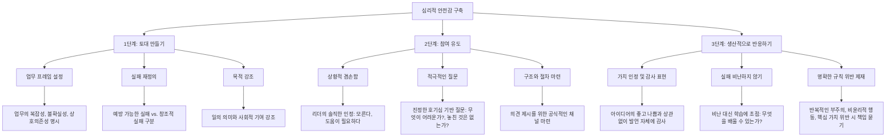

## 두려움 없는 조직: 심리적 안전감으로 최고의 팀 만들기
이 책은 조직 내에서 두려움이 사라지고, 모든 구성원이 자유롭게 의견을 내고 실수를 인정할 수 있는 '심리적 안전감'이 얼마나 중요한지 알려주는 책이야. 하버드 경영대학원 에이미 에드먼드슨 교수가 20년 넘게 연구한 결과로, 심리적 안전감이 높은 조직이 어떻게 최고의 성과를 내고 혁신을 이끌어내는지 다양한 사례를 통해 보여주고 있어. 이 책은 단순히 친절한 조직을 만들자는 게 아니라, 변화무쌍한 시대에 기업이 살아남고 성장하기 위한 필수 전략이라고 강조하고 있어.

## 1. 두려움이 조직을 망치는 이유 

두려움은 마치 우리 마음속에 숨어있는 도둑 같아서, 생각하고 행동하는 힘을 빼앗아 가. 조직 안에서 두려움이 커지면, 좋은 아이디어나 중요한 경고들이 묻히게 되고, 결국 조직의 발전이 멈추게 되는 거야.

1. **침묵의 대가**:
  1. 사람들은 바보 같아 보이거나, 무능해 보이거나, 남의 일에 끼어드는 사람처럼 보이기 싫어해. 
  2. 그래서 질문이 있어도 안 하고, 좋은 아이디어가 있어도 말하지 않고, 작은 실수를 봐도 모른 척하게 돼. 
  3. 이런 행동을 '대인 관계 위험' (interpersonal risk)이라고 부르는데, 다른 사람들이 나를 어떻게 생각할지 걱정하는 마음에서 오는 거야. 
  4. 우리는 매일 무의식적으로 "말했을 때 얻을 이득"과 "나쁘게 보일 위험"을 저울질하는데, 대부분은 나쁘게 보일까 봐 침묵을 선택하게 돼. 
2. **콜롬비아 우주왕복선 참사 (2003년)**: 
  1. 로카라는 한 엔지니어가 우주왕복선 발사 영상에서 작은 파편이 왼쪽 날개를 치는 것을 발견했어.
  2. 그는 날개 손상 여부를 확인하기 위해 국방부의 위성 사진을 요청했지만, 상사는 불필요하다고 생각해서 묵살했지.
  3. 이후 고위 관리자 회의에서 이 문제가 언급되었지만, 로카는 "너무 낮은 직급이라 말할 수 없었다"고 말하며 침묵했어.
  4. 결국 콜롬비아호는 대기권 재진입 중 파손되어 7명의 우주비행사 전원이 사망하는 비극이 발생했어.
  5. 이 사건은 두려움 때문에 중요한 경고가 묵살될 때 어떤 비극이 일어나는지 보여주는 사례야.
3. **간호사의 침묵 (신생아 중환자실 사례)**: 
  1. 크리스티나라는 신생아 중환자실 간호사는 미숙아 쌍둥이에게 특정 약을 투여해야 한다는 최신 지침을 알고 있었어.
  2. 하지만 자신에게 소리 지르기로 유명한 선임 의사가 약 처방을 하지 않았지.
  3. 크리스티나는 말하려다 멈췄어. 지난주에 다른 간호사가 혼나는 것을 봤기 때문이야.
  4. 그녀는 의사가 전문가이니 다 이유가 있을 거라고 스스로를 납득시키고 침묵했어.
  5. 다행히 아기들은 괜찮았지만, 이런 작은 침묵들이 쌓이면 큰 재앙으로 이어질 수 있다는 걸 보여주는 사례야.
  6. 우리의 뇌는 미래의 불확실한 이득보다 현재의 확실한 위험(혼나는 것)을 더 크게 생각하는 경향이 있어.

## 2. 두려움이 낳은 비극적인 기업 사례들 

두려움은 기업의 성공을 가로막고, 때로는 엄청난 재앙을 불러오기도 해. 리더들이 높은 목표를 설정하는 것을 좋은 경영이라고 착각하고, 두려움을 효과적인 동기 부여 수단으로 믿을 때 이런 일이 벌어지는 거야.

1. 폭스바겐 디젤게이트** (2015년)**:
  1. 폭스바겐은 강력하고 연비 좋으며 엄격한 미국 배출가스 기준을 충족하는 디젤 엔진을 만들라는 불가능한 목표를 엔지니어들에게 주었어.
  2. CEO는 완벽주의자였고, 회장은 "6주 안에 세계적 수준의 결과를 내지 못하면 모두 교체하겠다"고 말할 정도로 무서운 사람이었지.
  3. 이런 공포 문화 속에서 엔지니어들은 불가능하다고 말할 용기가 없었어. 그건 곧 해고를 의미했거든.
  4. 결국 엔지니어들은 배출가스 테스트를 속이는 소프트웨어(조작 장치)를 개발했고, 10년 가까이 이 사실을 숨겼어.
  5. 이 사실이 밝혀지자 폭스바겐의 기업 가치는 3분의 1로 폭락하고, 수백억 달러의 벌금을 내고, 78년 역사의 명성이 하루아침에 무너졌어.
  6. 한 노동조합 대표는 "문제를 숨기지 않고 상사에게 공개적으로 말할 수 있는 분위기가 필요하다"고 말했는데, 이게 바로 심리적 안전감을 요구한 것이나 다름없어.
2. **웰스파고의 가짜 계좌 스캔들**:
  1. 미국 은행 웰스파고는 모든 고객이 8가지 다른 상품을 이용하게 하라는 터무니없는 판매 목표를 세웠어.
  2. 직원들은 비현실적인 목표임을 알았지만, 매일 판매 할당량과 해고 위협에 시달렸지.
  3. 폭스바겐 엔지니어들처럼, 직원들은 목표를 달성하기 위해 고객 몰래 수백만 개의 가짜 계좌와 신용카드를 만들고 서명을 위조했어.
  4. 결국 이 사실이 드러나 5,000명 이상의 직원이 해고되고, 1억 8,500만 달러 이상의 벌금을 물었으며, 은행의 명성은 땅에 떨어졌어.
  5. 이 두 사례는 두려움이 만연한 조직에서 직원들이 진실을 말하기보다 속임수를 쓰는 것이 더 쉽다고 느낄 때 어떤 일이 벌어지는지 보여줘.

## 3. 항공 역사상 최악의 참사와 심리적 안전감 

비행기 조종실처럼 생명이 오가는 곳에서도 두려움은 치명적인 결과를 낳을 수 있어.

1. **테네리페 공항 참사 (1977년)**:
  1. 안개 낀 테네리페 공항에서 두 대의 보잉 747 점보기가 충돌하여 583명이 사망한 항공 역사상 최악의 사고야.
  2. 사고의 결정적인 원인은 한 비행기 조종실 내부에서 발생했어.
  3. 기장 야콥 반잔텐은 항공사에서 전설적인 인물이었고, 부기장과 항공기관사는 경험이 많았지만 그의 후배였지. 1970년대 엄격한 조종실 위계에서는 기장의 말이 곧 법이었어.
  4. 기장은 관제탑의 이륙 허가 없이 이륙을 시작했고, 부기장은 조심스럽게 허가가 필요하다고 말했지만 기장은 짜증을 내며 무시했어.
  5. 잠시 후, 항공기관사가 다른 점보기가 아직 활주로에 있다는 것을 암시하는 교신을 들었지만, 기장은 "아, 그래"라고 자신 있게 대답하며 무시했어.
  6. 부기장과 항공기관사는 의심을 품었지만, 자신들의 비행 능력을 평가한 기장에게 이의를 제기할 엄청난 대인 관계 위험을 느꼈어.
  7. 결국 그들은 침묵했고, 몇 초 후 비행기는 다른 제트기와 충돌하여 대형 화재가 발생했어.
2. 허드슨강의 기적** (2009년)**: 
  1. 반대로, 2009년 허드슨강에 비상 착륙하여 155명 전원이 구조된 사건은 심리적 안전감이 있었던 사례로 볼 수 있어.
  2. 이 사건에서는 기장과 부기장 사이에 심리적 안전감이 형성되어 있었기 때문에, 침묵 속에서도 서로 해야 할 일을 신뢰하며 수행했고, 놀라운 결과를 만들어냈어.
3. **항공 산업의 변화**:
  1. 테네리페 참사는 항공 산업의 전환점이 되었어. 이 사고를 계기로 '승무원 자원 관리(CRM)'라는 새로운 훈련 방식이 도입되었지.
  2. CRM은 후배 조종사가 선배 기장에게 안전하게 이의를 제기할 수 있도록 조종실 문화를 완전히 재설계한 거야.
  3. 이것은 바로 심리적 안전감을 구축하기 위한 노력이었어.

## 4. 심리적 안전감이란 무엇인가? 

심리적 안전감은 단순히 "친절하게 대하는 것"이나 "기준을 낮추는 것"이 아니야. 마치 운동장에서 친구들과 마음껏 뛰어놀 수 있다고 믿는 것처럼, 팀원들이 대인 관계 위험을 감수해도 안전하다고 믿는 마음이야.

1. **정의**:
  1. 팀원들이 아이디어, 질문, 우려 사항, 실수 등을 말해도 벌을 받거나 창피를 당하지 않을 것이라고 믿는 공유된 믿음이야. 
  2. 이것은 개인적인 개념이라기보다는 조직 전체의 문화와 관련된 개념이야. 
2. **심리적 안전감의 오해**: 
  1. **친절함과 다르다**: 단순히 친절하게 대하는 것이 아니라, 솔직하고 건설적인 피드백을 주고받는 것을 의미해. 
  2. **개인의 성향을 초월한다**: 개인의 성격과 상관없이, 조직 문화가 심리적 안전감을 만들면 누구나 안전함을 느낄 수 있어. 
  3. **맹목적인 신뢰가 아니다**: 조직의 방향성이 옳다고 믿고, 내 의견이 잘 받아들여질 것이라는 믿음이지, 무조건 조직을 맹신하는 것은 아니야. 
  4. **성과 기준을 낮추지 않는다**: 목표 달성 기준을 낮추는 것이 아니라, 실패를 용인하면서도 높은 성과를 추구하는 것을 의미해. 
  5. **동기 부여 없이는 안전할 수 없다**: 직원들의 동기 부여가 없으면 심리적 안전감도 제대로 작동하지 않아. 
3. **성과와 심리적 안전감의 4가지 영역**: 
  1. 무관심 영역** (Apathy Zone)**: 성과 기준도 낮고 심리적 안전감도 낮은 곳이야. 사람들은 최소한의 일만 하고 열정이 없어.
  2. 안락 영역** (Comfort Zone)**: 성과 기준은 낮지만 심리적 안전감은 높은 곳이야. 분위기는 좋지만 도전이나 혁신이 없어.
  3. 불안 영역** (Anxiety Zone)**: 성과 기준은 높지만 심리적 안전감은 낮은 곳이야. 폭스바겐이나 웰스파고처럼 사람들은 실패를 두려워하고, 속임수를 쓰거나 번아웃(탈진)에 시달려. 겉으로는 생산적으로 보이지만 재앙의 지름길이야.
  4. 학습 영역** (Learning Zone)**: 성과 기준도 높고 심리적 안전감도 높은 최고의 환경이야. 사람들은 최선을 다하고, 배우고, 혁신하며, 탁월함을 달성하기 위해 기꺼이 위험을 감수해.

## 5. 심리적 안전감이 높은 조직의 특징 

심리적 안전감이 높은 조직은 마치 친구들과 함께 새로운 게임을 만들 때처럼, 서로 믿고 솔직하게 의견을 나누며 실패를 두려워하지 않아.

1. **픽사 애니메이션 스튜디오의 '**브레인 트러스트**'**:
  1. 픽사는 19편의 장편 영화를 모두 성공시킨 기적 같은 회사야. 공동 창립자 에드 캣멀은 그 비결 중 하나로 '브레인 트러스트'라는 과정을 꼽아.
  2. '브레인 트러스트'는 감독과 스토리텔러들이 모여 진행 중인 영화에 대해 솔직하고 가감 없는 피드백을 주고받는 회의야.
  3. 캣멀은 "초기에는 모든 영화가 형편없다"고 말할 정도로, 그들은 실패를 인정하고 수많은 수정을 통해 걸작을 만들어.
  4. 이 과정의 핵심은 심리적 안전감이야. 사람들이 진실을 말해도 안전하다고 느껴야만 수정이 가능하거든.
  5. **브레인 트러스트의 규칙**:
  - 피드백은 사람(개인)이 아니라 프로젝트(작품)에 대한 것이어야 해.
  - 피드백은 명령이 아니라 제안이야. 감독은 조언을 받아들이거나 거부할 수 있어.
  - 솔직함은 공감에서 나와야 해. 모두가 영화의 성공을 돕고 싶어 하는 마음으로 피드백을 줘.
  6. 이 과정은 비판을 공격이 아니라 최종 결과물을 더 좋게 만드는 '선물'로 여기게 해.
2. **픽사의 실패에 대한 태도**:
  1. 픽사는 혁신하려면 실패가 필수적이라고 믿어. 사람들이 실패를 두려워하면 안전한 것만 반복하게 되고, 혁신이 아닌 모방만 하게 되거든.
  2. 그들은 실패와 두려움을 분리해. 마치 자전거를 배우다 넘어지는 것처럼, 긁힌 무릎은 배우는 과정의 일부라고 생각해.
3. **구글 X의 '**문샷 팩토리**'**:
  1. 구글 X는 '문샷 팩토리'라고 불리는데, 세상을 바꿀 급진적인 기술을 발명하는 곳이야. 자율주행차나 에너지 생산 연 같은 프로젝트를 진행하지.
  2. 이곳의 프로젝트는 대부분 실패할 운명인데, 어떻게 똑똑한 사람들이 실패할 가능성이 높은 일에 매달리게 할까?
  3. 구글 X의 책임자 애스트로 텔러는 "실패해도 안전하게 만든다"고 말해. 그들은 실패를 용인할 뿐만 아니라 축하하고 보상까지 해줘.
  4. 팀이 '이 아이디어는 안 될 것 같다'고 증명하고 프로젝트를 중단하면, 벌을 받는 대신 박수와 격려를 받고 승진까지 해. 팀원 전원에게 보너스도 지급돼.
  5. 이것은 나쁜 아이디어를 일찍 중단하는 것이 수년간 자원을 낭비하는 것보다 훨씬 저렴하다는 논리에서 나온 거야.
  6. 그들은 실패를 좋아하는 것이 아니라, '학습'을 좋아하는 거야. 그들에게 진짜 실패는 안 되는 것을 알면서도 계속하는 것이지.
4. **구글 '프로젝트 **아리스토텔레스**'**:
  1. 구글은 "완벽한 팀을 만드는 요소는 무엇인가?"라는 질문에 답하기 위해 '프로젝트 아리스토텔레스'라는 대규모 내부 연구를 진행했어.
  2. 수백 개의 팀과 방대한 데이터를 분석했지만, 팀원들의 학력, 성격, 친분 등 어떤 패턴도 찾을 수 없었지.
  3. 그러다 '심리적 안전감'이라는 개념을 접하고 모든 것이 명확해졌어.
  4. 심리적 안전감이 팀의 효율성을 높이는 5가지 요소 중 가장 중요하며, 다른 모든 요소의 기반이 된다는 것을 발견했어.
  5. 팀에 누가 있느냐보다, 팀원들이 서로를 어떻게 대하느냐가 중요했던 거야. 최고의 팀에서는 팀원들이 실수나 약점을 인정하고, 판단받을 걱정 없이 위험을 감수해도 안전하다고 느꼈어.

## 6. 심리적 안전감을 구축하는 3단계 방법 

심리적 안전감을 만드는 것은 마법이 아니라, 리더의 의도적이고 반복적인 행동으로 이루어져. 마치 배가 바람을 거슬러 항해하듯, 끊임없이 작은 조정을 해야 하는 과정이야.

### 6.1. 1단계: 토대 만들기 (Set the Stage) 
조직의 분위기를 바꾸는 첫걸음은 우리가 하는 일과 실패에 대한 생각을 새롭게 정립하는 거야. 마치 새로운 게임을 시작하기 전에 규칙을 명확히 정하는 것과 같아.

1. **업무 프레임 설정 (Framing the Work)**:
  1. 리더는 업무의 본질을 끊임없이 상기시켜야 해.
  2. 오늘날 대부분의 지식 업무는 복잡하고, 불확실하며, 서로 연결되어 있어. 이런 특성을 명확히 알려줘야 해.
  3. 예를 들어, "우리는 이런 일을 해본 적이 없으니, 하면서 배워야 할 거야" 또는 "이 프로젝트는 우리 모두의 전문 지식이 필요하니, 모두의 의견을 듣고 싶어"라고 말하는 거지.
  4. 이렇게 하면 모두가 도전 과제를 공유하고, 자신의 목소리가 성공에 필수적이라는 합리적인 이유를 갖게 돼. 단순히 환영받는 것이 아니라, 성공을 위해 '필요한' 것이 되는 거야.
2. **실패 재정의 (Reframing Failure)**:
  1. 리더는 사람들이 실패를 무능력의 징후가 아니라, 학습 과정의 필수적인 부분으로 보게 도와야 해.
  2. 실패의 종류를 구분해야 해.
  - 예방 가능한 실패** (Preventable Failure)**: 부주의나 규정 미준수로 인한 실패야. 예를 들어, 신호 위반이나 정해진 절차를 따르지 않아 발생한 문제 같은 거지. 이런 실패는 반드시 고쳐져야 하고, 반복되면 제도적 처벌까지도 필요할 수 있어. 후쿠시마 원전 사태처럼 미리 대비했어야 할 것을 간과한 경우가 여기에 해당해. 
  - 복합적 실패** (Complex Failure)**: 예상치 못한 상황이나 여러 요인이 복합적으로 작용하여 발생하는 실패야. 코로나19 팬데믹처럼 예측하기 어려운 문제들이 여기에 해당해. 이런 경우 누구의 잘못을 탓하기보다 다양한 관점에서 원인을 분석하고 대책을 마련하는 것이 중요해. 
  - 창조적 실패** (**Intelligent Failure**)**: 새로운 영역에서 신중한 실험을 통해 발생하는 실패야. 일론 머스크의 스페이스X 로켓 발사처럼 수많은 시행착오를 거쳐야 하는 도전이 여기에 해당해. 이런 실패는 축하하고 보상해야 해. 구글 X가 실패한 팀에 보너스를 주는 것처럼, 창조적 실패를 통해 진정한 혁신이 나오도록 장려해야 해. 
  3. 실패를 통해 아무것도 배우지 않거나, 두려워서 위험을 감수하지 않는 것이 진정한 실패라는 것을 알려줘야 해. 
  4. "실패는 다시 하라는 거야"라는 아이의 말처럼, 실패는 끝이 아니라 새로운 시작이라는 인식을 심어주는 것이 중요해. 
3. **목적 강조 (Emphasizing Purpose)**:
  1. 리더는 일상적인 업무를 더 크고 의미 있는 미션과 연결해야 해.
  2. "이 일이 왜 중요한가?", "우리가 누구를 돕고 있는가?"와 같은 질문을 통해 일의 목적을 강조하는 거지.
  3. 사람들이 자신의 일에 목적이 있다고 느끼면, 동료 앞에서 나쁘게 보일까 봐 느끼는 작은 두려움보다 고객이나 환자를 실망시키는 것에 대한 두려움이 더 커지게 돼.

### 6.2. 2단계: 참여 유도 (Invite Participation) 
단순히 "내 문은 항상 열려 있어"라고 말하는 것만으로는 부족해. 리더는 적극적으로 참여를 유도해야 해. 마치 친구에게 "네 생각은 어때?"라고 먼저 물어보는 것과 같아.

1. 상황적 겸손함** (**Situational Humility**)**:
  1. 리더는 자신이 모든 답을 가지고 있지 않다는 것을 솔직하게 인정해야 해.
  2. "나는 몰라" 또는 "도움이 필요해"라고 말할 수 있는 용기가 필요해.
  3. 리더가 자신의 약점을 인정하면, 다른 사람들도 인간적인 모습을 보이고 자신의 불확실성이나 실수를 인정할 수 있는 공간이 생겨.
  4. 제록스를 파산 위기에서 구한 전 CEO 앤 마히는 "사람들은 당신이 모르는 것을 인정할 때 오히려 당신에 대한 신뢰를 얻는다"고 말했어.
2. **적극적인 질문 (**Proactive Inquiry**)**:
  1. 리더는 답을 이미 알고 있는 질문이 아니라, 진정한 호기심에서 우러나오는 좋은 질문을 적극적으로 해야 해.
  2. "무엇이 어려운가?", "어떤 점이 걱정되는가?", "우리가 놓치고 있는 것은 없는가?"와 같은 질문들이 좋은 예시야.
  3. 좋은 질문은 마치 진공 상태를 만들어서, 누군가의 목소리가 그 공간을 채우도록 유도해. 이는 "나는 당신의 관점을 중요하게 생각한다"는 신호를 보내는 것과 같아.
3. **구조와 절차 마련 (Creating Structures and Processes for Input)**:
  1. 의견 제시를 위한 공식적인 구조와 절차를 만들어 참여를 유도할 수 있어.
  2. 픽사의 '브레인 트러스트'나 배리 웨트밀러(Barry-Wehmiller)라는 제조 회사의 '경청 세션'처럼, 공식적인 구조는 의견 제시가 단순히 환영받는 것을 넘어 과정의 필수적인 부분임을 명확히 해줘.
  3. 이런 시스템은 일대일 관계를 넘어 조직 전체가 문제를 다루고, 필요하면 익명성을 보장하며, 환자 안전 관리처럼 중요한 문제에 대한 팀 활동을 지지하는 데 도움이 돼.

### 6.3. 3단계: 생산적으로 반응하기 (Respond Productively) 
누군가 의견을 냈을 때 리더가 어떻게 반응하느냐가 가장 중요해. 마치 친구가 고민을 털어놓았을 때 진심으로 들어주고 해결책을 함께 찾는 것과 같아.

1. **가치 인정 및 감사 표현 (Express Appreciation)**:
  1. 누군가 의견을 제시했을 때, 아이디어가 좋든 나쁘든 "말해줘서 고맙다"고 간단하게 감사함을 표현하는 것이 매우 중요해.
  2. 이는 위험을 감수하고 발언한 행동 자체에 보상하는 것이며, 이러한 행동을 강화하는 효과가 있어.
2. **실패 비난하지 않기 (Distigmatize Failure)**:
  1. 누군가 실패나 실수에 대한 소식을 가져왔을 때, 과거를 탓하기보다 미래를 바라봐야 해.
  2. 비난 대신 학습에 초점을 맞춰야 해. "이것으로부터 무엇을 배울 수 있는가?", "다음에는 어떻게 더 잘할 수 있을까?"와 같은 질문을 던지는 거지.
  3. 실패를 오명으로 여기지 않고, 학습으로 이어지도록 돕는 것이 중요해.
3. **명확한 규칙 위반 제재 (Sanction Clear Violations)**:
  1. 심리적 안전감이 있다고 해서 결과가 없는 것은 아니야.
  2. 누군가 반복적으로 부주의하거나, 비윤리적으로 행동하거나, 팀의 핵심 가치를 위반한다면 반드시 책임을 물어야 해.
  3. 이를 방치하면 심리적 안전감이 오히려 약화돼. 규칙이 중요하지 않다는 신호를 보내서 환경을 예측 불가능하고 불안하게 만들기 때문이야.
  4. 명확한 위반에 대해 공정하고 일관성 있게 대응하는 것이 오히려 그룹의 안전감을 강화하는 효과가 있어. 폭스바겐의 디젤게이트 사례처럼 규칙 위반을 방치하면 더 큰 재앙으로 이어질 수 있다는 것을 기억해야 해.

## 7. 심리적 안전감 구축의 지속적인 과정 

두려움 없는 조직을 만드는 것은 한 번에 끝나는 일이 아니라, 끊임없이 움직이는 역동적인 과정이야. 마치 배가 바람을 거슬러 목적지까지 가기 위해 끊임없이 방향을 조정하는 것과 같아.

1. **작은 행동의 중요성**:
  1. 강력한 질문을 던지고, 실수를 인정하고, 기발한 아이디어에 감사하는 것. 이 모든 작은 행동들이 조직 전체를 목표에 더 가깝게 움직이게 하는 작은 조정들이야.
2. **모두의 역할**:
  1. CEO만이 이 일을 할 수 있는 것이 아니야. 누구든 좋은 질문을 하고, 호기심을 가지고 경청하며, 도움이 필요하다고 인정할 수 있어.
  2. 이런 행동을 할 때마다 당신은 리더십을 발휘하는 것이고, 주변 공간을 다른 사람들이 온전히 자신을 드러낼 수 있도록 조금 더 안전하게 만드는 거야.
3. **선택의 문제**:
  1. 궁극적으로 두려움 없는 조직으로 가는 여정은 선택의 문제야.
  2. 지는 것을 피하기 위해 플레이하는 것이 아니라, 이기기 위해 플레이하는 것을 선택하는 거야.
  3. 아는 것보다 배우는 것을 우선하고, 편안함이라는 환상보다 솔직함을 받아들이는 선택이지.
  4. 이 선택은 용기, 겸손, 그리고 모든 사람 안에 잠재되어 있는 무한한 가능성에 대한 깊은 믿음을 필요로 해.

## 8. 변화하는 시대에 심리적 안전감이 필수적인 이유 

우리는 끊임없이 변화하는 세상에 살고 있어. 비즈니스, 과학, 사회가 직면한 문제들은 그 어느 때보다 복잡하고 불확실하지. 이런 세상에서는 과거의 리더십 방식으로는 살아남을 수 없어.

1. **구시대적 리더십의 위험**:
  1. 폭스바겐에서 보았던 하향식 명령-통제 방식의 리더십은 이제 비효율적일 뿐만 아니라 위험하기까지 해.
  2. 아무리 똑똑한 사람이라도 혼자서 모든 답을 가질 수는 없어.
  3. 가장 큰 문제에 대한 해결책은 한 명의 천재 머릿속에 있는 것이 아니라, 조직 내 모든 사람의 마음과 경험 속에 분산되어 있어.
2. **집단 지성의 시대**:
  1. 오늘날의 진정한 천재성은 최고의 아이디어를 갖는 것이 아니라, 최고의 아이디어가 나올 수 있고, 테스트되고, 다듬어질 수 있는 환경을 만드는 데 있어.
  2. 에이미 에드먼드슨 교수의 연구는 심리적 안전감이 단순히 "있으면 좋은 것"이 아니라, "반드시 있어야 하는 전략적 필수 요소"임을 명확히 보여줘.
  3. 이는 모든 학습, 혁신, 성장의 기반이 되는 토대와 같아.
3. **인간 잠재력에 대한 낙관론**:
  1. 이 책의 가장 큰 메시지는 인간 잠재력에 대한 근본적인 낙관론이야.
  2. 사람들은 일을 대충 하거나, 실수를 숨기거나, 좋은 아이디어를 감추고 싶어 하지 않아.
  3. 그들이 그렇게 하는 이유는 환경이 침묵하는 것이 더 안전하다고 가르쳤기 때문이야.
  4. 따라서 두려움 없는 조직은 사람들을 고치는 것이 아니라, 그들이 최고의 자신이 되는 것을 방해하는 장벽을 제거하는 것에 관한 것이야.
4. **지금 당장 시작할 수 있는 행동**: 
  1. **호기심으로 시작하기**: 다음 대화에서 자신의 의견을 먼저 말하려는 충동을 억누르고, 진정한 질문을 해봐. "이것에 대한 당신의 관점은 무엇인가요?" 또는 "당신이 보고 있는 것을 이해하도록 도와주세요"와 같은 질문을 던지고 진심으로 경청해봐. 놀라운 것을 배우게 될 것이고, 주변에 더 두려움 없는 환경을 만드는 첫걸음이 될 거야.
  2. **실수에 대한 관점 바꾸기**: 당신이나 팀원이 실수를 했을 때, "흥미롭네요. 이것으로부터 무엇을 배울 수 있을까요?"라고 말해봐. 비난에서 학습으로 초점을 바꾸는 것은 두려움의 순간을 성장의 순간으로 변화시키는 중요한 변화가 될 거야.

