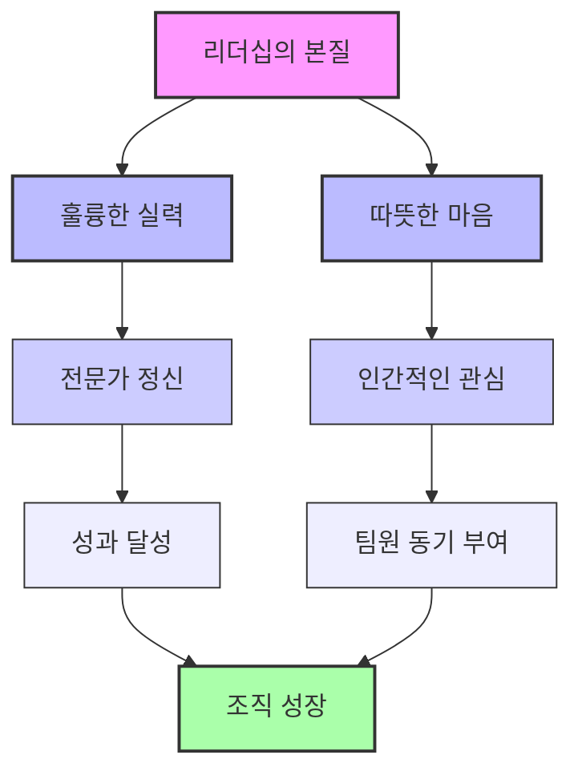
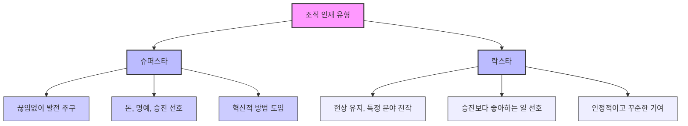

## 실리콘밸리의 팀장들: 완전한 솔직함으로 이끄는 리더십 
이 책은 구글과 애플에서 700명 이상의 직원을 관리했던 킴 스콧이 쓴 리더십 지침서야. 실리콘밸리의 성공적인 기업들이 어떤 방식으로 소통하고 팀을 이끄는지, 그리고 팀장들이 어떤 역할을 해야 하는지 아주 자세하게 알려주고 있어. 특히, 팀원들과의 관계를 어떻게 구축하고, 성과를 어떻게 끌어올릴지에 대한 실용적인 조언들이 가득 담겨 있어.

## 1. 직장 생활의 현실과 퇴사 열풍: 왜 우리는 회사를 떠나고 싶어 할까? 

요즘 직장인들 사이에서는 '퇴사'라는 단어가 마치 시원한 해방감처럼 느껴지는 경우가 많아 . 실제로 입사 1년 차에 30%, 3년 안에 60%가 퇴사한다는 통계도 있을 정도야 .

1. **퇴사 열풍의 배경**:
  - 학생에서 직장인으로 바뀌면서 문화 충격을 겪는 경우가 많아 . 학교에서 배운 것과 달리 정답 없는 직장 생활에 당황하고, 더 이상 성장하지 못할까 봐 불안해하는 거지 .
  - 기대했던 것과 달리 쓸데없는 일이 너무 많다고 느끼는 경우도 흔해 .
  - 구체적인 계획 없이도, 그저 지금의 상황을 벗어나고 싶어서 퇴사를 선택하는 경향도 있어 . 마치 유행처럼 퇴사를 결정하는 거지.
  - 취업 포털 사람인코리아 조사에 따르면, 직장인 10명 중 7명이 심각한 우울증을 겪었다고 해 . 특히 20대와 30대 초반 직장인들의 우울감이 더 강하다고 해 .
  - 이런 마음을 반영하듯 '퇴사'가 사회적 키워드가 되고, '워라밸(일과 삶의 균형)'과 스타트업 열풍이 퇴사 욕구를 더 부추기고 있어 .
  - "빨리 결정하지 않으면 뒤처진다"는 자극적인 메시지나, 아는 사람의 창업 성공 스토리가 퇴사를 부추기기도 해 .

2. **퇴사가 능사는 아니야**:
  - 하지만 퇴사하고 여행을 떠나거나 하고 싶은 일을 찾는다고 해서 모든 문제가 해결되는 건 아니야 .
  - 어떤 사람에게는 해결책이 될 수 있지만, 모두에게 그런 건 아니거든 . 오히려 같은 문제가 반복되거나 또 다른 문제의 시작이 될 수도 있어 .
  - 저자는 회사를 그저 이용당하는 곳으로 생각하기보다는, 어떻게 하면 회사를 잘 활용할 수 있을지 고민하는 게 더 실속 있다고 조언해 .

3. **직장 상사의 문제**:
  - 직장인에게 회사는 다니기는 괴롭지만 그만둘 수도 없는 '뜨거운 감자' 같은 존재야 .
  - 만약 이런 직장에 무례한 팀장이나 성과 압박까지 있다면, 견디기 더 힘들겠지 .
  - 다른 직장으로 옮겨도 또 다른 이상한 상사를 만나지 않으리란 보장이 없어 . 결국 어디에나 무례한 상사는 있기 마련이고, 그들과 잘 지내는 방법을 아는 게 중요해 .
  - 일부 상사들은 자신의 승진이나 사적인 욕심을 채우기 위해 부하 직원들의 고통이나 건강에는 아무 상관 없다고 생각하는 경향이 있어 .
  - 조직 운영에 적합하지 않은 사람을 관리직에 두는 건 부하 직원뿐만 아니라 본인에게도 불행한 일이야 . 마치 부엌에서 일하는 사람이 음식 냄새를 배는 것처럼, 위험한 상사 밑에서 일하면 자신도 모르게 그런 상사를 닮아갈 수 있어 .
  - 이런 상사들 때문에 우울증, 공황장애 같은 정신적 문제가 늘어나고 있다고 해 .

## 2. 실리콘밸리 팀장들이 말하는 '완전한 솔직함' 

이 책의 저자인 킴 스콧은 구글에서 700명 이상을 관리하고 애플 대학교에서 관리자 교육 과정을 개발한 사람이야 . 그녀는 실리콘밸리의 새로운 리더들 사이에서 널리 퍼지고 있는 소통 방식을 정리해서 이 책을 썼어 . 핵심은 바로 '완전한 솔직함(Radical Candor)'이야 .

1. **완전한 솔직함이란**:
  - 이 개념은 '개인적인 관심(Care Personally)'과 '직접적인 도전(Challenge Directly)'이라는 두 가지 축으로 설명할 수 있어 .
  - **개인적인 관심**: 팀원들을 그저 일하는 기계가 아니라, 한 명의 인간으로서 존중하고 관심을 가지는 거야 .
  - **직접적인 도전**: 팀원들의 성장을 위해 필요한 피드백을 솔직하고 명확하게 전달하는 거지 .
  - 이 두 가지가 균형을 이룰 때 '완전한 솔직함'이 가능해져.

2. **완전한 솔직함이 필요한 이유**:
  - 저자는 과거에 '칭찬할 게 없으면 말하지 마라'는 말을 듣고 자랐지만, 기업 조직에서는 이런 태도가 옳지 않다고 말해 .
  - 실리콘밸리의 성공적인 회사들은 솔직한 소통을 통해 성과를 내고 있어 .
  - 예를 들어, 저자가 벤처 회사를 운영할 때, 한 직원이 업무 수준이 낮았는데도 칭찬만 하다가 결국 해고하게 된 사례가 있어 . 이 직원은 "왜 그때 이야기 안 했냐? 그때 이야기했으면 노력했을 텐데"라며 분노했지 . 이 경험을 통해 저자는 솔직한 피드백의 중요성을 깨달았어 .
  - 기업에서는 '좋은 게 좋은 것'이라는 태도보다는, 성과에 직접적인 영향을 미치는 피드백을 솔직하게 주고받는 것이 중요해 .

3. **완전한 솔직함의 네 가지 유형**:
  - 완전한 솔직함** (**Radical Candor**)**: 개인적인 관심과 직접적인 도전을 모두 갖춘 이상적인 리더십이야. 팀원을 진심으로 아끼면서도 필요한 비판을 솔직하게 전달하는 거지.
  - 불쾌한 공격** (Obnoxious Aggression)**: 직접적인 도전은 강하지만 개인적인 관심이 부족한 유형이야. 마치 "네 머리가 허연 건 사실이지만, 사람 무시하는 얘기 아니냐?"는 식으로, 팩트를 지적해도 상대방을 불쾌하게 만들 수 있어 .
  - 파괴적인 공감** (Ruinous Empathy)**: 개인적인 관심은 많지만 직접적인 도전을 피하는 유형이야. 팀원이 상처받을까 봐 솔직한 피드백을 주지 못하고, 결국 팀원의 성장을 방해하고 회사에 손실을 끼치게 돼 . 마치 사랑하는 개의 꼬리를 조금씩 잘라 고통을 덜어주려다가 결국 더 큰 고통을 안겨주는 것과 같아 .
  - **조작적인 불성실 (**Manipulative Insincerity**)**: 개인적인 관심도 없고 직접적인 도전도 없는 최악의 유형이야. 뒤에서 험담을 하거나, 겉으로는 긍정적인 척하면서 문제를 해결해주지 않는 상사들이 여기에 해당해 .

## 3. 피해야 할 상사 유형: 조직을 병들게 하는 악당들 

조직에 손실을 끼치고 인재를 떠나게 만드는 '악당 상사'들은 여러 유형이 있어. 이런 상사들은 팀원들의 사기를 꺾고 조직 전체의 효율성을 떨어뜨리지.

1. 기계적 상사:
  - **특징**: 융통성이 없고 정해진 방식만 고집해서 팀원들과 마찰을 일으키기 쉬워 .
  - **예시**: 중요한 회의 중에 프로젝트 내용보다는 자료의 쪽수나 글자 크기 같은 사소한 흠을 잡거나, 논의와 상관없는 자신의 옛날 무용담을 늘어놓는 상사 .
  - **문제점**: 회사의 매뉴얼이 현실과 동떨어져 있어도 무조건 따르라고 강요해 . 자신이 익숙하고 안전하다고 느끼는 방식만 고집하기 때문이야 .
  - 소통** 방식**: "매뉴얼대로 해라", "내가 말한 대로 해라", "시키는 것이나 잘해라" 같은 말을 자주 해 . 사람의 감정이나 상황을 전혀 고려하지 않아 .

2. **의존적 상사**:
  - **특징**: 겉으로는 팀원들의 말을 잘 들어주고 편을 들어주는 듯하지만, 실제로는 자신의 이익을 위해 팀원들을 이용하는 경향이 있어 .
  - **문제점**: 팀원들의 고민을 들어주는 척만 할 뿐, 실질적인 해결책을 제시하지 않고 문제를 더 복잡하게 만들어 .
  - **소통 방식**: 특별히 격렬한 감정을 드러내지 않고, "좋다"는 식으로 대충 넘어가는 경우가 많아 . 결국 팀원들에게 아무런 도움이 되지 않아 조직을 갉아먹는 존재가 돼 .

3. 자기애적 상사:
  - **특징**: 자신의 능력을 실제보다 과대평가하는 경향이 있어 . 감당할 수 있는 범위를 넘어서는 일을 맡고, 심지어 잘 알지도 못하면서 일단 일을 벌여 .
  - **문제점**: 맡은 일을 아래 직원들에게 떠넘기고, 자신은 항상 바쁘고 조급해하며 배울 점을 찾기 어려워 .
  - **과대망상**: 자신은 남들보다 몇 배는 중요한 대단한 일을 하고 있다는 과대망상에 빠져 살아 .

4. 몰약형 상사** (이용 가치 중심 상사)**:
  - **특징**: 팀원과의 관계를 맺을 때, 자신에게 필요한 '이용 가치'가 있는지를 기준으로 대응 방식을 정해 .
  - **행동 방식**: 쓸모 있다고 판단되는 동안에는 잘해주고, 때로는 선심도 베풀며 인간적인 배려를 보여주기도 해 .
  - **문제점**: 하지만 이용 가치가 끝났다고 판단되면 가차 없이 버려 . 어떻게 하면 팀원을 자기 마음대로 움직일 수 있을지 항상 고민하고, 목적 달성을 위한 효율적인 방법을 찾는 데 몰두해 .
  - **잔인함**: 일이 뜻대로 되지 않으면 게임을 리셋하듯이 팀원을 교체하는 등 다른 방법을 찾아내는 데 능숙해 .

## 4. 상사의 함정: 솔직함을 가장한 위험한 유도 

회식 자리나 사적인 모임에서 상사가 "편하게 허심탄회하게 이야기해봐. 그게 결국 나에게 도움이 된다. 나는 너를 믿고 신뢰한다"고 말하는 경우가 있어 .

1. **숨겨진 의도**:
  - 이런 멘트는 겉으로는 멋있어 보이지만, 사실은 자신의 반대편에 있는 사람, 즉 '안티'를 찾아내려는 무서운 과정일 수 있어 .
  - 팀원들은 바보가 아니기 때문에 이런 상황에서 자신을 방어하려고 해 .
  - 상사가 100%의 솔직함을 기대한다면, 팀원들은 겨우 10~20% 정도의 사소한 내용만 이야기하며 "팀장님이 말씀하라고 하시니까 어쩔 수 없이 하는 거지, 저는 만족하고 있습니다. 그런데 굳이 말하면 이런 건 있죠"라고 말해 .
  - 이런 상황을 '조직 사회의 슬픈 연극'이라고 부르기도 해 .
  - 권한과 권력을 가진 인물에게 솔직한 이야기를 하는 것은 언제든 자신에게 불이익으로 돌아올 수 있기 때문에 사람들이 꺼리는 거야 .

## 5. '열정'에 대한 오해: 무조건 열정을 따르는 것이 정답일까? 

많은 자기계발서나 유명인들은 "자신이 좋아하는 일, 열정을 따르라"고 조언해 . 스티브 잡스도 2005년 스탠퍼드 대학교 졸업 연설에서 "여러분이 사랑하는 일을 찾으세요. 아직 찾지 못했다면 계속 찾아보세요"라고 말했지 .

1. **열정론의 문제점**:
  - 하지만 세계적인 전문가들은 이런 '열정론'이 틀렸을 뿐만 아니라 위험하기까지 하다고 지적해 .
  - 대부분의 사람들은 애초에 뚜렷한 열정을 품고 있지 않아 . 설령 열정이 있다고 해도, 그것이 직업이나 교육과 관련된 경우는 5%에도 못 미친다는 연구 결과도 있어 .
  - 열정을 맹신하다가는 현실의 벽에 부딪혀 실패하기 쉽고 . 마법처럼 완벽한 일이 자신을 기다리고 있을 거라는 환상에 빠져 정신적으로 고통받을 수 있어 .
  - 만약 열정을 실현하는 데 실패하면, '열정 없는 사람', '실패한 사람'이라는 이중의 감정과 우울감에 시달릴 수 있고, 결국 잦은 이직으로 이어질 수도 있어 .
  - 실제로 지난 20년간 미국인의 직업 만족도가 지속적으로 하락했는데, 이는 열정 중심의 커리어 관리 전략이 실패했을 가능성을 보여줘 .

2. **스티브 잡스의 진짜 이야기**:
  - 놀랍게도 스티브 잡스 본인은 젊은 시절에 IT 기업 경영에 열정이 없었어 .
  - 대학생 때는 고서적을 연구하고 동양 신비주의에 심취했으며, 사업이나 전자기기에는 관심이 전혀 없었지 .
  - 대학을 중퇴하고 수련 공동체를 들락거리거나 인도로 여행을 다니며 영적 깨달음을 추구하던 젊은이였어 .
  - IT는 그저 당장 쓸 용돈이 없어서 시작한 일에 불과했다고 해 .
  - 만약 잡스가 자신의 조언대로 열정을 따랐다면, 영성 강사나 여행 가이드가 되었을지도 몰라 . 하지만 그는 세계적인 IT 기업의 수장이 되는 길을 선택했어 .
  - 결국 잡스는 자신이 하는 일에 열정을 갖게 되었지만, 그것은 '열정을 따랐기 때문'이 아니라 '자신이 원하는 일에 열정이 따라오도록 만들었기 때문'이라고 볼 수 있어 .

3. **전문가 정신의 중요성**:
  - 배우이자 코미디언인 스티브 마틴은 연기자를 꿈꾸는 후배들에게 "누구도 당신을 무시하지 못할 실력을 쌓아라"고 조언했어 .
  - 열정은 중요하지만, 열정만을 좇기보다는 전문가적인 실력을 연마하는 '엑설런트 정신'이 필요하다는 가르침이야 .
  - **전문가 정신**: "내가 세상에 무엇을 줄 수 있는가"에 집중하는 것이고 .
  - **열정**: "세상이 내게 무엇을 줄 수 있는가"에 집중하는 것이라고 할 수 있어 .
  - 훌륭한 경력은 누가 그냥 주는 것이 아니라, 자신의 손으로 일구어내는 것이며 그 과정은 결코 순탄치 않아 .

4. **현실을 직시해야 해**:
  - 귀농·귀촌이나 라이프스타일 디자인 블로거 같은 직업을 꿈꾸는 사람들이 많지만, 현실은 녹록지 않아 .
  - 귀농은 농사일이 상상 이상으로 힘들고, 날씨는 항상 농사에 비협조적이며, 잠잘 시간도 부족하다고 해 .
  - 라이프스타일 블로거들도 돈을 벌지 못해 어려움을 겪는 경우가 많아 . 열정에 사로잡혀 자율성을 추구하지만, 그것을 뒷받침할 실력이 없기 때문이야 .
  - 결국 이 책은 "분명하고 강력한 사명감을 바탕으로 커리어를 쌓아야 한다"고 강조해 . 혁신은 한순간에 찾아오는 것이 아니라, 체계적으로 최선을 다해 조금씩 발전시켜 나가는 과정에서 이루어지는 것이라고 말이야 .

## 6. 덴 프라이스의 리더십: 모두가 행복한 회사를 만들 수 있을까? 

미국 시애틀의 카드 결제 시스템 회사 '그래비티 페이먼트'의 CEO 덴 프라이스는 파격적인 결정을 내렸어 .

1. **파격적인 결정**:
  - 2015년, 프라이스는 자신의 연봉 100만 달러 이상을 7만 달러로 낮추고, 대신 전 직원 120여 명의 최저 연봉을 3년 안에 7만 달러 수준까지 인상하겠다고 발표했어 .
  - 최저 연봉을 7만 달러로 정한 이유는 노벨 경제학상 수상자 대니얼 카너먼 교수의 연구 결과, "인간은 7만 달러 이상의 연봉을 받을 때 가장 행복하다"는 내용을 참고했기 때문이야 .

2. **사회적 파장**:
  - 이 결정은 미국 전역에서 큰 화제가 되었어 . 트위터에 5억 건 이상의 반응이 올라왔고, MBC 뉴스는 역대 최다 공유 횟수를 기록했지 .
  - 프라이스는 자신의 이익을 줄여 노동자의 임금을 챙겨주는 '현대판 로빈 후드'로 불렸어 .
  - **비판**: 하지만 보수 성향 언론들은 "과도한 임금은 노동자를 게으르게 만들고 시장 경제 질서를 무너뜨릴 수 있다"며 비판했어 . 심지어 백만장자 방송인 러시 림은 프라이스의 회사를 "사회주의가 제대로 굴러가지 않는 예시"라고 비웃었지 .
  - 프라이스의 형이자 공동 창립자인 루카스는 이 결정에 반대하며 회사를 떠났고, 동생을 배임 혐의로 고발하기까지 했어 .
  - **오해**: 프라이스가 자금난 때문에 저택을 매물로 내놨다는 악의적인 보도도 있었지만, 사실 그 저택은 에어비앤비 실험용이었고 임금 인상 전부터 매물로 내놓은 상태였어 . 그는 이미 5년 넘게 100만 달러 이상의 연봉을 받던 백만장자였기 때문에 자금난에 시달릴 이유가 없었지 .

3. **결정의 배경**:
  - 프라이스는 왜 이런 결정을 했을까? 낮은 임금에 대한 직원의 불평불만에 큰 충격을 받았기 때문이야 .
  - 어느 날 담배를 피우던 중 한 직원이 "당신이 나를 착취하고 있잖소"라고 말했고 . 당시 3만 5천 달러를 받던 이 직원은 "인간다운 삶을 데이터로 규정할 수 있는 것이 아니다"라고 답했어 .
  - 프라이스는 자신의 사업이 자영업자들의 불편을 없애고자 시작했는데, 정작 자신의 회사 직원들의 불만을 이해하지 못하고 있었다는 사실에 자책감을 느꼈어 .
  - 2008년 금융 위기 이후 임금 인상을 소홀히 했던 점을 깨닫고, 직원들에게 상처를 줬다는 것을 반성하며 이런 결정을 내린 거야 .

4. **긍정적인 변화**:
  - 프라이스의 결정 이후 회사와 직원들에게 놀라운 변화가 찾아왔어 .
  - **매출 및 이익 증가**: 가격 인상이나 서비스 악화 우려와 달리, 회사의 매출과 영업이익은 계속 상승했어 . 고객 유치 비율은 95% 이상으로 늘었고, 월평균 거래는 200건에서 2000~3000건 이상으로 수직 상승했지 .
  - **우수 인력 유입**: 연봉 인상 발표 일주일 만에 5천 통이 넘는 이력서가 쏟아졌고, 다른 회사 임원들도 연봉 80% 삭감을 감수하고 합류했어 .
  - **직원들의 행복**: 시애틀의 높은 집값 때문에 교외에 살던 직원들이 다시 시내로 이사 오면서 출퇴근 시간이 크게 줄었어 . 출산율도 6배나 높아졌고, 이직률은 감소하고 우수 인력은 계속 유입되었지 .
  - 2019년 기준으로 그래비티 페이먼트의 평균 연봉은 10만 3천 달러로, 실리콘밸리 최고 기업들과 비슷한 수준이야 .
  - 형이 제기했던 배임 혐의 소송에서도 무혐의로 승소했어 .
  - 하버드 비즈니스 스쿨 교수는 프라이스의 성공 요인을 "직원들이 최고경영자가 자신들을 존중하고 있고, 더 많은 임금을 주는 회사를 찾기 힘들다는 걸 깨달았기 때문에 스스로 생산성을 높였다"고 분석했어 .

5. **비판과 한계**:
  - 일각에서는 프라이스의 도전이 직원 수가 적은 중소기업이라 가능했다는 지적도 있어 .
  - 또한, 그의 임금 인상이 시애틀 지역의 높은 평균 임금에 맞춘 것에 불과하며, 직원들의 이직을 막기 위한 고육지책이라는 비판도 있어 .
  - 하지만 그래비티 페이먼트는 최소 연봉과 최대 연봉의 폭이 적어, 돈을 많이 받는 사람과 적게 받는 사람 사이의 위화감을 줄일 수 있다는 장점이 분명해 .

6. **불평등에 대한 비판**:
  - 프라이스는 전체 부의 80%가 상위 1%에게만 돌아가고, 나머지 99%는 20%도 채 안 되는 부를 받는 불평등한 부의 배분 구조를 강하게 비판하고 있어 .
  - 특히 시애틀의 맹주인 아마존을 두고, "세계 최대 가치를 지닌 아마존에는 60만 명의 직원이 있지만, 평균 임금은 3만 달러 이하다. 제대로 분배되면 직원 한 명당 140만 달러가 돌아가야 한다"고 지적했어 .
  - 그는 기업의 주인이자 최고경영자로서, 최고경영자와 임원들에게 부가 집중되는 자본주의의 폐단을 꼬집은 거야 . 그래서 그의 트위터 소개에는 '미국에서 가장 위험한 최고경영자'라고 적혀 있어 .

## 7. 리더십의 본질: 실력과 따뜻한 마음 

리더십은 단순히 어려운 이론이 아니라, 자신과 함께하는 직원들을 만족시키는 것이 핵심이야 . 덴 프라이스의 사례처럼, 리더십의 본질은 '훌륭한 실력'과 '따뜻한 마음'에 있다고 할 수 있어 .

1. **최고의 상사가 해야 할 세 가지 역할**:
  - 조언** (Guidance)**: 팀원들이 올바른 방향으로 나아가도록 실질적인 피드백을 주고받는 문화를 만드는 거야 .
  - **피드백의 기본 원칙**:
  - 행동이 벌어진 직후에 바로 피드백을 줘야 해 .
  - 인간성(성격)이 아닌 행동을 지적해야 해 . 예를 들어, "10분 늦었네"라고 말해야지, "너 불성실해서 어떻게 되겠어?"라고 말하면 안 돼 .
  - 고칠 수 있는 행동 안에서 지적해야 해 . 고칠 수 없는 행동에 대해서는 말하지 않는 것이 좋아 .
  - **칭찬과 질책**: 이 책에서는 칭찬과 질책을 동시에 해야 한다고 말해 . 과거에는 칭찬과 질책을 동시에 하지 말라고 배웠지만, 시대가 변하면서 피드백 방식도 달라지고 있는 거지 .
  - 팀 빌딩** (Team Building)**: 팀의 결속력을 높이고 동기를 부여하는 방법을 알아내는 거야 .
  - **개인적인 관심**: 팀원들을 뭉뚱그려 보지 않고, 각자의 개성을 가진 존재로 보고 개인적으로 케어해야 해 . 마치 상담 자격증이 있는 것처럼 팀원들의 이야기를 들어주고 공감하는 것이 중요해 .
  - 적재적소** 배치**: 채용, 해고, 승진 등을 통해 적재적소에 사람을 배치하는 것이 팀 빌딩의 핵심이야 .
  - 어시스트** 강조**: 축구에서 MVP가 골만 많이 넣는 선수가 아니라 어시스트도 잘하는 선수인 것처럼, 팀원들이 서로 돕고 협력하는 문화를 만들어야 해 . KPI(핵심 성과 지표)에 어시스트 같은 협력 요소를 포함시켜야 부서 이기주의를 줄일 수 있어 .
  - **출근하고 싶은 회사**: 팀원들이 출근하기 싫어하는 요인(소외감 등)을 파악하고, 반대로 열정적으로 일하게 만드는 요인을 찾아내야 해 .
  - **성과 (Results)**: 협력하여 목표를 달성하도록 돕는 거야 .
  - **실행의 중요성**: 성과는 단순히 계획만 세운다고 자동으로 나오는 것이 아니야 . 새로운 시스템을 갖추고, 성과에 집중하는 조직 문화가 필요해 .
  - **혁신적인 자세**: 지난 분기와 똑같이 행동하면서 이번 분기에 더 좋은 성과를 기대하는 것은 '연목구어(나무에 올라 물고기를 구함)'와 같아 . 성과가 좋아지려면 이전 방법보다 새로운 방법으로 더 혁신적인 자세로 일에 임해야 해 .

2. **관계와 책임의 상호작용**:
  - 관계와 책임은 서로 긍정적이거나 부정적으로 강화돼 .
  - 관계가 좋으면 팀원들이 책임을 서로 공유하려고 하지만, 관계가 나쁘면 책임을 서로 떠넘기려고 해 .
  - 대기업에서 같은 조직 내에서도 정보를 공유하지 않는 경우가 있는데, 이는 성과에 대한 공이 다른 팀으로 돌아갈까 봐 두려워하거나, 자신의 실수를 숨기려는 부서 이기주의 때문이야 . 이런 팀들은 이 책을 꼭 읽어야 해 .

3. 인문학적** 통찰의 중요성**:
  - 저자는 "인간적 유대감을 고대 철학자의 이론 속에서 찾을 수 없다"고 단정적으로 말했지만 . 이는 인문학이 경영에 전혀 도움이 되지 않는다는 의미로 해석될 수 있어 .
  - 하지만 실제로는 아리스토텔레스나 홉스 같은 철학자들을 인용하기도 해 .
  - 결국 '인간 존중'이라는 가치는 인문학적 통찰에서 비롯되는 것이며, 팀원 한 사람 한 사람을 이해하려는 노력이 중요해 .
  - 동양의 사상, 예를 들어 공자의 논어에서 많은 것을 배웠다고 말하는 서양의 경영 구루들도 많아 . 서양은 이런 아이디어를 '상품화'하는 데 능숙한 것 같아 .

## 8. 슈퍼스타와 락스타: 조직의 다양한 인재를 이해하기 

조직에는 다양한 유형의 인재들이 있어. 이 책에서는 크게 '슈퍼스타'와 '락스타'라는 개념으로 설명하고 있어 .

1. **슈퍼스타**:
  - **특징**: 끊임없이 발전하고 성장하려는 사람들을 말해 . 현재에 안주하지 않고 더 높은 목표를 향해 나아가려고 해 .
  - **목표**: 돈과 명예, 승진, 그리고 더 빛나는 무대(더 큰 성과)를 추구하는 경향이 있어 . 혁신적인 방법을 도입하고 규모를 키우는 데 관심이 많아 .
  - **예시**: "지금은 작은 공연장에서 공연하지만 내년에는 잠실 운동장에서 공연하겠다"는 식으로 급격한 성장을 원하는 사람들을 비유할 수 있어 .

2. 락스타:
  - **특징**: 승진이나 큰 성공보다는 자신이 좋아하는 일을 꾸준히 하고 싶어 하는 사람들을 말해 . 특정 분야에 깊이 천착(파고들어 연구함)하며 전문가가 되기를 원해 .
  - **목표**: 돈과 명예보다는 자신이 하는 일 자체에서 만족감을 느끼고, 그 일을 평생토록 할 수 있기를 바라 .
  - **예시**: 돈을 많이 벌 기회가 있어도 도망가 버리는 유명 락스타 가수처럼, 자신의 음악 세계를 지키는 것을 더 중요하게 생각하는 사람들을 비유할 수 있어 .
  - **조직 내 역할**: 락스타는 조직에 꼭 필요한 존재야 . 이들이 의기소침해지거나 침체되지 않도록 돕는 것도 팀장의 중요한 임무라고 할 수 있어 .

3. **두 유형의 조화**:
  - 조직은 슈퍼스타에게만 초점을 맞추는 경향이 있지만, 락스타도 매우 중요한 역할을 해 .
  - "승진 아니면 퇴출"이라는 제도로 조직을 운영하는 것은 잘못된 방식이야 .
  - 승진을 원하는 사람은 승진시키고, 자신의 자리에서 시간적 여유를 즐기며 꾸준히 기여하고 싶어 하는 사람에게는 그에 맞는 임무를 부여할 수 있는 조직을 만들어야 해 .
  - 사람의 생애 주기에서도 슈퍼스타가 될 때가 있고 락스타가 되어야 할 때가 있어 . 저자 킴 스콧도 아이를 낳고 육아하는 기간에는 파트타임 노동자로서 락스타의 길을 걸었다고 해 .
  - 요즘 조직 분위기에서는 앞에 나서지 않으려는 락스타들이 훨씬 많아 . 특히 워라밸을 중요하게 생각하는 사람들이 많아지면서 팀장이 되려고 하는 사람이 적은 경향이 있어 .
  - 따라서 리더는 이 두 유형의 인재를 잘 이해하고 조절하며, 각자의 강점을 살릴 수 있도록 지원해야 해.

