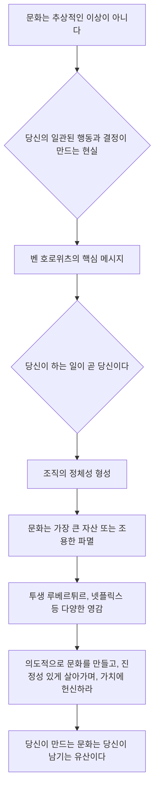

## 벤 호로위츠의 '당신이 하는 일이 곧 당신이다' 요약
이 책은 벤 호로위츠가 쓴 '당신이 하는 일이 곧 당신이다(What You Do Is Who You Are)'라는 책의 내용을 요약한 거야. 이 책은 회사의 문화가 얼마나 중요한지, 그리고 그 문화를 어떻게 만들어나가야 하는지에 대해 알려주는 실용적인 안내서라고 보면 돼. 저자는 역사 속 위대한 리더들, 예를 들면 아이티 혁명가 투생 루베르튀르, 일본의 사무라이, 몽골의 칭기즈칸, 그리고 현대 기업들의 사례를 통해 문화가 어떻게 형성되고 유지되는지 보여주고 있어. 핵심 메시지는 이거야. "당신이 말하는 것이 아니라, 당신이 <u>행동하는 모든 것</u>이 바로 당신의 문화가 된다"는 거지. 

## 1. 행동이 말보다 중요하다: 문화는 행동으로 만들어지는 거야 

1. **말은 순간적이지만, 행동은 영원히 울려 퍼진다** 
  - 문화는 우리가 "이런 가치를 지향한다"고 말하는 것만으로는 만들어지지 않아. 
  - 오직 우리가 <u>꾸준히 행동하는 것</u>을 통해 단단하게 세워지는 거야. 
  - 말은 잠시 사람들에게 영감을 줄 수 있지만, 행동은 훨씬 더 오래도록 영향을 미치지. 

2. **아이티 혁명가 투생 루베르튀르의 리더십: 행동으로 문화를 만든 예시** 
  - 루베르튀르는 노예들이 복수심에 불타 파괴적으로 변할 수 있는 혼란스러운 상황을 물려받았어. 
  - 하지만 그는 <u>규율을 요구하고 스스로 절제하는 모습</u>을 보여줬지. 
  - 병사들이 배고프고 자원이 부족해서 약탈할 기회가 있었을 때도, 그는 약탈을 금지했어. 
  - 당장의 이득보다 <u>정직함과 단결을 우선</u>한 거야. 
  - 병사들은 그의 원칙에 대한 헌신을 보고 그를 따랐어. 
  - 이런 행동을 통해 루베르튀르는 혁명을 이끌었을 뿐만 아니라, 새로운 독립 국가의 도덕적 기반을 다졌어. 
  - 그의 행동은 추종자들이 스스로를 정의하는 흔들리지 않는 규범이 되었지. 

3. **말과 행동이 불일치할 때의 위험성: 현대 기업과 NASA의 사례**
  - **협업을 외치지만 개인의 성과만 중시하는 회사** 
  - 어떤 회사가 "우리는 협업을 중요하게 생각한다"고 말하지만, 최고의 성과를 내는 직원들이 팀워크를 무시하도록 내버려 둔다고 상상해봐. 
  - 예를 들어, 스타 개발자들이 지식을 공유하지 않고 개인적인 영광을 위해 전문성을 독점하는 기술 회사 같은 거지. 
  - 결과는 뻔해. 사기가 떨어지고, 신뢰가 무너지고, 공유된 성공보다는 내부 경쟁 문화가 생겨나는 거야. 
  - 리더십이 단기적인 생산성을 위해 이런 행동을 눈감아주면, 팀워크와 단결이라는 말했던 가치들은 다 무너져버려. 
  - 어떤 슬로건이나 연설, 팀 빌딩 활동도 이 균열을 고칠 수 없어. 왜냐하면 <u>행동이 항상 말보다 중요</u>하니까. 
  - 빈말로는 리더십을 발휘할 수 없어. 
  - 당신이 내리는 모든 결정은 당신이 만들고 싶은 문화를 강화하거나 약화시키는 거야. 
  - **1986년 **챌린저호 참사**: 안전을 외쳤지만 편의를 택한 NASA** 
  - NASA는 정밀함과 안전에 헌신한다고 공언했지만, 일정 압박과 내부 역학 때문에 엔지니어들의 경고를 무시했어. 
  - 알려진 위험에도 불구하고 우주왕복선을 발사하기로 한 결정은 그들이 내세웠던 가치와 모순되었지. 
  - 결과는 비극적이었어. 생명을 잃었을 뿐만 아니라, NASA 리더십에 대한 신뢰도 무너졌지. 
  - 챌린저호 사건은 행동과 말이 일치하지 않을 때 얼마나 심각한 결과를 초래할 수 있는지 보여주는 끔찍한 교훈이야. 
  - 안전 문화를 외쳤지만, 실제로는 편의주의 문화를 실천한 셈이지. 
  - 말과 행동의 불일치가 치명적인 결과를 낳은 거야. 

4. **가치와 행동을 일치시키는 모범 사례: **파타고니아 
  - 파타고니아는 행동과 가치를 일치시키는 것으로 유명한 회사야. 
  - 리더십은 환경적 책임을 강조하고, 회사는 그 약속을 구체적인 방법으로 지켜. 
  - 수익의 일부를 환경 단체에 기부하고, 새 옷을 사라고 권하기보다는 고객의 옷을 수선해주는 등, 파타고니아는 모든 행동으로 자신들의 사명을 실천하고 있어. 
  - 직원과 고객 모두 이런 가치들을 내면화하는데, 왜냐하면 <u>꾸준히 실천되는 모습</u>을 보기 때문이야. 
  - 이 회사의 문화는 영리한 마케팅 캠페인 때문이 아니라, <u>타협 없는 </u>행동 때문에 번성하는 거야. 

5. **리더의 행동이 곧 문화의 신호다** 
  - 당신의 행동은 당신의 우선순위를 가장 명확하게 보여주는 신호야. 
  - 다양성을 외치면서도 항상 똑같은 특정 인구 집단만 고용한다면, 어떤 사명 선언문보다 더 큰 메시지를 보내는 셈이지. 
  - 투명성을 약속하면서도 중요한 결정을 숨긴다면, 당신의 진짜 가치를 드러내는 거야. 
  - 사람들은 당신이 듣는 것이 아니라, <u>보는 것을 따라 해</u>. 
  - 만약 당신이 책임감, 정직함, 협업을 보여준다면, 당신의 팀도 그런 자질을 반영할 거야. 
  - 만약 당신이 오만함, 위선, 무관심을 보인다면, 그들도 그걸 따라 할 거야. 
  - 당신이 내리는 모든 결정, 당신이 보여주는 모든 행동이 실시간으로 당신의 문화를 정의하는 거야. 

6. **문화는 위임할 수 없는 리더십의 현실** 
  - 이것은 다른 사람에게 맡길 수 있는 일이 아니야. 
  - 체크리스트처럼 확인하고 넘어갈 수 있는 일도 아니지. 
  - 이것은 리더십의 지속적인 현실이야. 
  - 루베르튀르가 아무리 어려운 상황에서도 약탈을 허용하지 않았던 것을 생각해봐. 
  - NASA가 말과 행동을 일치시키지 못했던 실패를 생각해봐. 
  - 파타고니아가 자신들의 사명에 흔들림 없이 헌신했던 것을 생각해봐. 
  - 이 모든 예시들은 하나의 진실을 강조해. 
  - 문화는 당신의 행동이 쌓여서 만들어지는 결과라는 거야. 
  - 의도적으로 문화를 만들어나가야 해. 
  - 다른 사람들에게서 보고 싶은 정직함과 규율을 스스로에게 요구해야 해. 
  - 당신의 말이 일관성 없는 행동으로 생긴 빈틈을 채울 수 있다고 믿는 함정에 빠지지 마. 
  - 오늘 당신이 하는 일이 내일 당신 주변 사람들의 가치와 행동에 울려 퍼질 거야. 
  - 의도적으로 행동하고, 끈기 있게 행동하고, 당신이 만들고 싶은 문화 자체가 되어야 해. 

## 2. 문화는 코드와 같다: 명확한 행동 지침이 중요해 

1. **문화는 잘 짜인 코드처럼 작동한다** 
  - 최고의 문화는 마치 잘 조율된 행동 코드처럼 작동해. 
  - 끊임없이 감독할 필요 없이 조직을 매끄럽게 이끌어가는 거지. 
  - 잘 정의된 문화 코드는 모든 사람이 이해하고, 내면화하고, 본능적으로 따르는 가치와 원칙의 틀이야. 

2. **사무라이의 '**부시도**' **코드**: 명확한 문화 코드의 힘** 
  - 벤 호로위츠는 사무라이의 '부시도' 코드에 비유하며 설명해. 
  - 부시도는 엄격하지만 효과적인 시스템으로, 전사들을 흔들림 없는 명확성으로 이끌었어. 
  - 부시도는 충성심, 명예, 규율을 강조했어. 
  - 이런 가치들은 사무라이를 단결시켰을 뿐만 아니라, 혼란스러운 전투 속에서도 목적과 결속력을 주었지. 
  - 코드가 명확하고 보편적으로 존경받았기 때문에, 여러 세대에 걸쳐 영향을 미치며 유산을 만들었어. 
  - 마찬가지로, 강력한 조직 문화도 명확하게 표현되고 엄격하게 지켜지면, 혼란스러운 시기에도 스스로 강화되고 흔들리지 않게 돼. 

3. **현대 기업의 **문화** 코드: 넷플릭스와 엔론의 대조**
  - **넷플릭스의 '**자유와 책임**' 문화: 현대판 **부시도 
  - 호로위츠는 넷플릭스의 '자유와 책임' 문화를 현대판 부시도 시스템으로 강조해. 
  - 넷플릭스는 직원들에게 놀라운 자율성을 부여하지만, 이 자유는 무질서하지 않아. 
  - 책임감에 기반을 두고 있지. 
  - 명확한 지침이 있어서 모든 사람이 기대치를 이해해. 
  - 직원들은 결정을 내릴 권한을 부여받지만, 이 코드는 그들에게 높은 성과와 윤리적 행동 기준을 요구해. 
  - 그 결과, 창의성이 혼란으로 빠지지 않고 번성하는 조직이 되는 거야. 
  - 넷플릭스는 문화 코드를 정의하고 시행함으로써, 모든 직원이 일치된 방향으로 나아가도록 하고, 신뢰를 키우며, 뛰어난 결과를 이끌어내. 
  - 엔론 스캔들**: 약하거나 정의되지 않은 문화 코드의 위험성** 
  - 약하거나 정의되지 않은 문화 코드의 위험성은 아무리 강조해도 지나치지 않아. 
  - 규칙과 가치가 모호하면, 조직은 혼란에 빠지고, 무관심이 들불처럼 번져나가. 
  - 엔론 스캔들을 예로 들어보자. 
  - 서류상으로는 엔론이 정직함과 혁신을 중요하게 여긴다고 주장했지만, 그들의 암묵적인 코드는 이익 추구를 위해 비윤리적인 행동을 허용하고 심지어 보상했어. 
  - 명확하고 강제력 있는 행동 강령이 없었기 때문에 사기, 생계 파괴, 그리고 한때 번성했던 회사의 몰락으로 이어졌지. 
  - 일관성을 용납하거나 불문율에 따라 운영되는 문화는 실패할 수밖에 없어. 
  - 명확성이 없으면, 개인은 자신의 이익을 위해 행동하고 조직은 분열돼. 

4. **강력한 **문화 코드** 만들기: 의도적인 리더십이 시작이다** 
  - 강력한 문화 코드를 만드는 것은 의도적인 리더십에서 시작된다는 것을 이해해야 해. 
  - 리더로서 당신의 첫 번째 책임은 팀이나 조직을 이끌 가치를 정의하는 거야. 
  - 이 가치들은 명확하고, 실행 가능하며, 당신의 사명과 관련이 있어야 해. 
  - '탁월함'이나 '협업'과 같은 추상적인 원칙을 말하는 것만으로는 충분하지 않아. 
  - 대신, 이런 가치들을 <u>구체적이고 관찰 가능한 행동</u>으로 바꿔야 해. 
  - 예를 들어, 투명성을 중요하게 생각한다면, 당신의 코드에는 '자유로운 회의'나 '정기적인 재무 성과 공개'와 같은 관행이 포함될 수 있어. 
  - 책임감을 중요하게 생각한다면, 당신의 코드에는 성과를 측정하고 부족한 점을 일관되고 공정하게 다루는 메커니즘이 포함되어야 해. 
  - 당신의 코드가 더 구체적이고 명확할수록, 다른 사람들이 이해하고 받아들이기 쉬울 거야. 

5. 문화** 코드를 조직의 DNA에 심기: 실행과 **일관성 
  - 코드를 정의하는 것은 시작에 불과해. 
  - 당신은 그것을 운영의 DNA에 심어야 해. 
  - 이것은 연설이나 직원 핸드북 이상의 것을 요구해. 
  - 모든 결정, 모든 프로세스, 모든 보상 시스템이 당신 코드의 가치를 반영해야 해. 
  - 누군가 코드를 지키면, 눈에 띄게 인정하고 보상해줘. 
  - 누군가 코드를 위반하면, 단호하게 대처해야 해. 
  - 호로위츠는 시행에 있어 망설이거나 일관성이 없으면 문화를 무너뜨리는 가장 빠른 방법이라고 강조해. 
  - 사람들은 당신의 행동을 지켜보고, 모든 결정은 문화 코드를 강화하거나 약화시켜. 
  - 예를 들어, 고성과 팀원이 코드를 위반했는데 당신이 이를 무시한다면, 당신은 결과 때문에 가치를 타협할 수 있다는 강력한 메시지를 보내는 거야. 
  - 이것은 신뢰를 파괴하고 문화의 기반을 약화시켜. 

6. **미군 사례: 명확하고 일관된 문화 코드의 중요성** 
  - 미군은 가장 명시적이고 규율 있는 문화 코드 중 하나를 가진 조직이야. 
  - 훈련 첫날부터 군인들은 의무, 존중, 이타적인 봉사와 같은 가치에 몰입해. 
  - 이 가치들은 추상적인 이상이 아니라, 의식, 프로토콜, 그리고 공유된 책임감을 통해 실현되는 현실이야. 
  - 군대의 리더들은 단순히 명령을 내리는 것이 아니라, 코드 자체를 구현해. 
  - 이렇게 말하는 가치와 일상적인 행동이 일치하면, 엄청난 압력과 복잡성에도 견딜 수 있는 문화가 만들어져. 
  - 군대의 코드는 명확성과 일관성이 어떤 지속적인 문화의 기반이라는 것을 상기시켜줘. 

7. **리더의 역할: **문화** 코드를 만들고 예외 없이 시행하기** 
  - 리더로서 당신의 역할은 당신의 비전과 일치하는 문화 코드를 만들고, 조직의 모든 사람이 그것을 따르도록 하는 거야. 
  - 가치를 우연이나 해석에 맡기지 마. 
  - 명시적으로 만들고, 운영의 모든 측면에 심고, 예외 없이 시행해야 해. 
  - 문화 코드가 명확하고 일관되면, 당신이 없어도 결정과 행동을 이끄는 자율적인 힘이 돼. 
  - 강력한 코드는 사람들을 억압하기보다는 자유롭게 한다는 것을 기억해. 
  - 사람들이 공유된 사명과 일치하면서 자율적으로 행동할 수 있도록 힘을 실어주는 거야. 
  - 코드를 신중하게 작성하고, 엄격하게 시행하면, 당신의 문화가 번성하는 것을 보게 될 거야. 

## 3. 솔선수범: 리더의 행동이 팀의 거울이야 

1. **리더십은 명령이 아니라 모범을 보이는 것이다** 
  - 리더십은 명령을 내리거나 높은 기대치를 설정하는 것이 아니야. 
  - 다른 사람들이 따르기를 기대하는 가치들을 <u>스스로 구현하는 것</u>이야. 
  - 당신의 행동이 기준을 설정하고, 당신의 팀은 당신이 말하는 것보다 당신에게서 보는 것을 훨씬 더 많이 따라 할 거야. 

2. **샤카 상고르의 변화: 개인적인 책임감에서 시작되는 리더십** 
  - 벤 호로위츠는 전직 교도소 갱단 리더였던 샤카 상고르의 변화 이야기를 통해 이 원칙을 설명해. 
  - 2급 살인죄로 수감된 상고르는 폭력을 포기하고 지적 성장에 헌신하는 급진적인 선택을 했어. 
  - 적대감과 생존 본능이 만연한 환경에서 상고르의 변화는 혁명적이었지. 
  - 그는 비폭력과 교육에 대한 헌신을 꾸준히 보여줌으로써, 그의 공동체에 있는 다른 사람들도 따르도록 영감을 주었어. 
  - 그의 행동은 주변 문화를 재편하는 파급 효과를 만들었지. 
  - 상고르는 변화를 요구하지 않았어. 그는 <u>변화 자체가 되었고</u>, 리더십이 개인적인 책임감에서 시작된다는 것을 증명했어. 

3. **마크 안드레센의 **넷스케이프** 리더십: 가시적이고 일관된 리더십** 
  - 이 개념은 비즈니스 및 조직 리더십에도 직접적으로 적용돼. 
  - 호로위츠는 넷스케이프 초창기 마크 안드레센의 예를 들어 설명해. 
  - 안드레센의 끊임없는 직업 윤리와 직접적인 참여는 그의 팀의 분위기를 설정했어. 
  - 힘든 마감 기한과 엄청난 압력에 직면했을 때, 그는 옆에서 지시만 내리지 않았어. 
  - 대신, 그는 팀과 함께 어려움을 해결하며 현장에 뛰어들었고, 성공에 필요한 헌신 수준을 보여줬지. 
  - 그의 모범은 충성심, 회복력, 그리고 공유된 목적 의식을 고취시켰어. 
  - 안드레센의 행동은 직위와 관계없이 모든 팀원이 최선을 다할 것이라는 문화적 기대를 강화했어. 
  - 이것은 슬로건이나 격려 연설로 만들어진 문화가 아니었어. 
  - 가시적이고 일관된 리더십을 통해 형성된 것이었지. 

4. **위기 상황에서의 리더십: 어니스트 섀클턴의 인내와 단결** 
  - 솔선수범하는 리더십의 중요성은 위기 상황에서 더욱 커져. 
  - 인듀어런스호 탐험 중 승무원들을 구한 유명한 남극 탐험가 어니스트 섀클턴을 생각해봐. 
  - 배가 얼음에 갇혀 부서졌을 때, 섀클턴은 절망에 빠지거나 어려운 결정을 다른 사람에게 위임하지 않았어. 
  - 대신, 그는 부하들과 똑같은 고난을 겪으며 끊임없는 희망과 결단력의 원천이 되었지. 
  - 섀클턴의 흔들림 없는 낙관주의와 실용적인 리더십은 그의 승무원들이 불가능해 보이는 역경을 이겨내도록 영감을 주었어. 
  - 그의 행동은 회복력과 단결의 문화를 강화하여, 그의 팀원 모두가 시련에서 살아남도록 했어. 
  - 섀클턴은 승무원들에게 용기를 요구하지 않았어. 그는 <u>용기가 어떤 모습인지 직접 보여줬지</u>. 

5. **리더의 위선이 문화에 미치는 부정적인 영향** 
  - 자신이 말하는 가치와 행동을 일치시키지 못한 리더들과 비교해봐. 
  - 리더가 시간 엄수를 요구하면서도 항상 늦게 오거나, 협업을 주장하면서도 혼자 일하거나, 투명성을 외치면서도 비밀스러운 결정을 내린다면, 그들은 신뢰성과 팀의 신뢰를 잃게 돼. 
  - 이런 종류의 위선은 리더의 권위를 약화시킬 뿐만 아니라, 냉소주의와 무관심으로 문화를 오염시켜. 
  - 직원들은 곧 말하는 가치들이 그저 립서비스에 불과하다는 것을 알게 되고, 더 이상 진지하게 받아들이지 않게 돼. 

6. **연구로 입증된 솔선수범의 중요성** 
  - 솔선수범하는 리더십은 타협할 수 없는 원칙이야. 왜냐하면 <u>말이 아니라 행동이 문화적 분위기를 설정</u>하니까. 
  - 이 원칙의 중요성은 연구를 통해 뒷받침돼. 
  - 스탠퍼드 대학에서 수행된 조직 행동 연구에 따르면, 직원들은 리더가 원하는 행동을 꾸준히 보여줄 때 훨씬 더 그 행동을 채택할 가능성이 높다고 해. 
  - 리더가 책임감, 존중, 근면함을 보여줄 때, 이런 가치들은 문화에 뿌리내리게 돼. 
  - 반대로, 자신의 기준을 구현하지 못하는 리더는 혼란과 불화를 야기하여, 일치성 부족과 전반적인 성과 저하로 이어져. 

7. **리더의 행동은 가장 강력한 도구다** 
  - 리더로서 당신의 행동은 가장 강력한 도구야. 
  - 정직함을 원한다면, 그것을 실천해. 
  - 근면함을 기대한다면, 그것을 보여줘. 
  - 혁신을 중요하게 생각한다면, 위험을 감수하고 실패를 포용해. 
  - 당신의 팀은 당신이 말하는 것이 아니라, 당신이 하는 일에서 단서를 얻을 거야. 
  - 당신의 행동이 당신의 가치와 더 잘 일치할수록, 당신이 만들 문화는 더 강력해질 거야. 
  - 신뢰는 일관성을 통해 얻어진다는 것을 기억해. 
  - 모든 결정, 모든 상호작용, 역경에 대한 모든 반응은 당신의 문화적 기대를 강화하거나 약화시켜. 
  - 당신이 스스로 모범을 보일 의향이 없는 것을 결코 요구하지 마. 
  - 기준이 되어라. 그러면 다른 사람들이 따를 거야. 

## 4. 독특함을 포용하라: 당신만의 문화를 만들어라 

1. **가장 오래 지속되는 문화는 독특함에서 나온다** 
  - 가장 오래 지속되는 문화는 너무나 독특해서 다른 어떤 것과도 복제되거나 혼동될 수 없는 원칙 위에 세워져. 
  - 당신 조직의 독특한 점을 포용할 때, 당신은 그 안의 사람들과 깊이 공명하고 세상에 지울 수 없는 흔적을 남기는 문화를 만드는 거야. 

2. **폴리네시아 전사 타이 라파라의 리더십: 독특한 문화의 힘** 
  - 벤 호로위츠는 폴리네시아 전사 타이 라파라의 이야기를 통해 이를 설명해. 
  - 라파라는 타협 없는 규율과 정밀함으로 격변의 시대를 이끌었어. 
  - 그의 리더십은 잔인했지만, 그의 공동체의 생존과 단결에 맞춰진 의식과 관행으로 특징지어졌지. 
  - 그들의 독특한 도전과 맥락에 의해 형성된 그의 문화는 그의 사람들에게 힘과 정체성의 원천이 되었어. 
  - 이런 원칙들은 다른 부족에서 빌려오거나 각색된 것이 아니라, 그들의 독특한 상황에서 비롯되었고, 그들이 견디고 번성할 수 있도록 하는 집단적 유대를 강화했어. 

3. **현대 비즈니스 세계의 독특한 **문화**: 자포스(**Zappos**)** 
  - 이 교훈은 현대 비즈니스 세계에서도 똑같이 중요해. 
  - 겉보기에는 비전통적인 원칙인 '행복 전달'을 중심으로 하는 문화를 가진 회사 자포스를 생각해봐. 
  - 이 가치는 고객 서비스를 훨씬 넘어, 운영의 모든 측면에 스며들어 있어. 
  - 직원들은 신발이나 옷과 관련 없는 주제를 논의하더라도, 고객 전화에 필요한 만큼 시간을 보내도록 권장돼. 
  - 이런 접근 방식은 전통적인 기업 환경에서는 비효율적이거나 비정통적으로 보일 수 있어. 
  - 하지만 자포스에서는 성공의 결정적인 특징이지. 
  - 이 독특한 가치에 대한 그들의 헌신은 고객과 직원 모두에게 충성심을 키워줘. 
  - 자포스는 경쟁 시장에서 자신을 차별화했을 뿐만 아니라, 사람들이 자신들의 사명과 깊이 연결되어 있다고 느끼는 문화를 구축했어. 

4. **모방의 위험성: 구글의 사례** 
  - 여기서의 교훈은 명확해. 당신의 독특함이 당신의 장점이지만, <u>오직 당신이 그것에 완전히, 그리고 unapologetically 헌신할 때만</u> 그래. 
  - 모방의 위험성은 아무리 강조해도 지나치지 않아. 
  - 너무 많은 조직들이 다른 조직의 문화적 관행을 그들의 근본적인 맥락이나 진정성을 이해하지 못한 채 채택하려고 해. 
  - 예를 들어, 회사들은 구글의 개방형 사무실 레이아웃이나 무료 간식 정책을 모방하려고 하는데, 이런 피상적인 요소들이 혁신의 비결이라고 믿는 거지. 
  - 그들이 놓치는 것은 구글의 문화가 협업, 실험, 신뢰라는 깊은 원칙에 뿌리를 두고 있으며, 그들의 가치와 일치하는 인재를 확보하는 엄격한 채용 과정에 의해 뒷받침된다는 점이야. 
  - 이런 기반 없이는 구글 문화의 외형적인 특징을 모방하는 것은 실패하고, 응집력보다는 혼란과 단절을 초래해. 
  - 진정한 문화는 모방될 수 없어. 
  - 그것은 당신의 사명, 가치, 그리고 사람들로부터 유기적으로 발생해야 해. 

5. 할렘 르네상스**: 독특한 목소리를 포용한 역사적 사례** 
  - 역사적 사례들은 이 진실을 더욱 강화해. 
  - 1920년대 뉴욕에서 일어난 문화적, 예술적 폭발인 할렘 르네상스는 그 시대 아프리카계 미국인들의 독특한 목소리와 경험을 포용했기 때문에 번성했어. 
  - 랭스턴 휴즈, 조라 닐 허스턴 등의 작품은 유럽 예술의 모방이 아니라, 그들의 정체성과 투쟁을 대담하게 표현한 것이었지. 
  - 이런 진정성이 운동에 힘과 유산을 주었어. 
  - 만약 그 시대 예술가들이 자신들의 독특한 관점을 따르기보다 기존 트렌드를 모방하려고만 했다면 어땠을까? 
  - 결과는 탁월함이 아니라 평범함이었을 거야. 
  - 마찬가지로, 당신의 조직도 일반적인 규범에 따르려고 하기보다는, 자신을 독특하게 만드는 것을 식별하고 기념해야 해. 

6. **독특한 문화를 구축하는 방법: 진정성과 확신** 
  - 독특함에 뿌리내린 문화를 구축하려면, 당신의 정체성과 사명을 진정으로 반영하는 가치와 의식을 식별하는 것부터 시작해. 
  - 스스로에게 물어봐. "우리 팀의 대체 불가능한 점은 무엇인가? 무엇이 우리 사람들을 움직이고 우리의 목적과 연결시키는가?" 
  - 일단 식별되면, 이 가치들은 채용 관행부터 일상적인 의사 결정에 이르기까지 운영의 모든 측면에 스며들어야 해. 
  - 외부인에게는 비전통적으로 보일지라도, 당신의 문화를 강화하는 의식을 대담하게 정의해. 
  - 성공을 축하하는 특별한 방법이든, 문제 해결에 대한 비전통적인 접근 방식이든, 이런 관행들이 당신의 문화를 진정성 있고 기억에 남게 만들 거야. 
  - 당신을 다르게 만드는 것이 당신의 가장 큰 강점이 될 수 있다는 것을 기억해. 
  - 하지만 <u>확신을 가지고 그것에 전념할 때만</u> 그래. 
  - 독특함을 포용하려는 어설픈 시도는 불성실하게 보이고 공감을 얻지 못할 거야. 
  - 오래 지속되는 문화를 만들려면, 당신을 차별화하는 것에 완전히 헌신해야 해. 
  - 진정성 있게 이끌고, 당신의 독특함을 기념하고, 당신의 독특함이 당신 정체성의 초석이 되도록 해. 

## 5. 명확성에 헌신하라: 모호함은 문화의 적이다 

1. **문화는 명확성에서 번성하고 모호함에서 시든다** 
  - 문화는 명확성에서 번성하고 모호함에서 시들어. 
  - 사람들이 자신에게 기대되는 것이 무엇인지, 어떤 행동이 보상받을지 이해하지 못하면, 자연스럽게 가장 쉽거나 가장 이기적인 방향으로 행동하게 돼. 
  - 이런 일치성의 침식은 아무리 유망한 팀이라도 서로 다른 목표를 추구하는 분열된 개인들의 집합으로 만들 수 있어. 

2. **사무라이의 '**부시도**' **코드**: 명확성이 가져온 결속력** 
  - 벤 호로위츠는 사무라이 전사들의 규율 있는 문화적 관행을 통해 이 점을 강조해. 
  - 충성심, 명예, 규율에 대한 흔들림 없는 초점을 가진 부시도 코드는 전사들이 전투의 혼란 속에서 응집력 있게 기능할 수 있도록 하는 명확성의 틀을 만들었어. 
  - 해석의 여지가 없었어. 
  - 모든 전사는 자신의 목적과 역할을 이해했지. 
  - 이런 정밀함은 단결을 보장했을 뿐만 아니라, 그들의 집단적 정체성을 강화했어. 

3. **현대 비즈니스에서의 명확성: 아마존과 위워크의 대조**
  - **아마존의 '고객 집착' 원칙: 명확한 가치의 힘** 
  - 현대 비즈니스에서도 명확성은 똑같이 필수적이야. 
  - 아마존과 같은 회사들은 '고객 집착'에 대한 끊임없는 초점을 통해 이 원칙을 잘 보여줘. 
  - 제품 개발부터 채용 관행에 이르기까지 모든 결정은 고객을 만족시키는 것을 중심으로 이루어져. 
  - 이 명확성은 우연에 맡겨지지 않아. 
  - 아마존의 리더십 원칙에 명문화되어 있으며, 조직의 모든 수준에서 반복적으로 강화돼. 
  - 직원들은 회사의 우선순위를 추측할 필요가 없어. 왜냐하면 가치들이 명시적이고, 실행 가능하며, 타협할 수 없기 때문이야. 
  - 이런 정밀함은 많은 조직을 괴롭히는 불일치를 방지하고, 모든 사람이 같은 방향으로 움직이는 문화를 만들어. 
  - 아마존의 성공은 혁신적인 관행뿐만 아니라, 명확성에 대한 흔들림 없는 헌신의 결과야. 
  - **위워크의 몰락: 모호함의 결과** 
  - 모호함의 결과는 극명해. 
  - '위(We)' 문화를 만들겠다는 거창한 이상이 명확한 원칙과 관행 부족으로 무너진 위워크의 몰락을 생각해봐. 
  - 직원들은 리더십의 행동이 말과 자주 모순되는 일관성 없고 종종 혼란스러운 환경을 헤쳐나가야 했어. 
  - 명확성이 없었기 때문에 문화는 분열되었고, 신뢰는 무너졌으며, 회사의 비전은 산산조각 났어. 
  - 명확한 기대치를 전달하지 못하거나 모순을 용납하는 리더는 가치가 유연하거나 상황에 따라 달라진다는 암묵적인 메시지를 보내는 거야. 
  - 이런 일관성 부족은 필연적으로 혼란과 무관심으로 이어져 문화의 기반을 약화시켜. 

4. **명확한 **가치** 정의와 지속적인 소통** 
  - 명확성은 당신의 가치를 구체적이고 명확한 용어로 정의하는 것에서 시작돼. 
  - 혁신이나 정직함과 같은 추상적인 이상은 관찰 가능한 행동으로 번역되지 않으면 거의 의미가 없어. 
  - 정직함을 중요하게 생각한다면, 그것이 실제로 어떤 모습인지 명확히 설명해. 
  - 실수를 즉시 공개하고, 약속을 지키고, 단기적인 이득보다 장기적인 신뢰를 우선하는 것과 같은 거지. 
  - 협업을 중요하게 생각한다면, 자원을 공개적으로 공유하거나 건설적으로 갈등을 해결하는 것과 같이 일상적인 상호작용에서 어떻게 나타나는지 정의해. 
  - 당신의 기대치가 더 명확할수록, 당신의 팀이 그것에 맞춰 행동하기 더 쉬울 거야. 

5. **리더의 역할: 가치 강화와 책임 부여** 
  - 하지만 가치를 정의하는 것만으로는 충분하지 않아. 
  - 당신은 그것들을 지속적으로 소통하고 강화해야 해. 
  - 이것은 반복과 경계를 요구하는데, 특히 불일치가 발생하기 쉬운 성장이나 변화의 시기에는 더욱 그래. 
  - 리더로서 당신은 기대하는 행동을 꾸준히 보여주고, 다른 사람들도 그렇게 하도록 책임을 물어야 해. 
  - 이것은 당신의 가치와 일치하는 정기적인 피드백을 제공하는 것을 포함해. 
  - 당신이 만들고 싶은 문화를 구현하는 행동을 칭찬하고, 아무리 사소해 보여도 일탈을 신속하게 해결해야 해. 
  - 작은 위반을 무시하는 것은 당신의 가치가 선택 사항이라는 메시지를 보내고, 모호함이 스며들 여지를 만들어. 

6. 아폴로 11호** 달 착륙: 명확성이 현실을 만든다** 
  - 역사적 사례들은 리더십에서 명확성의 중요성을 더욱 강조해. 
  - 아폴로 11호 달 착륙을 생각해봐. NASA의 모든 수준에서의 세심한 명확성 헌신 덕분에 성공한 임무였어. 
  - 엔지니어링 프로토콜부터 통신 채널에 이르기까지 모든 세부 사항이 정의되고 연습되었지. 
  - 이런 목적의 명확성은 다양한 과학자, 엔지니어, 우주비행사 팀이 불가능해 보이는 것을 달성할 수 있도록 했어. 
  - 만약 NASA의 리더십이 중요한 기대치를 모호하게 남겨두거나, 임무의 우선순위에서 벗어나는 것을 용납했다면 어땠을까? 
  - 결과는 재앙적이었을 수도 있어. 
  - 명확성은 대담한 비전을 달성 가능한 현실로 바꿔줘. 

7. **명확성은 지속적인 노력이다** 
  - 리더로서 당신은 명확성이 일회성 노력이 아니라, 지속적인 헌신이라는 것을 이해해야 해. 
  - 당신의 가치를 명시적으로 표현하고, 모든 결정과 프로세스에 심고, 말과 행동을 통해 꾸준히 강화해야 해. 
  - 모호함은 문화의 조용한 살인자야. 시간이 지남에 따라 신뢰와 일치성을 침식시키지. 
  - 불확실성이 뿌리내리도록 허용하지 마. 
  - 대신, 당신이 하는 모든 일에서 명확성에 헌신해. 
  - 모호함을 제거함으로써, 당신은 가장 어려운 상황에서도 회복력 있고, 단결되어 있으며, 번성할 수 있는 문화를 만드는 거야. 

## 6. 갈등을 단호하게 처리하라: 문화의 진정한 시험대 

1. **문화의 강점은 갈등 속에서 드러난다** 
  - 당신 문화의 강점은 편안한 순간이 아니라, 갈등의 도가니 속에서 드러나. 
  - 배신, 반란, 반대에 직면했을 때, 리더로서 당신의 반응이 당신의 가치가 지속될지, 아니면 흔들릴지를 결정해. 

2. **투생 루베르튀르의 단호한 갈등 처리: 혁명의 생존** 
  - 벤 호로위츠는 아이티 혁명가 투생 루베르튀르의 리더십을 통해 이를 설명해. 
  - 루베르튀르는 백성들을 자유로 이끄는 동안 엄청난 내부 도전에 직면했어. 
  - 그는 자신의 부대 내에서 배신을 겪었지만, 규율과 단결을 강화하는 신속하고 때로는 가혹한 결정으로 대응했어. 
  - 그의 행동은 혁명의 가치와 원칙이 타협할 수 없다는 분명한 메시지를 보냈지. 
  - 갈등을 단호하게 처리함으로써, 루베르튀르는 그의 운동의 결속력과 진정성을 보존했고, 역경 속에서도 생존을 보장했어. 

3. **현대 조직의 갈등: 방치된 갈등의 위험성** 
  - 현대 조직에서 갈등은 피할 수 없어. 
  - 유해한 행동, 저성과, 우선순위 충돌 등 어떤 형태로든, 해결되지 않은 분쟁은 암처럼 번져 시간이 지남에 따라 신뢰와 사기를 갉아먹을 수 있어. 
  - 이런 문제들을 해결하는 것을 피하는 리더들은 종종 단기적인 조화를 유지하려는 욕구로 자신들의 무대응을 정당화해. 
  - 하지만 이런 접근 방식은 피할 수 없는 결과를 지연시킬 뿐이야. 
  - 예를 들어, 동료들을 꾸준히 훼손하면서도 뛰어난 개인 성과를 내는 팀원을 생각해봐. 
  - 리더가 팀의 결속력보다 그 사람의 성과를 우선시한다면, 그 결과로 생기는 분노와 무관심이 문화를 오염시킬 거야. 
  - 방치된 유해한 행동은 다른 사람들에게 가치가 타협될 수 있다는 신호를 보내고, 당신 문화의 기반 자체를 약화시켜. 

4. **넷플릭스의 '뛰어난 망나니는 없다' 정책: **가치** 우선의 리더십** 
  - 자신들이 지지한다고 주장하는 원칙에 맞춰 갈등에 정면으로 맞서는 리더들과 비교해봐. 
  - 넷플릭스는 '뛰어난 망나니는 없다(no brilliant jerks)' 정책을 통해 이를 잘 보여줘. 
  - 아무리 재능 있는 직원이라도 그들의 행동이 회사의 문화적 가치와 모순되면 해고돼. 
  - 이런 접근 방식은 용기를 필요로 해. 왜냐하면 고성과자를 해고하는 것은 단기적인 혼란을 야기할 수 있기 때문이지. 
  - 하지만 이것은 가치가 최우선이라는 메시지를 강화해. 
  - 넷플릭스가 갈등에 직면했을 때 어려운 결정을 내리려는 의지는 협업과 존중이 번성하는 문화를 유지하는 데 도움이 되었어. 

5. **에이브러햄 링컨의 남북전쟁 리더십: 단호함으로 변화를 이끌다** 
  - 역사는 에이브러햄 링컨의 남북전쟁 리더십에서 또 다른 강력한 예를 제공해. 
  - 링컨은 전장에서뿐만 아니라, 내각 구성원들이 그의 전략에 자주 동의하지 않았던 행정부 내에서도 갈등에 직면했어. 
  - 대결을 피하거나 반대자들을 달래기보다는, 링컨은 갈등을 직접적으로 다루었고, 연방을 보존하고 노예 제도를 폐지하려는 그의 비전에 맞춰 어려운 결정을 내렸어. 
  - 필요할 때, 그는 정치적으로 위험한 결정이었음에도 불구하고, 자신의 역할 요구 사항을 충족하지 못한 장군들을 해고했어. 
  - 갈등을 단호하게 처리한 링컨의 결단력은 분열된 국가를 통합하고 지속적인 변화를 달성하는 데 결정적인 역할을 했어. 

6. **갈등을 단호하게 처리하는 방법: 명확성, 공정성, 단호함** 
  - 갈등을 단호하게 처리하려면, 먼저 명확성을 가지고 접근해야 해. 
  - 문제의 근본 원인과 그것이 당신의 문화적 가치와 어떻게 교차하는지 이해해야 해. 
  - 개인적인 선호나 즉각적인 편의에 따라 결정을 내리는 것을 피해야 해. 
  - 대신, 당신의 조직을 정의하는 원칙에 맞춰 대응해야 해. 
  - 판단에 있어 공정하고 투명해야 하며, 관련된 모든 당사자가 특정 조치가 취해지는 이유를 이해하도록 해야 해. 
  - 명확성은 결과가 영향을 받는 사람들에게 어렵더라도 신뢰를 구축해. 
  - 하지만 공정성이 약함을 의미하지는 않아. 
  - 분쟁 해결에 있어 단호함도 똑같이 중요해. 
  - 불편함을 피하기 위해 망설이거나 가치를 타협한다면, 위험한 선례를 만들게 돼. 
  - 작은 책임감 부족은 빠르게 눈덩이처럼 불어나, 일관성 없는 문화와 침식을 초래해. 
  - 리더로서 당신은 어려운 선택을 할 의지가 있어야 해. 비록 고성과자를 해고하거나, 오래된 불만을 해결하거나, 대중적인 의견에 맞서 단호하게 서는 것을 포함하더라도 말이야. 
  - 이런 역경의 순간들은 당신이 만들고자 하는 문화에 대한 흔들림 없는 헌신을 보여줄 기회야. 

7. **갈등 처리는 리더의 가장 큰 메시지다** 
  - 당신이 갈등을 처리하는 방식은 어떤 사명 선언문보다 더 큰 소리로 말한다는 것을 기억해. 
  - 바로 이런 순간에 당신의 팀이 가장 면밀하게 지켜보고, 당신의 행동에서 무엇이 진정으로 중요한지 이해하기 위한 단서를 얻어. 
  - 명확성, 공정성, 단호함으로 갈등을 해결할 때, 당신은 문화를 강화하고 팀의 신뢰를 굳건히 하는 거야. 
  - 일시적인 평화를 위해 갈등을 피하는 것은 장기적으로 더 깊은 균열을 보장할 뿐이야. 
  - 리더십은 도전에 직면했을 때 용기를 요구해. 
  - 단호하고, 원칙을 지키고, 역경에 정면으로 맞서는 것을 두려워하지 마. 

## 7. 결론: 당신의 행동이 곧 당신의 유산이다 

1. **문화는 당신의 행동이 만드는 현실이다** 
  - 문화는 추상적인 이상이나 슬로건이 아니야. 
  - 그것은 당신의 일관된 행동과 결정이 만드는 현실이야. 
  - 벤 호로위츠의 탐구는 당신이 하는 일이 당신이 누구인지, 그리고 더 나아가 당신의 조직이 무엇이 되는지를 정의한다는 것을 상기시켜줘. 

2. **문화는 가장 큰 자산 또는 조용한 파멸이다** 
  - 투생 루베르튀르와 같은 역사적 인물이나 넷플릭스와 같은 현대 혁신가로부터 영감을 얻든, 교훈은 명확해. 
  - 당신의 문화는 당신의 가장 큰 자산이 되거나, 아니면 당신의 조용한 파멸이 될 거야. 

3. **의도적으로 문화를 만들고, **진정성** 있게 살아가라** 
  - 당신이 만드는 문화는 당신이 남기는 유산이라는 것을 기억해. 
  - 의도적으로 만들고, 진정성 있게 살아가며, 당신이 가장 중요하게 생각하는 것에 대한 헌신을 결코 흔들리지 마. 

