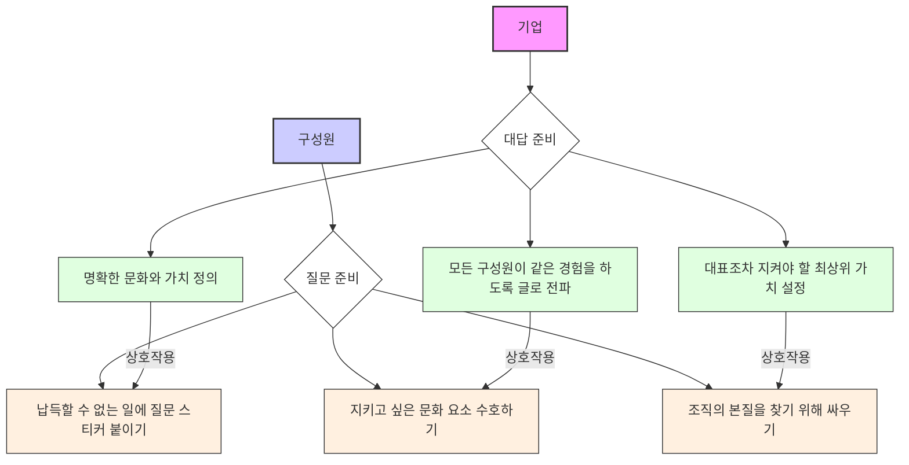
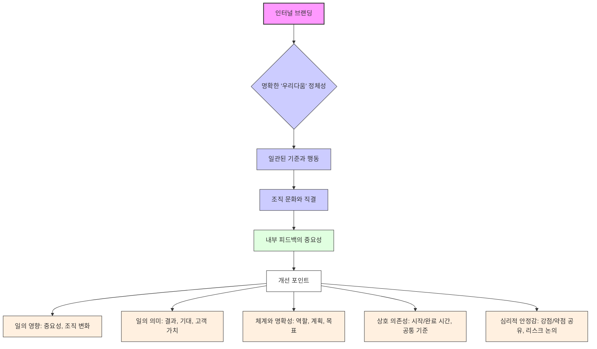

## 철학을 잊은 리더에게: 리더십과 조직 문화의 새로운 접근법
이 책은 리더가 팀원들과 어떻게 관계를 맺어야 하는지, 그리고 조직 문화를 어떻게 만들어가야 하는지에 대한 새로운 시각을 제시하는 책이야. 특히, 아들러 심리학을 바탕으로 리더가 팀원을 대등한 존재로 존중하고 신뢰해야 한다는 메시지를 전달하고 있어. 또한, 조직 문화가 단순히 복지나 행사가 아니라, 리더의 철학과 행동에서 시작된다는 점을 강조하고 있지.

## 1. 리더가 하지 말아야 할 세 가지: 혼내지 마, 칭찬하지 마, 명령하지 마! 

리더가 팀원들에게 절대 하지 말아야 할 세 가지가 있어. 이걸 들으면 '엥? 그럼 뭘 하라는 거야?' 싶을 수도 있는데, 사실 더 좋은 방법으로 관계를 맺으라는 뜻이야.

1. **혼내지 마! 감정적으로 대하지 마!** 
  - 팀원이 뭔가 잘못했을 때 화를 내거나 혼내지 말라는 거야.
  - 왜냐하면, 혼내거나 화를 내면 팀원은 그 감정만 기억하고, 실제로 뭘 고쳐야 하는지(피드백)에 집중하지 못하게 되거든.
  - 마치 친구가 숙제를 안 해왔을 때 "너 왜 숙제 안 했어!" 하고 소리 지르는 대신, "숙제하는 데 어려움이 있었니? 어떤 부분이 힘들었어?" 하고 물어보는 것과 같아.
  - 결국, 관계만 나빠지고 개선은 안 되는 거지.
  - 그러니까 잘못된 점을 고쳐달라고 요구하되, 감정적으로 다루지 말라는 뜻이야.

2. **칭찬하지 마! 공헌에 고마움을 표현해!** 
  - 칭찬은 상대방 기분을 좋게 할 수 있지만, 리더와 팀원 관계에서는 단순히 기분 좋게 하는 것만으로는 일을 잘하게 만들 수 없다는 거야.
  - "잘했어!"라고만 하면 뭘 잘했는지 구체적으로 알 수 없잖아?
  - 마치 친구가 그림을 그려왔을 때 "와, 잘 그렸다!"라고만 하는 것보다, "네가 그린 이 나무의 색깔이 정말 생생해서 그림이 더 살아나는 것 같아!"라고 구체적으로 말해주는 것과 비슷해.
  - 그래서 칭찬 대신, 팀원의 <mark>구체적인 공헌에 대해 고마움을 표현</mark>하라는 거야.

3. **명령하지 마! 부탁하는 어조로 말해!** 
  - 리더가 "이거 해!", "저거 해!" 하고 명령하면 팀원은 거절하기 어렵잖아.
  - 듣는 사람 입장에서는 기분이 나쁠 수 있고, 결국 관계를 해칠 수 있어.
  - 마치 엄마가 "숙제해!"라고 명령하는 대신, "엄마가 지금 바쁜데, 네가 숙제를 먼저 해주면 엄마가 나중에 같이 놀아줄 수 있을 것 같아. 부탁해도 될까?" 하고 부탁하는 것과 같아.
  - 팀원을 배려하는 의미에서 <mark>부탁하는 어조로 말해야 한다</mark>는 뜻이야.

## 2. 리더와 팀원의 관계를 위한 두 가지 핵심: 신뢰와 존경 

이 책에서 가장 중요하게 생각하는 건, 리더와 팀원이 서로를 <mark>존경하고 신뢰해야 한다</mark>는 거야. 마치 친구 사이처럼 서로를 믿고 아껴주는 마음이 필요하다는 거지.

1. **신뢰: 팀원의 잠재력을 믿어주는 것** 
  - 신뢰에는 두 가지 중요한 부분이 있어.
  - 첫째, 팀원이 스스로 문제를 해결할 수 있는 힘이 있다고 믿어주는 거야. 마치 아이가 스스로 신발 끈을 묶으려고 할 때, 옆에서 지켜보며 '우리 아이는 할 수 있어!' 하고 믿어주는 것과 같아.
  - 둘째, 팀원의 말과 행동에 좋은 의도가 있다고 믿어주는 거야. '저 친구가 저렇게 말하는 건 분명 좋은 뜻이 있을 거야' 하고 긍정적으로 생각하는 거지.

2. **존경: 팀원의 존재 가치를 알아주는 것** 
  - 팀원을 있는 그대로의 모습으로 알아주고, 그 사람이 <mark>다른 누구로도 대신할 수 없는 유일무이한 존재</mark>라는 것을 아는 것이 바로 존경이야.
  - 마치 세상에 하나뿐인 보물처럼, 각자의 개성과 능력을 인정하고 소중히 여기는 마음이라고 보면 돼.
  - 서로가 서로를 이렇게 존경해야 한다는 거지.

## 3. 리더의 역할: 끊임없이 질문하고 소통하기 

리더도 사람이기 때문에 자기 방식대로만 생각하기 쉽잖아? 하지만 팀원들과 함께 일하려면 <mark>계속해서 물어보고 소통하는 게 정말 중요</mark>해.

1. **"물어보고 또 물어봐라"의 중요성** 
  - 리더는 팀원이 자신과 같은 생각을 하고 있는지, 자신의 의도를 어떻게 받아들였는지 <mark>계속해서 물어봐야 한다</mark>고 해.
  - 마치 친구와 함께 여행 계획을 짤 때, "나는 이렇게 생각하는데, 너는 어때? 혹시 불편한 점은 없어?" 하고 계속 확인하는 것과 같아.
  - 리더의 생각과 팀원의 생각이 다를 수 있는데, 팀원 입장에서는 리더의 말을 일방적으로 들을 수밖에 없으니까, 리더가 먼저 물어봐 주는 게 큰 도움이 된다는 거지.

2. **생각의 싱크(Sync) 맞추기** 
  - 리더의 좋은 의도가 있더라도, 팀원이 어떻게 받아들였는지는 다를 수 있어.
  - 그래서 계속 물어보고 확인하면서 서로의 생각을 <mark>맞춰나가는 과정</mark>이 필요하다는 거야.
  - 이런 질문을 통해 리더와 팀원이 더 잘 협력할 수 있는 구조를 만들 수 있어.

## 4. 조직 문화는 리더의 철학에서 시작된다 

조직 문화는 단순히 회사에서 하는 행사나 복지가 아니야. 마치 집안의 분위기가 부모님의 생각과 행동에서 시작되는 것처럼, <mark>조직 문화는 결국 리더의 철학과 선택에서부터 시작</mark>되는 거야.

1. **조직 문화를 이끄는 것은 리더의 선택** 
  - 좋은 조직 문화를 만드는 건 리더가 얼마나 솔직하게 자신의 생각을 드러내고(개방성), 다른 사람의 피드백을 받아들여 자신의 생각을 바꿀 수 있는지(수용성), 그리고 그걸 실행할 용기가 있는지에 달려있어.
  - 마치 학교에서 반 분위기가 담임 선생님의 가치관과 행동에 따라 달라지는 것과 같아.

2. **경영자의 철학이 문화에 미치는 영향** 
  - 대학내일이라는 회사의 사례를 보면, 대표이사의 철학이 조직 문화의 출발점이었다고 해.
  - 대표님이 "자기 다음으로 지극히 정진하여 꽃을 피워야 한다"고 자주 말씀하셨는데, 이는 개인의 성장을 중요하게 생각한다는 뜻이거든.
  - 결국, <mark>경영자의 철학이 어떻게 구성되어 있느냐</mark>가 조직 문화에 큰 영향을 미친다는 거야.

## 5. 조직 문화는 '행동 양식'이다 

문화는 단순히 '우리 회사는 이런 문화를 지향합니다!'라고 말하는 게 아니야. 마치 꼴뚜기 별에서 온 외계인이 지구인들을 관찰하듯이, <mark>실제로 사람들이 어떻게 행동하는지</mark>가 바로 문화라는 거지.

1. **문화의 정의: 구성원들의 일정한 **행동 양식 
  - 문화는 구성원들이 보여주는 일정한 형태의 행동 양식이라고 할 수 있어.
  - 단순히 문화 행사를 한다고 해서 만들어지는 게 아니라, <mark>일상생활 속에서 어떤 이야기들이 많이 오가는지</mark>가 중요하다는 거야.

2. **꼴뚜기 별 예화로 본 문화의 **본질 
  - 아기공룡 둘리 만화에 나오는 꼴뚜기 탐험대 이야기를 예로 들 수 있어.
  - 꼴뚜기 탐험대는 지구인들의 말을 이해하지 못하고, 오직 관찰된 행동으로만 보고서를 써.
  - 지구인들이 아침에 모여서 뭘 먹고, 웃고, 공을 차는 행동들을 보면서 '지구인들은 참 이상하다'고 생각하는 거지.
  - 이처럼 문화는 <mark>무엇을 말하고 주장하느냐가 아니라, 실제로 무엇을 보여주고 있느냐</mark>를 봐야 한다는 거야.
  - 조직 문화도 마찬가지로, 우리가 무엇을 외치고 있느냐가 아니라, <mark>무엇을 행동으로 보여주고 있느냐</mark>에서 온다는 거지.

3. **문화 행사의 진짜 목적: 이야기 생성** 
  - 문화 행사를 하는 것도 결국은 <mark>조직 내에서 좋은 이야기들을 만들어내기 위함</mark>이지, 행사 자체가 중요한 건 아니라는 거야.
  - 마치 가족끼리 여행을 가는 이유가 단순히 놀러 가는 것뿐만 아니라, 함께 즐거운 추억과 이야기를 만들기 위함인 것과 같아.

## 6. 실무자의 역할: 리더의 목표에 맞춰 조직 문화 만들기 

조직 문화를 만들고 싶어도 리더가 관심이 없거나 중요하게 생각하지 않을 때가 있잖아? 그럴 때는 <mark>리더가 원하는 목표에 맞춰서 조직 문화를 만들어가야 한다</mark>고 해.

1. **리더 설득의 중요성** 
  - 조직 문화 담당자가 조직 문화 개선을 위해 진단이 필요하다고 생각했을 때, 단순히 "조직 문화 진단이 필요해요!"라고 말하는 대신,
  - "우리가 글로벌 기업으로 성장하려면 조직 문화가 뒷받침되어야 하고, 이를 위해 현재 수준을 파악하고 개선 방향을 찾는 진단이 필요합니다"라고 말했다는 사례가 있어.
  - 마치 친구에게 "우리 같이 공부하자!"라고 말하는 대신, "네가 이번 시험에서 좋은 성적을 받으려면 같이 공부하는 게 도움이 될 것 같아!"라고 말하는 것과 같아.

2. **회사의 목표와 조직 문화 연결하기** 
  - 결국, 실무자 입장에서는 <mark>리더가 원하는 목표, 즉 회사의 목표에 맞춰서 조직 문화가 함께 가야 한다</mark>는 것을 설득할 수 있어야 해.
  - 내가 하고 싶은 일만 할 수는 없으니까, 내가 하고 싶은 일이 회사 전체의 목표에 어떻게 기여할 수 있는지를 생각하는 게 중요해.
  - 조직 문화 담당자는 행사 자체에 집중하기보다, <mark>리더가 바라보는 방향성과 결과를 보면서 일해야 한다</mark>는 의미야.

## 7. MZ세대의 등장과 '문화의 시대' 

요즘 MZ세대(밀레니얼 세대와 Z세대를 합친 말)에 대한 이야기가 많잖아? 이들은 이전 세대와는 다른 방식으로 일하고 생각하는데, 이게 바로 <mark>문화와 가치가 중요해지는 시대</mark>가 왔다는 신호라고 볼 수 있어.

1. **미디어 속 MZ세대와 실제 MZ세대의 차이** 
  - 미디어에서는 MZ세대를 이어폰 꽂고 일하고, 이기적이고, 불평만 하고, 조용한 퇴사를 꿈꾸는 문제아처럼 묘사하는 경우가 많아.
  - 하지만 실제 현장에서 만난 MZ세대들은 <mark>일을 하고 싶어 하지 않는 세대가 아니었다</mark>고 해.
  - 그들이 싫어하는 건 <mark>이유를 모르는 일, 맥락 없는 지시, 그리고 눈치 보며 생존해야 하는 비열한 룰</mark>에 지친 것이었어.
  - 마치 학교에서 '이거 그냥 외워!'라고 하는 것보다, '이걸 왜 배워야 하는지' 설명해주는 걸 더 좋아하는 것과 같아.

2. **공동의 성과에서 공동의 가치로** 
  - 이전 세대는 공동체에 충성하고, 집단을 위해 나를 희생하는 것이 당연했어. 수출 목표 달성, 연 매출 증대 같은 <mark>공동의 성과</mark>를 위해 수단과 방법을 가리지 않고 일했지.
  - 하지만 MZ세대는 달라. 이들은 오히려 그 어떤 세대보다 활발하게 커뮤니티를 만들고 연대하며 공동의 가치를 중요하게 생각해.
  - 다 같이 모여서 돈을 많이 버는 것보다, <mark>함께 어떤 가치를 만들고 어떤 과정으로 일하는가</mark>에 더 무게를 두는 거야.
  - 마치 친구들과 함께 봉사활동을 하면서 '우리가 어떤 좋은 일을 했는지'에 더 의미를 두는 것과 같아.

3. **효율의 시대에서 문화와 가치의 시대로** 
  - 예전에는 사람을 쥐어짜서 능력을 끌어내는 시대였어. 남보다 더 뛰면 이길 수 있었지.
  - 하지만 지금은 AI가 인간의 능력을 뛰어넘고, 자동화 로봇이 많은 일을 대신해 주고 있어.
  - 이제 기업들은 코카콜라가 '우주의 맛'을 이야기하고, 러쉬가 인스타그램 계정을 폭파하며 '유해한 것을 주고 싶지 않다'고 외치고, 파타고니아가 회사를 '지구에 환원'하는 것처럼 <mark>각자가 지향하는 가치를 외치며 하나의 부족처럼 움직이고 있다</mark>고 해.
  - 더 이상 <mark>효율만으로는 경쟁할 수 없는 시대</mark>가 된 거야. 이제는 <mark>문화와 가치가 중요한 시대</mark>가 열린 거지.

## 8. MZ세대의 '삼요세대' 질문: 왜요? 제가요? 이걸요? 

MZ세대를 대표하는 재미있는 밈(유행어) 중에 '삼요세대'라는 말이 있어. 무슨 일만 시키면 <mark>"왜요? 제가요? 이걸요?"</mark> 하고 되묻는다는 거지. 얼핏 들으면 일하기 싫어하는 것처럼 보일 수 있지만, 사실은 <mark>아주 중요한 질문</mark>이라고 해.

1. **'**삼요세대**' 질문의 **본질 
  - 이 질문들은 단순히 일을 회피하려는 게 아니야.
  - 조직 문화를 기록하는 일을 하는 사람도 클라이언트에게 똑같이 묻는다고 해. "이거는 도대체 왜 하는 거예요?", "이걸 왜 저 사람이 하고 있죠?", "이게 과연 조직의 목표나 발전에 도움이 됩니까?"
  - 마치 어린아이가 "엄마, 왜 하늘은 파래요?" 하고 끊임없이 묻는 것처럼, 모든 일에 <mark>이유와 맥락</mark>을 알고 싶어 하는 거야.

2. **'원래 그랬어'는 통하지 않는 시대** 
  - "원래 그랬어"라는 말은 이제 통하지 않아.
  - 돈과 시간, 감정을 써가며 괴롭게 하는 일에 <mark>명확한 이유</mark>가 있어야 한다는 거지.
  - 이런 관점에서 MZ세대의 질문은 <mark>누군가는 해야 했을 당연한 질문</mark>이라고 볼 수 있어.

## 9. 기업 문화의 변화: 복지에서 '이유'로, 그리고 '컬처덱' 

예전에는 조직 문화라고 하면 좋은 복지 시설이나 명절 상여금 같은 걸 떠올렸잖아? 하지만 이제는 <mark>더 고차원적인 무언가</mark>, 바로 <mark>이유</mark>를 제공해야 하는 시대로 바뀌었어.

1. **복지의 변화: 안마의자에서 최고의 동료로** 
  - 불과 10년 전만 해도 안마의자, 멋진 탕비실, 외국 과자 같은 것들이 좋은 문화라고 생각했어.
  - 하지만 이제는 안마의자가 아무리 좋아도 4시간 릴레이 회의를 하면 소용없다는 걸 알게 된 거지.
  - 넷플릭스는 <mark>"최고의 직원과 함께하는 것이 곧 우리 회사의 복지다"</mark>라고 말해.
  - 토스도 <mark>일을 잘하는 동료들로부터 얻는 인정이 곧 복지이자 동기</mark>라고 이야기하지.
  - 마치 친구와 함께 게임을 할 때, 단순히 좋은 장비가 있는 것보다, 함께 게임을 잘하는 친구와 함께하는 것이 더 즐거운 것과 같아.

2. 컬처덱**(**Culture Deck**)의 등장** 
  - 넷플릭스는 2015년에 <mark>누가 채용되고, 누가 성장할 수 있고, 누가 나가야 하는지를 기록한 '컬처덱'</mark>이라는 책을 만들었어.
  - 컬처덱은 우리 기업이 어떤 문화를 가지고 있고, 여기 와서는 어떤 마음과 행동으로 일해야 하는지를 구성원들이 잘 알아듣고 실무에 적용할 수 있도록 쉽게 풀어낸 자료를 말해.
  - 마치 학교에서 '우리 반 규칙'을 만들어서 모두가 이해하고 따르도록 하는 것과 비슷해.

3. **기업 문화의 핵심: 이유를 설명하는 것** 
  - 요즘 MZ세대들은 이직 주기가 5개월 정도로 짧아. 더 이상 회사가 평생을 책임져 주지 않기 때문이지.
  - 그래서 회사가 직원들에게 주어야 할 것은 카누 커피나 빠다코코넛이 아니라, <mark>더 고차원적인 '이유'</mark>여야 해.
  - 기업의 문화는 <mark>무엇이 우리를 움직이는지, 왜 이런 문화를 지켜야 하는지, 나는 왜 뽑힌 건지</mark> 같은 <mark>이유를 명확하게 설명하는 것</mark>에서부터 출발해야 한다는 거야.

## 10. 기업과 구성원의 새로운 역할: 기업은 '대답'을, 구성원은 '질문'을 

이제 기업과 구성원(직원)은 서로에게 다가가는 방식이 달라져야 해. 마치 서로 다른 퍼즐 조각을 맞추듯이, <mark>기업은 명확한 대답을 준비하고, 구성원은 날카로운 질문을 준비</mark>해야 한다는 거지.

1. **기업의 역할: '대답'을 준비하는 것** 
  - 기업은 모든 사람이 <mark>같은 경험을 할 수 있도록</mark> 문화를 글로 적고 전파해야 해.
  - 최 부장님의 기분이나 대표님의 꿈에서 시작되는 일이 아니라, <mark>대표조차 지켜야 하는 가장 최상위의 가치</mark>를 만들어 놓는 것이 중요해.
  - 메타(페이스북, 인스타그램을 운영하는 회사)의 사례처럼, 최종 구매 결정을 기안자에게 다시 돌려주거나, 막내 사원도 본부장에게 공개적으로 피드백을 줄 수 있는 채널을 만드는 것이 바로 이런 '대답'의 한 형태야.
  - 이런 문화는 <mark>내가 피드백을 던졌을 때 '고맙다'는 메일이 돌아오는 것</mark>처럼, 말로 하는 대답이 아니라 <mark>행동으로 보여주는 리액션</mark>이라고 할 수 있어.

2. **구성원의 역할: '질문'을 준비하는 것** 
  - 구성원은 <mark>"이게 우리가 해야 되는 게 맞아? 이게 우리 본질에 맞아?"</mark> 같은 질문을 던질 수 있어야 해.
  - 단순히 시스템이 싫어서 딴죽을 거는 게 아니라, <mark>납득할 수 없는 모든 일에 '질문 스티커'를 붙이는 것</mark>과 같아.
  - 그리고 <mark>내가 지키고 싶은 문화 요소를 수호하는 일</mark>도 중요해. 내가 이 회사에서 지키고 싶은 본질 하나를 정확하게 파악하고, 그것이 왜 필요한지 물어보고 대답을 들어야 해.
  - 만약 나 혼자만 그것을 지키고 있다면, 그때는 도망쳐야 한다고 말하고 있어.
  - 직장에서 평생 지내지 않기 때문에, <mark>내가 걸어온 발자취와 </mark>애티튜드<mark>(태도)</mark>가 중요해. 조직과 개인이 서로를 성장시키기 위해 애썼던 그 자세가 끝까지 남게 되거든.

## 11. 리더의 과부하 시대: 피로감과 무기력 극복하기 

요즘 리더들은 정말 많은 책임과 어려움 속에서 <mark>과부하</mark>를 느끼기 쉬워. 마치 컴퓨터가 너무 많은 프로그램을 동시에 돌려서 버벅거리는 것처럼, 리더들도 정신적으로 지쳐있을 때가 많다는 거지.

1. 과부하** 시대의 피로감과 무기력** 
  - "당신은 게으른 게 아니라 진심으로 지쳤을 뿐이다"라는 책 제목처럼, 현대 사회는 리더들에게 끝없는 피로감과 무기력을 안겨줘.
  - 리더들은 자신이 어떤 상태인지, 얼마나 소진되었는지 공감할 수 있는 내용들이 많을 거야.

2. **디지털 기기 사용과 집중력 저하** 
  - 스마트폰을 하루에 2600번 이상 보거나 만지는 사람들이 받는 심리적 영향은 심각해.
  - 기술이 끊임없이 단편적인 주의를 끌어 <mark>집중력을 심각하게 저해하고 IQ를 낮출 수도 있다</mark>는 우려가 커지고 있어.
  - 심지어 스마트폰이 전원이 꺼져 있어도 인지 능력이 손상된다는 연구 결과도 있어.
  - 이런 현상 때문에 현대인들은 <mark>하나의 주제에 깊이 들어가는 데 어려움</mark>을 겪고, 계속해서 자극을 원하는 도파민 중독 상태가 되는 거지.
  - 마치 계속해서 짧은 영상만 보다가 긴 영화를 보면 지루하게 느껴지는 것과 같아.

3. **겸손을 기르는 방법: 새로운 분야 배우기** 
  - 리더들은 자신의 영역에서 '모른다'고 말하는 것을 두려워하는 경향이 있어. 흔들리는 모습을 보이면 안 된다고 생각하기도 하고.
  - 하지만 <mark>겸손을 기르려면 자연스럽게 여유를 둘 수밖에 없는 새로운 분야를 배워보라</mark>고 조언해.
  - 예를 들어, 기타 연주나 그림 그리기처럼 능숙하지 않은 분야에서는 실수를 용납하고 열심히 배우려고 노력하게 되잖아?
  - 마치 골프를 처음 치러 갔을 때 "어렵네요, 모르겠어요"라고 말하는 게 어렵지 않은 것처럼, 리더도 <mark>미지의 영역으로 가서 과감하게 모른다고 할 수 있는 경험</mark>을 해보라는 거야.

4. 결정 피로** 극복하기** 
  - <mark>결정 피로</mark>는 너무 많은 결정을 하거나 선택지의 장단점이 모두 뚜렷할 때 정신적으로 지쳐서 좋은 결정을 내리기 어려운 현상을 말해.
  - 마치 마트에서 너무 많은 종류의 과자 중에 하나를 고르다가 결국 아무거나 집어 드는 것과 같아.
  - 피로가 쌓이면 자제력과 의지가 떨어지고, 뇌는 위험을 피하기 위해 지름길을 찾으려고 해. 그래서 단기적인 이익으로 결정하거나, 남에게 결정을 미루거나, 아무것도 결정하지 못하게 돼.
  - 판사들도 하루 중 어느 시간대에 판결을 내리는지에 따라 판결 내용이 달라질 수 있다는 연구 결과도 있어.
  - 그래서 마크 저커버그처럼 <mark>하루에 해야 할 결정의 양을 정해 놓고 관리</mark>하는 것이 중요하다고 해. 리더들도 결정 피로에 빠지지 않도록 의사결정을 잘 관리할 필요가 있다는 거지.

## 12. 조직 문화와 인터널 브랜딩의 중요성 

최근에는 조직 문화와 함께 인터널 브랜딩<mark>(Internal Branding)</mark>이라는 개념도 중요해지고 있어. 마치 회사가 외부 고객에게 보여주는 이미지(익스터널 브랜딩)만큼, 내부 직원들에게 보여주는 이미지도 중요하다는 거지.

1. **인터널 브랜딩의 핵심: 일관성과 정체성** 
  - 인터널 브랜딩은 사람이나 특정 대상이 독특한 캐릭터가 되고, 이것이 정체성으로 연결되기까지 <mark>가장 중요한 것이 바로 일관성</mark>이라고 해.
  - 확고한 신념에서 나오는 <mark>일관된 기준과 행동</mark>이 정체성을 만드는 필수 요건이야.
  - 명확한 정체성을 가지고 있을 때 비로소 '나다움', '우리다움'을 이야기할 수 있어.
  - 마치 동계 올림픽 컬링팀의 '안경 선배'처럼, 어떤 기업이든 다양한 얼굴보다는 <mark>명확한 자신만의 얼굴</mark>을 가지고 고객을 만났을 때 브랜딩이 잘 된다는 거지.

2. **조직 문화와 직결되는 **인터널 브랜딩 
  - 인터널 브랜딩은 조직 문화와 직접적으로 연결되어 있어.
  - 이를 위해서는 <mark>상호 간에 내부적인 </mark>피드백이 일어나서 개선이 돼야 해.
  - 피드백을 위한 개선 포인트는 다음과 같아.
  - **일의 영향:** 리더, 동료들과 현재 하고 있는 일의 중요성과 조직에 어떤 변화를 가져올 수 있는지 이야기 나누기.
  - **일의 의미:** 일의 결과와 기대 사항, 그리고 각자의 일이 고객에게 어떤 가치를 제공하는지 이야기 나누기.
  - **체계와 명확성:** 팀 내 역할, 팀의 계획과 목표에 대해 지속적으로 이야기 나누기.
  - 상호 의존성**:** 일의 시작과 완료 시간(데드라인), 일에 대한 공통의 기준과 약속을 공유하기.
  - 심리적 안정감**:** 서로의 강점과 약점을 이야기해주고, 각자가 맡은 일의 리스크와 해결 방안을 서로 이야기 나누기.
  - 마치 친구들과 함께 프로젝트를 할 때, 서로의 역할과 목표를 명확히 하고, 어려움이 있을 때 솔직하게 이야기하며 함께 해결해나가는 것과 같아.

3. 조직 문화** 관련 책들의 부흥** 
  - 최근 서점가에 조직 문화와 인터널 브랜딩 관련 책들이 많이 쏟아지고 있다고 해.
  - 이는 우리나라 기업들의 과제가 과거의 생산성 향상에서 이제는 <mark>각 개인의 </mark>창발성<mark>(새로운 것을 만들어내는 능력)과 주도성을 살려가는 것</mark>으로 바뀌었기 때문이야.
  - 그래서 조직 문화 관점의 이야기들이 사람들의 관심을 많이 받고, 관련 책들도 많이 나오고 있는 거지.

