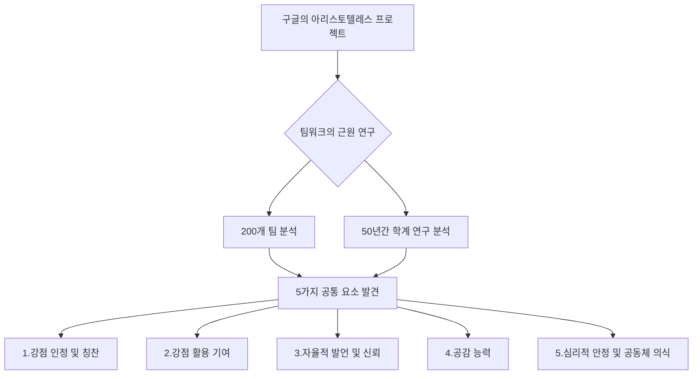
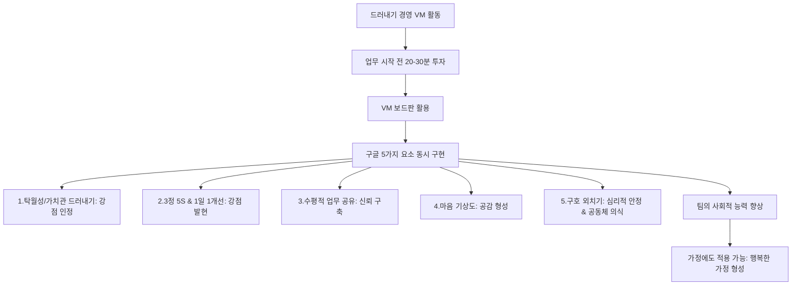

## 팀이 천재를 이긴다: 위대한 팀을 만드는 과학적인 방법
이 책은 기업들이 팀을 조직하는 방식에 대해 비판하며, 위대한 팀은 우연히 만들어지는 것이 아니라 과학적인 접근을 통해 구성되어야 한다고 말한다. 빠르게 변화하는 시장에서 기업이 지속적으로 성장하려면, 구성원들을 어떻게 조직하고 협업하게 만드는지가 가장 중요하다고 강조한다. 이 책은 회사뿐만 아니라 학교, 가족, 동호회 등 우리가 속한 모든 팀에 적용될 수 있는 효과적인 팀 구성 방법을 제시한다.

## 1. 팀워크의 중요성: 링겔만 효과를 넘어서 

팀이 커질수록 개인의 노력이 줄어드는 현상, 마치 줄다리기에서 사람이 많아질수록 각자 힘을 덜 쓰는 것과 같은 현상이 나타날 수 있다.

1. 링겔만 효과** (**Ringelmann Effect**) 실험**:
  - 프랑스의 심리학자 막스 링겔만은 1913년에 줄다리기 실험을 했다. 
  - 이론적으로는 한 명이 50kg을 당기면 두 명은 100kg, 열 명은 500kg을 당겨야 한다고 생각했다. 
  - 하지만 실제 실험 결과는 달랐다. 
  - 한 명이 당기는 힘은 평균 63kg이었지만, 세 명은 160kg, 여덟 명은 248kg이었다. 
  - 사람 수가 늘어날수록 한 명이 당기는 평균 힘은 계속 줄어들었다. 
  - 이것은 마치 '방관자 효과' (어려움에 처한 사람을 보고도 아무도 돕지 않는 현상)와 비슷하게, 팀 규모가 커지면 무임승차하는 사람이 늘어나고, 전체 성과는 늘어도 효율은 떨어진다는 것을 보여준다. 

2. **팀 조직의 중요성**:
  - 저자는 기업들이 신제품 개발, 시장 분석, 마케팅, 세일즈 전략 등에는 엄청난 돈을 쓰지만, 팀을 과학적으로 조직하는 데는 투자를 잘 하지 않는다고 비판한다. 
  - 위대한 팀은 우연히 만들어지는 것이 아니기 때문에, 더 과학적인 접근이 필요하다고 강조한다. 
  - 빠르게 변하는 시장에서 성공하는 기업과 그렇지 못한 기업의 차이는, 구성원들을 어떻게 조직하고 협업하게 만드느냐에 달려 있다고 주장한다. 
  - 여기서 '팀'은 회사 팀만을 의미하는 것이 아니다. 
  - 학교, 학원, 가족, 종교 단체, 동호회 등 우리는 다양한 팀에 속해 있다. 
  - 이 책은 이러한 팀들을 어떻게 효과적으로 구성할 수 있을지에 대해 이야기한다. 

## 2. 스티브 잡스의 팀워크 철학: 비틀즈처럼 

스티브 잡스는 혼자 모든 것을 해내는 '고독한 천재'로 알려져 있지만, 사실 그는 팀워크의 중요성을 누구보다 잘 알고 있었다.

1. **잡스의 모델은 **비틀즈:
  - 언론에서는 스티브 잡스를 고독한 영웅으로 묘사하곤 하지만, 잡스 본인은 그렇게 생각하지 않았다. 
  - 미국 CBS 방송사 시사 프로그램에서 그는 자신의 모델이 '비틀즈'라고 말했다. 
  - 비틀즈 멤버들을 개별적으로 보면, 당시 그들보다 뛰어난 솔로 아티스트들도 많았다. 
  - 하지만 비틀즈는 서로의 약점을 보완하며 최고의 하모니를 만들어냈다. 
  - 이는 개인 능력의 합보다 팀 전체의 시너지가 훨씬 크다는 것을 보여준다. 
  - 잡스는 비즈니스 성과 역시 한 사람이 아니라 팀을 통해서 이룰 수 있는 것이 많다고 생각했다. 

2. **잡스와 팀의 **시너지:
  - 잡스는 잘못된 파트너를 만났을 때는 어려움을 겪었지만, 잘 맞는 파트너와 팀을 만났을 때는 상상을 초월하는 결과를 만들어냈다. 
  - 그는 매너와 협동심을 겸비한 직원들과는 대조적인 모습을 보였지만, 사실 이들에게 상당히 의존했다. 
  - 성격이 완전히 다른 이 팀은 잡스를 억압하거나 통제하기보다, 그가 천재성을 마음껏 발휘하고 애플을 성공적으로 이끄는 데 큰 기여를 했다. 
  - 이처럼 성격이 완전히 다른 사람들과 함께 일하는 것이 오히려 득이 될 수 있다는 것을 보여준다. 

## 3. 진정한 다양성: 인지적 다양성의 힘 

팀의 다양성은 단순히 성별이나 나이 같은 겉모습이 아니라, 생각하는 방식과 경험의 다양성, 즉 '인지적 다양성'에서 온다.

1. **다양성에 대한 오해**:
  - 사람들은 흔히 비슷한 성격의 사람들로 구성된 팀이 성과가 좋을 것이라고 생각한다. 
  - 또한, 다양성을 추구하는 기업들도 주로 성별 다양성(gender diversity)에만 초점을 맞추는 경향이 있다. 
  - 하지만 저자는 이러한 생각에 동의하지 않는다. 

2. **인지적 다양성의 세 가지 요소**:
  - 미시간 대학교의 스콧 페이지는 인지적 다양성(다양한 생각과 관점을 가진 것)을 위해 세 가지가 필요하다고 주장한다. 
  - 훈련: 학습을 통해 얻은 지식과 기술.
  - **경험**: 살아오면서 겪은 다양한 사건과 그로 인한 통찰.
  - **유전자**: 성별, 나이, 인종 등 타고난 특성. 
  - 이 중 유전자는 그리 큰 영향을 미치지 않으며, 훈련과 경험이 훨씬 중요하다고 말한다. 
  - 여기서 유전자는 성별, 나이, 인종 등을 의미하고, 훈련과 경험은 그 사람의 문화적 배경, 경험에서 나온 지식, 관점, 해석 등을 의미한다. 

3. **겉모습이 아닌 사고방식의 **다양성:
  - 따라서 다양성을 추구하는 조직을 만들기 위해 단순히 남녀 성비만 맞춘다면, 다양성 측면에서 효과가 별로 좋지 않을 수 있다. 
  - 예를 들어, 미국에서 태어난 한국인은 한국식 사고방식보다는 미국식 사고방식을 가지고 있을 가능성이 높다. 
  - 이런 사람을 한국인을 대상으로 하는 마케팅 팀에 뽑는 것은 비효율적일 수 있다. 
  - 성별도 마찬가지다. 같은 여자라도 자라온 환경에 따라 사고방식이 천차만별일 수 있다. 
  - 겉으로는 다르게 보여도 사고방식은 비슷할 수 있기 때문에, 인지적 다양성을 위해 성별, 나이, 인종에 따라 팀을 구성하는 것은 효과적이지 않을 수 있다. 
  - 진정한 다양성은 겉모습이 아니라, 서로 다른 생각과 관점을 가진 사람들이 모이는 데서 온다.

## 4. 팀워크의 핵심: 사이좋음보다 역할 수행 

팀의 성공은 팀원들이 서로 얼마나 사이가 좋은지에 달려 있지 않다. 오히려 각자가 맡은 역할을 최고 수준으로 해내는 것이 훨씬 중요하다.

1. **'가족 같은 분위기'에 대한 **편견:
  - 구인 광고에서 흔히 볼 수 있는 "가족같이 일하실 분 구합니다"라는 말처럼, 많은 사람들이 사이가 좋은 팀이 성과도 좋을 것이라고 생각한다. 
  - 우리나라 기업에서 회식을 업무의 연장으로 생각하는 것도, 비공식적인 모임이 업무에 긍정적인 영향을 준다고 믿기 때문이다. 
  - 하지만 저자는 이러한 생각에 반대한다. 

2. **사이가 나빴지만 위대한 업적을 이룬 팀**:
  - 저자는 사이가 나빴음에도 위대한 업적을 이룬 팀의 사례를 많이 제시한다. 
  - 팅커**, 에버스, 찬스 트리오**:
  - 이들은 야구 선수로, 각각 유격수, 2루수, 1루수였다. 
  - 이 트리오는 최초로 병살 플레이(야구에서 한 번의 수비로 두 명의 주자를 아웃시키는 것)를 성공시켰고, 이후 뛰어난 플레이로 팀이 네 번이나 페넌트 레이스(정규 리그)에 진출하는 데 기여했다. 
  - 미국에서는 "팅커 투 에버스 투 찬스"라는 문장이 상징적인 구절로 남아 있을 정도다. 
  - 하지만 팅커와 에버스는 사이가 매우 좋지 않았다. 서로 증오하는 사이였다. 
  - 1905년에는 경기장에서 주먹질까지 했고, 그로부터 33년 후 라디오에 출연할 때까지 서로 단 한마디도 하지 않았다고 한다. 
  - 즉, 이 트리오가 함께 프로 생활을 한 기간 중 절반 동안 기본적인 대화조차 하지 않았음에도 불구하고, 최고의 수비 팀워크를 발휘했던 것이다. 

3. **팀 성공의 핵심**:
  - 저자는 이것이 팀의 핵심이라고 말한다. 
  - 서로 사이가 좋지 않더라도, 팀원이 각자 맡은 바를 최고 수준으로 해낼 때 팀의 성과가 완성된다. 
  - 이것은 스포츠뿐만 아니라 모든 분야에 적용되는 이야기다. 
  - 물론 사이가 좋지 않은 팀이 모두 성공하는 것은 아니지만, 사이가 좋지 않더라도 각자 역할을 다하면 성공할 수 있다는 것이다. 
  - 팀 성공의 핵심은 '가족 같은 분위기'가 아니라, 각자의 역할을 충실히 수행하는 것이다. 

## 5. 구글의 '아리스토텔레스 프로젝트': 최고의 팀을 만드는 5가지 요소 

구글은 최고의 팀을 만들기 위해 '아리스토텔레스 프로젝트'라는 대규모 연구를 진행했고, 팀워크를 향상시키는 5가지 핵심 요소를 발견했다.

1. **구글의 **팀워크** 연구**:
  - 구글은 10년간 HR팀을 맡았던 '라즐로 복'을 책임자로 하여 '아리스토텔레스 프로젝트'를 운영했다. 
  - 이 프로젝트는 팀워크의 근원이 무엇인지 알아내기 위한 것이었다. 
  - 심리학자, 사회학자, 통계학자로 이루어진 연구팀이 기업에서 가장 중요하고 미스터리한 분야인 팀워크에 대해 집중적으로 연구했다. 
  - 수년 동안 구글 사내 200개가 넘는 팀의 특징을 분석하고, 50년간의 학계 팀워크 연구 결과도 함께 분석했다. 
  - 팀을 움직이는 동기 요인, 팀원들의 가치관 공유 방식, 회사 밖에서 어떤 일이 발생할 때 팀워크가 강해지는지 등을 자세히 살펴봤다. 
  - 다양한 팀 구성으로 같은 목표를 부여했을 때 성과가 왜 다르게 나오는지, 똑같은 혜택을 받는데 왜 특정 팀이 더 좋은 결과를 내는지도 연구했다. 

2. **최고의 성과를 내는 팀**:
  - 연구 결과, 능력이 있다고 인정받는 최고의 팀장이 있는 팀도 아니었고, 최고의 역량을 가진 멤버들로 구성된 팀도 아니었다. 
  - 오히려 탁월한 한 명 때문에 팀워크가 깨져서 팀의 성과가 꺾이는 경우가 많았다. 
  - 결국, 팀워크가 좋고 강한 팀이 최고의 성과를 낸다는 것을 확인했다. 
  - 구글은 팀워크가 좋은 팀에 어떤 요소가 있는지 연구했고, 5가지 공통 요소를 발견했다. 

3. 팀워크** 향상을 위한 5가지 공통 요소**:
  - **서로의 강점을 드러내어 칭찬하고 인정해주는 팀**: 팀원들이 서로의 장점을 알아주고 격려하는 분위기. 
  - **구성원의 강점을 팀에 활용할 수 있도록 서로서로 기여하는 팀**: 각자의 재능을 팀 목표 달성에 적극적으로 사용하는 팀. 
  - **자율적으로 업무를 드러내어 발언하고 공유하며 신뢰가 쌓이는 팀**: 자유롭게 의견을 나누고 정보를 공유하며 믿음을 쌓는 팀. 
  - **개인의 마음 상태를 서로서로 드러내서 공감 능력이 뛰어난 팀**: 팀원들이 서로의 감정을 이해하고 배려하는 팀. 
  - **우리는 하나라는 팀의 '**심리적 안정**' 또는 '**함께 한다는 공동체 의식**'이 강한 팀**: 팀원들이 안전하다고 느끼고, 함께라는 소속감을 강하게 느끼는 팀. 

4. **결론**:
  - 구글은 인공지능을 활용한 데이터 수집과 분석에서 세계 최고로 인정받는 기업이다. 
  - 이러한 구글의 연구 결과는 팀 멤버가 '얼마나 유능한지' 또는 '누구인지'가 중요한 것이 아니라는 것을 보여준다. 
  - 똑똑한 분석가나 강력한 기술을 가진 인재들이 있는 팀이 아니라, 팀워크가 가장 우수하고 강한 팀이 성과를 크게 낸다는 것이다. 

## 6. 팀워크 향상 방법론: 드러내기 경영 VM 

구글이 발견한 5가지 팀워크 요소를 실제로 구현할 수 있는 경영 혁신 방법론으로 '드러내기 경영 VM'이 있다.

1. 드러내기 경영** VM의 탄생**:
  - 구글이 연구한 팀워크 향상 5가지 요소를 구현하는 새로운 경영 혁신 방법론이 8년 전 우리나라에서 '드러내기 경영 VM'이라는 이름으로 세계 최초로 만들어졌다. 
  - 현재 여러 회사에서 활용되고 있으며, 탁월한 성과를 내고 있다. 

2. **VM 활동의 구체적인 방법**:
  - 드러내기 경영 VM 활동에서는 업무 시작 전에 VM 보드판 앞에서 20~30분만 투자하면, 구글이 추구하는 팀워크 향상 5가지 요소가 동시에 구현되도록 설계되어 있다. 
  - **탁월성 드러내기, 가치관 드러내기**: 팀 멤버들의 강점을 인정한다. 
  - 3정 5S** (정품, 정량, 정위치, 정리, 정돈, 청소, 청결, 습관화)와 **1일 1개선: 팀 멤버의 강점이 발현되도록 돕는다. 
  - **보고가 아닌 수평적인 관계로 업무 공유**: 숨기지 않고 업무를 드러내고 공유함으로써 신뢰를 쌓는다. 
  - **마음 기상도로 마음 상태 드러내기**: 서로의 마음 상태를 공유하여 공감대를 형성한다. 
  - **'함께하자, 컴투게더, 치신세리' 구호 외치기**: 서로 구호를 외치고 '심리적인 안정'을 추구하여 공동체 의식을 가진다. 

3. **VM의 효과**:
  - 이러한 활동을 통해 팀원들은 존재 자체를 인정받고, 칭찬과 기여, 신뢰를 바탕으로 사회적인 능력이 있는 팀으로 성장하게 된다. 
  - VM을 도입한 기업의 직원들은 가정에서도 VM 기법을 적용하여 부부나 자녀와 좋은 팀워크를 형성하고, 행복한 가정을 만드는 데도 도움을 받고 있다. 

## 7. 결론: 팀을 위한 가이드라인 
이 책에서 주장하는 내용이 모든 조직에 100% 적용되지 않을 수도 있다. 예를 들어, 공무원 조직과 벤처 기업의 팀은 존재 목적이나 구성원이 많이 다르기 때문이다.  하지만 이 책은 팀을 어떻게 구성하고 관리할지에 대한 중요한 가이드라인과 통찰을 제공한다.  설령 당신이 속한 조직에 딱 맞는 사례가 없더라도, 다른 사례들을 통해 충분히 깨달음을 얻을 수 있을 것이다.  어떤 조직의 리더이거나 인사 담당자이거나, 팀에 대해 고민하고 있는 사람이라면 이 책을 한 번쯤 읽어보는 것이 좋다. 

