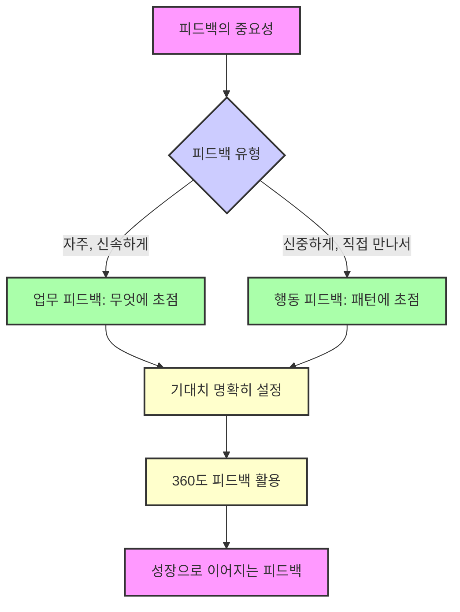
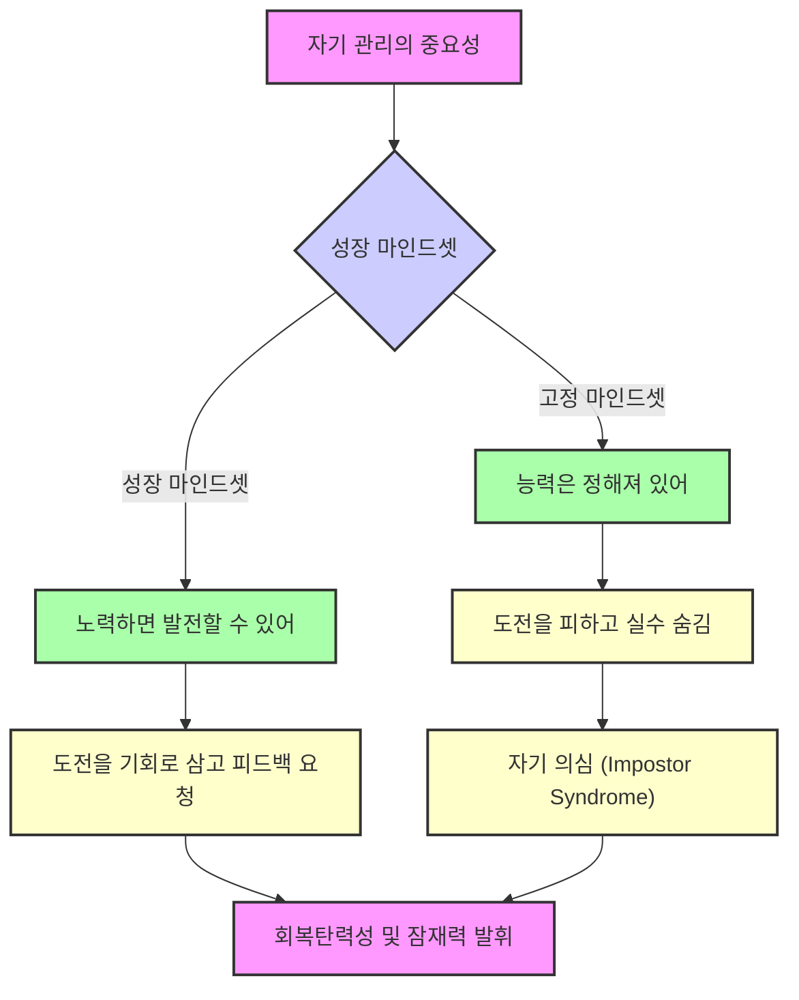
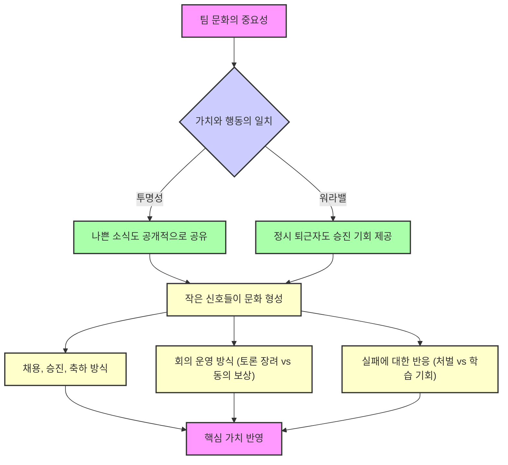

## 팀장의 탄생: 실리콘밸리식 팀장 수업
이 책은 페이스북의 줄리 주오 부사장이 자신의 경험을 바탕으로, 처음 팀장이 된 사람들이 겪는 어려움과 그 해결책을 제시하는 실용적인 가이드북이야. 팀장이 되는 건 승진이 아니라 완전히 새로운 직업으로 바뀌는 것과 같다고 말하며, 좋은 관리자가 되기 위한 구체적인 방법들을 알려주고 있어.

## 1. 팀장이 된다는 것: 승진이 아니라 새로운 직업으로의 전환 

팀장이 되는 건 단순히 직급이 올라가는 승진이 아니야. 마치 하던 일을 그만두고 완전히 다른 일을 시작하는 것처럼, 새로운 직업으로 바뀌는 것과 같다고 보면 돼. 

1. **새로운 역할의 시작**:
  - 어제까지는 동료였던 사람이 오늘부터 내 팀원이 되는 경우가 많아. 
  - 이런 상황은 처음이라서 어색하고, 심지어 팀원도 나를 상사로 받아들이기 어려워할 수 있어. 
  - 예를 들어, 줄리 주오 작가도 25살에 페이스북에서 첫 팀장이 되었을 때, 어제까지 친구였던 팀원이 자신을 뚱한 표정으로 바라보던 순간을 잊을 수 없었다고 해. 
2. **관리자의 본질**:
  - 관리자의 본질은 여러 사람이 함께 일하는 집단에서 더 좋은 성과를 만들어내는 거야. 
  - 혼자서 아무리 일을 잘해도, 팀 전체의 성과를 높이는 것이 팀장의 진짜 역할이지. 
  - 레모네이드 가게를 예로 들면, 처음에는 혼자 레모네이드를 만들고 팔지만, 장사가 잘되면 친구들을 고용해서 함께 일하게 되잖아? 이때부터 내 역할은 최고의 레모네이드 제조자가 아니라, 친구들이 더 많은 레모네이드를 잘 만들고 팔 수 있도록 돕는 사람이 되는 거야. 
  - 즉, 내 개인의 능력에 팀원들의 능력을 더하는 것이 아니라, 팀원들의 능력을 곱해서 전체 성과를 훨씬 더 크게 만드는 것이 팀장의 역할이라고 할 수 있어. 

## 2. 훌륭한 관리자의 세 가지 핵심 요소: 목적, 사람, 과정 

훌륭한 관리자가 되기 위해서는 세 가지 중요한 요소를 잘 관리해야 해. 마치 요리사가 맛있는 음식을 만들기 위해 재료, 레시피, 조리 과정을 신경 쓰는 것과 같아.

1. 목적** (Purpose)**:
  - 팀이 왜 이 일을 하는지, 어떤 결과를 목표로 하는지 명확하게 아는 것이 중요해. 
  - 예를 들어, 레모네이드 가게의 목적이 단순히 동네 사랑방을 만드는 건지, 아니면 모든 길모퉁이에 레모네이드 가게를 여는 거대한 사업을 만드는 건지에 따라 일하는 방식이 달라지겠지? 
  - 팀원들이 같은 목표를 향해 나아가지 않으면, 서로 다른 방향으로 힘을 쓰게 되어 비효율적일 수 있어. 
  - 팀장은 팀원들이 성공의 모습을 명확하게 그리고, 그 목표를 달성하기 위해 진심으로 노력하도록 이끌어야 해. 
2. **사람 (People)**:
  - 올바른 팀원을 뽑고, 그들이 필요한 기술을 갖추도록 돕고, 동기를 부여하며, 각자의 강점을 살릴 수 있는 역할을 맡기는 것이 중요해. 
  - 아무리 멋진 목표가 있어도, 그 목표를 달성할 사람이 준비되어 있지 않으면 실패할 수밖에 없어. 
  - 팀장은 재능 있는 사람들을 채용하고, 그들이 성장하도록 돕고, 서로 협력하며 일할 수 있는 환경을 만들어야 해. 
3. **과정 (Process)**:
  - 팀원들이 어떻게 함께 일하고, 어떻게 결정을 내리고, 정보를 어떻게 공유하며, 누가 언제까지 무엇을 할지 정하는 방식이야. 
  - 과정이 제대로 잡혀있지 않으면, 아무리 유능한 팀원들이 명확한 목표를 가지고 있어도 혼란에 빠질 수 있어. 
  - 레모네이드 가게에서 헨리가 언제 레몬을 더 사야 하는지, 엘리자가 비밀 레시피를 어떻게 배우는지 같은 것들이 과정에 해당해. 
  - 좋은 과정은 팀이 부드럽고 효율적으로 운영되도록 돕는 역할을 해. 

## 3. 신뢰 구축: 팀장의 가장 중요한 자산 

팀장에게 가장 중요한 건 팀원들의 신뢰를 얻는 거야. 신뢰가 없으면 팀원들은 솔직하게 말하지 않고, 실수를 숨기며, 결국 팀을 떠나게 될 수도 있어. 

1. **신뢰의 중요성**:
  - 사람이 사람을 믿지 못하면 함께 일하기 어렵고, 최고의 팀워크를 만들 수 없어. 
  - 팀원과 상사 관계에서는 팀장이 팀원에게 더 큰 영향력을 발휘하기 때문에, 신뢰 관계를 형성할 책임도 팀장에게 더 많이 있어. 
  - 팀원들이 미래에 나의 팀원이 되기를 원할지 생각해 보는 것이 신뢰를 쌓는 기준이 될 수 있어. 
2. **신뢰를 얻는 방법**:
  - **팀원을 아끼고 존중하기**: 진심으로 팀원을 아끼고, 그들의 성장을 돕겠다는 메시지를 꾸준히 전달해야 해. 
  - **시간과 에너지를 투자하기**: 바쁘더라도 팀원을 위해 시간을 내어 대화하고, 농담도 하며 관계를 쌓아야 해. 예를 들어, 2주에 한 번 1시간씩 대화하는 시간을 갖는 것이 좋아. 
  - **솔직하고 투명하게 피드백하기**: 칭찬할 때는 칭찬하고, 지적할 때는 솔직하게 말해서 팀원이 개선할 수 있도록 도와야 해. 
  - **실수와 부족한 점 인정하기**: 팀장도 실수를 인정하고, 미안하다고 말하며, 부족한 점은 팀원들에게 배우겠다는 겸손한 태도를 보여야 해. 
  - 기다림의 미학: 팀장도 처음이듯이, 팀원들도 성장하는 과정에 있으니, 때로는 기다려주는 것도 필요해. 

## 4. 효과적인 피드백: 성장을 돕는 선물 

피드백은 팀원에게 성장을 위한 귀한 선물과 같아. 하지만 대부분의 사람들은 피드백을 제대로 주지 못해서, 상대방의 기분을 상하게 하거나 메시지가 제대로 전달되지 않는 경우가 많아. 

1. **피드백의 기본 원칙**:
  - 기대치** 명확하게 설정하기**: 피드백을 주기 전에, 처음부터 어떤 목표와 기대치를 가지고 있는지 명확하게 설정해야 해. 
  - 마치 헬스 트레이너가 운동을 시작하기 전에 "몸무게 감량, 근육 키우기, 몸매 만들기" 등 목표를 먼저 정하는 것과 같아. 
  - 팀원이 기대치를 충족하지 못했다는 것을 연간 평가 때 처음 알게 된다면, 팀장으로서 실패한 것이나 다름없어. 
  - 승진을 원하는 팀원에게 준비가 안 되었다고 생각한다면, 6개월 뒤에 말하는 것이 아니라 지금 바로 말해주고, 어떤 점을 개선해야 할지 구체적인 계획을 함께 세워야 해. 
  - **솔직하고 투명하게 전달하기**: 피드백은 솔직하고 구체적이며, 상대방의 성공을 돕겠다는 진심을 담아 전달해야 해. 
  - 칭찬과 비판을 섞어 말하는 '칭찬 샌드위치' 방식은 가식적으로 느껴지고, 진짜 메시지가 전달되지 않을 수 있어. 
2. **피드백의 종류**:
  - **업무 **피드백** (Task-specific **feedback**)**:
  - 업무 자체에 대한 피드백으로, 최대한 자주, 빨리, 신속하게 주는 것이 좋아. 
  - 이것은 '누가' 잘못했느냐가 아니라 '무엇'이 문제였는지에 초점을 맞춰야 해. 
  - 예를 들어, "너는 발표를 못 해"가 아니라 "오늘 아침 발표에서 문제 설명을 먼저 하지 않고 바로 제안으로 넘어갔어. 다음번에는 배경 설명을 먼저 해서 사람들이 네 생각을 따라올 수 있도록 해봐"라고 구체적으로 말하는 거야. 
  - 카톡이나 메신저로도 바로바로 피드백을 줄 수 있어. 
  - 행동 피드백** (**Behavioral feedback**)**:
  - 시간이 지나면서 나타나는 행동 패턴에 대한 피드백으로, 좀 더 개인적인 내용이므로 신중하게 다뤄야 해. 
  - 상대방의 기분을 상하게 할 수 있으니, 메신저나 이메일보다는 직접 만나서 대화하는 것이 중요해. 
  - 예를 들어, "회의에서 네 작업에 대해 질문하면 방어적으로 들릴 때가 많아. 어제 샐리가 네 코드에 대해 말했을 때 '그냥 믿어줘'라고 했는데, 이건 협업에 열려 있지 않다는 인상을 줄 수 있어"라고 구체적인 사례를 들어 설명하는 거야. 
3. 360도 피드백** 활용**:
  - 팀장이 혼자 모든 것을 판단하기 어려울 때, 주변 동료들의 의견을 모아 피드백을 주는 방식이야. 
  - 팀원에게 "네가 이런 실수를 했는데, 나뿐만 아니라 다른 팀원들도 같은 의견이야"라고 말하면, 팀원이 받는 충격이 클 수 있다는 우려도 있지만, 
  - 오히려 여러 관점에서 객관적인 의견을 들을 수 있어서, 팀원이 개선해야 할 포인트를 더 명확하게 알 수 있다는 장점이 있어. 

## 5. 자기 관리: 팀장의 내면 성장 

팀장은 다른 사람을 이끌기 전에 자기 자신을 먼저 잘 이끌어야 해. 

1. 가면 증후군** (Impostor Syndrome) 극복**:
  - 팀장이 되면 '내가 이 자리에 어울리지 않아', '언젠가 내 실력이 들통날 거야' 같은 불안감을 느끼는 경우가 많아. 이걸 '가면 증후군'이라고 해. 
  - 이런 감정은 지극히 정상적이야. 왜냐하면 팀장이라는 역할은 항상 새로운 도전을 요구하고, 해보지 않은 일을 해야 하기 때문이야. 
  - 가면 증후군을 극복하는 방법은 완벽한 척하는 것이 아니라, '성장 마인드셋'을 갖는 거야. 
2. **성장 마인드셋 (Growth Mindset)**:
  - 고정 마인드셋** (Fixed Mindset)**: 자신의 능력이 정해져 있다고 믿는 거야. 그래서 도전은 실패할까 봐 두려운 시험이 되고, 실수를 숨기게 돼. 
  - **성장 마인드셋 (Growth Mindset)**: 노력하면 어떤 능력이든 발전할 수 있다고 믿는 거야. 그래서 도전은 배울 수 있는 기회가 되고, 실패는 성장을 위한 발판이 돼. 
  - "나는 이걸 못 해"가 아니라 "나는 아직 이걸 못 해"라고 생각하는 것이 성장 마인드셋이야. 
  - 이런 생각의 변화는 모든 것을 바꿔놓아. 자신의 약점을 두려워하지 않고 호기심을 가지고 바라보게 되고, 도움을 요청하거나 실수를 인정하는 용기를 얻게 돼. 

## 6. 위임의 기술: 레고를 내려놓는 용기 

팀이 커질수록 팀장의 역할은 직접 일을 하는 것에서 팀원들에게 일을 맡기는 것, 즉 '위임'으로 바뀌어야 해. 

1. **위임의 중요성**:
  - 팀장이 모든 세부 사항에 관여할 수는 없어. 
  - 위임은 마치 줄타기처럼 섬세한 기술이 필요해. 
2. **위임의 두 가지 함정**:
  - 마이크로매니저** (Micromanager)**: 너무 깊이 관여해서 모든 세부 사항을 지시하고, 팀원들의 결정을 의심하는 팀장이야. 
  - 팀원들은 의욕을 잃고, 팀장의 승인 없이는 아무것도 하지 못하게 돼. 
  - **방임형 관리자 (Absentee Manager)**: 문제를 위임하고는 사라져 버리는 팀장이야. 
  - 팀원들은 버려졌다고 느끼고, 방향이나 지원 없이 혼란스러워해. 
3. **훌륭한 위임의 비결**:
  - **결과를 위임하기**: 팀장은 '무엇을 해야 하는지'가 아니라 '어떤 결과를 원하는지'를 위임해야 해. 
  - 마이크로매니저는 "X, Y, Z를 해줘"라고 말하지만, 훌륭한 위임자는 "이런 상황인데, 문제 A를 해결하는 것이 우리가 원하는 결과야. 너와 네 팀이 최선의 방법을 찾아낼 거라고 믿어. 내가 어떻게 도와줄까?"라고 말하는 거야. 
  - 이렇게 하면 팀원들은 스스로 해결책을 찾고, 창의력을 발휘하며 성장할 수 있어. 
  - **'내 레고'를 내려놓는 용기**: 팀장이 가장 잘하거나 좋아하는 일을 다른 팀원에게 맡기는 것은 어려운 일이야. 하지만 이렇게 해야 다른 팀원들이 성장할 기회를 얻고, 새로운 리더가 탄생할 수 있어. 

## 7. 팀 문화 형성: 가치를 행동으로 보여주기 

팀 문화는 단순히 간식이나 멋진 포스터로 만들어지는 게 아니야. 팀이 어떤 가치를 중요하게 생각하는지, 그리고 그 가치를 위해 무엇을 포기할 수 있는지에 따라 문화가 형성돼. 

1. **가치와 행동의 일치**:
  - 만약 팀이 '투명성'을 중요하게 생각한다면, 어려운 나쁜 소식도 솔직하게 공유할 용기가 있어야 해. 
  - '워라밸(일과 삶의 균형)'을 중요하게 생각한다면, 밤늦게까지 일하는 사람보다 정시 퇴근하는 사람도 승진시킬 수 있어야 해. 
2. 문화** 형성의 요소**:
  - 팀 문화는 팀장이 누구를 채용하고, 누구를 승진시키며, 무엇을 축하하는지 같은 작은 신호들로 매일매일 만들어져. 
  - 회의를 어떻게 운영하는지도 중요해. 토론을 장려하는지, 아니면 팀장의 의견에 동의하는 사람에게만 보상을 주는지에 따라 문화가 달라져. 
  - 실패에 어떻게 반응하는지도 중요해. 실수를 처벌해서 두려움을 만드는지, 아니면 학습 기회로 삼아 성장을 이끄는지에 따라 팀의 분위기가 달라져. 
3. **의식 (Rituals) 활용**:
  - 페이스북의 '해커톤'처럼, 팀원들이 며칠 동안 자신이 열정적으로 원하는 아이디어를 자유롭게 개발하는 의식은 강력한 메시지를 전달해. 
  - 이런 의식은 "우리는 아래에서부터 올라오는 혁신과 빠른 실행을 중요하게 생각한다"는 가치를 보여주는 거야. 
  - 시간이 지나면서 반복되는 이런 전통들이 팀의 살아있는 가치가 되는 거지. 

## 8. 팀장의 여정: 끊임없는 성장과 배움 

팀장의 여정은 끊임없이 배우고 성장하는 과정이야. 

1. **내려놓음의 미학**:
  - 팀장은 방에서 가장 똑똑한 사람이 되려고 하거나, 모든 답을 알고 있으려 하거나, 모든 세부 사항을 통제하려는 욕심을 내려놓아야 해. 
  - 이 여정은 나의 성공에서 다른 사람들의 성공으로, '나'에서 '우리'로 초점을 옮기는 과정이야. 
2. **영원히 1%만 완성된 여정**:
  - 줄리 주오 작가는 팀장의 여정은 항상 1%만 완성된 상태라고 말해. 
  - 항상 더 배울 것이 있고, 더 성장할 방법이 있으며, 주변 사람들이 최고의 모습이 되도록 도울 기회가 있다는 의미야. 
3. **리더십은 만들어지는 것**:
  - 이 책의 핵심 메시지는 '훌륭한 관리자는 타고나는 것이 아니라 만들어진다'는 거야. 
  - 리더십은 특별한 사람만 가질 수 있는 것이 아니라, 충분히 관심을 가지고 노력하면 누구나 배울 수 있는 기술이야. 
  - 특정 성격 유형이나 학위가 필요한 것이 아니라, 그저 사람들이 함께 놀라운 일을 해낼 수 있도록 돕고 싶은 마음만 있으면 돼. 

