## 책 소개
이 책은 인텔의 전 CEO 앤디 그로브가 쓴 <하이 아웃풋 매니지먼트>라는 책이야. 리더십, 생산성, 그리고 운영의 탁월함을 마스터하는 방법에 대한 최고의 가이드라고 보면 돼. 그로브는 수십 년간의 경험을 바탕으로 어떤 산업이나 역할에도 적용할 수 있는 실용적인 원칙들을 알려줘. 이 책은 경영이 시스템 측정과 의미 있는 결과물을 향한 꾸준한 노력에 뿌리를 둔 학문이라는 중심 사상에 초점을 맞추고 있어. 팀을 이끌든, 회사를 만들든, 자신을 관리하든, 조직 내에서 너의 역할에 대해 다르게 생각하도록 이끌어 줄 거야.

## 1. 확장 가능한 시스템 구축하기 

1. **경영은 공장 운영과 같아** 
  - 앤디 그로브는 관리자의 성공이 확장 가능한 시스템을 설계하고 구현하는 능력에 달려 있다고 강조해.
  - 경영을 공장 운영에 비유하는데, 각 공정 단계가 최종 결과물에 기여하는 것과 같다고 설명해.
  - 공장의 비효율성이 생산 라인 전체에 영향을 미치듯이, 관리 시스템의 결함은 조직 전체의 성과를 저해할 수 있어.
2. **인텔의 성공 비결: **반복** 가능한 프로세스** 
  - 인텔의 제조 성공은 반복 가능한 프로세스와 측정 가능한 결과에 대한 엄격한 집중 덕분이었어.
  - 인텔은 우연이나 영웅적인 노력으로 성공한 게 아니라, 누가 운영하든 일관된 결과를 낼 수 있도록 시스템이 설계되었기 때문에 성공한 거야.
  - 확장 가능한 시스템의 특징은 개개인의 뛰어난 능력 때문이 아니라, 시스템 자체의 구조적 완전성 때문에 작동한다는 점이야.
3. **시스템 사고의 핵심: **병목 현상** 찾기** 
  - 그로브의 접근 방식은 시스템 사고의 기본서인 엘리야후 M. 골드랫의 <더 골>에 나오는 교훈과 일치해.
  - 골드랫은 모든 시스템에는 병목 현상(bottleneck)이 있다고 강조하는데, 이건 전체 성능을 제한하는 단일 제약 요소를 말해.
  - 이 병목 현상을 식별하고 최적화하는 것이 관리자의 주요 책임이라고 해.
  - 그로브도 이 아이디어에 동의하며, 시스템을 개선하려면 피상적인 지표나 임시방편을 쫓기보다는 가장 약한 고리에 집중해야 한다고 강조했어.
4. **영웅적인 개인 노력에 의존하지 않기** 
  - 확장 가능한 시스템을 구축하는 핵심 원칙은 영웅적인 개인 노력에 의존하는 것을 피하는 거야.
  - 성공이 소수의 뛰어난 성과자에게 달려 있으면 일관성이 떨어질 수밖에 없어.
  - 대신, 누가 실행하든 일관된 결과를 제공하는 워크플로우를 설계해야 해.
  - 이러한 변화를 위해서는 모든 주요 활동에 대해 명확하고 측정 가능한 입력과 출력을 정의해야 해.
  - 모든 사람이 무엇을 기대하고 자신의 작업이 더 큰 시스템에 어떻게 들어맞는지 이해하면, 지속적인 감독 없이도 효과적으로 기여할 수 있어.
  - 그로브는 시스템이 구조와 명확성을 제공하여 사람들에게 권한을 부여하고, 모호함을 헤쳐나가는 대신 자신의 강점에 집중할 수 있도록 해야 한다고 믿었어.
5. **아마존의 성공 사례: 확장 가능한 시스템** 
  - 확장 가능한 시스템의 중요성은 제조 분야를 넘어선다는 걸 아마존의 성공에서 볼 수 있어.
  - 제프 베조스는 처음부터 대규모 성장을 처리할 수 있는 시스템을 구축하는 데 집중했어.
  - 아마존의 물류 네트워크, 재고 관리, 고객 서비스 프로세스는 원활하게 확장되도록 설계되었지.
  - 이러한 확장 가능한 시스템에 대한 집중 덕분에 아마존은 온라인 서점에서 세계 최대 전자상거래 플랫폼으로 전환할 수 있었어.
  - 아마존의 성공은 혁신적인 제품뿐만 아니라, 전 세계 수백만 고객에게 일관된 가치를 제공하도록 설계된 프로세스의 결과라고 볼 수 있어.
6. **마이크로매니징(**세세한 간섭**) 줄이기** 
  - 확장 가능한 시스템은 마이크로매니징(세세한 간섭)의 필요성을 최소화해.
  - 시스템이 잘 설계되면, 사람들은 조직 목표와 일치하면서도 자율적으로 일할 수 있어.
  - 마이크로매니징은 창의성을 억압하고 의사 결정에 병목 현상을 일으키지.
  - 그로브는 최고의 시스템은 팀이 구조화된 프레임워크 내에서 독립적으로 결정을 내리고 문제를 해결할 수 있도록 권한을 부여한다고 강조했어.
  - 이러한 자율성은 주인의식과 책임감을 키우면서도 더 큰 목표와의 일치를 유지하게 해줘.
7. **확장 가능한 시스템 구축 방법** 
  - 워크플로우를 분석하는 것부터 시작해야 해.
  - 비효율성, 중복, 병목 현상이 어디에 있는지 식별해야 해.
  - 복잡한 프로세스를 관리 가능한 단계로 나누고, 성공을 위한 명확한 지표를 정의해야 해.
  - 시스템이 적응 가능하고, 상황 변화에 따라 진화할 수 있도록 해야 해.
  - 확장 가능한 시스템은 정적이지 않아. 조직과 함께 성장하고 압력 속에서도 탄력성을 유지해야 해.
  - 제대로 설계되지 않은 프로세스에 얽매이지 않고 사람들이 성장할 수 있는 환경을 만드는 데 집중해야 해.
  - 확장 가능한 시스템을 구축하는 능력은 조직의 장기적인 성공을 결정해.
  - 더 열심히 일하거나 뛰어난 재능에 의존하는 것이 아니라, 일관되게 훌륭한 결과를 만들어내는 워크플로우를 설계하는 것이 중요해.
  - 병목 현상을 해결하고, 측정 가능한 결과를 정의하고, 팀에 권한을 부여함으로써 지속 가능한 성장을 위한 기반을 만들 수 있어.
  - 개인의 영웅적인 노력에 의존하는 것을 멈추고 시스템의 탁월함에 집중해야 해.
  - 시스템이 작동하면 조직은 번성할 거야.

## 2. 위임의 기술 마스터하기 

1. **위임은 영향력을 확대하는 전략적 도구** 
  - 위임은 단순히 업무를 떠넘기는 것이 아니라, 다른 사람들을 통해 자신의 영향력을 증폭시키는 것을 의미해.
  - 앤디 그로브는 효과적인 관리자는 팀의 강점을 활용하여 혼자서 할 수 있는 것보다 훨씬 더 많은 것을 달성하는 '힘의 승수(force multiplier)' 역할을 한다고 강조했어.
  - 위임은 지름길이 아니라 전략적인 도구이며, 의도, 신뢰, 명확성이 필요해.
2. **인텔의 **위임** 사례: 주니어 엔지니어 멘토링** 
  - 그로브는 인텔 재직 시절의 생생한 예시를 통해 이를 설명했어. 그는 주니어 엔지니어에게 복잡한 프로젝트의 소유권을 맡겨 멘토링했지.
  - 이것은 단순히 업무를 넘겨주는 것이 아니었어. 엔지니어의 성장과 능력에 대한 투자였어.
  - 엔지니어에게 책임을 맡김으로써 그로브는 팀원의 기술을 개발했을 뿐만 아니라, 자신의 전문 지식이 필요한 전략적 우선순위에 집중할 수 있게 되었어.
  - 다른 사람에게 권한을 부여하면서 자신의 효율성을 높이는 이 두 가지 이점이 진정한 위임의 본질이야.
3. **위임은 미래 리더를 양성하는 방법** 
  - 그로브의 접근 방식은 켄 블랜차드의 <1분 경영자>에 나오는 원칙과 일치해.
  - 블랜차드는 효과적인 위임이 업무를 포기하는 것이 아니라, 개인의 발전과 조직 목표를 일치시키는 것이라고 강조했어.
  - 제대로 위임하면 팀원들이 성장하고, 주인의식을 갖고, 더 높은 수준으로 기여할 수 있도록 권한을 부여하는 거야.
  - 위임은 단순히 일을 처리하는 수단이 아니라, 미래의 리더를 양성하고 책임감 있는 문화를 만드는 방법이기도 해.
4. **성공적인 위임의 조건: 명확한 소통과 지원** 
  - 이것은 단순히 업무를 할당하는 것 이상을 요구해.
  - 책임을 명확히 정의하고, 기대치를 설정하고, 책임감을 보장해야 해.
  - 성공적인 위임은 소통과 지원에 뿌리를 두고 있어. 팀원들에게 성공에 필요한 도구와 지침을 제공하면서도, 결정을 내리고 문제를 해결할 자율성을 허용해야 해.
5. **월트 디즈니와 로이 디즈니의 파트너십** 
  - 월트 디즈니와 그의 형제 로이의 이야기를 생각해봐.
  - 디즈니의 창의적인 제국을 이끈 비전가인 월트는 로이에게 회사의 재정과 운영을 관리하는 것을 맡겼어.
  - 이러한 중요한 책임을 위임함으로써 월트는 스토리텔링과 혁신에 전적으로 집중할 수 있었고, 로이는 사업이 재정적으로 안정적으로 유지되도록 했지.
  - 그들의 파트너십은 효과적인 위임이 개인이 자신의 강점에 집중하여 공동의 성공을 이끌어내는 방법을 보여줘.
  - 월트와 로이의 상호 보완적인 역할은 역사상 가장 오래 지속되는 브랜드 중 하나를 구축하는 데 중요한 역할을 했어.
6. **위임 마스터하기: 시간 활용 평가와 적임자 선정** 
  - 위임을 마스터하려면 먼저 자신의 시간을 어디에 가장 잘 써야 하는지 평가해야 해.
  - 스스로에게 "내 에너지가 업무를 직접 실행하는 데 더 잘 쓰이는가, 아니면 다른 사람이 처리하도록 권한을 부여하는 데 더 잘 쓰이는가?"라고 물어봐야 해.
  - 조직의 성공에 가장 큰 영향을 미치는 '높은 레버리지(high leverage)' 업무가 너의 우선순위가 되어야 해.
  - 나머지 모든 것은 위임의 대상이 될 수 있어.
  - 이것은 무분별하게 업무를 넘겨주는 것을 의미하지 않아.
  - 위임은 업무에 적합한 사람, 즉 책임과 일치하는 기술과 잠재력을 가진 사람을 식별하는 것을 요구해.
  - 또한, 기대치가 모호하지 않도록 명확한 지침과 측정 가능한 결과를 제공해야 해.
7. **신뢰 구축과 지원의 중요성** 
  - 위임은 신뢰 구축 과정이기도 해.
  - 팀원들에게 의미 있는 책임을 맡길 때, 너는 그들의 능력에 대한 신뢰를 보여주는 거야.
  - 이러한 신뢰는 그들이 최선을 다하도록 동기를 부여하고, 주인의식과 책임감을 키워줘.
  - 하지만 신뢰가 책임을 포기하는 것을 의미하지는 않아.
  - 위임된 업무가 마이크로매니징 없이 효과적으로 실행되도록 필요에 따라 지침, 피드백, 지원을 제공할 수 있어야 해.
  - 목표는 사람들이 주도권을 가질 수 있도록 권한을 부여받았다고 느끼면서도, 성공에 필요한 자원과 지원을 가지고 있다는 것을 아는 환경을 만드는 거야.
8. **위임의 도전과 장기적인 이점** 
  - 효과적인 위임에는 어려움이 따르지.
  - 팀원을 훈련하고 지도하는 데 드는 초기 시간 투자가 직접 업무를 하는 것보다 느리게 느껴질 수 있기 때문에 인내심이 필요해.
  - 하지만 이러한 선행 노력은 팀이 더 유능하고 자립적이 됨에 따라 큰 이점을 가져다줄 거야.
  - 위임을 잘하는 능력은 전략적 결정과 장기 목표에 집중할 수 있게 해주어, 너의 영향력을 증폭시키고 조직이 지속 가능하게 성장할 수 있도록 해줘.
9. **리더십은 다른 사람에게 권한을 부여하는 것** 
  - 효과적으로 위임하려면 리더십이 다른 사람에게 권한을 부여하는 것이라는 사고방식을 받아들여야 해.
  - 팀의 역량을 개발하고 그들의 성장을 조직의 성공과 일치시키는 데 집중해야 해.
  - 명확한 기대치를 정의하고, 필요한 도구와 지원을 제공한 다음, 그들이 성공할 수 있도록 한 발 물러서야 해.
  - 질문은 "네가 그 일을 할 수 있는가?"가 아니라, "네 시간을 그 일을 하는 데 쓰는 것이 최선인가?"라는 거야.
  - 목적과 신뢰를 가지고 위임할 때, 너는 더 많은 것을 성취할 뿐만 아니라, 더 강하고 유능한 팀을 만들게 될 거야.

## 3. 중요한 결정을 통해 우선순위 정하기 

1. **우선순위 설정의 중요성** 
  - 높은 성과를 내는 관리자는 우선순위를 정하는 데 매우 단호하기 때문에 성공하는 거야.
  - 앤디 그로브는 너의 시간과 관심이 가장 소중한 자원이며, 그것들을 어떻게 할당하느냐가 리더십의 영향력을 결정한다고 강조했어.
  - 그는 '관리적 레버리지 방정식(managerial leverage equation)'이라는 개념을 소개하는데, 이는 너의 모든 결정이 영향력을 극대화하고 가장 중요한 결과를 이끌어내야 한다는 것을 강조해.
2. **인텔의 **마이크로프로세서** 혁명 사례** 
  - 그로브는 마이크로프로세서 혁명 당시 인텔의 중대한 결정을 사례로 이 원칙을 설명했어.
  - 결정적인 시점에서 인텔은 마이크로프로세서에 전적으로 전념할지, 아니면 다른 시장에도 계속 집중할지 결정해야 했어.
  - 이 결정은 불확실성과 위험으로 가득했지만, 그로브는 올바른 선택이 인텔의 미래에 필수적이라는 것을 이해했지.
  - 가장 큰 장기적 영향을 미칠 것에 집중함으로써 인텔은 업계의 리더로 부상했고, 수십 년 동안 지배력을 확고히 했어.
3. **좋은 전략은 명확한 선택에서 시작** 
  - 그로브의 우선순위 접근 방식은 리처드 루멜트의 <좋은 전략, 나쁜 전략>에 나오는 전략적 사고와 밀접하게 일치해.
  - 루멜트는 효과적인 전략이 긴 목표 목록을 갖는 것이 아니라, 중요한 도전을 해결하고 핵심 기회를 포착하는 명확하고 의도적인 선택을 하는 것이라고 주장해.
  - 이것은 불확실성이 드리워져 있을 때에도 절충안을 저울질하고 한 가지 길에 전념하는 능력을 요구해.
  - 그로브와 루멜트 모두 좋은 의사 결정의 본질이 '집중의 명확성'에 있다고 강조해.
  - 너무 많은 것에 손을 대거나 주의를 산만하게 하는 것은 너의 영향력을 희석시키고 진정으로 중요한 기회를 놓칠 위험이 있어.
  - 우선순위 설정 과정은 '무엇이 변화를 이끄는지' 식별하고 '그렇지 않은 것'은 포기하는 것을 요구해.
4. **어려운 결정을 피하지 마라** 
  - 모든 결정에는 절충안이 따르고, 어려운 선택을 피하려는 유혹은 정체로 이어질 수 있어.
  - 그로브는 중요한 결정이 종종 불편하게 느껴진다고 강조하는데, 이는 때로는 원하는 모든 정보가 없더라도 전념해야 하기 때문이야.
  - 하지만 이러한 결정을 지연하거나 피하는 것은 너의 리더십과 조직의 발전을 저해해.
  - 리더십은 자원, 에너지, 관심을 가장 중요한 것에 맞추는 선택을 하는 것이며, 비록 그 선택이 어렵더라도 말이야.
5. **스티브 잡스의 애플 재건 사례** 
  - 스티브 잡스 시절의 애플을 생각해봐.
  - 잡스가 1997년 애플로 돌아왔을 때, 회사는 방대한 제품 라인과 집중력 부족으로 어려움을 겪고 있었어.
  - 잡스의 첫 번째 조치 중 하나는 애플의 제품을 무자비하게 줄여 단 네 가지 핵심 제품 라인에만 집중하는 것이었어.
  - 이 결정은 인기가 없었지만, 필수적이었어.
  - 양보다 질을 우선시하고 애플이 탁월하게 잘할 수 있는 것에 자원을 집중함으로써 잡스는 아이맥, 아이팟, 그리고 결국 아이폰을 포함한 일련의 획기적인 혁신을 위한 발판을 마련했어.
  - 애플의 부활은 엄격한 우선순위 설정과 어렵지만 필요한 결정을 내리려는 의지의 직접적인 결과였어.
6. **매일의 우선순위 설정과 고레버리지 활동 집중** 
  - 그로브는 관리자로서 매일 가장 중요한 두세 가지 우선순위를 식별하고, 모든 에너지를 그것들을 달성하는 데 쏟아야 한다고 조언해.
  - 이것은 다른 모든 것을 무시하라는 의미가 아니라, 모든 업무가 동일한 중요성을 갖는 것은 아니라는 것을 인식하라는 거야.
  - 팀의 노력을 증폭시키고 중요한 결과를 이끌어내는 '고레버리지(high leverage)' 활동에 집중함으로써, 너는 시간을 가장 큰 영향력을 발휘하는 곳에 사용하게 돼.
  - 이것은 주의를 산만하게 하는 것을 줄이고, 목표와 일치하지 않는 기회에는 "아니오"라고 말하는 것을 요구해.
  - 또한, 절충안에 직면하고 한 가지를 잘하는 것이 종종 다른 것을 포기하는 것을 의미한다는 것을 받아들일 용기가 필요해.
7. **우선순위 설정은 훈련이다** 
  - 효과적인 우선순위 설정은 단순한 기술이 아니라 훈련이야.
  - 자기 인식, 긴급한 것과 중요한 것을 구별하는 능력, 그리고 어려운 결정을 내리려는 의지가 필요해.
  - 너는 더 큰 그림을 보고, 즉각적인 만족보다는 장기적인 목표에 맞춰 결정을 내리도록 자신을 훈련해야 해.
  - 그로브가 강조하듯이, 높은 성과를 내는 관리자의 역할은 모든 것을 하는 것이 아니라, '올바른 일'이 이루어지도록 하는 거야.
  - 이것은 너의 직접적인 개입이 필요 없는 업무를 팀이 맡도록 권한을 부여하여, 너만이 처리할 수 있는 일에 집중할 수 있도록 하는 것을 의미해.
  - 효과적으로 리드하려면 우선순위 설정이라는 훈련에 전념해야 해.
  - 매일 가장 큰 영향을 미칠 두세 가지 결정이나 행동을 식별하고, 집중력과 결단력을 가지고 그것들을 실행하는 데 전념해야 해.
  - 너의 임무에서 벗어나게 하는 주의 산만함과 덜 중요한 우선순위는 놓아버려야 해.
  - 리더십은 명확성, 용기, 그리고 에너지를 진정으로 중요한 것에 집중하는 능력에 달려 있어.
  - 효과적으로 우선순위를 정할 때, 너는 영향력을 증폭시키고 지속적인 결과를 만들어낼 수 있을 거야.

## 4. 피드백 루프 활용하기 

1. **피드백은 고성과 팀의 생명선** 
  - 피드백은 고성과 팀의 생명선과 같아.
  - 앤디 그로브는 관리자가 성장과 결과 개선을 위해 빠르고 정직한 피드백 루프(feedback loop)를 만들어야 한다고 강조했어.
  - 피드백이 없으면 프로세스는 정체되고, 제품은 발전하지 못하며, 사람들은 방향 감각을 잃게 돼.
2. **인텔의 분기별 검토: 지속적인 개선 문화** 
  - 인텔에서 그로브의 리더십은 일관되고 투명한 피드백에 의해 추진되는 지속적인 개선 문화에 뿌리를 두고 있었어.
  - 그는 인텔에서 분기별 검토(quarterly reviews)를 시행하여 성과 문제를 위기로 확대되기 전에 해결했다고 회상했어.
  - 이러한 검토는 단순히 문제를 식별하는 것만이 아니었어. 신뢰를 구축하고, 프로세스를 개선하며, 팀이 회사의 전략적 목표와 일치하도록 유지하는 것이었지.
  - 그로브의 눈에 피드백은 비판을 위한 도구가 아니라 성장을 위한 필수적인 메커니즘이었어.
3. 급진적 솔직함**(Radical Candor)과 **심리적 안전 
  - 이러한 접근 방식은 킴 스콧의 <급진적 솔직함(Radical Candor)>에 나오는 원칙과 일치해. 이 책에서는 직접적이고 공감적인 피드백이 신뢰와 책임감을 키운다고 설명해.
  - 스콧은 효과적인 피드백이 '개인적으로 관심을 가지는 것'과 '직접적으로 도전하는 것' 사이의 균형을 이룬다고 주장해.
  - 팀원들이 우려 사항을 공유하고, 질문하고, 의견을 제공하는 것이 안전하다고 느끼면, 그들은 업무에 더 깊이 참여하고 혁신적인 아이디어를 기여할 가능성이 높아져.
  - 그로브의 피드백 문화는 모든 팀원이 자신의 의견을 듣고, 가치 있게 여기며, 성장하도록 도전받는다고 느끼도록 보장함으로써 이러한 철학을 반영했어.
  - 솔직한 대화는 장려될 뿐만 아니라 기대되었고, 보복에 대한 두려움 없이 사람들이 성장할 수 있는 환경을 만들었지.
4. **도요타의 **카이젠**(Kaizen) 철학** 
  - 피드백 루프는 제품과 프로세스의 반복적인 개선에도 중요한 역할을 해.
  - 도요타 생산 시스템의 초석인 '카이젠(Kaizen)' 철학을 생각해봐.
  - '지속적인 개선'을 의미하는 카이젠은 비효율성을 식별하고 변화를 구현하기 위해 조직의 모든 수준에서 피드백에 의존해.
  - 조립 라인의 작업자들은 결함을 발견하면 생산을 중단할 권한이 있어. 이는 문제가 라인을 따라 전달되기 전에 즉시 해결되도록 보장하는 거야.
  - 피드백과 개선에 대한 이러한 끊임없는 집중은 도요타를 품질과 효율성의 대명사로 만들었어.
  - 그로브의 분기별 검토처럼, 도요타의 피드백 루프는 구조화되어 있고, 일관적이며, 측정 가능한 결과를 이끌어내도록 설계되었어.
5. **명확한 기준 설정과 심리적 안전 확보** 
  - 피드백을 효과적으로 활용하려면 명확한 기준을 설정하고 결과를 측정해야 해.
  - 벤치마크(기준점)가 없으면 피드백은 모호하고 비생산적이 돼.
  - 그로브는 피드백이 항상 목적을 가져야 한다고 강조했어. 무엇이 잘 작동하고 있는지, 무엇이 작동하지 않는지, 무엇을 바꿔야 하는지 식별해야 해.
  - 이를 위해서는 관리자가 팀원들이 자신의 우려 사항과 아이디어를 안전하게 공유할 수 있는 열린 대화를 만들어야 해.
  - '심리적 안전(psychological safety)'이 매우 중요해. 사람들이 판단이나 보복을 두려워하면, 성과를 개선할 수 있는 귀중한 통찰력을 숨기게 돼.
  - 관리자로서 너의 역할은 피드백이 처벌이 아닌 발전의 도구로 여겨지는 환경을 조성하는 거야.
6. **정기적인 점검과 구조화된 검토** 
  - 정기적인 점검과 구조화된 검토는 일치와 집중을 유지하는 데 필수적이야.
  - 피드백은 연간 성과 평가나 위기 상황에만 국한되어서는 안 돼. 모든 사람이 제자리에 있도록 하는 지속적인 리듬이 되어야 해.
  - 그로브의 분기별 검토는 과거 성과를 평가하는 것뿐만 아니라, 미래 목표를 설정하고 잠재적인 문제를 사전에 해결하는 것이었어.
  - 이러한 정기적인 주기는 팀이 인텔의 목표와 일치하면서도 방법과 결과를 지속적으로 개선하도록 보장했어.
7. **개인 개발을 위한 피드백** 
  - 피드백 루프의 힘은 조직 프로세스를 넘어 개인 개발에도 미쳐.
  - 코치에게 즉각적인 피드백을 받아 자신의 성과를 개선하는 운동선수들의 예를 생각해봐.
  - 세레나 윌리엄스부터 마이클 조던에 이르기까지 모든 성공적인 운동선수는 코치로부터 받은 칭찬과 건설적인 비판 덕분에 많은 성공을 거두었다고 말해.
  - 마찬가지로, 팀 내 피드백은 강점을 강조하면서도 개선이 필요한 영역을 식별해야 해.
  - 이러한 두 가지 초점은 자신감을 키우면서도 성장을 이끌어내.
8. **투명성과 지속적인 개선 문화 구축** 
  - 피드백 루프를 효과적으로 활용하려면 투명성과 지속적인 개선 문화를 만드는 데 전념해야 해.
  - 명확한 기준을 설정하고, 결과를 측정하고, 열린 대화를 장려해야 해.
  - 피드백을 나중에 생각할 것이 아니라, 팀 워크플로우의 정기적이고 구조화된 부분으로 만들어야 해.
  - 비난이 아닌 성장에 집중하고, 피드백이 실행 가능하고 구체적인지 확인해야 해.
  - 솔직한 소통을 통해 신뢰를 구축하고 모든 사람을 공유된 목표와 일치시킬 때, 너는 탁월한 성과를 위한 잠재력을 발휘할 수 있을 거야.
  - 피드백은 단순히 개선을 위한 메커니즘이 아니라, 번성하는 팀의 기반이 돼.

## 5. 회의 완벽하게 만들기 

1. **회의는 강력한 도구 또는 시간 낭비** 
  - 회의는 조정(coordination)을 위한 강력한 도구가 될 수도 있고, 엄청난 시간 낭비가 될 수도 있어.
  - 앤디 그로브는 관리자로서 모든 회의가 의도적이고, 집중적이며, 효율적임으로써 가치를 창출하도록 보장하는 것이 너의 책임이라고 강조해.
  - 그는 명확한 안건과 구체적인 결과물로 시작하는 실용적인 프레임워크를 제시하는데, 이는 회의가 정렬(alignment), 문제 해결, 목표 강화(goal reinforcement)를 위한 전략적 도구가 되도록 해.
  - 구조가 없으면 회의는 에너지를 소모하고 귀중한 시간을 낭비하는 비생산적인 토론으로 전락해.
  - 구조가 있으면 회의는 팀을 앞으로 나아가게 하고 성공으로 가는 길을 명확히 할 수 있어.
2. **인텔의 회의 방식: 군사적 정밀함** 
  - 그로브는 인텔에서의 경험을 바탕으로 회의가 군사적 정밀함으로 운영되었다고 설명해.
  - 직원 회의는 신중하게 계획되었고, 모든 참석자는 회의실에 들어서기 전부터 자신의 역할을 이해하고 있었어.
  - 이러한 목적의 명확성은 토론이 궤도를 벗어나지 않도록 보장했고, 실행 가능한 결과물은 명확하게 정의되었지.
  - 회의는 무의미하게 이야기하는 기회가 아니라, 결정을 내리고, 문제를 해결하고, 노력을 일치시키는 포럼이었어.
  - 회의에 대한 이러한 규율 있는 접근 방식은 참가자들의 시간을 존중했을 뿐만 아니라, 모든 순간이 팀을 목표에 더 가깝게 만드는 데 사용되도록 보장함으로써 생산성을 증폭시켰어.
3. **회의는 전략적 자산** 
  - 이러한 관행은 패트릭 렌시오니의 <회의의 죽음(Death by Meeting)>에 나오는 교훈과 일치해. 이 책은 제대로 운영되지 않는 회의가 조직 에너지의 가장 큰 소모 요인 중 하나라고 강조해.
  - 렌시오니는 회의가 참여를 유도하고 결과를 도출하도록 의도적으로 구조화되어야 한다고 주장해.
  - 회의를 완전히 피하기보다는, 리더는 회의의 잠재력을 전략적 자산으로 받아들이고, 특정 요구 사항을 해결하도록 설계해야 해.
  - 빠른 전술적 점검이든, 문제 해결 세션이든, 장기 전략 토론이든, 모든 회의는 명확한 목적과 정의된 형식을 가져야 해.
  - 렌시오니의 철학은 그로브의 철학과 일치해. 구조는 회의를 시간 소모에서 발전의 도구로 변화시켜.
4. **회의 준비: 목적, 목표, 참석자 명확화** 
  - 회의를 완벽하게 만들려면 준비부터 시작해야 해.
  - 목적을 알지 못하고 회의를 개최해서는 안 돼.
  - 스스로에게 "무엇을 달성하려고 하는가?", "회의가 필요한가, 바람직한가, 정당한가?", "누가 참여해야 하는가?"라고 물어봐야 해.
  - 다룰 주제와 예상되는 결과물을 명시한 상세한 안건을 작성해야 해.
  - 이 안건을 참가자들에게 미리 공유하여 준비할 수 있도록 해야 해.
  - 사람들이 무엇을 기대하고 어떻게 기여할 수 있는지 알면 회의는 더 집중적이고 효과적이 돼.
5. **회의 진행: 토론 유도와 집중 유지** 
  - 회의가 시작되면 규율을 유지해야 해.
  - 그로브가 강조하듯이, 리더로서 너의 역할은 토론을 유도하고, 궤도를 벗어나지 않도록 하며, 가치를 제공하도록 보장하는 거야.
  - 안건을 벗어나게 하는 곁가지 이야기나 옆 대화는 피해야 해.
  - 모든 사람의 참여를 장려하되, 실행 가능한 결과물에 집중해야 해.
  - 토론이 궤도를 벗어나면 회의의 핵심 목적으로 다시 돌려놓아야 해.
  - 시간을 관리하고 의미 있는 대화를 촉진하는 너의 능력은 회의가 생산적으로 유지되도록 하는 데 매우 중요해.
6. **회의 마무리: 명확한 다음 단계와 책임** 
  - 회의는 항상 명확하게 마무리되어야 해.
  - 모든 참석자는 다음 단계가 무엇인지, 누가 책임이 있는지, 언제 완료되어야 하는지 정확히 알고 떠나야 해.
  - 그로브는 책임감(accountability)이 매우 중요하다고 강조해. 책임감이 없으면 가장 생산적인 토론조차도 행동으로 이어지지 않을 수 있어.
  - 업무를 할당하고, 마감일을 설정하고, 약속이 이행되는지 확인하기 위해 후속 조치를 취해야 해.
  - 이것은 주인의식 문화를 만들고 회의 자체의 가치를 강화해.
7. **아마존의 독특한 회의 전략** 
  - 아마존의 제프 베조스가 효율성과 의사 결정을 개선하기 위해 독특한 회의 전략을 구현한 사례를 생각해봐.
  - 아마존에서는 회의가 참가자들이 맥락, 목표, 제안된 해결책을 설명하는 상세한 메모를 읽는 것으로 시작해.
  - 이것은 모든 사람이 동일한 페이지에서 토론을 시작하도록 보장하고, 긴 설명의 필요성을 없애줘.
  - 서면 명확성과 준비에 집중함으로써 아마존의 회의는 형식보다 내용에 우선순위를 두며, 참가자들의 시간을 존중하면서도 영향력을 극대화하려는 그로브의 원칙과 일치해.
8. **회의 완벽하게 만들기: 규율, 명확성, 가치 창출** 
  - 회의를 완벽하게 만들려면 규율, 명확성, 그리고 가치 창출에 대한 헌신이 필요해.
  - 모든 회의가 목적, 구조, 그리고 실행 가능한 결과물을 갖도록 보장함으로써 팀의 시간을 존중해야 해.
  - 우선순위를 일치시키고, 문제를 해결하고, 목표를 강화해야 하지만, 회의가 자원 낭비가 되도록 허용해서는 안 돼.
  - 의도와 정밀함을 가지고 회의를 운영할 때, 회의는 결과를 이끌어내고 추진력을 유지하는 강력한 도구가 될 거야.

## 6. 관리 지표 활용하기 

1. **데이터는 효과적인 관리의 기반** 
  - 데이터는 선택 사항이 아니라, 효과적인 관리의 기반이야.
  - 앤디 그로브는 성공적으로 리드하려면 팀의 건강과 생산성을 반영하는 핵심 성과 지표(KPI, Key Performance Indicators)를 설정하고 의존해야 한다고 강조해.
  - 지표는 명확성, 책임감, 그리고 주의가 필요한 영역에 대한 통찰력을 제공하여, 직감에 의존하기보다는 정보에 입각한 결정을 내릴 수 있도록 해줘.
2. **인텔의 제조 효율성 추적 지표** 
  - 그로브는 인텔에서 회사가 제조 효율성을 추적하기 위해 정밀한 지표를 개발한 사례를 공유했어.
  - 이러한 KPI에는 생산 비용, 납기, 오류율과 같은 변수가 포함되었는데, 이 모든 것이 인텔이 기술 산업에서 경쟁하는 능력에 직접적인 영향을 미쳤어.
  - 측정 가능한 결과에 집중함으로써 인텔은 프로세스를 최적화했을 뿐만 아니라, 책임감과 지속적인 개선 문화를 만들었어.
3. **측정되는 것이 관리된다** 
  - 이러한 접근 방식은 피터 드러커의 <효과적인 경영자(The Effective Executive)>에 나오는 시대를 초월한 원칙, 즉 "측정되는 것이 관리된다(What gets measured gets managed)"와 일치해.
  - 드러커는 효과적인 관리가 진정으로 중요한 것을 식별하고 일관되게 추적하는 것에서 시작한다고 주장해.
  - 그로브의 철학은 이 아이디어와 일치하는데, 그는 지표가 단순히 측정 도구가 아니라 의미 있는 변화를 이끌어내는 도구라고 강조해.
  - 명확한 데이터가 없으면 너는 맹목적으로 항해하는 것과 같아. 무엇이 작동하고 있고 무엇이 개선이 필요한지 구별할 수 없지.
  - 지표는 앞으로 나아갈 길을 밝혀주며, 목표와 일치하는 결정을 내리는 데 필요한 증거를 제공해.
4. **사려 깊은 지표 선택과 일관된 검토** 
  - 지표는 사려 깊게 선택되고 일관되게 검토될 때 가장 강력해.
  - 모든 데이터가 가치 있는 것은 아니며, 그로브는 관련 없는 숫자에 압도당하는 것에 대해 경고했어.
  - 대신, 너는 목표와 직접적으로 연관되는 지표를 정의해야 해.
  - 인텔의 경우, 이는 제조 효율성에 가장 큰 영향을 미치는 변수를 식별하고 그것들에 끊임없이 집중하는 것을 의미했어.
  - 진정으로 중요한 것에 범위를 좁힘으로써 인텔은 주변 문제에 방해받지 않고 개선을 이끌어낼 수 있었어.
  - 지표에 대한 이러한 규율 있는 접근 방식은 회사가 높은 품질 기준을 유지하면서 효과적으로 확장할 수 있도록 했어.
5. **구글의 **OKR**(목표 및 핵심 결과) 활용** 
  - 지표의 중요성은 제조 분야를 넘어선다는 걸 구글이 비즈니스의 모든 측면에서 데이터를 사용하여 결정을 내리는 방식에서 볼 수 있어.
  - 플랫폼의 사용자 참여를 추적하는 것부터 직원 생산성을 분석하는 것까지, 구글은 데이터를 사용하여 전략을 개선하고 경쟁 우위를 유지해.
  - 구글의 가장 유명한 관행 중 하나는 OKR(Objectives and Key Results), 즉 목표 및 핵심 결과 프레임워크를 사용하는 것이야. 이는 측정 가능한 결과를 통해 개인, 팀, 조직 목표를 일치시켜.
  - 목표를 구체적이고 정량화 가능한 결과와 연결함으로써 구글은 팀이 집중하고 책임감을 유지하도록 보장해.
  - 이는 노력과 결과를 일치시키는 지표의 힘에 대한 그로브의 강조를 반영하는 거야.
6. **지표 해석의 중요성: 분석적 엄격함과 큰 그림 이해** 
  - 하지만 그로브는 지표만으로는 충분하지 않다고 경고해.
  - 숫자는 거짓말을 하지 않지만, 스스로 말하지도 않아.
  - 너는 데이터를 현명하게 해석하고, 그 맥락과 함의를 이해해야 해.
  - 잘못 해석된 지표는 잘못된 결정으로 이어질 수 있으므로, 분석적 엄격함과 더 큰 그림에 대한 깊은 이해를 가지고 접근하는 것이 중요해.
  - 데이터는 탐구의 출발점이지 최종 답변이 아니야.
  - 숫자가 왜 그렇게 보이는지 물어보고, 그것에 영향을 미치는 요인을 탐색하고, 그 이해를 사용하여 증상보다는 근본 원인을 해결하는 전략을 만들어야 해.
7. **문화적 동의와 투명성** 
  - 효과적인 지표를 설정하려면 '문화적 동의(cultural buy-in)'도 필요해.
  - 너의 팀은 추적하는 데이터의 중요성과 그것이 그들의 업무와 어떻게 연결되는지 이해해야 해.
  - 지표가 감시 도구가 아닌 성장을 위한 도구로 여겨질 때, 그것들은 강력한 동기 부여 요인이 돼.
  - 지표가 공유되고 사용되는 방식에 투명성을 장려하여, 공유된 주인의식과 책임감을 만들어야 해.
  - 이것은 신뢰를 구축하고 지표가 그 목적을 달성하도록 보장하며, 성과를 이끌어내고, 일치를 촉진하며, 지속적인 개선 문화를 조성해.
8. **성공을 위한 지표 활용** 
  - 관리 지표를 활용하려면 팀의 성공이 무엇을 의미하는지 정의하는 것부터 시작해야 해.
  - 목표 달성 진행 상황을 반영하는 핵심 지표를 식별하고, 그것들이 구체적이고, 측정 가능하며, 실행 가능한지 확인해야 해.
  - 이러한 지표를 일관되게 검토하고, 그것들을 사용하여 결정을 내리고 전략을 개선해야 해.
  - 지표는 단순히 진행 상황을 추적하는 것이 아니라, 진행을 가능하게 하는 것이라는 점을 기억해야 해.
  - 신중하게 해석하고, 명확하게 소통하고, 목적을 가지고 행동해야 해.
  - 숫자는 효과적인 관리의 틀을 제공하지만, 통찰력을 행동으로 전환하는 너의 능력이 궁극적으로 성공을 이끌어낼 거야.

## 7. 회복탄력성 훈련하기 

1. **회복탄력성은 역경을 성장의 기회로 삼는 것** 
  - 현대 직장은 적응력과 회복탄력성(resilience)을 요구하며, 앤디 그로브는 리더로서 너의 역할이 너 자신과 팀에서 이러한 특성을 함양하는 것이라고 강조해.
  - 회복탄력성은 단순히 역경에서 살아남는 것이 아니라, 도전을 더 강해지는 기회로 삼는 것을 의미해.
  - 그로브는 1980년대 일본 반도체 제조업체들의 대규모 경쟁 위협에 대한 인텔의 대응을 회상했어.
  - 당시 메모리 칩 시장에서 일본의 지배력은 인텔의 미래에 심각한 위협이 되었지.
  - 인텔은 기존 시장에 매달리는 대신, 마이크로프로세서로 과감하게 전환하기로 결정했어. 이는 통일된 리더십, 신속한 적응, 그리고 회복탄력성 문화를 요구하는 움직임이었어.
  - 이러한 전환은 인텔을 구했을 뿐만 아니라, 기술 산업의 글로벌 리더로 자리매김하게 했고, 회복탄력성의 힘을 보여주었어.
2. 안티프래질**(Antifragile) 개념: 무질서에서 이득을 얻는 것** 
  - 이 원칙은 나심 니콜라스 탈레브의 <안티프래질(Antifragile): 무질서에서 이득을 얻는 것들>에서 소개된 '안티프래질(antifragility)' 개념과 일치해.
  - 탈레브는 시스템과 개인이 스트레스와 불확실성을 견딜 뿐만 아니라, 그것들 덕분에 번성할 수 있다고 주장해.
  - 안티프래질한 존재는 변동성과 도전에 노출될 때 더 강해지는데, 이는 그들이 반응하여 배우고, 적응하고, 혁신하기 때문이야.
  - 인텔에서 그로브의 리더십은 이러한 사고방식을 구현하여, 실존적 위협을 재창조의 기회로 전환했어.
  - 교훈은 명확해. 회복탄력성은 어려움을 피하는 것이 아니라, 그것을 발전의 촉매제로 받아들이는 것이라는 거야.
3. **변화 수용과 지속적인 학습 문화 조성** 
  - 회복탄력성 있는 팀을 구축하는 것은 변화를 수용하고 지속적인 학습에 투자하는 문화를 조성하는 것에서 시작해.
  - 변화는 피할 수 없으며, 변화에 저항하는 팀은 정체될 수밖에 없어.
  - 그로브는 회복탄력성이 단순히 적응력 이상을 요구한다고 강조해. 장애물을 극복할 수 없는 위협이 아닌 성장의 기회로 보는 '사전 예방적 사고방식(proactive mindset)'을 요구해.
  - 이를 달성하려면 팀이 실험하고, 계산된 위험을 감수하고, 실패를 학습 과정의 자연스러운 부분으로 보도록 장려해야 해.
  - 사람들이 혁신하고 좌절에서 회복하는 것이 안전하다고 느끼면, 그들은 불확실성 속에서 번성하는 데 필요한 자신감과 민첩성을 구축하게 돼.
4. **넷플릭스의 비즈니스 모델 재창조** 
  - 회복탄력성의 가치는 넷플릭스와 같은 회사에서 분명하게 나타나.
  - 초창기에 넷플릭스는 스트리밍 기술이 등장하면서 DVD 대여 감소에 직면했어.
  - 넷플릭스는 변화에 저항하는 대신, 그것을 받아들여 스트리밍 콘텐츠에 집중하기 위해 비즈니스 모델을 완전히 재창조했어.
  - 이러한 움직임은 기술, 파트너십, 전략에 대규모 변화를 요구했지만, 궁극적으로 넷플릭스를 엔터테인먼트 분야의 글로벌 리더로 자리매김하게 했어.
  - 혼란을 위협이 아닌 기회로 봄으로써 넷플릭스는 관련성을 유지하고 장기적인 성공을 달성하는 데 있어 회복탄력성의 힘을 보여주었어.
5. **회복탄력성은 의도적인 연습과 사고방식을 통해 개발되는 기술** 
  - 회복탄력성은 타고난 특성이 아니야. 의도적인 연습과 사고방식을 통해 개발되는 기술이야.
  - 너 자신부터 회복탄력성을 보여주는 것부터 시작해야 해.
  - 팀에게 너가 도전에 정면으로 맞서고, 새로운 현실에 적응하며, 좌절에 직면해서도 낙관적인 태도를 유지할 의지가 있음을 보여줘야 해.
  - 너의 태도는 다른 사람들이 역경에 어떻게 반응하는지에 대한 분위기를 설정해.
  - 도전을 배우고 개선할 기회로 프레임화함으로써 '성장 사고방식(growth mindset)'을 장려해야 해.
  - 장애물이 발생하면 팀에게 "이것으로부터 무엇을 배울 수 있는가? 어떻게 적응하고 성장할 수 있는가?"라고 물어봐야 해.
6. **팀의 지속적인 개발에 투자** 
  - 회복탄력성은 팀의 지속적인 개발에 투자하는 것도 요구해.
  - 그들의 기술을 향상시키고, 불확실성을 처리할 수 있도록 준비시키고, 미래의 도전에 대비시키는 훈련을 제공해야 해.
  - 팀원들이 역량을 확장하고 새로운 방식으로 기여할 수 있도록 '교차 기능 학습(cross-functional learning)'을 장려해야 해.
  - 지속적으로 배우는 팀은 더 적응력이 있을 뿐만 아니라, 더 혁신적이고 참여적이야.
7. **실패를 데이터 포인트로 분석** 
  - 회복탄력성 문화를 만드는 것은 성공을 축하하면서도 실패를 인정하고 분석하는 것을 의미해.
  - 그로브는 좌절을 패배가 아니라 미래 결정을 알려주는 귀중한 데이터 포인트로 검토해야 한다고 믿었어.
  - 사람들이 위험을 감수하고 실수에서 회복하는 것이 안전하다고 느끼는 환경을 조성함으로써, 너는 그들이 대담하고 자신감 있게 행동할 수 있도록 권한을 부여하는 거야.
8. **변화에 번성하는 사고방식 구축** 
  - 회복탄력성을 훈련하려면 변화에 번성하는 사고방식을 구축하는 데 집중해야 해.
  - 너 자신과 팀에게 도전을 성장과 혁신의 기회로 보도록 밀어붙여야 해.
  - 학습에 투자하고, 실패를 스승으로 받아들이고, 적응력과 사전 예방적 문제 해결을 중요하게 여기는 문화를 조성해야 해.
  - 회복탄력성은 단순히 역경에 대한 반응이 아니야. 어떤 환경에서도 성공할 수 있도록 준비시키는 사고방식이자 일하는 방식이야.
  - 팀에 회복탄력성을 구축할 때, 너는 미래에 어떤 일이 닥치든 지속적인 성장과 성공을 위한 기반을 만들게 될 거야.

## 8. 자신을 확장하기 

1. **관리자의 역할: 영향력 확장** 
  - 높은 성과를 내는 관리의 궁극적인 목표는 너의 영향력을 확장하는 거야.
  - 앤디 그로브는 관리자로서 너의 역할이 모든 것을 직접 하는 것이 아니라, 다른 사람들에게 권한을 부여함으로써 너의 영향력을 확대하는 것이라고 강조해.
  - 그는 관리자의 역할을 교사에 비유하는데, 너의 주요 결과물은 너가 완성하는 업무가 아니라, 팀에 심어주는 지식, 기술, 자신감이라고 설명해.
2. **인텔 리더십 팀 멘토링 사례** 
  - 그로브는 인텔에서 자신의 리더십 팀을 멘토링하고 그들의 성장과 발전에 집중한 것을 회상했어.
  - 그들의 역량에 투자함으로써 그는 개별 성과를 향상시켰을 뿐만 아니라, 회사 전체의 성공을 배가시켰어.
  - 이러한 접근 방식 덕분에 인텔은 혁신을 주도하고 회사의 비전을 독립적으로 실행할 수 있는 리더십 팀을 통해 매우 경쟁적인 산업에서 번성할 수 있었어.
3. **승수(**Multipliers**)와 감소자(**Diminishers**)** 
  - 이 원칙은 리즈 와이즈먼의 <승수(Multipliers)>에 나오는 철학과 일치해. 이 책은 위대한 리더가 주변 사람들의 지능과 능력을 어떻게 증폭시키는지 탐구해.
  - 와이즈먼은 팀의 잠재력을 발휘시키는 '승수(multipliers)'와 통제를 독점하거나 마이크로매니징함으로써 창의성을 억압하는 '감소자(diminishers)'를 구별해.
  - 그로브의 리더십 스타일은 다른 사람들에게 주인의식을 갖고 탁월하도록 권한을 부여함으로써 승수 접근 방식을 보여줘.
  - 그는 책임감, 혁신, 지속적인 개선 문화를 만들었어.
  - 그의 성공은 그가 혼자 달성한 것에 의해 정의된 것이 아니라, 다른 사람들을 통해 그가 미친 영향에 의해 정의되었어.
4. **지속적인 학습과 전문 지식 공유** 
  - 자신을 효과적으로 확장하려면 끊임없이 배우고 전문 지식을 공유하는 데 전념해야 해.
  - 그로브는 자신의 역할이 단순히 업무를 관리하는 것이 아니라, 팀에 성공에 필요한 도구와 지식을 제공하는 것이라는 점을 이해했어.
  - 이것은 자신뿐만 아니라 팀을 위한 지속적인 개발 사고방식을 요구했어.
  - 그는 다른 사람들을 개발하는 데 투자한 시간이 조직에 대한 그들의 기여로 큰 이점을 가져다줄 것이라는 것을 알았기 때문에, 가르치고, 멘토링하고, 코칭하는 것을 자신의 역할의 핵심 측면으로 우선시했어.
  - 성장에 대한 이러한 헌신 덕분에 그는 마이크로프로세서 혁명부터 글로벌 경쟁의 도전까지, 변혁적인 시기를 통해 인텔을 이끌 수 있었어.
5. **실리콘밸리의 코치, 빌 캠벨** 
  - '실리콘밸리의 코치'로 알려진 빌 캠벨의 예를 생각해봐.
  - 캠벨의 영향력은 기술 전문 지식이나 획기적인 발명에 뿌리를 둔 것이 아니었어.
  - 그것은 스티브 잡스, 래리 페이지, 제프 베조스와 같은 리더들을 멘토링하는 그의 능력에서 비롯되었어.
  - 그의 유산은 그가 완성한 업무가 아니라, 그가 형성한 리더들과 그가 구축하는 데 도움을 준 문화에 있었어.
  - 그로브처럼 캠벨은 자신의 영향력을 확장하는 것이 다른 사람들의 성장을 우선시하고 그들이 번성할 수 있는 환경을 만드는 것을 의미한다는 것을 이해했어.
6. **팀의 독립적인 행동 권한 부여** 
  - 자신을 확장하는 것은 팀이 독립적으로 행동할 수 있도록 권한을 부여하는 것도 요구해.
  - 그로브는 위임과 신뢰의 중요성을 강조하며, 팀에게 지속적인 감독 없이 결정을 내리고 문제를 해결할 자유를 주었어.
  - 이것은 책임감을 포기하는 것을 의미하지 않아. 사람들이 스스로 성공하는 데 필요한 구조, 자원, 명확성을 제공하는 것을 의미해.
  - 팀이 신뢰받고 유능하다고 느끼면, 그들은 주도권을 갖고, 혁신하고, 탁월한 결과를 제공할 가능성이 높아져.
7. **팀의 잠재력 발휘를 위한 영감** 
  - 자신을 확장하는 너의 능력은 다른 사람들이 잠재력을 최대한 발휘하도록 영감을 주려는 너의 의지에도 달려 있어.
  - 이것은 높은 기준을 설정하고, 명확한 비전을 소통하며, 업무에 대한 목적의식을 키우는 것을 요구해.
  - 사람들은 자신의 노력이 중요하다고 느낄 때 가장 잘 수행하며, 리더로서 너의 임무는 그들이 자신의 기여의 영향을 이해하도록 보장하는 거야.
  - 성공을 축하하고, 건설적인 피드백을 제공하며, 지속적인 개선이 가치 있고 보상받는 문화를 만들어야 해.
8. **다른 사람들을 통한 유산 구축** 
  - 자신을 확장하려면 다른 사람들을 통해 남기는 유산에 집중해야 해.
  - 관리자로서 너의 성공은 너가 완성하는 업무나 너가 내리는 결정에 의해 정의되지 않아.
  - 그것은 너가 개발하는 사람들, 너가 영감을 주는 리더들, 그리고 성장을 지속시키기 위해 너가 마련하는 시스템에 의해 정의돼.
  - 학습, 가르침, 멘토링을 너의 리더십의 핵심 구성 요소로 삼아야 해.
  - 팀이 주인의식을 갖고, 기술을 구축하고, 탁월함을 추구하도록 권한을 부여해야 해.
  - 다른 사람들의 성장에 투자할 때, 너는 더 많은 것을 달성할 뿐만 아니라, 너 자신의 노력보다 훨씬 더 큰 지속적인 영향을 만들어낼 수 있을 거야.

```mermaid
graph TD
    A["High Output Management"] --> B["확장 가능한 시스템 구축"]
    B --> B1["경영은 공장 운영과 같음"]
    B --> B2["인텔의 반복 가능한 프로세스"]
    B --> B3["병목 현상 식별 및 최적화"]
    B --> B4["개인 노력보다 시스템 구조"]
    B --> B5["아마존의 확장 가능한 시스템"]
    B --> B6["마이크로매니징 감소"]
    B --> B7["시스템 구축 방법론"]

    A --> C["위임의 기술 마스터하기"]
    C --> C1["위임은 영향력 확대 전략"]
    C --> C2["인텔의 주니어 엔지니어 멘토링"]
    C --> C3["미래 리더 양성"]
    C --> C4["명확한 소통과 지원"]
    C --> C5["디즈니 형제의 파트너십"]
    C --> C6["시간 활용 평가 및 적임자 선정"]
    C --> C7["신뢰 구축과 지원"]
    C --> C8["위임의 도전과 장기적 이점"]
    C --> C9["리더십은 권한 부여"]

    A --> D["중요한 결정을 통해 우선순위 정하기"]
    D --> D1["우선순위 설정의 중요성"]
    D --> D2["인텔의 마이크로프로세서 전환"]
    D --> D3["좋은 전략은 명확한 선택"]
    D --> D4["어려운 결정 회피 금지"]
    D --> D5["스티브 잡스의 애플 재건"]
    D --> D6["매일의 우선순위와 고레버리지 활동"]
    D --> D7["우선순위 설정은 훈련"]

    A --> E["피드백 루프 활용하기"]
    E --> E1["피드백은 고성과 팀의 생명선"]
    E --> E2["인텔의 분기별 검토"]
    E --> E3["급진적 솔직함과 심리적 안전"]
    E --> E4["도요타의 카이젠 철학"]
    E --> E5["명확한 기준 설정과 심리적 안전"]
    E --> E6["정기적인 점검과 구조화된 검토"]
    E --> E7["개인 개발을 위한 피드백"]
    E --> E8["투명성과 지속적인 개선 문화"]

    A --> F["회의 완벽하게 만들기"]
    F --> F1["회의는 도구 또는 시간 낭비"]
    F --> F2["인텔의 군사적 정밀함 회의"]
    F --> F3["회의는 전략적 자산"]
    F --> F4["회의 준비: 목적, 목표, 참석자"]
    F --> F5["회의 진행: 토론 유도와 집중"]
    F --> F6["회의 마무리: 명확한 다음 단계"]
    F --> F7["아마존의 독특한 회의 전략"]
    F --> F8["회의 완벽하게 만들기: 규율, 명확성, 가치"]

    A --> G["관리 지표 활용하기"]
    G --> G1["데이터는 효과적인 관리의 기반"]
    G --> G2["인텔의 제조 효율성 지표"]
    G --> G3["측정되는 것이 관리된다"]
    G --> G4["사려 깊은 지표 선택과 검토"]
    G --> G5["구글의 OKR 활용"]
    G --> G6["지표 해석의 중요성"]
    G --> G7["문화적 동의와 투명성"]
    G --> G8["성공을 위한 지표 활용"]

    A --> H["회복탄력성 훈련하기"]
    H --> H1["회복탄력성은 성장의 기회"]
    H --> H2["안티프래질 개념"]
    H --> H3["변화 수용과 학습 문화"]
    H --> H4["넷플릭스의 비즈니스 모델 재창조"]
    H --> H5["회복탄력성은 개발되는 기술"]
    H --> H6["팀의 지속적인 개발 투자"]
    H --> H7["실패를 데이터 포인트로 분석"]
    H --> H8["변화에 번성하는 사고방식"]

    A --> I["자신을 확장하기"]
    I --> I1["관리자의 역할: 영향력 확장"]
    I --> I2["인텔 리더십 팀 멘토링"]
    I --> I3["승수와 감소자"]
    I --> I4["지속적인 학습과 전문 지식 공유"]
    I --> I5["빌 캠벨의 멘토링"]
    I --> I6["팀의 독립적인 행동 권한 부여"]
    I --> I7["팀의 잠재력 발휘를 위한 영감"]
    I --> I8["다른 사람들을 통한 유산 구축"]

    style A fill:#F9F,stroke:#333,stroke-width:2px
    style B fill:#CCF,stroke:#333,stroke-width:1px
    style C fill:#CCF,stroke:#333,stroke-width:1px
    style D fill:#CCF,stroke:#333,stroke-width:1px
    style E fill:#CCF,stroke:#333,stroke-width:1px
    style F fill:#CCF,stroke:#333,stroke-width:1px
    style G fill:#CCF,stroke:#333,stroke-width:1px
    style H fill:#CCF,stroke:#333,stroke-width:1px
    style I fill:#CCF,stroke:#333,stroke-width:1px
```

