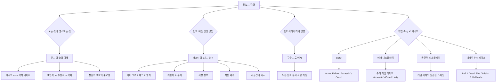

## 정보 시각화: 복잡한 정보를 쉽고 효과적으로 전달하는 방법
이 책은 복잡한 정보를 어떻게 하면 사람들이 더 잘 이해하고, 더 나은 결정을 내릴 수 있도록 시각적으로 표현할 수 있을지에 대해 이야기한다. 저자는 정보 시각화가 단순히 예쁘게 꾸미는 것을 넘어, 사람들이 세상을 다르게 생각하고 더 현명하게 판단하도록 돕는 강력한 도구라고 강조한다. 

## 1. '보는 것이 생각하는 것'의 의미: 인지 예술이란 무엇일까? 

우리가 정보를 볼 때, 그 정보를 어떻게 보여주느냐에 따라 우리의 생각이 달라질 수 있다는 것이 핵심이다. 

1. 인지 예술** (Cognitive Art) 이란?**
  - 인지 예술은 지도, 그래프, 차트, 설계도처럼 사람들에게 정보를 전달하기 위해 시각화된 모든 것을 말한다. 
  - 이것들은 정보 이미지, 데이터 시각화 등 다양한 이름으로 불리기도 한다. 
  - 마치 복잡한 퍼즐 조각들을 맞춰서 전체 그림을 이해하는 것처럼, 인지 예술은 우리가 더 잘 생각할 수 있도록 돕는 틀(프레임워크)이라고 볼 수 있다. 

2. 시각화** 교육의 문제점**
  - 우리는 학교에서 그래프는 수학, 다이어그램은 생물학, 지도는 지리처럼 특정 시각화 방식이 특정 분야에만 엄격하게 연결되어 있다고 배운다. 
  - 하지만 어떤 정보를 어떤 시각화 방식으로 보여주는 것이 가장 효과적인지, 즉 '어떤 그림이 내 이야기를 가장 잘 전달할까?' 하는 시각적 기술은 잘 가르쳐주지 않는다. 
  - 예를 들어, 지리적 사실을 전달할 때 항상 지도가 최선의 방법은 아닐 수도 있다. 
  - 따라서 우리는 이런 시각화 도구들을 개념화하고, 사용자들이 어떤 주제에 대해 생각할 때 올바른 방향으로 생각하도록 도와야 한다. 

3. **시각적 이미지와 시각화의 차이**
  - **시각적 이미지 (Visual Images)**: 아름다움을 추구하는 예술 작품과 같다. 예쁘게 꾸미는 것이 목적이다. 
  - **시각화 (Visualizations)**: 정보를 탐구하고, 사람들이 정보를 이해하고 더 나은 결정을 내리도록 돕는 것이 목적이다. 

4. **시각화의 종류와 중요성**
  - **표현적 **시각화** (**Representational Visualizations**)**:
  - 이것은 마치 건축 모형이나 설계도처럼, 누가 봐도 무엇을 나타내는지 바로 알 수 있는 시각화다. 
  - 이해하기 위해 특별한 사전 지식이 필요 없다. 
  - 추상적 시각화** (Abstract Visualizations)**:
  - 뇌 영상이나 심전도(ECG) 그래프처럼, 한눈에 무엇인지 알기 어렵고 해석하려면 사전 훈련이 필요한 시각화다. 
  - 하지만 이런 정보를 읽을 수 있는 능력은 문자 그대로 생명을 구할 수도 있을 만큼 매우 중요하다. 

5. **청중(Audience)과 **맥락**(Context)의 중요성**
  - 디자이너로서 우리는 항상 '누구에게 이 정보를 전달하려는가?', '이 정보를 볼 사람들은 어떤 지식과 기술을 가지고 있는가?'를 알아야 한다. 
  - 즉, 맥락이 가장 중요하다. 
  - 예를 들어, 복잡한 수학 공식인 만델브로트 집합(Mandelbrot set)을 시각화하면, 수학 공식을 몰라도 반복되는 프랙탈 모양을 통해 그 특징을 바로 이해할 수 있다. 
  - 또 다른 예로, 단순히 지리 데이터를 점으로 표시하는 것보다, 건물 모양, 교통편 등 추가 정보를 함께 시각화하면 훨씬 더 많은 정보를 얻고 더 현명한 결정을 내릴 수 있다. 
  - 정보를 보여주는 방식을 바꾸면, 사람들은 그 주제에 대해 다르게 생각하거나 아예 생각조차 하지 않던 것을 생각하기 시작한다. 
  - 이것은 정보가 한 가지 방식으로만 시각화될 수 있는 것이 아니라, 다양한 방법이 있다는 것을 알려주는 매우 강력한 도구이다. 
  - 원형 이동 차트(circular migration chart)처럼 염색체의 유전체 정보를 나타내는 특이한 시각화도 있다. 

## 2. 인지 예술을 만드는 방법: 터프티의 '정보 시각화' 5가지 원칙 

1990년대에 정보 디자인 및 데이터 시각화 교수인 에드워드 터프티(Edward Tufte)는 '정보 시각화(Envisioning Information)'라는 프레임워크를 제시했다.  그는 '평면 세계 탈출(escaping flatland)'이라는 문제를 정의했는데, 이는 우리가 3차원 세계에 살지만 정보를 2차원 화면에 표현할 때 정보가 평면으로 축소되는 현상을 말한다.  터프티는 이 문제를 해결하기 위해 5가지 원칙을 제안했다. 

1. **마이크로 및 매크로 읽기 (**Micro and Macro Readings**)** 
  - "모든 것은 가능한 한 단순하게 만들어야 하지만, 더 단순하게 만들어서는 안 된다."는 유명한 말처럼, 단순함이 항상 좋은 품질을 의미하는 것은 아니다. 
  - **예시**: 미니멀리즘 디자인과 스큐어모픽 디자인(실제 사물처럼 보이게 하는 디자인)을 비교할 수 있다. 
  - 미니멀리즘 디자인은 아름답지만, 버튼 아래의 작은 그림자처럼 세부적인 디테일이 있어야 사용자가 '이것을 클릭해야겠구나' 하고 바로 이해할 수 있다. 
  - 이런 추가적인 디테일은 기능이나 정보가 무엇인지 설명하는 데 큰 도움이 된다. 
  - 좋은 디자인은 처음 볼 때 전체적인 그림(매크로)을 한눈에 파악할 수 있지만, 자세히 들여다보면 많은 세부 정보(마이크로)를 얻을 수 있어야 한다. 
  - **예시**: 베트남 전쟁 기념비는 멀리서 보면 웅장한 하나의 검은 벽이지만, 가까이 가면 5만 8천 명의 전사자 이름 하나하나를 볼 수 있다.  이름이 사망 날짜 순으로 새겨져 있어, 같은 성을 가진 사람들을 일일이 찾을 필요 없이 고유성을 유지한다. 

2. 계층화 및 분리** (**Layering and Separation**)** 
  - 터프티는 '1 더하기 1은 3'이라는 문제를 정의했다. 이는 정보가 제대로 분리되지 않으면, 두 가지 정보가 합쳐져서 원래 없던 제3의 정보처럼 보이거나 혼란을 준다는 의미다. 
  - **예시**: 기계 장치의 분해도를 생각해보자. 
  - 각 부품에 대한 정보(빨간색 표시)가 그림 위에 겹쳐져 있는데, 만약 색상으로 구분을 제대로 하지 않으면 모든 정보가 뒤섞여서 무엇이 무엇인지 알 수 없게 된다. 
  - 마치 여러 색깔의 물감을 섞으면 탁한 한 가지 색이 되는 것처럼, 정보의 층을 명확하게 구분해야 한다. 
  - **예시**: 파이 차트인데, 색상 선택이 잘못되어 마치 피라미드와 하늘처럼 보이는 경우가 있다. 
  - 한번 그렇게 보이면 원래의 정보가 무엇이었는지 계속 방해받게 된다. 
  - 정보 층을 제대로 구분하는 것이 중요하며, 색상은 이를 위한 좋은 방법이다. 

3. 색상 정보** (Color Information)** 
  - 색상은 매우 민감한 요소이므로, 사람들이 색상에 대해 가지고 있는 자연스러운 기대를 고려해야 한다. 
  - **좋은 예시**: 바다와 육지를 구분하는 지도에서, 파란색의 농도로 물의 깊이를 표현하면 별다른 설명 없이도 바로 이해할 수 있다. 
  - **나쁜 예시**: 파란색은 물, 초록색은 육지, 어두운 점은 숲이나 산으로 추측할 수 있지만, 노란색이 해안인지 사막인지, 빨간색이 용암인지 알 수 없는 지도가 있다면 혼란스럽다. 
  - 색상을 정보와 연결하는 것은 중요하지만, 사람들이 색상에 대해 자연스럽게 기대하는 바를 고려해야 한다. 

4. 작은 배수** (Small Multiples)** 
  - 이것은 여러 대안을 나란히 놓고 비교하고 맥락을 파악하는 것을 말한다. 
  - **예시**: 여러 기차 신호등이나 다양한 뇌 상태를 보여주는 그림을 통해, 여러 선택지 중에서 가장 적절한 것을 고를 수 있다. 
  - 다양한 조건을 한눈에 비교할 수 있으면, 우리는 전체 맥락을 이해하고 훨씬 더 나은, 더 정보에 기반한 결정을 내릴 수 있다. 

5. **시공간의 서사 (**Narratives of Space and Time**)** 
  - 이 원칙은 공간적 경험(어디에 있는지)과 시간적 경험(언제 일어나는지)을 모두 포함하는 포괄적인 설명을 의미한다. 
  - **예시**: 기차 시간표는 공간(정류장)과 시간(출발 시간) 정보를 동시에 보여주는 완벽한 예시다. 
  - **예시**: 아날로그시계와 디지털시계는 같은 시간 정보를 보여주지만, 아날로그시계는 시침, 분침, 초침의 움직임을 통해 시간의 흐름(초나 분의 지속 시간)을 시각적으로 느끼게 해준다. 
  - 어떤 시각화가 더 좋다고 할 수는 없고, 역시 맥락에 따라 무엇이 필요한지, 무엇을 기대하는지에 따라 달라진다. 

## 3. 인터랙티비티(상호작용)가 정보 시각화에 미치는 영향 

터프티의 '정보 시각화' 프레임워크는 1990년대에 만들어졌는데, 그때는 책, 광고판, 포스터처럼 정적인 매체(움직이지 않는 매체)가 주류였다.  하지만 지금은 스마트폰, 태블릿, 컴퓨터처럼 고도로 상호작용하는(인터랙티브한) 매체를 사용한다. 

1. **인터랙티비티의 힘**
  - 과거에는 하나의 이미지에 터프티의 원칙 중 한두 가지만 적용해도 너무 복잡해 보였다. 
  - 하지만 이제는 인터랙티비티 덕분에 이 모든 원칙을 동시에 사용할 수 있게 되었다. 

2. **구글 지도(Google Maps)를 통한 예시**
  - **마이크로 및 매크로 읽기**: 예전에는 지구본이나 지도를 넘겨가며 원하는 지역을 찾았지만, 이제는 구글 지도에서 한두 번의 터치로 확대/축소하며 다양한 시각화 방식을 전환할 수 있다. 
  - 계층화 및 분리: 지도와 그 위에 표시되는 정보(예: 교통 정보, 식당 위치)를 쉽게 구분하고 켜고 끌 수 있다. 
  - 작은 배수: 식당을 찾을 때, 지도에 여러 식당을 표시하고 평점까지 비교할 수 있어 훨씬 더 정보에 기반한 선택을 할 수 있다. 
  - **시공간의 서사**: 자동차 지도책 대신 구글 지도에서 경로를 검색하면, 출발지와 목적지를 입력하고 다양한 교통수단을 선택할 수 있다. 
  - 심지어 '내일 러시아워에 가면 얼마나 걸릴까?'처럼 미래의 시간까지 예측하여 경로를 확인할 수 있다. 
  - 이것은 우리가 지금 디자인할 수 있는 매우 강력하고 멋진 기능이다. 

## 4. 게임 속 정보 시각화: '평면 세계 탈출'과 인터랙티비티 활용 

게임에서는 인터랙티비티를 어떻게 활용하고, 터프티의 원칙들을 어떻게 적용하여 '평면 세계를 탈출'할 수 있을까?  게임 내 정보 표시는 크게 네 가지 유형으로 나눌 수 있다. 

1. HUD** (Heads-Up Display)**: 게임 세계의 일부가 아니며, 이야기(내러티브)와도 관련 없는 정보 표시. 
  - **마이크로 및 매크로 읽기**: '아노(Anno)' 같은 게임에서는 기본 인터페이스가 복잡하지만, 사용자가 원하는 활동이나 결정에 따라 인터페이스를 확장하여 더 많은 옵션과 기능을 볼 수 있다. 
  - 작은 배수: '폴아웃(Fallout)' 같은 게임의 특성(perks) 화면에서는 모든 특성을 한눈에 볼 수 있다. 
  - 각 특성의 시각적 디자인만으로도 은신, 전투, 제작 등 어떤 종류의 특성인지 바로 알 수 있어, 일일이 클릭해서 정보를 읽을 필요가 없다. 
  - **시공간의 서사**: '어쌔신 크리드(Assassin's Creed)'의 스킬 트리나 다른 게임의 스킬 트리는 시간의 흐름에 따른 캐릭터의 성장과 스킬 계획을 보여준다. 
  - '젤다의 전설: 브레스 오브 더 와일드(Breath of the Wild)'의 '영웅의 길(hero's path)'은 플레이어가 지나온 길을 보여주어, 어디를 가봤고 어디를 안 가봤는지 파악하여 다음 행동을 계획하는 데 도움을 준다. 

2. 메타 디스플레이** (Meta-Displays)**: 게임 세계의 일부는 아니지만, 이야기(내러티브)의 일부인 정보 표시. 
  - 색상 정보: 슈팅 게임에서 데미지를 입었을 때 화면이 붉게 변하는 것은 대표적인 예시다. 
  - 이것은 플레이어에게 위험을 알리고 행동을 바꾸도록 유도한다. 
  - 계층화 및 분리** + 시공간의 서사**: '어쌔신 크리드 유니티(Assassin's Creed Unity)'의 자물쇠 따기 기능은 현실의 자물쇠 따는 모습과 함께, 화면에 자물쇠의 내부 구조를 메타적으로 보여준다. 
  - 이를 통해 플레이어는 얼마나 잠금을 해제했는지 진행 상황을 확인하고 다음 행동을 계획할 수 있다. 

3. 공간적 디스플레이** (Spatial Displays)**: 게임 세계의 일부이며, 이야기(내러티브)와는 관련 없는 정보 표시. 
  - **계층화 및 **분리: 게임 세계와 일관된 스타일로 디자인되지만, 플레이어는 이것이 실제 게임 세계의 일부가 아니라는 것을 명확히 인지한다. 
  - 정보를 게임 세계 위에 겹쳐서 보여주면서도 몰입감을 높이는 좋은 방법이다. 
  - **색상 정보**: 게임 내에서 특정 색상을 사용하여 플레이어에게 관심 지점을 알려주거나, 진행해야 할 길을 표시하거나, 선택할 수 있는 행동을 알려주는 등 강력한 신호 역할을 한다. 

4. **디제틱 인터페이스 (**Diegetic Interfaces**)**: 게임 세계의 일부이며, 이야기(내러티브)의 일부인 정보 표시. 
  - 이것은 '데드 스페이스(Dead Space)'의 슈트나 '파 크라이(Far Cry)'의 나침반 지도처럼, 정보가 게임 세계 안에 자연스럽게 통합되어 있는 것을 말한다. 
  - 계층화 및 분리: 정보가 게임 세계의 일부여야 하므로, 정보의 접근성과 이해도를 유지하면서도 게임 세계 안에 통합하는 것이 큰 도전 과제다. 
  - **마이크로 및 매크로 읽기**: '레프트 4 데드(Left 4 Dead)'에서는 마녀(witch)를 만나기 전에, 그녀의 울음소리를 듣고, NPC들이 "우는 여자야, 불 꺼!"라고 반응하는 것을 통해 위험을 미리 감지할 수 있다. 
  - 이처럼 정보를 매크로 수준에서 미리 제공하여, 플레이어가 마이크로 수준에서 적을 만나기 전에 적절한 결정을 내릴 수 있도록 돕는다. 
  - **시공간의 서사**: '더 디비전 2(The Division 2)' 같은 슈팅 게임에서 플레이어는 드럼통, 자동차, 상자 같은 환경 요소를 보면 곧 전투가 벌어질 것이라고 예상한다. 
  - 이러한 맥락은 플레이어의 행동을 변화시키고, 상황을 더 잘 통제하고 있다는 느낌을 준다. 
  - 이처럼 디제틱 접근 방식은 환경 내에서 정보를 배치하는 데 도움을 준다. 
  - **청각적 정보**: '헬블레이드(Hellblade)'에서는 게임 내 목소리(환청)가 이야기의 중요한 부분일 뿐만 아니라, 플레이어에게 경고를 주거나 선택을 돕는 게임 디자인의 일부로 활용된다. 
  - 이처럼 고전적인 지도나 체력 바 외에도 디제틱 디스플레이로 정보를 보여주는 다양한 방법이 있다. 

## 5. 결론: 정보 시각화의 궁극적인 목표 

'보는 것이 생각하는 것'이라는 핵심 메시지를 다시 한번 강조한다. 

1. **정보 시각화의 목표**
  - 정보를 보여주는 방식을 바꾸면, 사람들은 그 주제에 대해 다르게 생각하기 시작한다. 
  - 우리는 비교하고, 대조하고, 사용자가 선택을 할 수 있도록 도와야 한다. 
  - 이 모든 것이 정보에 대한 맥락<mark>(context)</mark>을 만들어준다. 

2. **맥락의 효과**
  - 맥락이 생기면, 정보를 이해하는 데 드는 <mark>인지적 비용(cognitive cost)</mark>이 줄어든다. 
  - 이는 우리가 더 빠르고, 더 나은 결정을 내릴 수 있게 해준다. 왜냐하면 우리가 더 많은 정보를 가지고 있다고 느끼기 때문이다. 

3. **궁극적인 결과**
  - 결과적으로 이것은 <mark>플레이어 통제(player control)</mark>로 이어진다. 
  - 그리고 이는 <mark>플레이어 역량 강화(player empowerment)</mark>와 <mark>만족감(satisfaction)</mark>으로 이어진다. 
  - 이것이 바로 우리가 게임에서 만족스러운 사용자 경험(UX)을 통해 달성하고자 하는 목표이다. 

