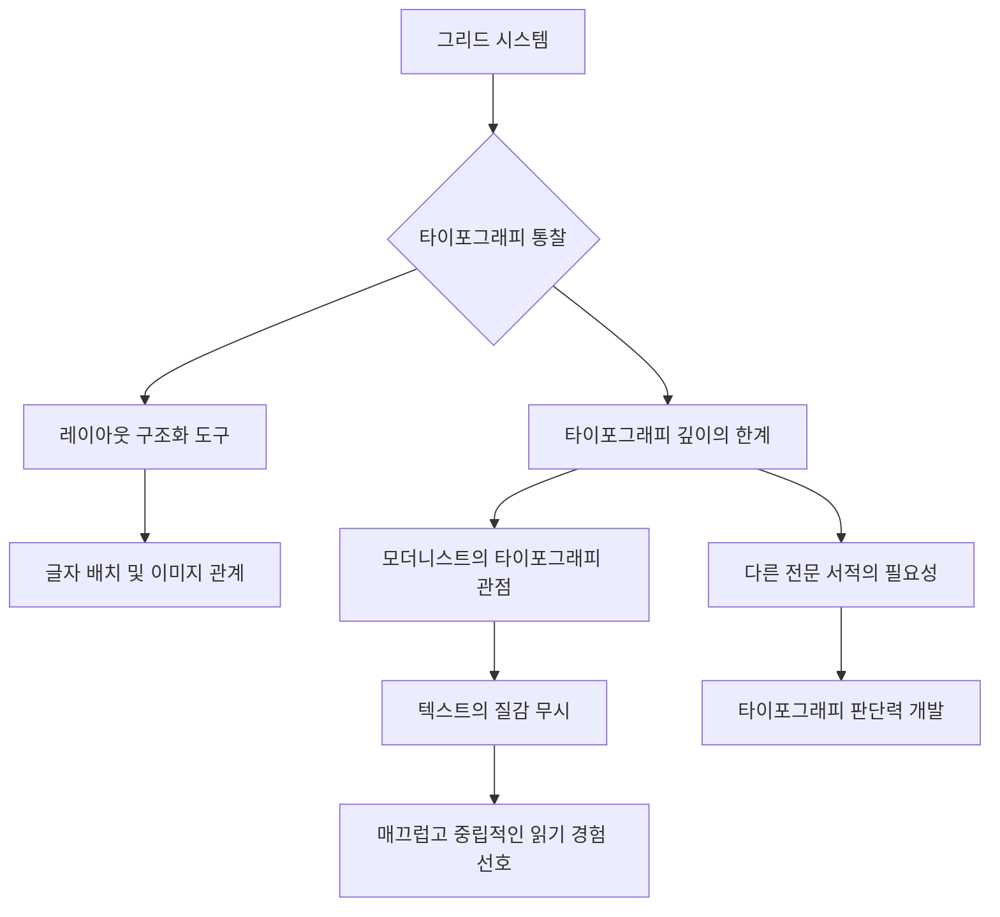
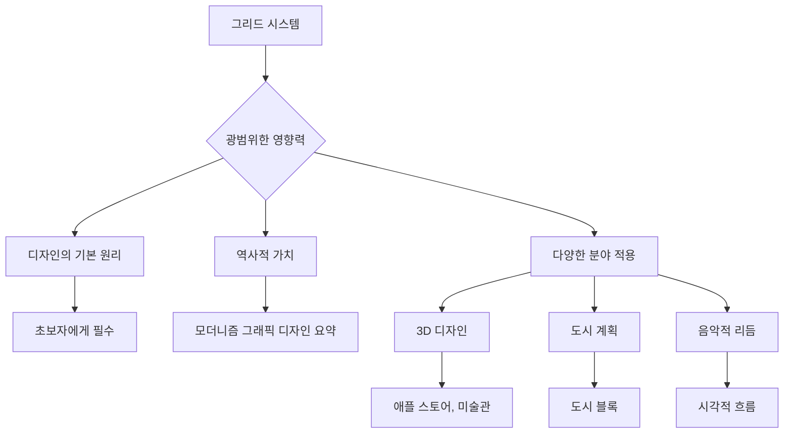

## 그리드 시스템: 디자인의 뼈대를 이해하는 완벽 가이드
이 책은 그래픽 디자인에서 그리드 시스템(Grid System)이 무엇인지, 어떻게 만들고 적용하는지 아주 쉽고 명확하게 알려주는 책이야. 마치 건물을 지을 때 뼈대를 세우는 것처럼, 디자인에서도 그리드가 튼튼한 구조를 만들어준다는 것을 배울 수 있을 거야.

## 1. 그리드 시스템, 왜 중요할까? 

그리드 시스템은 디자인을 할 때 복잡한 요소들을 깔끔하게 정리하고 조화롭게 만드는 데 아주 중요한 역할을 해. 마치 복잡한 방을 정리할 때 칸막이가 있는 수납장을 쓰는 것과 같다고 보면 돼.

1. **개념의 명확성**:
  - 이 책은 그리드가 무엇인지, 그리고 어떻게 디자인에 활용하는지 아주 명확하게 설명해줘. 
  - 페이지 레이아웃(Page Layout)을 어떻게 나누고 구성하는지 다양한 예시를 통해 보여주기 때문에 이해하기 쉬울 거야. 
2. **복잡성 정리**:
  - 그리드는 복잡한 정보들을 체계적으로 정리하는 데 아주 효과적인 도구야. 
  - 디자인 요소들이 뒤죽박죽 섞여 있을 때, 그리드를 사용하면 깔끔하게 정돈할 수 있어. 마치 어질러진 장난감들을 종류별로 상자에 담는 것과 같지. 
3. 디자인의 기초:
  - 그리드는 디자인의 뼈대이자 기초라고 할 수 있어. 
  - 우리가 눈에 보이지 않는 뼈대 덕분에 몸을 지탱하듯이, 디자인도 그리드라는 뼈대 덕분에 안정적인 구조를 갖게 되는 거야. 
4. **새로운 시각**:
  - 이 책을 읽고 나면, 세상의 모든 디자인에서 그리드를 찾아보게 될 거야. 
  - 어떤 디자인은 그리드를 잘 활용해서 멋지게 만들어졌고, 어떤 디자인은 그리드를 제대로 쓰지 못해서 어색하다는 것을 알게 될 거야. 마치 숨겨진 보물을 찾는 것처럼 말이야. 
5. **창의성의 발판**:
  - 그리드가 디자인을 제한한다고 생각할 수도 있지만, 사실은 창의성을 더 키워주는 역할을 해. 
  - 정해진 규칙 안에서 더 새롭고 재미있는 아이디어를 떠올릴 수 있게 도와주는 거지. 마치 정해진 블록으로 다양한 모양을 만드는 것과 같아. 

## 2. 그리드 시스템의 구성 요소와 원리 

그리드 시스템은 몇 가지 기본적인 요소들로 이루어져 있어. 이 요소들을 잘 이해하면 어떤 디자인이든 체계적으로 만들 수 있을 거야.

1. 모듈식 분할** (**Modular** Division)**:
  - 그리드는 페이지를 가로와 세로로 나누는 선들로 이루어져 있어. 
  - 이 선들은 페이지를 1개, 2개, 3개, 또는 4개 등으로 균등하게 나누어서 글자와 이미지를 조화롭게 배치할 수 있게 해줘. 마치 바둑판처럼 칸을 나누는 것과 같아. 
2. **종이 크기 시스템 (**DIN System**)**:
  - 이 책에서는 유럽에서 많이 쓰는 DIN 시스템이라는 종이 크기 기준을 설명해줘. 
  - 이 시스템은 A1, A2, A3, A4처럼 종이를 반으로 접으면 다음 크기가 되는 아주 편리한 방식이야. 우리나라에서 쓰는 종이 크기보다 훨씬 체계적이라고 할 수 있지. 
3. 타이포그래피** 측정 단위 (**Typography** Measurement Units)**:
  - 책에서는 옛날 타이포그래피(Typography)에서 쓰던 측정 단위들을 알려줘. 
  - 지금은 '포인트(Point)'를 주로 쓰지만, 예전에는 '시세로(Cicero)' 같은 단위도 사용했어. 마치 옛날에는 '자'나 '치' 같은 단위를 썼던 것과 비슷해. 
4. **타이포그래피(Typography)의 기본**:
  - 그리드를 만들 때 글자의 너비(Column Width)와 줄 간격(Leading)을 어떻게 정해야 하는지 자세히 설명해줘. 
  - 글자 줄이 너무 짧으면 읽기 힘들고, 너무 길면 지루해지기 때문에 적절한 너비를 찾는 것이 중요해. 
  - 줄 간격도 너무 좁으면 글자들이 겹쳐 보이고, 너무 넓으면 뚝뚝 끊겨 보여서 적당한 간격을 유지해야 해. 
  - 이 책에서는 옛날 방식의 줄 간격 계산법도 알려주는데, 지금 우리가 쓰는 방식과는 조금 다르다는 것을 알아두면 좋아. 
5. 여백** 비율 (Margin Proportions)**:
  - 페이지의 여백(Margin)을 어떻게 설정해야 하는지도 중요해. 
  - 책을 묶는 부분(Binding)이나 손으로 잡는 부분에는 충분한 여백이 있어야 읽기 편하거든. 마치 액자에 그림을 넣을 때 적절한 여백을 두는 것과 같아. 
6. **페이지 번호 위치**:
  - 페이지 번호(Page Number)를 어디에 놓을지 16가지나 되는 다양한 예시를 보여줘. 
  - 이 책에서는 페이지 번호가 글자 줄에 딱 맞춰져 있어서 깔끔하게 보인다는 점을 강조하고 있어. 

## 3. 그리드 시스템의 실제 적용 방법 

그리드 시스템은 단순히 이론만 배우는 것이 아니라, 실제로 디자인에 어떻게 적용하는지가 중요해. 이 책은 다양한 예시와 단계별 설명을 통해 그리드를 실생활에 적용하는 방법을 알려줄 거야.

1. **단계별 적용**:
  - 이 책은 그리드를 어떻게 만들고 적용하는지 단계별로 아주 자세히 설명해줘. 
  - 다른 디자인 책들이 최종 결과물만 보여주는 것과 달리, 이 책은 디자인 과정과 해결책을 찾아가는 과정을 보여주기 때문에 훨씬 도움이 될 거야. 
2. **다양한 예시**:
  - 그리드 시스템이 어떻게 적용되는지 보여주는 수많은 시각적 예시들이 있어. 
  - 옛날 구텐베르크 성경부터 현대의 3D 공간 디자인까지, 그리드가 어떻게 활용되는지 역사적인 사례들을 통해 보여줘. 
  - 특히 3D 공간이나 인체 해부도에 그리드를 적용한 예시는 정말 놀라울 거야. 
3. **초보자를 위한 안내**:
  - 이 책은 디자인을 처음 배우는 초보자들에게 아주 좋은 길잡이가 될 거야. 
  - 그리드 시스템의 기본 원리를 이해하고 실제 디자인에 적용하는 데 큰 도움을 줄 거야. 
4. **디지털 환경에서의 활용**:
  - 이 책은 디지털 디자인(Digital Design) 시대가 오기 전에 쓰였지만, 여기서 배운 원리들은 웹 디자인(Web Design)이나 UI(User Interface) 디자인 같은 디지털 환경에도 그대로 적용할 수 있어. 
  - 소프트웨어(Software) 사용법이 아니라 디자인의 근본적인 원리를 다루기 때문에, 어떤 환경에서든 활용할 수 있는 거야. 
  - 예를 들어, 웹사이트를 만들 때 흔히 쓰는 '히어로 이미지 슬라이더, 3단 레이아웃, 버튼' 같은 정형화된 디자인에서 벗어나, 그리드를 활용해 더 재미있고 역동적인 레이아웃을 만들 수 있지. 
5. **그리드 유형별 적용**:
  - 책에서는 8칸, 20칸, 32칸 그리드처럼 다양한 크기의 그리드를 보여주면서, 각각의 그리드에서 글자와 이미지를 어떻게 배치할 수 있는지 수많은 조합을 제시해. 
  - 이것은 마치 레고 블록으로 다양한 건물을 짓는 방법을 알려주는 것과 같아. 
6. **스케치(Sketch)의 중요성**:
  - 디자인을 시작하기 전에 실제 비율에 맞춰 스케치(Sketch)를 하는 것이 얼마나 중요한지 강조해. 
  - 작은 스케치라도 실제 디자인과 같은 비율로 그려야 나중에 문제가 생기지 않아. 마치 건물을 짓기 전에 설계도를 정확하게 그리는 것과 같지. 
7. **사진 배치 (Photograph Placement)**:
  - 사진을 그리드에 배치할 때는 그리드를 염두에 두고 사진을 찍는 것이 가장 좋다고 조언해. 
  - 만약 그리드에 맞춰 찍지 못한 사진이라면, 사진 주변에 색깔 블록을 넣거나 테두리를 그려서 시각적으로 안정감을 줄 수 있어. 
8. **텍스트 블록 처리 (Text Block Handling)**:
  - 그리드 안에서 특정 텍스트(Text) 블록에 색깔 배경을 넣을 때 생기는 문제와 해결책도 제시해. 
  - 텍스트가 그리드 선에 맞춰지지 않거나, 배경 상자가 그리드를 벗어나는 문제를 어떻게 해결할지 여러 가지 방법을 알려줘. 
9. **실제 디자인 사례**:
  - 책의 후반부에는 실제 기업의 연간 보고서(Annual Report)나 책 표지(Book Cover) 같은 디자인 사례들을 보여주면서, 그리드가 어떻게 적용되었는지 설명해줘. 
  - 이 사례들을 통해 그리드 이론이 실제 디자인에서 어떻게 빛을 발하는지 확인할 수 있을 거야. 
10. **중첩 그리드 (Overlapping Grids)**:
  - 더 복잡한 디자인을 위해 여러 개의 그리드를 겹쳐서 사용하는 방법도 소개하는데, 이건 좀 더 고급 기술이라고 할 수 있어. 
  - 예를 들어, 사진을 위한 그리드와 글자를 위한 그리드를 따로 만들어서 겹쳐 쓰는 방식이지. 

## 4. 타이포그래피(Typography)에 대한 깊이 있는 통찰 

이 책은 그리드 시스템을 통해 타이포그래피(Typography)를 어떻게 구조화할 수 있는지 알려주지만, 타이포그래피 자체에 대한 깊이 있는 통찰은 다른 책들보다 부족하다는 평가도 있어. 마치 건물의 뼈대를 잘 세우는 법은 알려주지만, 벽돌 하나하나의 아름다움이나 재료의 특성에 대해서는 자세히 설명하지 않는 것과 같지.

1. **레이아웃(Layout) 구조화 도구로서의 **타이포그래피:
  - 그리드 시스템은 글자를 배치하는 데 아주 훌륭한 구조화 도구야. 
  - 특히 글자와 이미지를 함께 배치할 때 그리드가 매우 중요하다고 강조해. 
2. 타이포그래피** 깊이의 한계**:
  - 하지만 이 책은 타이포그래피 자체에 대한 섬세함이나 깊이 있는 내용은 부족하다는 의견도 있어. 
  - 다른 전문 서적들(예: 엘렌 루프턴의 '타이포그래피 스타일의 요소들')과 비교하면 타이포그래피에 대한 통찰이 덜하다는 거지. 
3. **모더니스트(**Modernist**)의 타이포그래피 관점**:
  - 일부 전문가들은 모더니스트 디자이너들이 타이포그래피를 다루는 방식에 대해 비판적인 시각을 가지고 있어. 
  - 모더니스트들은 글자를 '매끄럽고 중립적인 읽기 경험'을 제공하는 도구로만 보려는 경향이 있어서, 글자 자체의 질감이나 개성을 무시하는 경우가 있다는 거야. 
  - 이런 관점은 글자를 추상적인 상자처럼 취급하게 만들어서, 글자의 본질적인 아름다움을 놓칠 수 있다는 지적도 있어. 
4. **다른 전문 서적의 필요성**:
  - 이 책만으로는 타이포그래피에 대한 충분한 이해나 판단력을 기르기 어렵다는 의견도 있어. 
  - 그리드 시스템을 통해 레이아웃을 잘 만드는 법은 배울 수 있지만, 글자 자체를 깊이 있게 이해하려면 다른 전문 서적들을 함께 읽는 것이 좋다는 거지. 
5. **책 자체의 타이포그래피 문제**:
  - 이 책의 본문에는 '위도우(Widow)'(문단 마지막 줄에 단어 하나만 남는 것)나 '오펀(Orphan)'(문단 첫 줄이 페이지 맨 아래에 남는 것), 그리고 들쭉날쭉한 '래그(Rag)'(정렬되지 않은 가장자리) 같은 타이포그래피 오류들이 많이 발견돼. 
  - 그리드 전문가가 쓴 책인데도 이런 문제가 있다는 점은 아이러니하게 느껴질 수 있어. 
  - 이는 독일어 원본을 영어로 번역하는 과정에서 생긴 문제일 수도 있고, 출판사의 편집 과정에서 발생했을 수도 있다는 추측도 있어. 
  - 하지만 이런 문제점에도 불구하고, 책의 후반부에서는 타이포그래피를 그리드에 맞춰 어떻게 계획하고 스케치해야 하는지 단계별로 자세히 설명하고 있어. 

## 5. 그리드 시스템의 광범위한 영향력 

요제프 뮐러-브록만(Josef Müller-Brockmann)의 '그래픽 디자인의 그리드 시스템'은 시간이 흘러도 변치 않는 디자인의 기본 원리를 담고 있어서, 오늘날까지도 많은 디자이너에게 큰 영향을 미치고 있어. 마치 오래된 고전 영화가 시간이 지나도 여전히 감동을 주는 것과 같지.

1. **변치 않는 영향력**:
  - 이 책은 디지털 시대에도 여전히 강력한 영향력을 발휘하고 있어. 
  - 그리드 시스템을 명확하게 설명하고 시각적인 예시로 뒷받침하는 방식은 시대를 초월해서 유용하다는 평가를 받아. 
2. **초보자와 전문가 모두에게**:
  - 디자인을 처음 배우는 사람들에게는 필수적인 입문서 역할을 해. 
  - 숙련된 디자이너들에게는 이미 알고 있는 내용일 수 있지만, 그리드 원리를 다시 한번 되새기고 새로운 관점을 얻는 데 도움이 될 수 있어. 
3. **역사적 가치**:
  - 이 책은 모더니즘(Modernism) 그래픽 디자인의 중요한 역사적 기록이자 요약본으로서도 큰 가치를 지녀. 
  - 당시 디자인 사조의 핵심 아이디어를 잘 보여주는 대표적인 예시라고 할 수 있지. 
4. **다양한 분야로의 확장**:
  - 그리드 시스템은 단순히 2D 평면 디자인에만 적용되는 것이 아니야. 
  - **3D 디자인**: 3차원 공간 디자인에도 그리드를 적용할 수 있어. 
  - 예를 들어, 미술관의 전시 공간이나 애플 스토어(Apple Store) 같은 건물의 내부 디자인도 그리드 원리를 바탕으로 만들어진다고 볼 수 있지. 
  - 가구 배치, 조명, 심지어 바닥 타일 하나하나까지 그리드에 맞춰 디자인할 수 있다는 아이디어는 정말 흥미로울 거야. 
  - 모듈형 그리드: 작은 조각들을 조합해서 전체를 만드는 모듈형 디자인에도 그리드가 활용돼. 
  - 이동식 전시 부스나 간판처럼 여러 조각을 옮겨도 전체적인 통일성을 유지할 수 있는 것이 바로 그리드 덕분이야. 
  - **도시 계획**: 도시 전체를 계획할 때도 그리드 시스템이 사용돼. 
  - 도시의 블록(City Block)이나 도로망이 그리드처럼 질서 정연하게 배열되는 것을 보면 그리드의 거대한 영향력을 느낄 수 있을 거야. 
  - **미시적 그리드**: 아주 작은 단위, 예를 들어 픽셀(Pixel) 같은 미시적인 디자인에도 그리드가 적용돼. 
  - 옛날 비디오 게임의 픽셀 폰트(Pixel Font)처럼, 작은 점들로 이루어진 글자도 그리드 위에서 만들어지는 거야. 
  - **음악적 리듬**: 그리드는 디자인에 '리듬(Rhythm)'과 '흐름(Flow)'을 부여할 수도 있어. 
  - 음악이 강약과 빠르기로 리듬을 만들듯이, 디자인에서도 그리드를 활용해 시각적인 강약과 흐름을 만들어낼 수 있다는 거지. 
  - 이는 특히 공간 디자인에서 사람들이 움직이는 동선이나 시선이 머무는 곳을 계획할 때 유용하게 쓰일 수 있어. 
  - **다양한 형태의 그리드**: 그리드는 사각형 형태만 있는 것이 아니라, 대각선 그리드나 원형 그리드처럼 다양한 형태로도 존재할 수 있어. 
  - 악보(Sheet Music)도 일종의 그리드라고 볼 수 있고, 고딕 건축의 장식(Gothic Tracery)도 원형 그리드 위에 만들어진 것이라고 설명해. 
5. **지속적인 가치**:
  - 이 책은 1961년에 처음 출판된 이후 22판까지 나올 정도로 오랫동안 사랑받고 있어. 
  - 이는 그리드 시스템이 디자인의 본질적인 부분이며, 시대가 변해도 그 가치가 변하지 않는다는 것을 증명하는 셈이야. 
  - 마치 고전 명작이 시간이 지나도 계속 읽히는 것처럼, 이 책도 디자인의 고전으로 자리매김한 거지. 

