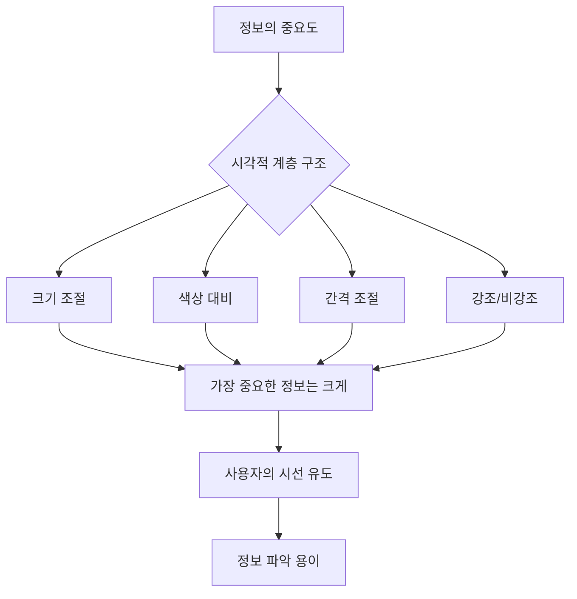
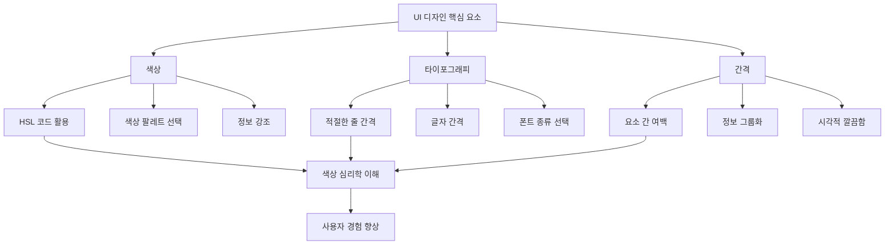

## Refactoring UI: 디자인 감각 없는 개발자를 위한 실용 UI 가이드
이 책은 디자인 경험이 없는 개발자나 기술 분야 종사자들이 실용적인 UI(사용자 인터페이스) 디자인 솔루션을 얻을 수 있도록 돕는 책이다. 아담 워던과 스티브 쇼거가 쓴 이 책은 복잡한 디자인 이론 대신 실제 예시를 통해 즉시 적용 가능한 디자인 원칙들을 알려준다. 마치 요리책처럼, 기본적인 재료와 조리법을 알려줘서 누구나 쉽고 빠르게 멋진 요리를 만들 수 있게 해주는 것과 같다고 보면 된다.

## 1. Refactoring UI, 어떤 책일까? 

Refactoring UI는 아담 워던(Tailwind CSS 개발자)과 스티브 쇼거가 함께 쓴 책으로, 디자인에 대한 깊은 지식 없이도 멋진 UI를 만들 수 있도록 돕는 실용적인 가이드북이다.

1. **저자 소개**:
  1. 아담 워던은 Tailwind CSS의 개발자이자 연쇄 창업가로, 인디 해커스(Indie Hackers)에 많은 글을 올리며 활발하게 활동하고 있다.
  2. 스티브 쇼거는 디자이너로, 개발자와 디자이너가 함께 이 책을 썼다는 점이 흥미롭다.
  3. 이 책은 RefactoringUI.com이라는 웹사이트를 통해 홍보되었고, 350만 달러 이상의 판매고를 올리며 프로그래밍 서적으로는 이례적인 성공을 거두었다.
2. **책의 특징**:
  1. 총 218페이지로 구성되어 있지만, 내용이 밀도 높지 않아 3~4시간이면 충분히 읽을 수 있다.
  2. 책의 구성이 매우 영리해서, 필요한 부분을 빠르게 찾아볼 수 있도록 목차가 잘 정리되어 있다. 마치 요리책에서 특정 요리법을 찾아보듯이, 색상이나 타이포그래피 같은 특정 디자인 요소를 다시 확인할 때 유용하다.
  3. 이 책은 디자인의 기본 원리부터 색상, 타이포그래피, 간격, 깊이, 이미지 등 구체적인 UI 요소들을 다룬다.
  4. 특히, 책에 포함된 예시들은 매우 깔끔하고 직관적인 이미지로 설명되어 있어 내용을 쉽게 이해할 수 있다. 마치 그림책처럼 많은 그림이 있어 빠르게 내용을 파악할 수 있다.
3. **누구를 위한 책인가?**:
  1. 주로 프론트엔드 개발자나 UI/UX 디자이너, 제품 관리자 등 UI 작업에 관여하는 사람들에게 유용하다.
  2. 특히, 스타트업을 운영하거나 개인 프로젝트를 진행하며 직접 UI 디자인을 해야 하는 사람들에게 큰 도움이 된다.
  3. 만약 단순히 주어진 디자인을 코드로 구현하는 역할만 한다면 굳이 이 책을 살 필요는 없을 수도 있다. 하지만 디자인에 대한 이해를 높여 더 나은 마이크로 결정을 내리고 싶다면 추천한다.

## 2. 디자인의 기본 원칙: 아름다움과 의미의 균형 

디자인을 할 때 가장 흔한 고민은 '얼마나 아름답게 만들까?'와 '얼마나 의미 있게 만들까?' 사이의 균형을 맞추는 것이다. 마치 예쁜 옷을 고를 때, 보기에도 좋고 편안하게 입을 수 있는 옷을 찾는 것과 같다고 보면 된다.

1. **아름다움과 **기능성** 사이의 갈등**:
  1. 드리블(Dribbble) 같은 디자인 커뮤니티에서 멋진 디자인을 보면 따라 하고 싶지만, 막상 적용해보면 기능적으로 작동하지 않거나 실제 문제를 해결해주지 못하는 경우가 많다.
  2. 반대로, 요구사항에 맞춰 문제를 해결하는 데 집중하다 보면 디자인이 눈에 잘 띄지 않거나 예쁘지 않은 경우가 생긴다.
  3. 이 책은 디자인이 아름다우면서도 동시에 의미 있고 기능적일 수 있도록 돕는 가이드라인을 제공한다.
2. **개발자와 디자이너의 협업**:
  1. 디자인 과정에서 개발자와 디자이너 사이에 의견 충돌이 생기는 경우가 많다.
  2. 이 책을 통해 디자이너는 자신의 디자인을 더 현실적으로 만들고, 개발자는 디자인 의도를 더 잘 이해할 수 있게 된다.
3. **UI의 중요성 강조**:
  1. 이 책은 UI(사용자 인터페이스)의 아름다움에 큰 비중을 둔다. 단순히 기능적인 측면뿐만 아니라, UI를 어떻게 하면 더 보기 좋게 만들고 균형을 맞출 수 있는지에 대해 자세히 설명한다.
  2. 많은 디자인 서적들이 기능성에만 초점을 맞추는 반면, Refactoring UI는 UI의 시각적인 매력을 높이는 방법을 잘 다룬다.

## 3. 디자인 시작하기: 생각의 전환과 선택의 제한 

디자인을 시작할 때, 무작정 많은 것을 시도하기보다는 생각의 방향을 정하고 선택지를 줄이는 것이 중요하다. 마치 요리를 할 때, 모든 재료를 다 넣으려 하기보다 어떤 요리를 만들지 정하고 필요한 재료만 준비하는 것과 같다고 보면 된다.

1. **디자인 사고방식의 전환**:
  1. 이 책은 디자인을 시작하는 방법에 대한 중요한 가이드를 제공한다. UI를 만들 때 어떤 생각으로 접근해야 하는지 알려준다.
  2. 단순히 UI나 특정 기능에만 집중하기보다는, 전체적인 사용자 경험(UX) 흐름과 과정을 생각하는 것이 중요하다고 강조한다.
2. **선택의 제한**:
  1. 창의성은 무한하다고 생각하기 쉽지만, 디자인에서는 오히려 선택지를 제한하는 것이 더 좋은 결과를 가져올 수 있다.
  2. 예를 들어, 수천 가지 색상이나 폰트 스타일을 모두 사용하려 하기보다는, 프로젝트에 맞는 몇 가지 색상 팔레트나 폰트 스타일을 정해두고 사용하는 것이 좋다.
  3. 이렇게 제한된 선택지 안에서 작업하면 디자인이 더 일관성 있고 체계적으로 보인다. 마치 레고 블록으로 집을 만들 때, 정해진 블록 안에서 다양한 모양을 만드는 것과 같다고 보면 된다.
3. **체계적인 작업 방식**:
  1. 디자인 작업을 시작하기 전에 미리 규칙을 정하고 체계적으로 작업하는 것이 중요하다.
  2. 이러한 구조화된 접근 방식은 개발자들과의 협업을 더 쉽게 만들고, 최종 결과물의 품질을 높이는 데 도움이 된다.
  3. 이 책은 창의성을 제한하는 것이 아니라, 오히려 혼란스러운 생각을 정리하고 더 효율적으로 작업할 수 있도록 돕는다고 설명한다.

## 4. 시각적 계층 구조: 정보의 중요도를 명확히 

시각적 계층 구조는 디자인 요소들이 서로 어떻게 관련되어 있고, 어떤 정보가 더 중요한지를 사용자에게 명확하게 보여주는 방법이다. 마치 신문 기사에서 헤드라인은 크게, 중요한 내용은 중간 크기로, 세부 내용은 작게 쓰는 것과 같다고 보면 된다.

1. **정보의 혼란 방지**:
  1. 왼쪽 화면처럼 모든 정보가 똑같은 크기와 형태로 나열되어 있으면, 사용자는 어디에 집중해야 할지 모르게 된다. 마치 모든 글자가 똑같은 크기로 쓰인 책을 읽는 것과 같아서 중요한 내용을 찾기 어렵다.
  2. 오른쪽 화면처럼 '대시보드'와 같은 중요한 정보는 강조하고, 테이블의 핵심 정보는 더 눈에 띄게 만들면 사용자는 정보를 훨씬 쉽게 파악할 수 있다.
2. **사용자 시선 유도**:
  1. 디자이너는 시각적 계층 구조를 통해 사용자의 시선을 원하는 곳으로 유도할 수 있다.
  2. 예를 들어, 심박수 앱에서 '심박수'라는 제목보다 실제 '숫자'가 더 중요하므로, 숫자를 더 크게 강조하여 사용자가 바로 숫자를 볼 수 있도록 한다.
3. **전문적인 디자인**:
  1. 앱이나 웹사이트를 디자인할 때 시각적 계층 구조에 더 많은 시간을 투자하면, 결과물이 훨씬 전문적이고 깔끔하게 보인다.

## 5. 색상, 타이포그래피, 간격: UI 디자인의 핵심 요소 

색상, 타이포그래피(글꼴), 간격은 UI 디자인의 가장 기본적인 요소들이지만, 이들을 어떻게 활용하느냐에 따라 디자인의 품질이 크게 달라진다. 마치 요리에서 소금, 설탕, 후추 같은 기본 양념을 어떻게 사용하느냐에 따라 음식 맛이 달라지는 것과 같다고 보면 된다.

1. 색상:
  1. HSL 코드** 활용**: 헥스 코드(Hex code) 대신 HSL(Hue, Saturation, Lightness) 코드를 사용하면 색상을 더 직관적으로 다룰 수 있다. HSL은 색상(Hue), 채도(Saturation), 밝기(Lightness)를 조절하는 방식인데, 마치 물감의 색깔, 진하기, 밝기를 조절하는 것과 같아서 원하는 색을 쉽게 만들 수 있다.
  2. **색상 팔레트 선택**: 단순히 웹사이트에서 추천하는 색상 팔레트를 사용하는 것보다, 이 책에서 제시하는 원칙에 따라 색상을 선택하면 훨씬 더 조화롭고 효과적인 팔레트를 만들 수 있다.
  3. 정보 강조: 색상의 채도와 밝기를 조절하여 중요한 정보를 강조하거나, 같은 색상의 두 가지 음영을 사용하여 텍스트를 돋보이게 할 수 있다.
  4. **색상 심리**: 파란색은 어떤 프로젝트에도 잘 어울리는 안전한 색상으로 여겨진다. 금색은 고급스럽고 비싼 느낌을 주며, 밝은 색상은 더 캐주얼하고 재미있는 느낌을 준다.
  5. **배경색에 따른 강조**: 흰색 배경에서는 연한 회색으로 텍스트를 강조할 수 있지만, 유색 배경에서는 배경색에서 색상을 추출하여 채도나 밝기를 조절하는 것이 더 자연스럽다.
2. 타이포그래피** (글꼴)**:
  1. **기본 원칙**: 적절한 줄 간격(line height), 글자 간격(character spacing)을 유지하고, 다양한 글꼴의 차이점을 이해하여 상황에 맞게 사용하는 것이 중요하다.
  2. **디자인 시스템과의 연계**: 많은 디자이너들이 피그마(Figma) 같은 툴에서 제공하는 텍스트 스타일이나 디자인 시스템의 타이포그래피를 그대로 사용하지만, 이 책은 타이포그래피가 왜 중요한지, 어떻게 만들어졌는지, 어떤 스케일로 사용해야 하는지 등 근본적인 질문에 대한 답을 제공한다.
  3. **혼란 해소**: 이 책을 읽으면 타이포그래피에 대한 많은 궁금증이 해소되고, 디자인 시스템을 더 잘 이해하고 활용할 수 있게 된다.
3. **간격 (Spacing)**:
  1. **여백의 중요성**: 요소들 사이에 적절한 간격을 두면 디자인이 훨씬 깔끔하고 숨 쉴 공간이 생긴다. 마치 방에 가구를 너무 많이 채워 넣으면 답답해 보이는 것처럼, 디자인도 여백이 중요하다.
  2. **정보 그룹화**: 관련 있는 요소들끼리 가까이 배치하고, 관련 없는 요소들 사이에는 충분한 간격을 두어 정보를 시각적으로 그룹화할 수 있다.
  3. 팝업** 창 예시**: 팝업 창에서 너무 많은 회색 블록으로 내용을 나누면 복잡해 보일 수 있다. 이때는 블록을 없애고 요소들 사이에 더 많은 공간을 주면 훨씬 깔끔하고 여유로운 디자인이 된다.

## 6. 디자인의 개성 선택: 프로젝트의 분위기 결정 

디자인을 시작하기 전에 프로젝트의 '개성'을 정하는 것이 중요하다. 마치 옷을 고를 때, 어떤 자리에 갈지(은행 vs 스타트업 파티)에 따라 옷 스타일(정장 vs 캐주얼)을 다르게 고르는 것과 같다고 보면 된다.

1. **고객과 소통 방식**:
  1. 디자인이 고객과 어떻게 소통하기를 원하는지 미리 생각해야 한다.
  2. 예를 들어, 은행 앱을 디자인한다면 보안적이고 전문적인 느낌을 주어야 한다. 이때는 세리프(serif) 폰트(글자 끝에 작은 획이 있는 폰트)처럼 클래식하고 신뢰감을 주는 글꼴을 사용하는 것이 좋다.
  3. 반면, 새로운 스타트업을 위한 디자인이라면 더 재미있고 캐주얼하며 장난기 넘치는 느낌을 줄 수 있다. 이때는 둥근 산세리프(sans-serif) 폰트(글자 끝에 획이 없는 폰트)처럼 현대적이고 친근한 글꼴을 선택할 수 있다.
2. **일관된 분위기**:
  1. 이렇게 프로젝트의 개성을 미리 정해두면, 색상, 글꼴, 이미지 등 모든 디자인 요소들이 일관된 분위기를 유지할 수 있다.
  2. 이는 사용자가 앱이나 웹사이트를 이용할 때 혼란 없이 편안함을 느끼게 해준다.

