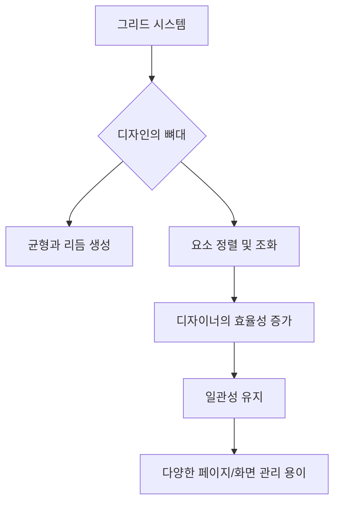
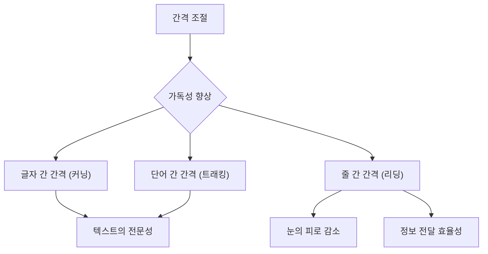
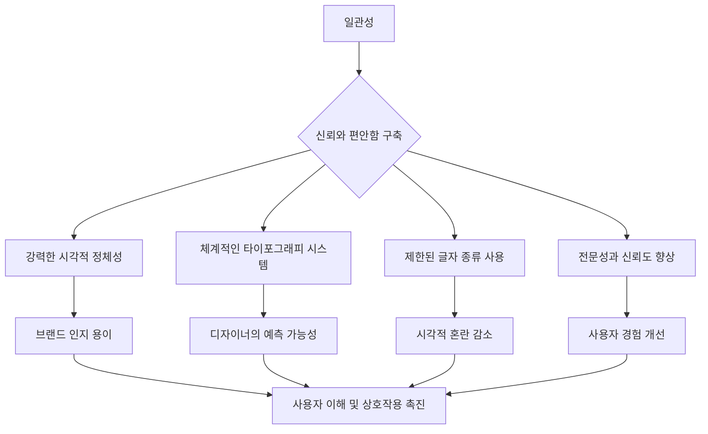

## 에릭 슈피커만, 『Stop Stealing Sheep & Find Out How Type Works』 요약: 타이포그래피는 단순한 글자가 아니야!
이 책은 타이포그래피(글자 디자인)가 단순히 예쁜 글씨를 고르는 게 아니라, 메시지를 정확하고 효율적으로 전달하는 아주 중요한 도구라고 말해. 에릭 슈피커만은 글자가 어떻게 작동하는지 이해하고, 그걸 잘 활용해서 독자들이 정보를 쉽게 받아들이도록 돕는 방법을 알려주는 책이야.

## 1. 타이포그래피는 단순한 글자가 아니야: 메시지 전달의 핵심 도구 

1. **타이포그래피의 진짜 역할**: 글자 디자인은 그냥 예쁘게 꾸미는 게 아니야. 마치 도로 표지판처럼, 메시지를 빠르고 정확하게 전달하는 아주 중요한 도구라고 보면 돼. 
  - 모든 글자 디자인 결정은 독자가 메시지를 명확하게 이해하도록 도와야 해. 
2. **맥락 이해의 중요성**: 어떤 글자를 쓸지 고르기 전에, 이 글자가 어디에 쓰일지, 누가 볼지, 어떤 매체에 나올지 먼저 생각해야 해. 
  - 예를 들어, 광고, 제품 포장, 스마트폰 앱 등 다양한 곳에서 글자가 어떻게 쓰이는지 살펴보는 게 중요해. 
  - 글자는 다른 그림이나 사진 같은 시각적인 요소들과 잘 어울려야 해. 그래야 보는 사람에게 특별한 느낌이나 경험을 줄 수 있어. 
3. **일관성의 힘**: 한 브랜드에서 쓰는 글자 종류, 크기, 배치 방식이 항상 똑같으면, 사람들이 그 브랜드를 더 쉽게 알아보고 기억할 수 있어. 
  - 이런 일관성은 브랜드에 대한 신뢰감을 높이고, 전문가다운 이미지를 만들어줘. 

## 2. 독자를 생각하는 글자 선택: 문화, 나이, 경험의 차이 

1. **누가 읽을까?**: 글자를 고를 때는 누가 이 글을 읽을지 꼭 생각해야 해. 
  - 사람들의 문화, 나이, 경험에 따라 글자 모양에 대한 느낌이 아주 많이 달라질 수 있거든. 
  - 예를 들어, 어떤 문화에서는 세련돼 보이는 글자가 다른 문화에서는 딱딱하거나 옛날 느낌을 줄 수도 있어. 
2. **글자 모양이 주는 느낌**: 글자마다 고유한 특징이 있어서 특정한 느낌을 줘. 
  - 산세리프**(Sans **Serif**) 글자**: 삐침이 없는 글자로, 보통 현대적이고 깔끔하며 단순한 느낌을 줘. 
  - 세리프**(**Serif**) 글자**: 삐침이 있는 글자로, 주로 고전적이고 전통적이거나 격식 있는 느낌을 줘. 
  - 이런 글자들의 특징을 잘 이해하면, 브랜드나 내용에 딱 맞는 시각적인 메시지를 전달할 수 있어. 

## 3. 정보의 길잡이: 시각적 계층 구조 

1. 정보의 중요도** 표시**: 마치 신문 기사처럼, 글자 크기, 굵기, 위치를 다르게 해서 어떤 정보가 가장 중요한지 독자에게 알려주는 거야. 
  - 이렇게 하면 독자들이 정보를 체계적이고 효율적으로 이해할 수 있어. 
2. **다양한 계층 표현 방법**: 글자 크기만으로 중요도를 나타내는 게 아니야. 
  - 글자의 굵기(폰트 웨이트), 대문자 사용, 글자 사이의 간격(스페이싱) 같은 다른 요소들도 활용해서 정보의 구조를 만들 수 있어. 
3. **과유불급**: 너무 많은 종류의 글자를 쓰거나, 너무 많은 스타일을 마구 섞어 쓰면 오히려 독자들이 혼란스러워하고 메시지에 집중하기 어려워져. 
  - 그래서 디자인할 때는 글자 종류를 1~3개 정도로 제한하는 게 좋아. 
  - 같은 글자라도 기울임(이탤릭)이나 굵게(볼드) 같은 스타일 변화를 주면, 전체적인 조화를 깨지 않으면서도 생동감을 더할 수 있어. 

## 4. 디자인의 뼈대: 그리드 시스템 

1. **그리드의 역할**: 그리드(격자)는 디자인의 기술적인 도구일 뿐만 아니라, 디자인에 균형과 리듬을 만들어주는 시각적인 뼈대 역할을 해. 
  - 디자이너가 글자 요소들을 깔끔하고 조화롭게 배치할 수 있도록 도와줘. 
2. **효율성과 **일관성: 그리드를 사용하면 디자이너가 더 효율적으로 작업하고, 디자인의 일관성을 유지할 수 있어. 
  - 특히 책, 웹사이트, 앱처럼 여러 페이지나 화면이 있는 프로젝트에서 아주 유용해. 
  - 그리드 덕분에 디자이너는 모든 요소를 일일이 수동으로 조정할 필요 없이, 레이아웃(배치)의 일관성을 쉽게 유지할 수 있어. 

## 5. 글자의 숨겨진 공간: 간격 조절의 마법 

1. **글자 사이의 공간**: 글자 사이의 간격(커닝)과 단어 사이의 간격(트래킹)은 글을 읽기 편하게 만드는 데 아주 큰 영향을 줘. 
  - 간격이 너무 좁거나 너무 넓으면 글을 읽기 불편하고, 디자인도 덜 전문적으로 보일 수 있어. 
  - 아주 작은 간격 조절만으로도 디자인 전체의 느낌이 확 달라질 수 있어. 
  - 이런 작은 디테일에 신경 쓰는 것이 좋은 타이포그래피 디자인과 대충 만든 디자인을 구분하는 기준이 돼. 
2. **줄 사이의 공간**: 줄 간격(리딩)도 아주 중요해. 
  - 줄 간격이 너무 좁으면 글자들이 빽빽하게 붙어 보여서 답답하고, 
  - 너무 넓으면 글의 흐름이 끊겨서 읽는 속도가 느려질 수 있어. 
  - 그래서 줄 간격은 글자 크기와 문단의 길이에 맞춰서 신중하게 조절해야 해. 
  - 예를 들어, 긴 문단은 눈이 덜 피로하도록 줄 간격을 좀 더 넓게 하는 게 좋고, 짧은 문단은 공간 효율을 위해 줄 간격을 좁게 할 수도 있어. 

## 6. 메시지가 왕이다: 타이포그래피의 궁극적인 목표 

1. **내용이 최우선**: 타이포그래피는 항상 메시지의 내용을 돋보이게 해야 해. 
  - 글자 디자인 자체가 너무 눈에 띄어서 내용에서 시선을 빼앗으면 안 돼. 
  - 오히려 글자는 전달하려는 정보의 의미와 목적을 더 강하게 만들어줘야 해. 
2. **좋은 타이포그래피는 눈에 띄지 않아**: 좋은 타이포그래피 디자인은 화려하거나 시선을 끄는 게 아니야. 
  - 때로는 글자 디자인이 거의 눈에 띄지 않을 때 가장 효과적일 수 있어. 
  - 독자들이 시각적인 방해 없이 정보를 자연스럽게 이해할 수 있도록 돕는 것이 중요해. 
3. **다양한 환경에서의 테스트**: 디자인한 글자가 실제로 어떻게 보이는지 여러 환경에서 꼭 테스트해봐야 해. 
  - 컴퓨터 화면에서는 멋져 보여도, 인쇄했을 때나 다른 기기에서 봤을 때는 잘 안 보일 수도 있거든. 
  - 다양한 각도와 거리에서 보고, 인쇄도 해보고, 여러 기기에서 확인해서 글자가 잘 읽히는지, 대비는 적절한지, 시각적으로 효과적인지 평가해야 해. 

## 7. 색깔의 힘: 가독성과 감정 전달 

1. **색깔로 강조하기**: 글자에 색깔을 입히면 중요한 부분을 더 눈에 띄게 하거나, 특정 감정을 전달할 수 있어. 
  - 하지만 색깔을 쓸 때는 글자가 잘 읽히는지, 배경과 대비가 충분한지 항상 고려해야 해. 
2. **대비의 중요성**: 글자와 배경의 대비(콘트라스트)는 글을 읽기 편하게 만드는 데 아주 중요해. 
  - 아무리 예쁜 글자라도 배경과 대비가 낮으면 읽기 정말 어려워. 
  - 색깔은 상황에 맞게 현명하게 사용해야 해. 

## 8. 디지털 시대의 타이포그래피: 화면에 최적화된 디자인 

1. **디지털 환경의 도전**: 스마트폰부터 큰 모니터까지, 다양한 화면 크기와 해상도에서 글자가 잘 읽히도록 디자인하는 것은 새로운 도전이야. 
  - 그래서 디지털 매체에 특화된 폰트(글자체)를 사용하는 것이 좋아. 
  - 이런 폰트들은 화면에서 더 선명하게 보이고, 안티앨리어싱(글자 테두리를 부드럽게 처리하는 기술)이나 힌팅(작은 글자 크기에서 글자 모양을 최적화하는 기술) 같은 기술적인 부분까지 고려해서 만들어졌어. 
2. 반응형 디자인: 글자가 화면 크기에 맞춰 자동으로 조절되는 '반응형 디자인'이 중요해. 
  - 반응형이 아니면 글자가 읽기 어렵고, 사용자 경험이 나빠질 수 있어. 
3. **브랜드의 얼굴**: 글자는 브랜드의 로고, 광고, 홍보물 등에서 회사의 시각적인 정체성(아이덴티티)의 일부가 돼. 
  - 일관된 타이포그래피는 브랜드를 쉽게 알아볼 수 있게 만들어줘. 
  - 유명한 회사들이 타이포그래피를 통해 어떻게 성공적으로 브랜드를 만들었는지 많은 사례가 있어. 
  - 글자는 단순히 읽는 도구가 아니라, 브랜드의 가치, 특징, 목표를 시각적으로 보여주는 상징이 될 수 있어. 

## 9. 인쇄물과 디지털 화면의 차이: 글자가 살아 숨 쉬는 방식 

1. **인쇄물과 디지털의 근본적인 차이**: 종이에 인쇄된 글자와 화면에 보이는 글자는 아주 달라. 
  - 종이에서 멋져 보이는 글자가 화면에서는 이상하게 보일 수 있어. 
  - 이런 차이는 주로 해상도(얼마나 선명하게 보이는지) 때문이야. 
2. **해상도의 차이**:
  - **인쇄물**: 전문 프린터는 1인치에 1200개 이상의 점(dots/inch)을 찍을 수 있어서, 글자의 아주 미세한 부분(삐침, 부드러운 곡선 등)까지 선명하게 표현할 수 있어. 
  - **디지털 화면**: 컴퓨터나 스마트폰 화면은 보통 1인치에 72~120개의 픽셀(점)로 이루어져 있어. 
  - 요즘은 레티나, 4K처럼 해상도가 더 높아지긴 했지만, 여전히 글자는 작은 네모(픽셀)들로 만들어져. 
  - 그래서 화면에서는 글자의 미세한 부분이 깨지거나 흐릿하게 보일 수 있어. 
  - **결론**: 인쇄 글자는 아주 섬세하고 정교하지만, 디지털 글자는 픽셀의 한계 때문에 잘 읽히도록 특별한 기술이 필요해. 

## 10. 글자가 화면에 나타나는 기술: 렌더링의 비밀 

1. 렌더링** 기술의 차이**: 글자가 화면에 어떻게 나타나는지(렌더링)도 인쇄물과 디지털의 큰 차이점이야. 
  - **인쇄물**: 한번 인쇄되면 글자 모양이 절대 변하지 않아. 모든 사람이 똑같은 결과물을 보게 돼. 
  - **디지털 화면**: 화면의 글자는 운영체제(윈도우, 맥OS 등), 웹 브라우저, 심지어 사용자 화면 설정에 따라 다르게 보일 수 있어. 
  - **폰트 렌더링**: 소프트웨어가 글자를 화면에 보여주는 방식이야. 
  - 힌팅**(**Hinting**)**: 글자 안에 들어있는 명령어로, 작은 크기에서도 글자 모양이 잘 유지되도록 조절해줘. 
  - 안티앨리어싱**(**Anti-aliasing**)**: 글자 테두리를 부드럽게 처리해서 톱니바퀴처럼 보이는 것을 막아주는 기술이야. 
  - 예를 들어, 같은 글자라도 윈도우에서는 좀 더 굵게 보이고, 맥OS에서는 더 얇게 보일 수 있어. 

## 11. 유연한 글자 크기: 반응형 디자인의 필요성 

1. **크기와 비율의 유연성**:
  - **인쇄물**: 12포인트 글자를 선택하면, 종이 위에서는 항상 정확히 12포인트 크기로 인쇄돼. 
  - **디지털 화면**: 화면의 글자 크기는 화면 해상도나 보는 거리에 따라 달라질 수 있어. 
  - 그래서 디지털에서는 'em', 'rem', '퍼센트(%)' 같은 유연한 단위를 사용해야 해. 
  - 이렇게 해야 글자가 화면 크기에 맞춰 자동으로 조절되면서도 잘 읽힐 수 있어. 이걸 '반응형 디자인'이라고 해. 
  - **결론**: 디지털 타이포그래피에서는 글자 크기가 유연하게 조절되고 쉽게 바뀔 수 있어야 해. 

## 12. 눈의 피로를 줄이는 방법: 가독성과 편안함 

1. **눈의 편안함**:
  - **인쇄물**: 흰 종이 위에 검은 잉크로 인쇄된 글자는 눈에 편안해서 오랫동안 읽기 좋아. 뒤에서 빛이 나오지 않으니까 눈이 빨리 피로해지지 않아. 
  - **디지털 화면**: 빛이 나오는 화면을 오랫동안 보면 눈이 쉽게 피로해질 수 있어. 
  - 특히 글자가 너무 작거나 빽빽하면 더 그래. 
  - 그래서 화면에서는 글자와 배경의 대비가 높고, 글자 사이의 간격이 충분해야 눈이 편안하게 읽을 수 있어. 
  - 예를 들어, 요즘 유행하는 연한 회색 글자를 흰색 배경에 쓰는 건 멋있어 보일지 몰라도, 실제로는 눈을 아주 피곤하게 만들 수 있어. 

## 13. 화면에 최적화된 폰트: 디지털 전용 글자체 

1. **폰트 선택의 중요성**:
  - **인쇄물**: 가라몬드, 보도니, 클로드 같은 고전적이고 예술적인 폰트들은 인쇄 품질이 아주 좋도록 만들어졌어. 
  - 복잡한 디테일도 선명하게 표현할 수 있지. 
  - **디지털 화면**: 화면에서는 베르다나, 조지아, 로보토, 오픈 산스처럼 화면에 맞춰 특별히 디자인된 폰트를 골라야 해. 
  - 이런 폰트들은 글자 모양이 더 넓고, 글자 사이의 간격도 더 여유 있게 만들어져서 화면에서 작은 디테일이 사라져도 잘 읽히도록 설계되었어. 

## 14. 디지털의 상호작용: 클릭하고 움직이는 글자 

1. **글자의 상호작용**:
  - **인쇄물**: 책을 읽을 때는 처음부터 끝까지 순서대로 읽어야 해. 글자를 클릭하거나 움직이게 할 수는 없어. 
  - **디지털 화면**: 화면의 글자는 클릭할 수 있는 링크가 되거나, 마우스를 올리면 색깔이 변하고, 심지어 움직이는 애니메이션 효과도 줄 수 있어. 
  - 사람들은 화면에서 글을 처음부터 끝까지 다 읽기보다는, 중요한 정보를 찾기 위해 빠르게 훑어보는 경향이 있어. 

## 15. 유연한 레이아웃: 반응형 디자인과 그리드 

1. **디자인의 **일관성:
  - **인쇄물**: 인쇄물은 한번 디자인되면 제목, 문단, 여백 같은 모든 요소가 고정돼서 인쇄 후에는 변하지 않아. 
  - **디지털 화면**: 화면의 레이아웃(배치)은 화면 크기(브라우저나 기기에 따라)에 따라 바뀔 수 있어. 
  - 그래서 '반응형 디자인'과 유연한 그리드(격자) 시스템을 사용해서 어떤 화면에서도 잘 보이도록 만들어야 해. 

## 16. 화면에서 글 읽기: 가독성의 핵심 원칙 

1. **화면 가독성의 중요성**: 만약 디지털 콘텐츠를 만들거나 디자인한다면, 글자가 얼마나 잘 읽히는지(가독성)가 정말 중요해. 
  - 글자가 너무 작거나 빽빽하거나, 대비가 안 좋으면 사람들이 금방 지치고 짜증 나서 페이지를 떠나버릴 수 있어. 
  - 슈피커만은 이 문제를 아주 쉽고 기술적으로 설명해줘. 
2. **화면은 읽기에 이상적이지 않아**: 슈피커만은 화면에서 글을 읽는 것이 종이보다 훨씬 어렵다고 강조해. 
  - 화면에서 나오는 빛 때문에 눈이 빨리 피로해지고, 
  - 화면 해상도가 종이보다 낮아서 글자가 종이만큼 선명하지 않아. 
  - 팝업 광고, 알림, 스크롤 같은 시각적인 방해도 많아서, 화면의 글자는 최대한 읽기 쉽게 만들어야 해. 

## 17. 화면 글자 크기: 크게, 더 크게! 

1. **작은 글자의 함정**: 많은 디자이너들이 세련되거나 미니멀하게 보이려고 글자 크기를 너무 작게 쓰는 경우가 많아. 
  - 하지만 화면에서는 이게 독자들을 아주 힘들게 해. 
2. **해결책**: 슈피커만은 인쇄물 표준보다 더 큰 글자 크기를 사용하라고 조언해. 
  - 웹이나 앱에서 본문(메인 텍스트)의 이상적인 크기는 약 16~18픽셀 정도야. 
  - 인쇄물에서 쓰는 '포인트' 단위에 너무 얽매이지 마. 화면의 '픽셀'은 해상도와 DPI(인치당 도트 수)에 따라 다르게 보일 수 있거든. 

## 18. 줄 간격: 글자의 숨통을   여줘 

1. **줄 간격의 중요성**: 줄 간격(리딩 또는 라인 하이트)은 디자인에서 글자가 숨 쉴 공간을 만들어주는 것과 같아. 
  - 인쇄물에서는 보통 12포인트 글자에 14포인트 줄 간격을 사용해서 눈에 편안하게 해. 
  - 하지만 화면에서는 눈이 줄 사이를 더 쉽게 이동할 수 있도록 더 많은 공간이 필요해. 
2. **이상적인 줄 **간격: 글자 크기의 1.4배에서 1.6배 정도의 줄 간격을 사용하는 것이 좋아. 
  - 예를 들어, 글자 크기가 16픽셀이라면 줄 간격은 24~26픽셀 정도가 적당해. 
  - 왜냐하면 화면은 빛이 나고 대비가 더 강해서, 줄 간격이 너무 좁으면 눈이 아주 피로해지거든. 

## 19. 한 줄의 길이: 너무 길지도, 짧지도 않게 

1. **적절한 줄 길이**: 슈피커만은 글을 읽기 편하게 하려면 한 줄의 길이를 제한하라고 조언해. 
  - 화면에서 한 줄의 이상적인 길이는 50~75자 정도야. 
  - 너무 길면 눈이 다음 줄로 넘어갈 때 힘들고 피로해져. 
  - 반대로 너무 짧으면 글이 자꾸 끊기는 느낌이 들고, 읽는 리듬이 깨질 수 있어. 
2. **해결책**: 데스크톱에서는 화면 전체를 채우지 않는 적당한 너비의 컬럼(열)을 사용하고, 웹에서는 '미디어 쿼리'라는 기술을 사용해서 화면 크기에 따라 레이아웃이 자동으로 조절되도록 해야 해. 

## 20. 색상 대비: 눈을 편안하게, 메시지를 명확하게 

1. **잘못된 **색상 대비: 디자이너들이 흔히 하는 실수 중 하나는 연한 회색 글자를 흰색 배경에 쓰는 거야. 
  - 이게 세련돼 보일지 몰라도, 실제로는 눈을 아주 아프게 할 수 있어. 
  - 빨간색 같은 밝은 색 글자를 흰색 배경에 쓰거나, 배경과 글자 색깔이 너무 비슷해서 대비가 낮은 경우도 마찬가지야. 
2. **해결책**: 슈피커만은 대비가 높으면서도 눈에 부드러운 색상을 사용하라고 조언해. 
  - 예를 들어, 글자 색깔이 너무 밝은데 배경도 밝으면 대비가 충분하지 않아서 읽기 어렵고 눈이 아플 수 있어. 

## 21. 웹 폰트 vs. 시스템 폰트: 웹 디자인의 혁명 

1. **시스템 폰트란?**: 시스템 폰트는 윈도우, 맥OS, 안드로이드, iOS 같은 운영체제에 기본으로 깔려 있는 글자체야. 
  - 이 폰트들은 사용자의 컴퓨터나 기기에 이미 있기 때문에 인터넷에서 따로 다운로드할 필요가 없어. 
  - 아리얼, 타임스 뉴 로만, 베르다나, 조지아 같은 폰트들이 대표적이야. 
2. **왜 예전에는 시스템 폰트만 썼을까?**: 옛날 웹 브라우저들은 외부 폰트를 다운로드할 수 없었어. 
  - 그래서 웹 디자이너들은 모든 컴퓨터에 확실히 있는 폰트만 사용해야 했지. 
  - 결과적으로 모든 웹사이트가 비슷비슷하고 좀 지루해 보였어. 

## 22. 시스템 폰트의 한계: 창의성의 제약 

1. **창의성의 제한**: 슈피커만은 시스템 폰트에만 의존하는 것이 디자인의 창의성을 너무 많이 제한한다고 지적해. 
  - **선택의 폭이 좁아**: 쓸 수 있는 폰트 종류가 너무 적어. 
  - **운영체제마다 다르게 보여**: 같은 아리얼 폰트라도 윈도우에서 보이는 것과 맥OS에서 보이는 것이 달라. 
  - **브랜드 개성 표현의 어려움**: 만약 고급스러운 브랜드를 만들고 싶은데, 베르다나 같은 기본 폰트만 써야 한다면, 마치 고급 요리를 인스턴트 라면으로 만드는 것과 같다고 비유할 수 있어. 

## 23. 웹 폰트의 등장: 디지털 타이포그래피의 혁명 

1. **웹 폰트란?**: 웹 폰트는 웹 페이지가 열릴 때 브라우저가 서버에서 직접 다운로드해서 보여주는 폰트야. 
  - 이 덕분에 디자이너들은 온라인에 있는 어떤 폰트라도 자유롭게 사용할 수 있게 되었어. 
  - 구글 폰트, 어도비 폰트, 폰츠닷컴 같은 서비스들이 웹 폰트를 제공해. 
2. **웹 폰트의 장점**:
  - **자유로운 선택**: 산세리프, 세리프, 디스플레이 폰트 등 원하는 어떤 폰트든 쓸 수 있어. 
  - 일관된 디자인: 폰트가 서버에서 직접 전송되기 때문에 모든 기기에서 똑같이 보여. 
  - **브랜드 개성 강화**: 디자인이 훨씬 유연해지고, 브랜드의 정체성을 더 잘 표현할 수 있게 되었어. 

## 24. 웹 폰트 사용 시 주의할 점: 장점만큼 단점도 있어 

1. **웹 폰트의 단점**: 슈피커만은 웹 폰트가 멋지지만 조심해서 사용해야 한다고 경고해. 
  - **로딩 시간**: 웹 폰트를 너무 많이 사용하면 웹 페이지가 느리게 로딩될 수 있어. 
  - 대체 폰트**(Fallback Font)**: 가끔 브라우저가 메인 폰트를 로딩하지 못할 때가 있어. 이럴 때를 대비해서 기본으로 보여줄 대체 폰트를 준비해야 해. 
  - **라이선스**: 모든 폰트를 웹에서 마음대로 쓸 수 있는 건 아니야. 사용하려는 폰트가 웹 사용 라이선스를 가지고 있는지 꼭 확인해야 해. 

## 25. 웹 폰트 활용 팁: 스마트하게 사용하기 

1. **화면에 최적화된 폰트 사용**: 로보토, 오픈 산스, 라토, 인터, 소스 산스 프로처럼 화면에 잘 보이도록 디자인된 폰트를 사용하는 것이 좋아. 
  - 이런 폰트들은 낮은 해상도에서도 글자가 선명하고 읽기 편하게 만들어졌어. 
2. **폰트 개수 제한**: 한 웹사이트에서 최대 2~3가지 종류의 폰트만 사용하는 것이 좋아. 너무 많으면 디자인이 복잡해지고 혼란스러워져. 
  - 예를 들어, 하나는 제목용, 다른 하나는 본문용, 그리고 필요하다면 강조를 위한 추가 폰트 하나 정도면 충분해. 

## 26. 가독성(Legibility)과 읽기 편의성(Readability): 디지털 타이포그래피의 기본 

1. **가독성(Legibility)이란?**: 가독성은 개별 글자들이 얼마나 쉽고 빠르게 인식되는지를 말해. 
  - 이것은 긴 글을 읽는 편의성(Readability)과는 조금 달라. 
2. **화면의 한계**: 특히 옛날 화면이나 해상도가 낮은 작은 화면에서는 인쇄물만큼 글자가 선명하지 않아. 
  - 삐침이 얇거나 대비가 강한 글자, 장식적인 글자들은 작은 크기에서 알아보기 어려워. 
  - 글자가 화면에 나타나는 방식(렌더링)도 운영체제나 안티앨리어싱 기술에 따라 달라질 수 있어서, 기기마다 글자 모양이 다르게 보일 수 있어. 
3. **슈피커만의 해결책**:
  - **화면 전용 폰트 사용**: 마이크로소프트용으로 매튜 카터가 디자인한 베르다나처럼, 화면에 최적화된 폰트를 사용해. 
  - 이런 폰트들은 'X-높이'(소문자 x의 높이)가 크고, 글자 폭이 넓지 않으며, 대비가 낮아서 화면에서 잘 보여. 
  - **장식적인 폰트 피하기**: 본문에는 너무 장식적이거나 캘리그라피(손글씨) 스타일의 폰트는 피해야 해. 
  - **작은 크기에서도 잘 보이게**: 글자가 작은 크기에서도, 그리고 대비가 있는 배경에서도 잘 읽히는지 확인해야 해. 
  - **나쁜 예**: 모바일 앱에서 브러시 스크립트나 타임스 뉴 로만 같은 폰트를 쓰는 것은 좋지 않아. 
  - **좋은 예**: 인터, 로보토, 헬베티카 같은 폰트는 UI(사용자 인터페이스) 텍스트에 적합해. 깔끔하고 어떤 화면 크기에서도 잘 읽히거든. 
4. **결론**: 슈피커만은 가독성이 예쁜 것보다 기능이 중요하다고 강조해. 
  - 아무리 예쁜 글자라도 읽기 어려우면 디지털 디자인에서는 쓸모가 없어. 디지털 디자인은 사용자가 정보를 쉽게 접하고 편안하게 이용하는 것이 가장 중요하니까. 

## 27. 문단 가독성(Readability): 긴 글을 편안하게 읽는 비결 

1. **읽기 편의성의 원칙**: 슈피커만은 긴 글을 읽기 편하게 만드는 몇 가지 기본 원칙을 강조해. 
2. **글자와 단어 사이의 **간격:
  - **글자 간 간격**: 글자들이 서로 너무 붙지 않게 충분한 간격이 있어야 해. 그래야 각 글자를 쉽게 구별할 수 있어. 
  - 하지만 너무 멀리 떨어져서 단어가 끊어져 보이는 것도 안 돼. 
  - 이 간격은 글의 흐름을 유지하는 데 아주 중요해. 
  - **단어 간 간격**: 단어들 사이에도 적절한 간격이 있어야 눈이 단어와 문장을 부드럽게 훑어볼 수 있어. 
3. 줄 간격**(**Leading**)**: 줄과 줄 사이의 간격은 독자의 눈이 다음 줄로 넘어가지 않고 현재 줄을 끝까지 읽을 수 있도록 충분히 넓어야 해. 
  - 슈피커만은 긴 글을 읽는 것을 마라톤에 비유해. 모든 것이 편안하고 읽는 리듬을 방해하지 않아야 한다고 말해. 
  - 한 줄에 단어가 많을수록 줄 간격도 더 넓어야 해. 
4. **줄 길이**: 긴 글을 읽을 때는 한 줄의 길이도 중요해. 
  - 한 줄이 너무 짧으면 글이 자꾸 끊겨서 읽는 리듬이 깨지고, 
  - 너무 길면 눈이 다음 줄로 넘어갈 때 힘들 수 있어. 
  - 한 줄은 하나의 완전한 생각을 담을 수 있을 만큼 적당한 길이어야 해. 
5. **읽는 리듬**: 슈피커만은 긴 글을 읽을 때 편안한 리듬을 찾는 것이 중요하다고 강조해. 
  - 한번 리듬을 찾으면 어떤 것도 그 리듬을 방해해서는 안 돼. 
  - 이것은 줄이 길어질수록 글자 간 간격(트래킹)을 조금씩 조절하는 것까지 포함해. 
6. **타이포그래피의 목표**: 인쇄물이든 화면이든, 타이포그래피의 목표는 독자를 한 지점에서 다른 지점으로 안전하고 빠르게 안내하는 거야. 마치 A에서 B로 여행하는 것과 같지. 
7. **결론**: 슈피커만은 잘 읽히는 글자는 적절한 공간과 리듬을 만드는 것이라고 말해. 
  - 그래야 독자의 눈이 피로하지 않고 정보를 쉽게 처리할 수 있어. 
  - 이것은 특히 화면에서 아주 중요해. 화면에서는 이런 요소들을 잘 조절하는 것이 사용자 경험에 직접적인 영향을 미치거든. 

## 28. 시각적 계층 구조(Visual Hierarchy): 독자의 눈을 이끄는 신호등 

1. **시각적 계층 구조란?**: 슈피커만은 시각적 계층 구조가 타이포그래피의 아주 기본적인 원칙이라고 설명해. 
  - 이것은 독자의 눈을 안내하는 것과 같아. 
  - 단순히 글자를 예쁘게 만드는 것이 아니라, 가장 중요한 정보가 먼저 눈에 띄고 쉽게 이해되도록 하는 것이 목표야. 
  - 그는 이것을 '교통 신호등'에 비유하기도 해. 
2. **계층 구조를 만드는 방법**: 슈피커만이 설명하는 시각적 계층 구조를 만드는 방법들은 화면 디자인에도 아주 잘 적용돼. 
  - **크기(Size)**: 가장 기본적이고 효과적인 방법이야. 
  - 메인 제목(H1)은 부제목(H2)보다 훨씬 커야 하고, 부제목은 본문 텍스트보다 커야 해. 
  - 크기 차이는 독자에게 무엇이 가장 중요한지 즉시 알려줘. 
  - 글자 굵기**(**Font Weight**)**: 얇게(Light), 보통(Regular), 중간(Medium), 굵게(Bold), 아주 굵게(Black) 같은 글자 굵기 변화를 사용하면 강조 효과를 줄 수 있어. 
  - 중요한 단어나 문구는 더 굵게 만들어서 시선을 끌 수 있지. 
  - 대비**(**Contrast**)**: 글자와 배경의 색상 대비뿐만 아니라, 일반 글자와 굵은 글자처럼 시각적인 대비도 중요해. 
  - 슈피커만은 가독성을 아주 중요하게 생각하는데, 좋은 대비는 계층 구조의 기본이야. 
  - 간격**(Spacing)**: 글자 주변의 빈 공간(화이트 스페이스)은 계층 구조를 만드는 데 아주 중요해. 
  - 빈 공간은 정보 블록을 분리하고, 제목을 돋보이게 하며, 관련 있는 요소들을 묶어줘. 
  - 디자인에 숨 쉴 공간을 주면 눈이 더 중요한 정보 영역에 집중하는 데 도움이 돼. 
  - 배치**(Placement)**: 페이지나 화면에 요소를 어디에 놓느냐도 계층 구조에 영향을 줘. 
  - 위쪽이나 중앙에 배치된 요소는 가장자리에 있는 요소보다 더 많은 관심을 끌기 마련이야. 
3. **결론**: 슈피커만은 시각적 계층 구조가 화면에서 정보를 시각적으로 정리하는 것이라고 말해. 
  - 특히 사용자들이 화면을 빠르게 훑어보고 집중 시간이 짧을 때, 명확한 계층 구조는 아주 중요해. 
  - 이것은 사용자의 시선을 이끌고, 정보를 쉽게 훑어보고 이해하게 하며, 원하는 것을 쉽게 찾도록 돕고, 효율적이고 피로하지 않은 읽기 경험을 만들어줘. 

## 29. 리듬과 간격(Rhythm and Spacing): 글자의 흐름을 만드는 음악 

1. **리듬과 간격의 중요성**: 슈피커만은 타이포그래피에서 리듬과 간격이 아주 중요하다고 강조해. 
  - 이 원칙은 화면에 보이는 글자에도 똑같이 적용돼. 
  - 그는 리듬과 간격이 좋은 타이포그래피의 기본이라고 말해. 
2. **마라톤 비유**: 슈피커만은 긴 글을 읽는 것을 마라톤에 비유하곤 해. 
  - 마라톤 선수가 자신만의 발걸음 리듬을 찾듯이, 독자의 눈도 글줄을 따라 편안하게 움직이는 리듬을 찾아야 해. 
  - 이 리듬이 깨지면 눈이 빨리 피로해지고, 읽는 경험이 불쾌해질 수 있어. 
3. **리듬과 간격을 만드는 요소**: 슈피커만이 설명하는 리듬과 간격의 요소들은 디지털 환경에서도 아주 중요해. 
  - **글자 간 **간격**(**Letter Spacing**)**: 글자들이 서로 떨어져 있어서 개별적으로 잘 보이고 쉽게 인식되어야 해. 
  - 하지만 너무 멀리 떨어져서 단어의 의미가 깨지는 것도 안 돼. 
  - 화면에서는 해상도나 폰트 렌더링 방식이 다양하기 때문에, 적절한 글자 간 간격이 글자들이 서로 붙거나 너무 멀어지지 않도록 하는 데 아주 중요해. 
  - **단어 간 간격(Word Spacing)**: 글자 간 간격만큼이나 단어 간 간격도 중요해. 
  - 일관되고 적절한 단어 간 간격은 눈이 단어와 문장을 부드럽게 훑어볼 수 있게 해줘. 
  - 간격이 너무 넓거나 좁으면 읽는 흐름을 방해할 수 있어. 
  - 줄 간격**(**Leading** 또는 **Line Height**)**: 이것은 리듬을 만드는 가장 중요한 요소 중 하나야. 
  - 슈피커만은 줄 간격이 충분히 넓어야 한다고 조언해. 
  - 너무 좁으면 눈이 현재 줄을 다 읽기도 전에 다음 줄로 넘어갈 수 있고, 
  - 반대로 너무 넓으면 다음 줄을 찾기 어려워서 리듬을 방해해. 
  - 그는 줄이 길어질수록 더 많은 줄 간격이 필요하다고 자주 말해. 
  - 화면에서는 보통 글자 크기의 1.4배에서 1.6배 정도가 이상적인 줄 간격이야. 
  - **문단 간 간격(Paragraph Spacing)**: 문단과 문단 사이의 명확한 간격은 글에 시각적인 여유를 주고, 아이디어의 전환을 알려줘. 
  - 이것은 독자가 정보를 작은 덩어리로 처리하는 데 도움을 줘. 특히 화면에서 많은 양의 글을 읽을 때 아주 중요해. 
  - 빈 공간**(White Space)**: 슈피커만은 빈 공간의 활용을 강력히 지지해. 
  - 글자 요소들 사이의 간격뿐만 아니라, 콘텐츠 주변의 여백도 포함돼. 
  - 빈 공간은 구조를 제공하고, 인지적 부담을 줄여주며, 눈이 쉴 수 있게 해줘. 
  - 디지털 매체에서는 빈 공간이 밝은 화면을 계속 보는 눈의 피로를 줄이는 데 도움이 돼. 
4. **결론**: 슈피커만에게 리듬과 간격은 독자의 눈을 글을 통해 자연스럽게 안내하는 조화로운 시각적 흐름을 만드는 것이야. 
  - 이것은 특히 화면에서 긴 글을 읽을 때 편안함을 유지하는 데 중요해. 
  - 이런 간격 요소들이 올바르게 적용되면, 글은 더 읽기 쉽고, 더 매력적이며, 눈을 덜 피로하게 만들어. 

## 30. 일관성(Consistency): 신뢰를 쌓는 디자인의 약속 

1. **일관성의 중요성**: 슈피커만은 타이포그래피에서 일관성이 아주 중요하다고 강조해. 
  - 이 원칙은 화면 디자인처럼 사용자가 다양한 시각적 요소와 상호작용하는 디지털 환경에서 특히 더 중요해. 
2. **신뢰와 편안함**: 슈피커만은 일관성이 독자에게 신뢰감과 편안함을 준다고 말해. 
  - 만약 웹사이트나 앱의 모든 페이지에서 제목이나 본문 글자 스타일, 크기가 계속 바뀐다고 상상해봐. 
  - 이런 디자인은 혼란스럽고, 비전문적으로 보이며, 사용자가 정보에 대해 확신을 갖지 못하게 만들 거야. 
3. **일관성의 핵심 요소**: 슈피커만이 강조하는 일관성의 여러 측면과 디지털 매체에서의 중요성은 다음과 같아. 
  - **강력한 시각적 정체성**: 일관성은 명확하고 쉽게 인식할 수 있는 시각적 정체성을 만드는 데 도움이 돼. 
  - 브랜딩과 비슷하게, 만약 모든 버튼이 같은 폰트와 크기를 사용한다면, 사용자는 그 패턴을 빠르게 이해할 수 있어. 
  - **체계적인 **타이포그래피** 시스템**: 이것이 일관성의 핵심이야. 
  - 슈피커만은 각 텍스트 요소가 어떻게 보일지 정의하는 시스템이나 '타이포그래피 스케일'을 만들라고 조언해. 
  - 예를 들어, 메인 제목은 항상 32픽셀의 로보토 폰트 굵게, 부제목은 24픽셀의 로보토 폰트 중간 굵기, 본문은 16픽셀의 조지아 폰트 보통 굵기, 캡션은 12픽셀의 로보토 폰트 보통 굵기 등으로 정하는 거야. 
  - 이런 시스템이 있으면 디자이너는 매번 고민할 필요가 없어. 
  - **제한된 글자 종류 사용**: 슈피커만은 보통 한 프로젝트에 1~2가지 종류의 폰트만 사용하라고 권장해. 
  - 너무 많은 폰트를 사용하면 시각적으로 혼란스럽고 일관성이 떨어져. 
  - 예를 들어, 헤드라인과 UI에는 산세리프 폰트 하나, 긴 본문에는 세리프 폰트 하나를 선택할 수 있어. 
  - 사용자는 페이지나 앱의 다른 부분으로 이동할 때마다 새로운 스타일을 다시 배울 필요가 없어. 
  - 특정 크기와 스타일의 텍스트가 제목을 의미하고, 다른 텍스트는 본문이나 버튼이라는 것을 알게 돼. 
  - 이것은 인지적 부담을 줄이고 사용자 경험을 향상시켜. 
  - **전문성과 신뢰도**: 일관된 디자인은 더 전문적이고 신뢰할 수 있게 보여. 
  - 이것은 디자인 뒤에 무작위적인 결정이 아니라, 깊은 생각과 체계가 있다는 것을 보여줘. 
4. **결론**: 슈피커만에게 타이포그래피의 일관성은 특히 화면에서 일관된 시스템을 만드는 것이야. 
  - 이 시스템은 디자인을 깔끔하고 정돈되게 만들 뿐만 아니라, 더 중요하게는 사용자의 이해와 상호작용을 촉진해. 

