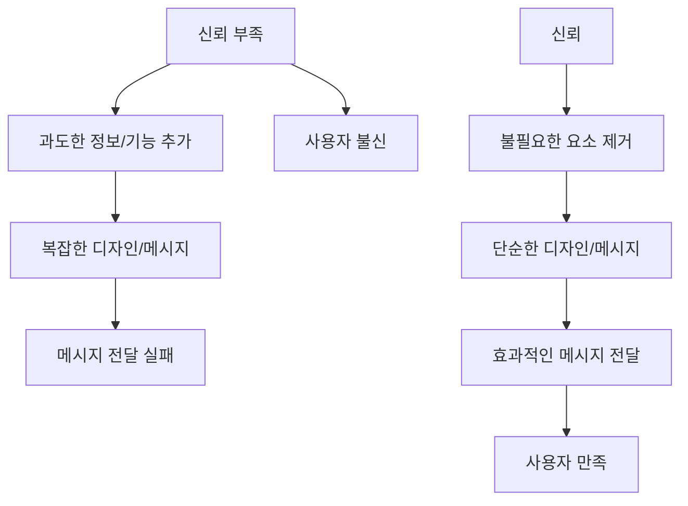
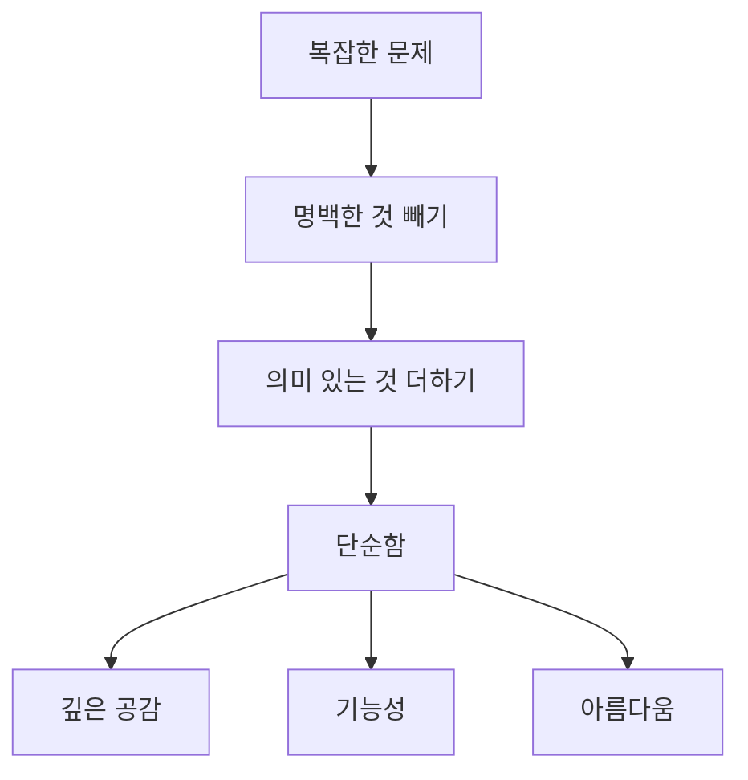

## 존 마에다의 '심플함의 법칙' 요약: 복잡한 세상을 단순하게 사는 10가지 방법
이 책은 복잡한 세상에서 디자인, 비즈니스, 그리고 삶을 더 단순하게 만드는 10가지 핵심 법칙을 알려주는 책이야. 유명한 디자이너이자 교수인 존 마에다가 쓴 이 책은 단순히 기능을 줄이는 것을 넘어, 사람들과 감정적으로 연결되고 삶을 더 풍요롭게 만드는 단순함의 힘을 강조하고 있어. 

## 1. 첫 번째 법칙: 줄이기 (Reduce) 

가장 쉬운 방법은 불필요한 것을 과감하게 줄이는 거야. 마치 너무 많은 버튼이 달린 복잡한 리모컨에서 꼭 필요한 재생 버튼만 남기는 것처럼 말이야. 

1. **생각하며 **줄이기: 무조건 없애는 게 아니라, 무엇을 남기고 무엇을 없앨지 신중하게 결정하는 게 중요해. 
  1. 너무 많은 기능을 넣으려는 경향은 사실 사용자를 믿지 못하는 마음에서 시작될 때가 많아. 마치 DVD 리모컨에 너무 많은 버튼을 넣는 것처럼 말이야. 
  2. 회의에서 불필요한 아이디어를 계속 추가하다 보면, 원래 해결하려던 문제보다 기능만 늘어나는 '기능 공장'이 될 수 있어. 
2. SHE** 원칙**: 줄이는 데 도움이 되는 세 가지 방법이 있어. 
  1. **S (**Shrink**, **줄이기**)**: 물건을 작고 가볍게 만들어서 큰 효과를 내는 거야. 마치 아이폰의 거울 같은 뒷면이 실제보다 더 얇게 보이게 하는 것처럼 말이야. 
  - 작고 가벼운 디자인은 겸손하고 작게 느껴지지만, 예상보다 더 큰 가치를 줄 때 감동을 주지. 
  - 이 원칙은 앱이나 웹사이트 같은 디지털 디자인에도 적용돼. 작은 앱이 강력한 사용자 경험을 주거나, 간단한 웹사이트가 큰 영향을 줄 수 있어. 
  2. **H (**Hide**, 숨기기)**: 복잡한 기능은 숨기고, 꼭 필요한 기능만 보이게 하는 거야. 스위스 아미 나이프처럼 필요한 도구만 꺼내 쓰는 것처럼 말이야. 
  - 예전에는 잘 안 쓰는 기능을 숨겨진 문 뒤에 두거나, 요즘 휴대폰처럼 접거나 밀어서 기능을 숨기기도 해. 
  - 구글 검색 엔진이 빙(Bing)보다 훨씬 단순한 인터페이스를 가진 것도 이 원칙 때문이야. 구글은 복잡함을 뒤로 숨겨서 사용자가 압도되지 않게 해. 
  3. **E (**Embody**, 담아내기)**: 제품에 단순함 이상의 가치와 품질을 담아내는 거야. 마치 티타늄 노트북이 플라스틱 노트북보다 더 고급스럽게 느껴지는 것처럼 말이야. 
  - 나이키 운동화가 마이클 조던의 성공과 연결되는 것처럼, 마케팅을 통해 제품의 가치를 높일 수 있어. 
  - 페라리 자동차처럼 최고급 재료와 장인 정신으로 만들어진 제품은 그 자체로 품질을 담아내지. 
  - 이건 비단 명품에만 해당되는 게 아니야. 모든 제품이 품질을 담아내면 경쟁에서 우위를 점할 수 있어. 
3. **SHEED 원칙**: SHE에 'D(Deed, 실행)'를 더한 거야. 
  1. **Shrink (줄이기)**: 불필요한 기능을 없애서 제품을 더 가볍고 효율적으로 만들어. 
  2. Hide** (숨기기)**: 잘 안 쓰는 기능은 숨겨서 사용자가 혼란스럽지 않게 해. 
  3. Embody** (담아내기)**: 단순화하면서 잃을 수 있는 가치를 고품질 재료나 마케팅으로 다시 채워 넣어. 
  4. **Deed (실행)**: 마지막으로, 본질적인 가치를 유지하면서 불필요한 모든 것을 제거하는 거야. 
  5. 이 원칙들을 통합하면 단순함, 기능성, 그리고 인지된 가치의 균형을 맞춘 제품을 만들 수 있어. 

## 2. 두 번째 법칙: 정리하기 (Organize) 

물건이 많아 보일 때, 잘 정리하면 훨씬 적어 보여. 마치 옷장 속 수많은 옷을 종류별로 정리하면 훨씬 관리하기 쉬워지는 것처럼 말이야. 

1. **정리의 중요성**: 복잡함을 관리하는 데 정리는 필수적이야. 
  1. 단순히 더 큰 집을 사거나 창고에 넣어두는 건 임시방편일 뿐, 결국 더 많은 물건을 쌓이게 할 수 있어. 
  2. 핵심은 '무엇을 숨길까?'와 '어디에 둘까?'를 묻는 거야. 
  3. 정리는 물건뿐만 아니라 개념, 기능, 심지어 눌러야 할 버튼의 수도 줄여줘. 
2. SLIP** 원칙**: 효과적인 정리를 위한 네 가지 단계가 있어. 
  1. **S (Sort, 분류하기)**: 모든 항목을 포스트잇에 적고, 비슷한 것끼리 자연스럽게 묶어봐. 
  2. **L (Label, 이름 붙이기)**: 각 그룹에 적절한 이름을 붙여줘. 
  3. **I (Integrate, 통합하기)**: 비슷한 그룹은 가능한 한 합쳐. 
  4. **P (Prioritize, 우선순위 정하기)**: 가장 중요한 항목들을 한데 모아서 집중해. 
  - 파레토 법칙(80/20 법칙)을 참고해서, 80%의 데이터는 낮은 우선순위로, 20%는 높은 우선순위로 관리하는 게 좋아. 
  - 이 원칙은 옷장 정리, 할 일 관리, 이메일 정리 등 다양한 곳에 적용할 수 있어. 
  5. 단순함은 모든 것을 없애는 게 아니라, 무엇이 필수적인지 파악하고 거기에 집중하는 거야. 
3. Squint** (눈을 가늘게 뜨기)**: 전체를 보기 위해 눈을 가늘게 뜨는 것처럼, 다른 관점으로 바라보면 복잡함 속에서 단순함을 찾을 수 있어. 
  1. 그룹을 만드는 건 중요하지만, 너무 많은 그룹은 오히려 혼란을 줄 수 있어. 
  2. 흐릿하게 묶는 것이 더 단순해 보일 수 있지만, 너무 추상적이 될 위험도 있어. 
  3. 눈을 가늘게 뜨는 기술은 그룹과 흐릿함 사이의 균형을 찾는 데 도움을 줘. 
  4. 이 기술은 디자인과 창의성에 의해 움직이는 세상에서 더 많이 보고 더 적게 보는 방법이야. 

## 3. 세 번째 법칙: 시간 (Time) 

시간을 잘 관리하면 단순함을 느낄 수 있어. 마치 다운로드 바가 남은 시간을 보여줘서 기다림을 덜 지루하게 만드는 것처럼 말이야. 

1. 시간에 대한 인식** 관리**: 시간을 줄일 수 없다면, 적어도 사람들이 시간을 어떻게 느끼는지 관리할 수 있어. 
  1. 회의에서 불필요한 말을 너무 많이 하면 상대방의 시간을 존중하지 않는 것이고, 이는 메시지 전달에도 방해가 돼. 
  2. 대기실에서 편안한 환경을 제공하면 사람들이 기다리는 시간을 덜 길게 느껴. 
  3. 넷플릭스 로딩 화면이나 스마트폰 업데이트 화면처럼, 진행 상황을 명확히 보여주면 사용자는 시간을 낭비한다고 느끼지 않아. 

## 4. 네 번째 법칙: 배우기 (Learn) 

무언가를 더 많이 배울수록, 그것을 더 단순하게 만들 수 있는 방법을 알게 돼. 마치 프로젝트 관리자가 복잡한 기술을 많이 배울수록, 외부에는 더 단순하게 보이게 할 수 있는 것처럼 말이야. 

1. **학습의 중요성**: 단순화를 위해서는 기초를 배우고 반복하는 것이 중요해. 
  1. 프로젝트 관리나 팀 리딩처럼 복잡한 분야에서도, 기술과 프레임워크를 깊이 이해하면 외부에는 더 단순하게 보일 수 있어. 
2. BRAIN** 원칙**: 효과적인 학습을 위한 다섯 가지 단계가 있어. 
  1. **B (Basics first, 기초부터)**: 어떤 것이든 가장 기본적인 것부터 배워야 해. 
  2. **R (Repeat, 반복하기)**: 자동적으로 될 때까지 계속 반복해야 해. 
  3. **A (Avoid despair, 절망 피하기)**: 너무 압도되지 않도록 단계별로 배워야 해. 
  4. **I (Inspire, 영감 얻기)**: 배우는 것을 더 큰 그림과 연결해서 실생활에 적용해봐. 
  5. **N (Never forget to repeat, 반복을 잊지 마라)**: 다시 한번, 반복은 매우 중요해. 
  6. AI 같은 새로운 기술을 배울 때도, 기초를 먼저 이해해야 더 잘 활용할 수 있어. 

## 5. 다섯 번째 법칙: 차이 (Differences) 

단순함과 복잡함은 서로를 필요로 해. 마치 밋밋한 올리브색 배경에 핑크색 한 방울이 들어가면 핑크색이 더 선명하고 생생하게 보이는 것처럼 말이야. 

1. **균형의 중요성**: 디자인에서 차이와 대비는 독특한 측면을 이해하고 감상하는 데 도움을 줘. 
  1. 아이팟은 복잡한 경쟁 제품들 사이에서 단순함으로 돋보였어. 깔끔한 디자인과 직관적인 사용자 인터페이스는 사용하기 쉬우면서도 다양한 기능을 제공했지. 
  2. 제품이나 서비스를 디자인할 때는 단순함과 복잡함이 어떻게 함께 작동할 수 있는지 고려해야 해. 
  3. 복잡함을 의식적으로 통합하여 전체적인 단순함을 향상시키면, 독특하고 매력적인 사용자 경험을 제공하는 뛰어난 제품을 만들 수 있어. 
2. **보고서 예시**: 모든 것이 똑같은 시각과 정보, 무게를 가진 보고서는 시선을 끌지 못해. 
  1. 하지만 단순한 요소들이 시선을 끌고, 필요할 때 더 복잡한 정보가 보완적으로 제공되면, 단순함이 돋보이면서도 필요한 정보를 놓치지 않을 수 있어. 

## 6. 여섯 번째 법칙: 맥락 (Context) 

단순함의 주변에 있는 것들이 결코 주변적인 것이 아니야. 마치 미술관에서 작품 주변의 빈 공간이 작품에 집중하게 만드는 것처럼 말이야. 

1. **주변 환경의 중요성**: 우리가 목표를 달성하기 위해 전경(가장 중요한 것)에만 집중하다 보면, 주변의 중요한 것들을 놓칠 수 있어. 
  1. 때로는 당장 중요해 보이는 것이 주변의 다른 모든 것에 비해 덜 중요할 수도 있어. 
  2. 우리는 모든 세부 사항, 심지어 사소해 보이는 것까지 주의를 기울이는 '깨달은 얕음'을 추구해야 해. 
  3. 주변 환경은 단순함에 대한 우리의 인식에 영향을 미쳐. 방의 분위기가 음식 맛에 영향을 미치고, 책상 위의 잡동사니가 작업 경험을 망칠 수 있는 것처럼 말이야. 
  4. 주변 환경에 주의를 기울이면 당면한 문제를 더 잘 관리할 수 있어. 
  5. 단순함을 위한 주변 경험을 종합하려면, 중요하지 않아 보이는 모든 것에 주의를 기울여야 해. 
  6. 단순함은 보이는 것뿐만 아니라 주변에 숨겨진 것까지 포함한다는 것을 이해해야 해. 
  7. 주변 요소를 포용함으로써 단순함을 향상시키고 전반적인 경험을 개선하는 환경을 만들 수 있어. 
  8. 디자인에서는 사용자 경험의 모든 측면, 즉 맥락까지 고려하여 주요 초점과 주변 요소 사이의 조화로운 균형을 이루어야 해. 
2. **빈 공간의 가치**: '적을수록 많다'는 개념과 함께, 빈 공간과 여백의 가치를 인식하는 것도 중요해. 
  1. 엔트로피(무질서해지는 경향)처럼, 디자인에서 단순함을 의도적으로 유지하지 않으면 혼란이 쉽게 스며들 수 있어. 
  2. 빈 공간은 우리가 본질적인 것에 집중할 기회를 만들어줘. 
  3. 디자이너는 빈 공간과 여백을 사용하여 대비와 균형을 만들 수 있어. 
  4. 빈 공간을 전략적으로 사용하면 디자인의 중요한 요소에 시선을 집중시키고 더 큰 영향을 줄 수 있어. 
3. **빈 공간을 채우려는 충동**: 비즈니스 전문가나 엔지니어는 빈 공간을 채우려는 물리적인 충동을 느낄 때가 많아. 
  1. 하지만 미술관의 예술가처럼, 모든 것을 비워두고 단 하나의 작품에만 시선을 집중시키는 것이 더 효과적일 수 있어. 
  2. 파워포인트 슬라이드에 애니메이션, 텍스트, 그래픽을 가득 채우기보다, 단순하게 만들면 사람들이 메시지에 더 집중하게 돼. 

## 7. 일곱 번째 법칙: 감정 (Emotion) 

더 많은 감정이 더 적은 감정보다 좋아. 디자인은 단순히 기능적이고 실용적인 것을 넘어, 사람들의 감정적인 반응을 이끌어내야 해. 

1. **감정적 연결의 중요성**: 디자이너는 문제를 해결하는 도구에 디자인을 한정하지 않고, 사람들과 감정적으로 연결되어야 해. 
  1. 장식이나 의미의 층을 추가하여 디자인에 더 많은 감정을 더할 수 있어. 
  2. 이 접근 방식은 형태보다 느낌을 중요하게 여기고, 디자이너가 작업의 감정적 영향을 고려하도록 장려해. 
2. **예절과 이모지**: 의사소통에서 예절처럼 감정적인 반응은 기능만큼 중요해. 우리가 말하고, 쓰고, 행동하는 방식은 디자인의 더 큰 감정적 맥락의 일부로 고려되어야 해. 
  1. 이모지와 스마일리는 우리가 의사소통에서 감정을 더 잘 표현하기 위해 디자인을 사용하는 또 다른 예시야. 
  2. 이러한 기호들은 우리가 말할 때는 당연하게 여기지만 글로 전달하기 어려운 의사소통의 뉘앙스를 포착하도록 발전했어. 
3. **제품과의 감정적 연결**: 제품과의 감정적 연결은 브랜드 충성도와 만족도를 높일 수 있어. 
  1. 애플의 세련된 디자인과 직관적인 사용자 경험은 사용자에게 자부심과 즐거움을 심어줘. 
  2. 디자인은 단순함과 실용성 이상을 포함하며, 감정적인 연결도 필요해. 
  3. 디자인에 감정을 통합하면 더 공감하고 매력적으로 만들 수 있으며, 다른 제품과 차별화할 수 있어. 
  4. 이러한 접근 방식은 문제를 해결할 뿐만 아니라 긍정적인 반응을 불러일으키는 솔루션을 만들어 더 성공적인 제품과 서비스를 만들고 사용자들과 더 강한 연결을 형성할 수 있어. 
4. **타마고치 예시**: 타마고치처럼 단순한 디지털 장난감에도 사람들은 강한 감정적 애착을 느꼈어. 
  1. 인간의 감정이 연결되지 않은 단순함은 의미가 없어. 
  2. 프레젠테이션에서 메시지와 감정이 연결되지 않으면, 아무리 단순하게 만들어도 효과가 없어. 
  3. 메시지를 전달하는 방식 자체가 메시지의 매우 중요한 부분이야. 

## 8. 여덟 번째 법칙: 신뢰 (Trust) 

단순함은 오직 신뢰가 있을 때만 작동해. 사람들이 상대방을 믿지 못하면, 메시지를 과도하게 복잡하게 만들게 돼. 

1. **신뢰와 단순함의 관계**: 존 마에다는 단순함이 오직 신뢰와 함께 작동한다고 말해. 
  1. 많은 버튼이 달린 스마트폰이나 정보로 가득 찬 슬라이드는 사람들이 메시지를 이해할 능력이 없다고 생각하기 때문에 생기는 문제야. 
2. **개인적인 경험**: 발표자가 예산을 다루는 중요한 프로젝트 발표를 준비할 때, 15~20장의 슬라이드를 만들었어. 
  1. 이 슬라이드들은 맥락과 정보, 비용 이력으로 가득 차 있었는데, 발표자는 사람들이 자신의 발표 없이는 문제를 이해하지 못할 것이라고 생각했기 때문이야. 
  2. 하지만 책을 읽고 나서, 발표자는 자신이 스스로를 보호하려 했고, 사람들이 문제와 결정 사항을 이해할 것이라는 신뢰가 없었다는 것을 깨달았어. 
  3. 결국 슬라이드를 4~5장으로 줄였고, 이는 매우 효과적인 회의로 이어졌어. 
  4. 상대방을 신뢰하지 않으면 단순화할 수 없다는 것을 깨달은 중요한 경험이었지. 

## 9. 아홉 번째 법칙: 실패 (Failure) 

모든 것을 단순화할 수는 없어. 어떤 영역은 의도적으로 복잡함을 유지해야 해. 

1. **단순화해서는 안 되는 영역**: 개인적인 관계, 예를 들어 자녀와의 관계는 단순화해서는 안 되는 영역이야. 
  1. 이런 관계에서는 상대방을 이해하고 깊은 연결을 만들기 위해 필요한 복잡함을 기꺼이 받아들여야 해. 
  2. 어떤 영역에서는 단순화가 오히려 문제를 일으킬 수 있어. 
  3. 그러니 삶의 어떤 영역에는 적절한 복잡함을 부여하는 것을 두려워하지 마. 

## 10. 열 번째 법칙: 의미 (Meaning) 

단순함은 명백한 것을 빼고 의미 있는 것을 더하는 거야. 

1. **단순함의 본질**: 단순함은 단순히 시각적인 매력을 넘어, 정말 중요한 것의 핵심을 파악하고 나머지는 모두 제거하는 과정이야. 
  1. 이러한 '빼기' 과정은 당면한 문제에 대한 깊은 이해와 필수적인 것과 그렇지 않은 것을 구별하는 능력을 필요로 해. 
  2. 우리는 종종 세부 사항에 얽매여 큰 그림을 놓치고, 더 많은 기능만 추가하려 할 때가 많아. 
  3. 단순화함으로써 사람들에게 더 깊은 수준에서 공감하는 명확하고 강력한 메시지를 만들 수 있어. 
  4. 불필요한 것을 제거하고 본질적인 것이 빛나도록 하는 과정이야. 
  5. 이 과정은 우리의 선입견을 버리고 다르게 생각하도록 도전하게 해. 
  6. 단순함은 기본적인 것에서 아름다움을 찾고, 기능적이면서도 우아한 것을 만드는 거야. 
  7. 정말 중요한 것이 무엇인지 이해하고, 주변의 소음에 방해받지 않고 거기에 집중하는 것이지. 
2. **단순함의 정의**: 단순함은 덜 하는 것이 아니라, 올바른 일을 하는 거야. 
  1. 불필요한 것을 제거하고, 때로는 예상되는 것까지 제거하되, 진정으로 중요한 것으로 대체하는 것이지. 
  2. 스마트폰에 카메라를 더 빨리 여는 버튼을 추가하는 것이 가치를 더하고 경험을 개선한다면 좋은 거야. 그건 복잡함이 아니라 인지된 가치야. 
  3. 하지만 사용을 복잡하게 만드는 수많은 버튼은 나쁜 디자인일 뿐이야. 
3. **일상생활에 적용**: 프레젠테이션이나 보고서를 만들 때, 어디서 과도하게 복잡하게 만들고 있는지, 메시지에 불필요한 단어를 너무 많이 넣고 있는지 항상 생각해야 해. 
  1. 글쓰기처럼 반복을 통해 단순화하는 방법을 배우고, 독자의 경험을 더 좋게 만들 수 있어. 
  2. 새로운 형식의 콘텐츠를 만들 때는 처음에는 많은 것을 시도하고 추가하지만, 점차 어디서 줄이고 단순화할 수 있는지 배우게 돼. 
4. **삶의 영역별 단순화**: 존 마에다는 삶의 어떤 영역은 단순화해서는 안 된다고 강조해. 
  1. 관계나 가족과의 연결은 너무 단순화하지 말고, 모든 감정과 연결을 담아내야 해. 
  2. 하지만 콘텐츠 소비, 학습, 업무, 프레젠테이션 등 다른 영역에서는 단순화할 기회를 찾아야 해. 
5. **스스로에게 질문하기**: 당신의 직업에서 무엇을 빼거나 줄여서 가치를 높일 수 있을까? 
  1. 회의 방식, 이메일 보고, 스프레드시트 등에서 불필요한 마찰을 줄이고 메시지에 집중할 수 있는 부분을 찾아봐. 
  2. 단순화할수록 다른 방식으로 무언가를 할 기회를 더 많이 보게 될 거야. 
  3. 메시지가 핵심이 되고, 감정이 메시지와 연결되며, 가장 단순하면서도 효과적인 방식으로 전달될 수 있도록 해야 해. 

## 결론: 단순함의 힘 
단순함은 접근하기 쉽고, 효율적이며, 효과적인 경험을 만들면서도 우아함과 아름다움을 유지하는 거야. 

1. 10가지 법칙** 요약**:
  1. 줄이기: 복잡함을 줄이고 본질적인 것에 집중해. 
  2. **정리하기**: 너무 많은 그룹은 역효과를 낼 수 있어. 
  3. **시간**: 맥락에서 배우고 중요한 것을 우선시해. 
  4. 학습: 제약이 창의성을 발휘하게 해. 
  5. 차이: 단순함과 복잡함은 서로를 필요로 해. 
  6. 맥락: 단순함의 주변에 있는 것이 결코 주변적인 것이 아니야. 
  7. 감정: 감정은 디자인에서 중요한 역할을 해. 
  8. 신뢰: 기술이 삶을 향상시킬 때만 받아들여야 해. 
  9. 실패: 미래를 디자인하려면 과거를 이해해야 해. 
  10. **의미**: 단순함은 명백한 것을 빼고 의미 있는 것을 더하는 거야. 
2. **지속적인 여정**: 단순함은 끊임없는 학습, 실험, 개선이 필요한 지속적인 여정이야. 
3. **단순함의 이점**: 단순함의 법칙을 적용하면 집중력, 생산성, 행복이 증가하는 이점을 얻을 수 있어. 
4. **덜어내는 힘**: 삶을 단순화하고 '덜어내는 것'의 힘을 받아들이자. 

