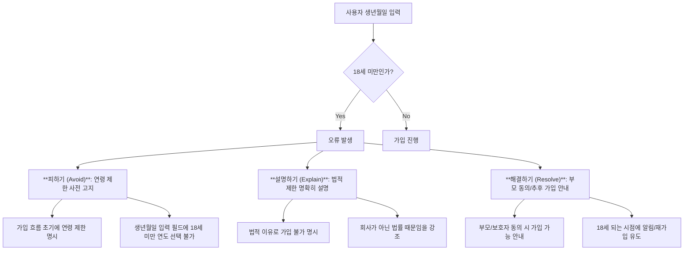

## 1. '글쓰기는 디자인이다' 책 소개: 디지털 경험을 만드는 글의 힘 
이 책은 디지털 제품이나 소프트웨어에서 글쓰기 과정이 디자인 과정의 중요한 부분이어야 한다고 말한다. 마치 건물을 지을 때 설계도와 재료가 중요하듯이, 디지털 경험을 만들 때도 글이 핵심 재료라는 것이다. 이 책은 디지털 경험에서 책임감 있는 글을 쓰는 도구와 함께, UX 라이터나 글쓰기 팀의 필요성을 설득할 수 있는 논리를 제공한다.

### 1.1. 저자 소개 및 책의 탄생 배경 

1. **저자들의 배경**:
  - **마이클 메츠 (Michael Metts)**: 시카고 외곽에 거주하며, 올스테이트(Allstate)의 시니어 UX 아키텍트(사용자 경험 설계자)로 대화 디자인(챗봇 등)에 집중한다. 대학에서 시각 스토리텔링(사진 저널리즘)을 전공했지만, 졸업 당시 관련 일자리가 부족했다. 비영리 단체에서 웹사이트 콘텐츠 제작을 돕다가, 단순히 콘텐츠를 많이 만드는 것보다 기존 콘텐츠를 더 효과적으로 만드는 것이 중요하다는 것을 깨달았다. 이후 UX(사용자 경험)와 콘텐츠 전략 책을 읽으며 독학했고, 스스로 'UX 팀의 일원'이 되어 UX에 집중하게 되었다. 그는 자신을 주로 언어와 글을 사용하는 UX 전문가라고 생각한다. 
  - **앤디 웰플 (Andy Welfle)**: 샌프란시스코에 거주하며, 어도비(Adobe)의 UX 콘텐츠 전략 매니저이다. 그 역시 저널리즘을 전공했고 기자 지망생이었으나, 졸업 후 일자리가 없었다. 작은 예술 비영리 단체에서 마케팅을 담당하며 소셜 미디어 마케팅에 흥미를 느꼈다. 이후 에이전시에서 소셜 미디어 전략가로 일하며 마케팅보다 전략과 커뮤니케이션에 더 관심을 갖게 되었다. 페이스북에서 콘텐츠 전략가로 일했고, 현재는 어도비에서 UX 콘텐츠 전략가 및 UX 라이터 팀을 이끌고 있다. 

2. **책의 탄생 과정**:
  - **첫 만남**: 앤디와 마이클은 미드웨스트 UX 컨퍼런스에서 마이클이 진행하는 워크숍에서 처음 만났다. 당시 앤디는 페이스북 면접을 보기 위해 샌프란시스코로 떠나기 전이었다. 
  - **공통 관심사**: 둘은 제품 분야의 글쓰기와 콘텐츠 전략에 대한 공통된 관심을 확인하고, 컨퍼런스나 웹에서 계속 교류했다. 특히 소프트웨어에 적용되는 콘텐츠 전략이 웹사이트와 어떻게 다른지에 대해 논의했다. 
  - **워크숍 개발**: 이들은 함께 워크숍을 개발하여 Confab 같은 컨퍼런스에서 여러 번 가르쳤다. 
  - **책 집필**: 이 책은 워크숍 활동을 통해 자연스럽게 탄생했다. 보통 책이 워크숍으로 이어지는 것과 달리, 이들은 워크숍을 먼저 하고 책을 썼다. 
  - **집필 과정의 메타적 도전**: '글쓰기는 디자인이다'라는 책을 쓰면서, 두 명의 저자가 각기 다른 목소리로 하나의 일관된 목소리를 만들어야 하는 메타적인(자기 참조적인) 도전에 직면했다. 이들은 책에 소개된 '목소리 정렬(voice alignment)' 연습을 직접 활용하여, 독자들이 누가 어떤 챕터를 썼는지 알 수 없도록 노력했다. 

### 1.2. UX 디자인에서 글쓰기의 중요성: 간과되어 온 핵심 요소 

1. UX** 분야의 '진자 운동'**:
  - 사용자 경험(UX) 분야에서는 콘텐츠, 카피, 단어의 중요성이 주기적으로 강조되었다가 잊히는 '진자 운동'을 겪어왔다. 
  - 과거에는 온라인 도움말 시스템(online help systems)을 설계하고 작성하는 컨설턴트들이 많았고, 오류 메시지나 지침 작성에 많은 관심이 있었다. 
  - 하지만 이후 한동안 글쓰기의 중요성이 간과되다가, 웹사이트 시대가 오면서 제품이나 서비스를 설명하는 마케팅 카피에 대한 관심이 다시 높아졌다. 
  - 그러나 이마저도 UX와 분리되어, 많은 UX 디자이너들이 글쓰기를 자신들의 영역이 아니라고 생각하고 다른 사람에게 의존하는 경향이 있었다. 

2. **글쓰기가 디자인인 이유**:
  - **앱의 예시**: 음식 배달 앱(DoorDash)에서 모든 글자를 제거하면 앱은 즉시 사용할 수 없게 된다. 그림이나 아이콘만으로는 무엇을 해야 할지 알 수 없기 때문이다. 이는 글이 없으면 디지털 경험이 무용지물이 된다는 것을 보여준다. 
  - **상호 불가분의 관계**: 디자인 없는 글은 그저 챗봇에 불과하고, 글 없는 디자인은 모양과 색깔의 혼란스러운 덩어리일 뿐이다. 글과 디자인은 서로 뗄 수 없는 관계이다. 
  - **문제 해결 도구로서의 언어**: 니콜 펜튼(Nicole Fenton)은 "나는 소설이나 단편 소설을 쓰지 않는다. 나는 언어를 사용하여 문제를 해결한다. 그것이 비하인드 스토리든 제품 자체든, 나는 단어를 재료로 사용한다"고 말했다. 이는 글쓰기가 단순히 정보를 전달하는 것을 넘어, 사용자 문제를 해결하는 디자인 재료임을 강조한다. 
  - **디자이너의 질문**: 디자이너가 "이 버튼에 뭐라고 써야 할까요?"라고 물을 때, UX 라이터는 단순히 단어를 고르는 것을 넘어, 버튼의 진입점과 종료점, 다음 동작, 메시징 구성 요소(확인 대화 상자, 토스트 메시지 등), 역방향 동작, 번역 가능성, 전체 전략과의 적합성 등 디자인적 질문을 던져야 한다. 
  - **UX의 계층 구조와 **콘텐츠 디자인: 제시 제임스 개럿(Jesse James Garrett)의 '사용자 경험 요소(The Elements of User Experience)'에서 제시된 UX의 추상적인 계층 구조(전략, 범위, 시스템, 표면)는 시각 디자인뿐만 아니라 콘텐츠 디자인에도 동일하게 적용된다. 
  - **전략 (**Strategy**)**: 제품을 만드는 이유. 시각 디자인의 '디자인 전략'과 함께, 콘텐츠 디자인에서는 '콘텐츠 전략'(제품 전반의 콘텐츠 관리, 계획, 생성)이 필요하다. 
  - **범위 (Scope)**: 무엇을 만들 것인가. 시각 디자인과 콘텐츠 디자인 모두 타임라인, 결과물, 로드맵 등을 공유한다. 
  - **시스템 (**System**)**: 시스템의 동작 방식과 사용자 상호작용. 시각 디자인은 '디자인 시스템'(컴포넌트, 패턴)을, 콘텐츠 디자인은 '콘텐츠 디자인 시스템'(스타일 가이드, 문법, 콘텐츠 패턴, 용어)을 다룬다. 
  - **표면 (Surface)**: 제품의 모습, 느낌, 소리. 시각 디자인은 '화면'(목업, 프로토타입)을, 콘텐츠 디자인은 'UX 라이팅'(버튼, 대화 상자, 오류 메시지 등의 마이크로카피)을 담당한다. 
  - **시각 도구의 한계**: 피그마(Figma), 어도비 XD(Adobe XD) 같은 시각 디자인 도구는 글자를 넣을 수 있지만, 텍스트 편집 기능이 부족하다. 구글 홈(Google Home) 같은 음성 인터페이스의 경우, 시각 디자인 도구보다 텍스트 편집기가 훨씬 효과적인 디자인 도구가 된다. 
  - **결과물과 영향력**: 중요한 것은 '결과물을 만드는 것'이 아니라 '변화를 만드는 것'이다. 글쓰기를 통해 사람들의 삶을 더 좋게 만들고, 시간을 효율적으로 사용하게 하며, 사용자에게 힘을 실어주는 것이 중요하다. 

### 1.3. 좋은 UX 라이팅의 세 가지 원칙: 유용하고, 사용 가능하며, 책임감 있는 글 

좋은 UX 라이팅은 세 가지 원칙을 따른다. 마치 요리사가 맛있는 음식을 만들 때 재료의 신선함, 조리법의 정확성, 위생을 신경 쓰는 것과 같다.

1. **사용 가능한 (**Usable**) 글**:
  - **사용자가 행동하게 돕는 글**: 사용자가 무언가를 할 수 있도록 돕는 글이다. 단순히 정보를 제공하는 것을 넘어, 사용자가 직접 행동할 수 있도록 유도해야 한다. 
  - **어도비 크리에이티브 클라우드 앱 사례**:
  - 기존 문구: "찾는 것을 찾지 못했나요? 프로필 사진 옆 검색 아이콘을 탭하세요." (Not finding what you're looking for? Tap on the search icon next to your profile picture.) 
  - 문제점: 정보는 유용하지만, 사용자가 직접 검색 아이콘을 찾아 탭해야 하는 번거로움이 있었다. 
  - 개선 문구: "검색을 사용하여 더 많은 튜토리얼을 찾아보세요." (Use search to find more tutorials.) 
  - 개선점: '검색'이라는 단어를 클릭 가능하게(탭 가능하게) 만들어 사용자가 바로 검색 경험으로 이동할 수 있도록 했다. 이는 문구를 절반 이상 줄이면서도 사용성을 크게 높였다. 
  - 결과: 디자이너와 제품 관리자들은 이 변화를 '마법'이라고 생각했다. 
  - 접근성**(**Accessibility**)의 중요성**: 사라 리처즈(Sarah Richards)는 "만약 당신이 쓴 글이 모든 사람에게 접근 가능하지 않다면, 당신은 사람들이 그 기능을 사용하지 못하게 하는 디자인 선택을 한 것이다"라고 말한다. 접근성을 높이는 것은 '수준을 낮추는 것'이 아니라 '기회를 여는 것'이다. 
  - **고객 서비스 연구 결과**: 멜라니 파쿨스키(Melanie Pilkowski) 박사의 고객 서비스 연구에 따르면, 76가지 요인 중 가장 중요한 4가지 사용성 요소는 UX 라이팅과 관련이 있었다. 
  - 시스템의 친근함과 예의 바름 (friendliness, politeness)
  - 말하는 속도 (speaking pace)
  - 익숙한 용어 사용 (use of familiar terms)
  - 이 모든 것은 UX 라이터가 직접 통제할 수 있는 부분이다. 
  - **인간적인 소통**: 파쿨스키 박사는 "인간의 소통은 우리가 가진 가장 중요한 선물이며, 기술이 인간적인 의미를 점점 더 많이 대체하는 시대에 인간을 위해 싸울 가치가 있다"고 강조한다. 

2. **유용한 (Useful) 글**:
  - **제품의 목적과 사용자 니즈 이해**: 유용한 경험을 만들기 위해서는 제품의 목적과 사용자의 니즈를 깊이 이해해야 한다. 
  - **그랜드 멜리아 호텔 로열티 프로그램 사례**:
  - 문제점: 로열티 프로그램 가입 시, "특별 혜택 및 프로모션 정보 수신 동의"와 "광고 수신 거부"라는 두 가지 상반된 체크박스가 동시에 존재하여 사용자에게 혼란을 준다. 
  - 원인: GDPR(개인정보보호 규정) 준수를 위해 급하게 '광고 수신 거부' 옵션을 추가하면서 전체적인 사용자 경험을 고려하지 않았기 때문이다. 
  - 교훈: 글쓰기 담당자가 프로젝트 초기에 참여했다면 이러한 혼란을 피할 수 있었을 것이다. 
  - **핀터레스트(Pinterest) 서비스 약관 사례**:
  - 개선점: 법률 용어로 가득한 서비스 약관 아래에 '간단히 말해서(More Simply Put)'라는 요약 섹션을 두어, 사용자가 내용을 쉽게 이해할 수 있도록 돕는다. 
  - 한계: 법적 제약 때문에 약관 자체를 쉬운 언어로 바꾸기는 어렵지만, 이러한 요약은 좋은 대안이 된다. 
  - **초기 참여의 중요성**: 디자이너이자 작가인 케이티 라우어(Katie Lauer)는 "문제를 해결하기 위한 전체 맥락이 항상 필요하며, 프로젝트 초기에 참여하여 질문할 수 있는 환경이 가장 좋다"고 말한다. 프로젝트 막바지에 투입되어 질문에 대한 허용치가 낮다면, 작가의 역할이 제대로 이해되지 못했거나 잘 자리 잡지 못했다는 신호이다. 

3. **책임감 있는 (**Responsible**) 글**:
  - **사용자에 대한 의무**: 우리는 사용자에게 책임감을 가져야 한다. 
  - **링크드인(LinkedIn) 메시지 사례**:
  - 상황: 친구가 해고되었다는 소식을 듣고 위로 메시지를 보냈는데, 링크드인에서 '축하합니다(Congratulations)'라는 자동 응답 옵션을 제공했다. 
  - 문제점: '축하합니다'를 실수로 탭하면 친구와의 관계에 심각한 피해를 줄 수 있다. 이는 기계 학습(machine learning)이 부적절한 상황에 부적절한 메시지를 제안하여 쉽게 실수를 유발할 수 있음을 보여준다. 
  - 교훈: '스트레스 사례(stress cases)'를 고려해야 한다. '엣지 케이스(edge case)'는 소수의 사용자만 겪는 예외적인 상황으로 간주되어 무시될 수 있지만, '스트레스 사례'는 소수일지라도 사용자에게 큰 고통을 줄 수 있는 중요한 상황이므로 반드시 디자인에 반영해야 한다. 
  - **핏빗(Fitbit) 성별 입력 사례**:
  - 상황: 핏빗 프로필에서 성별을 '남성' 또는 '여성'으로 선택하게 한다. 
  - 문제점: 트랜스젠더 여성인 에이다 파워스(Ada Powers)의 경우, 핏빗의 목적(인구 통계 정보 vs. 생물학적 정보)에 따라 '여성' 또는 '남성' 중 무엇을 선택해야 할지 혼란스러워한다. 핏빗이 키와 몸무게도 묻기 때문에 생물학적 정보일 가능성도 있어 더욱 복잡해진다. 
  - 더 복잡한 문제: '여성'을 선택하면 생리 주기 추적 기능이 활성화될 수 있지만, 자궁이 없거나 기능하지 않는 여성에게는 부적절할 수 있다. 또한, 칼로리 소모 모델을 위한 호르몬 수치를 가정할 수 있는데, 다낭성 난소 증후군(PCOS)으로 테스토스테론 수치가 높은 여성에게는 정확하지 않을 수 있다. 
  - 해결책: 에이다는 "포괄성을 생각한다면, 어떤 질문은 쉬운 답이 없다는 것을 이해할 것이다. 무엇을 왜 알고 싶은지 설명함으로써, 소외된 사람뿐만 아니라 쉽게 분류되지 않는 모든 사람에게 도움이 되고, 더 나은 품질의 정보를 얻을 수 있다"고 말한다. 
  - 원 메디컬(One Medical) 사례: 이 의료 시스템은 성별 정보를 요청할 때, 법적 및 보험상의 이유를 명확히 설명하고, 사용자가 자신의 성별에 대한 추가 정보를 입력할 수 있는 공간을 제공하여 이러한 문제를 해결한다. 
  - **인터페이스의 말의 영향력**: 디자이너 나탈리 이(Natalie Yee)는 "말은 사람들에게 상처를 주거나 개인적인 삶에 도움을 줄 수 있다. 위로의 말은 큰 영향을 미치고, 상처 주는 말은 몇 년간 영향을 미친다. 하지만 우리는 인터페이스에 쓰는 말을 그렇게 중요하게 다루지 않는다"고 지적한다. 
  - **뉴스 피드(**News Feed**) 개념의 책임감**:
  - 호르헤 아랑고(Jorge Arango)는 "뉴스는 우리 사회의 피드백 메커니즘이다. 우리는 뉴스에서 배운 것을 바탕으로 투표한다"고 말한다. 
  - 문제점: 이러한 '뉴스' 개념을 상업적 용도로 전용(subvert)하여 광고를 제공하는 것은 신중하게 고려해야 할 문제이다. 페이스북의 뉴스 피드처럼, 워싱턴 포스트(Washington Post) 같은 신뢰할 수 있는 언론사의 기사와 어제 만들어진 웹사이트의 콘텐츠가 나란히 표시될 때, 사람들은 둘 다 '뉴스'로 인식하여 잘못된 정보를 받아들일 수 있다. 
  - 교훈: UX 라이터, 콘텐츠 디자이너, 콘텐츠 전략가는 디지털 제품의 글에 영향을 미치므로, 그 책임감을 가볍게 여겨서는 안 된다. 

## 2. 오류 메시지: 문제 해결의 기회 

오류는 단순히 시스템의 실패가 아니라, 사용자가 목표를 달성하도록 돕는 기회이다. 마치 넘어진 아이에게 "왜 넘어졌니?"라고 꾸짖는 대신, "괜찮니? 어떻게 하면 다시 일어설 수 있을까?"라고 묻는 것과 같다.

### 2.1. 오류에 대한 새로운 관점: '스트레스 사례'와 '사용자 돕기' 
1. **오류는 메시지가 아니다**:
  - 오류(error)는 소프트웨어에서 해결해야 할 '상태'이며, 오류 메시지(error message)는 그 상태를 해결하는 '방법' 중 하나일 뿐이다. 
  - **생년월일 입력 오류 사례**:
  - 상황: 보안팀의 오래된 원칙 때문에 100세 이상 사용자는 계정을 만들 수 없었다. 오류 메시지는 "생년월일을 확인하고 다시 시도하세요"였다. 
  - 문제점: 100세 이상 사용자가 정확한 생년월일을 입력해도 계속 오류가 발생하여 계정을 만들 수 없는 무한 루프에 빠진다. 이는 사용자가 시스템을 '잘못 사용'하는 것이 아니라, 시스템이 사용자의 니즈를 충족시키지 못하는 상황이다. 
  - 교훈: UX 라이터는 단순히 메시지를 작성하는 것을 넘어, '왜 이런 오류가 발생하는지' 질문하고, 보안팀과 논의하여 정책 자체를 재검토해야 한다. 
  - **사용자의 실제 목표**: 사용자는 소프트웨어를 사용하는 것이 목표가 아니라, 아픈 아이를 위한 약 찾기, 결혼 허가증 신청, 시험 점수 확인, 자동차 수리 예약 등 다른 목표를 달성하려 한다. 소프트웨어는 그 목표를 달성하기 위한 수단일 뿐이다. 
  - **오류의 정의**: 오류는 '사용자의 니즈'와 '시스템의 니즈'가 충돌하는 순간이다. 사용자가 시스템을 '잘못 사용'하는 것이 아니라, 시스템이 사용자의 목표 달성을 방해하는 것이다. 

2. **'스트레스 사례(**Stress Cases**)'에 집중**:
  - **엣지 케이스(**Edge Case**) vs. 스트레스 사례(**Stress Case**)**:
  - '엣지 케이스'는 소수의 사용자만 겪는 예외적인 상황으로, 팀이 신경 쓸 가치가 없다는 인식을 줄 수 있다. 
  - '스트레스 사례'는 소수일지라도 사용자에게 큰 고통이나 불편함을 줄 수 있는 상황을 의미한다. 예를 들어, 6살 딸을 잃은 아버지가 페이스북에서 딸과의 행복한 추억을 담은 '연말 회고' 메시지를 받는 경우이다. 
  - 교훈: 모든 사용자를 배려하고, 특히 스트레스 사례를 겪는 사람들을 소외시키지 않도록 디자인해야 한다. 
  - **'배드애스 사용자(**Badass Users**)' 만들기**: 캐시 시에라(Kathy Sierra)는 "추천에 의해 지속적인 성공을 거두는 곳에서는 '배드애스 사용자'를 발견한다. 더 똑똑하고, 더 숙련되고, 더 강력한 사용자들, 개인적으로 의미 있는 방식으로 더 많이 알고 더 많이 할 수 있는 사용자들"이라고 말한다. 오류를 해결할 때도 사용자가 '배드애스'가 되도록 돕는 것을 목표로 해야 한다. 

### 2.2. 오류 처리의 세 가지 원칙: 피하고, 설명하고, 해결하라 

오류를 처리하는 세 가지 원칙은 '피하기(Avoid)', '설명하기(Explain)', '해결하기(Resolve)'이다. 마치 길을 가다가 장애물을 만났을 때, 아예 장애물을 피해서 가거나(피하기), 장애물이 왜 있는지 설명해주거나(설명하기), 장애물을 넘을 수 있는 도구를 제공하는 것(해결하기)과 같다.

1. **피하기 (Avoid)**:
  - **가장 중요한 원칙**: 오류 메시지가 아예 나타나지 않도록 디자인하는 것이 가장 좋다. 
  - **체이스 은행 모바일 앱 수표 입금 사례**:
  - 기능: 수표 입금 시, 금액을 입력하고 수표 사진을 찍기 전까지 '다음(Next)' 버튼이 비활성화되어 있다. 
  - 효과: 사용자가 금액을 입력하지 않고 진행하려 할 때 발생하는 오류를 처음부터 방지하고, 앱 사용 방법을 자연스럽게 가르쳐준다. 
  - 주의점: 숫자를 입력했다가 지우면 오류 메시지가 나타날 수 있고, UI(사용자 인터페이스) 요소를 비활성화할 경우 스크린 리더(시각 장애인을 위한 도구) 사용자에게는 해당 요소가 아예 존재하지 않는 것처럼 보일 수 있으므로 접근성을 고려해야 한다. 

2. **설명하기 (Explain)**:
  - **무엇이 잘못되었는지 명확히**: 오류가 발생했을 때, 사용자에게 무엇이 잘못되었는지 빠르고 명확하게 설명해야 한다. 
  - **체이스 은행 모바일 앱 수표 입금 한도 초과 사례**:
  - 오류 메시지: "입금 한도를 초과했습니다. 현재 모바일 입금 한도는 $10,000입니다." (This is over your deposit limit. Your current mobile deposit limit is $10,000.) 
  - 효과: 오류의 원인(입금 한도 초과)을 명확하게 설명한다. 
  - 개선점: 다음 행동에 대한 정보가 부족하다. 예를 들어, ATM이나 은행 지점에서는 입금 한도가 다른지, 입금 한도를 늘리려면 어떻게 해야 하는지 등의 정보가 있다면 더 유용할 것이다. 
  - 정보의 적절성 판단: 사용자 테스트를 통해 어떤 정보가 필요한지 파악하고, 오류 메시지의 '정보 밀도(fidelity of information)'를 조절해야 한다. 

3. **해결하기 (Resolve)**:
  - **문제 해결을 위한 대안 제시**: 사용자가 당면한 문제를 해결할 수 있는 방법을 제공해야 한다. 
  - **체이스 은행 모바일 앱 **자동 캡처** 실패 사례**:
  - 기능: 수표를 자동으로 인식하여 사진을 찍는 '자동 캡처(auto-capture)' 기능이 있다. 
  - 오류 발생 시: 자동 캡처 기능이 실패하면, '수동 캡처(manual capture)' 옵션을 제공하거나 '자동 캡처 재시도(retry automatic option)'를 선택할 수 있게 한다. 
  - 효과: 사용자는 '자동 캡처' 기능을 사용하려는 것이 아니라 '수표를 입금'하려는 것이 목표이므로, 자동 캡처가 실패하더라도 다른 방법을 제공하여 사용자가 목표를 달성할 수 있도록 돕는다. 이는 새로운 기능이 예상대로 작동하지 않을 때 '우아하게 실패(fail gracefully)'하는 좋은 예시이다. 

### 2.3. 오류 메시지 작성 실습: 보험 가입 연령 제한 사례 

1. **시나리오**: 온라인 보험 회사 가입 흐름에서, 법적으로 계정 소유자는 18세 이상이어야 한다. 18세 미만 사용자가 가입하려 할 때의 오류 상태를 처리해야 한다. 

2. **오류 처리 아이디어 (메시지 작성 전)**:
  - **피하기 (Avoid)**:
  - 가입 흐름 초기에 연령 제한을 명확히 고지한다. (예: "18세 이상만 가입 가능합니다.") 
  - 생년월일 입력 필드에서 18세 미만이 되는 연도를 아예 선택할 수 없도록 드롭다운 메뉴를 구성한다. 
  - **설명하기 (Explain)**:
  - "죄송합니다. 법률상 18세 미만은 보험에 가입할 수 없습니다."와 같이 법적 제한임을 명확히 설명한다. 
  - 회사의 잘못이 아니라 법률 때문임을 강조하여 사용자에게 불필요한 좌절감을 주지 않는다. 
  - **해결하기 (Resolve)**:
  - 부모나 보호자의 동의가 있으면 가입할 수 있는 대안을 제시한다. (예: "부모님/보호자의 동의를 받으면 가입할 수 있습니다.") 
  - 18세가 되는 시점에 다시 가입할 수 있도록 안내하고, 그때까지 안전 운전 팁 등을 제공하며 관계를 유지한다. 

3. **실습 소감**:
  - **자유로움**: 오류 메시지를 직접 작성하기 전에 '피하기, 설명하기, 해결하기' 원칙을 먼저 생각하는 것이 훨씬 자유롭고 도움이 된다는 의견이 많았다. 
  - **문제 재구성**: 오류를 사용자의 잘못이 아닌, 시스템이 해결해야 할 문제로 재구성하는 데 도움이 되었다. 
  - **긍정적 관계 형성**: 사용자가 좌절감을 느끼지 않고 긍정적인 경험을 하도록 유도하여, 브랜드와의 장기적인 관계를 구축하는 데 기여할 수 있다. 
  - **사고의 전환**: 단순히 메시지를 쓰는 것이 아니라, 문제 해결을 위한 다양한 가능성을 탐색할 수 있는 정신적 여유와 허락을 스스로에게 주는 것이 중요하다. 

## 3. UX 라이팅의 실제 적용: 목소리, 톤, 테스트, 그리고 팀워크 

UX 라이팅은 단순히 단어를 고르는 것을 넘어, 브랜드의 개성을 담고 상황에 맞게 변화하며, 끊임없이 테스트하고 팀과 협력하여 사용자에게 최적의 경험을 제공하는 과정이다. 마치 오케스트라 지휘자가 악기들의 소리(목소리)를 조절하고, 곡의 분위기(톤)를 연출하며, 연습(테스트)을 통해 완벽한 하모니를 만드는 것과 같다.

### 3.1. 목소리(Voice)와 톤(Tone)의 차이: 브랜드의 개성과 상황별 표현 
1. **목소리 (Voice)**:
  - **브랜드의 고유한 성격**: 목소리는 브랜드의 고유한 성격, 가치, 개성을 나타낸다. 마치 사람의 성격처럼, 누가 말하든 일관되게 유지되는 것이다. 
  - **예시**: 앤디의 목소리는 앤디의 성격과 가치를 반영하며, 특정 단어를 사용하는 방식이 일관된다. 
  - **목소리 전략**: 팀의 작가들이 일관성을 유지하고, 특정 문제 해결이나 목표 달성을 위해 설정하는 규칙과 원칙이다. 
  - **슬랙(Slack) 사례**: 슬랙은 제품, 트윗, 지원 이메일, 마케팅 등 모든 접점에서 일관된 목소리 전략을 유지한다. 
  - **어도비(Adobe) 사례**: 어도비는 마케팅 목소리(제품 판매)와 제품 내 목소리(복잡한 소프트웨어 사용법 안내)가 다를 수 있다. 이는 목표가 다르기 때문이다. 
  - **일반적인 원칙**: 대부분의 경우, 글은 단순하고(simple), 직관적이며(straightforward), 대화적이고(conversational), 인간적이어야 한다. 
  - **구체적인 목표**: 정직함(honest), 겸손함(humble), 교육적임(educational) 등 구체적인 목표를 설정할 수 있다. 예를 들어, 쇼피파이(Shopify)는 교육적인 목소리를 지향한다. 
  - **실천 방안**:
  - 단순함을 위해 짧은 문장과 쉬운 단어(5학년 수준의 독해력)를 사용한다. 
  - 신뢰 구축을 위해 민감한 흐름에서 사용자를 안내하는 방법을 찾는다. 

2. **톤 (Tone)**:
  - **상황에 따른 변화**: 톤은 목소리(성격)는 유지하되, 누구와 이야기하는지, 어떤 상황인지에 따라 달라지는 '말투'이다. 마치 같은 사람이라도 엄마에게 말할 때, 친구에게 말할 때, 동료에게 말할 때 말투가 달라지는 것과 같다. 
  - **예시**: 앤디의 목소리는 같지만, 팟캐스트 진행자, 어머니, 대학 친구, 마이클에게 말할 때 톤이 달라진다. 명확하게 설명해야 할 때, 격려해야 할 때, 불평해야 할 때 톤을 바꾼다. 
  - **제품에서의 톤**: 제품에서도 사용자를 격려하거나, 새로운 기능을 사용하도록 동기를 부여하거나, 결제를 완료하도록 유도하는 등 상황에 따라 톤을 조절해야 한다. 
  - **비밀번호 재설정 메시지 사례**:
  - **격려하는 톤**: "안녕하세요 앤디님, 비밀번호를 재설정해 봅시다. 마지막으로 업데이트한 지 90일이 지났네요. 12자 이상, 문자와 숫자를 포함하는 새 비밀번호를 선택하고 다시 로그인하세요." 
  - **정보 전달 톤**: "비밀번호가 90일이 지나 만료되었습니다. 새 비밀번호를 만들고 다시 로그인하세요." 
  - **신뢰할 수 있는 톤, 공감하는 톤**: 이 외에도 상황에 따라 다양한 톤을 사용할 수 있다. 
  - **적절한 톤 선택**: 어떤 톤을 사용할지는 상황과 사용자, 그리고 사용자의 심리 상태에 따라 달라진다. 예를 들어, 중요한 작업 중에 갑자기 팝업되는 오류 메시지와, 사용자가 직접 설정에 들어가 비밀번호를 변경하는 상황은 다른 톤을 요구한다. 

3. **대규모 조직에서의 **톤** 및 **목소리** 전략**:
  - 디자인 시스템**(**Design System**) 활용**: 많은 기업들이 디자인 시스템을 활용하여 제품의 목소리와 상황별 톤 변화에 대한 가이드라인을 제공한다. 원래 디자인 시스템은 시각적 구성 요소의 일관성을 위한 것이었지만, 이제는 글쓰기에도 적용된다. 
  - **쇼피파이 폴라리스(Shopify Polaris) 사례**: 쇼피파이의 폴라리스 디자인 시스템은 글쓰기 담당자를 위한 많은 정보를 공개적으로 제공한다. 
  - **스타일 가이드(Style Guide) 및 내부 표준**: 내부 스타일 가이드나 위키(Wiki) 등을 통해 글쓰기 표준을 만들고 정보를 추가할 수 있다. 
  - **유연성 및 대화**: 정답은 없지만, 팀원들이 함께 논의하고 합의된 내용을 문서화하는 것이 중요하다. 

### 3.2. UX 라이팅 테스트 및 개선: 사용자 중심의 반복 과정 
1. **테스트의 중요성**:
  - 챗봇** 대화 오류 사례**: 챗봇이 "안녕하세요, 챗봇입니다. 무엇을 도와드릴까요?"라고 시작하면, 사용자는 대화의 시작으로 "안녕하세요"라고 답할 가능성이 높다. 하지만 챗봇은 "안녕하세요"를 문제로 인식하지 못하고 "죄송합니다. 이해하지 못했습니다. 무엇을 도와드릴까요?"라고 답하여 대화가 꼬인다. 
  - **메타포(Metaphor)의 힘**: 챗봇이 '대화'라는 강력한 메타포를 사용했기 때문에, 사용자는 챗봇이 대화 상대라고 착각하고 인사말을 건넨 것이다. 
  - **교훈**: 챗봇의 시작 문구를 다르게 하여 사용자가 바로 문제를 설명하도록 유도하는 것이 더 효과적일 수 있다. 

2. **테스트 현황 및 방법**:
  - **대화 디자인 분야**: 대화 디자인(챗봇 등) 분야에서는 대화 기록(transcript) 분석 등을 통해 이러한 문제를 빠르게 파악하고 수정한다. 
  - **언어 테스트의 증가**: 개발/배포 단계 이전에 언어를 테스트하는 경향이 점점 늘고 있으며, 이는 매우 긍정적인 변화이다. 
  - **페이스북(Facebook) 사례**: 페이스북에서는 중요한 문구를 작성할 때 11가지 변형을 테스트하여 많은 인사이트를 얻었다. 
  - **어도비(Adobe) 사례**: 어도비는 제품마다 테스트 문화가 다르지만, 가능한 한 테스트를 적극적으로 활용하여 좋은 인사이트를 얻는다. 
  - **'스크래피 테스트(**Scrappy Testing**)'**: 예산이나 시간이 부족할 때, usertesting.com 같은 도구를 사용하거나, 제품과 관련 없는 내부 직원들에게 테스트를 요청하는 등 빠르고 간편한 테스트를 활용할 수 있다. 
  - **사용자 접촉의 중요성**: 가장 중요한 것은 실제 사용자나 고객과 직접 대화하는 것이다. 자레드 스풀(Jared Spool)은 사용자와 대화하는 것만으로도 혁신적인 경험을 할 수 있다고 조언한다. 
  - **내부 직원 테스트의 한계**: 디자인 동료나 회사 직원만을 대상으로 하는 테스트는 실제 사용자 테스트를 대체할 수 없다. 내부 직원은 제품에 대한 선입견이 있거나 실제 사용자와 다른 관점을 가질 수 있기 때문이다. 

### 3.3. UX 라이팅의 세부 고려 사항: 접근성, 오류 메시지, 팀워크 
1. **접근성(**Accessibility**)을 위한 언어 선택**:
  - **장치 독립적(**Device-Agnostic**) 언어**: '클릭(click)', '탭(tap)', '누르기(press)' 대신 '선택(choose)', '선택(select)', '보기(view)'와 같이 장치에 구애받지 않는 단어를 사용한다. 이는 터치 인터페이스나 마우스 인터페이스 모두에 적용될 수 있다. 
  - **시간 순서적(Chronological) 언어**: '왼쪽의 파란 상자를 클릭하세요'와 같은 공간적 지시 대신, '다음으로 이것을 하세요', '그다음 이것을 하세요'와 같이 시간 순서적 지시를 사용한다. 이는 스크린 리더(화면 낭독기) 사용자나 시각 장애인에게 훨씬 이해하기 쉽다. 

2. 오류 메시지**(**Error Messages**)의 원칙**:
  - **'피하기, 설명하기, 해결하기'**: 오류 메시지를 작성할 때 이 세 가지 원칙을 따른다. 
  - **피하기(Avoid)**: 오류가 아예 발생하지 않도록 디자인한다. (예: 잘못된 입력을 미리 방지) 
  - **설명하기(Explain)**: 오류가 발생했을 때, 무엇이 잘못되었는지 명확하게 설명한다. 
  - **해결하기(Resolve)**: 사용자에게 문제를 해결할 수 있는 해결책을 제공한다. 
  - **오류는 기회**: 오류는 시스템의 실패가 아니라, 사용자가 작업을 완료하도록 돕는 기회로 보아야 한다. 
  - **질문의 중요성**: UX 라이터는 단순히 오류 메시지를 작성하는 것을 넘어, '왜 이 오류가 발생하는지', '다른 해결 방법은 없는지' 질문하고 팀과 협력하여 문제를 근본적으로 해결해야 한다. 

3. **팀워크와 영향력: '함께 일하기'의 중요성**:
  - **'디자이너니까 내 말을 들어야 한다'는 태도 지양**: 디자이너(UX 라이터 포함)가 자신의 직책 때문에 팀원들이 자신의 말을 들어야 한다고 생각하는 것은 효과적인 팀워크 방식이 아니다. 
  - **신뢰 구축과 협력**: 팀에 변화를 가져오는 가장 좋은 방법은 팀원들의 목표를 이해하고, 그들이 목표를 달성하도록 돕는 것이다. 처음부터 모든 것을 바꾸려 하기보다, 작은 성공을 통해 신뢰를 얻고 점진적으로 변화를 이끌어내야 한다. 
  - 비판**(Critique)과 비난(Criticism)의 차이**:
  - **생산적인 피드백**: 작업물을 공유하고 피드백을 주고받을 때, 비난이 아닌 생산적인 비판을 해야 한다. 
  - **취약성 인정**: 자신의 작업물을 공개하고 피드백을 받는 것은 때때로 취약성을 드러내는 일이지만, 이는 성장에 필수적이다. 
  - **피드백의 범위 설정**: 피드백을 받는 사람이 어떤 종류의 피드백을 원하는지 미리 알려주는 것이 좋다. 
  - **관찰과 사실 기반**: "이것이 마음에 들지 않는다"는 식의 주관적인 의견 대신, "이러한 관찰 결과에 따르면 ~하다"와 같이 객관적인 관찰과 사실에 기반한 피드백을 제공해야 한다. 
  - **영향력의 관점**:
  - **작은 성공의 중요성**: 제품이 사용자에게 조금이라도 더 유용해졌다면, 그것은 성공이다. 팀원으로서 모든 결정을 내릴 수는 없지만, 작은 영향력이라도 행사했다면 성공한 것이다. 
  - **번아웃 방지**: 모든 것을 완벽하게 바꾸려 하지 않고, 자신의 역할을 '문제를 지적하고 제안을 하는 것'으로 본다면 번아웃을 방지할 수 있다. 
  - **과학적 근거 활용**: "연구에 따르면 ~하다" 또는 "스크린 리더는 이렇게 읽을 것이므로 ~하는 것이 더 좋다"와 같이 과학적 근거나 데이터에 기반하여 제안하면, 개인적인 의견이 아닌 객관적인 사실로 받아들여져 더 큰 영향력을 가질 수 있다. 
  - **상호 개방성**: 이러한 방식으로 소통하면, 자신도 다른 사람의 비판을 더 기꺼이 받아들일 수 있게 된다. 

4. UX** 라이팅의 어려운 점과 해결 전략**:
  - **'워드 홀(Word Holes)' 채우기**: 디자이너가 이미 시각적 디자인을 완성하고 "여기에 들어갈 단어를 채워주세요"라고 요청하는 상황은 UX 라이터에게 흔히 발생한다. 이는 '워드 홀'을 채우는 것과 같으며, 좋은 협업 관계가 아니다. 
  - **'리라이터(Rewriter)'가 아닌 '라이터(Writer)'**: 프랑스 UX 라이터 글래디스 단도키(Gladys Dandoki)는 "나는 리라이터가 아니라 라이터다"라고 말하며, 단순히 기존 글을 수정하는 것이 아니라 처음부터 글을 쓰는 역할임을 강조한다. 
  - **초기 참여의 중요성**: UX 라이터가 제품 전략 수립 단계에 일찍 참여할수록, 더 큰 영향력을 행사하고 변화를 만들기 쉽다. 초기 단계에서는 디자인이 유연하고 변경하기 쉽기 때문이다. 
  - **'가장 저렴하고 위험이 적은 디자인 방법'**: 캐피털 원(Capital One)의 UX 책임자 스테프 헤이(Steph Hay)는 "글은 디자인하는 데 가장 저렴하고 위험이 적은 방법이다"라고 말한다. 단어로 프로토타입을 만들고, 개요를 작성하고, 초기 단계에서 글을 통해 아이디어를 구상하는 것은 시스템에 반영된 후 변경하는 것보다 훨씬 효율적이다. 
  - **권위 활용**: 때로는 "이것은 우리 회사의 엔터프라이즈 전략입니다" 또는 "VP(부사장)가 이렇게 하라고 지시했습니다"와 같이 '가상의 권위'를 활용하여 팀원들을 설득하는 것도 방법이 될 수 있다. 
  - **인간적인 스토리텔링**: 비즈니스 논리로 설득하기 어려울 때는, "만약 당신이 이런 상황에 처했다면 어땠을까요?"와 같이 인간적인 스토리를 들려주어 공감을 얻는 것이 효과적이다. (예: 집이 불타버린 고객에게 챗봇이 "좋은 하루 되세요"라고 말하는 상황) 
  - **문서화의 힘**: 작업물을 문서화하고 공유하는 것도 중요하다. "스펙트럼(어도비의 디자인 시스템)에 따르면 이렇게 해야 합니다"와 같이 문서화된 기준을 제시하면, 개인의 의견이 아닌 공식적인 지침으로 받아들여질 수 있다. 

