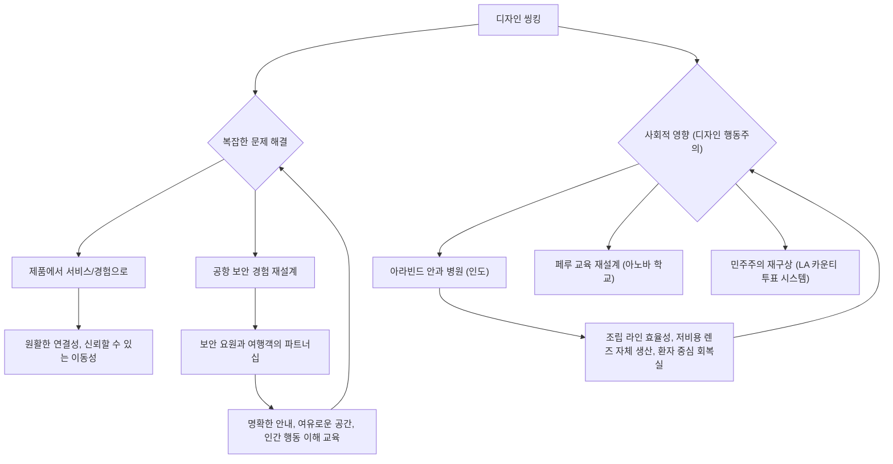
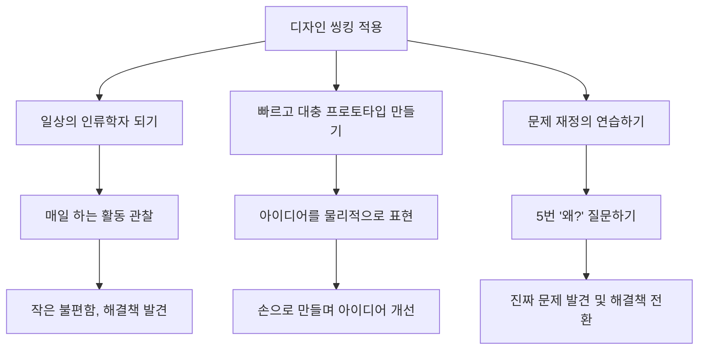

## 디자인으로 변화를 이끌어내기: 디자인 씽킹으로 혁신을 만드는 방법
이 책은 IDEO의 CEO 팀 브라운이 쓴 '디자인으로 변화를 이끌어내기(Change by Design)'라는 책의 내용을 요약한 거야. 디자인 씽킹(Design Thinking)이라는 문제 해결 방식을 통해 어떻게 혁신을 만들고, 조직을 변화시키며, 더 나아가 세상을 바꿀 수 있는지 알려주는 책이지. 디자인 씽킹은 단순히 예쁜 제품을 만드는 걸 넘어서, 사람들의 진짜 필요를 이해하고, 기술적으로 가능한 것과 경제적으로 실현 가능한 것을 조화시켜 의미 있는 변화를 만들어내는 방법이라고 보면 돼.

## 1. 디자인 씽킹이란 무엇일까? 

디자인 씽킹은 문제를 해결하는 특별한 방법인데, 마치 탐정이 사건을 해결하듯이 사람들의 진짜 필요를 파고들어 해결책을 찾는 과정이라고 보면 돼. 이건 디자이너만 할 수 있는 특별한 능력이 아니라, 누구나 배울 수 있는 체계적인 문제 해결 방식이야.

1. **세 가지 **혁신** 공간**: 디자인 씽킹은 크게 세 가지 단계를 거쳐 진행돼.
  1. 영감**(Inspiration)**: 이건 마치 '어떤 문제가 있을까?' 하고 호기심을 가지고 주변을 둘러보는 단계야. 해결하고 싶은 문제나 기회를 발견하고, 사람들의 이야기를 들으면서 아이디어를 얻는 거지. 
  2. 아이디어 구상**(**Ideation**)**: '그럼 어떻게 해결할 수 있을까?' 하고 다양한 아이디어를 떠올리고, 발전시키고, 시험해보는 단계야. 마치 여러 가지 요리법을 시도해보는 것과 같아. 
  3. 실행**(**Implementation**)**: '이제 진짜로 만들어보자!' 하고 아이디어를 현실로 만드는 단계야. 머릿속에 있던 계획을 실제 제품이나 서비스로 만들어서 세상에 내놓는 거지. 
2. **반복적이고 비선형적인 과정**: 이 세 가지 단계는 딱 정해진 순서대로 한 번에 끝나는 게 아니야. 마치 그림을 그리다가 마음에 안 들면 다시 지우고 그리는 것처럼, 아이디어를 테스트하다가 새로운 걸 발견하면 다시 영감을 얻는 단계로 돌아가기도 해. 
  1. **혼란스러워 보일 수 있어**: 처음에는 이 과정이 좀 혼란스럽게 느껴질 수도 있어. 어떤 고객은 "이 사람들은 아무런 과정도 없어!"라고 말하기도 했지만, 몇 주 뒤에는 이 방식에 완전히 빠져들었지. 
  2. **탐색적인 과정**: 디자인 씽킹은 기본적으로 탐색하는 과정이라서, 예상치 못한 발견을 하게 될 때가 많아. 이런 발견들을 무시하지 않고 계속 따라가다 보면 더 좋은 해결책을 찾을 수 있어. 
  3. **일찍 실패하고 빨리 성공하기**: 이 방식은 '일찍 실패해서 더 빨리 성공하자(Fail early to succeed sooner)'는 철학을 가지고 있어. 처음부터 완벽한 걸 만들려고 하기보다는, 빠르게 시도하고 실패하면서 배우는 게 중요하다고 보는 거야. 
3. 발산적** 사고와 **수렴적 사고: 디자인 씽킹은 두 가지 생각 방식을 왔다 갔다 하면서 진행돼. 
  1. 발산적 사고**(Divergent Thinking)**: 이건 마치 '생각의 씨앗을 마구 뿌리는 것'과 같아. 최대한 많은 아이디어를 떠올리고, 다양한 가능성을 탐색하는 단계야. 이때는 어떤 아이디어도 판단하지 않고 자유롭게 생각하는 게 중요해. 
  - 노벨상 수상자 라이너스 폴링은 "좋은 아이디어를 얻으려면, 먼저 많은 아이디어를 가져야 한다"고 말했어. 
  2. 수렴적 사고**(Convergent Thinking)**: 이건 '뿌려진 씨앗 중에서 가장 좋은 걸 고르는 것'과 같아. 떠올린 많은 아이디어 중에서 가장 좋은 해결책을 분석하고 선택하는 단계야. 
  3. **두 가지 사고의 리듬**: 디자인 씽킹은 이 두 가지 사고 방식을 번갈아 가면서 사용해. 아이디어를 넓게 펼쳤다가 좁혀서 선택하고, 다시 선택한 아이디어를 넓게 탐색하는 식으로 계속 반복하는 거지. 

## 2. 디자인 씽킹의 핵심 원칙: 사람을 중심으로 생각하기 

디자인 씽킹의 가장 중요한 원칙은 '사람을 중심으로 생각하는 것'이야. 마치 친구의 고민을 들어주듯이, 문제를 겪는 사람들의 입장에서 생각하고 그들의 진짜 필요를 찾아내는 거지.

1. **세 가지 성공 기준의 조화**: 좋은 디자인은 세 가지 기준이 잘 어우러져야 해. 
  1. **인간적 관점에서 바람직한가(**Desirability**)**: 사람들이 정말로 원하는 것인가? 사람들이 좋아하고 필요로 하는 것인가? 
  2. **기술적으로 가능한가(**Feasibility**)**: 지금 가지고 있는 기술로 만들 수 있는 것인가? 
  3. **경제적으로 **실현** 가능한가(**Viability**)**: 돈을 벌 수 있거나 지속 가능한 모델인가? 
  4. **세 가지가 만나는 지점**: 이 세 가지가 모두 충족되는 '최적의 지점'을 찾는 것이 디자인 씽킹의 핵심이야. 
  - **닌텐도 Wii 사례**: 닌텐도 Wii는 이 세 가지를 완벽하게 조화시킨 좋은 예시야. 당시 게임 시장은 더 좋은 그래픽과 비싼 콘솔 경쟁이 치열했는데, 닌텐도는 '동작 인식 기술'이라는 새로운 기술을 활용해서 더 몰입감 있는 경험을 제공했어. 
  - 그래픽 해상도에 덜 집중해서 콘솔 가격을 낮출 수 있었고, 이는 더 좋은 수익으로 이어졌지. 
  - 사람들이 원하는 재미있는 경험을 제공하면서, 기술적으로 가능하고, 경제적으로도 성공한 사례라고 볼 수 있어. 
2. **숨겨진 필요(**Latent Need**) 발견하기**: 사람들은 종종 자신이 무엇을 원하는지 정확히 말하지 못할 때가 많아. 
  1. **헨리 포드의 말**: 헨리 포드가 "만약 내가 고객들에게 무엇을 원하냐고 물었다면, 그들은 '더 빠른 말'을 원한다고 했을 것이다"라고 말한 것처럼, 사람들은 익숙한 상황에 너무 길들여져서 진짜 문제를 인식하지 못하기도 해. 
  2. **여행사 직원의 사례**: 어떤 여행사 직원은 회사 전화 회의 시스템이 너무 복잡해서, 여러 대의 전화기를 책상에 늘어놓고 각각 전화를 걸어 회의를 진행했어. 
  - 일반적인 문제 해결사는 이 직원이 교육이 필요하다고 생각하겠지만, 디자인 씽커는 이 행동에서 '숨겨진 필요'를 발견해. 
  - 이 직원의 행동은 현재 시스템이 얼마나 불편한지 보여주는 중요한 단서가 되고, 더 간단하고 직관적인 시스템을 만들 수 있는 큰 기회가 되는 거지. 
3. **세 가지 핵심 도구: **통찰**, **관찰**, **공감: 숨겨진 필요를 찾아내기 위해 디자인 씽커는 세 가지 도구를 사용해. 
  1. **통찰(Insight)**: 이건 '사람들이 실제로 어떻게 살아가는지'를 직접 보고 이해하는 데서 나와. 단순히 숫자가 가득한 표를 보는 것만으로는 얻을 수 없는 거지. 
  - **극단적인 사용자(**Extreme Users**)에게서 배우기**: 가장 강력한 통찰은 평범한 사용자보다는 '극단적인 사용자'에게서 나올 때가 많아. 
  - **Zyliss 주방 도구 사례**: 스위스 회사 Zyliss가 새로운 주방 도구를 만들 때, 일반 가정주부뿐만 아니라 '전문 요리사'와 '7살 아이'를 관찰했어. 
  - 7살 아이가 캔 따개와 씨름하는 모습을 보면서 어른들이 무의식적으로 보완했던 '조작의 어려움'을 발견했고, 전문 요리사가 빠르고 쉽게 청소할 수 있는 도구를 필요로 하는 것을 보면서 예상치 못한 '효율성'을 발견했지. 
  - 이런 극단적인 관찰을 통해, 모든 도구가 똑같이 생긴 세트 대신, 각 도구의 용도에 맞게 손잡이를 디자인한 제품 라인을 만들었고, 이 제품들은 엄청나게 잘 팔렸어. 
  2. 관찰**(Observation)**: 이건 '사람들이 무엇을 하고, 무엇을 하지 않는지, 무엇을 말하고, 무엇을 말하지 않는지' 주의 깊게 살펴보는 거야. 
  3. 공감**(Empathy)**: 이건 '다른 사람의 눈으로 세상을 보고, 그들의 경험을 통해 이해하며, 그들의 감정을 느끼는 것'이야. 
  - **병원 응급실 재설계 사례**: 한 팀이 병원 응급실 경험을 재설계할 때, 팀원 중 한 명인 크리스천 심슨은 환자들이 겪는 일을 진정으로 이해하고 싶었어. 
  - 그는 실제로 발 부상을 가장해서 병원에 입원했고, 다른 환자들처럼 접수부터 검사까지 모든 과정을 직접 겪었어. 
  - 숨겨진 카메라로 촬영한 영상을 팀원들과 함께 보면서, 그들은 환자 경험을 단순히 보는 것을 넘어 '느낄 수 있었어'. 
  - 복잡한 접수 과정, 어디로 가는지 모른 채 복도에 실려 가는 불안감, 천장만 바라보며 끝없이 기다리는 지루함 등을 직접 느낀 거지. 
  - 이를 통해 병원은 환자 여정을 행정적인 절차로만 보았지만, 환자들은 무력하고 정보가 없는 상태에서 스트레스받는 경험을 한다는 것을 깨달았어. 
  - 이 한 번의 공감 행동은 어떤 보고서나 설문조사보다 강력했고, 프로젝트의 방향을 의료 절차 최적화에서 '인간적이고 편안한 경험'을 디자인하는 것으로 완전히 바꾸었어. 

## 3. 아이디어를 현실로 만드는 도구들: 프로토타이핑과 스토리텔링 

사람들의 필요를 이해했다면, 이제 그 아이디어를 구체화하고 다른 사람들에게 전달하는 방법이 필요해. 이때 '프로토타이핑'과 '스토리텔링'이라는 강력한 도구들이 사용돼.

1. 프로토타이핑**(**Prototyping**): 손으로 생각하기** 
  1. **어릴 적 레고 놀이처럼**: 어릴 때 레고로 이것저것 만들어보면서 놀았던 기억 있지? 프로토타이핑은 마치 그런 놀이와 같아. 아이디어를 머릿속으로만 생각하는 게 아니라, 손으로 직접 만들어보면서 생각하는 거지. 
  2. **빠르고, 대충, 저렴하게**: 초기 프로토타입은 완벽할 필요 없어. 빠르고, 대충 만들고, 돈이 적게 드는 게 중요해. 목표는 아이디어를 만져볼 수 있을 정도로만 구체화해서, 피드백을 받고 배우면서 계속 발전시키는 거야. 
  3. **수술 도구 사례**: 새로운 수술 도구를 디자인하던 팀의 이야기야. 한 외과의사가 원하는 권총 손잡이 모양을 말로 설명하기 어려워했어. 
  - 회의가 끝나자마자 한 디자이너가 화이트보드 마커, 빈 필름 통, 플라스틱 집게 등 주변에 있는 물건들을 테이프로 붙여서 대충 3D 스케치를 만들었어. 
  - 이 간단하고 돈 한 푼 들지 않은 프로토타입 덕분에 모두가 외과의사가 원하는 것을 즉시 이해할 수 있었고, 수많은 혼란과 회의 시간을 절약할 수 있었지. 
  4. **물리적인 제품뿐만 아니라 모든 것에 적용 가능**: 프로토타이핑은 물리적인 제품에만 쓰는 게 아니야. 서비스, 디지털 경험, 심지어 새로운 조직 구조까지 모든 것을 프로토타이핑할 수 있어. 
  - **Amtrak 고속 열차 서비스 사례**: Amtrak이 고속 열차 서비스 '아셀라(Acela)'를 개발할 때, 처음에는 편안한 좌석 디자인에 집중했어. 
  - 하지만 디자인 팀은 '고객 여정 지도(Customer Journey Map)'라는 다른 종류의 프로토타입을 만들었어. 승객이 역에 도착해서 티켓을 사고, 플랫폼을 찾는 모든 단계를 지도에 그렸지. 
  - 놀랍게도 승객들은 10단계 여정 중 8단계가 되어서야 좌석에 앉는다는 것을 발견했어. 기차 여행 경험의 대부분은 실제 기차와는 상관이 없었던 거야. 
  - 이 간단한 프로토타입 덕분에 좌석 개선에만 집중했다면 놓쳤을 수많은 경험 개선 기회를 발견할 수 있었어. 
  - **메리어트 호텔 경험 사례**: 메리어트 호텔 프로젝트에서는 오래된 창고를 빌려 얇은 폼보드와 마스킹 테이프로 호텔 로비와 객실을 실제 크기로 만들었어. 
  - 이건 예쁘게 보이려는 게 아니라, 디자이너, 고객, 잠재 고객들이 실제 공간에서 다양한 시나리오를 연기해보면서 무엇이 적절한지 느껴볼 수 있는 '무대'였어. 
  - 이런 '진지한 놀이'를 통해 로비에 손님들이 발견한 흥미로운 장소를 표시할 수 있는 거대한 벽 지도를 만드는 등 다양한 혁신적인 아이디어가 나왔어. 
2. 스토리텔링**(Storytelling): 아이디어를 퍼뜨리는 마법** 
  1. **이야기로 아이디어에 의미 부여하기**: 아이디어가 아무리 훌륭해도 기술 보고서에 묻혀버리면 아무도 모르게 사라질 수 있어. 하지만 설득력 있는 이야기로 포장되면, 그 아이디어는 큰 움직임을 만들어낼 수 있지. 
  2. **일본의 **쿨 비즈**(Cool Biz) 캠페인 사례**: 2005년 일본 정부는 교토 의정서 목표 달성을 위해 온실가스 배출량을 줄이고 싶었어. 이전 시도는 모두 실패했지. 
  - 가장 큰 에너지 낭비 중 하나는 사무실 에어컨이었어. 무더운 여름에도 정장과 넥타이를 편안하게 입기 위해 사무실을 너무 춥게 유지했거든. 
  - 하쿠호도(Hakuhodo) 광고 대행사는 환경 보호를 외치는 공익 광고 대신 '이야기'를 만들었어. 
  - 그들은 여름철에 기업들이 복장 규정을 완화해서 에어컨 온도를 높일 수 있도록 '쿨 비즈'라는 전국 캠페인을 시작했어. 
  - 보수적인 일본 비즈니스 문화에서 넥타이 없이 출근하는 것을 사회적으로 용인하기 위해, 수십 명의 고위 CEO들과 고이즈미 준이치로 총리까지 직접 넥타이 없는 캐주얼한 비즈니스 복장으로 패션쇼 런웨이를 걸었어. 
  - 이 행사는 엄청난 센세이션을 일으켰고, "더 큰 선을 위해 전통을 바꾸는 것은 괜찮을 뿐만 아니라 '쿨'하다"는 분명한 메시지를 전달했어. 
  - 1년 안에 인구의 95% 이상이 쿨 비즈 슬로건을 알게 되었고, 이 캠페인은 전국적으로 엄청난 에너지 절약으로 이어졌어. 사람들은 이 이야기의 일부가 되고 싶어 했지. 

## 4. 디자인 씽킹의 확장: 복잡한 문제 해결과 사회적 영향 

디자인 씽킹은 단순히 제품을 더 좋게 만드는 것을 넘어, 우리 사회가 직면한 크고 복잡한 문제들을 해결하는 데도 활용될 수 있어. 마치 작은 퍼즐 조각을 맞추는 기술을 배워서 거대한 그림을 그리는 데 사용하는 것과 같지.

1. **제품에서 서비스와 경험의 시대로**: 우리는 더 이상 단순히 '전화기'를 원하는 게 아니야. 어디서든 끊김 없는 '연결성'을 원하지. '자동차'만 원하는 게 아니라, 믿을 수 있는 '이동성'을 원하는 거야. 
  1. 디자인 씽킹은 이런 복잡하고 서로 연결된 시스템을 해결하는 데 아주 적합해. 
  2. **공항 보안 경험 재설계 사례 (TSA)**: 미국 교통안전청(TSA)의 공항 보안 경험을 재설계하는 엄청난 도전이 있었어. 
  - **기존 방식**: 전통적인 접근 방식은 더 좋은 X-레이 기계, 더 빠른 컨베이어 벨트, 더 효율적인 스캐너 같은 '하드웨어'에 집중했을 거야. 
  - 디자인 씽킹** 방식**: 하지만 디자인 씽커들은 문제를 완전히 다르게 정의했어. 그들은 보안 요원과 여행객이 '적'이 아니라, 안전한 여행이라는 '공동의 목표'를 가진 '파트너'라는 것을 깨달았지. 
  - **관찰을 통한 **통찰: 불안하고 혼란스러워하는 승객들이 스트레스받는 환경을 만들어서, 보안 요원들이 진짜 의심스러운 행동을 포착하기 더 어렵게 만든다는 것을 관찰을 통해 알게 되었어. 
  - **문제의 재정의**: 그래서 문제는 "어떻게 검문소를 재구성할까?"에서 "어떻게 X-레이 기계 양쪽에서 '공감'을 만들어낼까?"로 바뀌었어. 
  - **시스템적인 해결책**: 해결책은 시스템적이었어. 
  - 과정을 쉬운 말로 설명하는 더 명확한 표지판
  - 사람들이 서두르지 않고 스스로 정리할 수 있는 더 넓은 물리적 공간
  - 단순히 지시를 따르는 것이 아니라 '인간 행동을 이해하는 데' 초점을 맞춘 새로운 보안 요원 교육 프로그램
2. 디자인 행동주의**(Design Activism): 글로벌 문제 해결**: 디자인 씽킹을 더 크게 확장하면 '디자인 행동주의'로 이어질 수 있어. 사람 중심의 방법을 적용해서 전 세계적인 문제에 대한 해결책을 찾는 거지. 
  1. 아라빈드 안과 병원** (인도) 사례**: 인도의 아라빈드 안과 병원은 닥터 G. 베나타스와미가 설립했는데, 가난한 시골 사람들에게 백내장 수술을 제공해서 예방 가능한 실명을 없애는 것이 목표였어. 
  - 제약** 속의 **혁신: 서양의 비싼 의료 기술을 수입하는 것은 불가능했기 때문에, 그들은 전체 시스템을 처음부터 다시 디자인했어. 
  - **조립 라인 효율성**: 수술실에 조립 라인 효율성을 도입해서, 한 명의 외과의사가 하루에 수십 건의 수술을 진행했어. 시간을 낭비하지 않고 준비된 환자에게 바로 다음 수술을 진행하는 방식이었지. 
  - **저비용 렌즈 자체 생산**: 짝당 200달러나 하는 비싼 인공수정체를 수입하는 대신, 그들은 고품질 렌즈를 단 몇 달러에 직접 제조하는 방법을 찾아냈어. 
  - **깊은 **공감: 닥터 베나타스와미는 가난한 시골 마을에서 온 환자들이 TV나 조절 가능한 침대가 있는 고급 회복실을 필요로 하지 않는다는 것을 깨달았어. 오히려 그런 환경은 그들을 불편하게 만들 수 있었지. 
  - **집처럼 편안한 회복실**: 그래서 수술 후 회복은 바닥에 돗자리가 깔린 소박한 방에서 이루어졌고, 이는 환자들에게 집처럼 편안하고 익숙하게 느껴졌어. 
  - **지속 가능한 비즈니스 모델**: 이런 접근 방식 덕분에 아라빈드 병원은 돈을 내는 환자들이 가난한 사람들을 위한 무료 치료를 지원하는 지속 가능한 비즈니스 모델을 운영할 수 있었어. 
  - 이것은 극심한 제약이 공감과 창의적인 사고를 만났을 때 세상을 바꾸는 해결책으로 이어질 수 있다는 놀라운 예시야. 
  2. **다른 글로벌 문제 해결 사례**:
  - 페루의 아노바 학교 프로젝트를 통한 교육 재설계 
  - 로스앤젤레스 카운티의 새로운 투표 시스템을 통한 민주주의 재구상 

## 5. 디자인 씽킹을 일상에 적용하는 방법 

디자인 씽킹은 거창한 프로젝트에만 필요한 게 아니야. 우리 일상생활 속에서도 얼마든지 적용해서 더 나은 삶을 만들 수 있어. 마치 작은 습관을 바꾸는 것처럼 말이야.

1. **일상의 인류학자가 되어보기**: 
  1. **매일 하는 활동 **관찰: 매일 하는 일상적인 활동 하나를 골라봐. 아침 식사 준비, 출퇴근길, 숙제하는 시간 같은 것 말이야. 
  2. **처음 보는 것처럼 **관찰: 딱 하루만, 그 활동을 마치 처음 보는 것처럼 자세히 관찰해봐. 작은 불편함, 나도 모르게 만들어낸 편법, 아무 생각 없이 하는 행동들을 찾아보는 거지. 
  3. **질문 던지기**: "왜 항상 재킷을 옷장 대신 의자 등받이에 걸어둘까?", "왜 매일 아침 지저분한 서랍을 뒤적거릴까?" 같은 질문을 던져봐. 
  4. **통찰과 기회 발견**: 이런 작은 관찰 하나하나가 바로 '통찰'이고, 창의적인 해결책을 찾을 수 있는 '디자인 기회'가 될 수 있어. 
2. **빠르고 대충 **프로토타입** 만들어보기**: 
  1. **아이디어를 물리적으로 표현**: 다음번에 학교 프로젝트, 새로운 동아리, 아니면 방 정리 아이디어가 떠오르면, 목록을 만들거나 계획을 세우는 대신, 종이, 골판지 등 주변에 있는 아무거나 잡아서 아이디어를 대충이라도 물리적으로 만들어봐. 
  2. **완벽함에 대한 부담 버리기**: 멋지거나 전문적으로 보이게 만들 필요 없어. 목표는 아이디어를 만져볼 수 있을 정도로만 구체화해서 직접 상호작용해보는 거야. 
  3. **손으로 만들며 배우기**: 손으로 직접 무언가를 만드는 행위가 원래 생각했던 아이디어를 예상치 못한 방식으로 어떻게 변화시키고 개선하는지 놀라게 될 거야. 
3. **문제 재정의 연습하기**: 
  1. **'왜?'를 다섯 번 질문하기**: 다음번에 어떤 문제에 직면하면, 바로 해결책을 찾으려 하지 말고 한 발짝 물러서서 '왜?'라고 다섯 번 질문해봐. 
  2. **예시**: "숙제를 끝낼 시간이 없어"라는 문제가 있다면, 
  - "왜?" -> "숙제가 너무 오래 걸려서." 
  - "왜?" -> "쉽게 집중이 흐트러져서." 
  - 이런 식으로 더 깊이 파고들다 보면, 처음에 생각했던 문제가 사실은 진짜 문제가 아니라는 것을 발견할 때가 많아. 
  3. **해결책의 전환**: 시간 관리 앱을 찾는 대신, 완전히 방해받지 않는 작업 공간을 만들어야 한다는 것을 깨달을 수도 있어. 

이 책은 단순히 새로운 비즈니스 전략을 배우는 것을 넘어, 세상을 보고 형성하는 더 창의적이고 공감하며 효과적인 방법을 알려주는 책이야.

