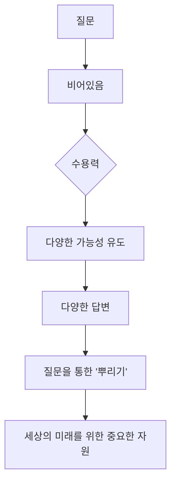
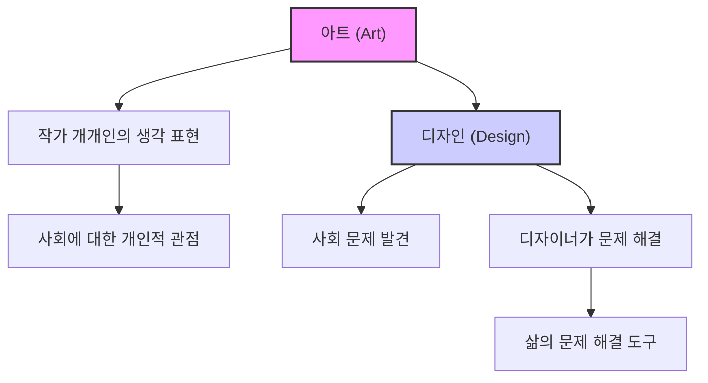

## 하라 켄야의 '디자인의 디자인': 비어있음의 미학으로 소통하다
하라 켄야의 '디자인의 디자인'은 단순히 물건을 예쁘게 만드는 것을 넘어, <u>'</u>비어있음<u>(Emptiness)'이라는 일본 고유의 미학적 감각을 통해 디자인과 소통의 본질을 탐구하는 책</u>이다. 이 책은 디자인이 어떻게 사람들의 마음을 움직이고, 문화와 연결되며, 더 나아가 세상을 변화시킬 수 있는지에 대한 깊이 있는 철학을 제시한다. 특히 무인양품의 디자인 철학을 통해 '비어있음'이 어떻게 보편적인 가치를 창출하는지 보여준다. 

## 1. 하라 켄야, 디자인을 '사건'으로 만들다 

하라 켄야는 도쿄를 기반으로 활동하는 디자이너로, 단순히 물건을 디자인하는 것을 넘어 <u>'사건(happenings)'이나 '이벤트(events)'를 디자인</u>한다. 

1. **기억과 정체성 창조**: 그는 관객의 마음속에 <u>기억이나 정체성을 어떻게 만들어낼지, 인지의 불꽃을 어떻게 일으킬지</u> 끊임없이 고민한다. 
  - 이는 마치 영화감독이 관객에게 잊지 못할 경험을 선사하기 위해 스토리, 연출, 음악 등 모든 요소를 조율하는 것과 같다.
  - 그의 디자인은 단순히 시각적인 아름다움을 넘어, 사람들의 감각과 인식을 자극하여 깊은 인상을 남기는 것을 목표로 한다.
2. **'**비어있음**'의 미학**: 하라 켄야의 미학적 감수성의 핵심은 <u>'비어있음(Emptiness)'</u>이다. 
  - 이 개념은 일본 문화, 건축, 디자인, 소통, 정원, 조명 등 모든 면에 깔려 있는 근본적인 토대이다. 
  - 겉보기에는 서양의 '단순함(Simplicity)'과 비슷해 보이지만, 이 둘은 완전히 다른 개념이다. 

## 2. 일본 문화 속 '비어있음'의 뿌리: 자연과 신토 

일본의 '비어있음' 개념은 아주 오래전 일본인들의 감수성에서 시작되었다. 

1. **자연 속 지혜**: 고대 일본인들은 <u>지혜가 자연 속에 있다고 믿었다</u>. 
  - 자연을 신성하게 여기는 마음은 전 세계 공통이지만, 일본인들은 지혜의 핵심이 자연 안에 있다고 보았다. 
  - 그들은 자연을 억압하거나 정복해야 할 대상으로 보지 않고, <u>풍요로움 그 자체로 인식하며 자연이 인간에게 풍요로운 삶을 가르쳐준다고 믿었다</u>. 
2. **야오요로즈노카미(八百万の神): 무한한 신들**: 일본에서는 <u>'야오요로즈노카미(八百万の神)'</u>, 즉 800만 명의 신이 있다고 말한다. 
  - 이 신들은 바람처럼 산과 숲, 마을을 날아다니고, 바다 깊은 곳에도 존재하며, 심지어 갓 뽑은 무의 끝이나 쌀알, 오래된 쓰레기 속에도 깃들어 있다고 여겨진다. 
  - 이 신들은 무한하고 우리 주변에 있지만, <u>만날 약속을 잡을 수 없을 정도로 덧없고 섬세한 존재</u>이다. 
  - 그래서 인간이 할 수 있는 유일한 일은 <u>신들을 손님으로 초대하는 것</u>이다. 
3. 신토** 신사의 '비어있음'**: 일본의 신토 신사는 '비어있음' 개념을 잘 보여주는 구조물이다. 
  - 신사는 네 개의 기둥이 사각형으로 배열되어 있고, 그 위를 지붕이 덮고 있는 형태이다. 
  - 이 공간 안에는 아무것도 없다. <u>말 그대로 '비어있음' 그 자체</u>이다. 
  - **신을 초대하는 빈 공간**: 만약 우리가 '비어있음'의 조건을 만들면, 자연의 힘인 신들이 그곳을 느끼고 찾아올지도 모른다고 믿었다. 
  - '비어있음'은 <u>채워질 가능성 그 자체</u>이기 때문이다. 
  - 신들이 이 빈 공간을 알아차리지 못할 리 없지만, 그들이 반드시 들어올 것이라는 확신은 없다. <u>'들어올지도 모른다(may enter)'는 가능성</u>이 중요하다. 
  - 사람들이 기도하는 것은 바로 이 '가능성'이다. 고대 일본에서는 <u>힘이 가능성과 잠재력으로 이루어져 있다고 이해하기 시작</u>했다. 
  - **신사의 구조**: 신사의 중심에는 '비어있음'이 있고, 그 주변을 여러 겹의 울타리가 둘러싸고 있다. 
  - 입구에 있는 <u>도리이(鳥居)는 두 개의 수직 기둥과 하나의 수평 요소로 이루어진 단순한 구조물</u>이다. 
  - 이 도리이는 <u>'비어있음의 문'</u>으로, 방문객들은 이 문을 통과하며 신사의 중심까지 이르는 길을 따라간다. 
  - 사람들은 신사를 방문하여 그 '비어있음' 속에서 신의 존재를 느끼고, 자신의 생각을 전달한 후 떠난다. 
  - **일본식 소통의 기원**: 신과 인간 사이에는 논리적인 말이 오가지 않고, 계약도 없다. 
  - 하지만 '비어있음'을 통해 신과 교감했다는 느낌만으로 충분하다. 
  - '비어있음'은 비어있기 때문에 <u>무한한 가능성과 수용력을 지닌다</u>. 
  - '비어있음'은 메시지 자체가 아니지만, 빈 그릇에 내재된 가능성을 보고 우리의 영혼을 결합하는 행위에서 소통의 시작을 볼 수 있다. 
  - 빈 그릇을 바치며 기도하는 것은 <u>하나의 질문을 던지고, 무한히 다양한 답변을 받아들일 준비를 하는 것</u>과 같다. 

## 3. 이세 신궁: 20년마다 다시 태어나는 '비어있음' 

신토의 가장 신성한 장소인 이세 신궁도 다른 신사들과 같은 기본적인 구조를 가지고 있다. 

1. **중심의 '**비어있음**'**: 이세 신궁은 <u>채워질 잠재력 속에서 힘을 보여주는 중심의 '비어있음'을 포용</u>한다. 
  - 이세 신궁의 건축 양식은 폴리네시아 건축의 영향을 받은 것으로 보인다. 
  - 일본은 실크로드를 통해 중국과 한국을 거쳐 로마 문화를 받아들였지만, 동시에 해양을 통해 전 세계 문화의 영향을 받았다. 
  - 수백 년에 걸쳐 이세 신궁의 양식은 <u>진정한 일본 고유의 것으로 발전</u>했다. 
2. **20년마다 재건축**: 이세 신궁은 <u>20년마다 완전히 새로 지어진다</u>. 
  - 이는 '비어있음'으로 이어지는 신사의 수명이 단 20년이라는 것을 의미한다. 
  - 기존 신사 옆에는 항상 빈 터가 보존되어 있어, <u>새로운 신사를 바로 옆에 지을 수 있도록</u> 한다. 
  - 천 개 이상의 의례 도구들도 모두 새것으로 교체된다. 
  - **전통의 계승**: 오래된 건물은 해체되는 과정에서 사라지고, 설계도도 20년마다 다시 그려진다. 
  - 이는 <u>원본을 보존하는 것이 아니라 '복제'를 통해 다음 세대로 이해를 전달하는 것이 중요</u>하다는 의미이다. 
  - 설계도를 다시 그리는 과정에서 물리적인 차이가 발생할 수 있지만, 이는 전통을 다음 세대에 전달하는 매우 정확한 방법으로 여겨진다. 
  - 마치 건축 방식이 한 세대에서 다음 세대로 전수되는 것처럼, <u>정보의 복제가 새로운 생명을 얻는 것</u>이다. 
  - 수석 목수는 조수를 두는데, 이 조수 중 한 명이 다음 재건축을 감독한다. 
  - 20년 후, 수석 목수는 불을 밝히는 의식에서 전통적인 영적 의례를 읊는다. 이 주문은 언어적 의미는 없지만, 원본의 진정한 복사본이라고 주장된다. 
  - 설계도를 그리고 건축 기술을 전수하는 과정은 신사 건축의 지속적인 변형으로 이어진다. 
3. **'비어있음'의 영원성**: 마치 한 손에 든 물을 다른 손의 빈 잔에 따르고, 조금이라도 흘리면 새 물을 채워 넣는 과정을 수천 번 반복하는 것과 같다. 
  - 이 과정에서 물 자체는 원래의 물과 달라지지만, <u>그 물 속에서 우리는 먼 과거로부터 전해져 내려오는 '영원한 것'을 발견</u>한다. 
  - '비어있음'을 한 손에서 다른 손으로 전달하는 행위는 창의적이지 않아 보일 수 있지만, <u>인간 세포가 DNA 복제를 통해 변화하는 과정과 매우 유사</u>하다. 
  - 이러한 세포 변형을 통해 인간 세포가 스스로 재구조화하고 혁신을 시작하는 것처럼, 한때 폴리네시아 양식이었던 건물이 일본 건축으로 변화한 것이다. 

## 4. 소통 속 '비어있음': 말하지 않아도 알아요 

'비어있음'은 소통에서도 큰 힘을 발휘한다. 

1. **내용 없는 소통**: 우리는 보통 소통을 의미 있는 내용을 전달하고 받는 것이라고 생각하지만, <u>항상 내용이 필요하지는 않다</u>. 
  - 소통의 본질은 생각이나 감정을 서로 공유하는 것이므로, <u>눈빛 교환만으로도 성공적인 소통이 될 수 있다</u>. 
  - 양측이 무언가를 공유하고 유대감을 형성했다고 느끼면, 그것은 성공적인 소통이다. 
  - 우리는 섀넌의 정보 이론처럼 의미를 해석하기 위해 기호를 인코딩하고 디코딩하는 복잡한 모델에 의존할 필요가 없다. 
2. 아운**(阿吽)의 호흡**: 일본에서는 이러한 이상적인 소통을 <u>'아운(阿吽)'</u>이라고 부른다. 
  - 신토 신사 문에는 한 쌍의 돌사자 개가 서 있는데, 한 마리는 입을 벌려 '아(ah)' 하고 숨을 내쉬는 듯하고, 다른 한 마리는 입을 다물어 '운(un)' 하고 숨을 들이쉬는 듯하다. 
  - '아운의 호흡'은 <u>한쪽이 메시지를 보내면 다른 쪽이 다음 숨결에 그것을 받아들이는 것</u>을 의미한다. 
3. **일본식 소통의 특징**: 일본식 소통 방식은 외국인들이 이해하기 어렵다고들 한다. 
  - 일본인들은 <u>모호한 발언을 하는 경향이 있고, 문장의 주어를 생략하거나 애매모호하게 말하는 경향</u>이 있다. 
  - 반면 서양식 소통은 내용을 명확히 정의하고 논리적인 구조를 이끌어내는 경향이 있다. 
  - 이러한 맥락에서 일본인들은 자신의 의도를 이해시키기 어려워할 수 있다. 
4. **'비어있음'을 활용한 합의**: 일본인들은 중요한 사안을 결정할 때, <u>목표 대상이나 상황을 직접적으로 지시하지 않는다</u>. 
  - 대신, <u>초점을 말하지 않고 '괄호 안에' 남겨둔다</u>. 이것이 바로 '비어있음'의 잠재력을 활용하는 것이다. 
  - **예시: 회의에서의 합의**: 회장이 어떤 안건에 대해 논의를 이끌다가 직원들에게 모두 동의하는지 묻는다. 
  - 직원들이 모두 침묵하면, 회장은 "모두 완전히 동의하는 것 같으니, 이 안건을 이렇게 처리합시다"라고 결론 내린다. 
  - 여기서 화자는 청중을 편안하게 해주기 위해 매우 신경 쓰고 있음을 알 수 있다. 
  - 화자는 이름을 언급하지 않음으로써 직접적인 표현을 완전히 피한다. 
  - 결과는 대명사 '그것(it)'으로 표현되어 '빈 그릇' 역할을 한다. 
  - 이는 <u>암묵적으로 승인된 것이므로, 특정 개인이 아닌 합의 과정에 참여한 모든 사람이 결정에 대한 책임을 동등하게 공유</u>한다. 
  - **소통의 메커니즘**: 이러한 소통 메커니즘은 <u>오직 그 자리에 있는 사람들만이 이해할 수 있는 방식</u>으로 작동한다. 
  - 집단은 '비어있음'을 활용하여 합의에 도달하고, 책임과 권력을 완만하게 분배한다. 
  - 이 메커니즘은 <u>중심을 비워두어 변화를 수용할 수 있도록 하면서도, 빈칸을 채우지 않고 견고한 합의를 진행</u>시킨다. 
  - 이는 마치 교차로에 신호등을 설치하는 대신, 원형 교차로를 사용하여 모든 차들이 멈추지 않고 움직이게 하는 것과 같다. 
  - 의미의 핵심을 비워두는 것은 <u>특정 지점이나 교차로를 전술적으로 피하는 방법</u>을 찾는 데 도움이 된다. 
  - 중요한 핵심을 괄호 안에 넣어 중앙 공간을 비워두면, 그곳에 무엇이 삽입되어야 하는지에 대한 오해를 피하기 위해 <u>일정 수준의 전문성을 갖추려고 노력</u>해야 한다. 
  - 하지만 이 메커니즘의 요점은 <u>가능성 또한 포함</u>한다는 것이다. 
  - 이러한 합의 방식은 양질의 집단 소통과 뛰어난 소통 기술의 자연스러운 결과로 보인다. 
  - 인터넷을 통한 집단 소통이 활발한 오늘날, 이러한 합의 형성 방식을 신중하게 고려하고 탐구해야 한다. 

## 5. 일본 국기: 의미를 담는 '빈 그릇' 

일본 국기 디자인은 흰색 배경에 붉은 원이 그려져 있다. 

1. **상징의 본질**: 이 국기는 <u>상징 또는 '</u>비어있음<u>'의 본질</u>을 생각하게 하는 좋은 예시이다. 
  - 붉은 원은 <u>어떤 특정한 의미도 담고 있지 않다</u>. 그저 원일 뿐이다. 
  - 황제, 국가, 애국심 등 <u>어떤 의미를 부여할지는 전적으로 개인에게 달려 있다</u>. 
  - 만약 우리가 이 시각적 대상에 특정한 의미를 부여하고 그것을 전시하면, 효과적인 시각적 소통이 이루어진다. 
2. **다양한 의미의 수용**: 붉은 원은 <u>다양한 의미를 담을 수 있는 '빈 그릇'</u>이다. 
  - 이 그릇은 침략, 파괴, 제국주의부터 애국심과 평화에 이르기까지 <u>다양한 의미를 받아들인다</u>. 
  - 전후 세대인 하라 켄야는 학교에서 붉은 원이 평화로운 국가를 상징한다고 배웠다. 
  - 하지만 중국 대학생들에게 이 말을 했을 때, 혼란스러운 웅성거림이나 노골적인 반대를 접했다. 
  - 제2차 세계대전 당시, 일본 군인들은 붉은 원이 그려진 머리띠를 두르고 잔혹한 공격에 참여하거나 전장에서 사망했다. 
  - 이 비극적인 사실을 생각하면, <u>재앙적인 잔혹함이 한때 이 붉은 원을 채웠다고 말하고 싶어진다</u>. 
3. **상징과 의미의 자의성**: 하지만 <u>상징과 의미의 관계는 항상 자의적</u>이다. 
  - 국가, 신토의 태양, 심지어 밥그릇 중앙에 놓인 매실 장아찌(우메보시)로 해석하는 것은 <u>개인에게 달려 있다</u>. 
  - 평화를 상징한다고 배운 사람들은 그것을 평화로 본다. 
  - 하지만 붉은 원 자체는 특정한 의미가 없다. <u>전적으로 보는 사람에게 달려 있다</u>. 
  - 따라서 일본의 상징은 <u>슬픔과 평화, 굴욕과 희망처럼 때로는 모순되는 다양한 아이디어를 담을 수 있는 거대한 '비어있음'</u>이다. 

## 6. '단순함'과 '비어있음'의 차이: 현대 디자인의 진화 

'단순함(Simple)'과 '비어있음(Empty)'은 비슷해 보이지만 같지 않다. 

1. **'**단순함**'의 역사**: '단순함'이라는 개념은 <u>인류 역사에서 매우 최근에 등장한 것</u>이다. 
  - 고대부터 인간은 환경을 만들 때, 의미, 힘, 아름다움과 같은 중요한 가치를 <u>화려한 장식과 정교한 형태로 표현</u>했다. 단순함이 아니었다. 
  - 아케메네스 왕조와 청동기 시대부터 최근까지, 중국과 인도, 이슬람 종교 예술, 유럽의 절대 군주들은 <u>수많은 패턴으로 물건을 장식하는 데 엄청난 노력을 기울였다</u>. 이러한 정교한 패턴은 위대한 권위의 상징이었다. 
  - 하지만 인간이 '단순함'에서 가치와 미학을 보기 시작한 것은 <u>불과 150년도 채 되지 않았다</u>. 
  - 지배적인 권력이 약해지고 개인의 목표가 장려되면서 현대 사회가 성장하기 시작했다. 
  - 사람들은 '단순함'과 '미니멀리즘'의 합리성을 존경하기 시작했다. 
  - 현대 사회에서 선택권이 있는 사람들은 합리적인 것을 선택하는데, 이는 그들에게 노동과 자원의 효과적인 사용을 나타내기 때문에 아름답게 여겨진다. 
  - 현대 디자인의 흐름은 기능과 일치하는 '단순함'의 발견을 따랐다. 
2. **일본의 '비어있음'**: 서양 모더니즘보다 수백 년 전인 15세기 후반, 일본인들은 '단순함'에서 가치와 아름다움을 찾기 시작했다. 
  - 그들이 만족감을 느낀 것은 <u>모더니즘이 나중에 발견한 '단순함'과는 다른 '비어있음'의 개념</u>이었다. 
  - **문화적 수용과 정제**: 일본은 아시아의 동쪽 끝에 위치하며, 로마에서 시작된 문화가 실크로드나 인도양, 해상 실크로드를 통해 일본으로 흘러들어왔다. 
  - 일본은 다양한 문화를 받아들였고, 중국과 한국뿐만 아니라 러시아와 폴리네시아의 영향도 받았다. 
  - 하지만 동시에 다양한 문화에 지속적으로 노출되고 익숙해지면서, 일본은 <u>모든 문화적 스타일에서 벗어난 궁극적인 '평범함(plainness)'에 대한 감수성</u>을 갖게 되었다. 
  - 이러한 종류의 '단순함'과 '평범함'은 다른 동아시아 지역이나 국가에서는 찾아볼 수 없다. 오히려 그들의 시각적 표현은 독특하고 정교한 패턴과 장식으로 특징지어진다. 

## 7. 히가시야마 문화와 다도: '비어있음'의 미학을 꽃피우다 

15세기 중반, 일본은 오닌의 난이라는 내전을 겪으며 축적된 문화유산 대부분을 잃었다. 

1. 히가시야마** 문화의 탄생**: 당시 쇼군(장군)이었던 아시카가 요시마사는 예술 애호가였는데, 문화유산의 손실에 깊이 상심했다. 
  - 결국 요시마사는 아들에게 권력을 넘기고 교토의 히가시야마 지역으로 은퇴했다. 
  - 그는 서예, 다도 등을 즐기며 시간을 보냈고, 그 주변에서 번성한 문화를 <u>'히가시야마 문화'</u>라고 불렀다. 
  - 오닌의 난이라는 재앙으로 문화가 초기화되었지만, 히가시야마에서 탄생한 이 새로운 문화는 일본 문화를 다시 활성화시켰다. 
  - 이 시기에 나타난 일본 미술은 <u>'</u>비어있음<u>'의 색채</u>를 띠게 되었다. 
  - 이는 요시마사를 포함하여 원래의 상실을 경험했던 사람들의 마음속에 이미지를 떠올리게 했고, 그들의 인지에 영향을 미쳤을 수 있다. 
  - 다양한 외래문화의 영향에서 벗어나면서, 일본은 <u>'비어있음'이라는 공통된 미학적 감수성을 발전시키기 시작</u>했다. 
2. **도안사이(同安斎) 서재**: 요시마사는 치온지(慈恩寺)에 있는 <u>'도안사이'라는 서재에서 많은 시간을 보냈다</u>. 
  - 이 서재는 우리가 생각하는 <u>전통적인 일본식 방의 기원</u>이다. 
  - 매우 단순하지만 아름다운 공간으로, 편안하면서도 긴장감 있는 분위기에 둘러싸여 있다. 
  - 바닥은 다다미로 덮여 있고, 종이로 덮인 반투명 쇼지(障子) 미닫이문 앞에는 조명대가 놓여 있다. 
  - 문이 열리면 조명대 빛을 받아 <u>깔끔하고 정돈된 풍경 정원이 나타난다</u>. 
  - 다른 두 면에는 쿠스마(襖)라는 칸막이가 있는데, 이 모든 조건이 전통적인 일본식 방을 이 공간에 응축시킨 것이다. 
3. **다도(茶道)와 **와비**(侘び)**: 다도의 창시자인 <u>무라타 주코(村田珠光)는 요시마사와 친분이 있었고, 그의 서재를 자주 방문</u>했다. 
  - 다도는 미학적 '단순함'을 함양하는 데 중요한 영향을 미쳤다. 
  - 주코는 <u>'와비(侘び)'로 대표되는 미학을 디자인</u>했다. 
  - '와비'는 <u>단순하고 덧없으며 고요한 취향</u>을 의미한다. 
  - 화려함을 중시하는 외래문화의 영향에서 벗어나, 주코와 요시마사는 이러한 공간에서 풍부한 상상력의 결실을 공유하며 즐겼다. 
  - 다도는 곧 센 리큐(千利休)가 이끄는 독특한 미학으로 절정에 달했다. 
4. **'비어있음'을 채우는 다도**: 다도 공간은 <u>'비어있음'으로 디자인되어 방문객들이 상상 속 장면을 초대할 수 있도록</u> 한다. 
  - 다도의 개념은 <u>창의적인 힘으로 다양한 이미지를 불러일으킨 다음, 이 '비어있음' 속으로 받아들여 소통의 힘으로 변환하는 것</u>이다. 
  - 리큐 시대에는 다실의 크기가 줄어들고 단순화되었다. 
  - 다구(茶具)는 쟁반과 다완(茶碗)으로 제한되었고, 일련의 동작도 세련되고 합리적인 방식으로 정돈되었다. 
  - **상호 이해의 촉진**: 다도의 본질은 <u>상호 이해를 촉진하는 것</u>이다. 
  - 이는 다실이라는 극도로 미니멀한 공간에서 주인이 손님을 접대함으로써 이루어진다. 
  - 벽감(alcove)에 놓인 꽃, 한 폭의 족자(hanging scroll)는 각 다도의 분위기를 나타낸다. 
  - 예를 들어, 주인은 꽃병을 물에 띄우고 벚꽃잎을 그 표면에 뿌릴 수 있다. 
  - 이런 식으로 주인과 손님은 <u>만개한 벚나무 아래 함께 앉아 있는 환상을 공유</u>한다. 
  - 미타테**(見立て)**: 손님이 주인의 연출을 해석하고, 주인이 의도한 메시지를 인지하고 완성하는 것을 <u>'미타테(見立て)'</u>라고 한다. 
  - '미타테'는 <u>유형적인 상호작용에 대한 은유</u>이다. 
  - 이는 다도에서 중요한 역할을 하는 반응이자, <u>'비어있음'을 이미지나 의미로 채우는 창의적인 행위</u>이다. 
  - '비어있음'은 '미타테'의 접근 방식과 함께 작동할 때만 효과적이다. 
  - 거의 가구가 없는 다실은 온갖 종류의 상상 속 장면을 가능하게 한다. 
  - 다실은 만개한 벚나무 아래의 장소가 될 수도 있고, 바다 파도가 남긴 해변이 될 수도 있다. 
  - **일상에서 비일상으로**: 다실로 이어지는 정원과 통로는 <u>손님이 일상에서 비일상으로 접근하는 통로</u>이다. 
  - 잘 가꾸어진 정원을 거닐면서 그의 감각은 깨어난다. 
  - 이러한 섬세한 감각에 흠뻑 젖으면, 손님은 아주 작은 변화도 놓치지 않을 것이다. 
  - 이제 그는 최소한의 정보만으로 다실로 초대받지만, <u>이곳에서 웅변적인 이미지를 떠올릴 자원</u>을 갖게 된다. 
  - **리큐의 7가지 지침**: 리큐는 7가지 지침을 제시했다. 
  - 1. 꽃은 들판에서 자라는 것처럼 꽂을 것.
  - 2. 숯불은 차를 내는 시간에 정확히 물을 끓일 것.
  - 3. 여름에는 시원하게, 겨울에는 따뜻하게.
  - 4. 일찍 준비할 것.
  - 5. 예상치 못한 상황에 대비할 것.
  - 6. 손님에게 온 마음을 다할 것.
  - 이것이 전부라고 생각할 수 있지만, 이 지침들은 <u>무한한 해석을 담고 있다</u>. 
  - 예를 들어, 첫 번째 규칙인 '꽃은 들판에서 자라는 것처럼 꽂을 것'을 보자. 꽃꽂이 행위 자체가 인위적이므로, 들판에서 자라는 것처럼 꽂는 것은 불가능하다. 
  - 하지만 이 규칙을 더 넓은 의미로 적용하면, 우리 자신을 포함한 모든 생명체를 들판과 꽃의 일부로 설정하는 것이다. 
  - 이 단순한 문장은 <u>모든 형태의 자연과 조화를 이루기 위해 우리의 재량권을 사용하도록 노력하라는 다양한 격언과 공명</u>한다. 
  - **인간 활동의 은유**: 다도는 주인이 손님에게 차를 대접함으로써 보여주는 환대를 의미하지만, 사실 <u>모든 인간 활동에 대한 은유</u>이다. 
  - 따라서 리큐의 세계는 <u>인간 활동에 대한 다양한 창의적인 반응을 장려하는 환경을 조성</u>하며, 이는 '비어있음'을 의미로 채운다. 
  - 다도에서는 '비어있음'의 원리가 작동한다. 
  - 이는 사람 사이든, 사람과 사물 사이든, <u>광범위한 가능한 상황과 소통하고 통합하는 아이디어의 원천</u>이 된다. 

## 8. 무인양품(MUJI): '비어있음'을 통한 보편적 디자인 

하라 켄야가 언급했던 도안사이 서재 사진에 흰색 공이 있는데, 이것은 무인양품(MUJI) 제품이다. 

1. **무인양품의 철학**: 무인양품의 개념은 다도<u> 개념에 뿌리</u>를 두고 있다. 
  - 무인양품의 생각 뒤에는 <u>제품의 '</u>단순함<u>'을 '</u>비어있음<u>'으로 적용하려는 아이디어</u>가 있다. 
  - 이는 무인양품의 개념과 다도를 명확하게 연결한다. 
  - **예시: **무인양품** 테이블**: 무인양품 테이블은 간결하다. 즉, '비어있다'. 
  - 혼자 사는 18세 청년도, 60대 부부도 이 테이블이 완벽하게 어울린다고 생각한다. 
  - 이러한 <u>매우 넓은 수용 범위가 무인양품의 품질을 정의</u>한다. 
  - 무인양품 제품은 사용과 맥락 모두에서 보편적이며, 이것이 '단순함'과 '비어있음'의 차이이다. 
2. **'단순함'과 '비어있음'의 차이**: 두 개의 잘 만들어진 칼을 비교해보자. 
  - 서양식 칼은 손가락이 딱 맞는 완벽한 손잡이를 가지고 있다. 이는 <u>'단순함'</u>이다. 
  - 반면 일본식 전통 칼(호초)은 언뜻 보기에 손잡이가 없어 사용자에게 기본적인 예의가 부족해 보인다. 
  - 하지만 이 칼은 <u>어떤 각도에서든 사용자가 잡을 수 있는 보편성</u>을 지니고 있으며, 여기서 우리는 <u>'비어있음'</u>을 발견한다. 
  - 이 '비어있음'은 전통 일본 식당의 숙련된 요리사의 기술을 가능하게 한다. 
  - 기능적인 손잡이가 있는 칼은 '단순'하고, 일본 전통 칼은 '비어있다'. 
3. **메시지를 보내지 않는 광고**: 무인양품은 화려한 물건들이 넘쳐나던 일본의 황금 경제 시대인 1980년에 설립되었다. 
  - 무인양품의 개념 속에는 <u>'단순함' 속에서 사치스러운 것을 발견하는 아이디어</u>가 있다. 
  - 무인양품은 광고에서도 메시지를 보내는 것을 자제한다. 
  - 대신, <u>다양한 해석을 허용하는 '빈 그릇'과 같은 광고를 통해 소통을 촉진</u>하고자 한다. 
  - **예시: 무인양품 포스터**: 한 포스터에는 '아직 아무것도 없지만, 모든 것이 있다'는 메시지와 함께 인간의 모습이 담겨 있다. 
  - 무인양품의 다음 과제는 <u>일본에서 태어난 '비어있음'을 전 세계적인 맥락에서 어떻게 기능하게 할 것인가</u>이다. 

## 9. 질문은 '비어있음'이다: 미래를 위한 창조 

하라 켄야는 모든 사람이 자신의 일을 통해 '비어있음'의 의미를 이미 알고 있을 것이라고 말한다. 

1. **질문은 창조**: 창조는 단순히 물건이나 현상을 생산하는 것만이 아니다. <u>질문을 만들어내는 것 또한 창조</u>이다. 
  - 사실, <u>수용력이 큰 질문은 명확한 답변조차 필요 없다</u>. 
  - 질문의 본질은 <u>다양한 답변에 대한 가능성을 이끌어내는 힘</u>이다. 
  - **질문은 '비어있음'**: 질문은 곧 '비어있음'이다. 
  - 질문을 통해 '뿌려지는(sowed)' 총량이 가장 중요하다. 
2. **더 많이 '뿌려라'**: 하라 켄야는 <u>더 많이 생산하지 말고, 더 많이 '뿌리라(sow)'</u>고 간청한다. 
  - 그는 그 '뿌림'의 풍요로움이 이 세상에 미래를 제공하는 데 결정적인 자원이 될 것이라고 믿는다. 
  - 결론적으로, 그는 '비어있음'을 창의적인 그릇으로 공유할 수 있었기를 바란다. 

## 10. 디자인의 본질: 사람과 문제 해결 

디자인이라는 단어를 들었을 때 사람마다 떠올리는 이미지는 매우 다양하다. 

1. **디자인의 정의**: 하라 켄야는 디자인을 <u>비전문가들도 쉽게 이해할 수 있도록 정의</u>한다. 
  - 디자인은 단순히 예쁜 그림, 최신형 핸드폰 디자인, PPT 디자인 등 피상적인 존재가 아니다. 
  - 그 안에는 <u>철학, 역사 등 심오한 영역들이 분명히 존재</u>하며, 이러한 깊이가 있어야만 디자인의 지속 가능성이 가능하다. 
2. **아트와 디자인의 차이**: 디자인과 아트(미술)의 차이를 이해하는 것이 디자인을 정의하는 핵심이다. 
  - **아트**: 작가 개개인이 <u>사회에 대해 자신의 생각을 표현하는 방식</u>이다. 
  - **디자인**: 반대로 <u>사회의 많은 문제들을 발견하고 그것을 디자이너가 해결해 나가는 것</u>이다. 
  - 따라서 디자인은 단순히 예쁘고 보기 좋은 것이 아니라, <u>우리의 삶 속에서 겪는 문제들을 새로운 방식으로 해결해 주는 도구</u>이다. 
3. **디자인의 시작과 끝은 사람**: 건축 공간 디자인도 마찬가지로, <u>디자인은 결국 사람과 맞닿아 있다</u>. 
  - 이 책에서도 <u>디자인의 시작과 끝은 사람</u>이라는 점을 강조한다. 
  - 건축에 있어서도 사람과 감성에 대한 부분을 건드려야만 지속 가능성이 가능하다. 

## 11. 리디자인(Re-design) 전시회: 일상 속 불편함을 디자인으로 해결하다 

하라 켄야는 2000년에 "리디자인: 21세기의 일상용품(Re-design: The Daily Products of the 21st Century)"이라는 전시회를 통해 일상 속 디자인의 중요성을 보여주었다. 

1. 사각형 화장지: 건축가 반 시게루(Shigeru Ban)가 디자인한 사각형 화장지는 리디자인 전시회에서 소개된 인상 깊은 디자인이다. 
  - 우리가 흔히 아는 원통형 화장지와 달리, <u>가운데 심이 사각형 모양으로 디자인</u>되었다. 
  - 휴지걸이에 걸어 사용하면 휴지를 잡아당길 때 <u>'</u>발그닥거리는 저항<u>'이 발생</u>한다. 
  - 이를 통해 필요 이상으로 휴지를 쓰지 않게 되어 <u>자원을 절약할 수 있다</u>. 
  - 삶 속에서 당연하다고 생각했던 원형 휴지 형태를 사각형으로 다시 디자인함으로써 극적인 변화를 줄 수 있다는 점이 인상 깊다. 
  - 보통 아무 생각 없이 화장지를 뽑으면 너무 많이 뽑히는데, 각진 화장지는 몇 장만 뜯어질 수밖에 없다. 
2. **공사장 벽 디자인**: 하라 켄야의 공사장 벽 디자인도 인상 깊은 사례이다. 
  - 백화점 공사가 진행되는 공사장 벽에 <u>거대한 </u>지퍼<u> 모양의 그래픽을 달아, 공사가 진행됨에 따라 지퍼가 서서히 열리는 것처럼 보이게</u> 만든 디자인이다. 
  - 공사장 벽에 이러한 디테일을 추가하여 <u>관객들이 백화점에 대한 기대감을 높이고, 공사 진행의 시간 흐름을 '지퍼'라는 매체로 표현</u>한 것이 매우 인상 깊다. 
  - 보통 공사 현장은 불편하다는 인식이 먼저 들지만, 이 디자인처럼 지퍼가 열리는 모습으로 표현되면 매일 지나다니는 길도 새롭게 느껴질 수 있다. 

## 12. 일상 관찰의 중요성: 미래 아이디어의 시작 

하라 켄야의 디자인 철학은 우리에게 일상생활을 세심히 관찰하는 경험의 중요성을 일깨워준다. 

1. **새로운 발명품의 시작**: 디자인뿐만 아니라 세상의 새로운 발명품들은 대부분 <u>일상 속의 사소한 불편함이나 작은 변화로부터 시작</u>된다. 
  - 따라서 일상의 작은 소재들을 찾아 기록하고, 더 나은 방향성을 고민하는 습관을 가지다 보면, <u>미래에 자신만의 분야에서 새로운 아이디어를 구축할 수 있는 사람</u>이 될 수 있다. 
  - 이는 마치 탐정이 사건 현장의 아주 작은 단서도 놓치지 않고 관찰하여 범인을 찾아내는 것과 같다. 일상 속의 작은 불편함이 바로 미래를 바꿀 수 있는 단서가 되는 것이다.

