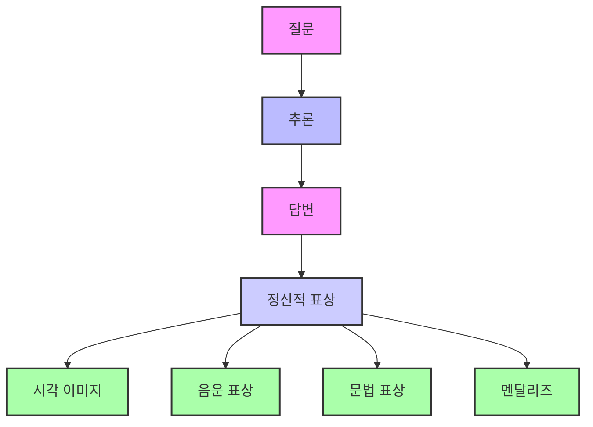
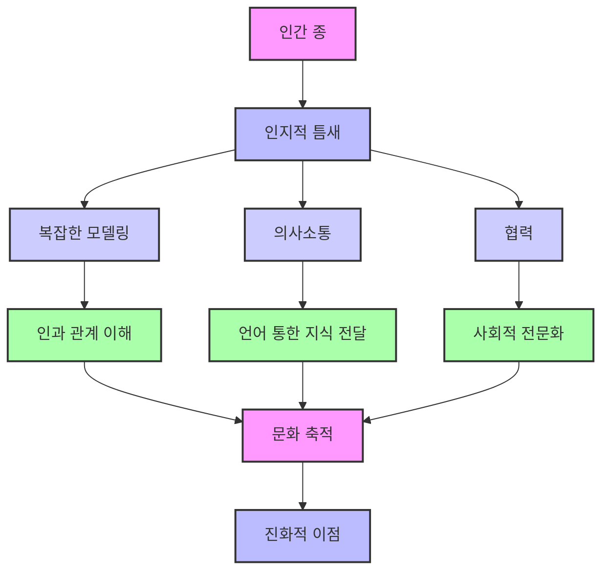
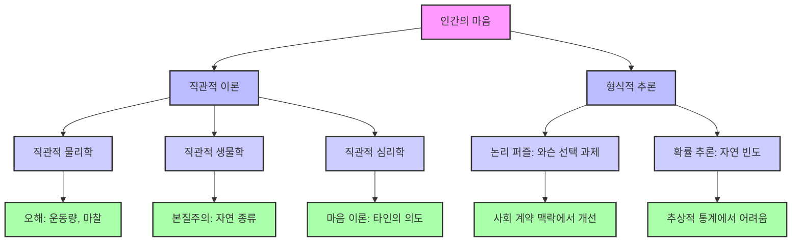
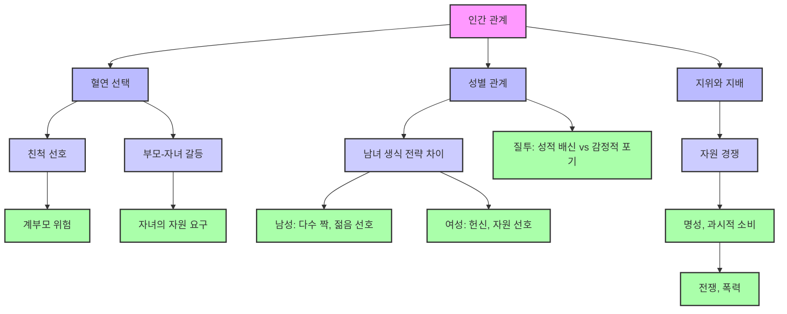

## 스티븐 핑커의 '마음은 어떻게 작동하는가' 요약
이 책은 인지 과학자 스티븐 핑커가 인간의 마음이 어떻게 작동하는지, 그리고 왜 그렇게 작동하는지를 진화론적 관점에서 설명하는 책이야. 우리의 생각, 감정, 행동이 수백만 년에 걸친 자연 선택의 결과로 어떻게 형성되었는지, 그리고 마음이 복잡한 계산 시스템처럼 작동한다는 것을 알려줄 거야.

## 1. 마음은 복잡한 계산 기계와 같아 

1. **마음은 단순하지 않아**: 우리가 매일 아무렇지 않게 하는 행동들, 예를 들어 접시를 치우거나 심부름을 하는 것 같은 일들도 사실은 엄청나게 복잡한 계산 과정이 숨어있어. 로봇이 이런 일을 쉽게 못 하는 걸 보면 알 수 있지. 
  - 마치 어린아이가 장난감을 선반에 올리는 단순한 행동도 시각 정보 처리, 움직임 조절, 공간 관계 이해 등 수많은 계산이 동시에 일어나는 거야. 
2. **마음은 뇌가 하는 일이야**: 핑커는 마음이 뇌가 하는 일이라고 설명해. 생각하는 것 자체가 정보를 처리하는 계산의 한 형태라고 보는 거지. 
  - 뇌는 감각 기관에서 데이터를 받아들이고, 자신만의 내부 언어와 상징으로 처리한 다음, 생각, 감정, 행동 같은 결과물을 만들어내는 생체 컴퓨터와 같아. 
3. **마음은 여러 시스템의 집합체야**: 마음은 신성한 불꽃이나 하나의 원리로 움직이는 게 아니라, 조상들이 살았던 환경에서 특정 문제들을 해결하기 위해 진화한 수많은 복잡한 시스템들로 이루어져 있어. 
  - 심리학은 마음이 무엇을 위해 만들어졌는지 분석해서 그 목적을 밝혀내는 '역공학'과 같다고 할 수 있어. 
4. **마음은 빈 서판이 아니야**: 마음은 아무것도 없는 빈 서판(blank slate)이 아니라, 정교한 계산 도구들, 즉 특정 영역의 정보를 처리하도록 정교하게 조정된 '모듈'들로 갖춰진 기본 장비와 같아. 
  - 이런 관점은 우리의 추론, 학습, 자기 인식 같은 능력들이 어떻게 진화 심리학을 통해 설명될 수 있는지 보여줘. 

## 2. 시각은 복잡한 재구성 과정이야 

1. **눈은 2D를 3D로 바꿔줘**: 우리의 눈은 망막에 평평한 2차원 이미지를 받아들이지만, 뇌는 이 이미지를 바탕으로 3차원 세계를 재구성해. 
  - 이 과정은 마치 퍼즐 조각을 맞춰서 전체 그림을 완성하는 것과 같아. 뇌는 세상이 어떻게 작동하는지에 대한 '가정'들을 이용해서 이 불가능해 보이는 일을 해내지. 
  - 예를 들어, 빛이 위에서 온다고 가정해서 그림자와 표면을 해석하는데, 이 때문에 착시 현상이 생기기도 해. 
2. **석탄과 눈을 구별하는 방법**: 뇌는 주변 조명을 보정해서 석탄과 눈을 구별해. 이건 고급 카메라도 하기 힘든 일이야. 
3. **깊이 인식도 재구성 작업이야**: 2차원 망막 이미지를 3차원 공간으로 해석하기 위해 단서와 경험 법칙(heuristics)을 사용하는데, 놀랍도록 정확할 때가 많아. 
  - 우리는 물체가 불투명하다고 가정해서 겹쳐진 이미지를 이해하는데, 이 가정이 깨지면 착시가 생길 수 있어. 
4. **모양 인식은 기적이야**: 초기 인공지능은 물체를 템플릿에 맞춰 인식하려 했지만, 크기, 방향, 조명 변화 때문에 실패했어. 
  - 하지만 우리는 글자나 얼굴이 왜곡되어도 쉽게 인식해. 뇌는 이런 일을 '특화된 적응 회로'를 사용해서 해내지. 
5. **움직임도 엄청나게 복잡해**: 바퀴는 예측 가능한 표면을 미끄러지듯 움직이지만, 다리는 다양한 지형을 이동할 수 있어. 하지만 엄청난 조율이 필요해. 
  - 걷는 건 '통제된 불안정성'이고, 달리는 건 '공중 발레'와 같아. 
  - 팔은 복잡한 삼각법 퍼즐을 실시간으로 푸는 '관절형 램프' 같고, 손은 로봇 공학자들이 꿈만 꾸는 정교함으로 다양한 질감과 무게의 물체를 잡고 조작해. 
  - 뼈가 없지만 민첩한 혀조차도 이런 설계의 탁월함을 보여주는 예시야. 

## 3. 마음의 모듈: 전문가 팀처럼 일하는 뇌 

1. **마음은 '정신 기관'들의 시스템이야**: 마음은 하나의 기관이 아니라, 여러 '계산 기관'들의 시스템으로 이루어져 있어. 
  - 이런 시스템들은 조상들이 수렵 채집 생활에서 직면했던 문제들을 해결하기 위해 자연 선택에 의해 형성되었어. 
  - 이것들은 오늘날의 학교, 관료제, 소프트웨어 세계를 위해 만들어진 게 아니야. 
2. **모듈은 특정 문제를 해결해**: 노암 촘스키가 '정신 기관'이라고 부른 '모듈' 개념은 '일반 지능'이나 '학습 능력' 같은 모호한 비유를 대체해. 
  - 각 모듈은 시각, 언어, 움직임, 사회적 추론 같은 고유한 문제를 해결해. 
  - 이 모듈들은 마치 도구 상자 속 독립적인 도구들이 아니라, 각자 전문화된 역할을 하지만 함께 작동하는 회사 내의 '연결된 부서'들과 같아. 
3. **모듈은 타고나는 거야**: 학습은 마법이 아니야. 특정 구조를 가진 학습 시스템 덕분에 가능한 것이고, 이에 대한 증거는 압도적이야. 
  - 떨어져 자란 일란성 쌍둥이는 놀랍도록 비슷한 행동 특성을 보여줘. 
  - 아기들은 경험으로 설명하기 어려울 정도로 세상에 대한 정교한 이해를 보여줘. 
  - 인간 문화는 겉으로는 다양해 보이지만, 공통된 심리적 기반 위에 세워져 있어. 
4. **타고나는 것과 배우는 것의 조화**: 그렇다고 모든 것이 유전적이라는 뜻은 아니야. '천성 대 양육' 또는 '유전자 대 문화' 같은 논쟁은 오해를 불러일으켜. 
  - 핑커는 복잡한 시스템은 풍부한 타고난 디자인을 가지고 있으면서도 입력에 지능적으로 반응할 수 있다고 말해. 
  - 고급 내장 기계를 가지고 있다고 해서 유연성이 제한되는 게 아니라, 오히려 향상되는 거야. 

## 4. 생각하는 기계: 마음의 언어와 논리 

1. **상식도 복잡한 계산이야**: '미혼 남성'이 누구인지 아는 것처럼 평범한 상식도 사실은 복잡한 계산 능력이야. 
  - 이 개념을 정확히 정의하려 하면 모순과 예외가 생기기 쉽지. 
  - 지능은 수많은 사실을 저장하는 것이 아니라, 기본적인 진실에서 '추론 규칙'을 사용해 함의를 도출하는 능력이야. 
2. **마음은 정보 처리 기계야**: 핑커는 '마음의 계산 이론'을 바탕으로 지능이 정보 처리의 한 형태라고 주장해. 
  - 마음은 질문을 추론을 통해 답변으로 바꾸는 기계인데, 이 과정은 숨겨진 구조에 의해 안내되는 역동적인 과정이야. 
3. **마음의 언어, '**멘탈리즈**'**: 뇌는 세상을 나타내는 '정신적 표상'이라는 내부 상징에 의존해. 
  - 이것은 우리가 말하는 언어(영어 등)가 아니야. 말하는 언어는 사회적 소통을 위해 최적화되어 있지만, '생각의 언어(mentalese)'는 완전히 명시적이어야 해. 
  - 멘탈리즈는 모호함이나 불필요한 단어가 없고, 뇌의 밀접하게 연결된 네트워크를 통해 직접 흘러. 
  - 마치 책을 읽고 정확한 단어는 잊어도 의미는 기억하는 것처럼, 우리의 지식은 추상적인 개념에 연결되어 있어. 
4. **네 가지 정신적 표상 형식**: 인간의 뇌에는 적어도 네 가지 표상 형식이 공존하고 협력해. 
  - **시각 이미지**: 2차원 캔버스에 그려진 것처럼 사물의 모습을 보여줘. 
  - **음운 표상**: 말하는 언어의 내부적인 메아리로, 단기 기억에 중요한 역할을 해. 
  - **문법 표상**: 단어와 구를 중첩된 구조로 인코딩해서 언어를 의미 있는 명제로 분석할 수 있게 해줘. 
  - **멘탈리즈**: 개념적 사고의 진정한 통화로, 어떤 외부 언어에도 얽매이지 않고 아이디어의 본질을 포착해. 
5. **계산 이론에 대한 비판과 반박**: 핑커는 존 설의 '중국어 방' 논증 같은 계산 이론에 대한 비판에 반박해. 
  - 설은 중국어를 이해하지 못하는 사람이 규칙에 따라 중국어 기호를 조작해서 유창한 답변을 만들어내는 상황을 상상했어. 이는 기호 조작이 진정한 이해가 아니라는 의미였지. 
  - 하지만 핑커는 이 사고 실험이 인지 자체보다는 '이해'라는 단어에 대한 우리의 직관을 더 많이 드러낸다고 반박해. 
  - 과학은 시스템이 어떻게 작동하는지에 대한 원리에 관심이 있지, 우리의 일상적인 이름과 일치하는지 여부에는 관심이 없다고 말해. 
6. **신경망의 한계**: 신경망은 퍼지 논리(fuzzy logic)와 연속적인 활동이 가능해서 인상적이지만, 인간 인지의 모든 범위를 설명할 수는 없어. 
  - 언어, 추론, 구성적 사고는 단순한 패턴 매칭 이상을 요구해. 
  - 신경망은 '구성성(compositionality)'에 어려움을 겪어. 문장에서 단어의 역할이 바뀌면 의미가 극적으로 변하는데, 단순한 분산 표상으로는 이런 유연성을 수용할 수 없어. 
  - 또한, 신경망은 '치명적인 망각(catastrophic forgetting)'에 취약해. 새로운 연관성을 학습하면 기존의 연관성을 지워버릴 수 있지. 
  - 반면 인간의 기억은 기능적으로 분할되어 있어. 개인적인 경험을 저장하는 '일화 기억'과 일반적인 지식을 저장하는 '의미 기억'이 있지. 
7. 재귀적 과정: 인간의 마음은 '재귀적 과정'을 통해 작동해. 이는 하나의 생각을 다른 생각 안에 포함시킬 수 있는 정신적 계산으로, 언어의 중첩된 구조를 반영해. 
  - 이 재귀적 메커니즘 덕분에 우리는 단순히 사실의 나열이 아니라, 아이디어에 대한 아이디어, 문장에 대한 문장처럼 '생각의 나선' 속에서 생각할 수 있어. 

## 5. 인지적 틈새: 인간을 특별하게 만드는 진화 전략 

1. **인간은 '인지적 틈새'를 차지한 유일한 종이야**: 핑커는 호모 사피엔스를 단순히 동물의 한 종이 아니라, '인지적 틈새(cognitive niche)'를 차지한 유일한 종으로 설명해. 
  - 이것은 지능을 나타내는 단순한 이름이 아니라, 복잡한 모델링, 의사소통, 협력을 통해 인과 관계의 법칙을 활용하는 진화 전략을 의미해. 
2. **지식은 우리의 통화야**: 우리는 타고난 본능이나 시행착오만으로 문제를 해결하지 않아. 대신, 상황에 맞춰 복잡한 행동 순서를 즉석에서 조율해. 
  - 세상의 인과 구조를 마음속으로 시뮬레이션해서 결과를 예측하고, 단순히 행동하는 것을 넘어 듣고, 보고, 추론해서 배워. 
  - 가장 중요한 것은, 우리가 배운 것을 언어를 통해 자손뿐만 아니라 넓은 공동체와 세대에 걸쳐 전달한다는 점이야. 
  - 덫을 만들거나 창을 깎는 방법을 발견한 사람은 그 통찰력을 말, 몸짓, 시연으로 전달할 수 있어. 배우는 사람은 과정을 다시 발명할 필요 없이 이득을 얻고, 가르치는 사람은 아무것도 잃지 않아. 
  - 지식의 이점은 물질적인 재화와 달리 공유한다고 해서 줄어들지 않고, 오히려 배가 돼. 
3. **문화는 지능의 증폭기야**: 이것이 바로 인지적 틈새의 본질이야. 아이디어가 창시자보다 오래 살아남아 문화로 축적되는 삶의 방식이지. 
  - 이런 시스템은 개인의 독창성뿐만 아니라 집단의 전문화를 촉진해. 기술이 분화되고, 역할이 주어지고, 전문 지식이 모이는 공동체가 진화하는 거야. 
  - 문화는 지능을 증폭시키는 역할을 해. 
  - 에너지 소모가 큰 긴 유년기는 학습에 대한 투자로서 진화적으로 의미가 있어. 
  - 이러한 지식 전달 시스템의 핵심에는 언어가 있어. 언어는 경험을 가르칠 수 있는 단위로 포장해서 다음 세대가 시행착오를 반복하는 수고를 덜어줘. 
4. **수렵의 중요성**: 핑커는 초기 인류 생활에서 종종 과소평가되는 '수렵'의 역할에 특별한 관심을 기울여. 
  - 수렵은 우리 종을 형성하는 결정적인 힘이었어. 고기는 높은 칼로리와 영양분을 제공해서 인간 뇌의 비싼 에너지 예산을 가능하게 했지. 
  - 육식 동물은 초식 동물에 비해 몸집 대비 뇌가 상대적으로 큰 경향이 있는데, 우리 조상도 마찬가지였어. 
  - 수렵은 방목과 달리 고도의 계획, 협력, 정밀함을 요구해. 행동하기 전에 마음속으로 세상을 모델링할 수 있는 사람에게 보상을 주었어. 
5. **사회적 역학으로서의 고기 공유**: 고기 생산의 사회적 차원은 흥미로운 경제적 역학을 만들어내. 
  - 사냥꾼이 자신이 소비할 수 있는 것보다 더 큰 사냥감을 잡으면 '부패'라는 문제가 생겨. 냉장 시설이 없으니, 고기를 다른 사람들과 나누어 '사회적 자본'으로 투자하는 것이 최선의 전략이야. 
  - 오늘 받은 사람은 내일 보답할 가능성이 높지. 이런 식으로 고기 공유는 '동맹 구축' 전략이자, 운의 불확실성에 대비한 '생물학적 보험'이 돼. 
6. **문화 진화는 생물학적 진화를 대체하지 않아**: 핑커는 문화 진화가 생물학적 진화를 대체했다는 주장에 이의를 제기해. 
  - '밈(meme)'이라는 개념, 즉 유전자처럼 복제되는 문화 단위라는 생각은 문화와 생물학 모두에 대한 오해라고 지적해. 
  - 문화적 혁신은 유전적 돌연변이와 달리 무작위적이지 않아. 집중된 노력, 창의적인 통찰력, 의식적인 개선을 통해 발생해. 
  - 훌륭한 아이디어는 복사 오류의 산물이 아니라, 지속적인 정신 작업의 결과야. 누군가가 생각하고, 시험하고, 다듬고, 설계하는 과정이지. 
  - 문화적 진보는 우연이 아니라 의도적인 향상 때문에 누적되는 거야. 각 반복은 이전의 성공과 실패를 바탕으로 이루어져. 
  - 예술, 과학, 도구, 아이디어는 비판, 경쟁, 개선을 통해 진화하는 것이지, 사고의 무의미한 선택을 통해서가 아니야. 
  - 문화 진화는 실제로 존재하지만, 생물학적 진화에 의해 창의적이고, 전략적이며, 협력적인 방향으로 다듬어진 '마음'에 의해 주도돼. 

## 6. 좋은 아이디어: 직관적 이론과 추론의 한계 

1. **마음은 착시에 취약해**: 인간의 지능은 다른 종에 비해 놀랍도록 뛰어나지만, 우리의 합리적인 능력을 과대평가해서는 안 돼. 
  - 우리의 마음은 시각적인 착시뿐만 아니라 '인지적인 착시'에도 취약해. 
  - 심리학적 설명은 종종 모호하게 느껴지는데, 이는 모호한 정신 현상을 다른 모호한 정신 현상으로 설명하기 때문이야. 
2. **마음은 전문화된 모듈의 모자이크야**: 인간의 마음은 일반적인 추론 엔진이라기보다는, 각기 다른 유형의 문제를 처리하도록 진화한 '전문화된 모듈'들의 모자이크에 가깝다고 볼 수 있어. 
  - 이것들은 만능 도구가 아니라, 특정 영역의 구조화된 규칙성을 다루도록 정교하게 조정된 도구들이야. 
3. **직관적 이론**: 핑커는 우리가 현실의 여러 분야에 대한 '직관적 이론'을 가지고 있다고 제안해. 이것들은 순진하지만 종종 유용해. 
  - 직관적 물리학: 물리적 물체가 어떻게 움직이고 상호작용하는지에 대한 기본적인 감각을 줘. 
  - 예를 들어, 개를 차에 태우고 가면 개가 마당에 없다는 것을 알지. 
  - 하지만 이 '민속 물리학'은 과학의 기준으로는 오개념으로 가득 차 있어. 
  - 공을 던질 때, 사람들은 종종 공이 먼저 위로 밀렸다가 멈춘 다음 중력에 의해 다시 끌려 내려온다고 상상해. 하지만 실제로는 비행 내내 중력만이 작용해. 
  - **직관적 생물학**: 살아있는 것들과 그것들이 어떻게 분류되는지에 대한 감각을 줘. 
  - 사람들은 모든 종의 구성원이 공유하는 보이지 않는 본질에 기반한 '자연 종류(natural kinds)'를 자연스럽게 믿어. 
  - 우리는 금을 금으로 만드는 것이 무엇인지 정확히 알지 못해도(예: 원자 번호 79), 어떤 깊은 속성이 있다고 믿어. 
  - 이 '본질주의적 직관'은 생물학적 종류를 인공물(의도된 기능으로 정의되는 인간이 만든 물체)과 구별해. 
  - 런던을 허물고 100마일 떨어진 곳에 다시 짓는다면 여전히 런던일까? 런던은 건물뿐만 아니라 물리적 변화에도 강한 추상적인 정체성을 가지고 있어. 
  - 직관적 심리학** (마음 이론)**: 사회 세계를 탐색할 수 있게 해줘. 
  - 빌이 할머니를 방문하고 싶어서 버스를 탔고, 버스가 그를 그곳으로 데려다줄 것이라고 믿었다는 것을 이해할 수 있게 해줘. 
  - 이 마음 이론은 타고나고, 강력하며, 인간 상호작용에 필수적이야. 다른 사람의 의도, 믿음, 감정을 놀랍도록 민감하게 해석할 수 있게 해줘. 
  - 자폐증을 가진 아이들은 마음 읽기에 어려움을 겪을 수 있어. 
4. **형식적 추론의 한계**: 우리는 논리적인 사고를 한다고 생각하지만, 실험적 증거는 더 냉정한 그림을 보여줘. 
  - 와슨 선택 과제: 추상적인 용어로 제시될 때 대부분의 참가자를 혼란스럽게 하는 간단한 논리 퍼즐이야. 
  - 하지만 동일한 논리 구조가 '사회 계약'의 맥락(누가 누구에게 무엇을 빚지고 있는지에 대한 규칙)에 포함되면 사람들은 쉽게 해결해. 
  - 리타 코스미데스는 규칙이 의무나 속임수를 포함할 때 사람들이 '사기꾼'을 찾아내는 데 매우 능숙해진다는 것을 발견했어. 
  - 이는 우리가 일반적인 논리 모듈을 사용하는 것이 아니라, 사회생활에서 규칙 위반을 감지하기 위해 다듬어진 '인지적 적응'을 사용한다는 것을 의미해. 
  - **숫자와 확률**: 우리는 '아날로그 크기 시스템'이라는 모호한 많고 적음의 감각을 가지고 있고, 때로는 이것을 숫자선 같은 공간 이미지로 번역해. 
  - 하지만 우리는 또한 숫자와 정확한 양을 연결하고, 이 표상에 대한 연산을 수행하는 법을 배워. 
  - 핑커는 우리가 확률적 추론에 서투르다는 점을 강조해. 특히 추상적인 통계 언어로 표현될 때 더욱 그렇지. 
  - 놀랍게도, 확률이 '자연 빈도'(실제 경험에 기반한 구체적인 수치)로 재구성될 때 우리는 훨씬 더 잘 해내. 
  - 이 발견은 마음이 이론적인 확률이 아니라, 환경에서 자주 발생하는 패턴을 추적하도록 진화했다는 것을 시사해. 
5. **창의성과 천재성**: 창의성과 천재성은 갑작스러운 영감이나 신성한 뮤즈의 낭만적인 개념과는 달라. 
  - 핑커는 모든 인간이 창의적이라고 주장해. 
  - 천재를 특별하게 만드는 것은 근본적으로 다른 사고 방식이 아니라, 평범한 인지 도구를 적용하는 데 있어서 '희귀한 강도의 노력, 훈련, 독창성'이야. 
  - 발명, 통찰력, 예술 작품은 무의식에서 완전히 형성되어 튀어나오는 것이 아니라, 오류와 수정을 통해 고통스럽게 형성되고, 다듬어지고, 때로는 우연히 발견되는 거야. 
  - 천재성의 불꽃은 형이상학적인 미스터리가 아니야. 기억, 연상, 추상화, 은유 같은 친숙한 장작에서 피어난 불과 같아. 

## 7. 감정: 생존과 번식을 위한 전략적 도구 

1. **감정은 진화적 적응이야**: 인간의 감정, 특히 격렬하고 파괴적인 감정은 우리의 사회생활의 중심에 있어. 
  - 핑커는 감정이 원시적인 뇌의 잔재가 아니라, 진화에 의해 형성된 생물학적으로 적응적인 반응이라고 주장해. 
  - 감정은 비합리적인 폭발이 아니라, 그럴 만한 이유가 있는 기능이야. 
  - 감정은 뇌가 '적합성을 향상시킬 기회'가 있을 때 가장 중요한 우선순위를 설정하는 시스템 역할을 해. 
  - 마치 동물이 배고픔과 갈증을 동시에 느낄 때, 어떤 목표에 집중할지 결정하는 것처럼, 감정은 우리의 목표를 중요도 순으로 배열하는 데 도움을 줘. 
2. **혐오감**: 혐오감은 보편적으로 표현되는 감정으로, 문화 전반에 걸쳐 음식 금기로 이어져. 
  - 하지만 핑커는 이런 금지가 위생에 관한 것이 아니라, '사회적 정체성'과 '에너지 경제학'에 관한 것이라고 제안해. 
  - 사람들은 질병 때문이 아니라, 이런 음식 선택이 문화적 경계를 긋거나 칼로리 투자로서 실패하기 때문에 벌레나 돼지를 피하는 거야. 
  - 혐오감은 잠재적으로 오염된 동물성 물질을 섭취하는 것을 피하는 데 도움을 줘. 
  - 어린 시절의 혐오감은 '세균 전염'에 대한 초기 이해와 관련이 있어. 
3. **행복**: 행복은 최종 상태가 아니라 '신호 시스템'이야. 
  - 행복은 우리가 유익한 조건을 찾고, 일단 찾으면 그것을 유지하도록 동기를 부여해. 
  - 하지만 빛에 적응하는 눈동자처럼, 우리는 변화에 적응해. 이 적응 때문에 행복은 영구적인 성취가 되지 못하고, 우리는 '행복 쳇바퀴(happiness treadmill)'에 갇혀 끊임없이 개선을 쫓지만 결코 만족하지 못하게 돼. 
  - 오직 '상대적인 이득'만이 기쁨을 가져다주고, 절대적인 성공은 빠르게 무뎌져. 
4. **자기 통제**: 우리는 종종 단기적인 충동에 휘둘려. 장기적인 비용을 알면서도 말이야. 
  - 핑커는 자기 통제를 '현재의 자아'와 '미래의 자아' 사이의 싸움으로 설명해. 
  - 우리의 조상들은 미래를 항상 확신할 수 없었기 때문에, 즉각적인 보상을 잡는 것이 생존을 위한 최선의 전략일 때가 많았어. 
  - 이런 본능은 여전히 우리 뇌에 남아있어. 
5. **이타주의**: 핑커는 동물, 특히 인간이 '종의 이익'을 위해 행동한다는 개념을 해체해. 
  - 대신, 유전자가 선택의 단위이며, 유전자는 때로는 친절함을 통해 자신의 뜻을 따르도록 뇌를 구성한다고 말해. 
  - 이타주의가 번성하는 두 가지 주요 경로가 있어. 
  - 혈연 선택**(**kin selection**)**: 유전자를 공유하기 때문에 친척을 선호하는 경우야. 
  - 상호 이타주의**(**reciprocal altruism**)**: 비친척 간에 협력이 통화처럼 교환되는 경우야. 
  - 이것은 우리가 '무임승차자'를 감지할 수 있을 때만 작동해. 
  - 따라서 우리의 마음은 '사기꾼 감지기'를 갖추고 있어. 
  - 이것이 우리가 냉소적인 자동 인형이라는 의미는 아니야. 연민과 감사의 감정은 진실할 수 있는데, 진실한 감정이 종종 더 나은 협력을 만들어내기 때문이야. 
6. **사랑**: 낭만적인 사랑은 가장 역설적인 감정일 거야. 왜 다른 모든 사람 중에서 이 사람을 선택할까? 
  - 하지만 그 비합리성이 핵심이야. 사랑이 이성적이라면 취소될 수도 있겠지. 
  - 우리가 사랑의 손아귀에서 무력함을 느끼는 사실이 사랑의 선언을 더 신뢰할 수 있게 만들어. 
  - "당신을 사랑하지 않을 수 없어요"는 "당신이 최적의 짝이라고 결정했어요"보다 더 설득력이 있어. 
  - 사랑은 논리적이지 않지만, 그 비논리성이 어떤 논리에 봉사하는 거야. 

## 8. 가족 가치: 혈연, 성별, 지위의 진화적 역학 

1. **가족 관계의 진화적 논리**: 핑커는 유토피아적인 조화의 비전과 우리의 타고난 동기가 종종 갈등을 초래하는 현실을 대조하며 이야기를 시작해. 
  - 자연 선택은 유전자가 스스로를 번식시키기 위한 경쟁에 의해 움직여. 
  - 번식은 종종 한 유기체가 다른 유기체를 희생시켜 이득을 얻는 것을 포함해. 
  - 하지만 이것이 협력이나 관대함이 배제된다는 의미는 아니야. 오히려 그런 특성들은 생존의 산술이 유리할 때만 진화해. 
2. **혈연 선택의 특이한 논리**: 인간은 친척과 낯선 사람, 부모와 자녀, 형제자매, 연인, 경쟁자, 적 등 다른 사람들을 다루기 위한 별개의 인지적, 감정적 시스템을 갖추고 있어. 
  - 이 시스템들은 임의적인 것이 아니라, '혈연 선택(kin selection)'의 특이한 논리를 반영해. 
  - 우리는 본질적으로 우리 자신의 계보를 이해하려는 동기를 가지고 있어. 
  - **계부모의 위험**: 가장 충격적인 사실 중 하나는 계부모가 초래하는 위험이야. 계부모와 함께 사는 아이들은 친부모와 함께 사는 아이들보다 학대의 피해자가 될 확률이 통계적으로 40~100배 더 높아. 
  - 혈연 선택의 잔인한 논리가 이 불일치를 설명해. 계부모는 배우자의 자녀에게 유전적 투자를 공유하지 않아. 
3. **부모-자녀 갈등**: 부모는 순전히 이기적이지 않고, 자녀도 완전히 자기중심적이지 않아. 
  - 하지만 갈등은 발생해. 자녀는 종종 부모가 기꺼이 주려는 것보다 더 많은 것을 원해. 
  - 형제자매를 죽이도록 유도하는 유전자는 평균적으로 자신의 복사본을 50%의 확률로 파괴할 위험이 있어. 
  - 이 계산은 형제자매 이타주의가 존재하는 이유를 설명하지만, 자기 이익에 비해 종종 할인돼. 
  - 부모는 자녀에게 형제자매 간의 협력을 더 강하게 심어주려 하고, 자녀는 자신의 자원과 시간을 덜 소모하려 하기 때문에 목표가 달라. 
4. **성별 관계**: 핑커는 남성과 여성이 서로 다른 번식적 이해관계를 가지고 있지만, 번식을 위해 협력해야 한다는 핵심적인 역설을 강조해. 
  - 서로의 DNA에 대한 필요성이 '사랑'을 낳아. 사랑은 공유된 유전적 이해관계를 보호하기 위해 설계된 생물학적으로 고정된 동맹이야. 
  - **성적 동기의 차이**: 남성과 여성은 성적 동기에서 차이를 보여. 연구에 따르면 남성은 캐주얼한 만남에 더 개방적이야. 
  - 남성의 번식 성공은 그가 짝짓기하는 여성의 수에 비례하지만, 여성의 번식 성공은 첫 번째 파트너 이후에는 줄어들어. 
  - 남성은 여러 여성과 짝짓기함으로써 번식 성공 가능성을 높일 수 있어. 
  - 여성은 자녀에게 상당한 투자를 해야 하므로 짝을 신중하게 선택함으로써 번식 성공을 높일 수 있어. 
  - **짝 선택**: 여성은 야망, 자원, 신뢰성, 정서적 안정성 등 자녀에게 투자할 수 있는 능력을 시사하는 특성을 가진 파트너를 찾는 경향이 있어. 
  - 반대로 남성은 젊음과 신체적 매력, 즉 다산과 유전적 품질의 단서에 끌려. 
  - 이러한 패턴은 문화 전반에 걸쳐, 심지어 개인 광고에서도 반복돼. 
  - **질투**: 질투는 깊이 뿌리박고 성별에 따라 다른 감정으로 탐구돼. 남성은 성적 배신을 두려워하고, 여성은 정서적 포기를 두려워해. 
5. **지위와 지배**: 핑커는 인간이나 동물이 모든 자원을 놓고 죽을 때까지 싸운다는 생각을 부정해. 
  - 의례적인 경쟁, 힘의 과시, 전략적 후퇴가 훨씬 더 흔해. 
  - '명성'이 지배의 진정한 통화가 돼. 
  - 단순한 모욕이나 밀치기 때문에 발생하는 살인은 남성이 자신의 사회적 지위를 얼마나 맹렬하게 방어하는지 보여줘. 
  - 핑커는 '과시적 소비(conspicuous consumption)'도 탐구해. 이는 공작의 꼬리처럼 화려하지만 기능적으로는 쓸모없는, 지위 신호로서의 낭비적인 사치를 과시하는 행위야. 
6. **갈등을 넘어선 협력**: 갈등의 불가피성 속에서도 핑커는 조심스러운 낙관론을 제시해. 
  - 전쟁이 우리의 심리적 구조에 짜여 있듯이, 그것을 초월할 수 있는 능력도 마찬가지야. 
  - 역사 전반에 걸쳐 인간은 수사학, 화해, 억지력, 법, 일부일처제 같은 '문화적 기술'을 개발하여 진화된 본성을 협력과 문명으로 이끌었어. 

## 9. 삶의 의미: 예술, 종교, 철학의 진화적 뿌리 

1. **생존과 번식을 넘어선 인간 경험**: 책의 마지막 부분은 생존과 번식의 잔인한 실용주의와는 동떨어져 보이는 인간 경험의 수수께끼 같은 영역으로 향해. 
  - 핑커는 예술, 종교, 철학 같은 분야에 주목해. 이 활동들은 다윈주의적 관점에서는 설명하기 어려운 것처럼 보여. 
  - 인간은 빵만으로 살지 않아. 우리는 명백한 생물학적 필요가 없는 추구에 엄청난 시간, 에너지, 부를 쏟아부어. 
  - 이야기를 하고, 시를 읊고, 농담을 하고, 노래하고, 춤추고, 장식하고, 의식을 행하고, 초자연적인 것을 숙고하는 것들이 여기에 해당해. 
2. **음악은 '**청각 치즈케이크**'와 같아**: 이런 호기심 중에서도 음악은 특별한 주목을 받아. 
  - 음악이 보편적인 언어라는 흔한 클리셰와 달리, 핑커는 이 생각이 오해를 불러일으킨다고 주장해. 
  - 음악적 선호는 놀랍도록 지역적이며, 자신이 자란 스타일에 묶여 있고, 낯선 화음은 문화 간에 공감대를 형성하지 못할 때가 많아. 
  - 음악은 '청각 치즈케이크'와 같아. 뇌의 진화된 능력을 자극하기 위해 만들어진 소리의 과자 같은 것이지. 
  - 언어라기보다는, 적어도 여섯 가지의 다른 정신 모듈을 납치하는 '초정상 자극(supernormal stimulus)'의 부산물이야. 
  - 음악은 말의 메커니즘, 특히 억양 패턴과 리듬 구조를 빌려오지만, 그 자체로는 의사소통 방식이 아니야. 
  - 음악은 우리가 다른 이유로 진화시킨 청각 구조를 활용하는 거야. 
3. **픽션은 진화적 논리를 반영해**: 픽션(소설, 이야기 등)은 가장 정교한 상상의 세계조차도 진화적 논리에서 벗어나지 않아. 
  - 유기체의 근본적인 동기인 생존과 번식은 육체뿐만 아니라 이야기의 구조에도 생명을 불어넣어. 
  - 이야기는 일반적으로 사랑, 섹스, 질투, 혈연, 복수, 폭력을 중심으로 전개돼. 
  - 다양한 형태의 픽션은 우리 종의 깊은 관심사를 반영하며, 그 서사적 살점 아래에 진화적 청사진을 드러내. 
4. **유머는 지위 하락을 통해 웃음을 유발해**: 유머는 잔인함만으로 웃음을 유발하는 것이 아니라, 누군가가 부당하게 주장하는 '존엄성의 파열'에서 웃음을 유발해. 
  - 농담은 희생자의 지위를 미묘하게 낮추는데, 종종 허세나 권위를 겨냥해. 
  - 유머는 허세를 꿰뚫고 의식을 조롱해. 특히 그 의식이 우리의 적이나 상사의 지위를 강화할 때 더욱 그렇지. 
  - 가장 세련된 농담은 청중의 추론을 조작하여, 그들이 마지못해 받아들이는 전제로부터 스캔들 같은 결론으로 이끄는 것들이야. 
5. **종교는 인간의 권력을 확보하는 수단이야**: 종교적 믿음은 단일한 충동이 아니라, 법, 관습, 금기를 갖춘 광범위한 대안 문화로 검토돼. 
  - 핑커는 종교 기관이 필멸의 존재를 신성한 힘과 연결하기보다는, 인간 중개자들을 위해 '세속적인 권력'을 확보하는 역할을 한다고 제안해. 
  - 예를 들어, 조상 숭배는 죽음에 가까워진 사람들의 관점에서 영리한 아이디어야. 산 사람들이 조상을 숭배하도록 가르치면, 부모는 세상을 떠난 후에도 자손에게 보상을 받을 수 있어. 
  - 음식 금지는 외부인과의 친목을 막아 집단 정체성을 강화할 수 있고, 고통스러운 입문 의식은 무임승차자(소속 비용을 지불할 의사가 없는 사람)를 걸러내는 역할을 해. 
  - 샤먼이나 사제의 역할도 비슷하게 신비화가 해체돼. 이들은 초자연적인 에너지를 전달하기보다는, '연극적인 설득의 기술'을 마스터해. 
  - 그들은 인지적 착시, 극적인 의식, 상징적인 유물을 활용하여 신성한 영역에 특권적인 접근 권한이 있다는 인상을 만들어내. 
6. **삶의 의미는 진화된 마음의 산물이야**: 핑커의 해석에 따르면, 인간 경험의 가장 영적인 부분들, 즉 신비주의, 신성한 경외심, 초월조차도 '적응의 냉철한 논리'로 거슬러 올라갈 수 있어. 
  - 그것들은 신성한 영감에서 나오는 것이 아니라, 협력, 조작, 소속감을 위한 복잡한 전략에 참여하는 '진화된 마음'에서 비롯돼. 
  - 결론적으로, 우리 삶에서 가장 고상하거나 초월적으로 보이는 것들이 종종 '진화된 마음의 가장 깊은 명령'을 반영하는 거울임이 밝혀져. 
  - 시적인 풍부함을 가진 '의미'는 반드시 초자연적인 영혼의 표식이 아니라, 한때 그저 견디고 번식하기만을 요구했던 세상을 이해하기 위해 자연 선택에 의해 조각된 마음이 남긴 패턴인 거야. 

