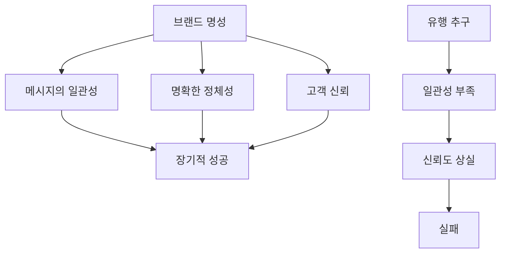
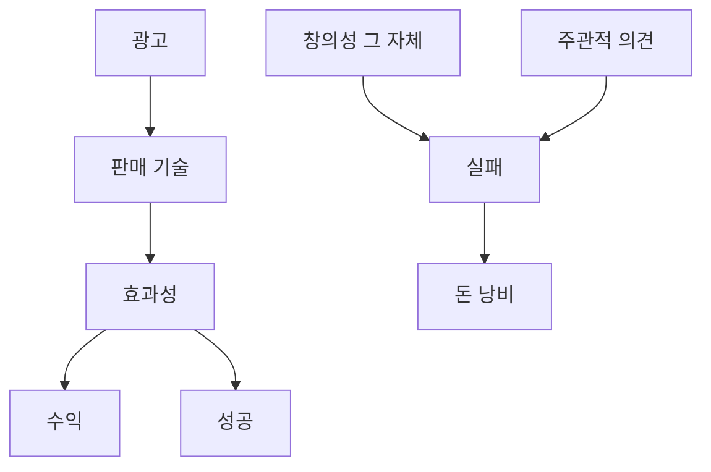

## 데이비드 오길비의 광고 불변의 법칙: 팔거나 죽거나!
이 책은 광고를 예술이 아니라 판매를 위한 정보 전달 수단으로 보는 데이비드 오길비의 철학을 담고 있어. 그는 수십 년간의 경험을 바탕으로 사람들의 마음을 움직여 행동하게 만드는 광고 원칙들을 알려주고 있어. 광고를 만들거나 사업을 하는 사람이라면, 이 책을 통해 광고의 본질과 성공적인 광고 전략을 배울 수 있을 거야.

## 1. 팔거나 죽거나: 광고의 유일한 목표는 판매야 

1. **광고는 판매를 위한 거야.** 
  1. 광고는 예쁘거나 기발한 게 중요한 게 아니야. 
  2. 오직 물건을 팔아서 돈을 버는 게 광고의 유일한 목표라고 보면 돼. 
  3. 판매로 이어지지 않는 창의성은 그냥 자기만족일 뿐이야. 
2. **데이비드 오길비의 **롤스로이스** 광고가 좋은 예시야.** 
  1. 1958년에 나온 이 광고는 "시속 60마일로 달릴 때, 이 새로운 롤스로이스에서 가장 시끄러운 소리는 전기 시계 소리입니다"라는 문구 하나로 엄청난 판매를 기록했어. 
  2. 이 광고는 구매자의 심리를 정확히 꿰뚫었어. 
  3. 정밀함과 품질을 중요하게 생각하는 사람들에게 '이 차는 완벽한 명품'이라는 메시지를 전달한 거지. 
3. **펩시의 켄달 제너 광고는 실패한 사례야.** 
  1. 이 광고는 사회적 의식을 보여주려는 시도였지만, 전략 없이 창의성만 쫓다가 오히려 역효과를 냈어. 
  2. 펩시를 팔지도 못했고, 사람들과 공감대도 형성하지 못했어. 
  3. 그냥 바이럴(입소문)만 노린 광고였고, 행동으로 이어지지 않는 관심은 아무 의미가 없어. 
4. **코카콜라의 '**Share a Coke**' 캠페인은 성공했어.** 
  1. 이 캠페인은 예술적이라서 성공한 게 아니야. 
  2. 소비자들의 이름을 병에 넣어 개인적인 경험을 만들어주고, 즉각적인 참여를 유도해서 판매를 급증시켰어. 
5. **광고는 과학적인 실험과 같아.** 
  1. 1920년대 클로드 홉킨스는 광고를 통제된 실험처럼 다루면서 업계를 혁신했어. 
  2. 그는 헤드라인을 테스트하고, 결과를 측정해서 판매로 이어지지 않는 건 모두 버렸어. 
  3. 아마존의 제프 베조스도 멋진 광고보다는 고객이 뭘 원하는지에 집착해서 성공했어. 
  4. 광고는 다른 마케터들에게 깊은 인상을 주려는 게 아니라, 고객에게 봉사하는 것이어야 해. 
6. **핵심은 간단해.** 
  1. 광고가 측정 가능한 수익을 내지 못하면 실패한 거야. 
  2. 예술은 박물관에나 있는 거지, 광고에는 없어. 
  3. 소비자에게 집중하고, 그들이 무엇에 반응하는지 연구해야 해. 
  4. 광고가 구매로 이어지는지 여부만이 유일한 기준이야. 

## 2. 연구가 천재성을 이긴다: 데이터 기반의 접근 

1. **광고에는 천재성이란 없어.** 
  1. 오직 철저한 연구와 훈련된 실행만이 있을 뿐이야. 
  2. 영감으로 세계를 바꾸는 아이디어를 만들어내는 '고독한 천재' 신화는 그저 신화일 뿐이야. 
  3. 성공은 번뜩이는 아이디어에서 나오는 게 아니라, 고객을 그들 자신보다 더 잘 아는 데서 나와. 
2. **오길비는 데이터를 기반으로 성공했어.** 
  1. 그는 광고 문구를 쓰기 전에 몇 주, 심지어 몇 달 동안 고객 행동을 연구했어. 
  2. 조지 갤럽의 소비자 심리 연구를 흡수하면서, 훌륭한 캠페인은 직감이 아니라 냉철한 사실에서 나온다는 걸 깨달았지. 
3. **해더웨이 셔츠 광고가 좋은 예시야.** 
  1. 이 광고는 단순히 기발한 아이디어가 아니었어. 
  2. 사람들이 권위와 특별함을 어떻게 인식하는지에 대한 꼼꼼한 연구 결과였어. 
  3. 모델에게 평범한 정장 대신 '안대'라는 예상치 못한 디테일을 추가했어. 
  4. 이 안대는 단순한 장치가 아니라, 권위와 미스터리의 상징에 인간의 마음이 어떻게 반응하는지에 대한 연구를 바탕으로 한 심리적 장치였어. 
  5. 이 광고는 제품을 보여주는 것을 넘어, 하나의 인물과 스토리를 만들어 사람들이 멈춰 서서 보게 만들었고, 해더웨이 셔츠는 미국에서 가장 많이 팔리는 셔츠 중 하나가 되었어. 
4. **현대 광고는 종종 실패해.** 
  1. 요즘 브랜드들은 왜 성공하는지 이해하지 못한 채 유행을 쫓아. 
  2. 수백만 달러를 들인 슈퍼볼 광고들이 유머나 볼거리, 유명인 출연에만 집중하다가 실제 설득에는 실패하는 경우가 많아. 
5. **프록터 앤드 갬블(P&G)의 '엄마에게 감사' 캠페인은 성공했어.** 
  1. 이 캠페인은 깊은 감정적 유발 요인에 대한 연구를 바탕으로 만들어졌어. 
  2. P&G는 직감에 의존하지 않고, 소비자, 특히 엄마들에게 무엇이 공감을 얻는지 연구해서 데이터 기반의 감성적인 캠페인을 만들었어. 
  3. 그 결과, 올림픽 기간을 넘어 판매와 브랜드 충성도가 직접적으로 증가했어. 
6. **스티브 잡스도 연구의 대가였어.** 
  1. 그는 MP3 플레이어나 스마트폰을 발명한 게 아니야. 
  2. 기존 제품의 문제점을 연구하고, 소비자들이 실제로 뭘 원하는지 이해해서 사용자 경험을 철저하게 개선했어. 
  3. 애플의 성공은 직감이 아니라 인간 행동을 연구하고 그에 맞춰 디자인한 결과야. 
7. **페이스북과 구글의 광고 플랫폼이 성공한 이유야.** 
  1. 이들은 창의성만 의존하지 않아. 
  2. 수천 개의 A/B 테스트를 실행해서 모든 캠페인을 실시간으로 최적화해. 
  3. 가장 효과적인 단어, 이미지, 행동 유도 문구는 예술적 의견이 아니라 측정 가능한 연구 기반 결과로 결정된다는 걸 이해하고 있어. 
8. **성공적인 광고를 만들려면.** 
  1. 영감을 쫓지 말고, 심리학, 행동, 시장 데이터를 연구해야 해. 
  2. 연구 보고서를 읽고, 소비자 패턴을 분석하고, 질문하고, 테스트하고, 모든 걸 개선해야 해. 
  3. 자신을 위해서가 아니라 고객을 위해 글을 써야 해. 

## 3. 명확성이 승리한다: 혼란스러운 메시지는 판매로 이어지지 않아 

1. **혼란스러운 사람은 구매하지 않아.** 
  1. 최고의 광고는 아주 명확해서 단 하나의 거부할 수 없는 아이디어로 소음을 뚫고 들어가. 
  2. 조금이라도 모호하면 판매를 잃게 돼. 
  3. 고객이 메시지를 해독하려고 멈칫하는 순간, 이미 고객을 잃은 거야. 
2. **데이비드 오길비는 모호함을 싫어했어.** 
  1. 그는 모호함을 현대 광고의 질병이라고 불렀어. 
  2. 약한 마케터들은 영리함이 설득의 핵심이라고 믿지만, 명확성만큼 설득력 있는 건 없어. 
  3. 소비자들은 매일 수천 개의 마케팅 메시지에 압도당하고 있어. 
  4. 광고가 간단하고, 직접적이며, 즉시 이해되지 않으면 소음 속에 사라져 버릴 거야. 
3. 슈웹스**(Schwep) 캠페인이 명확성의 좋은 예시야.** 
  1. 오길비는 '상쾌함' 같은 모호한 표현 대신, 영국 신사 같은 '화이트헤드 사령관'이라는 실제 인물을 등장시켰어. 
  2. 이것은 세련된 사람들을 위한 프리미엄 음료라는 메시지를 분명하게 전달했고, 판매가 급증했어. 
4. **정치 캠페인에서도 명확성이 중요해.** 
  1. 버락 오바마의 2008년 슬로건 'Yes We Can'은 세 단어로 의미가 분명하고 오해의 여지가 없었어. 
  2. 반면, 모든 사람에게 어필하려다가 아무 내용도 전달하지 못하는 복잡한 메시지는 실패해. 
5. **현대 브랜딩은 종종 실패해.** 
  1. 너무 많은 회사들이 기능보다 미학을 우선시해. 
  2. 추상적인 슬로건이나 예술적인 비주얼이 큰 역할을 할 거라고 생각하지만, 메시지가 즉시 명확하지 않으면 캠페인은 실패해. 
  3. 코카콜라의 'Open Happiness'는 간단하고 강력하며 보편적이야. 
  4. 펩시의 켄달 제너 광고는 사회 정의를 언급하려 했지만, 너무 모호하고 시대착오적이어서 오히려 고객들을 멀어지게 했어. 
6. **애플은 항상 명확성의 힘을 이해했어.** 
  1. 초기 광고들을 보면 제품의 간단한 이미지와 직접적인 메시지만 있었어. 
  2. 오리지널 아이팟 캠페인은 기술 사양을 장황하게 설명하지 않고, "주머니 속 천 곡"이라고만 말했어. 
  3. 전문 용어나 불필요한 내용 없이, 명확한 가치 제안을 한 거야. 
7. **테슬라의 광고도 마찬가지야.** 
  1. 일론 머스크는 복잡한 기술 용어 대신, 테슬라를 '미래의 운송 수단'으로 간단하게 표현했어. 
  2. 이 명확한 비전이 수요를 이끌었어. 
8. **명확성은 광고를 넘어 모든 분야에 적용돼.** 
  1. 스티브 잡스는 애플이 만드는 모든 것에서 단순함을 요구했어. 
  2. 아이폰 인터페이스가 복잡하자, "6살짜리도 쓸 수 있을 만큼 간단해야 한다"고 말했어. 
  3. 이러한 명확성에 대한 고집이 애플 제품을 직관적이고 매력적으로 만들었어. 
9. **오길비는 훌륭한 광고가 훌륭한 저널리즘처럼 만들어진다고 믿었어.** 
  1. 불필요한 단어나 의미 없는 문구 없이, 행동을 유도하는 핵심 사실만 담아야 해. 
  2. 그는 광고를 쓴 다음 50%를 줄이고, 다시 50%를 줄이라고 조언했어. 
  3. 그 결과, 불필요한 내용 없이 명확하고 강력한 메시지를 전달하는 광고가 탄생했어. 
10. **광고 메시지를 쓸 때마다 스스로에게 물어봐야 해.** 
  1. "10살짜리 아이가 5초 안에 이해할 수 있을까?" 
  2. 그렇지 않다면 다시 써야 해. 
  3. 사람들은 사전을 찾아가며 의미를 해독하지 않아. 
  4. 그들은 스크롤을 내리고, 산만하고, 빠르게 움직여. 
  5. 명확성으로 그들의 주의를 사로잡거나, 아니면 사라지거나 둘 중 하나야. 

## 4. 헤드라인의 힘: 첫인상이 전부다 

1. **헤드라인은 본문보다 5배 더 많이 읽혀.** 
  1. 헤드라인이 실패하면 다른 건 아무 의미가 없어. 
  2. 이건 과장이 아니라 광고, 저널리즘, 콘텐츠 마케팅의 기본적인 진실이야. 
2. **오길비는 신문을 집요하게 연구했어.** 
  1. 어떤 헤드라인이 왜 주목받는지 분석했어. 
  2. 사람들의 주의력은 약하고, 수많은 방해 요소 속에서 처음 몇 단어가 사람들을 사로잡는 전부라는 걸 이해했어. 
  3. 헤드라인이 사람들의 발길을 멈추게 하지 못하면, 나머지 메시지는 보이지 않아. 
3. **훌륭한 헤드라인은 호기심, 긴급성, 거부할 수 없는 가치를 만들어.** 
  1. 오길비가 호텔 체인 광고를 쓸 때, '고급 숙박 시설 이용 가능' 같은 평범한 문구를 쓰지 않았어. 
  2. 대신 "중산층 예산으로 백만장자처럼 휴가 보내는 법"이라는 호기심을 자극하는 문구를 만들었어. 
  3. 이 한 문장이 광고 전체를 이끌었고, 독자의 사치에 대한 욕구를 자극하면서 예상치 못한 해결책을 제시했어. 
  4. 사람들을 멈춰 서서 생각하게 하고, 더 읽고 싶게 만들었어. 
4. **이 원칙은 모든 산업에 적용돼.** 
  1. 뉴욕타임스나 월스트리트저널의 헤드라인을 보면 구체적이고 흥미로우며 대담한 주장을 담고 있어. 
  2. 버즈피드 같은 현대 디지털 미디어는 '클릭베이트(낚시성 기사)'의 기술을 마스터했어. 
  3. "다음에 무슨 일이 일어날지 믿을 수 없을 거야" 같은 헤드라인은 호기심을 자극해서 독자들이 다음 내용을 알고 싶게 만들어. 
5. **존 캐플스의 유명한 헤드라인도 마찬가지야.** 
  1. "내가 피아노에 앉자 그들은 비웃었지만, 내가 연주를 시작하자..." 
  2. 이것은 해결을 요구하는 작은 이야기였어. 
  3. 왜 비웃었을까? 연주를 시작하자 무슨 일이 일어났을까? 
  4. 알아내는 유일한 방법은 계속 읽는 것이었어. 
  5. 이 광고는 사람들을 즉시 사로잡았기 때문에 수년 동안 게재되었어. 
6. **소셜 미디어와 디지털 마케팅은 헤드라인의 중요성을 더욱 증폭시켰어.** 
  1. 모든 트윗, 유튜브 영상 제목, 이메일 제목이 헤드라인이야. 
  2. 사람들이 클릭하지 않으면 실패하는 거야. 
  3. 유튜브의 최고 크리에이터인 미스터비스트의 영상 제목들을 봐. 
  4. "나는 독방에 50시간을 보냈다" 또는 "나는 노숙자에게 100만 달러를 주었다"처럼 즉시 주의를 끄는 헤드라인을 사용해. 
  5. 모든 제목이 호기심을 자극해서 클릭하게 만들어. 
7. **애플의 제품 출시도 헤드라인의 힘을 보여줘.** 
  1. 아이팟을 소개할 때 "새로운 MP3 플레이어 출시"라고 하지 않고, "주머니 속 천 곡"이라고 말했어. 
  2. 짧고 명확하며, 왜 중요한지 즉시 전달하는 헤드라인이었지. 
8. **팀 페리스의 베스트셀러 '4시간 근무'도 제목 자체가 성공 요인이었어.** 
  1. "생산성을 높이는 방법"이 아니라, 네 단어로 직접적이고 거의 믿기 힘든 약속을 했어. 
9. **헤드라인은 나중에 생각할 문제가 아니야.** 
  1. 메시지가 읽힐지 말지를 결정하는 요소야. 
  2. 모든 광고, 기사, 판매 페이지는 처음 몇 단어에 따라 성패가 갈려. 
  3. 이 기술을 마스터해야 해. 
  4. 역대 최고의 헤드라인들을 연구하고, 다양한 변형을 테스트하고, 사용할 헤드라인 하나당 50개를 써봐. 
  5. 헤드라인이 사람들을 멈춰 서서 생각하게 하고, 더 알고 싶게 만들지 못하면 이미 실패한 거야. 

## 5. 시각 자료는 판매해야 한다: 아름다움보다 설득력 

1. **나쁜 시각 자료는 나쁜 문구보다 광고를 더 빨리 망쳐.** 
  1. 세상에서 가장 설득력 있는 메시지를 가지고 있어도, 시각 자료가 약하거나, 관련 없거나, 혼란스러우면 광고는 이미 죽은 거야. 
2. **데이비드 오길비는 관련 없는 이미지를 싫어했어.** 
  1. 보기는 좋지만 판매에 아무런 도움이 안 되는 그림들을 말이야. 
  2. 그는 모든 시각 자료가 메시지를 강화해야지, 방해해서는 안 된다고 믿었어. 
  3. 광고는 순수 예술이 아니야. 
  4. 판매를 위해 존재해. 
  5. 이미지가 그 목표에 기여하지 않으면 공간 낭비일 뿐이야. 
3. **해더웨이 셔츠 광고가 좋은 예시야.** 
  1. 오길비는 화려한 색상이나 극적인 배경을 사용하지 않았어. 
  2. 해더웨이 셔츠를 입은 남자의 간단한 흑백 사진에 '안대'라는 예상치 못한 디테일을 추가했어. 
  3. 이 하나의 시각적 요소가 캠페인 전체를 바꿨어. 
  4. 미스터리를 만들고, 보는 사람에게 질문을 던지게 했어. 
  5. 이 이미지는 이야기를 암시했고, 그 이야기가 흥미를 유발해서 판매를 급증시켰어. 
  6. 이것이 바로 시각 자료가 판매하는 방식이야. 
  7. 메시지를 강화하고, 브랜드 정체성을 확고히 하며, 보는 사람을 멈춰 세워 주의를 기울이게 해. 
4. **대부분의 현대 광고는 그렇지 않아.** 
  1. 너무 많은 브랜드들이 제품과 아무 관련 없는 무작위 시각 자료를 사용해. 
  2. 명품 브랜드들이 특히 심한데, 모델들이 멍하니 허공을 응시하거나 지루해 보이는 모습으로 생기 없는 배경에 서 있는 경우가 많아. 
  3. 이것이 미스터리와 세련미를 만들어낸다고 생각하지만, 실제로는 단절감만 만들어. 
  4. 이야기도, 설득도, 감정적인 연결고리도 없어. 
5. **강력한 시각 자료는 무언가를 느끼게 해야 해.** 
  1. 열망, 흥분, 호기심 같은 감정을 말이야. 
  2. 제품을 소유하고 싶게 만들어야 해. 
6. **나이키는 이 원칙을 누구보다 잘 이해하고 있어.** 
  1. 그들의 광고에 나오는 모든 이미지는 행동과 움직임을 외쳐. 
  2. 신발을 신은 사람만 보여주는 게 아니라, 지쳐서 한계에 도전하고 승리를 쫓는 운동선수의 모습을 보여줘. 
  3. 그들의 시각 자료는 제품만 보여주는 게 아니라, 제품을 사용한 결과를 보여줘. 
  4. 그것이 그들의 광고가 강력한 이유야. 
  5. 단순히 구매하라고 말하는 게 아니라, 그들이 판매하는 라이프스타일의 일부가 되고 싶게 만들어. 
7. **레드불도 마찬가지야.** 
  1. 그들의 마케팅에 나오는 모든 시각 자료는 에너지, 아드레날린, 익스트림 스포츠에 관한 것이야. 
  2. 테이블 위에 놓인 레드불 캔을 보여주는 게 아니라, 스카이다이빙을 하거나, 거대한 파도를 타거나, 산을 질주하는 사람을 보여줘. 
  3. 메시지는 아주 명확해. 
  4. 이것은 단순한 음료가 아니라, 비범함을 위한 연료라는 거야. 
8. **설득력 있는 시각 자료의 중요성은 광고를 넘어 확장돼.** 
  1. 영화 제작자, 언론인, 심지어 정치인들도 이걸 이해하고 있어. 
  2. 역사상 가장 상징적인 이미지들을 봐. 
  3. 닐 암스트롱이 달에 발을 내딛는 모습, 무하마드 알리가 소니 리스턴 위에 서 있는 모습, 톈안먼 광장의 탱크맨. 
  4. 이 이미지들은 설명이 필요 없어. 
  5. 단 한 프레임 안에 전체 이야기를 담고 있어. 
9. **훌륭한 광고 시각 자료도 마찬가지로 작동해.** 
  1. 과도한 설명 없이 메시지를 즉시 전달해야 해. 
  2. 스티브 잡스는 애플 제품 출시 때 이 개념을 마스터했어. 
  3. 2007년 아이폰을 공개할 때, 기술적인 세부 사항으로 화면을 채우지 않았어. 
  4. 깔끔하고 우아한 디자인의 기기 하나와 "이것은 시작에 불과하다"는 간단한 슬로건만 보여줬어. 
  5. 그 이미지는 사람들이 아이폰이 무엇을 할 수 있는지 이해하기도 전에 수백만 대의 휴대폰을 팔았어. 
10. **시각 자료의 단순함은 강력한 무기야.** 
  1. 너무 많은 브랜드들이 불필요한 요소, 배경 소음, 복잡한 그래픽, 메시지를 희석시키는 방해 요소들로 광고를 어지럽혀. 
  2. 최고의 시각 자료는 깔끔하고, 선명하며, 즉시 의미를 전달해. 
  3. 시각 자료가 판매 제안을 강화하지 않으면 바꿔야 해. 
  4. 광고의 모든 이미지는 그곳에 있어야 할 이유가 있어야 해. 
  5. 제품을 더 매력적으로 만드는가? 행동을 강요하는 이야기를 전달하는가? 브랜드와 일치하는 감정을 유발하는가? 
  6. 답이 '아니오'라면, 잘라내야 해. 
  7. 광고는 설득에 관한 것이지, 장식에 관한 것이 아니야. 
  8. 훌륭한 이미지는 단 한마디 말 없이도 제품을 팔 수 있어. 
  9. 하지만 나쁜 이미지는 아무리 잘 쓰인 문구라도 망칠 수 있어. 
  10. 시각 자료는 보기 좋은 것 이상을 해야 해. 
  11. 판매해야 해. 

## 6. 사람들을 지루하게 하지 마라: 관심을 사로잡는 스토리텔링 

1. **광고에서 최악의 죄는 지루함이야.** 
  1. 아무도 당신에게 관심을 빚지지 않았어. 
  2. 관심은 스스로 얻어야 해. 
  3. 매일 수천 개의 마케팅 메시지에 사람들이 폭격당하고, 대부분은 무시당해. 
  4. 광고가 기억에 남지 않으면 가치가 없어. 
2. **데이비드 오길비는 이걸 누구보다 잘 이해했어.** 
  1. 그는 단순히 광고를 쓴 게 아니야. 
  2. 사람들을 멈춰 세우고, 주의를 기울이게 하고, 관심을 갖게 만드는 이야기, 헤드라인, 시각 자료를 만들었어. 
  3. 그의 광고는 광고처럼 느껴지지 않았어. 
  4. 뉴스 기사, 개인적인 통찰, 흥미진진한 이야기처럼 느껴졌어. 
  5. 판매하기 전에 즐거움을 주고, 교육하고, 참여를 유도했어. 
  6. 그것이 그들이 성공한 이유야. 
3. **전설적인 **롤스로이스** 캠페인을 봐.** 
  1. 그것은 단순한 고급차 광고가 아니었어. 
  2. 스토리텔링의 한 조각이었어. 
  3. "시속 60마일로 달릴 때, 이 새로운 롤스로이스에서 가장 시끄러운 소리는 전기 시계 소리입니다." 
  4. 이 문구는 단순히 기발한 게 아니었어. 
  5. 흥미로웠어. 
  6. 독자를 멈춰 세우고, 우아함, 고요함, 기계적 완벽함의 그림을 그렸어. 
  7. 판매 제안이 아니라, 롤스로이스의 엔지니어링 보고서에서 직접 뽑아낸 매혹적인 사실이었어. 
  8. 내부 정보, 숨겨진 보석처럼 느껴졌고, 흥미로웠기 때문에 차를 팔았어. 
4. **훌륭한 광고는 훌륭한 스토리텔링과 같은 원칙을 따라.** 
  1. 최고의 영화 제작자들을 봐. 
  2. 히치콕은 서스펜스를, 타란티노는 놀라움을, 픽사는 깊은 감정을 사용해. 
  3. 이러한 기술들은 관객을 몰입하게 하고, 광고에서도 효과가 있어. 
5. **애플이 2007년 아이폰을 출시했을 때, 스티브 잡스는 기술 사양 목록으로 시작하지 않았어.** 
  1. 그는 서스펜스를 만들었어. 
  2. 관객을 놀렸어. 
  3. "가끔 모든 것을 바꾸는 혁명적인 제품이 나옵니다." 
  4. 그는 그들을 집중하게 하고, 기대하게 하고, 역사를 목격할 것 같은 느낌을 주었어. 
  5. 그것이 애플의 마케팅이 단순히 제품을 파는 것이 아니라, 움직임을 만들어내는 이유야. 
6. **대부분의 회사들이 내놓는 생기 없는 정형화된 광고와 비교해 봐.** 
  1. 기업 용어, 밋밋한 메시지, 기억에 남지 않는 시각 자료가 지배적이야. 
  2. "새로운 최첨단 솔루션을 소개합니다"는 아무 의미가 없어. 
  3. "더 빠르고 더 나은 작업 방식"도 무의미해. 
  4. 이런 광고들은 안전하고, 일반적이며, 무엇보다 지루해. 
  5. 아무도 읽지 않고, 아무도 공유하지 않고, 아무도 신경 쓰지 않아. 
  6. 그것이 그들이 실패하는 이유야. 
7. **슈퍼볼 광고를 봐.** 
  1. 사람들에게 기억되는 광고는 가장 큰 유명인 광고나 가장 높은 예산을 가진 광고가 아니야. 
  2. 최고의 이야기를 들려주는 광고들이야. 
  3. 애플의 1984년 광고를 생각해 봐. 
  4. 제품조차 보여주지 않았지만, 순응에서 벗어나는 잊을 수 없는 이야기를 만들었어. 
  5. 사람들에게 무언가를 느끼게 했어. 
  6. 나이키의 최고의 광고들은 단순히 운동선수를 등장시키는 게 아니야. 
  7. 고난, 승리, 개인적인 변화를 보여줘. 
  8. 그들은 신발을 파는 게 아니라, 위대함의 이야기를 팔아. 
8. **콘텐츠 마케팅에서도 같은 규칙이 적용돼.** 
  1. 뉴욕타임스와 월스트리트저널은 지루해서 수백만 명의 유료 구독자를 유치하는 게 아니야. 
  2. 그들의 최고의 기사들은 매력적인 도입부, 도발적인 질문, 충격적인 통계로 사람들을 사로잡아. 
  3. 모든 기사를 "우리는 연구를 수행했고 발견했습니다"로 시작한다면, 아무도 첫 문장 이상 읽지 않을 거야. 
  4. 대신, 흥미로운 것으로 주의를 사로잡아. 
9. **바이럴 콘텐츠가 작동하는 이유야.** 
  1. 온라인에서 가장 많이 공유되는 영상과 기사들을 봐. 
  2. 그들은 단순히 정보를 제시하는 게 아니라, 호기심, 감정, 논쟁을 불러일으키는 방식으로 포장해. 
  3. 버즈피드는 이걸로 제국을 건설했어. 
  4. "다음에 무슨 일이 일어날지 믿을 수 없을 거야" 또는 "항공사들이 당신에게 알리고 싶지 않은 10가지 비밀"처럼 클릭하게 만드는 헤드라인을 마스터했어. 
  5. 이것들을 클릭베이트라고 치부할 수도 있지만, 그 밑에 깔린 심리는 건전해. 
  6. 사람들은 이야기, 놀라움, 숨겨진 통찰력을 갈망해. 
  7. 그들은 즐거움을 원해. 
  8. 광고가 그걸 제공하지 않으면, 그냥 스크롤해서 지나갈 거야. 
10. **사람들이 당신의 광고에 관심을 가질 거라고 절대 가정하지 마.** 
  1. 그들은 그렇지 않아. 
  2. 그들이 관심을 갖게 만드는 건 당신의 일이야. 
  3. 호기심을 주입하고, 스토리텔링을 사용하고, 사람들에게 계속 읽을 이유를 줘. 
  4. 예상치 못한 각도, 놀라운 사실, 제품 뒤에 숨겨진 인간적인 이야기를 찾아. 
  5. 대담하고, 다르고, 무엇보다 지루하지 않아야 해. 
  6. 광고를 최고의 콘텐츠만큼 흥미롭게 만들 수 없다면, 시간과 돈을 낭비하는 거야. 

## 7. 브랜드 명성이 전부다: 신뢰를 구축하는 일관성 

1. **훌륭한 브랜드는 유행을 쫓지 않아.** 
  1. 그들은 신뢰를 구축해. 
  2. 명확하고, 일관되며, 흔들리지 않는 무언가를 상징해. 
  3. 데이비드 오길비는 브랜드 명성이 광고의 부산물이 아니라, 장기적인 성공의 토대라고 믿었어. 
  4. 메시지의 일관성이 전설적인 브랜드를 만들어. 
2. **브랜드는 약속이야.** 
  1. 로고나 슬로건, 제품이 아니야. 
  2. 그 약속은 시간이 지나도 끊임없이 지켜져야 해. 
  3. 코카콜라, IBM, 메르세데스 같은 오래가는 회사들은 이걸 이해하고 있어. 
  4. 그들은 유행을 쫓아 몇 년마다 자신을 재창조하지 않아. 
  5. 핵심 정체성을 정의하고, 소비자의 마음속에 흔들리지 않을 때까지 강화해. 
3. **오길비는 같은 고객들과 수십 년 동안 일했어.** 
  1. 단기적인 성공보다는 장기적인 포지셔닝에 집중했기 때문이야. 
  2. 진정한 브랜드는 관련성을 유지하기 위해 끊임없이 방향을 바꾸지 않아. 
  3. 흔들리지 않는 명확성을 통해 관련성을 확립해. 
4. **코카콜라는 한 세기 넘게 같은 핵심 메시지를 팔고 있어.** 
  1. 행복, 상쾌함, 함께함. 
  2. 1950년대든 오늘날이든 그들의 광고는 같은 감정적 경험을 강화해. 
5. **펩시와 비교해 봐.** 
  1. 펩시는 끊임없이 브랜드를 바꾸고, 로고를 개편하고, 메시지를 바꿔. 
  2. 몇 년마다 젊은 문화를 쫓거나, 향수를 쫓거나, 켄달 제너 사태처럼 사회 운동을 쫓으려다가 재앙적인 결과를 낳아. 
  3. 그 결과, 펩시는 명확한 정체성이 없어. 
  4. 반면 코카콜라는 시대를 초월해. 
6. **애플도 마찬가지야.** 
  1. 스티브 잡스는 처음부터 애플을 창의적인 사람들에게 힘을 실어주는 회사로 포지셔닝했어. 
  2. 그들의 제품은 단순히 컴퓨터나 휴대폰이 아니야. 
  3. 예술가, 혁신가, 규칙을 깨는 사람들을 위한 도구야. 
  4. 이러한 포지셔닝은 40년 넘게 변하지 않았어. 
  5. 1984년에 매킨토시를 팔든, 2024년에 아이폰을 팔든 메시지는 같아. 
  6. '다르게 생각하라(Think different)'. 
  7. 애플의 일관성은 신뢰를 구축했어. 
  8. 사람들이 애플 제품을 살 때, 단순히 기술을 사는 게 아니라, 하나의 정체성을 사는 거야. 
  9. 그것이 애플 고객들이 충성스러운 이유야. 
7. **갭(Gap)의 실패 사례를 봐.** 
  1. 한때 패션 소매업계의 강자였던 갭은 모든 사람에게 모든 것이 되려다가 길을 잃었어. 
  2. 2010년에는 브랜드를 현대화하겠다며 대규모 로고 재디자인을 시도했어. 
  3. 반발은 즉각적이고 가혹했어. 
  4. 고객들은 새로운 로고를 알아보지 못했고, 공감하지 못했으며, 신뢰하지 않았어. 
  5. 일주일 만에 갭은 재디자인을 폐기하고 원래 로고로 돌아갔지만, 이미 피해는 입었어. 
  6. 소비자들은 그들을 방향 없는 회사로 봤어. 
  7. 그들의 브랜드는 신뢰를 잃었어. 
  8. 이것이 회사가 자신이 무엇을 상징하는지 잊었을 때 일어나는 일이야. 
8. **메르세데스-벤츠는 핵심 메시지에서 벗어난 적이 없어.** 
  1. 럭셔리, 정밀함, 엔지니어링 우수성. 
  2. 이 브랜드는 갑자기 저렴한 옵션으로 자신을 마케팅하려 하지 않아. 
  3. 유산을 희석시키는 일시적인 디자인 유행을 쫓지도 않아. 
  4. 이 때문에 메르세데스는 한 세기 넘게 지위와 품질의 대명사로 남아있어. 
9. **캐딜락과 비교해 봐.** 
  1. 캐딜락은 럭셔리 브랜드, 고성능 브랜드, 그리고 멋을 유지하려는 노후한 아이콘 사이를 오가며 수십 년을 보냈어. 
  2. 이러한 일관성 부족은 소비자들을 혼란스럽게 했고, 캐딜락은 이전의 지배력을 되찾기 위해 고군분투하고 있어. 
10. **브랜드 명성은 회사가 말하는 것만이 아니야.** 
  1. 고객들이 믿는 것이야. 
  2. 테슬라는 전통적인 광고가 필요 없어. 
  3. 그들의 브랜드 명성이 너무 강력하기 때문이야. 
  4. 일론 머스크는 테슬라를 '운송의 미래'로 포지셔닝했고, 모든 제품 출시, 트윗, 혁신으로 그 메시지를 강화했어. 
  5. 사람들은 화려한 광고 때문이 아니라, 흔들리지 않는 브랜드 정체성 때문에 테슬라를 신뢰해. 
11. **메시지가 너무 자주 바뀌면 고객들은 당신을 기억하지 못할 거야.** 
  1. 더 나쁜 건, 당신을 신뢰하지 않을 거야. 
  2. 새로운 유행을 쫓을 때마다 브랜드의 의미를 희석시키는 거야. 
  3. 가장 강력한 브랜드는 끊임없는 재창조 위에 세워지는 게 아니야. 
  4. 일관성 위에 세워져. 
  5. 브랜드의 핵심 정체성을 찾고, 그것을 고수해야 해. 
  6. 무언가로 알려지고, 절대 흔들리지 마. 
  7. 브랜드의 명성을 통제하지 않으면, 시장이 당신을 위해 결정할 거야. 
  8. 그리고 일단 신뢰를 잃으면, 되찾는 건 거의 불가능해. 

## 8. 가격과 인식: 사람들은 제품이 아닌 인식을 구매한다 

1. **사람들은 제품을 사는 게 아니라 인식을 사는 거야.** 
  1. 모든 구매 결정은 심리적인 방정식이고, 가격은 가치의 가장 강력한 신호 중 하나야. 
2. **데이비드 오길비는 가격 책정이 단순히 비용을 충당하거나 저렴함으로 경쟁하는 것이 아니라는 걸 이해했어.** 
  1. 그것은 브랜드 포지셔닝에 관한 것이야. 
  2. 높은 가격은 품질에 대한 기대를 만들어. 
  3. 낮은 가격은 의심을 불러일으켜. 
  4. 이것이 명품 브랜드가 절대 할인하지 않는 이유야. 
  5. 가격을 깎는 순간, '이것은 우리가 주장했던 만큼 가치 있지 않다'는 무언의 메시지를 보내는 거야. 
3. **오길비는 할인을 경고했어.** 
  1. 할인은 인식을 훼손하기 때문이야. 
  2. 그는 프리미엄 브랜드에게 대중적인 인기를 쫓기보다는 높은 지위를 강화하라고 조언했어. 
  3. 도브와 함께 일할 때, 그는 도브를 단순히 비누로 포지셔닝하지 않았어. 
  4. 프리미엄 뷰티 바로 포지셔닝해서 인지된 가치를 높였어. 
  5. 도브는 저렴한 비누와 경쟁하는 게 아니라, 스킨케어 제품과 경쟁했어. 
  6. 이러한 단순한 인식의 전환이 도브를 수백만 명이 존경하는 브랜드로 만들었어. 
4. **끊임없이 프로모션을 진행하고 제품을 할인하는 브랜드와 비교해 봐.** 
  1. 그들은 고객들이 할인을 기다리도록 훈련시켜. 
  2. 아무도 정가를 지불하고 싶어 하지 않을 때까지 자신의 브랜드를 평가절하해. 
5. **애플은 주력 제품을 절대 할인하지 않아.** 
  1. 아이폰이 세일하는 걸 마지막으로 본 게 언제야? 
  2. 애플은 가격으로 경쟁하지 않아. 
  3. 인식으로 경쟁해. 
  4. 이 브랜드는 자신을 독점적이고, 고품질이며, 모든 돈을 지불할 가치가 있는 것으로 포지셔닝해. 
  5. 고객들은 단순히 애플 제품을 사는 게 아니야. 
  6. 지위, 생태계, 경험을 사는 거야. 
6. **롤렉스, 에르메스, 루이비통 같은 명품 브랜드들은 할인을 하지 않아.** 
  1. 대신, 통제된 가격 책정, 제한된 가용성, 희소성을 통해 독점성을 강화해. 
  2. 루이비통은 팔리지 않은 재고를 할인하는 것보다 불태우는 것을 선호해. 
  3. 인식이 전부라는 걸 알기 때문이야. 
7. **테슬라도 마찬가지야.** 
  1. 딜러 인센티브나 계절 프로모션에 의존하는 전통적인 자동차 제조업체와 달리, 테슬라는 처음부터 가격을 통제했어. 
  2. 테슬라 연말 할인 행사 같은 건 없어. 
  3. 딜러 마크업도, 한정 기간 리베이트도 없어. 
  4. 가격은 그냥 가격이야. 
  5. 이러한 가격 일관성은 브랜드의 정체성을 강화해. 
  6. 프리미엄, 혁신적, 그리고 열망적인 브랜드라는 인식을 말이야. 
8. **가격 심리는 새로운 게 아니야.** 
  1. 행동 경제학자 댄 아리엘리는 '예측 불가능한 합리성'에서 소비자들이 제품이 동일하더라도 가격과 품질을 동일시한다는 것을 증명했어. 
  2. 한 실험에서 참가자들에게 두 병의 와인을 주었는데, 하나는 비싸다고, 다른 하나는 싸다고 표시되어 있었어. 
  3. 두 와인이 같은 와인임에도 불구하고, 참가자들은 비싼 와인을 압도적으로 우수하다고 평가했어. 
  4. 이러한 효과 때문에 고급 레스토랑은 와인 리스트 맨 위에 초고가 와인을 올려놓는 거야. 
  5. 다른 모든 와인이 더 합리적인 가격으로 보이게 만들지. 
9. **할인은 바닥을 향한 경쟁이야.** 
  1. 일단 시작하면 멈출 수 없어. 
  2. 끊임없는 가격 인하에 의존하는 회사들은 함정에 빠져, 생존하기 위해 비용을 절감하고, 품질을 낮추고, 브랜드를 평가절하해야 해. 
  3. J.C. 페니는 이 교훈을 어렵게 배웠어. 
  4. CEO가 세일을 없애고 매일 저가 정책을 시행하려 했을 때, 고객들이 반발했어. 
  5. 왜냐하면 J.C. 페니는 고객들에게 할인을 기대하도록 훈련시켰기 때문이야. 
  6. 세일의 스릴이 없자, 그들은 흥미를 잃었어. 
10. **슈프림(Supreme) 같은 브랜드는 반대 접근 방식을 취해.** 
  1. 제한된 공급, 프리미엄 가격, 그리고 할인 없음. 
  2. 그 결과, 엄청난 수요와 컬트적인 충성도를 얻었어. 
  3. 싸게 팔면 항상 고군분투할 거야. 
  4. 대신, 사람들이 존경하는 브랜드를 만들고 그에 따라 가격을 책정해야 해. 
  5. 항상 세일하는 브랜드가 되지 마. 
  6. 사람들이 소유하고 싶어 하는 브랜드가 돼. 
  7. 가격 책정을 통제하지 않으면, 브랜드 인식을 통제하지 못하는 거야. 
  8. 자신감을 가지고 가격을 책정하고, 가치를 제공하며, 당신의 가치에 대해 절대 사과하지 마. 

## 9. 결과에 냉혹해져라: 광고는 예술이 아닌 판매다 

1. **광고는 예술 형태가 아니야.** 
  1. 판매 기술이야. 
  2. 유일하게 중요한 기준은 효과성뿐이야. 
  3. 광고가 팔리지 않으면 실패한 거야. 
  4. 아무리 창의적이고, 명성이 높고, 업계 상을 받았더라도 수익을 내지 못하는 광고는 정당화될 수 없어. 
2. **데이비드 오길비는 영리함보다 전환을 우선시하는 에이전시들을 참지 못했어.** 
  1. 그는 창의성 그 자체를 믿지 않았어. 
  2. 결과를 만들어내는 광고를 믿었어. 
3. **오길비는 측정 가능한 성공을 기반으로 제국을 건설했어.** 
  1. 어떤 광고가 효과가 있는지 추측하지 않았어. 
  2. 그는 테스트했어. 
  3. A/B 테스트라는 용어가 대중화되기도 전에 A/B 테스트를 실행해서 헤드라인, 제안, 레이아웃을 비교하여 가장 높은 반응을 이끌어내는 것을 결정했어. 
  4. 광고 성과가 좋지 않으면 변호하거나, 정당화하거나, 변명하지 않았어. 
  5. 그냥 없애버렸어. 
4. **아마존의 제프 베조스도 같은 원칙을 사업의 모든 측면에 적용했어.** 
  1. 모든 제품 페이지, 모든 광고, 모든 행동 유도 문구는 최대 전환을 위해 끊임없이 테스트돼. 
  2. 아마존은 성능을 개선하지 않는 한 미학에 신경 쓰지 않아. 
  3. 헤드라인이 2% 더 전환되면 그대로 유지돼. 
  4. 버튼 색깔이 판매를 조금이라도 늘리면 즉시 변경돼. 
5. **데이터와 결과에 집착하는 기업들이 직감에 따라 운영되는 기업들보다 뛰어난 성과를 낸다는 것을 역사가 증명해.** 
  1. 20세기 초, 클로드 홉킨스는 과학적인 접근 방식으로 광고를 혁신했어. 
  2. 그는 추측에 의존하지 않았어. 
  3. 테스트하고, 측정하고, 개선했어. 
  4. 그는 '과학적 광고'에서 "광고의 유일한 목적은 판매를 하는 것이다. 실제 판매에 따라 수익성이 있거나 없거나 하다"고 유명하게 썼어. 
  5. 오길비는 이 철학을 흡수하여 글로벌 전략으로 만들었어. 
6. **오늘날 가장 성공적인 디지털 광고주들도 같은 길을 따라.** 
  1. 페이스북, 구글, 그리고 모든 지배적인 온라인 플랫폼은 매일 수천 개의 실험을 실행해. 
  2. 그들은 끊임없이 최적화하고, 정확한 숫자를 기반으로 작은 조정을 해. 
  3. 반면, 대부분의 기업들은 여전히 직감에 따라 결정을 내려. 
  4. 미학에 더 관심 있는 위원회에서 디자인한 광고 캠페인에 수백만 달러를 쏟아부어. 
  5. 효과가 입증되었기 때문이 아니라, '느낌이 좋아서' 광고를 승인해. 
  6. 이것이 전통적인 광고 에이전시들이 고군분투하는 이유야. 
  7. 통제되지 않은 창의성의 시대는 끝났어. 
  8. 광고가 효과가 있다는 것을 증명할 수 있는 사람들의 시대가 왔어. 
7. **테슬라는 전통적인 광고를 하지 않아.** 
  1. 하지만 그들의 직접 판매 마케팅 전략은 전적으로 측정 가능한 영향에 기반을 두고 있어. 
  2. 모든 발표, 모든 제품 출시, 모든 콘텐츠는 최대 참여와 전환을 위해 설계돼. 
  3. 일론 머스크는 모호한 브랜딩 활동에 시간을 낭비하지 않아. 
  4. 긴급성, 수요, 그리고 직접적인 반응을 만들어내. 
  5. 바이럴 트윗, 라이브 제품 공개, 한정 기간 제안 등을 통해 테슬라의 접근 방식은 단순히 노출이 아니라 결과를 만들어내도록 설계돼. 
8. **엔터테인먼트 산업도 이 규칙을 따라.** 
  1. 할리우드는 예술적 비전만으로 영화를 제작하지 않아. 
  2. 포커스 그룹으로 컨셉을 테스트하고, 박스 오피스 트렌드를 분석하며, 초기 관객 반응에 따라 마케팅을 조정해. 
  3. 넷플릭스 추천 엔진은 비평가들의 의견에 의존하지 않아. 
  4. 시청자 데이터를 사용해서 참여를 최적화해. 
  5. 새로운 프로그램을 제안하는 이메일을 받을 때마다, 넷플릭스가 유사한 사용자들이 그 정확한 메시지에 반응했다는 것을 테스트하고 증명했기 때문이야. 
  6. 이것이 냉혹한 데이터 기반 마케팅의 실제 모습이야. 
9. **당신도 같은 사고방식을 채택해야 해.** 
  1. 팔리지 않는 것은 없애버려. 
  2. 효과가 있는 것은 두 배로 늘려. 
  3. 개인적인 선호가 데이터를 압도하게 두지 마. 
  4. 당신이 무엇을 좋아하는지는 중요하지 않아. 
  5. 무엇이 상을 받는지도 중요하지 않아. 
  6. 유일하게 중요한 것은 광고가 전환되는지 여부야. 
  7. 모든 헤드라인, 모든 이미지, 모든 제안은 테스트되고, 분석되고, 최적화되어야 해. 
  8. A/B 테스트를 실행하고, 반응률을 추적하고, 성과가 낮은 것은 잘라내고, 성공하는 것은 증폭시켜. 
  9. 광고는 영리하거나, 예술적이거나, 인기가 있는 것에 관한 것이 아니야. 
  10. 판매를 유도하는 것에 관한 것이야. 
  11. 냉혹해져야 해. 

## 10. 결론: 인간 심리는 변하지 않는다 

1. **데이비드 오길비의 교훈은 시대를 초월해.** 
  1. 인간 심리는 변하지 않기 때문이야. 
  2. 사람들은 여전히 명확성, 연구, 그리고 설득력 있는 스토리텔링에 반응해. 
2. **광고는 예술이 아니야.** 
  1. 설득에 관한 것이야. 
  2. 성공하고 싶다면 결과에 집중하고, 모든 것을 테스트하며, 팔리지 않는 캠페인에 시간을 낭비하지 마. 
3. **오길비는 이러한 원칙들을 따르면서 수십억 달러 규모의 브랜드를 구축했어.** 
  1. 당신도 할 수 있어. 
  2. 책을 읽고, 교훈을 적용하고, 핵심 진실을 잊지 마. 
  3. 팔리지 않는 광고는 가치가 없어. 

