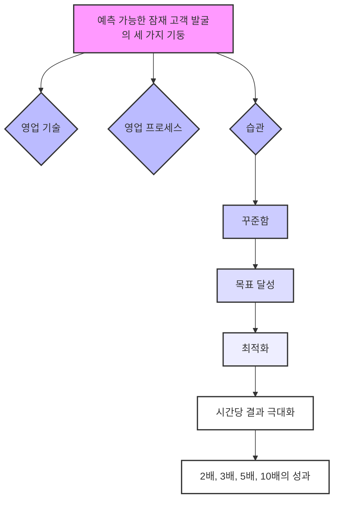

## 메리루 타일러의 '예측 가능한 잠재 고객 발굴(Predictable Prospecting)' 요약
이 책은 기업이 안정적으로 매출을 올리기 위해 잠재 고객을 발굴하는 방법을 알려주는 책이야. 특히 전화와 이메일을 활용한 아웃바운드(Outbound, 기업이 먼저 고객에게 다가가는 방식) 영업에 초점을 맞춰서, 어떻게 하면 잠재 고객을 효과적으로 찾고, 그들과 의미 있는 대화를 시작해서 최종적으로 계약까지 이끌어낼 수 있는지 구체적인 과정을 설명해 줘. 마치 사업의 산소 같은 매출을 꾸준히 만들어내는 비법을 알려주는 셈이지. 

## 1. 예측 가능한 영업의 핵심: 잠재 고객 발굴 전문가와 클로저의 역할 분담 

예측 가능한 매출을 만들려면, 마치 공장에서 물건을 만들 듯이 체계적인 과정이 필요해.

1. **전문화된 역할 분담**:
  - 잠재 고객 발굴 전문가(Prospectors)는 마치 낚시꾼처럼 잠재 고객을 찾아내서 영업 깔때기(Sales Funnel, 잠재 고객이 구매로 이어지는 과정을 깔때기 모양으로 표현한 것)의 맨 위를 가득 채우는 역할을 해. 
  - 경험 많은 클로저(Closers)는 이 잠재 고객들을 받아서 최종적으로 계약을 성사시키는 역할을 담당해. 
2. 아웃바운드** 영업의 중요성**:
  - 이 책은 주로 전화와 이메일을 통한 아웃바운드 영업(기업이 먼저 고객에게 연락하는 방식)에 집중하고 있어. 
  - 소셜 셀링(Social Selling, 소셜 미디어를 활용한 영업)도 좋지만, 이 책에서는 예측 가능하고 안정적인 결과를 얻기 어렵다고 보고 있어. 
  - 따라서, 영업 깔때기를 꾸준히 채우는 예측 가능한 방법을 배우는 것이 아주 중요하다고 강조해. 

## 2. 경쟁 우위 파악: 우리 회사의 강점과 시장에서의 위치 알기 

잠재 고객에게 연락하기 전에, 우리 회사가 경쟁사보다 어떤 점이 좋은지, 왜 우리 제품을 사야 하는지 명확하게 알아야 해. 마치 운동 경기에 나가기 전에 우리 팀의 강점과 약점을 분석하는 것과 같아.

1. **6가지 요소를 활용한 **SWOT 분석:
  - SWOT 분석(강점, 약점, 기회, 위협을 분석하는 방법)은 우리 회사의 경쟁력을 파악하는 데 아주 좋은 도구야. 
  - 이 분석을 6가지 다른 관점에서 진행해야 해.
2. **목표**:
  - 이 모든 분석을 통해 우리 회사가 시장에서 어떤 가치를 제공하고, 현재와 미래에 어떻게 자리매김할지 명확하게 이해하는 것이 목표야. 

## 3. 이상적인 고객 계정 프로필(Ideal Account Profile, IAP) 개발: 누구에게 팔 것인가? 

이제 우리 회사의 가치를 명확히 알았으니, 어떤 회사들을 목표로 삼을지 정해야 해. 마치 사냥꾼이 어떤 동물을 사냥할지 정하는 것과 같아.

1. **이상적인 고객 계정의 특징**:
  - 우리가 목표로 하는 고객 계정은 평생 가치(Lifetime Value, 고객이 우리 회사에 가져다줄 총 수익)가 높고, 우리 제품을 구매할 가능성이 높은 곳이어야 해. 
  - 선택한 고객 세그먼트(Segment, 시장을 특정 기준으로 나눈 조각)는 다음 조건을 충족해야 해.
  - **충분히 큰 시장**: 목표로 삼을 만큼 충분히 많은 고객이 있어야 해. 
  - **명확한 니즈**: 특정하고 고유한 요구사항을 가진 고객들이어야 해. 
  - **쉬운 소통**: 그 고객들에게 일관된 방식으로 쉽게 메시지를 전달할 수 있어야 해. 
2. **고객 세그먼트 생성 방법**:
  - 고객 세그먼트를 만드는 여러 가지 방법이 있어.

## 4. 이상적인 잠재 고객 페르소나(Ideal Prospect Personas) 만들기: 누구와 이야기할 것인가? 

어떤 회사를 목표로 할지 정했다면, 이제 그 회사 안에서 누구와 이야기해야 할지 구체적으로 알아야 해. 마치 특정 건물을 목표로 정했으면, 그 건물 안에서 누구를 만나야 하는지 아는 것과 같아.

1. **필요한 정보**:
  - 조직 내에서 우리가 팔아야 할 특정 사람들을 이해하는 것이 중요해.
2. **고객의 문제점(Pain Points) 찾기**:
  - 잠재 고객이 겪고 있는 문제점, 특히 그들의 목표와 관련된 문제점을 찾아야 해.

## 5. 올바른 메시지 작성: 고객의 구매 단계에 맞춰 이야기하기 

이제 잠재 고객과 그들의 문제점을 알았으니, 그들에게 맞는 메시지를 만들어야 해. 마치 고객이 어떤 상황에 있는지에 따라 다른 옷을 입고 다른 말을 하는 것과 같아.

1. **콘텐츠로 설득하는 **스토리 프레임워크**(**Compel with Content** Story Framework)**:
  - 구매 주기(Buying Cycle)는 5단계로 나눌 수 있어. 각 단계에 맞춰 메시지를 만들어야 해. 
  - **메시지의 톤(Tone) 조절**:
  - '모름'에서 '앎'으로, '앎'에서 '관심'으로 넘어가는 메시지는 주로 감성적이어야 해. 
  - '관심'에서 '평가'로, '평가'에서 '구매'로 넘어가는 메시지는 주로 이성적이어야 해. 
2. **구매 주기별 메시지 전략**:
  - **1단계: 모름(Unaware)에서 앎(Aware)으로**:
  - 처음부터 고객이 바로 구매할 준비가 되어 있다고 생각하면 관계를 망칠 수 있어. 
  - 영업사원은 짧고 가치 있으며 제품과 관련 없는 자료(예: 블로그 게시물, 인포그래픽, 비디오 클립)를 공유하며 관계를 시작해야 해. 
  - **2단계: 앎(Aware)에서 관심(Interested)으로**:
  - 이 단계에서는 잠재 고객이 문제와 해결책에 더 많은 시간을 투자할 의향이 있어. 
  - 보고서, 트렌드 분석, 모범 사례, 진단 도구, 웨비나(Webinar) 같은 더 자세한 콘텐츠가 유용해. 
  - **3단계: 관심(Interested)에서 평가(Evaluating)로**:
  - 이 단계에서는 사례 연구(Case Studies), 고객 후기(Testimonials), 제품 리뷰, 제품 중심 웨비나, 발견 미팅(Discovery Meetings) 등을 활용해야 해. 
  - **4단계: 평가(Evaluating)에서 구매(Purchase)로**:
  - 이 단계에서는 완전히 개인화된 이메일과 음성 메시지를 사용해. 
  - 상황에 따라 무료 또는 유료 체험, 투자 수익률(ROI) 계산기, 추천서 등을 제공해서 고객이 최종 결정을 내리도록 도와야 해. 
3. **이메일 작성 시 유의사항**:
  - 가능한 한 개인화된 메시지를 작성하되, 대규모로 프로그램을 운영할 수 있도록 균형을 맞춰야 해. 
  - 개인화 수준이 높을수록 응답률도 높아져. 
  - **개인화된 이메일 예시**: 
  - 보낸 사람: 실제 사람의 이메일 주소.
  - 제목: 모바일 최적화 르네상스 (내용을 명확히 알려주는 제목).
  - 본문: "안녕하세요, [잠재 고객 이름]. 모바일 최적화에 대한 이 기사가 도움이 될 것 같아 보냅니다. 소비자의 약 50%는 모바일 기기에서 웹사이트가 제대로 로드되지 않으면 다시 방문하지 않겠다고 말합니다. 이는 웹사이트가 제대로 최적화되지 않으면 잠재 고객의 거의 절반을 잃을 수 있다는 의미입니다. [블로그 게시물 URL 삽입] 모바일 경험 최적화 및 혁신에 대한 저희의 접근 방식에 대해 더 알고 싶으시다면, 짧은 통화를 하고 싶습니다. 다음 주에 시간 괜찮으신가요? 또는 디지털 에이전시 선정 과정을 담당하지 않으신다면, 가장 적합한 담당자를 알려주시겠습니까? 감사합니다. [영업사원 이름], [영업사원 성], [영업사원 전화번호], [회사 URL]"
  - 서명 아래: "[회사 이름]은 마케팅과 기술의 교차점에 있는 디지털 에이전시입니다. Fresh Direct, IDT, Hewlett-Packard와 같은 고객을 위해 수상 경력에 빛나는 모바일 솔루션을 설계하고 개발합니다."
  - **모범 사례**:
  - **실제 사람처럼 보이기**: 실제 사람이 보낸 것처럼 보이도록 실제 발신 주소, 일반 텍스트, 이미지 없는 서명을 사용해. 
  - **정상적인 형식**: 일반적인 사람들이 이메일을 작성하는 방식으로 작성해. 
  - **명확한 제목**: 제목은 이메일 내용이 무엇인지 정확히 알려줘야 해. 

## 6. 잠재 고객 발굴 캠페인을 통한 미팅 확보: 체계적인 접근 방식 

이제까지 준비한 모든 것을 캠페인으로 만들어서 잠재 고객을 꾸준히 확보해야 해. 마치 씨앗을 뿌리고 물을 주며 식물이 자라기를 기다리는 것과 같아.

1. 아웃바운드 리드**(**Outbound** Leads)의 두 가지 출처**:
  - **회사 내부 목록(**House List**)**:
  - 가장 먼저 살펴봐야 할 곳은 우리 회사가 가지고 있는 고객 목록이야. 
  - 가장 가치 있는 잠재 고객은 이전 고객들이고, 그다음은 자격은 있었지만 놓쳤던 잠재 고객들이야. 
  - 심지어 자격 미달이었거나 이전에 응답하지 않았던 잠재 고객들도 다시 시도해 볼 좋은 대상이 될 수 있어. 
  - **외부 목록 구매(Rent a List)**:
  - 두 번째 방법은 외부에서 목록을 구매하는 거야. 
  - B2B(기업 간 거래) 분야에서는 무역 간행물(Trade Publications)에서 제공하는 목록이 가장 좋아. 잠재 고객 정보가 신선하고, 그들이 직접 정보를 제공했기 때문이야. 
  - **데이터 정리**:
  - 어떤 출처에서 데이터를 얻든, 캠페인을 시작하기 전에 반드시 데이터를 깨끗하게 정리하고 확인해야 해. 
2. **캠페인 실행**:
  - 캠페인은 약 22영업일(또는 한 달) 동안 8~12번의 접촉(Touches)을 포함해야 해. 
  - **20일 동안 9번의 접촉 캠페인 예시 (7개 이메일, 2개 전화)**: 
  - **1일차**: 우리가 조사한 문제점에 대해 이야기할 적절한 담당자를 묻는 이메일을 보내. 
  - **2일차**: 고객의 니즈와 관련된 설문조사를 언급하고, 다시 적절한 담당자를 묻는 이메일을 보내. 
  - **3일차**: 잠재 고객에게 인포그래픽을 보내고, 링크를 클릭하도록 요청해. 이 링크를 클릭하면 고객이 '모름'에서 '앎' 단계로 넘어갔다는 것을 알 수 있어. 
  - **8일차**: 미팅을 잡기 위한 이메일을 보내. 온라인 캘린더를 사용하거나 이메일로 회신하도록 요청해. 
  - **8일차 (동시에)**: 전화를 걸어. 받지 않으면 음성 메시지를 남기고, 미팅 요청 이메일을 보냈다고 알려줘. 
  - **11일차**: 잠재 고객에게 진단 도구(Diagnostic Tool)를 보내고, 링크를 클릭하도록 요청해. 이 링크를 클릭하면 고객이 '앎'에서 '관심' 단계로 넘어갔다는 것을 알 수 있어. 
  - **13일차**: 제품 데모(Product Demo) 이메일을 보내고, 링크를 클릭하도록 요청해. 이 링크를 클릭하면 고객이 '관심'에서 '평가' 단계로 넘어갔다는 것을 알 수 있어. 
  - **18일차**: '관계 정리(Breakup)' 이메일을 보내. 더 이야기할 의향이 있는지 회신해달라고 요청해. 
  - **20일차**: 전화를 걸어. 받지 않으면 음성 메시지를 남기고, 18일차에 보낸 이메일에 회신해달라고 요청해. 
  - **중요 사항**:
  - 이 과정 중에 대화나 회신이 오면, 상황에 따라 개별적으로 대응해야 해. 
  - 고객을 '앎'에서 '평가' 단계로 최대한 빨리 이동시키는 것이 중요해. 

## 7. 성공을 위한 조언: 꾸준함과 효율성 

잠재 고객 발굴에서 성공하려면 몇 가지 중요한 원칙을 지켜야 해. 마치 운동선수가 꾸준히 훈련하고 효율적인 방법을 찾는 것과 같아.

1. **채널 테스트 및 최적화**:
  - 다양한 채널(전화, 이메일, 소셜 미디어, 직접 우편 등)의 성과를 측정하고, 새로운 시도를 해봐야 해. 
  - 어떤 채널이 가장 효과적인지 파악하고, 그 채널을 최적화해서 생산성을 높여야 해. 
  - 어제 잘 통했던 방법이 오늘 안 통할 수도 있으니, 계속 변화에 적응해야 해. 
2. **대화 방식의 변화에 적응**:
  - 요즘 사람들은 코로나19 같은 사회적 이슈 때문에 더 사회적이고 감정적인 대화를 원할 수 있어. 
  - 평소처럼 빠르게 영업을 진행하기보다는, 상대방의 이야기를 들어주고 공감하며 관계를 쌓는 데 시간을 더 투자해야 해. 
3. **가치 중심의 대화**:
  - 모든 대화에서 고객에게 가치를 제공해야 해. 
  - 단순히 영업사원에게 좋은 가치가 아니라, 고객이나 잠재 고객에게 실질적인 가치를 제공해야 해. 
  - 고객의 과제(Tasks)와 문제점(Challenges)을 재정적, 개인적, 전략적 관점에서 다양하게 설명할 수 있어야 해. 
  - 이렇게 하면 고객에게 전달할 가치 있는 메시지가 많아져. 
4. **꾸준함과 연습**:
  - **예측 가능한 잠재 고객 발굴의 세 가지 기둥**: 영업 기술(Sales Skills), 영업 프로세스(Sales Process), 그리고 습관(Habit)이야. 
  - 이 중에서 '습관'이 가장 중요해. 꾸준하게 노력하면 반드시 목표를 달성할 수 있어. 
  - 매일 역할극(Role-playing)을 하거나, 자신의 목소리를 녹음해서 연습하는 것이 큰 도움이 돼. 
  - 특히 새로운 영업사원이라면, 회사 내의 선배나 임원들과 역할극을 해보는 것이 자신감을 높이는 데 아주 효과적이야. 
5. **영업 주기 단축**:
  - 요즘처럼 영업 주기가 길어지는 시기에는, 다른 회사들과 협력해서 추천(Referral) 채널을 활용하는 것이 좋아. 
  - 우리 제품과 경쟁하지 않으면서 고객에게 먼저 접근하는 회사들과 관계를 맺고, 서로 리드를 공유하는 거야. 
  - 이렇게 하면 고객이 이미 우리를 신뢰하는 상태에서 대화를 시작할 수 있어서 영업 주기를 단축할 수 있어. 
  - 고객의 구매 라이프사이클(Life Cycle, 제품을 구매하는 전체 과정)을 깊이 이해하고, 적절한 시점에 접근하는 것도 중요해. 
6. **시간당 결과 극대화**:
  - 항상 '어떻게 하면 같은 시간을 투자해서 두 배, 세 배, 다섯 배, 열 배의 결과를 얻을 수 있을까?'를 고민해야 해. 
  - 가장 짧은 성공 경로를 찾는 것이 중요해. 
7. **AI와 딥러닝의 활용**:
  - 인공지능(AI)과 딥러닝(Deep Learning) 기술은 잠재 고객의 대화를 분석해서 그들의 문제점과 감정을 파악하는 데 도움을 줄 수 있어. 
  - 이를 통해 고객의 언어와 감정에 맞춰 개인화된 메시지를 만들 수 있어서, 고객은 마치 우리가 자신을 잘 알고 있다고 느끼게 돼. 
  - 하지만 AI가 영업사원을 완전히 대체할 수는 없어. 특히 여러 의사 결정권자가 관련된 복잡한 거래에서는 사람 간의 상호작용이 필수적이야. 
8. SDR**(**Sales Development Representative**)의 다양한 경력 경로**:
  - SDR은 단순히 계정 담당자(Account Executive, AE)가 되는 것 외에도 다양한 경력 경로를 가질 수 있어. 
  - 기술 지원(Tech Support), 기술 영업(Technical Sales), 계정 관리(Account Management), 고객 경험(Customer Experience), 관리직(Management) 등으로 성장할 수 있어. 
  - SDR 역할 자체도 미팅 설정, 심층 자격 부여, AE 지원 등 세 가지 방식으로 발전할 수 있어. 
9. **마케팅과 영업의 조화**:
  - 마케팅은 브랜드 인지도와 구별성을 높이는 데 중요하고, 인바운드 리드(Inbound Leads, 고객이 먼저 회사에 연락하는 경우)를 생성하는 데 효과적이야. 
  - 아웃바운드 영업은 잠재 고객의 인지 수준이 낮은 단계에서 새로운 시장을 개척하는 데 강점이 있어. 
  - 마케팅과 영업 팀이 협력하면 더 높은 전환율을 달성할 수 있어. 
  - 이상적인 고객 계정(IAP)을 명확히 설정하면 아웃바운드 리드의 전환율도 높일 수 있어. 

