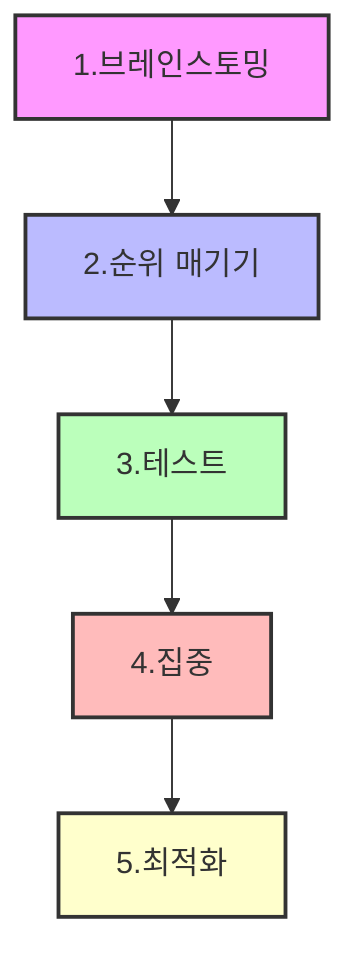
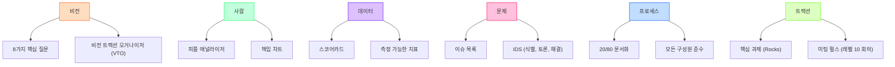

## 트랙션: 비즈니스 성장을 위한 5단계
이 책은 스타트업과 마케터들이 어떻게 고객을 확보하고 비즈니스를 성장시킬 수 있는지 알려주는 실용적인 가이드이다. 저자 가브리엘 와인버그와 저스틴 마레스는 19가지 고객 확보 채널을 소개하고, '황소의 눈(Bullseye)' 프레임워크를 통해 가장 효과적인 채널을 찾아 집중하는 방법을 제시한다. 이 책은 제품 개발만큼이나 마케팅 전략이 중요하며, 체계적인 접근 방식을 통해 지속적인 성장을 이룰 수 있다고 강조한다.

## 1. 트랙션(Traction)이란 무엇일까? 

트랙션은 쉽게 말해 <mark>사업이 잘되고 있다는 증거</mark>라고 보면 된다. 마치 <mark>고속도로에서 차가 미끄러지지 않고 앞으로 쭉쭉 나아가는 것</mark>처럼, 사업도 <mark>의미 있는 고객 증가나 핵심 지표의 성장을 경험하는 것</mark>을 말한다.

1. **트랙션의 의미**:
  - 스타트업에서 자주 쓰이는 말인데, <mark>사업에 중요한 지표에서 실제 고객이 늘어나거나 성장이 일어나는 것</mark>을 뜻한다. 
  - 예를 들어, 매출을 늘리고 싶다면 <mark>매출액이 증가하는 것</mark>이 트랙션이고, 모바일 앱 설치를 늘리고 싶다면 <mark>앱을 설치하고 실제로 사용하는 사람 수가 늘어나는 것</mark>이 트랙션이다. 
  - 인터넷 마케터에게는 <mark>이메일 리스트 가입자 수가 늘거나, 제품 판매 후 구매 전환율이 높아지는 것</mark> 등이 트랙션이 될 수 있다. 

2. **트랙션의 특징**:
  - <mark>사업마다 트랙션의 형태는 다를 수 있지만</mark>, 사업이 빠르게 성장하고 제품이 잘 팔리면 <mark>누구나 '아, 지금 잘 되고 있구나' 하고 느낄 수 있다</mark>. 
  - 이는 마치 <mark>대법원에서 '음란물'을 정의하는 것과 비슷하다</mark>고 한다. <mark>"보면 안다(you know it when you see it)"</mark>는 말처럼, 트랙션도 그렇다는 것이다. 

## 2. 고객 확보 채널, 딱 19가지밖에 없어! 

고객을 데려오는 방법은 <mark>무한할 것 같지만, 사실 딱 19가지로 정해져 있다</mark>. 마치 <mark>요리할 때 쓸 수 있는 재료가 정해져 있는 것과 같다</mark>고 보면 된다. 이 19가지 채널을 잘 이해하고 활용하는 것이 중요하다.

1. **19가지 채널의 발견**:
  - 저자들은 40명 이상의 창업자들과 인터뷰하고, 많은 조사를 통해 <mark>모든 회사가 고객을 확보하는 방법이 19가지</mark>라는 것을 알아냈다. 
  - 이 채널들은 PR<mark>, </mark>파트너십<mark>, </mark>제휴 마케팅<mark>, 유료 광고</mark> 등 다양하며, <mark>어떤 스타트업이든 이 중 하나 이상을 활용해 성공적으로 성장했다</mark>. 
  - 이 19가지 채널은 <mark>tractionbook.com</mark> 웹사이트 하단에서 확인할 수 있다. 

2. **유한한 채널이 주는 이점**:
  - 마케터 입장에서는 <mark>고객을 확보할 수 있는 방법이 정해져 있다는 것이 오히려 좋은 소식</mark>이다. 
  - 성공적인 스타트업들은 <mark>처음부터 완벽한 고객 확보 전략을 가지고 시작하는 것이 아니라</mark>, <mark>어떤 채널이 자신들에게 가장 효과적인지 찾아가는 과정</mark>을 거친다. 

3. **그룹 사고(**Groupthink**)의 위험**:
  - 많은 창업자와 마케터는 <mark>자신이 경험했거나 경쟁사가 사용하는 채널에만 집중하는 경향</mark>이 있다. 
  - 이는 <mark>경쟁이 치열한 시장에서 비용을 높이고 효과를 떨어뜨릴 수 있다</mark>. 
  - 카약닷컴(kayak.com) 창업자 폴 잉글리시(Paul English)는 <mark>경쟁사가 사용하지 않거나 사용할 수 없는 방식으로 고객을 확보하는 것이 엄청난 경쟁 우위</mark>라고 강조했다. 
  - 따라서 <mark>편견 없이 19가지 채널을 모두 평가하고, 가장 유망한 채널에 대해 깊이 파고들어 테스트하는 과정</mark>이 필요하다. 

## 3. 대부분의 스타트업이 실패하는 이유: 유통 채널의 부재 

아무리 좋은 제품을 만들어도 <mark>사람들에게 알리고 팔 수 있는 방법(유통 채널)이 없으면 소용없다</mark>. 마치 <mark>아무리 맛있는 빵을 만들어도 빵집 문을 열지 않으면 아무도 사 먹을 수 없는 것과 같다</mark>.

1. **피터 틸(Peter Thiel)의 경고**:
  - 억만장자 벤처 투자가이자 페이팔(PayPal)과 팔란티어(Palantir)를 창업한 피터 틸은 <mark>대부분의 기업이 단 하나의 유통 채널도 제대로 작동시키지 못한다</mark>고 지적했다. 
  - 그는 <mark>제품 자체가 아니라 '유통의 부재'가 </mark>스타트업<mark> 실패의 가장 큰 원인</mark>이라고 강조한다. 

2. **마크 안드레센(Marc Andreessen)의 통찰**:
  - 넷스케이프(Netscape) 창업자이자 유명 VC인 마크 안드레센도 <mark>훌륭한 제품을 만드는 많은 기업가들이 좋은 유통 전략을 가지고 있지 않다</mark>고 말한다. 
  - 이것이 <mark>세계 최고의 </mark>VC<mark> 회사들이 투자하고 싶어도 포기하게 되는 가장 큰 이유</mark>라고 한다. 

3. **'황소의 눈(**Bullseye**)' 프레임워크의 중요성**:
  - 이 책에서 제시하는 '황소의 눈' 프레임워크는 <mark>사업에 가장 효과적인 한두 가지 채널을 찾아내고, 이를 통해 필요한 성장(</mark>매출<mark>, 사용자 등)을 달성하도록 돕는 도구</mark>이다. 

## 4. '황소의 눈(Bullseye)' 프레임워크: 5단계 성장 전략 

'황소의 눈' 프레임워크는 <mark>가장 효과적인 고객 확보 채널을 찾는 5단계 과정</mark>이다. 마치 <mark>과녁의 한가운데를 정확히 맞히기 위해 여러 번 연습하고 조준하는 것과 같다</mark>.

1. **1단계: 브레인스토밍 (Brainstorming)** 
  - <mark>19가지 </mark>트랙션<mark> 채널 각각에 대해 어떤 전술이 우리 사업에 효과적일지 고민</mark>한다.
  - 예를 들어, 페이스북 광고 채널이라면 <mark>맞춤 타겟, 유사 타겟, 해외 광고</mark> 등 구체적인 아이디어를 떠올린다.
  - 이 단계를 거치면 <mark>19가지 채널과 각 채널 내의 세부 아이디어 목록</mark>을 얻게 된다.

2. **2단계: 순위 매기기 (Ranking)** 
  - 브레인스토밍한 아이디어 중에서 <mark>가장 유망하다고 생각하는 3~4가지 채널과 그 안의 아이디어를 선택</mark>한다.
  - 이 아이디어들이 <mark>사업에 큰 영향을 미칠 수 있을지</mark>를 기준으로 순위를 매긴다.
  - 예를 들어, 정보 상품을 판매한다면 <mark>새로운 </mark>제휴<mark> 마케터 모집, 특정 고객층을 타겟팅한 페이스북 광고, 이메일 구독자 확보를 위한 경품 행사</mark> 등을 고려할 수 있다.

3. **3단계: 테스트 (Testing)** 
  - 선택한 3~4가지 아이디어를 <mark>실제로 작게 테스트</mark>해본다.
  - 이는 <mark>린 </mark>스타트업<mark>(</mark>Lean Startup<mark>) 방식과 유사</mark>하다.
  - 가설을 세우고, <mark>실제로 고객을 확보하는 데 효과가 있는지</mark> 확인하는 것이다.
  - 예를 들어, <mark>해외 타겟 페이스북 광고가 효과가 있을지</mark> 가설을 세우고 테스트한다.

4. **4단계: 집중 (Focusing)** 
  - 테스트 결과 <mark>가장 효과적이라고 판단된 1~2가지 채널에 집중</mark>한다.
  - 이 단계의 목표는 <mark>사업에 실제로 작동하는 효과적인 채널을 찾아내는 것</mark>이다.

5. **5단계: 최적화 (Optimizing)** 
  - 선택한 1~2가지 채널에서 <mark>최대한의 트랙션을 얻기 위해 노력</mark>한다.
  - 예를 들어, 페이스북 광고가 잘 작동한다면 <mark>광고 소재, 문구, 타겟 그룹, 언어 등을 계속 테스트하고 개선</mark>하여 효율을 높인다.
  - 이 과정을 통해 <mark>가장 많은 고객을 확보할 수 있는 전술을 최적화</mark>한다.

## 5. 50% 규칙: 제품만큼 마케팅도 중요해! 

사업 초기에는 <mark>제품 개발에만 몰두하기 쉽지만, 마케팅에도 똑같이 시간을 투자해야 한다</mark>. 마치 <mark>자동차를 만들 때 엔진만큼이나 바퀴도 중요한 것과 같다</mark>.

1. **50% 규칙의 의미**:
  - 초기 단계의 스타트업, 마케터, 창업자들은 <mark>시간의 절반은 제품에, 나머지 절반은 마케팅에 투자해야 한다</mark>. 
  - 다른 사람의 제품을 판매하는 제휴 마케터라면, <mark>시간의 절반은 타겟 고객을 조사하고 그들이 어디에 있는지, 무엇을 소비하는지 파악하는 데 쓰고</mark>, <mark>나머지 절반은 그 고객들 사이에서 트랙션을 얻는 데 써야 한다</mark>. 

## 6. 목표 설정과 '바늘 움직이기(Moving the Needle)' 

사업 목표를 명확히 하고, <mark>그 목표 달성에 직접적으로 기여하는 활동에만 집중</mark>해야 한다. 마치 <mark>나침반의 바늘이 목표 방향으로 크게 움직이도록 중요한 일에만 힘을 쏟는 것</mark>과 같다.

1. **명확한 목표 설정**:
  - <mark>사업을 시작하기 전에 명확한 목표를 설정하는 것이 중요하다</mark>. 
  - 예를 들어, <mark>10만 달러어치 제품 판매, 월 1만 달러 반복 </mark>매출<mark> 달성, 모바일 앱 사용자 100만 명 확보</mark> 등 구체적인 목표를 세워야 한다. 
  - 목표에 따라 <mark>어떤 채널에 집중할지, 어떤 행동을 할지가 결정</mark>된다. 
  - 예를 들어, <mark>사용자 100만 명을 목표로 한다면 소규모 모임보다는 광고, </mark>바이럴 마케팅<mark>, 대규모 이메일 리스트 구축</mark> 등이 더 효과적이다. 

2. **'**바늘 움직이기**' 원칙**:
  - <mark>목표를 설정했다면, 그 목표를 달성하는 데 의미 있는 시간 안에 도달할 수 있는 활동에만 집중</mark>해야 한다. 
  - 예를 들어, <mark>10만 달러어치 제품(개당 50~100달러)을 팔아야 하는데, 콜드콜이나 방문 판매를 한다면 목표 달성까지 너무 오랜 시간이 걸린다</mark>. 
  - 많은 마케터와 창업자들이 <mark>트위터 팔로워 늘리기, </mark>콘텐츠 공유<mark> 횟수 늘리기</mark> 등 <mark>실제 매출 목표와는 거리가 먼 활동에 시간을 낭비</mark>하는 경우가 많다. 
  - 트랙션<mark> 목표에 의미 있는 기여를 하는 채널과 전술에만 집중</mark>해야 한다. 

## 7. 제품과 트랙션을 동시에 고려하기 

제품을 만들 때부터 <mark>어떻게 고객에게 도달하고 피드백을 받을지 함께 고민해야 한다</mark>. 마치 <mark>새로운 레시피를 개발하면서 동시에 손님들에게 시식 평가를 받는 것과 같다</mark>.

1. **동시 진행의 이점**:
  - 제품 개발과 트랙션 확보를 동시에 진행하면, <mark>제품 출시 시점에 이미 고객들이 어떻게 제품을 구매하고 접하는지 알 수 있다</mark>. 
  - 또한, <mark>초기 고객들로부터 피드백을 받아 제품을 개선할 수 있어, 출시 시점에 더 가치 있는 제품을 만들 수 있다</mark>. 
  - 예를 들어, <mark>페이스북 광고를 통해 확보한 고객들의 피드백을 제품에 반영하면, 제품의 가치가 훨씬 높아진다</mark>. 

## 8. 스타트업의 본질은 '빠른 성장' 

스타트업은 <mark>빠르게 성장하도록 설계된 회사</mark>이다. 마치 <mark>로켓이 하늘로 솟아오르듯, 성장이 스타트업의 모든 것을 결정한다</mark>.

1. **폴 그레이엄(Paul Graham)의 정의**:
  - 유명 스타트업 액셀러레이터인 Y 콤비네이터(Y Combinator)의 창업자 폴 그레이엄은 <mark>"스타트업은 빠르게 성장하도록 설계된 회사"라고 정의</mark>했다. 
  - 그는 <mark>스타트업이 해야 할 유일한 본질적인 일은 '성장'이며, 스타트업과 관련된 다른 모든 것은 성장으로부터 파생된다</mark>고 강조한다. 

## 9. 트랙션 채널 심층 분석: 19가지 채널과 활용 전략 

이제 19가지 트랙션 채널을 하나씩 자세히 살펴보자. 각 채널은 <mark>고객을 확보하는 고유한 방법</mark>이며, <mark>어떤 채널이 우리 사업에 가장 적합한지 이해하는 것이 중요하다</mark>.

1. **블로그 타겟팅 (Targeting Blogs)** 
  - <mark>다른 블로거들이 우리 제품이나 서비스에 대해 글을 쓰도록 유도</mark>하여 잠재 고객에게 도달하는 방법이다.
  - **사례**: 민트(Mint)는 <mark>제품 출시 전 금융 분야의 주요 블로거들에게 미리 제품을 사용하게 하고 글을 써달라고 요청</mark>하여 <mark>2만 명의 가입자를 확보</mark>했다. 
  - **전략**:
  - <mark>타겟 블로그 목록을 만들고, 각 블로거에게 맞춤형으로 접근</mark>한다.
  - <mark>블로거가 우리에 대해 글을 쓸 만한 이유를 명확히 제시</mark>해야 한다.
  - <mark>초기에는 무료로 협업을 시도하고, 예산이 생기면 블로거에게 원고료를 지불하는 방식</mark>도 고려할 수 있다.

2. 홍보** (Publicity)** 
  - <mark>뉴욕 타임즈, 파이낸셜 타임즈와 같은 전통적인 언론 매체를 통해 홍보</mark>하는 방법이다.
  - **특징**:
  - 보통 PR 회사를 고용하지만, <mark>많은 기업들이 PR 회사에 불만족하여 자체 PR 팀을 구축하는 경향</mark>이 있다. 
  - <mark>대형 언론사는 우리에게 큰 호의를 베푸는 것이므로, 그들이 우리에 대해 기사를 쓸 만한 '이야기'가 있어야 한다</mark>. 
  - 반면, <mark>비즈니스 인사이더(Business Insider)와 같은 특정 분야 전문 매체는 콘텐츠를 항상 찾고 있으므로, 우리가 그들에게 콘텐츠를 제공하는 셈</mark>이 된다. 
  - <mark>현재 이슈와 연결되거나 독특한 스토리가 있는 콘텐츠</mark>를 제공하는 것이 중요하다. 

3. 비전통적인 PR** (Unconventional PR)** 
  - <mark>기발하고 독특한 PR 스턴트(stunt)를 통해 대중의 관심을 끄는 방법</mark>이다.
  - **사례 1**: 사우스 바이 사우스웨스트(South by Southwest) 행사에서 <mark>한 스타트업은 부스를 사는 대신 마스코트를 보내 전단지를 뿌리고 소란을 피웠다</mark>. 마스코트가 쫓겨났지만, <mark>이 스캔들로 1만 명의 가입자를 확보</mark>했다. 
  - **사례 2**: 하프닷컴(Half.com)은 <mark>유명 IT 기업인들을 패러디한 뮤직비디오 'The New Dork'를 제작</mark>하여 바이럴 마케팅에 성공했다. <mark>애쉬튼 커쳐(Ashton Kutcher) 같은 유명인이 공유하면서 큰 화제</mark>가 되었다. 
  - **전략**: <mark>저렴하고 재미있으며 독창적인 아이디어</mark>로 사람들의 이목을 끄는 것이 중요하다. <mark>실패할 수도 있다는 점을 염두에 두어야 한다</mark>. 

4. 검색 엔진 마케팅** (Search Engine Marketing, SEM)** 
  - <mark>구글과 같은 검색 엔진에 광고를 게재하여 고객을 확보</mark>하는 방법이다.
  - <mark>사용자가 특정 키워드를 검색할 때 우리 광고가 노출되도록 하는 것</mark>이다.

5. **소셜 및 디스플레이 광고 (Social and Display Ads)** 
  - <mark>레딧, 유튜브, 페이스북, 트위터 등 인기 있는 소셜 미디어와 웹사이트에 광고를 게재</mark>하는 방법이다.
  - **특징**:
  - 주로 <mark>브랜드 인지도를 높이는 데 효과적</mark>이며, <mark>즉각적인 구매 전환보다는 장기적인 고객 유입을 목표</mark>로 한다. 
  - <mark>좋은 콘텐츠를 만들었다면, 소액의 광고비를 투자하여 더 많은 사람들에게 노출</mark>시키는 것이 좋다. 
  - <mark>예산이 적다면, 오래도록 유효한 '에버그린(</mark>evergreen<mark>)' 콘텐츠</mark>를 만들어 나중에 광고비를 투자해도 계속 활용할 수 있도록 해야 한다. 
  - <mark>포스퀘어(Foursquare)의 위치 기반 타겟팅, 레딧, 핀터레스트, 스크라이브스(Scribes), 버즈피드(BuzzFeed)</mark> 등 다양한 플랫폼을 고려할 수 있다. 

6. **오프라인 광고 (Offline Ads)** 
  - <mark>빌보드, 인쇄 잡지, 슈퍼볼 광고 등 전통적인 오프라인 매체를 활용</mark>하는 방법이다.
  - **특징**:
  - <mark>보그(Vogue) 같은 대형 잡지 광고는 비싸고 주로 브랜드 이미지 구축에 사용</mark>되지만, <mark>특정 틈새 시장을 타겟팅하는 전문 잡지 광고는 고객 참여율과 가입률이 훨씬 높을 수 있다</mark>. 
  - <mark>타겟 고객이 누구인지 명확히 파악하고, 그들이 주로 접하는 오프라인 매체를 선택</mark>하는 것이 중요하다. 

7. 검색 엔진 최적화** (Search Engine Optimization, SEO)** 
  - <mark>우리 웹사이트가 구글 검색 결과 상위에 노출되도록 최적화</mark>하는 방법이다.
  - **특징**:
  - <mark>구글 검색이 전체 검색의 90%를 차지하므로, 구글에 최적화하는 것이 중요</mark>하다. 
  - <mark>키워드 조사(구글 트렌드 등)를 통해 고객들이 무엇을 검색하는지 파악하고, 그에 맞는 콘텐츠를 제작</mark>해야 한다. 
  - <mark>다른 웹사이트로부터 링크를 많이 받는 것이 SEO에 매우 중요</mark>하다. 

8. 콘텐츠 마케팅** (Content Marketing)** 
  - <mark>우리 회사 블로그나 웹사이트에 유용한 콘텐츠를 제작하여 고객을 유치</mark>하는 방법이다.
  - **사례**: 모즈(Moz), 언바운스(Unbounce), 오케이큐피드(OKCupid)는 <mark>블로그가 한때 가장 큰 </mark>고객 확보 채널이었다. <mark>제품 출시 1년 전부터 블로그를 시작</mark>하기도 했다. 
  - **전략**:
  - <mark>제품이 준비되지 않았거나 기능이 부족해도, 유용한 콘텐츠를 통해 스토리를 전달</mark>할 수 있다. 
  - <mark>고객들이 궁금해하는 질문에 답하는 콘텐츠</mark>를 만들면 SEO에도 도움이 된다. 
  - <mark>자사 홍보보다는 문제 해결에 초점을 맞춘 콘텐츠</mark>는 사람들이 자발적으로 공유할 가능성이 높다. 
  - <mark>인포그래픽, 동영상 등 공유하기 쉬운 형식</mark>의 콘텐츠를 제작한다. 
  - <mark>트위터 등 소셜 미디어에서 영향력 있는 사람들에게 콘텐츠 공유를 요청</mark>하는 것도 효과적이다. 
  - 콘텐츠 마케팅은 <mark>장기적인 관점에서 인내심을 가지고 꾸준히 진행</mark>해야 한다. 

9. 이메일 마케팅** (Email Marketing)** 
  - <mark>이메일을 통해 고객과 소통하고, 제품 사용을 유도하며, 재구매를 촉진</mark>하는 방법이다.
  - **활용 분야**:
  - **고객 활성화**: <mark>제품 가입 후 핵심 기능을 소개하는 이메일 시퀀스</mark>를 보낸다. 드롭박스(Dropbox)는 <mark>파일을 업로드하지 않은 사용자에게 알림 이메일을 보내 활성 사용자 전환율을 높였다</mark>. 
  - 고객 유지: <mark>고객의 과거 활동을 보여주거나, 잘하고 있다고 칭찬하는 이메일</mark>을 보낸다. 
  - **프리미엄 기능 **홍보: <mark>유료 기능의 이점을 설명하는 이메일</mark>은 높은 전환율을 보인다. 
  - **추천 마케팅**: <mark>친구에게 제품을 추천하면 인센티브를 제공</mark>한다. 드롭박스는 <mark>추천을 통해 무료 저장 공간을 제공</mark>했고, 아사나(Asana)는 <mark>주소록 가져오기 기능을 통해 친구 초대를 유도</mark>했다. 

10. 바이럴 마케팅** (Viral Marketing)** 
  - <mark>제품 자체가 입소문을 통해 퍼져나가도록 설계</mark>하는 방법이다.
  - **특징**:
  - <mark>핀터레스트 게시물이 페이스북 피드에 뜨거나, 친구가 제품을 추천하는 자동 이메일을 받는 것</mark>이 바이럴 마케팅의 예시이다. 
  - <mark>제품 내에 다른 플랫폼으로 자동 공유되는 기능(예: 핀터레스트 핀이 페이스북에 공유)을 통합</mark>하여 수천만 명의 사용자를 확보할 수 있다. 
  - **바이럴 루프(Viral Loop)**: <mark>사용자가 제품을 공유하고, 그 공유를 통해 새로운 사용자가 유입되어 다시 공유하는 순환 구조</mark>를 만든다. 
  - **내재적 바이럴리티(Inherent Virality)**: <mark>다른 사람을 초대해야만 제품의 가치를 얻을 수 있는 경우</mark> (예: 왓츠앱). 
  - **협업 유도**: <mark>친구와 함께 사용할 때 더 큰 가치를 얻는 제품</mark> (예: 구글 독스). 
  - **전략**: <mark>사용자에게 친구와 함께 사용할 때의 이점을 교육하고, 공유 버튼이나 위젯을 쉽게 제공</mark>한다. <mark>친구 초대 시 크레딧이나 보너스를 제공</mark>하는 것도 효과적이다. 

11. **엔지니어링을 통한 마케팅 (**Engineering as Marketing**)** 
  - <mark>무료 도구나 유틸리티를 개발하여 잠재 고객을 유치</mark>하는 방법이다.
  - **사례 1**: 허브스팟(HubSpot)은 <mark>무료 마케팅 리뷰 도구인 '마케팅 그레이더(Marketing Grader)'를 개발</mark>하여 수백만 명의 사용자를 확보했다. 
  - **사례 2**: 버퍼(Buffer)는 <mark>소셜 미디어 이미지 제작 도구를 무료로 제공</mark>하여 사용자들이 이미지를 공유할 때 버퍼를 홍보하도록 유도했다. 
  - **전략**:
  - <mark>우리 제품과 직접적인 관련은 없지만, 잠재 고객에게 유용한 무료 도구를 제공</mark>한다.
  - 이 도구는 <mark>우리 제품의 가치를 간접적으로 보여주거나, 우리 제품으로 유도하는 역할</mark>을 한다.
  - <mark>워터마크를 넣어 브랜드를 노출하고, 유료로 워터마크를 제거하는 방식</mark>으로 수익화도 가능하다. 

12. 사업 개발** (Business Development, Biz Dev)** 
  - <mark>다른 회사와 파트너십을 맺어 고객을 확보</mark>하는 방법이다.
  - **유형**:
  - **표준 파트너십**: <mark>애플과 나이키의 '나이키 플러스' 신발</mark>처럼 서로의 제품을 연동하는 방식. 
  - **합작 투자 (Joint Ventures)**: <mark>스타벅스와 펩시의 '스타벅스 더블샷 에스프레소'</mark>처럼 새로운 제품을 함께 개발하는 방식. 
  - **라이선싱 (Licensing)**: <mark>스포티파이와 그루브샤크(Groove Shark)</mark>처럼 기술이나 콘텐츠 사용 권한을 부여하는 방식. 
  - **유통 계약 (Distribution Deals)**: <mark>그루폰(Groupon)의 핵심 모델</mark>처럼 다른 채널을 통해 제품을 유통하는 방식. 

13. **영업 (Sales)** 
  - <mark>고가의 제품이나 서비스를 직접 판매원들이 고객에게 찾아가 판매</mark>하는 방법이다.
  - <mark>세일즈포스(Salesforce)나 과거의 진공청소기 판매</mark>처럼 대면 영업이 필요한 경우에 주로 사용된다.

14. 제휴** 프로그램 (**Affiliate** Programs)** 
  - <mark>다른 사람들이 우리 제품이나 서비스를 홍보하고, 그로 인해 발생한 판매에 대해 수수료를 지급</mark>하는 방법이다.
  - <mark>제휴 링크를 통해 우리 사이트에서 콘텐츠를 구매하거나, 아마존 등으로 연결될 때 수익을 창출</mark>할 수 있다.
  - <mark>자포스(Zappos)가 이 분야의 선두주자</mark>로 알려져 있다. 
  - <mark>이 채널은 충분한 트래픽이 확보된 후에 고려하는 것이 좋다</mark>. 

15. 기존 플랫폼** (Existing Platforms)** 
  - <mark>앱 스토어, 구글 플레이 스토어 등 기존의 대형 플랫폼을 활용하여 고객을 확보</mark>하는 방법이다.
  - <mark>에버노트(Evernote)는 앱 스토어에서 탁월한 전략을 펼쳐 성공</mark>했다. <mark>아이패드 출시 전부터 아이패드용 버전을 준비하는 등 선제적인 움직임</mark>을 보였다. 

16. **전시회 (Trade Shows)** 
  - <mark>산업 관련 전시회에 참가하여 잠재 고객과 직접 만나 제품을 </mark>홍보하는 방법이다. (코로나19 시국에는 관련성이 낮다.)

17. **오프라인 행사 (Offline Events)** 
  - <mark>자체적으로 행사를 개최하거나 다른 행사에 참여하여 고객과 소통</mark>하는 방법이다. (코로나19 시국에는 관련성이 낮다.)

18. **강연 (Speaking Engagements)** 
  - <mark>강연이나 프레젠테이션을 통해 제품이나 서비스를 </mark>홍보하는 방법이다.
  - <mark>코로나19 시대에는 온라인 강연이나 고품질의 비디오 </mark>콘텐츠 제작으로 대체될 수 있다. 

19. 커뮤니티 구축** (Community Building)** 
  - <mark>기존 고객들을 대상으로 커뮤니티를 만들고 육성하여 충성도를 높이는 방법</mark>이다.
  - <mark>이메일 마케팅을 넘어, 고객들이 서로 관계를 맺고 자체적인 그룹(예: 페이스북 그룹)을 형성하도록 유도</mark>한다. 
  - <mark>고객들이 대화를 나누고 싶어 하는 공간을 제공</mark>하여 소속감을 느끼게 하는 것이 중요하다. 

## 10. 트랙션 채널 탐색의 중요성 

<mark>새로운 고객 확보 채널을 끊임없이 탐색하고, 경쟁이 적은 곳을 선점하는 것이 중요하다</mark>. 마치 <mark>아무도 모르는 보물섬을 먼저 찾아내 독점하는 것과 같다</mark>.

1. **새로운 채널 탐색**:
  - <mark>타겟 고객이 시간을 보내는 새로운 플랫폼이나 방법을 주시하고, 그곳에서 테스트를 실행</mark>해야 한다. 
  - 예를 들어, <mark>비즈니스 고객을 위한 미디엄(Medium)이나 링크드인(LinkedIn) 퍼블리싱</mark>은 아직 붐비지 않고 잠재 고객이 많아 테스트해볼 가치가 있다. 

2. **경쟁 우위 확보**:
  - <mark>경쟁이 치열한 채널은 광고 효율이 떨어지고 트랙션을 얻기 어렵다</mark>. 
  - <mark>새로운 </mark>트랙션<mark> 채널을 가장 먼저 발견하고, 다른 경쟁자들이 알아채기 전에 규모를 키우는 것이 엄청난 경쟁 우위</mark>가 될 수 있다. 
  - <mark>틱톡(TikTok)이나 릴스(Reels) 같은 새로운 플랫폼이 등장했을 때, 초기에 진입한 사람들이 큰 성공을 거둔 것</mark>이 좋은 예시이다. 

3. **미래를 예측하는 자세**:
  - <mark>항상 다음에는 어떤 플랫폼이 유행할지 예측하고, 선제적으로 투자하는 위험을 감수</mark>해야 한다. 
  - <mark>에버노트가 아이패드 출시 전부터 아이패드용 버전을 준비했던 것처럼, 미래를 내다보는 통찰력</mark>이 필요하다. 
  - 이는 <mark>실패할 위험도 있지만, 성공하면 엄청난 보상</mark>을 얻을 수 있다. 

## 11. 초기 트랙션 확보: 첫 고객을 어떻게 만날까? 

사업을 처음 시작할 때 <mark>첫 5~10명의 고객을 확보하는 것은 대규모 마케팅 채널과는 다른 접근 방식이 필요</mark>하다. 마치 <mark>새로운 가게를 열었을 때, 처음에는 아는 사람들에게 먼저 알리고 피드백을 받는 것과 같다</mark>.

1. **초기 고객 확보의 방법**:
  - <mark>기존 인맥을 활용</mark>하거나, <mark>잠재 고객에게 콜드 이메일(cold email)을 보내는 방식</mark>이 효과적이다. 
  - 이 단계에서는 <mark>단순히 고객 수를 늘리는 것보다, 제품에 대한 피드백을 받고 잠재 고객에게 도달할 수 있는지 확인하는 것이 더 중요</mark>하다. 

2. **마케팅 채널은 나중에**:
  - <mark>첫 10~15명의 고객을 확보하기 전까지는 복잡한 마케팅 채널에 대해 걱정할 필요가 없다</mark>. 
  - 이 시기에는 <mark>설문조사, 전화 통화, 제품 데모 등을 통해 고객의 솔직한 의견을 듣는 데 집중</mark>해야 한다. 
  - <mark>고객 피드백을 통해 제품의 장점을 파악하고, 이를 바탕으로 메시지를 다듬은 후</mark>에 유료 광고 등 대규모 마케팅 채널을 활용하는 것이 좋다. 

## 12. 잘못된 트랙션의 함정: 숫자만 보지 마! 

<mark>단순히 고객 수가 늘어나는 것만이 능사는 아니다</mark>. <mark>잘못된 고객을 많이 확보하면 오히려 손해</mark>가 될 수 있다. 마치 <mark>구멍 난 양동이에 물을 계속 붓는 것과 같다</mark>.

1. **잘못된 트랙션의 예시**:
  - <mark>돈을 지불하지 않거나, 무료 체험 후 전환되지 않거나, 환불을 요청하는 고객</mark>을 많이 확보하는 경우이다. 
  - 마케터들은 <mark>특정 채널을 통해 유입된 총 고객 수만 측정하고, 그 고객들이 실제로 얼마나 많은 매출을 발생시키는지 측정하지 않는 경향</mark>이 있다. 
  - 예를 들어, <mark>구글 애드워즈(AdWords)에 돈을 써서 고객을 확보했지만, 그 고객들이 전혀 돈을 쓰지 않는다면 잘못된 </mark>트랙션이다. 

2. **올바른 **측정** 지표**:
  - <mark>이메일 리스트 가입률보다는 실제 판매 및 전환율을 측정</mark>해야 한다. 
  - <mark>가입률이 낮더라도 실제 구매로 이어지는 고객이 많은 채널이, 가입률은 높지만 구매로 이어지지 않는 채널보다 훨씬 가치 있다</mark>. 

## 13. 트랙션 측정 도구: 믹스패널(Mixpanel)과 킨.io(Keen.io) 

<mark>어떤 채널에서 고객이 유입되고, 그들이 얼마나 참여하며, 얼마나 많은 매출을 발생시키는지 정확히 측정하는 것이 중요하다</mark>. 마치 <mark>가게의 모든 손님이 어디서 왔고, 무엇을 샀는지 기록하는 장부와 같다</mark>.

1. 믹스패널** (Mixpanel)**:
  - <mark>플러그 앤 플레이(plug and play) 방식의 솔루션</mark>으로, <mark>바로 사용할 수 있는 편리함</mark>이 있다. 
  - <mark>사용자가 어떤 채널(예: 애드워즈)을 통해 가입했는지 URL 문자열을 추가하여 추적</mark>할 수 있다. 
  - <mark>사용자 및 채널별로 모든 것이 어떻게 작동하는지 쿼리(query)하여 확인할 수 있다</mark>. 
  - <mark>약간의 맞춤 설정이 필요하지만, 전반적으로 매우 유용</mark>하다. 

2. **킨.io (Keen.io)**:
  - <mark>개발자나 엔지니어가 있는 경우 추천하는 강력한 도구</mark>이다. 
  - <mark>설정하는 데 기술적인 구성이 많이 필요하지만, 일단 설정되면 매우 훌륭</mark>하다. 
  - <mark>다양한 금액의 </mark>매출<mark> 이벤트나 장기적인 고객 생애 가치(LTV)를 추적하는 데 유용</mark>하다. 
  - <mark>거래가 발생할 때 이벤트를 발생시켜 추적 시스템에 연결</mark>할 수 있다. 

## 14. 너무 많은 트랙션은 독이 될까? 

<mark>고객이 너무 많이 몰려드는 것이 오히려 문제가 될 수도 있을까</mark>? 마치 <mark>식당에 손님이 너무 많아져서 서비스 품질이 떨어지는 것과 같다</mark>.

1. **일반적인 경우**:
  - 저자들은 <mark>고객이 너무 많거나 돈이 너무 많이 들어오는 것이 부정적이라고 생각하는 경우는 거의 보지 못했다</mark>고 말한다. 

2. **부정적인 경우**:
  - <mark>너무 많은 '잘못된 고객'을 확보하여 문제가 되는 경우</mark>가 있다. 
  - 이런 고객들은 <mark>영업 통화나 고객 지원 이메일의 품질을 떨어뜨리고, 불필요한 오버헤드(overhead, 간접 비용)를 발생</mark>시킬 수 있다. 
  - **해결책**:
  - <mark>고객 지원을 받으려면 유료 고객이어야 한다고 정책을 정하거나</mark>, <mark>리드 스코어링(lead scoring)이나 자격 심사를 강화</mark>하여 양질의 고객만 유치하는 방법이 있다. 
  - <mark>셀프 서비스(self-serve) 제품의 경우, 너무 많은 트랙션이 문제가 되는 경우는 거의 없다</mark>. 

## 15. EOS(기업가 운영 시스템) 모델: 비즈니스 장악하기 

지노 휘트먼의 책 '트랙션: 비즈니스를 장악하라'는 <mark>사업주들이 원하는 것을 얻고, 마음의 평화와 예측 가능성, 높은 수익성을 경험할 수 있도록 돕는 '기업가 운영 시스템(EOS)'이라는 전체론적 시스템</mark>을 소개한다. 마치 <mark>복잡한 기계를 효율적으로 작동시키기 위한 완벽한 매뉴얼과 같다</mark>.

1. **EOS의 6가지 핵심 요소**:
  - 지노는 <mark>사업주들이 겪는 150가지 이상의 문제들이 결국 이 6가지 핵심 요소와 관련</mark>되어 있다고 주장한다. 
  - 이 요소들을 강화하면 <mark>모든 문제가 해결될 것</mark>이라고 말한다. 
  - **6가지 요소**:

2. **조직 점검 (Organizational Checkup)**:
  - <mark>20개의 간단한 질문으로 구성된 평가</mark>를 통해 <mark>회사의 강점과 약점을 파악하고, 이를 6가지 핵심 요소와 연결</mark>하여 개선할 수 있다. 

## 16. '덩굴을 놓는 것(Letting Go of the Vine)': 위임의 어려움 

많은 기업가들이 <mark>사업의 모든 부분을 직접 통제하려 하고, 다른 사람에게 위임하는 것을 어려워한다</mark>. 마치 <mark>절벽에 매달린 사람이 덩굴을 놓으면 떨어질까 봐 두려워하는 것과 같다</mark>. 하지만 <mark>진정한 성공을 위해서는 이 덩굴을 놓을 줄 알아야 한다</mark>.

1. **위임의 어려움**:
  - 지노는 <mark>절벽에 매달린 사업가가 '믿습니까?'라는 목소리에 '네'라고 답했지만, '덩굴을 놓으세요'라는 말에 '또 누가 있나요?'라고 되묻는 이야기</mark>를 들려준다. 
  - 이는 <mark>기업가들이 사업의 모든 부분에서 손을 떼고 위임하는 것을 얼마나 어려워하는지</mark> 보여준다. 

2. 덩굴을 놓기** 위한 4가지 근본적인 믿음**:
  - **1. 진정한 **리더십 팀** 구축**: <mark>우리가 최고가 아닌 부분은 다른 사람이 더 잘할 수 있다는 것을 인정하고, 유능한 리더십 팀을 만들어야 한다</mark>. 
  - **2. 한계에 부딪히는 것은 불가피**: <mark>조직, 부서, 개인 차원에서 한계에 부딪히는 것은 사업 발전의 자연스러운 과정</mark>이다. 
  - 지노는 <mark>한계를 극복하는 데 도움이 되는 5가지 리더십 능력</mark>을 제시한다. 
  - 그의 책은 <mark>'단순함이 미덕'이라는 철학</mark>을 바탕으로 모든 것을 매우 간단하게 설명한다. 
  - **3. 하나의 **운영 체제**(OS) 따르기**: <mark>성장통을 겪는 기업은 여러 가지 전략과 운영 체제를 혼용하는 경향이 있다. </mark>
  - <mark>진정으로 위임하고 성공하려면 궁극적으로 하나의 운영 체제, 즉 EOS를 따라야 한다</mark>. 
  - **4. 열린 마음과 **취약성: <mark>모든 해답을 가지고 있지 않다는 것을 인정하고, 성장을 위해 취약성을 드러내야 한다</mark>. 
  - <mark>새로운 아이디어와 전략을 자유롭게 시도할 수 있는 환경</mark>을 만들어야 한다. 

## 17. EOS의 6가지 핵심 요소 심층 분석 

EOS의 6가지 핵심 요소를 하나씩 자세히 살펴보자. 이 요소들을 체계적으로 강화하면 <mark>사업의 모든 측면에서 큰 발전</mark>을 이룰 수 있다.

1. **비전 (Vision)** 
  - <mark>우리 회사가 누구인지, 어디로 가고 있는지, 그리고 어떻게 그곳에 도달할 것인지에 대한 명확한 그림</mark>이다.
  - **문제점**: <mark>많은 회사의 비전이 창업자의 머릿속에만 머물러 있다</mark>. 
  - **해결책**: <mark>비전을 명확히 글로 정리하고, 회사 내 모든 구성원에게 전달하여 공통된 비전을 공유</mark>해야 한다. 
  - **도구**:
  - **8가지 핵심 질문**: <mark>리더십 팀이 비전을 명확히 하기 위해 반드시 합의해야 할 질문들</mark>이다. 
  - 예를 들어, <mark>"우리의 핵심 가치는 무엇인가?"</mark>와 같은 질문을 통해 <mark>채용, 해고, 보상, 평가 등에 실제로 적용할 수 있는 핵심 가치를 파악</mark>한다. 
  - 지노는 <mark>각 질문에 대한 단계별 지침을 제공</mark>한다. 
  - **비전 **트랙션** 오거나이저 (Vision **Traction** Organizer, **VTO**)**: <mark>8가지 질문에 대한 답을 담은 2페이지 분량의 간소화된 사업 계획서</mark>이다. 
  - <mark>yosworldwide.com</mark>에서 모든 도구를 무료로 다운로드할 수 있다. 
  - **공유의 중요성**: <mark>명확해진 비전을 모든 직원과 공유하여 모두가 같은 방향으로 나아가도록</mark> 해야 한다. 

2. **사람 (People)** 
  - <mark>조직에 적합한 사람을 확보하고, 그들을 적재적소에 배치</mark>하는 것이다.
  - **1. 적합한 사람 확보**: <mark>문화적으로 잘 맞는 사람을 찾는 것</mark>이다.
  - 핵심 가치: <mark>회사의 핵심 가치를 공유하고 일상적으로 실천하는 사람</mark>을 의미한다. 
  - 피플 애널라이저** (People Analyzer)**: <mark>핵심 가치를 기반으로 직원을 객관적으로 평가하고 보상하는 도구</mark>이다. 
  - 이를 통해 <mark>직원들은 자신의 행동과 태도에 대한 기대를 명확히 이해</mark>할 수 있다. 
  - **2. **적재적소 배치: <mark>적합한 사람을 '버스에서 적절한 자리'에 앉히는 것</mark>이다. 
  - **GWC**: <mark>직원이 그 일을 '잊어버리고(Get it)', '원하고(Want it)', '능력(Capacity)'을 갖추고 있는지</mark> 확인하는 것이다. 
  - 책임 차트** (Accountability Chart)**: <mark>일반적인 조직도와 달리, 회사의 주요 기능을 파악하고 각 기능의 주요 역할과 책임을 명확히 하는 도구</mark>이다. 
  - <mark>적절한 구조가 마련된 후에야 비로소 적재적소에 적합한 인재를 배치</mark>할 수 있다. 
  - 이는 <mark>미래 지향적이고 효과적인 접근 방식</mark>이다. 

3. **데이터 (Data)** 
  - <mark>기업의 현황을 정확히 파악하고 미래를 더 잘 예측</mark>하는 것이다.
  - **문제점**: <mark>많은 보고서가 과거만을 보여주는 '백미러'와 같다</mark>. 
  - **도구**:
  - 스코어카드** (Scorecard)**: <mark>5~15개의 </mark>핵심 지표<mark>(KPI)를 선정하여 매주 꾸준히 추적하는 도구</mark>이다. 
  - <mark>13주간의 진행 상황을 파악하여 패턴과 추세를 이해하고 미래를 예측</mark>할 수 있다. 
  - 이는 <mark>경영진이 항상 핵심 지표를 손쉽게 활용할 수 있도록 돕는 강력한 도구</mark>이다. 
  - **측정 가능한 지표**: <mark>회사 내 모든 직원에게 반드시 달성해야 하는 측정 가능한 목표나 수치를 부여</mark>하는 것이다. 
  - 예를 들어, <mark>접수 담당자에게 '전화벨이 두 번 울리기 전에 전화를 받아야 한다'는 목표</mark>를 줄 수 있다. 
  - 이를 통해 <mark>모든 직원이 자신의 성과에 대한 기대를 정확히 알게 된다</mark>. 

4. **문제 (Issues)** 
  - <mark>사업에서 발생하는 수많은 문제들을 실시간으로, 그리고 선제적으로 해결</mark>하는 것이다.
  - **핵심**: <mark>성공한 기업은 문제를 미루지 않고 해결에 집중</mark>한다. 
  - **도구**:
  - 이슈 목록** (Issues List)**: <mark>모든 구성원이 아이디어, 이슈, 기회, 장애물, 도전 과제 등 모든 것을 한곳에 모아 관리하는 공간</mark>이다. 
  - <mark>이슈들을 지속적으로 수집하고 기록</mark>할 수 있다. 
  - IDS** (Identify, Discuss, Solution)**: <mark>이슈 해결을 위한 3단계 과정</mark>이다. 
  - **1. 식별 (Identify)**: <mark>이슈 목록에서 가장 중요하거나 시급한 이슈를 3가지 정도 추려내고, 그 이슈의 근본 원인을 파악</mark>한다. 
  - <mark>문제는 종종 증상일 뿐이므로, 근본 원인을 정확히 파악하는 것이 중요</mark>하다. 
  - **2. 토론 (Discuss)**: <mark>중복 없이 필요한 만큼 충분히 토론</mark>한다. 
  - <mark>사람들이 곁길로 새지 않고 문제에 집중하도록 돕는다</mark>. 
  - **3. 해결 (Solution)**: <mark>구체적인 실행 계획(Action Item)을 세워 </mark>팀원<mark> 중 누군가가 7일 이내에 처리하도록</mark> 한다. 
  - **이점**: <mark>이슈 목록과 IDS 프레임워크를 활용하면 문제 해결 능력이 강화되고, 마음의 평화와 추진력을 얻을 수 있다</mark>. 

5. **프로세스 (Process)** 
  - <mark>사업을 성공으로 이끄는 3~7가지 핵심 프로세스를 파악하고, 이를 문서화하여 모든 구성원이 따르도록</mark> 하는 것이다.
  - **문제점**: <mark>많은 기업가들이 프로세스 작업을 꺼려한다</mark>. 
  - **두 가지 핵심 원칙**:
  - **1. 문서화**: <mark>결과의 80%를 책임지는 활동의 20%만 문서화하는 '기업가적인 </mark>20/80 접근 방식<mark>'</mark>을 취한다. 
  - <mark>조직을 움직이는 3~7개의 핵심 프로세스를 파악하고, 그 핵심 활동을 문서화</mark>한다. 
  - **2. 모든 구성원 준수**: <mark>문서화된 핵심 프로세스를 회사 내 모든 구성원이 따르도록</mark> 한다. 
  - **이점**: <mark>예측 가능성, 확장성, 마음의 평화, 제품/서비스 제공의 일관성, 그리고 장기적인 수익성 향상</mark>을 가져온다. 
  - <mark>이러한 시스템이 구축되면 사업이 훨씬 더 매력적으로 보인다</mark>. 

6. 트랙션** (**Traction**)** 
  - <mark>목표를 향해 나아가고 있다는 것, 즉 추진력을 얻고 모든 면에서 진전을 경험</mark>하는 것이다.
  - **두 가지 원칙**:
  - **1. **핵심 과제** (Rocks) 설정**: <mark>스티븐 코비(Stephen Covey)의 '바위 시연'처럼, 분기별로 90일 동안 가장 중요한 프로젝트나 우선순위를 정하는 것</mark>이다. 
  - <mark>경영진은 회사 차원에서 3~7개, 개별 직원은 1~3개의 핵심 과제를 설정</mark>한다. 
  - <mark>'적을수록 좋다'는 접근 방식</mark>을 강조한다. 
  - 이 과제들은 <mark>궁극적으로 1년 목표 달성에 기여</mark>해야 한다. 
  - **2. **미팅 펄스** (Meeting Pulse)**: <mark>정기적인 회의를 통해 회사의 심장 박동을 유지</mark>하는 것이다. 
  - **분기별 회의**: <mark>90일마다 리더십 팀이 사무실을 벗어나 다음 90일을 재충전하고 계획</mark>한다. 
  - **주간 **레벨 10 회의** (Level 10 Meeting)**: <mark>매주 90분 동안 진행되는 회의</mark>이다. 
  - <mark>회의 직전에 생산성이 급증하는 현상(회의 효과)을 활용</mark>하여 <mark>매주 꾸준히 생산성을 유지</mark>한다. 
  - <mark>7가지 핵심 사항으로 구성된 의제</mark>가 있으며, <mark>60분은 </mark>IDS<mark>(문제 해결)에 집중</mark>한다. 
  - 지노는 <mark>레벨 10 회의 운영 방법과 의제를 책과 웹사이트에서 모두 제공</mark>한다. 

## 18. EOS 도입 여정: '아하!'의 순간 

EOS를 회사에 도입하는 것은 <mark>시간과 노력이 필요한 여정</mark>이다. 마치 <mark>새로운 언어를 배우는 것처럼 꾸준히 연습해야 하지만, 어느 순간 모든 것이 명확해지는 '아하!' 하는 깨달음의 순간</mark>이 찾아온다.

1. **도입 과정**:
  - 일반적으로 리더십 팀<mark> 차원에서 먼저 EOS를 도입하고, 점진적으로 회사 전체로 확산</mark>하는 것이 좋다. 
  - <mark>직원 수에 따라 도입 기간은 달라질 수 있지만, 짧게는 6개월에서 길게는 3년까지</mark> 걸릴 수 있다. 

2. **'아하!'의 순간**:
  - <mark>3개월, 6개월, 9개월, 12개월, 18개월 등 꾸준히 EOS를 실행하다 보면</mark>, 어느 순간 <mark>모든 것이 명확해지는 '아하!' 하는 깨달음의 순간</mark>이 온다. 
  - 이때 <mark>비전이 완전히 명확해지고, 회사 구조가 다음 단계로 나아가기에 완벽하며, 모든 직원이 적재적소에 배치</mark>되어 있음을 깨닫는다. 
  - <mark>데이터를 정확히 파악하고 미래를 예측할 수 있게 되며, 문제들이 투명하게 해결되고, 모든 프로세스가 명확해져 일관성과 수익성이 향상</mark>된다. 
  - 이 6가지 요소가 강력해지면 <mark>이전보다 훨씬 큰 추진력을 얻게 된다</mark>. 

## 19. 실행의 중요성: 책을 읽는 것만으로는 부족해! 

<mark>아무리 좋은 책을 읽고 이해해도, 실제로 실행하지 않으면 아무 소용이 없다</mark>. 마치 <mark>요리책을 아무리 많이 읽어도 직접 요리하지 않으면 맛있는 음식을 만들 수 없는 것과 같다</mark>.

1. **실행의 필요성**:
  - 지노는 <mark>자신의 EOS가 책을 읽고 책장에 꽂아두는 것만으로는 작동하지 않는다</mark>고 강조한다. 
  - <mark>EOS를 설치하고 비즈니스에 구현하는 데는 많은 노력과 실행이 필요</mark>하다. 
  - 이는 <mark>사업을 위한 'SWAT 매뉴얼' 또는 '비즈니스 바이블'과 같아서, 모든 것을 제공하지만 실행은 우리의 몫</mark>이다. 
  - EOS<mark> 도입은 긴 여정이며, 많은 노력이 수반된다는 것을 이해</mark>해야 한다. 

## 20. EOS 시작 가이드: 7단계 실행 계획 

EOS를 처음 시작하는 사람들을 위해 <mark>지노는 7단계의 구체적인 실행 계획</mark>을 제시한다. 마치 <mark>새로운 게임을 시작할 때 따라야 할 튜토리얼과 같다</mark>.

1. **1단계: **책임 차트** (Accountability Chart) 만들기** 
  - <mark>가장 먼저 회사의 구조에 집중</mark>하여 <mark>인적 문제 등 많은 문제들을 드러내고 해결</mark>한다.
  - <mark>다음 단계로 나아가기 위한 올바른 구조를 마련하는 것이 중요</mark>하다.

2. **2단계: 분기별 **핵심 과제** (Rocks) 파악하기** 
  - <mark>리더십 팀과 함께 다음 분기의 주요 프로젝트나 우선순위를 정한다</mark>.
  - <mark>회사 전체와 개별 </mark>리더십 팀<mark> 차원에서 가장 중요하고 실질적인 변화를 가져올 일에 집중</mark>한다.

3. **3단계: **미팅 펄스** (Meeting Pulse) 정기적으로 개최하기** 
  - <mark>90일마다 분기별 회의를 하고, 매주 레벨 10 회의를 진행</mark>하여 <mark>일정한 주기를 유지</mark>한다.
  - <mark>지노는 구체적인 회의 안건을 제공</mark>한다.

4. **4단계: **스코어카드** (Scorecard) 만들기** 
  - <mark>시간이 지남에 따라 발전시켜 나가되, 5~15개의 핵심 </mark>측정<mark> 지표를 파악</mark>하여 <mark>너무 늦기 전에 변화를 예측</mark>할 수 있도록 한다.
  - <mark>과거를 돌아보는 것이 아니라, 능동적으로 업무를 처리하고 변화를 줄 수 있도록 돕는다</mark>.

5. **5단계: 비전 **트랙션** 오거나이저 (**VTO**) 작성하기** 
  - <mark>2페이지 분량의 문서로, 리더십 팀이 회사 비전에 대해 같은 생각을 갖도록 돕는다</mark>.
  - <mark>이 5가지 도구가 EOS의 기본 도구</mark>가 된다.

6. **6단계: 3단계 **프로세스 문서화** 도구 (Process Documenter) 사용하기** 
  - 기본 도구가 갖춰지면, <mark>적절한 시기에 비즈니스 운영에 필수적인 3~7개의 핵심 프로세스를 개선</mark>한다.
  - <mark>지노는 프로세스 개선을 위한 간단한 3단계 청사진을 제시</mark>한다.

7. **7단계: 모든 사람에게 **측정** 가능한 목표(Measurables) 부여하기** 
  - 프로세스가 문서화되고 모든 사람이 따르게 되면, <mark>회사 내 모든 사람에게 수치나 측정 가능한 목표를 부여</mark>한다.
  - <mark>각자가 정확히 무엇을 해야 목표를 달성할 수 있는지 알게</mark> 한다.

