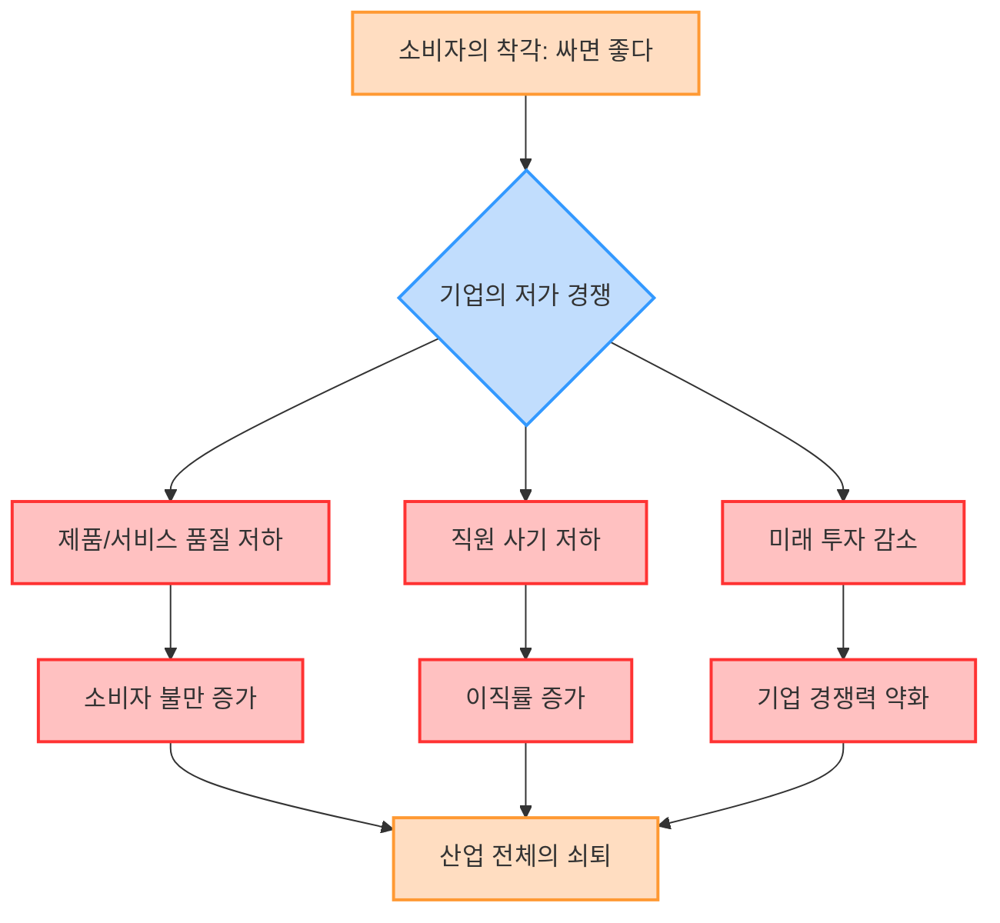
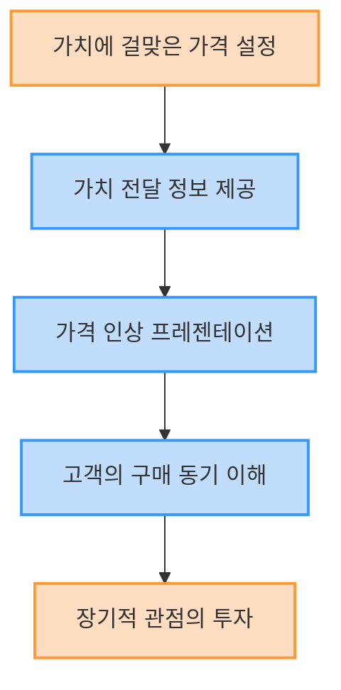

## 책 소개
이 책은 <mark>기업이 가격을 올리는 기술</mark>에 대해 알려주는 책이야. 많은 기업이 가격을 내리면 손님들이 좋아할 거라고 생각하지만, 사실은 그 반대라는 걸 알려줘. 가격을 올리는 것이 오히려 회사를 튼튼하게 하고, 직원들도 행복하게 하며, 더 좋은 제품을 만들 수 있게 해준다는 내용이야. 특히 작은 회사들이 대기업과 가격 경쟁을 하는 게 얼마나 위험한지, 그리고 어떻게 하면 가격을 올리면서도 손님들에게 더 큰 가치를 줄 수 있는지 구체적인 방법들을 알려줄 거야.

## 1. 가격 인상이 필요한 이유: 싸구려 경쟁은 지옥으로 가는 길 

많은 기업이 가격을 내리면 손님들이 많이 찾아올 거라고 생각하지만, 사실은 <mark>지옥으로 가는 문</mark>을 여는 것과 같아 . 특히 작은 회사들은 대기업과 가격 경쟁을 하면 절대 이길 수 없어 .

1. **대기업과의 경쟁에서 질 수밖에 없어** 
  - 대기업은 돈이 많아서 (자본력) 가격을 엄청나게 내려도 버틸 수 있어 .
  - 마치 큰 코끼리와 작은 개미가 싸우는 것과 같아. 개미는 아무리 노력해도 코끼리를 이길 수 없지 .
  - 대기업은 가격을 내려서 시장을 장악한 다음, 나중에 다시 가격을 올리는 전략을 쓰기도 해 .
  - 작은 회사가 이걸 따라 하면 결국 망하게 돼 .
2. **가격 인하가 가져오는 나쁜 결과들** 
  - **기존 손님들을 무시하는 행동이 돼** 
  - 정가(원래 가격)로 물건을 사준 손님들이 가장 소중한 손님들이야 .
  - 그런데 나중에 가격을 내리면, 정가로 산 손님들은 "내가 바보였나?" 하고 기분 나빠할 수 있어 .
  - 마치 친구에게 비싼 값에 물건을 팔았는데, 다음 날 다른 사람에게는 싸게 파는 것과 같아. 친구는 배신감을 느끼겠지 .
  - **회사의 이미지가 나빠져** 
  - 한번 가격을 내리기 시작하면, 손님들은 그 회사를 "싸구려 물건 파는 곳"이라고 생각하게 돼 .
  - 아무리 좋은 물건을 만들어도 "저기는 원래 싼 곳"이라는 이미지가 박히면 비싸게 팔기 어려워 .
  - 마치 항상 할인만 하는 가게는 사람들이 "제값 주고 사면 손해"라고 생각하는 것과 비슷해.
  - **회사의 이익이 크게 줄어들어 (**영업 이익** 압박)** 
  - 물건 가격을 조금만 내려도 회사의 이익(영업 이익)은 엄청나게 줄어들어 .
  - 예를 들어, 100원짜리 물건을 팔아서 30원 이익을 남겼는데, 80원으로 가격을 내리면 이익은 10원으로 줄어들어 .
  - 이익이 3분의 1로 줄어들면, 예전과 같은 돈을 벌려면 3배 더 많은 물건을 팔아야 해 .
  - 이건 직원들이 3배 더 많이 일해야 한다는 뜻이고, 결국 회사 전체가 힘들어지는 거야 .
  - **직원들의 사기가 떨어지고 창의성이 사라져** 
  - 회사가 가격을 내리면 이익이 줄어들고, 결국 직원들 월급도 줄어들 수 있어 .
  - 월급이 줄어들면 직원들은 일할 맛이 안 나고, 새로운 아이디어를 내거나 더 좋은 제품을 만들려는 노력을 하지 않게 돼 .
  - 마치 열심히 일해도 보상이 없으면 아무도 더 잘하려고 하지 않는 것과 같아.
  - **제품의 품질이 나빠질 수 있어 (**모럴 해저드**)** 
  - 가격을 내리다 보면 원가를 줄여야 하니까, 싼 재료를 쓰거나 만드는 과정을 대충 하게 돼 .
  - 이건 결국 제품의 품질을 떨어뜨리고, 손님들의 신뢰를 잃게 만들지 .
  - 일본에서는 식자재를 속여 파는 사건도 있었는데, 이게 다 싸구려 경쟁 때문에 생긴 문제라고 볼 수 있어 .
  - **미래를 위한 투자를 포기하게 돼** 
  - 이익이 줄어들면 새로운 기술을 개발하거나 시설에 투자할 돈이 없어 .
  - 이건 마치 씨앗을 심지 않고 당장 먹을 것만 찾는 것과 같아서, 결국 미래에는 아무것도 얻을 수 없게 돼.
  - **손님들의 불만이 늘어나 (고객층의 질 저하)** 
  - 가격을 내리면 싼 것만 찾는 손님들이 몰려오는데, 이런 손님들은 작은 것에도 불평불만을 많이 하는 경향이 있어 .
  - 원래 비싼 가격을 이해하고 사던 손님들은 제품의 가치를 알지만, 싼 것만 찾는 손님들은 품질에 대한 이해 없이 불평만 할 수 있어 .
  - 마치 뷔페에서 싸다고 마구 먹고 불평하는 손님들이 늘어나는 것과 비슷해.
  - 이런 손님들 때문에 직원들은 스트레스를 받고, 결국 회사를 그만두고 싶어 할 수도 있어 .
  - **경영자가 현장에만 매달리게 돼** 
  - 가격 인하로 판매량을 늘려야 하니까, 경영자는 현장에서 물건 파는 일에만 매달리게 돼 .
  - 원래 경영자는 회사의 미래를 계획하고 큰 그림을 그려야 하는데, 당장 눈앞의 일에만 갇히게 되는 거야 .
  - 마치 배의 선장이 망원경으로 앞바다를 봐야 하는데, 갑판에서 청소만 하고 있는 것과 같아.

## 2. 가격 인상이 가져오는 긍정적인 효과: 선순환의 시작 

가격을 올리는 것은 단순히 돈을 더 버는 것을 넘어, 회사 전체에 좋은 영향을 미치는 선순환 구조를 만들어 .

1. **회사의 이익이 늘어나고 여유가 생겨** 
  - 가격을 올리면 물건을 덜 팔아도 같은 이익을 얻을 수 있어 .
  - 예를 들어, 100원짜리 물건을 130원에 팔면 이익이 2배로 늘어나 .
  - 그러면 예전 판매량의 절반만 팔아도 같은 이익을 얻을 수 있는 거야 .
  - 마치 적게 일하고도 충분한 돈을 버는 것과 같아서, 회사에 여유가 생겨.
2. **직원들의 근무 환경이 좋아지고 사기가 올라가** 
  - 회사의 이익이 늘어나면 직원들 월급도 올려줄 수 있고, 더 좋은 복지를 제공할 수 있어 .
  - 직원들은 더 열심히 일하고 싶어 하고, 회사에 대한 애정도 커지겠지 .
  - 마치 운동선수가 좋은 성적을 내면 더 좋은 대우를 받고, 더 열심히 훈련하는 것과 같아.
3. **더 좋은 제품과 서비스를 만들 수 있어** 
  - 이익이 늘어나면 남는 돈으로 새로운 기술을 연구하고, 제품을 개발하는 데 투자할 수 있어 .
  - 이건 결국 더 좋은 품질의 제품과 서비스를 만들어서 손님들에게 제공할 수 있다는 뜻이야 .
  - 마치 농부가 좋은 씨앗을 심고 비료를 줘서 더 맛있는 열매를 맺는 것과 같아.
4. **회사의 브랜드 가치가 높아져** 
  - 비싼 가격은 오히려 <mark>고급스러운 이미지</mark>를 만들어줄 수 있어 .
  - 사람들은 비싼 물건이 더 좋고 특별하다고 생각하는 경향이 있거든 .
  - 마치 명품 가방이 비싸도 사람들이 사고 싶어 하는 것처럼, 가격이 높으면 그만큼 가치 있는 브랜드로 인식될 수 있어.
5. **경영자가 미래를 계획할 시간을 벌 수 있어** 
  - 회사가 안정되고 이익이 늘어나면, 경영자는 당장 눈앞의 일에서 벗어나 회사의 3년, 5년, 10년 후를 계획할 시간을 가질 수 있어 .
  - 새로운 사업 아이템을 찾거나, 회사의 장기적인 전략을 세우는 데 집중할 수 있게 되는 거야 .
  - 마치 선장이 망원경으로 멀리 있는 섬을 찾아 항해 계획을 세우는 것과 같아.
6. **경쟁사와의 차별점을 만들 수 있어 (참여 장벽 구축)** 
  - 장기적인 투자를 통해 얻은 기술이나 브랜드 가치는 다른 회사들이 쉽게 따라 할 수 없는 <mark>강점</mark>이 돼 .
  - 이런 강점들은 마치 높은 성벽처럼 다른 경쟁자들이 쉽게 들어오지 못하게 막아주는 역할을 해 .
  - 예를 들어, 독점 계약을 맺거나, 오랜 시간 쌓아온 기업 문화 같은 것들이 여기에 해당해 .

## 3. 가격 인상, 어떻게 해야 성공할까? 

가격을 올리는 것이 좋다는 건 알겠지만, 막상 하려면 두렵지? 하지만 <mark>올바른 방법</mark>으로 하면 충분히 성공할 수 있어 .

1. **가치를 더하면 가격을 더 올릴 수 있어** 
  - 단순히 가격만 올리는 게 아니라, <mark>제품이나 서비스의 </mark>가치를 높여야 해 .
  - 가치란 무엇일까? 같은 물건이라도 그 가치를 아는 사람에게는 비싸게 느껴지지 않고, 모르는 사람에게는 비싸게 느껴지는 거야 .
  - 마치 오래된 항아리가 어떤 사람에게는 그냥 쓰레기지만, 어떤 사람에게는 250만 엔짜리 보물이 되는 것과 같아 .
  - **가치를 높이는 구체적인 방법들** 
  - **만드는 과정의 특별함 강조**: "이 제품은 이렇게 많은 시간과 노력을 들여 만들었어요!" 하고 알려주는 거야 .
  - 희소성: "이건 수가 적어서 아무나 가질 수 없어요", "이걸 만들 수 있는 사람은 우리밖에 없어요" 하고 특별함을 강조하는 거지 .
  - **전문가의 인정**: "전문가들이 이 제품을 최고라고 인정했어요" 하고 권위를 보여주는 거야 .
  - **오랜 역사와 전통**: "이건 몇 대째 이어져 온 전통 방식이에요", "역사 속 유명한 사람이 이 제품을 좋아했어요" 하고 스토리를 들려주는 거지 .
  - **독점 판매**: "이건 오직 여기서만 살 수 있어요" 하고 특별한 구매 경험을 제공하는 거야 .
  - **특별한 경험**: "이 제품을 만들기 위해 세상 끝까지 가서 재료를 구해왔어요" 하고 모험적인 스토리를 들려주는 거야 .
  - **특허 기술**: "우리 회사만의 특별한 기술(특허)로 만들었어요" 하고 기술력을 자랑하는 거야 .
  - **뛰어난 내구성**: "오래 써도 고장 나지 않고 처음처럼 좋아요" 하고 제품의 튼튼함을 강조하는 거야 .
  - **완벽한 사후 관리**: "제품을 산 후에도 문제가 생기면 언제든 도와드릴게요" 하고 믿음을 주는 거야 .
  - 이런 강점들을 많이 만들수록 손님들은 기꺼이 비싼 가격을 지불할 거야 .
2. **가격 인상에 적합한 시장을 노려라** 
  - 오랫동안 가격이 계속 내려가던 시장을 노리는 것이 좋아 .
  - 마치 고급 식빵이나 고급 빵이 유행하는 것처럼, 싸구려만 넘치던 시장에서 고급화 전략을 쓰는 거야 .
  - 사람들은 항상 싼 것만 찾는 게 아니라, 특별하고 좋은 것에는 돈을 아끼지 않는 경향이 있거든 .
  - 예를 들어, 관광지에 가면 비싼 기념품이나 특별한 음식을 기꺼이 사는 것과 같아 .
3. **경영자의 마음가짐이 중요해 (**멘탈 블록** 깨기)** 
  - 많은 경영자가 "우리 물건은 싸게 팔아야만 팔릴 거야"라는 생각(멘탈 블록)에 갇혀 있어 .
  - 하지만 사실은 더 비싸게 팔아도 손님들이 더 많이 찾아올 수도 있어 .
  - 마치 80원짜리 튀김 만두를 250원에 팔았더니 오히려 손님들이 줄을 서서 샀다는 이야기처럼 .
  - 이건 손님들이 싼 것보다 <mark>더 좋은 경험</mark>이나 <mark>특별한 가치</mark>를 원하기 때문이야 .
4. 가격 인상** 후 남는 시간을 미래 투자에 써라** 
  - 가격을 올려서 이익이 늘어나고 시간이 생기면, 그 시간을 <mark>회사의 장기적인 미래</mark>를 위해 써야 해 .
  - 경쟁사보다 더 멀리 내다보고, 5년 후, 10년 후를 위한 제품 개발이나 마케팅 전략을 세우는 데 집중하는 거야 .
  - 마치 지금 당장 배부른 것보다, 미래를 위해 씨앗을 심고 밭을 가꾸는 것과 같아.

## 4. 캐시리스 시대의 가격 인상: 호리에몬의 조언 

요즘은 현금 없이 카드나 스마트폰으로 결제하는 캐시리스<mark>(Cashless)</mark> 시대잖아 . 이럴 때도 가격 인상에 대한 고민이 필요해.

1. **수수료를 가격에 포함시켜라** 
  - 카드 결제를 받으면 카드 회사에 수수료를 내야 해 .
  - 호리에몬은 이 수수료를 <mark>제품 가격에 포함</mark>시켜서 팔라고 조언했어 .
  - 마치 택배비를 제품 가격에 포함시키는 것과 같아.
2. **손님들의 편의성을 생각해야 해** 
  - 어떤 가게 주인은 "수수료를 가격에 포함시키면 손님들이 안 올 거예요"라고 걱정했어 .
  - 하지만 호리에몬은 <mark>손님들의 편의성</mark>을 생각해야 한다고 말했어 .
  - 현금을 들고 다니는 것보다 카드로 결제하는 게 훨씬 편하고 안전하잖아 .
  - 카드 회사는 손님들이 현금을 들고 다니면서 겪을 수 있는 위험(분실, 도난 등)을 대신 해결해 주는 역할을 하는 거야 .
  - 그러니까 그 편의성에 대한 비용을 손님들이 지불하는 건 당연하다고 볼 수 있어 .
  - 마치 비행기에서 편하게 여행하는 대가로 비싼 비행기 값을 내는 것과 같아.
3. **결국은 손님을 위한 선택이야** 
  - 겉으로는 손님을 위하는 것 같지만, 사실은 자기 가게의 이익만 생각해서 가격을 올리지 못하는 경우가 많아 .
  - 하지만 장기적으로 보면, <mark>손님들에게 더 좋은 서비스와 편의성</mark>을 제공하기 위해 가격을 올리는 것이 결국 손님을 위하는 길이야 .
  - 마치 부모님이 자녀의 미래를 위해 지금 당장 하고 싶은 것을 참게 하는 것과 같아.

## 5. 소비자의 착각: 싸다고 다 좋은 건 아니야 

소비자들은 보통 "싸고 좋은 물건"을 원한다고 생각하지만, 사실은 <mark>가격이 전부는 아니야</mark> .

1. **소비자의 선택 기준은 다양해** 
  - 사람들은 소중한 물건이나 중요한 일에는 <mark>돈을 아끼지 않는 경향</mark>이 있어 .
  - 마치 결혼식 예복이나 특별한 여행에는 기꺼이 비싼 돈을 쓰는 것과 같아.
  - 싸다고 무조건 사는 게 아니라, 가치를 보고 물건을 선택하는 경우가 많다는 거야 .
2. **인터넷이 가격 경쟁을 부추겼어** 
  - 인터넷 쇼핑이 발달하면서 사람들은 가격 비교 사이트를 통해 가장 싼 물건을 찾게 됐어 .
  - 기업들은 이런 소비자들의 요구에 맞춰 스스로 가격 경쟁에 뛰어들었고, 이게 결국 <mark>싸구려 시장</mark>을 만들게 된 거야 .
  - 마치 모두가 더 싸게 팔려고 경쟁하다가 결국 아무도 돈을 못 버는 상황이 된 것과 같아.
3. **싸구려만 찾는 손님은 회사에 도움이 안 돼** 
  - 오직 가격만 보고 물건을 사는 손님들은 더 싼 곳이 나타나면 언제든 떠나버릴 수 있어 .
  - 이런 손님들은 회사를 오랫동안 지켜주고 아껴주는 <mark>진정한 고객</mark>이 아니라는 거야 .
  - 마치 싼 것만 찾아다니는 철새처럼, 회사가 어려울 때도 함께하지 않는다는 거지.
  - 오히려 <mark>정당한 가격</mark>을 지불하고 제품의 가치를 알아주는 손님들이 회사에 더 소중해 .

## 6. 가격 인상의 기술: 어떻게 설득하고 실행할까? 

가격을 올리려면 단순히 "이제부터 비싸게 팔게요"라고 말하는 것만으로는 안 돼. <mark>손님들을 설득하고 이해시키는 기술</mark>이 필요해 .

1. **가치를 전달하는 것이 중요해 (정보 전달자 역할)** 
  - 손님들에게 우리 제품이 왜 비싼지, 어떤 특별한 가치를 가지고 있는지 <mark>적극적으로 알려줘야</mark> 해 .
  - 마치 미술관에서 그림 옆에 작가의 의도나 그림의 역사적 가치를 설명해 주는 것과 같아. 설명을 들으면 그림이 더 특별해 보이잖아.
2. **손님들의 구매 동기를 이해해야 해** 
  - 사람들이 물건을 사는 이유는 다양해. 크게 네 가지로 나눌 수 있어 .
  - **싸니까 사는 소비**: 가장 싼 것을 찾는 경우야.
  - **비싸니 믿고 안심하는 소비**: 비싼 것이 더 좋고 안전하다고 생각해서 사는 경우야.
  - **사물이 아닌 행위를 사는 소비**: 물건 자체가 아니라, 그 물건을 통해 얻을 수 있는 경험이나 만족감을 사는 경우야.
  - **나다운 것을 사는 소비**: 나만의 개성을 표현하거나, 나에게 특별한 의미가 있는 것을 사는 경우야.
  - 우리 제품이 어떤 구매 동기를 가진 손님들에게 어필할 수 있는지 파악하고, 그에 맞춰 <mark>가치를 강조</mark>해야 해.
3. 가격 인상** 프레젠테이션을 성공시켜라** 
  - 가격을 올릴 때는 손님들에게 <mark>왜 가격을 올려야 하는지</mark>를 명확하게 설명하고 설득하는 과정이 필요해 .
  - 이때 중요한 것은 <mark>질문을 던지는 것</mark>이야 . 손님들이 스스로 생각하게 만들고, 공감대를 형성하는 거지.
  - 마치 중요한 발표를 할 때, 청중에게 질문을 던져서 참여를 유도하는 것과 같아.
4. **가격 인상의 궁극적인 목적은 시간을 버는 것** 
  - 가격을 올리는 가장 큰 목적은 <mark>경영자가 미래를 위한 시간을 버는 것</mark>이야 .
  - 이 시간을 활용해서 회사의 장기적인 성장 전략을 세우고, 새로운 가치를 창출하는 데 집중해야 해 .
  - 마치 바쁜 일상 속에서 잠시 멈춰 서서 미래를 계획하는 시간을 갖는 것과 같아.

