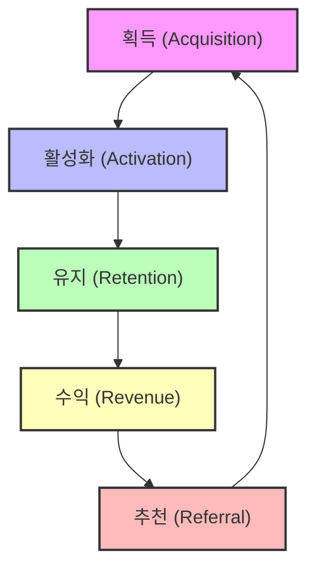
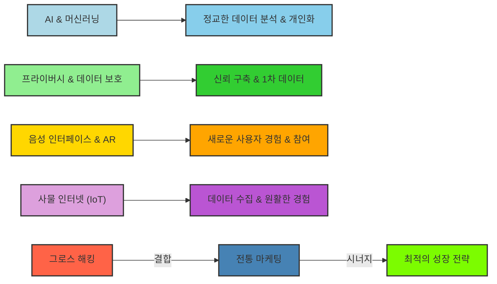

## 1. '그로스 해커 마케팅'이란 무엇일까? 
이 책은 전통적인 마케팅 방식에서 벗어나, 데이터와 기술을 활용해 폭발적인 성장을 이루는 새로운 마케팅 방식인 '그로스 해킹'에 대해 알려주는 책이다. 마치 오래된 지도 대신 최신 내비게이션을 쓰는 것처럼, 마케팅의 모든 과정을 새롭게 바라보는 방법을 배울 수 있다.

### 1.1. 전통 마케팅의 한계: 비싸고 비효율적인 도박 

1. **오래된 방식**: 전통 마케팅은 마치 75년 동안 변하지 않은 낡은 규칙을 따르는 것과 같았다. 
  1. 광고를 사고, 기자들에게 홍보하고, 이벤트를 기획하는 식이었다. 
2. **블록버스터 환상**: 마치 영화 개봉처럼, 제품을 비밀리에 개발한 후 마케팅 부서에 넘겨 "이제 이걸 팔아봐!"라고 하는 방식이었다. 
  1. 수백만 달러를 들여 사람들의 관심을 끌려고 노력했다. 
3. **실패의 연속**: 하지만 대부분의 경우, 이런 방식은 잘 통하지 않았다. 
  1. 대부분의 영화가 실패하고, 대부분의 제품이 망했다. 
  2. 성공하더라도 왜 성공했는지 아무도 정확히 알지 못했다. 
  3. 이는 마치 비 오는 날 성냥을 켜고 기적을 바라는 것과 같았다. 
4. **대기업만의 특권**: 대기업은 몇 번의 실패를 감당할 수 있었지만, 자금 없는 스타트업이나 열정적인 창작자에게는 큰 도박이었다. 
  1. 이런 비효율적인 시스템을 보고 '그로스 해커'들은 "더 나은 방법이 있을 거야!"라고 생각하기 시작했다. 

### 1.2. 그로스 해커의 등장: 마케팅의 새로운 시대 

1. **핫메일(Hotmail) 이야기**: 1996년, 사비르 바티아와 잭 스미스는 무료 웹 기반 이메일 서비스인 핫메일을 만들었다. 
  1. 투자자 팀 드레이퍼는 "어떻게 홍보할 건가요?"라고 물었다. 
  2. 창업자들은 빌보드나 라디오 광고 같은 비싼 전통 방식을 생각했지만, 드레이퍼는 고개를 저었다. 
  3. 드레이퍼는 이메일 하단에 "추신: 사랑해요. 핫메일에서 무료 이메일을 받으세요."라는 문구를 넣는 아이디어를 냈다. 
  4. 이 작은 아이디어는 제품 자체를 마케팅 도구로 만들었다. 
  5. 결과: 6개월 만에 100만 명, 3년 만에 3천만 명의 사용자를 확보하고 마이크로소프트에 4억 달러에 매각되었다. 
2. **라이언 홀리데이의 깨달음**: 25세에 아메리칸 어패럴의 마케팅 이사였던 라이언 홀리데이는 '그로스 해커가 새로운 마케팅 부사장이다'라는 기사를 읽고 충격을 받았다. 
  1. 그는 자신의 직업이 구식이라는 것을 깨달았다. 
  2. 그로스 해커는 마케터, 코더, 과학자의 역할을 모두 하는 새로운 유형의 전문가였다. 
  3. 이 책은 라이언 홀리데이가 이 새로운 사고방식을 이해하고 적용하는 여정을 담고 있다. 
3. **그로스 해커의 특징**: 그로스 해커는 단순히 마케터가 아니라, 성장(Growth)에 미친 듯이 집중하는 사람이다. 
  1. 그들은 직감이나 전통에 의존하지 않고, 데이터, 창의성, 기술을 활용해 비즈니스를 성장시키는 비전통적인 방법을 찾는다. 
  2. 마케팅을 별도의 기능이 아니라 제품 자체의 필수적인 부분으로 본다. 
  3. 마치 소프트웨어 개발자가 코드를 계속 업데이트하고 개선하는 것처럼, 마케팅을 끊임없는 실험으로 여긴다. 

## 2. 그로스 해킹의 4단계: 제품을 만들고, 알리고, 퍼뜨리고, 유지하기 

그로스 해킹은 단순히 광고를 많이 하는 것이 아니라, 제품을 만들고, 알리고, 퍼뜨리고, 고객을 유지하는 모든 과정에 마케팅 사고방식을 적용하는 것이다. 마치 씨앗을 심고, 물을 주고, 햇빛을 쬐어주고, 병충해를 막아주는 것과 같다.

### 2.1. 1단계: 제품-시장 적합성(Product-Market Fit) 찾기 

이 단계는 사람들이 정말로 원하는 것을 만드는 것이다. 마치 배고픈 사람에게 맛있는 음식을 주는 것처럼, 사람들이 간절히 필요로 하는 제품을 만드는 것이 가장 중요하다.

1. **가장 중요한 첫걸음**: 전통 마케터는 만들어진 제품을 팔려고 하지만, 그로스 해커는 "사람들이 이걸 정말로 원할까?"라고 묻는다. 
  1. 아무도 필요로 하지 않는 제품으로 시작하는 것이 최악의 마케팅 결정이다. 
2. 제품-시장 적합성**(**Product-Market Fit**)이란?**: 특정 그룹의 사람들이 너무나 간절히 필요로 해서 저절로 팔리는 제품을 만드는 것이다. 
  1. 이것은 당신이 만든 제품과 그 제품을 사용할 사람들 사이의 완벽한 조화다. 
  2. 마치 스마트폰을 처음 사용했을 때 "이거 없이 어떻게 살았지?"라고 느꼈던 감정과 같다. 
3. **에어비앤비(Airbnb) 사례**: 에어비앤비는 처음부터 지금처럼 거대하지 않았다. 
  1. 2007년, 창업자들은 샌프란시스코 로프트에 에어 매트리스를 놓고 아침 식사를 제공하는 '에어 베드 앤 브렉퍼스트'로 시작했다. 
  2. 그들은 고객의 피드백을 듣고, 관찰하고, 제품을 계속 개선했다. 
  3. 디자인 컨퍼런스 기간에 호텔이 항상 만실이라는 것을 발견하고, 컨퍼런스 참가자들을 위한 네트워킹 대안으로 포지셔닝했다. 
  4. 사람들이 단순히 싼 숙소가 아니라 독특한 여행 경험을 원한다는 것을 깨닫고, 아침 식사 부분을 없애고 이름을 '에어비앤비'로 줄여 비전을 확장했다. 
  5. 그들은 에어 매트리스가 아닌, 상상할 수 있는 모든 독특한 공간을 빌려주는 서비스로 바뀌었고, 이것이 폭발적인 아이디어가 되었다. 
  6. 가장 좋은 마케팅 결정은 광고 캠페인이 아니라, 제품을 거부할 수 없을 정도로 매력적으로 바꾼 것이었다. 
4. **인스타그램(Instagram) 사례**: 인스타그램도 처음에는 '버번(Bourbon)'이라는 복잡한 위치 기반 소셜 네트워크였다. 
  1. 사용자들이 대부분의 기능은 무시하고 사진 필터 기능만 열정적으로 사용한다는 데이터를 발견했다. 
  2. 그들은 용감하게 거의 모든 기능을 버리고, '사진 찍고, 멋진 필터 추가하고, 공유하기'라는 핵심 기능만 남겼다. 
  3. '인스타그램'으로 다시 출시한 지 일주일 만에 10만 명의 사용자를 확보했고, 18개월 후 페이스북에 10억 달러에 매각되었다. 
5. **그로스 해커의 역할**: 마케팅은 제품이 만들어진 후에 하는 것이 아니라, 제품을 만드는 과정 그 자체다. 
  1. 마케터는 엔지니어, 디자이너와 함께 "누구를 위해 만드는가?", "어떤 문제를 해결하는가?", "초기 사용자들이 무엇을 좋아하고 무엇을 무시하는가?"와 같은 질문을 던져야 한다. 
  2. 이는 겸손함과 증거가 잘못된 길을 가리킬 때 몇 달간의 노력을 기꺼이 버릴 수 있는 용기가 필요하다. 
  3. 가장 먼저 시장에 진출하는 사람이 아니라, 제품-시장 적합성을 가장 먼저 달성하는 사람이 승리한다. 
  4. 일단 제품-시장 적합성을 찾으면, 모든 마케팅 노력은 마치 휘발유에 흠뻑 젖은 장작 더미에 불꽃이 튀는 것처럼 폭발적인 효과를 낸다. 
6. 최소 기능 제품**(**MVP**)과 피드백**: 에릭 리스(Eric Ries)는 '최소 기능 제품(Minimum Viable Product, MVP)'을 만들고 피드백을 통해 개선하라고 말한다. 
  1. MVP는 간단한 데모, 블로그 게시물, 스케치 등 무엇이든 될 수 있다. 
  2. 친구, 가족이 아닌 실제 고객에게 보여주고 "무엇이 좋았고, 무엇이 부족했나요?"라고 물어봐야 한다. 
  3. 이 피드백을 바탕으로 아이디어를 바꿀 준비가 되어 있어야 한다. 
  4. 책을 쓰는 저자가 1년 동안 숨어서 책을 쓰는 대신, 블로그에 글을 올려 독자 반응을 살피는 것과 같다. 
  5. 크라우드 에디팅(Crowd-editing)처럼 200명에게 제품을 배포하고 "어떻게 바꾸면 좋을까요?"라고 묻는 방법도 있다. 
7. **제품-시장 적합성을 위한 도구**:
  1. **크레이지 에그(Crazy Egg)**: 웹사이트에서 사용자들이 어디를 클릭하고, 어디까지 스크롤하며, 무엇을 보는지 보여주는 히트맵(Heatmap)과 스크롤맵(Scrollmap)을 제공한다. 
  2. **유저빌리티 허브(Usability Hub)**: 테스트할 사용자들을 모집하는 데 사용된다. 
  3. **퀄라루(Qualaroo)**: 방문자들에게 피드백을 요청하는 팝업 등을 만들 수 있다. 
  4. **구글 폼(Google Forms)**: 저렴하게 아이디어를 테스트하고 피드백을 받을 수 있다. 

### 2.2. 2단계: 그로스 핵(Growth Hack) 찾기 

제품-시장 적합성을 찾았다면, 이제는 소수의 열정적인 팬들에게 제품을 알릴 차례다. 마치 낚시꾼이 물고기가 가장 많이 모이는 곳에 정확히 낚싯대를 던지는 것과 같다.

1. **전통적인 출시 방식 거부**: 그로스 해커는 뉴욕 타임즈 1면에 실리거나 수백만 명에게 동시에 도달하려는 환상을 거부한다. 
  1. 그들은 망치 대신 메스(수술용 칼)를 사용한다. 
  2. 모든 사람에게 도달하는 것이 아니라, '올바른 사람들', 즉 첫 번째 진정한 팬들에게 가장 저렴하고 효과적인 방법으로 도달하는 것이 목표다. 
2. **드롭박스(Dropbox) 사례**: 드롭박스는 파일 공유라는 훌륭한 제품이 있었지만 설명하기 어려웠다. 
  1. 창업자 드류 휴스턴은 3분짜리 데모 비디오를 만들었다. 
  2. 이 비디오는 딕(Digg)이나 레딧(Reddit) 같은 웹사이트에서 활동하는 기술에 능숙한 얼리 어답터(Early Adopter, 신제품을 일찍 사용하는 사람)들을 겨냥했다. 
  3. 그는 그 커뮤니티만이 이해할 수 있는 내부 농담과 레퍼런스로 비디오를 채웠다. 
  4. 이 비디오는 하룻밤 사이에 폭발적인 반응을 얻었고, 드롭박스 대기자 명단은 5천 명에서 7만 5천 명으로 늘어났다. 
  5. 이 완벽하게 타겟팅된 비디오 하나가 그들에게 필요한 전부였다. 
3. **타겟 사용자에게 직접 찾아가기**: 핵심은 타겟 사용자들이 이미 있는 곳으로 가는 것이다. 
  1. 패션 애호가를 위한 제품이라면 타임스퀘어에 빌보드를 세우는 대신, 그들이 매일 읽는 최고의 패션 블로그에 소개될 방법을 찾아야 한다. 
  2. 게이머를 위한 도구라면 월스트리트 저널에 홍보하는 대신, 트위치(Twitch)의 영향력 있는 스트리머들과 연결해야 한다. 
4. **다른 플랫폼에 편승하기**: 때로는 다른 회사의 플랫폼에 '편승(Piggyback)'하는 것이 더 영리한 그로스 핵이 될 수 있다. 
  1. **페이팔(PayPal)과 이베이(eBay)**: 페이팔은 비자(Visa)나 마스터카드(Mastercard)와 직접 경쟁하는 대신, 이베이(eBay)라는 새로운 시장에 집중했다. 
  - 이베이 사용자들을 위한 최고의 결제 솔루션이 됨으로써, 이베이의 거대한 사용자 기반에서 초기 성장을 얻었다. 
  - 페이팔은 구매자 봇을 만들어 이베이 판매자들에게 페이팔을 사용할 수 있는지 묻고, 판매자가 동의하면 구매하는 방식으로 "모두가 페이팔을 원한다"는 인식을 심어주었다. 
  2. **에어비앤비(Airbnb)와 크레이그리스트(Craigslist)**: 에어비앤비는 단기 임대를 찾는 사람들이 이미 크레이그리스트(Craigslist)에 있다는 것을 알았다. 
  - 그들은 에어비앤비에 아파트를 등록하는 사람이 클릭 한 번으로 크레이그리스트에도 동시에 올릴 수 있는 도구를 만들었다. 
  - 이 작은 웹사이트는 세계에서 가장 큰 웹사이트 중 하나에서 무료로 배포될 수 있었다. 
  - 이는 전통적인 마케터는 생각지도 못했을 기술적인 해결책이었다. 
5. **다양한 그로스 핵 전략**:
  1. **초대 전용 기능**: 지메일(Gmail)처럼 초대받은 사람만 사용할 수 있게 하여 희소성과 가치를 높인다. 
  2. **가짜 프로필로 인기 유도**: 레딧(Reddit)처럼 수백 개의 가짜 프로필을 만들어 제품이 인기 있는 것처럼 보이게 한다. 사람들은 군중을 따르는 경향이 있다. 
  3. **작은 그룹으로 시작하여 확장**: 페이스북(Facebook)이 하버드 대학에서 시작하여 다른 대학, 그리고 전 세계로 확장한 것처럼, 특정 그룹을 먼저 공략한다. 
  4. **멋진 이벤트 개최**: 우데미(Udemy), 마이스페이스(Myspace), 틴더(Tinder), 옐프(Yelp)처럼 멋진 이벤트를 열어 영향력 있는 사람들을 모은다. 
  5. 앱 스토어 최적화**(ASO)**: 인스타그램, 스냅챗처럼 앱 스토어에서 상위에 노출되도록 키워드 최적화 등을 한다. 
  6. **영향력 있는 자문위원/투자자 활용**: 이들을 통해 더 큰 유통 채널에 접근한다. 
  7. **자선 활동 연계**: 아마존 스마일(smile.amazon.com)처럼 구매 금액의 일부를 고객이 선택한 자선단체에 기부하게 하여 홍보 효과를 얻는다. 
  8. PR 스턴트: 타코벨(Taco Bell)이 자유의 종을 샀다고 주장한 것처럼, 기발한 홍보 활동으로 주목을 끈다. 
  9. **유머러스한 비디오 제작**: 달러 쉐이브 클럽(Dollar Shave Club)처럼 재미있는 비디오로 바이럴(Viral) 효과를 노린다. 
  10. **내부 **데이터 기반** 인포그래픽/시각화**: 허브스팟(HubSpot)처럼 고객 데이터를 분석하여 독점적인 연구 자료를 만들고 공유한다. 
  11. **가치 있는 콘텐츠 제작**: 바크포스트(BarkPost)처럼 제품 홍보 대신 오락성 밈(Meme)을 만들어 고객에게 가치를 제공한다. 
  12. **타겟 사이트에 홍보**: 타겟 고객이 방문하는 틈새 시장(Niche) 사이트에 제품을 홍보한다. 
  13. **커뮤니티 게시판 활용**: 해커 뉴스(Hacker News), 쿼라(Quora), 레딧(Reddit) 같은 커뮤니티에 게시하여 얼리 어답터들을 찾는다. 
  14. **인기 주제 블로그 글 작성**: AI처럼 인기 있는 주제에 대한 블로그 글을 쓰고, 그 안에 제품을 간접적으로 홍보한다. 
  15. **킥스타터(Kickstarter) 또는 인디고고(Indiegogo)**: 초기 사용자들에게 VIP 액세스나 무료 티셔츠 같은 보상을 제공하여 프로젝트 자금을 모은다. 
  16. **HARO (Help a Reporter Out)**: 기자들이 전문가의 의견을 찾을 때, 전문가로서 인용되어 주요 매체에 노출되고 백링크(Backlink)를 얻는다. 
  17. **개별 고객 직접 유치**: 수의사 소프트웨어 홍보 시, 영향력 있는 수의사들에게 무료 VIP 패스와 마이크를 제공하며 수동으로 접근한 것처럼, 한 명씩 직접 찾아가 특별한 인센티브를 제공한다. 
  18. **우버(Uber)의 스턴트**: 사우스 바이 사우스웨스트(South by Southwest) 컨퍼런스에서 택시를 찾기 어려운 기술 분야 영향력 있는 사람들에게 무료 차량 서비스를 제공했다. 
  19. **메일박스(Mailbox)의 독점성**: 초대 전용 시스템으로 대기자 명단을 만들고 소셜 버즈(Social Buzz)를 일으켰다. 
  20. **에어비앤비의 무료 전문 사진 촬영**: 숙소의 전환율을 높이고, 집주인과의 관계를 깊게 하며, 긍정적인 홍보 효과를 얻었다. 

### 2.3. 3단계: 바이럴(Viral) 확산 설계 

제품이 좋고 초기 팬들을 확보했다면, 이제는 제품이 저절로 퍼져나가게 만드는 단계다. 마치 감기에 걸린 사람이 재채기를 하면 바이러스가 퍼지는 것처럼, 제품이 자연스럽게 입소문을 타게 만드는 것이다.

1. **바이럴은 우연이 아니다**: "바이럴하게 퍼져야 해!"라고 말하는 것은 피자를 주문하는 것처럼 간단한 일이 아니다. 
  1. 바이럴은 우연이 아니라 '설계'되는 것이다. 
2. 사회적 자본**(Social Capital) 활용**: 사용자들이 친구, 가족, 동료에게 제품을 추천하는 것은 그들의 평판을 거는 큰 부탁이다. 
  1. 그들이 그렇게 하려면 제품이 <u>매우 쉽고</u> <u>매우 보람 있게</u> 만들어져야 한다. 
  2. 바이럴은 제품 자체에 내재되어 있어야 한다. 
3. **핫메일(Hotmail)의 **바이럴 엔진: 이메일 하단의 "PS: 사랑해요. 핫메일에서 무료 이메일을 받으세요."라는 문구는 단순한 광고가 아니라 바이럴 엔진이었다. 
  1. 모든 사용자가 영업사원이 되었고, 제품은 본질적으로 퍼지도록 설계되었다. 
4. **드롭박스(Dropbox)의 **추천 프로그램: 드롭박스는 유료 광고가 비효율적이라는 것을 깨달았다. 
  1. 그들은 추천 프로그램을 만들었다: "친구를 드롭박스에 초대하면, 친구와 당신 모두 추가 무료 저장 공간을 받는다." 
  2. 하룻밤 사이에 가입자가 60% 증가했고, 현재 전체 드롭박스 사용자 중 3분의 1 이상이 이 추천 프로그램을 통해 유입된다. 
  3. 그들은 광고비를 내는 대신, 자신들이 통제하는 화폐(디지털 공간)로 사용자들에게 마케팅을 대신하게 했다. 
5. **내장된 인센티브(Built-in Incentives)**:
  1. **그루폰(Groupon)**: 모든 딜(Deal)에 "친구를 추천하면 10달러를 받는다"는 제안이 있다. 
  2. **리빙소셜(Living Social)**: "세 명의 친구가 당신의 링크를 통해 구매하면 이 딜을 무료로 받는다"고 하여 고객을 수수료 기반 영업사원으로 만들었다. 
  3. **웰스프론트(Wealthfront)**: 미리 작성된 이메일이나 소셜 게시물을 통해 친구를 초대하면 5,000달러를 무료로 관리해준다. 
6. **제품 사용의 가시성(Visibility)**: 사람들은 다른 사람들이 하는 것을 보고 따라 하고 싶어 한다. 
  1. 그로스 해커는 "우리 제품 사용을 어떻게 더 눈에 띄게 만들 수 있을까?"라고 끊임없이 묻는다. 
  2. **애플(Apple)의 흰색 이어폰**: 다른 모든 이어폰이 검은색일 때, 애플은 흰색 이어폰을 만들었다. 
  - 이 단순한 디자인 선택은 모든 아이팟(iPod)과 아이폰(iPhone) 사용자를 '움직이는 광고판'으로 만들었다. 
  - 지하철, 헬스장, 길거리에서 쉽게 알아볼 수 있었고, 이는 사회 과학자 조나 버거(Jonah Berger)가 말하는 '행동 잔여물(Behavioral Residue)'을 만들었다. 
  - 애플은 로고 스티커를 제공하고, 모니터 뒷면에 로고를 넣어 다른 사람들이 볼 수 있게 한다. 
  3. **'Sent from my iPhone'**: 새로운 앱이나 서비스에서 오는 거의 모든 이메일 하단에 "Sent from my iPhone" 또는 "Sent from Mailbox"와 같은 문구가 있다. 
  - 이것은 제품 사용에 직접 내장된 무료 광고다. 
  4. **스포티파이(Spotify)와 페이스북(Facebook) **연동: 스포티파이가 페이스북과 통합되었을 때, 친구들이 실시간으로 당신이 듣는 음악을 볼 수 있게 되었다. 
  - 이는 "이 스포티파이(Spotify)라는 게 뭐야?"라는 수백만 건의 대화를 촉발했다. 
  5. **터보택스(TurboTax)**: 환급을 받으면 트위터에 환급받았다고 트윗할 수 있는 옵션이 있다. 
  6. **코인베이스(Coinbase)**: 결제 과정에서 "코인베이스에서 비트코인 1개를 샀다"는 트윗을 올릴 수 있게 한다. 
  7. **드롭캠(Dropcam)**: 카메라로 찍은 클립을 쉽게 공유할 수 있게 한다. 
7. **공유의 이유 제공**: 단순히 '페이스북에 공유' 버튼을 붙인다고 되는 것이 아니다. 
  1. 사람들이 왜 공유할 것인지 물어야 한다. 
  2. 그것이 그들을 똑똑하게 보이게 하는가? 구체적인 보상을 제공하는가? 친구들과 연결시켜주는가? 
  3. 그들에게 공유할 이유를 주어야 한다. 
8. **바이럴은 과학이다**: 바이럴은 운이 아니라 과학이다. 
  1. 사용자를 단순히 고객이 아니라 가장 강력한 마케팅 채널로 생각하는 것에서 시작한다. 
  2. 바이럴리티에 대해 더 알고 싶다면 와튼 스쿨 교수 조나 버거(Jonah Berger)의 책 <em>컨테이저스(Contagious: Why Things Catch On)</em>를 추천한다. 
9. **공유를 유도하는 제품/경험 디자인**:
  1. **리퀴드 데스(Liquid Death)**: 물 회사인데도 '죽음의 물'이라는 극적인 이름과 해골 이미지, 좀비 영상 등 과장된 마케팅으로 입소문을 유도한다. 
  2. **차별화된 패키징**: 관절염 영양제 회사에서 1950년대 스타일의 그림을 패키지에 넣어 다른 제품과 차별화하고 입소문을 유도한 사례처럼, 독특한 디자인으로 주목을 끈다. 
  3. **기억에 남는 **고객 경험: 호텔에서 특별한 서비스를 제공하거나, 고객의 어려움을 해결해주는 등 감동적인 경험을 통해 입소문을 만든다. 
  4. **공유할 만한 주제**: 부모들이 아이들이 노는 숨겨진 라운지가 있는 상점에 대해 이야기하는 것처럼, 사람들이 서로 이야기하고 싶어 할 만한 독특하고 놀라운 요소를 만든다. 
10. **팀 페리스(Tim Ferriss)의 '4시간 셰프' 사례**: 책이 서점에 진열되지 못하는 재앙에 직면했을 때, 그로스 해킹을 사용했다. 
  1. 바이럴리티: 1억 7천만 명의 사용자를 가진 파일 공유 플랫폼 비트토렌트(BitTorrent)와 제휴했다. 
  2. 책의 보너스 자료(250페이지 이상의 콘텐츠, 비디오, 인터뷰 등)를 무료 번들로 제공했다. 
  3. 이것은 '구매 전 체험'의 궁극적인 형태였다. 
  4. 200만 명이 이 무료 번들을 다운로드하여 수십만 권의 책 판매로 이어졌다. 
  5. 이는 어떤 서점도 제공할 수 없었던 바이럴 성공이었다. 

### 2.4. 4단계: 유지 및 최적화(Retention & Optimization)로 루프 닫기 

새로운 고객을 유치하는 것도 중요하지만, 그 고객들이 떠나지 않게 붙잡아두는 것이 훨씬 더 중요하다. 마치 물이 새는 양동이에 계속 물을 붓는 것이 아니라, 양동이의 구멍을 막는 것과 같다.

1. **성장은 유치만이 아니다**: 전통 마케팅은 고객을 유치하면 끝이라고 생각하지만, 그로스 해커에게는 이때부터 가장 중요한 일이 시작된다. 
  1. 새로운 고객을 유치하는 데 모든 노력을 쏟아부어도, 그들이 양동이 바닥의 구멍으로 빠져나가면 무슨 소용이 있을까? 
  2. 성장은 단순히 고객을 '얻는 것'이 아니라, '유지하는 것'이다. 
  3. 행복하고 헌신적인 사용자는 최고의 마케팅 도구다. 
2. **트위터(Twitter) 사례**: 트위터는 초기 많은 가입자를 확보했지만, 대부분이 떠나버리는 문제가 있었다. 
  1. 마케팅 팀은 더 많은 광고를 살 수도 있었지만, 그것은 체에 물을 붓는 것과 같다는 것을 알았다. 
  2. 그들의 최고의 마케팅 전략은 새로운 고객을 유치하는 것이 아니라, 기존 고객을 위해 제품을 개선하는 것이었다. 
  3. 그로스 해커 조쉬 엘만(Josh Elman)은 데이터를 분석하여, 새로운 사용자가 첫날 5~10개의 계정을 팔로우하면 트위터의 가치를 이해하고 장기 사용자가 될 가능성이 훨씬 높다는 것을 발견했다. 
  4. 이 통찰력을 바탕으로 가입 절차를 완전히 재설계하여, 사용자의 관심사에 따라 흥미로운 계정을 적극적으로 추천하기 시작했다. 
  5. 이 작은 변화는 사용자 유지율에 엄청난 영향을 미쳤고, 양동이의 구멍을 막았다. 
3. 지속적인 최적화**(Constant Optimization)**: 제품은 결코 완성되지 않는다는 겸손함을 가져야 한다. 
  1. 항상 개선할 부분이 있다. 홈페이지의 가입 버튼 색깔, 결제 과정의 단계 수, 사용자들이 가장 강력한 기능을 모르는 것 등. 
  2. 그로스 해커는 과학자처럼 행동한다. 
  3. 사용자들이 실제로 무엇을 하는지 추적하고, A/B 테스트(두 가지 버전을 비교하여 더 나은 것을 찾는 실험)를 실행한다. 
  4. 데이터에 집착하는 이유는 직감에 의존하던 세상에서 데이터가 명확성을 제공하기 때문이다. 
4. 데이터 기반** 의사 결정**: 그로스 해킹에서는 데이터가 왕이다. 
  1. 직감이나 추측에 의존하는 시대는 지났다. 모든 결정은 데이터에 의해 뒷받침된다. 
  2. 마치 형사가 복잡한 사건을 해결할 때 증거를 수집하고 단서를 분석하는 것과 같다. 
  3. 웹사이트 사용자 행동부터 각 마케팅 채널의 성과까지 모든 것을 추적한다. 
  4. 넷플릭스(Netflix)는 데이터로 어떤 쇼를 제작할지, 사용자에게 추천을 개인화하는 방법까지 결정한다. 
  5. 중요한 것은 "무엇이 효과가 있다고 생각하는가"가 아니라 "데이터가 무엇이 효과가 있다고 보여주는가"이다. 
5. **저기술(Low-tech) 솔루션**: 때로는 해결책이 첨단 기술이 아닐 수도 있다. 
  1. 강아지 에어비앤비(Airbnb) 같은 '도그 바케이(Dog Vacay)'는 많은 사람이 가입만 하고 펫 시터를 예약하지 않는다는 것을 발견했다. 
  2. 그들은 확장성이 없어 보이는 방법을 시도했다: 직접 전화하기. 
  3. 팀원이 새로운 사용자에게 전화해서 서비스를 안내하고 첫 호스트를 찾도록 도왔다. 
  4. 이 개인적인 접촉은 수많은 잠재 고객을 활동적인 충성 고객으로 만들었다. 
6. **기존 고객 유지의 중요성**: 새로운 고객을 쫓는 것보다 기존 고객에게 집중하는 것이 거의 항상 더 이익이다. 
  1. 고객 유지율을 5%만 높여도 수익성이 30% 증가할 수 있다. 
  2. 기존의 행복한 고객에게 판매하는 것이 새로운 잠재 고객에게 판매하는 것보다 훨씬 쉽다. 
  3. 한 그로스 해커는 "유지율이 유치율을 이긴다(Retention trumps acquisition)"고 말한다. 
7. 제품 적격 리드**(PQL)의 중요성**: 많은 사람들이 계정을 만들고 다시 돌아오지 않는 문제가 있다. 
  1. 핵심은 계정을 만든 후 사용자들이 어떤 핵심 행동을 해야 제품의 가치를 느끼고 계속 사용할지 알아내는 것이다. 
  2. 트위터는 첫날 5~10개의 계정을 팔로우하는 것이 중요했고, 드롭박스는 최소 하나의 파일을 드롭박스 폴더에 드래그하는 것이 중요했다. 
  3. 마케팅 적격 리드(MQL)는 단순히 가입한 사람이지만, 제품 적격 리드(PQL)는 제품의 가치를 느끼고 '와우(Wow) 순간'을 경험한 사람이다. 
8. **팀 페리스(Tim Ferriss)의 '4시간 셰프' 사례 (최적화)**:
  1. 그들은 모든 것을 추적했다. 
  2. 어떤 블로그 게시물이 판매를 유도했는지, 비트토렌트 캠페인이 얼마나 효과적이었는지 알았다. 
  3. 그들은 추측하는 것이 아니라 배우고 있었고, 다음 출시를 위해 그 교훈을 적용할 준비가 되어 있었다. 

## 3. 그로스 해킹의 핵심 원칙과 미래 

그로스 해킹은 단순히 새로운 기술을 사용하는 것이 아니라, 마케팅에 대한 근본적인 사고방식을 바꾸는 것이다. 마치 낡은 나침반 대신 GPS를 사용하는 것처럼, 비즈니스의 모든 단계에서 성장을 위한 방향을 제시한다.

### 3.1. 마케팅은 부서가 아닌 사고방식이다 
1. **핵심 아이디어**: 마케팅은 더 이상 특정 부서의 일이 아니라, 비즈니스나 창의적인 프로젝트의 모든 부분에 스며들어야 하는 '사고방식'이다. 
2. **낡은 모델 vs. 새로운 모델**:
  1. **전통 마케팅**: 제품을 만든 후 마지막에 사용하는 '확성기'와 같았다. 
  2. 그로스 해킹: 처음부터 사람들이 공유하고 싶어 할 만한 것을 만들도록 안내하는 '나침반'과 같다. 
3. **창작자에게 힘을 실어주다**: 이 접근 방식은 창작자에게 다시 힘을 실어준다. 
  1. 거대한 예산이나 화려한 PR 대행사의 인맥이 필요 없다. 
  2. 필요한 것은 호기심, 경청하려는 의지, 그리고 테스트하고 틀릴 용기다. 
  3. 인터넷 도구 덕분에 누구나 아이디어를 추적하고, 테스트하고, 개선할 수 있게 되었다. 
4. **모든 분야에 적용 가능**: 실리콘밸리의 기술 스타트업만을 위한 것이 아니다. 
  1. **작가**: 블로그에서 챕터 아이디어를 테스트할 수 있다. 
  2. **음악가**: 소수의 팬들에게 싱글을 공개하고 피드백을 받아 앨범 전체를 제작할 수 있다. 
  3. **학생**: 학급 친구들을 설문조사하여 그들이 실제로 무엇에 관심 있는지 알아낼 수 있다. 
  4. 이것이 바로 제품-시장 적합성의 본질이며, 모든 것에 적용된다. 

### 3.2. 그로스 해커처럼 생각하는 3가지 방법 

1. **자신의 **제품-시장 적합성** 찾기**:
  1. 다음 큰 아이디어에 올인하기 전에, '최소 기능 제품(MVP)'을 만든다. 
  2. 친구, 가족이 아닌 실제 고객에게 보여주고 "무엇이 좋았고, 무엇이 부족했나요?"라고 묻는다. 
  3. 그들의 말에 따라 아이디어를 바꿀 준비를 한다. 
2. **하나의 진정한 채널 찾기**:
  1. 모든 소셜 미디어 플랫폼에 흩어져 힘을 낭비하는 대신, 조사를 한다. 
  2. 이상적인 고객(첫 100명의 팬)이 온라인에서 어디에 살고 있는지 찾는다. 
  3. 특정 서브레딧(Subreddit), 틈새 페이스북 그룹, 틱톡(TikTok)의 특정 해시태그 등 그 한 곳을 찾아가 가치를 제공한다. 
  4. 무언가를 요청하기 전에 질문에 답하고, 지식을 공유하고, 관계를 구축한다. 
3. **하나의 **바이럴 루프**(**Viral** Loop) 내장하기**:
  1. 만들고 있는 것이 사람들이 공유하도록 장려할 수 있는 작고 간단한 방법이 있는지 생각한다. 
  2. 복잡할 필요는 없다. 프레젠테이션에서 공유하기 좋은 인용문 그래픽을 만드는 것만큼 간단할 수 있다. 
  3. "친구를 클럽 모임에 데려오면 둘 다 무료 피자를 받는다"는 제안처럼, 첫 팬들이 당신의 전도사가 되도록 쉽고 보람 있게 만든다. 

### 3.3. 교차 플랫폼 성장과 필수 도구 

오늘날의 디지털 세상에서는 하나의 플랫폼에만 머무는 것이 아니라, 여러 플랫폼을 넘나들며 고객과 소통해야 한다. 마치 여러 개의 다리를 놓아 사람들이 어디로든 쉽게 건너갈 수 있게 하는 것과 같다.

1. 교차 플랫폼 성장: 여러 접점에서 일관된 사용자 경험을 만들어 성장의 기회를 극대화하는 것이다. 
  1. 좋아하는 브랜드와 상호작용하는 방식(인스타그램 광고, 노트북 웹사이트 방문, 모바일 앱 구매)이 모두 매끄럽게 연결되어야 한다. 
  2. 타겟 고객이 시간을 보내는 곳을 이해하고 그 플랫폼에 존재해야 한다. 
  3. 각 플랫폼의 강점을 활용해야 한다. 인스타그램은 시각적 제품 홍보에, 블로그는 심층적인 교육 콘텐츠에 적합하다. 
  4. 한 플랫폼의 성장이 다른 플랫폼의 성장을 촉진하는 네트워크 효과를 만들어야 한다. 
  - 스포티파이는 플레이리스트를 소셜 미디어에 공유하게 하여 신규 사용자 유치를 유도한다. 
  - 모바일 게임은 페이스북 로그인을 사용하여 친구들과 쉽게 연결되게 한다. 
2. **성장 해커의 필수 도구**: 효과적인 그로스 해킹 전략을 구현하려면 다양한 도구와 기술에 익숙해야 한다. 
  1. **분석 도구**: 구글 애널리틱스(Google Analytics), 믹스패널(Mixpanel), 앰플리튜드(Amplitude) 등으로 사용자 행동을 추적하고 통찰력을 얻는다. 
  2. A/B 테스트** 도구**: 옵티마이즐리(Optimizely), VWO 등으로 실험을 쉽게 설정하고 분석한다. 
  3. **사용자 피드백 도구**: 핫자(Hotjar), 풀스토리(FullStory) 등으로 사용자가 웹사이트나 앱과 어떻게 상호작용하는지 확인하여 정성적 데이터를 얻는다. 
  4. **자동화 도구**: 재피어(Zapier), IFTTT 등으로 시간을 절약하고 마케팅 노력의 일관성을 유지하는 워크플로우를 만든다. 
  5. **이메일 마케팅 도구**: 메일침프(MailChimp), 센드인블루(Sendinblue) 등으로 잠재 고객을 육성하고 고객을 유지한다. 
  6. 고객 관계 관리**(CRM) 시스템**: 세일즈포스(Salesforce), 허브스팟(HubSpot) 등으로 현재 및 잠재 고객과의 상호작용을 관리한다. 
  7. **소셜 미디어 관리 도구**: 훗스위트(Hootsuite), 버퍼(Buffer) 등으로 여러 플랫폼에 걸쳐 게시물을 예약하고 분석한다. 
  8. 이 도구들을 효과적으로 조합하여 포괄적인 그로스 해킹 생태계를 만들어야 한다. 
  9. 도구는 중요하지만 전략을 대체할 수는 없다. 가장 강력한 도구는 여전히 그로스 해커의 '마음'이다. 

### 3.4. 성공 측정: 해적 지표(AARRR) 

그로스 해커는 성공을 측정하는 데 집착하지만, 단순히 어떤 지표든 추적하는 것이 아니라 비즈니스 성장에 정말 중요한 지표에 집중한다. 마치 보물찾기 지도를 따라가듯, 중요한 단서들을 놓치지 않는 것이다.

1. **해적 지표(Pirate Metrics): AARRR**: 고객 생애 주기(Customer Life Cycle)를 포괄적으로 보여주고 개선할 영역을 식별하는 데 도움이 되는 지표들이다. 
  1. **획득(**Acquisition**)**: 고객 획득 비용, 다양한 채널의 전환율 등. 
  2. **활성화(Activation)**: 제품 내에서 핵심 행동을 완료하는 신규 사용자 비율. 
  3. **유지(**Retention**)**: 일일 또는 월간 활성 사용자 수. 
  4. **수익(Revenue)**: 사용자당 평균 수익, 고객 생애 가치(Customer Lifetime Value) 등. 
  5. **추천(**Referral**)**: 제품의 바이럴 정도. 
2. 허영 지표**(Vanity Metrics) 대신 실행 가능한 지표(Actionable Metrics)**: 앱 다운로드 수가 100만 건이라고 해도, 실제 활성 사용자가 적다면 의미가 없다. 
  1. 비즈니스 목표와 직접적으로 연결되고 의사 결정에 도움이 되는 지표에 집중해야 한다. 
3. 코호트 분석**(Cohort Analysis)**: 다른 시기에 가입한 사용자 그룹이 장기적으로 어떻게 행동하는지 추적하는 것이다. 
  1. 이는 다양한 성장 전략과 제품 변경의 효과에 대한 귀중한 통찰력을 제공할 수 있다. 
  2. 성공 측정은 단일 지표를 추적하는 것이 아니라, 다양한 지표가 어떻게 상호작용하여 전반적인 비즈니스 성장을 이끄는지 이해하는 것이다. 

### 3.5. 그로스 해킹의 미래와 전통 마케팅과의 조화 

기술이 빠르게 발전함에 따라 그로스 해킹 분야도 계속 진화할 것이다. 마치 끊임없이 새로운 도구가 추가되는 만능 도구 상자와 같다.

1. **미래 트렌드**:
  1. **인공지능(AI)과 머신러닝(ML)**: 더 정교한 데이터 분석과 개인화를 가능하게 하여, 사용자에게 고도로 맞춤화된 경험을 제공한다. 
  - 넷플릭스의 추천 알고리즘은 시청 활동의 80%를 이끌어내며, 머신러닝 덕분에 끊임없이 진화한다. 
  2. **프라이버시 및 데이터 보호**: 사용자들이 데이터 사용 방식에 대해 더 잘 알게 되면서, 성장 해커는 사용자 프라이버시를 존중하면서도 개인화된 경험을 제공하는 방법을 찾아야 한다. 
  - 이는 퍼스트 파티 데이터(First-party data, 기업이 직접 수집한 데이터)에 집중하고 사용자 신뢰를 구축하는 방향으로 전환될 수 있다. 
  3. **음성 인터페이스 및 증강 현실(AR)**: 이러한 기술이 보편화되면서 사용자 유치 및 참여를 위한 새로운 기회가 열릴 것이다. 
  - 가구 회사는 AR을 사용하여 고객이 가구를 구매하기 전에 집에서 어떻게 보일지 미리 보여줄 수 있다. 
  4. **사물 인터넷(IoT)**: 더 많은 기기가 연결됨에 따라 데이터를 수집하고 여러 접점에서 원활한 사용자 경험을 만들 새로운 기회가 생길 것이다. 
  5. 그로스 해킹은 기술과 함께 계속 진화할 것이며, 성공적인 그로스 해커는 이러한 트렌드를 앞서 나가야 한다. 
2. **전통 마케팅과의 조화**: 그로스 해킹이 강력한 새로운 전략을 제공하지만, 전통적인 마케팅 방법을 완전히 대체할 필요는 없다. 
  1. 가장 효과적인 접근 방식은 종종 그로스 해킹 기술과 전통적인 마케팅 방법을 결합하는 것이다. 
  2. 각 접근 방식을 가장 효과적인 곳에 사용해야 한다. 
  - TV 광고를 통한 전통적인 브랜드 구축은 광범위한 인지도를 만드는 데 여전히 가치가 있을 수 있다. 
  - 그로스 해킹 기술은 그 인지도를 실제 사용자나 고객으로 전환하는 것을 최적화하는 데 사용될 수 있다. 
  3. **달러 쉐이브 클럽(Dollar Shave Club) 사례**: 바이럴 비디오(그로스 해킹 전술)를 사용하여 초기 견인력을 확보한 다음, 성장하면서 더 전통적인 마케팅 채널로 확장했다. 
  4. 그로스 해킹과 전통 마케팅은 상호 배타적이지 않으며, 전략적으로 사용될 때 서로를 보완할 수 있다. 
  5. 그로스 해킹은 전통 마케팅에 부족한 데이터 기반 통찰력과 빠른 실험을 제공할 수 있고, 전통 마케팅은 순수한 그로스 해킹이 놓칠 수 있는 브랜드 구축과 대중 시장 도달을 제공할 수 있다. 
  6. 두 접근 방식의 강점을 활용하는 전체적인 마케팅 전략을 만드는 것이 목표여야 한다. 

