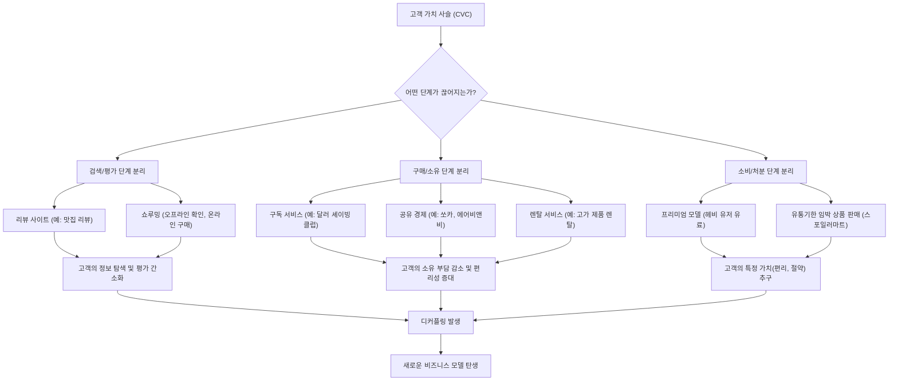

## 디커플링: 파괴적 혁신을 넘어선 새로운 비즈니스 전략
이 책은 하버드 경영대학원 탈레스 S. 테이셰이라 교수님이 쓴 책이야. 급변하는 시장 환경 속에서 기업들이 어떻게 살아남고 성장할 수 있는지, 특히 '디커플링'이라는 새로운 현상을 통해 비즈니스 모델 혁신을 이야기하고 있어. 과거의 성공 공식이 더 이상 통하지 않는 시대에, 고객 가치 사슬을 해체하고 재구성하는 전략이 얼마나 중요한지 알려주는 책이라고 보면 돼.

## 1. 디커플링이란 무엇일까? 

1. 고객 가치 사슬**(**CVC**) 이해하기**:
  - 우리가 어떤 물건을 사거나 서비스를 이용할 때, 여러 단계를 거치게 되잖아. 예를 들어, 맛집을 찾아 회식하는 과정을 생각해봐.
  - **검색하기**: 네이버에서 '홍대 맛집'을 검색하는 거야. 
  - **결정하기**: 검색 결과와 리뷰, 별점을 보고 어떤 식당으로 갈지 정하는 거지. 
  - **확인하기**: 전화해서 자리가 있는지 확인하기도 해. 
  - **이동하기**: 식당까지 걸어가는 단계야. 
  - **선택 및 주문하기**: 식당에 앉아 메뉴판을 보고 뭘 먹을지 고르고 주문하는 거야. 
  - **소비하기**: 음식을 맛있게 먹는 단계지. 
  - **결제하기**: 식사비를 계산하는 거야. 
  - 이렇게 하나의 서비스를 이용하는 처음부터 끝까지의 모든 단계를 사슬처럼 묶어 놓은 것을 '고객 가치 사슬(Customer Value Chain, CVC)'이라고 불러. 
2. **디커플링의 개념**:
  - 디커플링은 이 고객 가치 사슬의 중간 단계를 의도적으로 '끊어내는' 것을 말해. 
  - 마치 긴 기차의 칸들을 중간에 뚝뚝 잘라내서 새로운 기차를 만드는 것과 같다고 보면 돼. 
  - 이렇게 끊어내는 이유는 뭘까? 기존의 거대 기업들은 이미 모든 단계를 꽉 잡고 있어서 신규 업체가 경쟁하기 어렵거든. 
  - 그래서 신규 업체들은 기존 기업의 가장 약한 고리, 즉 고객들이 불편해하거나 더 나은 가치를 얻을 수 있는 특정 단계를 찾아내서 그 부분만 집중적으로 공략하는 거야. 
  - 예를 들어, 기업 교육 시장에서 강사를 섭외하는 과정을 생각해봐.
  - 기존에는 기업이 휴넷 같은 대형 교육 업체에 전화해서 강사 섭외부터 교육 진행까지 모든 걸 맡겼어. 이 과정이 1단계부터 10단계까지 있다고 치자. 
  - 그런데 새로운 업체가 '강사 서칭'이라는 3단계나 4단계, 5단계 같은 특정 부분만 전문적으로 제공하는 앱을 만드는 거야. 
  - 고객 입장에서는 기존 방식보다 훨씬 저렴하고(400만 원짜리 교육을 200~250만 원에 이용) 간편하게(다이렉트 소통) 원하는 강사를 찾을 수 있게 되는 거지. 
  - 이렇게 되면 고객들은 기존의 방식을 버리고 새로운 방식을 선택하게 돼. 
  - 문제는 휴넷 같은 대기업은 이미 각 단계별로 담당 부서와 직원들이 있어서 이런 변화에 빠르게 대응하기 어렵다는 거야. 
  - 결국, 처음에는 작은 부분이었던 이 디커플링이 점차 커지면서 기존 대기업을 무너뜨리고 새로운 기업이 성장하는 결과를 낳게 돼. 

## 2. 디커플링을 이끄는 세 가지 물결 

1. 언번들링**(Unbundling) - 묶음 해제**:
  - 예전에는 음악 CD를 사면 좋아하는 노래 한두 곡 때문에 다른 열 곡도 함께 사야 했잖아. 
  - 하지만 지금은 원하는 노래 한 곡만 따로 사서 들을 수 있지? 이렇게 묶여 있던 상품이나 서비스를 쪼개서 파는 현상을 언번들링이라고 해. 
  - 마치 예전에는 과자 종합 선물 세트를 사야만 여러 종류의 과자를 맛볼 수 있었는데, 지금은 원하는 과자만 낱개로 살 수 있는 것과 같아.
2. 탈중개화**(Disintermediation) - 중간 단계 제거**:
  - 과거에는 기업 교육 시장처럼 컨설팅 에이전시가 중간에서 강사와 기업을 연결해주고 수수료를 받았어. 
  - 하지만 이제는 위버라인 같은 플랫폼처럼 기업이 강사에게 직접 연락하고 계약하는 '다이렉트 거래'가 늘어나고 있어. 
  - 이런 현상은 다양한 산업 분야에서 중간 유통 단계를 없애고 생산자와 소비자가 직접 연결되는 방식으로 나타나고 있어. 
  - 마치 부동산 중개인을 거치지 않고 집주인과 세입자가 직거래하는 것과 비슷하다고 보면 돼.
3. 디커플링**(**Decoupling**) - **가치 사슬** 분리**:
  - 이 책의 핵심 개념으로, 고객 가치 사슬의 특정 단계를 분리하여 새로운 가치를 제공하는 거야. 
  - 앞서 설명한 맛집 찾기나 강사 섭외 사례처럼, 고객 경험의 특정 부분을 떼어내어 혁신적인 서비스를 제공하는 거지.
  - 마치 자동차를 사지 않고 필요할 때만 쏘카 같은 공유 서비스를 이용하는 것처럼, 소유의 부담을 덜고 '이용'이라는 핵심 가치만 제공하는 거야.

## 3. 파괴적 기업의 공통점: 고객 행동 변화에 집중 

1. 디스럽션**(Disruption) 현상**:
  - 탈레스 테이셰이라 교수는 이런 현상을 '디스럽션(Disruption)'이라고 불러. 
  - 이건 한 업계에서 갑자기 시장 점유율이 크게 변하는 것을 말해. 
  - 기존의 잘나가던 기업들은 신규 진입 업체가 별다른 실력이나 새로운 기술 없이 기존 것을 모방해서 들어온다고 코웃음 치는 경우가 많아. 
  - 하지만 고객들이 새로운 방식에 익숙해지면서 구매 패턴이 바뀌고, 결국 별거 아니었던 신규 업체가 거대 기업으로 성장하며 기존 시장을 파괴하는 결과를 낳게 돼. 
  - 마치 작은 개미들이 모여 거대한 댐을 무너뜨리는 것과 같다고 보면 돼.
2. **기술 혁신이 아닌 **비즈니스 모델** 혁신**:
  - 아마존, 넷플릭스, 우버, 배달의 민족 같은 혁신적인 기업들을 보면, 이들이 완전히 새로운 기술을 발명한 것은 아니야. 
  - 오히려 기존에 있던 기술이나 자원을 활용해서 '비즈니스 모델'을 혁신한 거지. 
  - 예를 들어, 넷플릭스는 고화질 영상 인프라에 투자하지 않고, 기존의 콘텐츠를 고객이 원하는 방식으로(광고 없이, 원하는 시간에) 볼 수 있도록 제공했어. 
  - 페이스북도 직접 콘텐츠를 만들지 않고, 사용자들이 만든 콘텐츠를 공유하는 플랫폼을 제공해서 성공했지. 
  - 이처럼 파괴적 기업들은 제품이나 서비스 자체의 혁신보다는, 고객의 행동 패턴 변화에 주목하고 그에 맞춰 비즈니스 모델을 바꾼 거야. 
  - 마치 스마트폰 카메라가 화소 경쟁에만 몰두하던 디지털 카메라 시장을 잠식한 것처럼, 기술 자체보다 '사진을 찍고 공유하는' 고객의 욕구를 충족시킨 것이 핵심이야. 
3. **고객 중심의 사고방식**:
  - 이 책의 핵심 메시지는 기업 분석이나 경쟁자 분석에만 집중하지 말고, '소비자'에게 집중해야 한다는 거야. 
  - 고객이 제품이나 서비스를 구매하고 사용하는 전 과정(정보 수집, 평가, 구매, 사용, 폐기)을 깊이 이해하고, 그중 핵심 가치를 찾아내 특정 부분만 특화시키는 것이 혁신적인 비즈니스 모델을 만드는 길이라고 저자는 강조해. 
  - 마치 요리사가 자기만의 레시피만 고집하는 게 아니라, 손님들이 어떤 맛을 원하는지, 어떤 재료를 좋아하는지 먼저 파악하는 것과 같아.

## 4. 디커플링의 실제 사례들 

1. **질레트와 **달러 셰이빙 클럽:
  - 면도기 시장의 대명사 질레트는 한때 독보적인 위치에 있었어. 
  - 하지만 달러 셰이빙 클럽이라는 신규 경쟁자가 등장하면서 위기를 겪게 돼. 
  - 달러 셰이빙 클럽은 질레트처럼 매장에 가서 면도날을 고르고 사는 번거로운 과정을 없앴어. 
  - 대신 '구독 서비스'를 도입해서, 신청만 하면 매달 새 면도날을 집으로 배송해주는 거야. 
  - 이 서비스는 고객에게 '편리함'과 '가성비'라는 새로운 가치를 제공했고, 질레트가 놓쳤던 고객의 욕구를 정확히 파고든 거지. 
  - 마치 매번 마트에 가서 우유를 사는 대신, 정기 배송 서비스를 신청해서 집에서 편하게 받아보는 것과 같아.
2. **호텔과 **에어비앤비:
  - 에어비앤비는 호텔 산업의 전통적인 가치 사슬을 디커플링한 대표적인 사례야. 
  - 에어비앤비는 직접 호텔 건물을 소유하거나 운영하지 않아. 
  - 대신 '숙박 공간을 빌려주고 싶은 사람'과 '숙박 공간을 찾는 사람'을 연결해주는 중개 역할만 하는 거지. 
  - 고객들은 더 저렴하고 독특한 숙소를 찾을 수 있게 되었고, 에어비앤비는 막대한 투자 없이도 호텔 시장을 뒤흔드는 거대 기업이 되었어. 
  - 이것은 '숙박'이라는 본질적인 욕구는 같지만, 그 욕구를 충족시키는 방식을 완전히 바꾼 사례라고 볼 수 있어. 
3. **유통업체와 **쿠팡:
  - 우리나라의 신세계나 롯데 같은 대형 유통업체들은 한때 쿠팡을 우습게 봤을 거야. 
  - 하지만 쿠팡은 '로켓 배송'과 '새벽 택배'라는 배송 혁신을 통해 고객 가치 사슬의 '이동하기'와 '구매하기' 단계를 디커플링했어. 
  - 고객들은 직접 마트에 가지 않고도 빠르고 편리하게 물건을 받아볼 수 있게 되었고, 이는 쿠팡이 유통 시장의 1위로 올라서는 결정적인 요인이 되었지. 
  - 마치 예전에는 직접 우체국에 가서 편지를 부쳤지만, 지금은 스마트폰으로 메시지를 보내는 것처럼, 전달 방식의 혁신이 큰 변화를 가져온 거야.
4. **베스트바이와 **쇼루밍 현상:
  - 미국의 최대 가전 전문업체 베스트바이는 '쇼루밍' 현상 때문에 큰 위기를 겪었어. 
  - 쇼루밍은 고객들이 오프라인 매장에서 제품을 직접 보고 체험한 다음, 실제 구매는 더 저렴한 온라인 쇼핑몰에서 하는 행동을 말해. 
  - 월마트, 토이저러스 같은 전통적인 유통 강자들이 이 쇼루밍 때문에 몰락하기 시작했지. 
  - 고객들은 오프라인 매장에서 '평가하기'와 '선택하기'를 하고, 온라인에서 '구매하기'를 하는 식으로 가치 사슬을 분리한 거야. 
  - 베스트바이는 이런 현상을 막기 위해 가격 비교를 어렵게 하거나 자체 쇼핑몰을 만들었지만 실패했어. 
  - 결국 베스트바이는 삼성 같은 기업들에게 매장 공간을 '전시관'으로 빌려주고 수수료를 받는 새로운 비즈니스 모델을 찾아냈어. 
  - 이는 기술 투자 없이도 수익을 올릴 수 있는 디커플링 전략의 좋은 예시가 되었지. 
  - 마치 서점에서 책을 읽고 온라인으로 구매하는 사람들이 늘어나자, 서점이 북카페나 문화 공간으로 변신하는 것과 비슷하다고 보면 돼.

## 5. 디커플링의 다양한 형태와 고객의 가치 추구 

1. **고객 가치 사슬의 분리**:
  - 디커플링은 고객 가치 사슬(CVC)의 특정 연결 고리를 끊고 새로운 방식을 제시하는 거야. 
  - 고객이 제품이나 서비스를 선택하고, 구매하고, 소비하는 전 과정에서 어떤 부분을 떼어낼지 고민하는 거지.
  - **검색/평가 단계 분리**:
  - 맛집을 찾을 때 직접 여러 식당을 방문해서 맛을 평가하는 대신, 리뷰 사이트나 앱(예: 배달의 민족)을 통해 다른 사람들의 평가를 보고 결정하는 거야. 
  - 쇼루밍처럼 오프라인 매장에서 제품을 눈으로 확인하고 평가한 다음, 실제 구매는 온라인 최저가로 하는 것도 여기에 해당해. 
  - **구매/소유 단계 분리**:
  - 자동차를 직접 구매하고 소유하는 대신, 쏘카처럼 필요할 때만 빌려 쓰는 공유 서비스가 대표적이야. 
  - 고가의 자전거, 운동 제품, 심지어 애완견까지도 빌려 쓰는 렌탈 서비스가 나타나고 있어. 
  - 달러 셰이빙 클럽처럼 면도날을 정기적으로 구독해서 받는 것도 '구매'의 번거로움을 없앤 사례지. 
  - **소비/처분 단계 분리**:
  - 드롭박스 같은 클라우드 서비스는 기본 용량은 무료로 제공하고, 더 많은 저장 공간을 원하는 '헤비 유저'에게만 비용을 받는 '프리미엄 모델'을 사용해. 
  - 유통기한이 임박한 음식 정보를 알려주고 저렴하게 구매할 수 있게 하는 '스포일러마트' 같은 서비스도 있어. 
2. **디커플링이 발생하는 이유: 고객의 가치 추구**:
  - 이 모든 디커플링 현상은 결국 '고객이 무엇을 원하는가'에 달려 있어. 
  - 고객들은 더 저렴한 가격, 더 편리한 서비스, 직접 소유하지 않고도 이용할 수 있는 유연성 등을 원하고 있어. 
  - 예를 들어, 해외 송금 시 발생하는 비싼 수수료를 줄이고 싶은 고객의 욕구를 파고든 '트랜스퍼와이즈' 같은 회사도 있어. 
  - 이 회사는 실제로 돈을 송금하는 행위 없이, 양쪽 국가에 있는 회사를 통해 해당 금액을 대신 지급하는 방식으로 수수료를 없앴지. 
  - 마치 예전에는 비싼 전화 요금을 내고 국제 전화를 걸었지만, 지금은 무료 메신저 앱으로 통화하는 것처럼, 고객의 '가치'를 최우선으로 생각하는 것이 중요해.
3. **개인의 삶에도 적용되는 **디커플링:
  - 이 책의 개념은 대기업뿐만 아니라 개인의 삶이나 1인 기업가에게도 중요한 메시지를 줘. 
  - 우리가 어떤 목표를 이루기 위해 거쳐야 한다고 생각하는 '당연한 과정'들을 다시 생각해보고, 그중 불필요하거나 비효율적인 부분을 끊어낼 수 있는지 고민해봐야 해. 
  - 예를 들어, 행복해지기 위해 돈, 실력, 배경 같은 여러 조건이 필요하다고 생각하면, 이 중 하나라도 부족하면 불행하다고 느끼기 쉽잖아. 
  - 이런 '행복의 조건'들을 디커플링하고, 나 자신을 소중하게 여기는 '강한 커플링'을 만드는 것이 중요하다고 저자는 말해. 
  - 마치 매일 아침 운동하면서 정해진 장소에서 기도하는 것처럼, 나에게 가장 중요한 가치(예: 영적인 콘텐츠)에 집중해서 다른 불필요한 것들을 밀어내는 거야. 
  - 결국, 디커플링은 단순히 비즈니스 전략을 넘어, 우리 삶의 다양한 영역에서 새로운 기회를 찾고 변화를 만들어내는 통찰력을 제공하는 책이라고 할 수 있어. 

