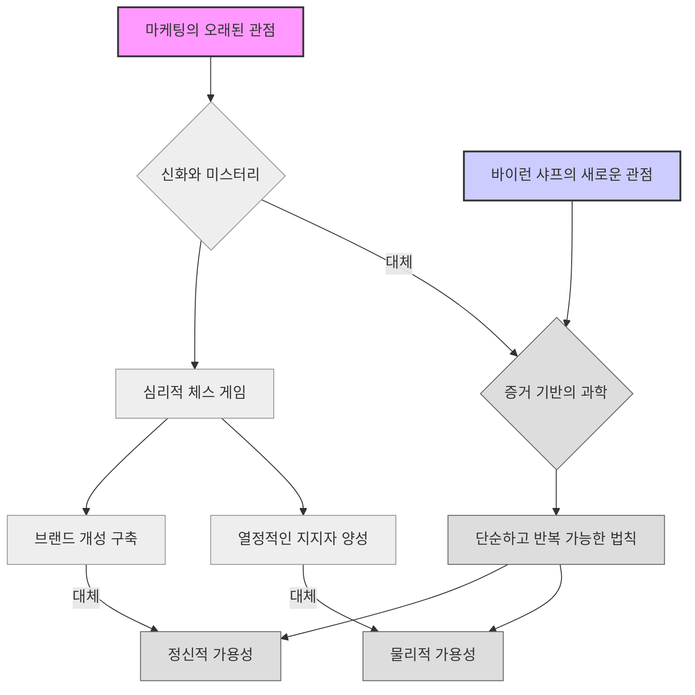
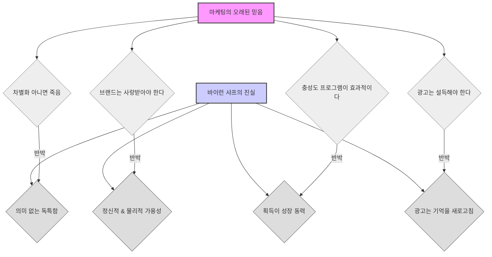

## 브랜드는 어떻게 성장하는가: 마케터가 모르는 것들
이 책은 마케팅에 대한 오래된 통념들을 깨고, 브랜드가 실제로 어떻게 성장하는지에 대한 과학적인 법칙들을 알려준다. 브랜드 충성도, 차별화, 타겟팅 같은 개념들이 사실은 성장의 핵심이 아니며, 진짜 중요한 것은 소비자들이 브랜드를 얼마나 쉽게 떠올리고 쉽게 구매할 수 있는지에 달려있다는 것을 증명한다. 

## 1. 콜게이트와 크레스트 이야기: 마케팅의 흔한 오해 

1. **마케팅 관리자의 고민**:
  1. 콜게이트 마케팅 책임자인 당신의 사무실에 마가렛이라는 매니저가 다급하게 들어온다. 
  2. 그녀는 시장 조사 보고서를 들고 있는데, 경쟁사인 크레스트가 콜게이트보다 시장 점유율이 두 배나 높다는 내용이다. 
  3. 더 큰 문제는 크레스트 매출의 40%가 '열성적인 충성 고객'에게서 나오는데, 콜게이트는 겨우 21%만 충성 고객에게서 나온다는 점이다. 
  4. 콜게이트 매출의 68%는 '이탈 고객' (다른 브랜드도 사는 사람들)에게서 나오기 때문에, 마가렛은 "우리 고객 기반이 건강하지 않다. 충성도가 낮은 고객에게 의존하고 있다. 브랜드가 망할 것 같다"며 패닉에 빠진다. 
  5. 조사 기관은 "더 설득력 있는 광고를 만들고, 충성 고객을 타겟으로 콜게이트가 좋은 브랜드라고 설득하는 캠페인을 시작하라"고 조언한다. 
2. **바이런 샤프의 반전**:
  1. 이런 상황에서 당신이라면 어떻게 할까? 마케팅 전략을 완전히 바꿀까? 
  2. 하지만 정답은 '아무것도 하지 않는 것'이다. 마가렛에게 "모든 것이 완벽하게 괜찮다"고 말해주는 것이다. 
  3. 이 충격적인 수치들은 약점이 아니라, 콜게이트 규모의 브랜드에게는 <mark>완전히 정상적이고 예측 가능하며 심지어 건강한 신호</mark>이기 때문이다. 
  4. 이것은 가상의 문제가 아니라, 현대 마케팅의 핵심에 있는 <mark>근본적인 오해</mark>를 드러내는 실제 시나리오이다. 
  5. 이 오해 때문에 기업들은 수십억 달러를 낭비하고, 수많은 시간을 허비했으며, 여러 세대의 마케터들이 잘못된 길을 걸어왔다. 
  6. 바이런 샤프 교수는 마케팅을 과학으로 바꾸기 위해 평생을 바친 사람으로, 이러한 혼란에 정면으로 도전했다. 
  7. 그의 책 "브랜드는 어떻게 성장하는가: 마케터가 모르는 것들"은 단순한 마케팅 가이드가 아니라, <mark>반란</mark>과 같다. 
  8. 수십 년 동안 우리가 배워온 차별화, 타겟팅, 세분화, 브랜드 충성도 같은 개념들을 냉정하고 확실한 증거의 빛 아래에서 검증한다. 
  9. 그 결과는 놀랍다. 이 책을 통해 사람들은 실제로 물건을 어떻게 구매하는지에 대한 <mark>간단한 과학적 법칙</mark>을 이해하게 될 것이다. 
  10. 충성 고객을 쫓는 것이 왜 헛수고인지, 다르게 보이려고 노력하는 것이 왜 함정인지, 그리고 성장의 진짜 비결이 우리가 생각했던 것보다 훨씬 간단하고 강력하다는 것을 알게 될 것이다. 
  11. 이것은 단순히 마케팅에 대한 이야기가 아니라, 인간 행동과 우리 세상을 형성하는 예측 가능한 패턴을 이해하는 것에 대한 이야기이다. 

## 2. 이중 위험의 법칙: 큰 브랜드는 더 많은 고객과 더 높은 충성도를 가진다 

1. **이중 위험의 법칙 (**Double Jeopardy Law**)**:
  1. 콜게이트 매니저에게 "괜찮다"고 말하는 것이 정답인 이유는, 그녀가 본 데이터가 <mark>중력의 법칙만큼이나 신뢰할 수 있는 마케팅의 과학적 법칙</mark>인 '이중 위험의 법칙'을 보여주고 있었기 때문이다. 
  2. 이 법칙은 마치 두 개의 커피숍이 같은 거리에 있는 상황과 같다. 
  1. 하나는 '글로벌 커피'처럼 크고, 다른 하나는 '로컬 빈스'처럼 작은 독립 상점이다. 
  2. 글로벌 커피는 훨씬 더 많은 고객을 가지고 있다. 이것이 첫 번째 이점이다. 
  3. 하지만 이 법칙의 두 번째 부분은 '이중 위험'이다. 글로벌 커피의 고객들은 평균적으로 로컬 빈스 고객들보다 <mark>조금 더 자주 방문한다</mark>. 
  4. 작은 상점은 두 번 타격을 입는 셈이다. 처음부터 고객이 적고, 그 적은 고객들조차도 충성도가 약간 낮다. 
  3. 이것은 글로벌 커피가 충성도를 만드는 어떤 특별한 비법을 가지고 있기 때문이 아니다. 
  4. 이것은 <mark>예측 가능한 패턴</mark>이다. 시장 점유율이 큰 브랜드는 항상 더 많은 구매자를 가지며, 그 구매자들은 항상 약간 더 충성도가 높다. 
  5. <mark>충성도가 규모를 만드는 것이 아니라, 규모가 충성도를 이끄는 것</mark>이다. 
  6. 따라서 콜게이트 매니저가 더 큰 브랜드인 크레스트가 더 높은 비율의 충성 고객을 가지고 있는 것을 보았을 때, 그녀는 문제를 본 것이 아니라 <mark>자연의 법칙</mark>을 본 것이다. 
  7. 콜게이트의 지표는 그 규모의 브랜드에서 예상할 수 있는 것과 정확히 일치했다. 문제는 시장이 어떻게 작동하는지에 대한 오해였을 뿐이다. 

## 3. 충성도 신화와 성장의 진짜 비결: 고객 획득 

1. **충성도에 대한 집착의 문제**:
  1. 바이런 샤프가 무너뜨리는 첫 번째 도미노는 마케팅이 수십 년 동안 <mark>충성도에 집착해왔다는 것</mark>이다. 
  2. 우리는 "새로운 고객을 확보하는 것보다 기존 고객을 유지하는 것이 더 저렴하다", "관계를 구축하고 브랜드 사랑을 만들어야 한다"고 배워왔다. 
  3. 하지만 샤프는 수십 년 동안 수십 개국에 걸쳐 수백 개의 카테고리 데이터를 분석한 결과, <mark>성장은 그렇게 일어나지 않는다</mark>고 말한다. 
  4. "새로운 고객을 확보하는 데 기존 고객을 유지하는 것보다 5배 더 많은 비용이 든다"는 유명한 문구를 생각해 보자. 
  5. 샤프는 이를 뒷받침할 <mark>어떤 경험적 증거도 없다</mark>고 밝힌다. 
  6. 이것은 "고객 이탈 수를 극적으로 줄이고, 그것을 무료로 할 수 있다"는 <mark>엄청난 잘못된 가정을 기반으로 한 사고 실험</mark>에서 나온 것이다. 
  7. 하지만 현실은 그렇지 않다. 모든 브랜드는, 모든 커피숍과 모든 관계처럼, 고객을 잃는다. 이것은 삶의 사실이다. 
2. **고객 이탈의 법칙**:
  1. 샤프가 밝혀낸 또 다른 법칙은 <mark>브랜드는 그 규모에 비례하여 고객을 잃는다</mark>는 것이다. 
  2. 큰 브랜드는 절대적인 수치로는 더 많은 고객을 잃지만, 고객 기반의 <mark>비율로 따지면 작은 브랜드보다 적게 잃는다</mark>. 
  3. 이것은 또 다른 형태의 이중 위험이다. 
  4. 영국 자동차 브랜드 데이터를 보면, 시장 선두주자인 포드는 이탈률이 31%였다. 
  5. 반면, 푸조와 같은 작은 브랜드는 이탈률이 57%였다. 
  6. 푸조의 고객 서비스가 엉망이었을까? 차가 고장 났을까? 아니다. 
  7. 그들의 이탈률이 더 높았던 이유는 <mark>단순히 규모가 작았기 때문</mark>이다. 이것은 예측 가능한 현상이다. 
3. **성장의 유일한 길: **고객 획득:
  1. 이탈이 게임의 예측 가능한 부분이기 때문에 고객 이탈을 극적으로 막을 수 없다면, <mark>성장의 유일한 길은 무엇일까?</mark> 바로 <mark>획득 (Acquisition)</mark>이다. 새로운 고객을 얻는 것이다. 
  2. 이것은 너무 단순하게 들릴 수 있지만, 샤프는 성장하는 브랜드를 연구했을 때, 성장이 거의 항상 <mark>더 많은 신규 구매자를 확보하는 것</mark>에서 비롯되며, 기존 구매자를 더 충성스럽게 만드는 것에서 오는 것이 아님을 보여준다. 
  3. 성장은 침투 게임<mark> (</mark>Penetration Game<mark>)</mark>이다. 
  4. 가끔이라도 더 많은 사람들이 당신의 브랜드를 구매하게 만드는 것이다. 

## 4. 80/20 법칙의 허상과 가벼운 구매자의 중요성 

1. **80/20 법칙의 허상**:
  1. 샤프가 다음으로 공격하는 마케팅의 신성한 소는 유명한 파레토 원칙<mark> (Pareto Principle)</mark>, 즉 80/20 법칙이다. 
  2. 우리는 모두 "매출의 80%가 고객의 20%에서 나온다"고 들어왔다. 
  3. 논리적인 결론은 그 상위 20%에 모든 에너지를 집중하라는 것이다. 그들은 당신의 헤비 바이어 (Heavy Buyers), 즉 슈퍼 팬들이다. 
  4. 하지만 샤프와 그의 팀이 실제 구매 데이터를 살펴보았을 때, 그들은 놀라운 것을 발견했다. <mark>80/20 법칙은 신화</mark>라는 것이다. 
  5. 대부분의 브랜드에서 이것은 <mark>50/20 또는 60/20 법칙에 더 가깝다</mark>. 
  6. 상위 20%의 고객이 매출의 약 절반을 차지하며, 이는 나머지 절반이 롱테일<mark> (Long Tail)</mark>, 즉 하위 80%의 고객, 즉 가벼운 구매자<mark> (</mark>Light Buyers<mark>)</mark>에게서 나온다는 것을 의미한다. 
2. **코카콜라 사례로 본 가벼운 구매자의 중요성**:
  1. 이것이 정말 놀라운 부분이다. 지구상에서 가장 크고 지배적인 브랜드 중 하나인 코카콜라를 예로 들어보자. 
  2. 코카콜라의 헤비 바이어는 누구라고 생각하는가? 매일 여러 번 마시는 사람일까? 
  3. 데이터에 따르면 영국에서 <mark>평균적인 코카콜라 구매자는 1년에 약 12번, 즉 한 달에 한 번 정도 구매한다</mark>. 
  4. 하지만 이 평균은 오해의 소지가 있다. 왜냐하면 소수의 사람들이 1년에 수백 번 구매하기 때문이다. 
  5. 이들을 상쇄하기 위해서는 훨씬 적게 구매하는 <mark>엄청난 수의 사람들</mark>이 필요하다. 
  6. 그렇다면 일반적인 코카콜라 구매자는 어떤 모습일까? 그들은 <mark>1년에 단 한두 번</mark> 코카콜라를 구매한다. 
  7. 이것을 잘 생각해 보자. 코카콜라 고객의 절반은 1년에 <mark>최대 두 번</mark> 제품을 구매한다. 
  8. 만약 당신이 1년에 세 번 이상 코카콜라를 구매한다면, 당신은 공식적으로 코카콜라의 <mark>헤비 바이어</mark> 중 한 명이다. 
  9. 이것은 코카콜라에만 해당되는 것이 아니다. 이것은 <mark>보편적인 패턴</mark>이다. 
  10. 거의 모든 카테고리의 거의 모든 브랜드에서 고객 기반은 <mark>압도적으로 가볍고, 가끔 구매하는 사람들</mark>로 구성되어 있다. 
  11. 이들은 팬이 아니다. 브랜드와 관계를 맺고 있지도 않다. 브랜드에 대해 거의 생각하지도 않는다. 
  12. 하지만 <mark>이들이 합쳐져서 사업의 기반</mark>을 이룬다. 
3. **구매자 완화의 법칙 (**Law of Buyer Moderation**)**:
  1. 이것은 헤비 바이어만을 타겟팅하는 치명적인 결함을 드러낸다. 
  2. 당신은 사업의 절반을 무시하는 것뿐만 아니라, 샤프는 또 다른 법칙인 <mark>구매자 완화의 법칙</mark>을 보여준다. 
  3. 올해 헤비 바이어였던 사람들은 평균적으로 내년에는 <mark>더 적게 구매할 것이다</mark>. 
  4. 그리고 올해 가벼운 구매자였던 사람들은 <mark>더 많이 구매할 것이다</mark>. 
  5. 심지어 올해 전혀 구매하지 않았던 사람들도 내년에는 구매할 것이다. 
  6. 사람들의 구매 습관은 변동한다. 이것은 평균으로의 회귀<mark> (</mark>Regression to the Mean<mark>)</mark>와 같다. 
  7. 따라서 올해의 헤비 바이어에게만 집중한다면, 당신은 <mark>줄어들 것이 확실한 그룹</mark>을 쫓는 셈이다. 
  8. 그 의미는 급진적이다. 브랜드를 유지하고 성장시키려면, <mark>존재 자체를 쉽게 잊을 수 있는 모든 가벼운 구매자들에게 끊임없이 다가가야 한다</mark>. 

## 5. 세분화와 타겟팅의 신화: 경쟁 브랜드는 같은 사람들에게 판매한다 

1. **세분화와 타겟팅의 신화**:
  1. 마케터에게 다음 논리적인 질문은 "내가 많은 구매자들에게 다가가야 한다면, 그들은 누구인가? 어떤 종류의 사람이 내 브랜드를 구매하는가?"이다. 
  2. 이것은 <mark>세분화와 타겟팅의 신화</mark>로 이어진다. 
  3. 고전적인 마케팅 교과서는 당신의 틈새시장 (Niche)을 찾고, 당신의 브랜드가 어필하는 특정 인구통계학적 또는 심리통계학적 그룹을 식별하라고 말한다. 
  4. 이론에 따르면, <mark>차별화된 브랜드는 다른 종류의 사람들에게 판매한다</mark>. 
2. **포드와 쉐보레의 사례**:
  1. 이를 테스트하기 위해 1959년에 연구원들은 포드 소유주와 쉐보레 소유주에게 <mark>성격 테스트</mark>를 실시했다. 
  2. 당시 이 브랜드들은 뚜렷한 이미지를 구축하기 위해 막대한 돈을 썼다. 포드는 실용적이고 보수적인 이미지였고, 쉐보레는 더 화려하고 현대적인 이미지였다. 
  3. 자동차 경영진부터 학자들까지 모두 그들의 구매자들이 다른 유형의 사람들일 것이라고 믿었다. 
  4. 결과는 마케팅 세계를 충격에 빠뜨렸다. 포드와 쉐보레 소유주의 <mark>성격 프로필은 본질적으로 동일했다</mark>. 
  5. 처음에는 사람들이 연구가 결함이 있다고 주장했지만, 그 후 수백 가지 변수(인구통계, 가치, 미디어 습관)를 사용하여 다른 제품, 다른 국가에서 <mark>반복적으로 연구가 수행되었다</mark>. 
  6. 결과는 항상 같았다. <mark>경쟁 브랜드는 같은 종류의 사람들에게 판매한다</mark>. 
  7. 당신의 고객 기반은 경쟁사의 고객 기반과 똑같다. <mark>유일한 실제 차이는 그 규모</mark>이다. 
3. **맥주 브랜드와 요키 초콜릿 바 사례**:
  1. 샤프는 이에 대한 몇 가지 훌륭한 예시를 공유한다. 캐나다 맥주 브랜드 데이터를 보면, 코어스, 버드와이저, 코로나 등 가격, 원산지, 이미지가 다른 브랜드들이 있다. 
  2. 하지만 그들의 고객 프로필은 거의 구별할 수 없다. 그들은 모두 남녀노소, 모든 소득 수준에 걸쳐 <mark>동일한 혼합의 사람들에게 판매한다</mark>. 
  3. 아마도 가장 재미있는 예시는 영국의 요키 (Yorkie) 초콜릿 바일 것이다. 
  4. 수년 동안 네슬레는 "여자들을 위한 것이 아니다 (It's not for girls)"라는 슬로건으로 건방지고 공격적인 마케팅 캠페인을 벌였다. 포장에는 여성이 X표시된 그림이 있었다. 
  5. 특정 세그먼트, 이 경우 남성을 타겟팅하려는 시도가 있었다면 이것이 바로 그것이었다. 
  6. 그렇다면 오늘날 요키 고객 기반은 어떤 모습일까? <mark>약 56%가 남성이고 44%가 여성</mark>이다. 
  7. 인구의 절반에게 구매하지 말라고 말하는 캠페인에도 불구하고, 여성들은 여전히 고객의 거의 절반을 차지한다. 
4. **틈새 브랜드의 허상**:
  1. 이것이 주는 교훈은 심오하다. 당신의 브랜드는 작고 특정 부족에게 어필함으로써 성장하는 것이 아니다. 
  2. <mark>카테고리를 구매하는 모든 사람들에게 광범위하게 어필함으로써 성장한다</mark>. 
  3. 틈새 브랜드 (Niche Brand)라는 아이디어는 대체로 신화이다. 
  4. 대부분의 틈새 브랜드는 <mark>단지 작은 브랜드일 뿐</mark>이다. 그들은 구매자가 적고 충성도가 약간 낮다. 
  5. 그들은 특별하지 않다. 그들은 단지 이중 위험의 법칙을 따르고 있을 뿐이다. 
  6. 이것은 당신의 경쟁사 고객이 당신의 고객이 될 수 있다는 것을 의미한다. 그들을 당신의 브랜드를 구매하지 못하게 막는 근본적인 차이는 없다. 
  7. 그리고 당신의 고객도 쉽게 그들의 고객이 될 수 있다는 것을 의미한다. 

## 6. 차별화의 신화: 의미 없는 독특함이 중요하다 

1. **"**차별화** 아니면 죽음"의 신화**:
  1. 이것은 모든 마케팅 과정, 모든 교과서, 모든 컨설턴트가 궁극적인 진실로 우리 머릿속에 주입한 가장 크고 근본적인 신화로 이어진다. 
  2. 바로 <mark>"</mark>차별화<mark> 아니면 죽음 (Differentiate or Die)"</mark>이다. 
  3. 아이디어는 간단하다. 당신은 <mark>고유한 판매 제안 (</mark>Unique Selling Proposition<mark>)</mark>, 즉 고객이 다른 모든 브랜드보다 당신을 선택할 이유를 제공하는 의미 있는 차이점을 찾아야 한다. 
  4. 그것이 없으면 당신은 그저 상품 (Commodity)일 뿐이고, 망할 것이다. 
  5. 샤프는 이것이 마케팅에서 <mark>가장 해로운 신화</mark>라고 주장한다. 
  6. 그는 간단한 질문을 던진다. "구매자들은 그들이 구매하는 브랜드를 의미 있게 다르다고 실제로 인식하는가?" 
  7. 그의 팀은 청량음료부터 은행, 자동차에 이르기까지 수십 개의 카테고리에서 대규모 연구를 수행했다. 
  8. 그들은 브랜드의 일반 구매자들에게 간단한 질문을 했다. "이 브랜드는 다른 브랜드와 다르거나 독특한가?" 
  9. 결과는 놀라웠다. 평균적으로 <mark>브랜드 자체 고객의 약 10%만이</mark> 그 브랜드가 독특하거나 다르다고 믿었다. 
  10. 이것을 생각해 보자. <mark>브랜드를 충성스럽게 구매하는 사람들의 90%는</mark> 그 브랜드를 경쟁사와 특별하거나 다르다고 보지 않는다. 
  11. 그들은 어쨌든 구매한다. 
  12. 샤프는 차별화의 대표적인 예시인 애플까지 살펴본다. 1990년대 후반 연구에서 애플의 디자인과 운영 체제가 PC와 확연히 달랐을 때, <mark>애플 사용자 중 27%만이</mark> 브랜드를 다르거나 독특하다고 인식했다. 
  13. 대부분의 사용자, 즉 그들의 열성 팬들은 그것을 그저 컴퓨터 작업을 하는 또 다른 컴퓨터로 보았다. 
2. **의미 없는 **독특함** (Meaningless **Distinctiveness**)**:
  1. 그렇다면 사람들이 브랜드가 다르기 때문에 구매하지 않는다면, 왜 구매하는 것일까? 
  2. 이것이 샤프가 책 전체에서 가장 중요한 아이디어를 소개하는 부분이다. 
  3. 마케터들은 <mark>의미 있는 차별화 (Meaningful Differentiation)를 추구하는 것을 멈추고</mark>, 대신 <mark>의미 없는 독특함 (Meaningless Distinctiveness)을 추구해야 한다</mark>. 
  4. 차이점은 무엇일까? 
  1. <mark>차별화</mark>는 당신이 <mark>무엇을 말하는지</mark>에 관한 것이다. 그것은 고유한 기능이나 이점을 가지는 것이다. "우리 치약은 이를 더 잘 희게 한다." 
  2. 반면에 <mark>독특함</mark>은 사람들이 <mark>무엇을 보고 인식하는지</mark>에 관한 것이다. 
  3. 그것은 <mark>고유한 </mark>감각적 단서<mark> (</mark>Sensory Cues<mark>)</mark>, 즉 색상, 로고, 글꼴, 슬로건, 캐릭터, 징글을 가지는 것으로, 당신의 브랜드를 즉시 식별 가능하게 만든다. 
  5. 맥도날드를 버거킹보다 선택할 이유가 필요하지 않다. 
  6. 멀리서 <mark>황금 아치</mark>를 보고 당신의 뇌가 즉시 맥도날드를 인식하기만 하면 된다. 
  7. 흰색 소용돌이가 있는 빨간색 캔이 코카콜라가 펩시보다 낫다고 설득하는 것이 아니다. 
  8. 그것은 당신이 콜라를 생각할 때 코카콜라가 떠오르도록 보장할 뿐이다. 
  9. 그것이 <mark>독특함</mark>이다. <mark>눈에 띄기 쉽고 기억하기 쉬운 것</mark>이다. 

## 7. 브랜드 성장의 대통합 이론: 정신적 가용성과 물리적 가용성 

1. **두 가지 핵심 개념**:
  1. 이것은 브랜드가 어떻게 성장하는지에 대한 <mark>대통합 이론</mark>으로 이어진다. 
  2. 오래된 규칙들이 모두 신화라면, 새로운 규칙은 무엇일까? 
  3. 샤프는 모든 것을 두 가지 간단하고 강력한 개념으로 요약한다. 바로 정신적 가용성<mark> (</mark>Mental Availability<mark>)</mark>과 물리적 가용성<mark> (</mark>Physical Availability<mark>)</mark>이다. 
  4. 이것이 전부다. 이것이 전체 게임이다. 
  5. 모든 마케팅의 목표는 이 두 가지 자산을 구축하는 것이다. 
2. 정신적 가용성** (Mental Availability)**:
  1. <mark>정신적 가용성</mark>은 <mark>쉽게 떠올릴 수 있는 것</mark>을 의미한다. 
  2. 구매 상황에서 구매자가 당신의 브랜드를 알아차리거나, 인식하거나, 떠올릴 확률이다. 
  3. 단순한 브랜드 인지도가 아니다. 그것은 사람의 마음에 <mark>풍부한 </mark>기억 네트워크를 구축하는 것이다. 
  4. 누군가 "상쾌함"을 생각하면 코카콜라를 떠올리고, "빠른 점심"을 생각하면 서브웨이를 떠올리고, "스우시"를 보면 나이키를 떠올리는 것과 같다. 
  5. 광고의 주된 역할은 설득하는 것이 아니라, 이러한 <mark>기억 구조를 구축하고 새로 고쳐서</mark> 브랜드를 두드러지게 만들고 쉽게 기억할 수 있도록 하는 것이다. 
3. **물리적 가용성 (Physical Availability)**:
  1. <mark>물리적 가용성</mark>은 <mark>쉽게 구매할 수 있는 것</mark>을 의미한다. 
  2. 그것은 <mark>유통</mark>에 관한 것이다. 가능한 한 많은 사람들이 가능한 한 많은 상황에서 당신의 브랜드를 가능한 한 쉽게 찾고 구매할 수 있도록 하는 것이다. 
  3. 코카콜라의 유명한 목표는 "욕망의 팔 길이 안에 있는 것"이었다. 
  4. 만약 어떤 사람이 당신의 브랜드를 떠올렸지만 쉽게 찾을 수 없다면, 그들은 그냥 다른 것을 구매할 것이다. 
  5. 그들은 굳이 찾아 나설 만큼 신경 쓰지 않는다. 
  6. 시장 점유율이 높은 브랜드는 항상 정신적 가용성과 물리적 가용성 <mark>모두에서 높다</mark>. 그들은 쉽게 떠올릴 수 있고 쉽게 찾을 수 있다. 
  7. 작은 브랜드는 둘 중 하나 또는 둘 다에서 약하다. 
4. **이론의 설명력**:
  1. 이 간단한 이론은 우리가 이야기한 모든 것을 설명한다. 
  2. 가격 프로모션과 충성도 프로그램이 장기적인 성장을 만들어내지 못하는 이유를 설명한다. 
  1. 그것들은 새로운 가벼운 구매자들에게 도달하는 데 형편없다. 
  2. 대부분은 기존 고객들이 이미 하려던 일을 한 것에 대해 보상할 뿐이다. 
  3. 그것들은 당신이 도달해야 할 사람들 사이에서 정신적 또는 물리적 가용성을 구축하지 못한다. 
  3. 광고가 합리적인 주장으로 사람들을 설득하는 것이 아니라, <mark>대규모 청중에게 도달하고 그들의 기억을 부드럽게 자극함으로써 작동하는 이유</mark>를 설명한다. 
  1. 그것은 브랜드를 항상 염두에 두게 한다. 
  2. 따라서 구매 상황이 발생했을 때, 당신의 브랜드가 고려되는 몇 안 되는 브랜드 중 하나가 된다. 
  3. 광고의 역할은 <mark>가르치는 것이 아니라 도달하는 것</mark>이다. 
  4. 브랜드가 침투<mark> (</mark>Penetration<mark>)를 통해 성장하는 이유</mark>를 설명한다. 
  1. 정신적 및 물리적 가용성을 구축함으로써, 당신은 당신의 브랜드를 더 많은 사람들에게 쉽고 명확한 선택으로 만든다. 
  2. 더 많은 가벼운 구매자를 얻게 된다. 
  3. 당신의 침투율이 올라간다. 
  4. 그리고 그 증가된 시장 점유율의 예측 가능한 결과로, 당신의 충성도 지표는 약간 상승할 것이다. 
5. **마케터의 새로운 역할**:
  1. 그렇다면 마케터의 역할은 마법 같은 차이점을 찾으려는 창의적인 천재가 아니다. 
  2. 슈퍼 팬 부족과 깊은 감정적 관계를 구축하는 심리학자도 아니다. 
  3. 바이런 샤프에 따르면, 마케터의 역할은 <mark>가용성의 체계적이고 증거 기반의 관리자</mark>가 되는 것이다. 
  4. 모든 사람에게 당신의 브랜드를 <mark>쉽게 떠올릴 수 있고 쉽게 구매할 수 있도록</mark> 만드는 것이다. 
  5. 이것은 더 간단한 일이지만, 여러 면에서 훨씬 더 어려운 일이다. 
  6. 그것은 <mark>규율, 일관성, 그리고 도달 (Reach)에 대한 끊임없는 집중</mark>을 요구한다. 
  7. 이것은 마법이 아니다. <mark>과학</mark>이다. 

## 8. 샤프의 통찰력 적용하기: 마케팅의 새로운 접근 방식 

1. **샤프의 작업이 주는 해방감**:
  1. 바이런 샤프의 작업에서 가장 강력하다고 생각하는 것은 <mark>해방적인 명확성</mark>이다. 
  2. 오랫동안 마케팅은 신화와 미스터리에 싸여 있었다. 
  3. 그것은 어두운 예술, 소비자를 속이고, 브랜드 개성을 구축하고, 열정적인 지지자 군대를 만드는 복잡한 심리적 체스 게임처럼 취급되었다. 
  4. 샤프는 과학자의 냉철한 정확성으로 이 모든 것을 쓸어버린다. 
  5. 그는 미신을 증거로, 복잡성을 <mark>간단하고 반복 가능한 법칙</mark>으로 대체한다. 
  6. 그는 우리의 역할이 마법사가 아니라 <mark>정원사</mark>라고 말한다. 
  1. 당신의 브랜드가 가능한 모든 곳에 심어져 있는지 확인해야 한다. 그것이 물리적 가용성이다. 
  2. 그리고 그것이 눈에 띄고 기억될 만큼 충분한 햇빛과 물을 받는지 확인해야 한다. 그것이 정신적 가용성이다. 
2. **사랑받는 것에서 생각나는 것으로의 전환**:
  1. 가장 심오한 교훈은 <mark>사랑받으려고 노력하는 것에서 단순히 생각나는 것으로 초점을 전환하는 것</mark>이다. 
  2. 코카콜라의 제국이 열성 팬이 아니라, 거의 생각하지 않고 1년에 한 번만 구매하는 수백만 명의 사람들에게 기반을 두고 있다는 생각은 모든 것을 바꾼다. 
  3. 그것은 겸손하게 만든다. 우리의 브랜드가 고객의 삶에서 <mark>작고 중요하지 않은 부분</mark>이라는 것을 상기시킨다. 
  4. 우리의 역할은 그들의 사랑과 헌신을 요구하는 것이 아니라, <mark>가장 중요한 순간에 그들의 찰나의 관심을 얻는 것</mark>이다. 
  5. 구매 상황에서 이 접근 방식은 더 정직하고 훨씬 더 효과적이다. 
  6. 그것은 화장지나 통조림 수프 브랜드에 대해 어떤 독특하고 세상을 바꾸는 브랜드 목적을 발명해야 한다는 압박에서 당신을 해방시킨다. 
  7. 대신, 그것은 <mark>실제로 작동하는 것</mark>, 즉 <mark>일관성, 도달, 그리고 </mark>독특함에 에너지를 집중시킨다. 
3. **샤프의 아이디어를 적용하는 방법**:
  1. 그렇다면 오늘 이 아이디어들을 어떻게 적용하기 시작할 수 있을까? 몇 가지 간단한 생각들이 있다. 
  2. **이상적인 고객에 대한 집착을 멈춰라**:
  1. 전체 카테고리를 누가 구매하는지에 대한 데이터를 보라. 그것이 당신의 청중이다. 
  2. 다음 질문은 "이 작은 부분에 어떻게 어필할까?"가 아니라, "어떻게 하면 <mark>이들 모두에게 비용 효율적으로 더 많이 도달할 수 있을까?</mark>"여야 한다. 
  3. **브랜드의 독특한 자산을 감사하라**:
  1. 당신의 <mark>필수적인 </mark>감각적 단서는 무엇인가? 색상, 로고, 슬로건, 포장 형태. 
  2. 그것들을 <mark>모든 곳에서 항상 일관되게 사용하고 있는가?</mark> 
  3. 만약 새로운 캠페인마다 포장이나 광고 스타일을 바꾼다면, 당신은 당신을 아주 가끔만 보는 대부분의 가벼운 구매자들에게 당신의 브랜드를 <mark>사실상 보이지 않게 만드는 것</mark>이다. 
  4. **핵심 마케팅 질문을 바꿔라**:
  1. "나의 고유한 판매 제안은 무엇인가?"라고 묻는 대신, "어떻게 하면 내 브랜드를 어제보다 <mark>한 가지 상황에서 더 쉽게 기억하고 더 쉽게 찾을 수 있을까?</mark>"라고 묻기 시작하라. 
  2. 설득에서 가용성으로의 이러한 간단한 초점 전환이 샤프의 전체 철학의 핵심이다. 
  3. 그것은 사람들과 논쟁하는 것에서 <mark>그냥 나타나는 것</mark>으로의 전환이다. 

## 9. 마케팅의 흔한 오해들 

1. **브랜드 성장의 원천**:
  1. 시장 점유율 증가는 <mark>인기 증가</mark>를 통해 이루어진다. 
  2. 이는 <mark>모든 유형의 구매자</mark>, 특히 브랜드를 아주 가끔 구매하는 <mark>가벼운 고객</mark>을 더 많이 확보함으로써 가능하다. 
  3. 브랜드가 성장하면 항상 같은 제품 카테고리 내 다른 브랜드의 고객을 빼앗아 온다. 
  4. 브랜드 경쟁과 성장은 주로 <mark>두 가지 시장 기반 자산</mark>을 구축하는 것에 달려있다. 
  1. 물리적 가용성<mark> (</mark>Physical availability<mark>)</mark>: 더 많은 사람들이 더 많은 상황에서 더 쉽게 구매할 수 있도록 하는 것. 
  2. 정신적 가용성<mark> (</mark>Mental availability<mark>)</mark>: 소비자의 마음속에 브랜드를 쉽게 떠올릴 수 있도록 하는 것. 
  5. 마케터는 브랜드의 <mark>독특한 자산</mark>(색상, 로고, 톤, 글꼴 등)을 연구하고, 이를 사용하고 보호해야 한다. 
2. **충성도와 브랜드 **이탈:
  1. 브랜드 규모가 크게 다른 경우, 침투율<mark> 지표는 크게 다르지만 평균 구매율은 거의 차이가 없다</mark>. 
  2. 다시 말해, <mark>충성도는 크게 변하지 않는다</mark>. 
  3. 고객 이탈의 원인을 조사한 연구들은 많은 이탈이 <mark>기업의 통제를 벗어난 이유</mark>로 발생한다는 것을 보여준다. 
  1. 예를 들어, 이사, 더 이상 서비스가 필요하지 않음, 본사의 지시 등이다. 
  4. 심각한 학술 연구들은 충성도<mark> 프로그램이 시장 점유율에 작은 변화를 주거나 전혀 변화를 주지 않는다</mark>고 보고한다. 
  5. 반면, 가격 프로모션은 매출을 증가시키지만, <mark>헤비 바이어에게 편중되는 경향이 있다. </mark>
3. **가벼운 구매자와 **헤비 구매자:
  1. 모든 브랜드는 <mark>많은 </mark>가벼운 구매자를 가지고 있다. 
  2. 이들은 브랜드를 가끔만 구매하지만, 그 수가 너무 많아서 <mark>전체 판매량에 상당한 기여</mark>를 한다. 
  3. 가벼운 구매자가 헤비 구매자가 되고, 헤비 구매자가 가벼운 구매자가 되는 현상은 평균으로의 회귀<mark> (</mark>Regression to the Mean<mark>)</mark> 현상이다. 
  4. 이는 브랜드 유지 또는 성장을 위해 마케팅이 <mark>시간이 지남에 따라 </mark>카테고리<mark> 내 모든 구매자에게 도달해야 한다</mark>는 것을 의미한다. 
4. **틈새시장 (Niche)에 대한 반론**:
  1. 콜게이트나 다른 브랜드의 판매 성장은 <mark>특정 세그먼트의 구매자만을 끈질기게 타겟팅하는 것</mark>에서 오지 않는다. 
  2. 하지만 이러한 타겟팅 환상은 마케팅 계획에 계속 나타난다. 
  3. 틈새시장이 반드시 좋은 것은 아니다. 
  4. 틈새 브랜드는 <mark>과도한 충성도를 가진 것이 아니라</mark>, 충성도 수준에 비해 <mark>침투율과 시장 점유율이 낮다</mark>고 보는 것이 더 적절하다. 
  5. 이러한 침투율 부족은 일반적으로 <mark>가용성 부족</mark> 때문이다. (예: 특정 유통 채널에 없음) 
  6. 마케팅이 브랜드의 시장 점유율을 성공적으로 증가시키면, <mark>구매 성향이 전반적으로 변화한다</mark>. 
  7. 이는 마케팅이 <mark>가능한 한 넓은 도달 범위</mark>를 가질 때 가장 성공할 가능성이 높다는 것을 알려준다. 
  8. 마케팅은 특히 <mark>브랜드의 가벼운 구매자와 비구매자에게 도달할 때 성공적</mark>이다. 
5. **브랜드 성장을 위한 두 가지 규칙**:
  1. 획득<mark> (</mark>Acquisition<mark>)</mark>은 성장과 유지에 필수적이다. 
  2. <mark>모든 구매자</mark>, 특히 브랜드의 <mark>가벼운, 가끔 구매하는 구매자</mark>에게 도달하는 것이 필수적이다. 
6. **구매 후 형성되는 의견**:
  1. 사람들은 자신이 구매하는 브랜드에 대해 의견을 가지는 경향이 있고, 사용하지 않는 브랜드에 대해서는 많이 생각하거나 알지 못한다. 
  2. <mark>행동은 인식, 인지, 태도의 강력한 동인</mark>이며, 이는 학술 및 시장 연구자들이 잊기 쉬운 사실이다. 
7. **마케터가 생각하는 것보다 넓은 경쟁**:
  1. 마케터들은 매우 유사한 브랜드들이 존재하는 이유를 찾으려 하고, 그것들이 <mark>다른 종류의 구매자들에게 어필해야 한다</mark>고 결론 내린다. 
  2. 하지만 실제로는 <mark>다른 구매자들에게 어필하지만, 다른 유형의 구매자들에게 어필하는 것은 아니다</mark>. 
  3. 즉, 그들은 자신을 아는 특정 구매자들에게 어필한다. 
  4. 바닐라 아이스크림 구매자와 딸기 아이스크림 구매자가 다른 유형의 사람이 있는 것이 아니다. 
  5. 그냥 <mark>아이스크림 구매자들이 가끔 바닐라를 사고 아주 가끔 딸기를 사는 것</mark>이다. 
  6. 마케터들은 종종 자신의 브랜드가 실제로 얼마나 광범위하게 경쟁하는지 <mark>과소평가하는 함정</mark>에 빠진다. 
  7. 세분화 연구는 <mark>아주 작은 차이를 과장</mark>하고, 다른 특징(예: 가격 수준)을 가진 브랜드가 매우 다른 사람들에게 또는 매우 다른 구매 상황에 판매된다고 가정한다. 
8. 구매 중복의 법칙** (Duplication of Purchase Law)**:
  1. 처음 두 가지 패턴은 <mark>구매 중복의 법칙</mark>을 반영한다. 
  2. 이 법칙은 카테고리 내의 <mark>모든 브랜드가 다른 브랜드와 고객 기반을 공유하며, 이는 다른 브랜드의 규모에 비례한다</mark>고 말한다. 
  3. 다시 말해, <mark>모든 브랜드는 큰 브랜드와 많이 공유하고 작은 브랜드와는 적게 공유한다</mark>. 
  4. 제품을 좁게 정의하지 않도록 노력해야 한다. 
  5. 눈에 보이는 것보다 더 많은 하위 시장이 존재한다. 
  1. 예를 들어, 초콜릿 시장은 수십 개의 하위 시장으로 나눌 수 있다. (블록, 바, 조각, 개별 포장, 캔디 코팅, 초콜릿 코팅 캔디 등) 
  6. 제품 기반의 카테고리 정의는 관리자들이 <mark>진정한 경쟁자를 보지 못하게 하고</mark>, 고객이 실제로 어떻게 구매하는지 이해하는 것을 방해할 수 있다. 
  7. 좁은 카테고리 정의는 브랜드 관리자들을 <mark>잘못된 안도감</mark>에 빠뜨리고, 지나치게 보수적인 성장 목표를 설정하게 할 수 있다. 
  8. 브랜드 관리자들은 자신의 브랜드가 상당한 시장 점유율을 가진 것처럼 보이게 하는 카테고리 정의를 선호한다. 아무도 17위로 평가받는 것을 좋아하지 않는다. 
  9. 따라서 좁은 카테고리 정의가 흔히 채택된다. 
  10. 시장에는 <mark>분할 (</mark>Partitions<mark>)</mark>이 존재한다. 프리미엄 품질-가격 분할이 특히 흔하다. 
  11. 하지만 이러한 구분을 완전히 분리된 시장이라기보다는 <mark>하위 시장, 즉 분할</mark>로 생각하는 것이 합리적이다. 
  12. 시장 분할의 원인은 무엇일까? 구매 중복 분석은 시장 분할이 일반적으로 브랜드 이미지보다는 <mark>브랜드 간의 상당한 기능적 차이와 유사성</mark> 때문이라는 것을 보여준다. 
  1. 예를 들어, 물리적으로 어디에서 또는 언제 구매 가능한지와 같은 요인들이다. 

## 10. 브랜드에 대한 진실과 효과적인 마케팅 전략 

1. 브랜드 충성도:
  1. 브랜드 충성도는 <mark>모든 시장</mark>에 존재하며, 심지어 소위 상품 (Commodity) 카테고리에서도 마찬가지다. 
  2. 충성도를 시장의 불완전성으로 생각하기보다는, <mark>위험을 균형 있게 조절하고 귀중한 시간을 낭비하지 않기 위해 인간이 개발한 많은 현명한 구매자 전략 중 하나</mark>로 보는 것이 더 적절하다. 
  3. 구매 빈도가 낮은 카테고리일수록 <mark>100% </mark>충성도<mark> 수준이 더 높다</mark>는 점에 주목해야 한다. 
  4. 충성도는 분명히 존재하지만, <mark>기회에 의해 조절된다</mark>. 
  5. 기존 마케팅 정설은 브랜드 관리자에게 자신의 브랜드가 누리는 충성도가 <mark>습관, 가용성 및/또는 구매자의 무관심</mark> 때문이라고 말하는 것을 모욕적으로 여긴다. 
  6. 충성도 부족이 마케팅 전략에 미치는 영향은 <mark>브랜드가 성장하기 위해 더 많은 가벼운 </mark>카테고리<mark> 구매자를 모집해야 한다</mark>는 것이다. 
  7. 카테고리의 헤비 바이어, 즉 슈퍼 소비자를 타겟팅하는 것은 "작은 브랜드가 되자"고 말하는 것과 같다. 
2. **브랜드에 대한 진실**:
  1. 브랜드는 <mark>필요악</mark>이다. 
  2. 구매 결정에 복잡성을 더하지만, <mark>일상적인 구매 습관</mark>을 가능하게 한다. 
  1. "아, 내 브랜드다" 또는 "아, 저거 들어봤어"와 같은 습관은 구매를 더 쉽고 자동적으로 만든다. 
  3. 핵심 발견은 우리가 브랜드에 대해 생각하는 대부분이 <mark>절대적이지 않다</mark>는 것이다. 
  4. 인생의 다른 시기에 브랜드에 대해 어떻게 생각하는지 물으면, 우리는 다른 대답을 할 것이다. 
  5. 사실, 우리가 브랜드에 대해 생각하는 대부분은 너무 <mark>사소하고, 거의 생각하지 않은 것</mark>이라서 우리는 순식간에 마음을 바꿀 것이다. 
3. **브랜드와 팬**:
  1. 어떤 브랜드든 소수의 팬을 가질 수 있지만, 이것이 일부 브랜드가 특별하다거나 이러한 팬들이 마케터에게 재정적 또는 전략적 중요성을 가진다는 것을 보여주지는 않는다. 
  2. 이것들은 재미있는 이야기를 만들 뿐이다. 
  3. 구매자 행동에 대해 거의 알지 못하는 광고 대행사들은 일반적으로 이러한 이야기를 좋아한다. 
  4. 할리데이비슨과 애플 같은 브랜드는 감정 기반 브랜드 충성도의 대표적인 예시이다. 
  5. 그들은 열정적이고 매우 충성스러운 고객 기반을 가지고 있다고 정기적으로 인용되지만, 그러한 주장을 뒷받침할 증거를 제공하는 작가는 거의 없다. 
  6. 진실은 우리는 우리의 태도를 우리의 행동에 맞추려고 노력한다는 것이다. 
  7. 개별 브랜드는 우리에게 그리 중요하지 않기 때문에, 브랜드 구매는 우리의 <mark>다소 약한 태도에 강한 영향</mark>을 미치는 경향이 있다. 
  8. 우리는 우리가 구매하는 것을 좋아한다. 
4. 차별화** 신화**:
  1. 이는 <mark>인지된 차별화가 브랜드 성공에 거의 영향을 미치지 않는다</mark>는 결론으로 이어진다. 
  2. "차별화 아니면 죽음"의 경우가 아니다. 만약 그렇다면, 우리가 구매하는 대부분의 브랜드는 사라졌을 것이다. 
  3. 역설적으로, <mark>의미 있는 차별화에 대한 강조가 줄어들면서 브랜딩은 더욱 중요해진다</mark>. 
  4. 충성도는 사랑/증오보다는 주로 <mark>정신적 및 </mark>물리적 가용성에 의해 뒷받침된다. 
  5. 브랜드 충성도를 장려하려면, 브랜드는 구매자가 <mark>쉽고 혼동 없이 식별할 수 있도록 눈에 띄어야 한다</mark>. 
  6. 대신 <mark>독특하고 일관성</mark>을 유지해야 한다. 
  7. <mark>독특한 자산 (Distinctive Asset)</mark>은 어떤 브랜드가 판매되고 있는지 사람들에게 보여주는 모든 것이다. 
  1. 이것들은 포장, 광고, 매장 내 디스플레이, 스폰서십에 사용될 수 있다. 
  2. 마케터가 소비자가 브랜드를 식별할 수 있기를 원하는 모든 마케팅 활동에 사용될 수 있다. 
  8. 강력한 독특한 자산을 구축하는 목적은 브랜드에 대한 <mark>식별 트리거 역할을 할 수 있는 자극의 수를 늘리는 것</mark>이다. 
  9. 나이키 스우시가 오늘날 가지는 강력한 인지도는 수십 년에 걸친 <mark>일관된 투자</mark> 때문이다. 
  10. 브랜드는 <mark>일관성이 없으면 독특할 수 없다</mark>. 
  11. 강력한 독특한 요소를 구축하려면, 브랜드는 <mark>모든 미디어와 시간에 걸쳐 소비자에게 일관되게 전달</mark>되어야 한다. 
  12. 일관성의 중요성은 많은 브랜딩 전문가들과 통합 마케팅 커뮤니케이션 지지자들에 의해 강조되어 왔다. 
5. **광고의 역할**:
  1. 광고는 주로 <mark>기억 구조를 새로 고치고</mark> 가끔 구축함으로써 작동하며, 합리적인 마음을 설득하거나 감정적인 마음을 얻는 것과는 거리가 멀다. 
  2. 광고는 우리가 이미 믿고 있는 것을 말할 때 가장 잘 작동한다. 
  3. 새롭고 명확하지 않은 기억 구조를 구축하는 것보다 <mark>기존 기억 구조를 새로 고치는 데 가장 강력하다</mark>. 
  4. 각 제품의 마케팅 믹스 차이는 각 제품 변형 간에 존재하는 차이로 제한된다. 
  5. 광고의 역할은 주로 <mark>다른 제품이 존재하고 사용 가능하다는 것을 대중에게 알리는 것</mark>이다. 
  6. 정교한 대량 마케터들은 이러한 이질성에 영리하게 반응한다. 
  1. 예를 들어, 여러 브랜드와 변형을 마케팅하고, 여러 미디어 및 유통 채널을 사용한다. 
  2. 그들은 브랜드를 틈새시장에 가두려고 하기보다는, 항상 <mark>넓은 도달 범위</mark>를 위한 길을 찾는다. 
  7. 광고 노출과 시청자가 관련 구매 기회가 있는 쇼핑 상황에 있을 때 브랜드 기억을 떠올리는 사이에는 <mark>몇 달이 걸릴 수 있다</mark>. 
  8. 행동에 영향을 미치려면 광고는 <mark>사람들의 기억과 함께 작동해야 한다</mark>. 
  9. 브랜드와 관련된 기억 구조에는 브랜드가 무엇을 하는지, 어떻게 생겼는지, 어디에서 구매 가능한지, 언제 어디서 누가 누구와 함께 소비하는지 등이 포함된다. 
  10. 기억은 브랜드를 떠올리게 할 수 있는 <mark>단서와의 연관성</mark>이다. 
  11. 논의된 바와 같이, 광고가 작동하는 두 가지 주요 방식이 있다. 
  1. <mark>설득 (Persuasion)</mark>: 의견을 바꾸는 것. 
  2. 정신적 가용성<mark> (</mark>Mental Availability<mark>)</mark>: 기억을 새로 고치고 구축하는 것. 
  12. 다른 메커니즘도 있지만, 이들은 더 미묘하며 종종 <mark>두드러짐 및/또는 설득에 부차적</mark>이다. 
  13. 이러한 다른 메커니즘에는 유대감, 지위 신호, 프라이밍 등이 포함된다. 
  14. 효과적인 광고를 위한 간단하지만 쉽지 않은 레시피는 다음과 같다. 
  1. <mark>모든 </mark>카테고리<mark> 구매자에게 도달하라</mark>. 
  2. <mark>광고를 중단하지 마라</mark>. 
  3. 소비자에게 걸러지지 않고 <mark>눈에 띄게 하라</mark>. 
  4. 브랜드의 독특한 자산을 간접적으로 사용하여 <mark>명확한 브랜드 연결</mark>을 사용하라. 
  5. 브랜드 이름을 언어적 및/또는 시각적으로 언급하는 <mark>브랜드 광고가 중요하다</mark>. 
  6. 제품을 보여주고 <mark>제품이 사용되는 모습을 보여주는 것</mark>이 중요하다. 
6. 가격 프로모션:
  1. 어떤 특정 시장에서든 소비자는 <mark>다양한 브랜드를 습관적으로 구매하고 다양한 가격을 지불</mark>한다. 
  2. 따라서 가격 프로모션으로 <mark>오직 저가 구매자 세그먼트만을 성공적으로 타겟팅하기는 어렵다</mark>. 왜냐하면 그러한 세그먼트는 일반적으로 존재하지 않기 때문이다. 
  3. 가격 프로모션은 단기적인 결과를 가져오지만, 다음 해의 판매 목표가 <mark>더 많은 가격 할인을 요구하게 만든다</mark>. 
  4. 가격 프로모션은 조직에게 <mark>생활 방식</mark>이 될 수 있다. 왜냐하면 이를 줄이면 판매 목표를 달성하지 못할 것이기 때문이다. 
  5. 따라서 이러한 프로모션은 마케터에게 <mark>매우 중독적</mark>이다. 
  6. 요약하자면, 가격 프로모션이 기존 브랜드에 하는 일은 주로 <mark>가끔 구매하는 구매자들의 단기적인 구매 성향을 흔들어</mark>, 브랜드를 저렴하게 구매할 기회를 잡게 한 다음 <mark>정상적인 구매 행동으로 돌아가게 하는 것</mark>이다. 
  7. 할인 발견 측면에서, 쇼핑객의 약 50%는 특정 브랜드의 할인된 가격을 보고 좋은 거래를 알아볼 수 있는 것으로 보인다. 
  8. 결론은 소비자의 가격 지식은 모호하지만, 상당한 비율의 소비자가 <mark>실제 가격의 특정 범위 내에서 가격에 대한 상당한 아이디어</mark>를 가지고 있다는 것이다. 
  9. 가격 프로모션의 단기적인 수익성은 다음 세 가지 요인에 따라 달라진다. 
  1. 정상 가격에서의 브랜드 공헌 이익. 
  2. 가격 인하 폭. 
  3. 브랜드의 가격 탄력성. 

