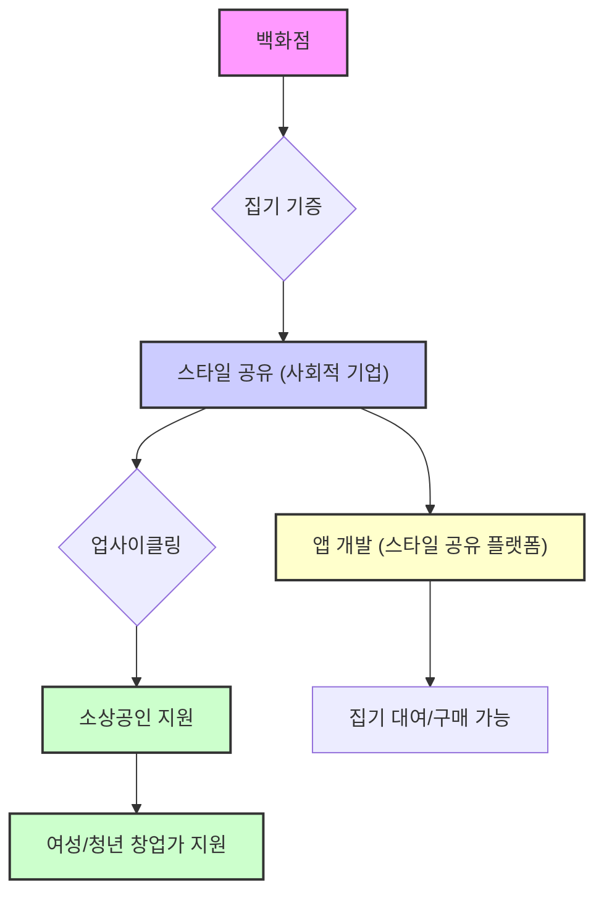
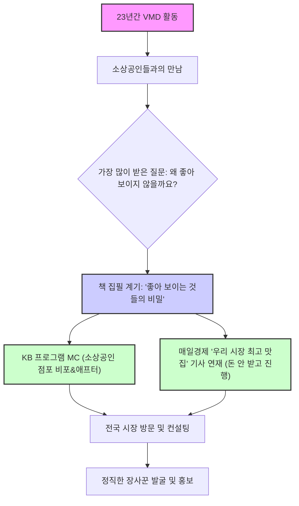

## 1. 좋아 보이는 것들의 비밀: 사람의 마음을 사로잡는 9가지 법칙 
이 책은 이랑주 VMD(비주얼 머천다이징) 박사가 23년간의 현장 경험을 바탕으로, 물건이나 공간이 '좋아 보이게' 만드는 과학적이고 치밀한 9가지 법칙을 알려주는 책이야. 단순히 겉모습만 꾸미는 게 아니라, 사람의 오감을 자극하고 본능적인 판단을 이끌어내서 결국 구매로 이어지게 하는 비결을 담고 있어. 

### 1.1. 왜 어떤 물건은 더 좋아 보일까? 

1. **겉모습만으로는 부족해**: 많은 사람이 물건을 잘 팔려면 포장을 잘하고, 진열을 멋지게 하고, 광고를 많이 하면 된다고 생각하지만, 노력에 비해 효과가 시원찮을 때가 많아. 
  - 반대로, 그저 좋은 제품만 만들면 사람들이 알아줄 거라고 생각하는 경우도 있어. 
  - 하지만 이런 방식들은 대부분 엄청난 노력이 필요하지만, 결과는 기대에 못 미치는 경우가 많아. 
2. **본능적인 끌림의 비밀**: 사람이 어떤 것을 '좋다'고 느끼는 건 디자인, 색상, 품질, 광고 같은 모호한 이유 때문이 아니야. 
  - 오감을 통해 느끼는 <u>본능적인 판단</u>이 중요해. 
  - 이 본능적인 판단 뒤에는 색상, 온도, 각도, 동선 등 작은 요소 하나하나가 만들어내는 치밀하고 과학적인 법칙들이 숨어 있어. 
  - 이 책은 바로 이런 법칙들을 통해 사람들이 물건을 보고 즉시 끌리고, 사고 싶게 만드는 비밀을 알려줄 거야. 

### 1.2. '좋아 보이는 것'의 진짜 핵심은 '가치' 

1. **겉모습이 아닌 내면의 가치**: '좋아 보인다'는 말은 단순히 눈으로 보기에 멋지다는 의미를 넘어, <u>가치적인 측면</u>을 포함하고 있어. 
  - 그래서 좋아 보이는 것의 핵심은 겉모습이 아니라, 그 안에 숨어 있는 <u>진정한 가치</u>를 파악하는 것이 중요해. 
2. **가치에 따른 비주얼 전략**: 브랜드의 핵심 가치에 따라 시각적인 전략(비주얼 전략)이 완전히 달라져야 해. 
  - 예를 들어, 같은 백화점이라도 '가장 좋은 물건'을 파는 곳은 고급스럽고 화려하게, '모든 물건'을 파는 곳은 단정하게 보일 수 있어. 
  - 이런 가치에 따라 로고, 주요 색상, 물건 진열 방식, 조명 색온도, 직원 유니폼 디자인 등이 모두 달라지는 거야. 
  - 이렇게 해야만 그 브랜드만의 <u>'누구누구 답다'</u>는 고유한 정체성을 만들어낼 수 있어. 
3. **성숙한 사회의 소비 트렌드**: 요즘처럼 경제가 성숙한 사회에서는 단순히 가격, 규모, 유명세로 물건을 선택하지 않아. 
  - 사람들은 <u>개별화되고 자기화된 제품</u>, 즉 자신의 라이프스타일과 가치관에 맞는 것을 찾아다녀. 
  - 예를 들어, 알라딘은 개인화된 정보를 빠르게 제공해서 고객의 취향에 맞는 책을 추천해주는 방식으로 가치를 제안했어. 
  - 이제는 강제로 "이런 거 사세요"라고 말하는 대신, "나는 이렇게 살아" 하고 자신의 소비 모습을 보여주는 것이 더 효과적이야. 
4. 세상을 이롭게** 하는 소비**: 소비가 단순히 필요를 채우는 것을 넘어, <u>세상을 이롭게 한다</u>는 명분을 제공하는 것이 중요해. 
  - 신발 하나를 사면 아프리카 아이들에게 신발을 기부하는 '착한 소비'처럼, 소비가 기부로 연결되는 가치를 제안하면 사람들은 더 큰 동력을 얻어 소비하게 돼. 
  - 결국, 단순히 예뻐 보이는 것에만 집중할 게 아니라, <u>어떤 가치를 가지고 세상에 어필할 것인지</u>를 전략적으로 정하는 것이 훨씬 중요해. 
5. 사람에 대한 배려: 모든 비주얼 전략은 결국 <u>사람에 대한 배려</u>에서 시작돼. 
  - 진정으로 좋은 물건이나 서비스는 고객을 배려하는 마음이 담겨 있을 때 "야, 그거 참 좋다"라는 감탄사를 이끌어내고, 오래 살아남을 수 있어. 
  - 내가 이 제품으로 사람들에게 어떤 가치를 전달하려는 건지, 어떤 영향을 미치려는 건지 고민하지 않으면 어떤 비주얼도 소용이 없어. 

### 1.3. 좋아 보이는 것들의 비밀을 엿보기 전 갖춰야 할 마인드 

1. **기존 방식을 노하우라고 착각하지 마라**: 오랫동안 해온 방식을 '노하우'라고 굳게 믿는 경우가 많아. 
  - 하지만 변화를 제안했을 때, 그것이 자신에게 도움이 되는지 생각하기보다 기존 방식을 고수하면 결국 도태될 수 있어. 
  - 변화는 매일 새로운 모습을 보여주는 것이 아니라, <u>자신만의 </u>고유한 가치를 보여주는 것이야. 
2. **남과 경쟁하지 마라**: 진정으로 탁월한 것에는 경쟁이 필요 없어. 
  - 핀란드의 한 시장 상인은 "옆집에서 얼마에 팔든 나는 상관없다. 나는 옆집과 경쟁하지 않는다. <u>스스로의 정직함과 경쟁한다</u>"고 말했어. 
  - 이런 곳은 100년, 200년이 지나도 살아남을 수밖에 없어. 
3. **언제나 사람의 마음을 먼저 생각하라**: 사람의 마음을 돈으로 생각하면 오히려 돈은 도망가게 돼. 
  - 내가 하는 일이 세상과 사람들에게 어떤 긍정적인 영향을 미치는지 고민하면, 과한 포장이나 연출 없이도 고객이 늘어날 수 있어. 
  - 결국 가장 중요한 건 <u>마음에 와닿는 진정성</u>이야. 
  - 사람들은 겉보기에 화려하거나 과도한 광고에 속지 않고, 자신도 몰랐던 자기 마음을 알아주는 것에 끌리게 되어 있어. 
  - 제품의 강점을 나열하기보다, 그 제품이 고객의 삶에 어떤 긍정적인 변화를 주고, 고객이 어떤 사람이 되고 싶은지에 기여하는지를 보여주는 것이 중요해. 

## 2. 좋아 보이는 것들의 9가지 비밀 

이 책은 총 9가지 비밀을 통해 물건과 공간을 '좋아 보이게' 만드는 구체적인 방법을 알려줘.

### 2.1. 시크릿 1: 좋아 보이는 것은 잊히지 않는다 – 기억 속을 파고드는 이미지의 비밀 

1. **기억은 감각이 하는 일**: 사람들은 노력으로 기억하는 것이 아니라, 감각<u> 속에 우연히 스며드는 경험</u>을 통해 기억해. 
  - 마케팅에서 가장 중요한 것은 사람들의 머릿속에 브랜드와 상품을 기억시키는 일이야. 
  - 자신이 하는 일(직업적 본질)을 다른 사람의 머릿속에 떠오르게 하는 것이 핵심이야. 
2. 주제 색상**(시그널 **컬러**)의 힘**: 특정 색상은 브랜드의 존재를 각인시키는 데 결정적인 역할을 해. 
  - 예를 들어, 배스킨라빈스 하면 핑크색이 떠오르는 것처럼 말이야. 
  - 색깔은 사람의 감정에 영향을 미치기 때문에, 어떤 이미지를 전달하고 싶은지에 따라 색깔 전략을 잘 세워야 해. 
3. 반복의 법칙** (**3의 법칙**)**: 사람들은 어떤 것을 <u>3번 이상 보여주면 기억</u>하게 돼. 
  - 배스킨라빈스는 간판, 냉장 집기, 스푼, 유니폼 등 다양한 곳에 핑크색을 반복적으로 노출시켜서 사람들의 뇌리에 각인시켜. 
  - 마치 길거리에서 세 명 이상이 하늘을 쳐다보면 다른 사람들도 궁금해서 함께 쳐다보는 것처럼, 3번 이상의 반복은 행동을 유발하는 강력한 힘이 있어. 
  - 자신의 브랜드 색상을 정하고, 그것을 3번 이상 반복해서 노출하는 것이 효과적이야. 
4. **패턴과 소재의 활용**: 포장지의 주름이나 소재의 색상까지도 이미지 전략의 일부가 될 수 있어. 
  - 소재는 구체적일수록 강렬한 인상을 줄 수 있으니 적극적으로 활용해야 해. 
5. **세대와 국가를 뛰어넘는 **심벌 마크: 아디다스, 폴로, 라코스테, 스타벅스처럼 브랜드의 가치를 한눈에 알 수 있는 강력한 심벌 마크를 만드는 것이 중요해. 
  - 이 심벌은 핵심 콘셉트와 연결되어 사람들의 눈과 마음을 사로잡는 첫 단계가 돼. 

### 2.2. 시크릿 2: 마법을 부리는 어울림 – 70:25:5의 법칙 

1. 색상** 비율의 조화**: 스타벅스의 초록색은 전체 색상에서 5%밖에 안 되지만, 우리는 스타벅스를 초록색으로 기억해. 
  - 이처럼 색상 배열에는 조화로운 비율이 존재하며, 이를 통해 매출을 10배 이상 올릴 수도 있어. 

### 2.3. 시크릿 3: 보는 것만으로 감정이 생긴다 – 색의 배열만으로 10배 매출을 올리는 노하우 

1. **색상과 감정의 연결**: 색깔은 사람의 감정을 직접적으로 자극하고, 이는 구매 행동으로 이어질 수 있어. 
  - 조화롭게 보이는 색깔은 어떤 비율을 가지고 있는지, 어떤 색 배열이 사람들의 감정을 움직이는지 이해하는 것이 중요해. 

### 2.4. 시크릿 4: 아름다워 보이는 빛의 색온도 – 3500K의 비밀 

1. **빛의 색온도와 아름다움**: 물건이 가장 예뻐 보이는 빛의 색온도는 3500K(켈빈) 정도야. 
  - 요즘 사람들은 공간을 방문하면 사진을 찍어 인스타그램이나 페이스북에 올리는데, 이때 사진이 잘 나오는 '인스타 러블'한 공간이 중요해. 
  - 사람들이 스스로 입소문을 낼 수 있도록, 사진 찍기 좋은 조명과 장치를 마련하는 것이 홍보에 큰 도움이 돼. 
2. **조명의 각도와 효과**: 조명을 어떻게 비추느냐에 따라 물건의 입체감이나 사람의 모습이 달라져. 
  - 조명을 사선으로 비추면 물건에 입체감이 생겨서 더 크게 보이게 돼. 
  - 백화점 탈의실 조명은 위에서 45도 각도로 사선으로 비춰서 얼굴의 그늘이나 잔주름을 없애줘서 사람이 훨씬 예뻐 보이게 해. 
  - 반대로 위에서 아래로 직접 비추는 조명은 얼굴을 깎아 먹은 것처럼 보이게 하고, 아래에서 위로 비추는 조명은 귀곡산장처럼 무섭게 보일 수 있어. 
  - 자신 있는 쪽으로 옆에서 살짝 비춰주는 조명이 가장 효과적이야. 

### 2.5. 시크릿 5: 지나가는 사람들을 끌어당기는 힘 – 충분히 어둡게, 충분히 밝게, 차이를 이용하라 

1. **대비(Contrast)의 활용**: 너무 어둡지도, 너무 밝지도 않게, 적절한 대비를 활용하면 지나가는 사람들의 시선을 사로잡을 수 있어. 
  - 유럽이나 뉴욕의 과일 가게는 과일 배치가 매우 정갈하고 싱싱해 보여서 저절로 구매 욕구를 자극해. 
  - 반면 우리나라 재래시장의 과일은 널브러져 보일 때가 많아, 같은 과일이라도 훨씬 덜 좋아 보이게 돼. 
  - 진열 방식이나 조명 같은 작은 팁 하나로도 큰 변화를 만들 수 있어. 

### 2.6. 시크릿 6: 45도 각도와 76cm – 피의 마법, 더 활기차게, 더 먹음직스럽게 보이게 하라 

1. 진열** 각도와 높이의 중요성**: 상품을 진열할 때 45도 각도와 76cm 높이가 사람들의 시선을 사로잡고 구매를 유도하는 데 효과적이야. 
  - 슈퍼마켓 매장에서 상품의 눈높이를 어디에 두느냐에 따라 매출에 엄청난 차이가 발생해. 
  - 예를 들어, 립스틱을 바르려는 여성 고객의 평균 키에 맞춰 거울 높이를 조절해야 해. 
  - 매장을 설계할 때는 자신의 기준이 아니라, <u>소비자의 평균 키와 행동 패턴</u>에 맞춰야 해. 

### 2.7. 시크릿 7: 심리를 걷게 만드는 동선의 비밀 – 계속 고객들을 안에서 머물게 하는 섬 진열 

1. **고객 동선의 설계**: 마트에서 여성들이 쇼핑하는 시간은 2~3시간이고, 이때 4~5km를 걷는다고 해. 
  - 이처럼 긴 동선 속에서 고객들이 피곤함을 느끼지 않고 계속 움직이게 만드는 것이 중요해. 
  - '섬 진열'은 고객들이 섬과 섬을 건너면서 자신도 모르게 쇼핑을 계속하게 만드는 진열법이야. 
  - 이런 모든 간격과 동선은 철저한 계획과 과학에 의해 설계되어 고객을 움직이게 만들어. 

### 2.8. 시크릿 8: 물건을 갖고 싶게 만드는 16cm의 비밀 – 애플 매장의 마법 

1. **만지고 싶게 만드는 거리**: 애플 매장에 가면 모든 제품을 만져보고 싶게 만드는 비밀이 있어. 
  - 이는 물건을 갖고 싶게 만드는 16cm의 비밀과 같은 구체적인 구성 원리에 의해 만들어진 거야. 

### 2.9. 시크릿 9: 라이프스타일까지 바꾸는 가치의 힘 – 교보문고의 서가와 나무 테이블 

1. **공간이 주는 **가치** 경험**: 교보문고가 서가를 치우고 5만 년 된 나무 테이블을 놓은 것처럼, 공간은 단순히 물건을 파는 곳이 아니라 <u>고객의 라이프스타일까지 바꾸는 가치</u>를 제공할 수 있어. 
  - 매장은 브랜드의 철학이 담긴 그릇과 같아. 
  - 러쉬(LUSH)는 주방에서 탄생한 브랜드 철학을 바탕으로, 매장을 '키친'처럼 꾸미고 먹을 수 있는 식자재로 만든 화장품을 진열하며 집 부엌 같은 조명(3500K)과 식탁 높이의 진열대를 사용해. 
  - 파타고니아는 환경을 오염시키지 않는 친환경 소재로 제품을 만들고, '옷을 사지 말고 물려 입으라'고 홍보하며 평생 AS를 제공하는 등 재사용과 업사이클링 철학을 매장에 그대로 담아내. 
  - 스타벅스는 '오피스 카페'라는 철학에 맞춰 사각형 테이블을 두어 업무를 볼 수 있게 하고, 커피빈은 '수다'라는 콘셉트에 맞춰 둥근 테이블을 두어 대화하기 좋게 해. 
  - 이처럼 브랜드의 철학이 명확하면, 그에 맞춰 모든 비주얼 요소를 쉽게 결정할 수 있어. 
  - 철학 없이 좋아 보이는 것만 따라 하면 매장이 산으로 가게 돼. 

## 3. 매장 컨설팅 사례와 철학의 중요성 

### 3.1. 현대백화점 식품관 사례: 철학 없는 진열은 혼란만 가중 
1. **일관성 없는 **진열: 현대백화점 식품관 컨설팅 당시, 지점장들마다 소쿠리를 직선으로 놓을지, 사선으로 놓을지, 쏟아 붓는 형태로 놓을지 등 진열 방식에 대한 질문이 모두 달랐어. 
  - 이는 <u>브랜드에 명확한 철학이 없기 때문</u>에 발생하는 문제야. 
  - 만약 '농부의 장바구니처럼 싱싱한 야채'라는 철학이 있다면, 모든 지점에서 소쿠리를 부어서 진열하는 것이 일관된 전략이 될 거야. 
  - '고급스러움'이 철학이라면 정직하게 두는 것이, '세련됨'이 철학이라면 또 다른 방식이 필요해. 

### 3.2. 위메프 오프라인 매장 컨설팅 사례: 고객 중심의 시각 전략 
1. **남성 중심의 **매장 설계: 위메프가 오프라인 매장을 오픈했을 때, 매장을 설계한 사람이 남성이고 키가 178~183cm이며 군필자라는 것을 20분 만에 알아냈어. 
  - 높이: 립스틱 거울이 너무 높게 설치되어 여성 고객들이 사용하기 불편했어. 이는 설계자의 키(180cm)에 맞춰졌기 때문이야. 
  - 동선: 매장이 관물대처럼 바지, 치마, 블라우스 등 품목별로 깔끔하게 정리되어 남성들이 빨리 물건을 찾을 수 있게 되어 있었어. 
  - 반면 여성들은 쇼핑에서 '욕망 충족'을 원하기 때문에 "와, 예쁘다" 하면서 구경하고 행복해하는 경향이 있어. 
  - 색상: 매장 전체가 위메프의 밝은 빨강이 아닌 짙은 빨강 톤으로 되어 있었어. 
  - 남성들은 색깔의 미세한 농담(색조의 차이)을 잘 구분하지 못하는 경향이 있어. 
  - 결론적으로, 매장 설계는 <u>자신의 기준이 아니라 고객의 평균 키와 </u>쇼핑 패턴<u>, 성별에 따른 차이</u>를 고려해야 해. 

### 3.3. 소상공인을 위한 조언: 철학을 먼저 세워라 
1. **무엇을 담고 싶은가**: 컨설팅 의뢰가 오면 항상 "매장에 무엇을 담고 싶은지 적어서 보내라"고 요청해. 
  - A4 용지 한 장에 10포인트 글씨로 매장의 철학을 적어보면, 이미 그 안에 비주얼 전략이 다 나와. 
  - 많은 소상공인들이 다른 매장을 따라 하느라 바쁘기만 하고, 정작 자신의 매장에 대한 철학을 고민하지 않아. 
  - '좋아 보이는 것'은 결국 <u>철학에서 나오는 것</u>이야. 
  - 남성 수제화 쇼핑몰을 운영하는 사람에게도 "매장에 담고 싶은 것(클래식, 고급스러움, 편안함 등)을 적어서 보내라"고 조언했어. 
  - 고급스러움을 추구한다면, 신발뿐만 아니라 매장 전체가 고급스러워야 해. 

## 4. 이랑주 박사의 사회적 활동: 스타일 공유 

1. **창업 지원을 위한 **사회적 기업: 이랑주 박사는 '스타일 공유'라는 사회적 기업을 만들었어. 
  - 많은 소상공인들이 인테리어에 6천만 원을 쓰고 폐업할 때 250만 원도 못 건지는 현실이 안타까웠기 때문이야. 
  - 누구나 아이디어가 있으면 쉽게 창업하고 재도전할 수 있는 기회를 주고 싶었어. 
2. **집기 재활용 시스템**: 백화점에서 리뉴얼할 때 버려지는 집기들을 기증받아 업사이클링(재활용해서 더 가치 있는 것으로 만드는 것)해. 
  - 이렇게 재활용된 집기들을 소상공인이나 여성, 청년 창업가들에게 지원하는 일을 하고 있어. 
  - 최근에는 H온드림에서 1억 원의 지원금을 받아, 버려지는 집기들을 필요한 사람들이 직접 가져갈 수 있는 '스타일 공유' 앱을 개발했어. 
  - 이 플랫폼을 통해 집기를 빌리거나 살 수 있게 될 거야. 

## 5. 이랑주 박사의 활동과 책 집필 배경 

### 5.1. 23년 현장 경험의 결과물 
1. **책 집필 계기**: 이 책은 이랑주 박사가 23년간 비주얼 머천다이저로 활동하며 만났던 2천여 개의 소상공인 점포 사례를 바탕으로 쓰였어. 
  - 소상공인들이 가장 많이 했던 질문인 "물건을 만들었는데 왜 좋아 보이지 않을까요?"에 대한 해답을 알려주기 위해 책을 쓰게 됐어. 
  - 실제 집필 기간은 한 달이었지만, 23년간의 경험과 데이터가 있었기에 가능했어. 
2. **다양한 활동**: 이랑주 박사는 현재 KB 프로그램 MC로 활동하며 어려운 소상공인 점포를 비포&애프터(개선 전후)로 바꿔주는 일을 하고 있어. 
  - 또한 매일경제에 '우리 시장 최고 맛집' 기사를 돈을 받지 않고 연재하며, 전국 시장을 다니며 정직하게 장사하는 곳들을 발굴하고 홍보하고 있어. 
  - 이런 활동들은 모두 '세상을 이롭게 하는 일'이라는 자신의 철학에서 비롯된 거야. 

### 5.2. 장사는 아무나 하는 게 아니야 
1. **장사의 어려움**: 퇴직자들이 "장사나 하죠 뭐"라고 쉽게 말하는 것을 들으면 안타까워. 
  - 장사는 결코 쉬운 일이 아니며, 전문적인 지식과 노력이 필요해. 
  - 마치 오토바이를 탈 때 제대로 배우고 안전 장비를 갖춰야 안전하게 탈 수 있는 것처럼, 장사도 배우고 해야 해. 
  - 배우지 않고 뛰어들면 위험하고 실패할 확률이 높아. 

