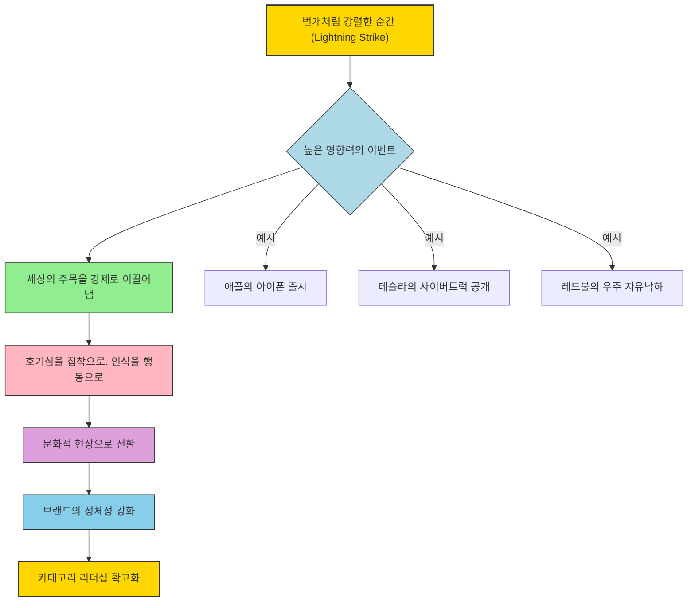
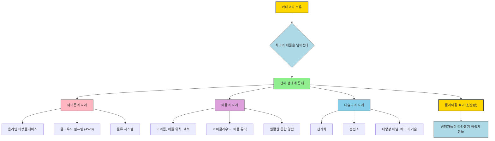
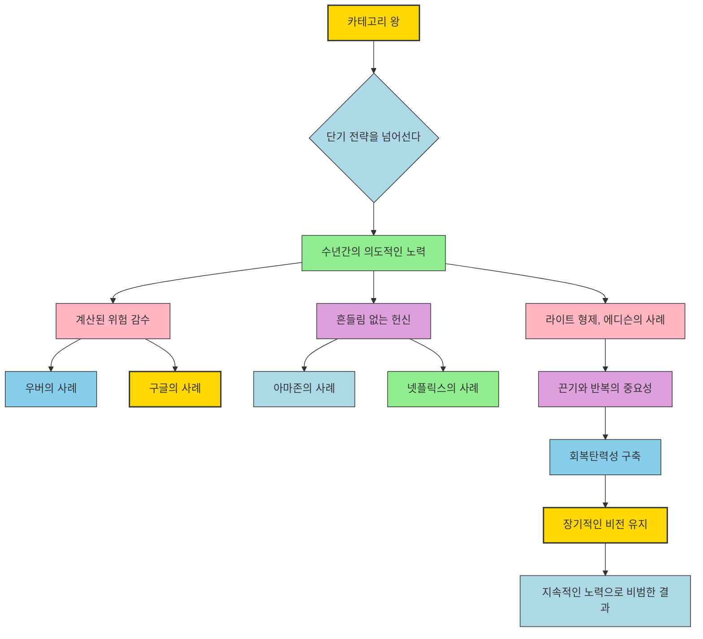

## 책 소개
이 책은 경쟁이 치열한 시장에서 살아남는 것을 넘어, 아예 새로운 시장을 만들고 그 시장의 주인이 되는 방법을 알려주는 책이야. 기존의 규칙을 따르지 않고, 자신만의 규칙을 만들어서 압도적인 성공을 거둔 회사들의 비밀을 파헤쳐 볼 거야. 이 책은 단순히 제품을 잘 만드는 것을 넘어, 세상을 바꾸는 아이디어를 어떻게 만들고 지켜나가는지 알려줄 거야.

## 본문 정리

## 1. 새로운 시장을 만들어라 

경쟁이 심한 곳에서 아등바등 싸우지 말고, 아예 새로운 시장을 만들어서 그곳의 왕이 되는 방법을 배워볼 거야.

1. **기존 시장에서 벗어나기** 
  - 다른 회사들과 똑같은 제품으로 경쟁하는 건 밑 빠진 독에 물 붓기나 마찬가지야.
  - 마치 이미 많은 사람이 뛰고 있는 경주에 뒤늦게 참여하는 것과 같아.
  - 대신, 아무도 없는 새로운 길을 만들어서 그 길의 규칙을 네가 정하는 게 중요해.

2. **새로운 시장을 만든 회사들** 
  - **세일즈포스(Salesforce)**: 이 회사는 기존의 고객 관리 소프트웨어(CRM)를 조금 더 좋게 만든 게 아니야.
  - 옛날 소프트웨어는 컴퓨터에 직접 설치하고 관리하는 게 너무 복잡하고 비쌌어.
  - 세일즈포스는 인터넷만 있으면 언제 어디서든 쓸 수 있는 '클라우드 기반 소프트웨어'라는 새로운 개념을 만들었어.
  - 이걸 '서비스형 소프트웨어(SaaS)'라고 부르는데, 세일즈포스는 이 시장을 처음 만들고 주인이 된 거야.
  - 피터 틸의 책 '제로 투 원'에서 말하는 것처럼, 경쟁이 없는 독점 시장을 만드는 게 진짜 성공이라는 걸 보여준 셈이지.

3. **역사 속의 사례들** 
  - **헨리 포드(Henry Ford)**: 19세기 말, 사람들은 더 빠른 말을 만들려고 했어.
  - 하지만 포드는 아예 '자동차'라는 새로운 이동 수단을 만들었지.
  - 그는 '모델 T'라는 대량 생산 자동차로 개인 이동 수단이라는 새로운 시장을 열었고, 사람들의 삶을 완전히 바꿔놓았어.
  - **넷플릭스(Netflix)**: 넷플릭스는 비디오 대여점 '블록버스터'와 경쟁하지 않았어.
  - 블록버스터가 DVD 대여에 매달릴 때, 넷플릭스는 '구독형 스트리밍 서비스'라는 새로운 시장을 만들었어.
  - 이제 '스트리밍' 하면 넷플릭스가 떠오르는 것처럼, 그들은 이 시장의 대명사가 되었지.

4. **강력한 이야기 만들기** 
  - 새로운 시장을 만들려면 단순히 혁신적인 제품만으로는 부족해.
  - 사람들이 "아, 이게 진짜 필요했어!"라고 느낄 만한 강력한 이야기가 필요해.
  - **테슬라(Tesla)**: 테슬라는 그냥 전기차를 만든 게 아니야.
  - '세상의 지속 가능한 에너지 전환을 가속화한다'는 큰 목표를 내세웠어.
  - 테슬라의 차는 단순한 운송 수단이 아니라, 환경 보호와 미래를 상징하는 아이콘이 된 거야.
  - 이런 이야기가 테슬라를 단순한 자동차 회사가 아닌, 그 자체로 하나의 시장으로 만들었어.

5. **용기와 통찰력** 
  - **애플(Apple)의 아이폰**: 아이폰이 나오기 전에는 블랙베리나 노키아 같은 회사들이 스마트폰 시장을 장악하고 있었어.
  - 그들은 이메일이나 물리적인 키보드 같은 기능에 집중했지.
  - 하지만 애플은 '폰'이라는 개념 자체를 다시 정의했어.
  - 통신, 엔터테인먼트, 컴퓨터 기능을 하나로 합친 우아한 기기를 만들어서 완전히 새로운 시장을 열었어.
  - 아이폰은 기존의 경쟁자들을 무너뜨린 것을 넘어, 그들의 시장 자체를 쓸모없게 만들었어.

6. **사람들의 마음을 읽기** 
  - 노벨상 수상자 대니얼 카너먼의 연구처럼, 사람들은 자신이 미처 몰랐던 문제에 대한 해결책을 제시할 때 새로운 아이디어를 더 잘 받아들여.
  - 새로운 시장을 만들려면 사람들이 말하지 않는 불편함이나 숨겨진 욕구를 찾아내야 해.
  - 세일즈포스는 기존 소프트웨어의 불편함을, 테슬라는 기후 변화에 대한 사람들의 불안감을 파고들었어.
  - 고객의 목소리에 귀 기울여서 그들이 아직 깨닫지 못한 문제를 찾아내는 게 중요해.

7. **핵심 메시지** 
  - 기존의 것을 어떻게 개선할지 고민하지 마.
  - 대신, '내 제품이나 서비스가 어떤 완전히 새로운 문제를 해결하는가?'를 물어봐.
  - 단순히 제품을 좋게 만들거나 마케팅을 잘하는 것을 넘어, 시장 자체를 재정의하는 이야기를 만들어야 해.
  - 목표는 경쟁하는 게 아니라, 시장을 '소유'하는 거야.
  - 대담하게 행동하고, 파괴적으로 생각해서 너의 브랜드가 독보적인 미래를 만들어야 해.

## 2. 거대한 문제를 해결하라 

새로운 시장을 만들려면 사람들이 "와, 이건 진짜 대박이다!"라고 할 만한 엄청나게 큰 문제를 해결해야 해.

1. **사소한 문제 말고, 세상을 바꿀 문제** 
  - 작은 불편함을 해결하는 것으로는 오래가는 시장을 만들 수 없어.
  - 사람들의 삶, 일하는 방식, 생각하는 방식을 바꿀 만한 거대한 도전에 맞서야 해.

2. **에어비앤비(Airbnb)의 사례** 
  - 에어비앤비는 호텔과 경쟁해서 성공한 게 아니야.
  - 그들은 '남는 공간을 어떻게 돈으로 만들까?' 그리고 '낯선 사람들끼리 어떻게 믿고 공간을 공유할까?'라는 완전히 다른 문제를 해결했어.
  - 사람들이 자신의 집을 빌려주고, 여행객들은 현지 문화를 경험할 수 있는 새로운 '공유 숙박' 시장을 만든 거야.
  - 이것은 단순히 기존 서비스를 개선한 것이 아니라, '환대(hospitality)'라는 개념 자체를 재정의한 셈이지.
  - 클레이튼 크리스텐슨의 '혁신가의 딜레마'에서 말하는 것처럼, 기존 시장에서 소외되거나 간과된 부분을 공략하는 파괴적인 혁신이었어.

3. **사회 변화를 읽는 눈** 
  - 에어비앤비는 2008년 금융 위기 이후, 저렴하고 진정한 여행 경험을 찾는 밀레니얼 세대의 등장을 포착했어.
  - 개성 없고 비싼 호텔은 이런 수요를 충족시키지 못했지.
  - 에어비앤비는 여행객에게는 저렴한 현지 경험을, 집주인에게는 수입을 제공하며 이 간극을 메웠어.
  - 이것은 여행객과 호스트, 그리고 방문하는 장소 간의 관계를 근본적으로 재정의한 거야.

4. **테슬라(Tesla)의 사례** 
  - 테슬라는 기후 변화와 화석 연료 의존이라는 전 지구적인 문제를 해결하려고 했어.
  - 테슬라 전기차가 처음은 아니었지만, '주행 거리 불안감'이나 '충전 인프라 부족' 같은 기존 전기차의 큰 문제들을 해결했어.
  - 테슬라는 단순히 차를 만든 게 아니라, 충전소 네트워크와 배터리 기술 발전으로 '지속 가능한 미래'라는 비전을 제시했어.
  - 이런 거대한 문제를 해결했기 때문에 소비자, 정부, 산업 전반에 큰 영향을 미칠 수 있었던 거야.

5. **사람들의 깊은 욕구를 건드리기** 
  - 심리학자 에이브러햄 매슬로의 '욕구 5단계 이론'처럼, 사람들은 생존, 안전, 소속감, 자아실현 같은 깊은 욕구를 해결해 주는 것에 끌려.
  - 에어비앤비는 '소속감'과 '특별한 경험'에 대한 욕구를, 테슬라는 '환경 안전'과 '기술 발전'에 대한 욕구를 건드렸어.
  - 네가 해결하는 문제가 클수록, 더 많은 사람이 너의 해결책에 공감하고 지지할 거야.

6. **비전과 **끈기 
  - **스티브 잡스(Steve Jobs)의 아이폰**: 아이폰은 파편화된 모바일 경험이라는 큰 문제를 해결했어.
  - 아이폰이 나오기 전에는 통화용 폰, 음악용 MP3 플레이어, 인터넷용 노트북을 따로 들고 다녀야 했지.
  - 애플은 이 모든 기능을 하나의 기기에 통합해서, 점점 더 디지털화되는 세상에서 '단순함'과 '효율성'이라는 거대한 문제를 해결했어.
  - 잡스는 제품을 만드는 것만으로는 부족하다는 것을 알았어. 보편적인 문제를 해결하는 것이 시장을 정의하는 성공의 열쇠였지.

7. **핵심 메시지** 
  - 네 제품이나 서비스를 넘어 더 크게 생각해 봐.
  - 산업을 뒤흔들거나 사람들의 삶을 바꿀 만한 '고통스러운 지점(pain points)'을 찾아봐.
  - 단순한 개선이나 편리함만을 추구하는 해결책에 만족하지 마.
  - 사회 변화와 충족되지 않은 욕구를 깊이 연구해서, 고객에게 정말 중요한 문제를 해결해야 해.
  - 단순히 유용한 것을 넘어, '필수적인' 해결책을 만들어야 해.
  - 거대한 문제를 해결하면, 단순히 제품을 만드는 것을 넘어 하나의 '운동(movement)'을 만드는 셈이야.

## 3. 독특한 관점(POV)을 만들어라 

너의 '관점(POV, Point of View)'은 세상이 너의 시장을 이해하고, 사람들이 너와 감정적으로 연결되는 방식이야.

1. **테슬라(Tesla)의 **관점 
  - 테슬라는 단순히 전기차를 만든 게 아니야.
  - 그들은 '기후 변화에 맞서 싸우고 지속 가능한 에너지로 전환을 이끄는 글로벌 선두 주자'라는 관점을 내세웠어.
  - 이런 관점은 테슬라를 평범한 자동차 회사와는 차원이 다른 존재로 만들었어.
  - 그들의 이야기는 제품 기능이나 사양을 넘어선 '목표'에 뿌리를 두고 있어서, 다른 회사들이 쉽게 따라 할 수 없는 경쟁 우위가 되었어.

2. **고프로(GoPro)의 관점** 
  - 고프로는 카메라만 팔아서 성공한 게 아니야.
  - 그들은 '정체성(identity)'을 팔았어.
  - 고프로의 관점은 명확했어: "인생은 모험이고, 당신이 바로 그 영웅이다."
  - 고프로 카메라는 단순히 순간을 기록하는 도구가 아니라, 대담한 탐험과 승리의 경험을 담는 도구가 되었어.
  - 이 이야기는 스릴을 즐기는 사람, 운동선수, 그리고 평범한 사람들의 마음을 사로잡았어.
  - 제품은 고객이 꿈꾸는 라이프스타일을 반영하는 거울이 된 셈이지.

3. **'왜(Why)'에 집중하기** 
  - 사이먼 사이넥의 '나는 왜 이 일을 하는가(Start with Why)'에서 강조하듯이, 사람들은 네가 '무엇을 하는지'가 아니라 '왜 하는지'를 보고 구매해.
  - 너의 관점은 브랜드와 떼려야 뗄 수 없는 강력한 목표를 분명히 보여줘야 해.

4. **대담함과 명확함** 
  - 너의 관점은 웹사이트 깊숙이 숨겨진 미션 선언문이 아니라, 고객과의 모든 상호작용에서 분명하게 드러나야 해.
  - **스티브 잡스(Steve Jobs) 시절의 애플**: 애플의 관점은 '기술은 직관적이고, 아름다우며, 사람들에게 힘을 주어야 한다'는 것이었어.
  - 이 관점은 제품 디자인부터 광고까지 모든 것에 스며들었어.
  - 애플의 '다르게 생각하라(Think Different)' 캠페인은 단순히 기기를 파는 것이 아니라, 창의성과 개성을 찬양하는 것이었지.
  - 이런 독특하고 기억에 남는 관점이 애플의 시장 리더십을 확고하게 만들었어.

5. **나이키(Nike)의 **관점 
  - 나이키의 '그냥 해(Just Do It)' 슬로건은 그들의 독특한 관점을 잘 보여줘.
  - 나이키는 단순히 신발이나 의류를 파는 게 아니야.
  - 그들은 '힘을 실어주고, 투지를 불어넣고, 위대함은 누구에게나 있다'는 믿음을 팔아.
  - 이런 관점은 고객과 감정적으로 연결되어, 제품을 넘어 스포츠와 성취라는 더 큰 문화 속에 브랜드를 각인시켰어.

6. **고객의 감정 이해하기** 
  - 독특한 관점을 만들려면 고객의 깊은 욕구, 두려움, 열망을 이해해야 해.
  - 테슬라는 기후 변화에 대한 불안감과 지속 가능한 미래에 대한 열망을, 고프로는 특별한 순간을 경험하고 싶어 하는 보편적인 인간의 욕구를 건드렸어.
  - 나이키는 자기 계발과 위대함을 추구하는 열망을 다루지.
  - 이런 관점들은 고객의 감정적인 부분을 깊이 이해했기 때문에 없어서는 안 될 시장을 만들 수 있었어.

7. **모방 불가능한 독특함** 
  - 너의 관점은 경쟁자들이 쉽게 따라 할 수 없을 만큼 독특해야 해.
  - 메시지가 평범하면 사람들의 기억에 남지 않아. 대담함이 필수적이야.
  - 모두에게 어필하려는 평범한 관점은 결국 아무에게도 어필하지 못해.
  - **파타고니아(Patagonia)**: 이 회사는 단기적인 이익을 포기하면서까지 '환경 보호'라는 관점을 대담하게 내세워.
  - 고객들에게 제품을 덜 사고, 오래된 제품을 수리해서 쓰라고 권장하지.
  - 이런 입장은 논란의 여지가 있지만, 파타고니아를 시장의 리더로 만들고, 같은 생각을 가진 고객들 사이에서 충성도를 깊게 만들었어.

8. **핵심 메시지** 
  - 너의 시장과 떼려야 뗄 수 없는 강력한 이야기를 만들어야 해.
  - '너는 무엇을 지지하고, 왜 그것이 중요한가?'라고 스스로에게 물어봐.
  - 너의 관점은 고객이 이해받고, 공감하고, 영감을 받도록 만들어야 해.
  - 너의 목표와 독특하게 연결되어 있어서 쉽게 모방할 수 없는 이야기를 만들어야 해.
  - 그렇게 하면 너의 시장은 단순한 시장 위치를 넘어, 사람들의 마음을 사로잡는 '운동'이 될 거야.

## 4. 번개처럼 강렬한 순간을 만들어라 

'번개처럼 강렬한 순간(Lightning Strike)'은 단순히 마케팅 캠페인이 아니야. 세상이 너의 시장에 주목하게 만드는, 계산된 고강도 이벤트라고 보면 돼.

1. **애플(Apple)의 완벽한 번개** 
  - 애플은 제품 출시를 문화적인 현상으로 만드는 데 도가 텄어.
  - 새로운 아이폰이 나올 때마다 헤드라인, 뉴스, 소셜 미디어를 장악하지.
  - 이건 우연이 아니야. 장소, 기조연설, 제품 공개, 출시 시기까지 모든 세부 사항이 최대의 효과를 내도록 정교하게 설계돼.
  - 번개처럼 강렬한 순간은 꾸준한 성장이나 작은 이득이 아니라, 호기심을 집착으로, 인식을 행동으로 바꾸는 짜릿한 순간을 만드는 거야.

2. **마블(Marvel) 영화의 비유** 
  - 마블 스튜디오가 새 영화를 개봉할 때, 단순한 시사회가 아니야. 하나의 '이벤트'지.
  - 예고편, 소셜 미디어 캠페인, 팬 참여가 몇 달 전부터 기대감을 쌓아 올려.
  - 영화가 개봉할 때쯤이면 관객들은 단순히 흥분하는 것을 넘어, 전 세계적인 문화 현상에 참여하는 기분을 느껴.
  - 번개처럼 강렬한 순간은 사업에서도 똑같은 효과를 내. 무시할 수 없는 경험을 만들어서 너의 시장이 주목의 중심이 되도록 하는 거야.

3. **대담하고 기억에 남는 순간** 
  - 번개처럼 강렬한 순간은 대담하고, 기억에 남으며, 가장 효과적인 시기에 맞춰져야 해.
  - **테슬라(Tesla)의 사이버트럭 공개**: 일론 머스크의 극적인 시연은 대담한 디자인과 함께, '깨지지 않는다'던 유리가 깨지는 유명한 실패를 포함했어.
  - 하지만 이 순간은 재앙이 아니었어. 엄청난 홍보 효과를 낳았고, 몇 주 동안 테슬라가 대화의 중심에 있도록 논쟁과 밈(meme)을 만들어냈지.
  - 이 이벤트의 논란의 여지가 있는 성격 덕분에 사람들은 계속 이야기하고, 공유하고, 기억하게 되었어. 모든 번개처럼 강렬한 순간이 목표로 해야 할 점이야.

4. **역사 속의 사례들** 
  - **코카콜라(Coca-Cola)의 뉴 코크(New Coke)**: 1985년, 코카콜라가 '뉴 코크'를 출시했을 때, 엄청난 반발과 함께 오리지널 코크로 돌아가는 과정에서 미디어의 광풍이 불었어.
  - 이 번개처럼 강렬한 순간은 의도된 것은 아니었지만, 코카콜라에 전례 없는 관심을 가져다주었고 브랜드에 대한 충성도를 다시 불태웠어.
  - 반면, **레드불(Red Bull)의 펠릭스 바움가르트너 우주 자유낙하 후원** 같은 계획된 번개처럼 강렬한 순간은 의도적인 행동이 어떻게 브랜드를 대담하고 혁신적인 것으로 각인시킬 수 있는지 보여줘.
  - 이 스턴트는 전 세계 수백만 명을 사로잡았고, 레드불을 '고강도 모험'과 연결시켜 에너지 드링크 시장의 리더십을 강화했어.

5. **전략적인 파급 효과** 
  - 너만의 번개처럼 강렬한 순간을 만들려면 넓고 전략적으로 생각해야 해.
  - 단순히 이벤트 자체만이 아니라, 그것이 미디어, 문화, 대화 전반에 파급 효과를 일으키도록 해야 해.
  - 스티브 잡스는 애플 키노트의 마지막에 항상 "한 가지 더(One more thing)"라며 깜짝 발표를 해서, 예측 가능한 이벤트를 경이로움과 흥분의 순간으로 끌어올렸어.
  - 모든 번개처럼 강렬한 순간은 똑같은 기대감과 즐거움을 목표로 해서, 고객들이 더 많은 것을 갈망하게 만들어야 해.

6. **핵심 이야기와의 일치** 
  - 번개처럼 강렬한 순간은 너의 시장의 핵심 이야기와 일치해야 해.
  - 이벤트가 너의 관점과 동떨어져 보이면, 지속적인 추진력을 얻지 못할 거야.
  - 테슬라의 사이버트럭 공개는 자동차 산업의 대담하고 미래 지향적인 혁신가라는 그들의 정체성을 강화했기 때문에 성공했어.
  - 애플의 출시 행사도 혁신과 단순함에 대한 그들의 약속을 구현하기 때문에 성공하는 거야.
  - 너의 번개처럼 강렬한 순간이 단순히 주목을 끄는 것을 넘어, 고객들이 너의 시장을 더 깊이 이해하고 연결되도록 해야 해.

7. **핵심 메시지** 
  - 너의 시장을 고객의 마음속에 각인시킬 잊을 수 없는 순간을 만들어야 해.
  - 이것은 단순히 화려한 것을 위한 것이 아니야. 인식을 바꾸고, 입소문을 내고, 지속적인 영향을 미치는 이벤트를 만드는 거야.
  - 대담하고, 전략적이며, 너의 순간이 중요하도록 만들어야 해.
  - 잘 실행된 번개처럼 강렬한 순간은 너의 시장을 순식간에 무명에서 지배적인 위치로 끌어올릴 수 있어.

## 5. 생태계를 지배하라 

시장을 소유한다는 건 단순히 최고의 제품을 갖는 게 아니야. 그 시장을 정의하고 지탱하는 '전체 생태계'를 통제하는 것을 말해.

1. **아마존(Amazon)의 **생태계 지배 
  - 아마존은 단순히 책을 파는 것으로 시장을 지배한 게 아니야.
  - 그들은 어떤 제품이든 찾을 수 있는 거대한 '온라인 마켓플레이스'를 만들었어.
  - '아마존 웹 서비스(AWS)'로 클라우드 컴퓨팅 분야로 확장했고, 당일 배송을 가능하게 하는 물류 시스템으로 배송 방식을 재정의했지.
  - 아마존의 힘은 한 가지를 잘하는 것에서 오는 게 아니야. 고객 여정의 모든 접점을 통합하고, 다른 회사들이 생각지도 못했던 문제들을 해결하는 데서 와.
  - 생태계를 지배하는 것이 단기적인 성공과 장기적인 시장 리더십의 차이를 만들어.

2. 플라이휠**(Flywheel) 효과** 
  - 시장 리더들은 생태계가 단순히 제품과 서비스가 아니라, 고객 문제의 모든 측면을 다루는 '상호 연결된 네트워크'라는 것을 이해해.
  - 아마존의 전략은 짐 콜린스의 '좋은 기업을 넘어 위대한 기업으로'에서 설명하는 '플라이휠' 개념과 완벽하게 일치해.
  - 플라이휠은 서로를 강화하는 상호 연결된 행동을 통해 추진력을 얻는 자립적인 시스템이야.
  - 아마존의 경우, 고객 데이터를 활용해 재고를 최적화하고, 방대한 물류 네트워크를 활용해 배송 시간을 단축하며, 원활한 쇼핑 경험을 제공해 고객이 계속 돌아오게 만들어.
  - 그 결과, 경쟁자들이 방해하기 어려운 성장 사이클이 만들어지는 거야.
  - 생태계를 지배하려면 시간이 지남에 따라 스스로 강해지는 플라이휠을 만들어야 해.

3. **애플(Apple)의 **생태계 지배 
  - 애플은 아이폰이나 맥(Mac)만 파는 게 아니야.
  - 그들은 모든 제품과 서비스가 완벽하게 통합되는 생태계를 만들어.
  - 아이폰은 애플 워치로 이어지고, 애플 워치는 맥북과 동기화되며, 아이클라우드(iCloud)나 애플 뮤직(Apple Music) 같은 서비스가 이 모든 것을 하나로 묶어줘.
  - 이 생태계는 고객들을 직관적이고 편리하며, 거의 떠날 수 없는 네트워크에 묶어두는 거야.
  - 삼성 같은 경쟁자들이 더 좋은 하드웨어로 애플 사용자를 유혹하려 해도, 더 큰 생태계의 이점을 해결하지 못해 실패하는 경우가 많아.
  - 애플의 지배력은 전체 경험을 통제하는 능력에 있어. 제품 하나하나가 아니라, 전체가 모여서 필수적인 존재가 되는 거지.

4. **테슬라(Tesla)의 생태계 사고** 
  - 테슬라의 성공도 생태계 사고에 달려 있어.
  - 다른 자동차 회사들이 차량 자체에만 집중할 때, 테슬라는 충전소, 태양광 패널, 배터리 기술까지 생태계에 통합해.
  - 테슬라는 단순히 차를 파는 게 아니야. 소비자의 삶의 모든 부분에 영향을 미치는 '지속 가능한 에너지'라는 비전을 팔아.
  - 이런 총체적인 접근 방식 덕분에 테슬라 오너들은 단순한 고객이 아니라, 자신의 가치와 일치하는 미션에 참여하는 사람이 돼.
  - 자신들의 시장을 지탱하는 인프라와 기술을 구축함으로써, 테슬라는 경쟁자들이 쉽게 따라 할 수 없는 위치를 확보했어.

5. **역사 속의 교훈** 
  - 19세기 후반, 존 D. 록펠러는 스탠더드 오일(Standard Oil)을 지배적인 기업으로 만들었어.
  - 단순히 석유를 정제한 게 아니라, 생산부터 운송, 유통까지 산업의 모든 부분을 통제했지.
  - 생태계를 소유함으로써 록펠러는 경쟁자들이 수익을 내기 어렵게 만들었어.
  - 그의 독점은 결국 해체되었지만, 교훈은 남아 있어. 생태계를 통제하는 자가 시장을 통제한다는 거야.

6. **핵심 메시지** 
  - 너의 제품을 넘어 더 크게 생각해야 해.
  - 고객이 문제와 상호작용하는 모든 지점을 파악하고, 그 접점들을 소유하거나 영향을 미칠 방법을 찾아봐.
  - **넷플릭스(Netflix)**는 콘텐츠를 제공할 뿐만 아니라, 직접 제작하고, 시청자 선호도를 이해하기 위해 데이터를 활용하며, 모든 기기에서 원활한 접근을 제공해.
  - 그들의 생태계는 구독자들이 다른 곳을 찾을 필요나 욕구를 거의 느끼지 않도록 해.
  - 이런 통합적인 접근 방식이 그들의 시장 리더십을 확고히 하고, 파괴를 어렵게 만들어.
  - 너의 영향력을 심화시킬 추가 서비스, 인프라, 파트너십이 무엇인지 스스로에게 물어봐.
  - 너의 제품들 사이에 연결고리를 만들어서 고객 없이는 살 수 없는 원활하고 통합된 경험을 만들어야 해.
  - 경쟁자들이 너의 생태계의 폭과 깊이를 따라잡을 수 없도록 끊임없이 확장해야 해.
  - 생태계를 지배하면, 시장을 지배하는 거야.

## 6. 긴 호흡으로 게임에 임하라 

시장의 왕이 되는 건 단기적인 전략이나 빠른 성공으로 이루어지는 게 아니야. 수년간의 의도적인 노력, 계산된 위험 감수, 그리고 흔들림 없는 헌신을 통해 탄생하는 거야.

1. **우버(Uber)와 구글(Google)의 인내심** 
  - **우버**: 우버는 단순히 앱을 출시하고 성공을 바란 게 아니야.
  - 규제 문제, 시장 저항, 치열한 경쟁에 직면했지.
  - 하지만 네트워크에 막대한 투자를 하고, 기술을 개선하며, 충성도 높은 고객 기반을 구축하며 끈기 있게 버텼어.
  - **구글**: 구글이 검색 시장의 리더가 된 것도 순식간이 아니야.
  - 초기에는 알고리즘을 완벽하게 만들고, 타의 추종을 불허하는 관련성과 단순함을 제공하는 데 끊임없이 집중했어.
  - 야후(Yahoo)나 알타비스타(Alta Vista) 같은 경쟁자들이 지배적일 때도, 구글은 긴 호흡으로 게임에 임했고, 오늘날 '구글링하다'는 말이 온라인 검색의 대명사가 되었지.

2. **마라톤과 같은 시장 설계** 
  - 시장을 설계하는 것은 단거리 경주가 아니라 마라톤과 같아.
  - 성공하는 회사들은 시장을 구축하는 것이 훌륭한 제품 그 이상이라는 것을 이해해.
  - 시간이 지남에 따라 스토리텔링, 인프라, 사용자 신뢰에 꾸준히 투자해야 해.
  - 앤젤라 덕워스의 '그릿(Grit)' 연구처럼, 장기간에 걸친 열정과 끈기가 성공의 가장 중요한 예측 변수야.
  - 결과가 멀어 보여도 좌절을 견디고, 집중력을 유지하며, 계속 개선해야 시장을 이끌 수 있어.

3. **아마존(Amazon)의 여정** 
  - 아마존은 초기 몇 년 동안 투자자들의 회의적인 시선과 거의 10년 동안의 손실을 견뎌냈어.
  - 그들이 생태계의 기반을 구축하는 동안 말이야.
  - 제프 베이조스의 장기적인 성장에 대한 흔들림 없는 헌신 덕분에 아마존은 경쟁자들이 따라잡을 수 없는 수준으로 성장할 수 있었어.
  - 다른 회사들이 단기적인 수익성에 매달릴 때, 아마존은 고객 경험, 물류, 기술 혁신에 집중했지.
  - 이 전략은 화려하지 않았지만, 결국 그들의 지배력을 확보했어.
  - 오늘날 아마존의 시장 리더십은 당연해 보이지만, 수년간의 인내심 있고 훈련된 노력 위에 세워진 거야.

4. **넷플릭스(Netflix)의 진화** 
  - 긴 호흡으로 게임에 임한다는 것은 시장 비전을 잃지 않으면서 기꺼이 진화하는 것을 의미해.
  - 넷플릭스는 DVD 대여 서비스로 시작했지만, 사람들이 콘텐츠를 소비하는 방식을 재정의할 기회를 보고 스트리밍으로 전환했어.
  - 이 전환은 순식간에 이루어지거나 쉽지 않았어.
  - 스트리밍 플랫폼을 구축하고, 콘텐츠를 확보하며, 블록버스터나 HBO 같은 기존 경쟁자들과의 경쟁을 헤쳐나가는 데 수년이 걸렸지.
  - 주문형 엔터테인먼트 시장에 대한 넷플릭스의 헌신과 기술 변화에 적응하려는 의지가 결국 그들의 리더십을 확보했어.
  - 그들의 성공은 큰 그림에 집중하면서도, 도중에 조정을 해나가는 것의 중요성을 보여줘.

5. **역사 속의 **끈기 
  - **라이트 형제**: 그들은 하룻밤 사이에 동력 비행을 발명한 게 아니야.
  - 키티호크에서의 첫 성공적인 비행까지 수년간의 실험, 실패, 반복이 필요했어.
  - 그들의 끈기는 '인간 항공'이라는 새로운 시장을 만들었을 뿐만 아니라, 세상을 바꿀 산업의 토대를 마련했어.
  - **토마스 에디슨**: 전구를 개발하는 데 수천 번의 실험이 필요했어.
  - 반복되는 실패에 대해 에디슨은 유명한 말을 남겼지. "나는 실패한 것이 아니다. 단지 작동하지 않는 1만 가지 방법을 찾았을 뿐이다."
  - 이 이야기들은 지속적인 노력이 종종 혁신과 시장 창조의 대가라는 것을 상기시켜 줘.

6. **회의론에 대한 회복탄력성** 
  - 긴 호흡으로 게임에 임하는 것은 회의적인 시선에 맞서 회복탄력성을 구축하는 것도 포함해.
  - 구글의 초기 검색 수익화 시도는 의심을 받았어. '단순한 검색 엔진이 어떻게 그렇게 많은 수익을 창출할 수 있을까?'
  - 하지만 그들은 비전에 충실하고 애드워즈(Adwords)를 도입함으로써, 회의론자들을 틀렸다는 것을 증명했을 뿐만 아니라 디지털 광고를 혁신했어.
  - 너의 시장의 장기적인 잠재력에 집중하면서 회의적인 시선을 견뎌내는 능력이 중요해.
  - 단기적인 좌절은 피할 수 없어. 그것에 어떻게 반응하느냐가 네가 리더로 부상할지, 아니면 사라질지를 결정할 거야.

7. **핵심 메시지** 
  - 네가 정의하고 지배하려는 시장에 완전히 헌신해야 해.
  - 빠른 성공을 쫓거나 너무 일찍 방향을 바꾸려는 유혹을 참아.
  - 좌절은 여정의 일부이며, 훈련, 회복탄력성, 적응력이 너의 가장 큰 자산이라는 것을 이해해.
  - 너의 비전에 충실하고, 전략을 개선하며, 시간이 지남에 따라 꾸준한 노력이 비범한 결과를 가져올 것이라고 믿어.
  - 긴 호흡으로 게임에 임하는 것만이 지속되는 유산을 구축하는 유일한 방법이야.

## 7. 설계 문화를 구축하라 

시장을 설계하는 것은 한 번의 캠페인이나 한 번의 번뜩이는 아이디어가 아니야. 조직의 모든 구석구석에 스며들어야 하는 '훈련'과 같아.

1. **통합된 비전의 중요성** 
  - 진정한 시장의 왕들은 시장 설계를 그들의 문화 속에 심어 넣어.
  - 모든 결정과 행동을 이끄는 통합된 비전을 만드는 거야.
  - 이런 문화적 사고방식은 조직이 시장 변화에 단순히 반응하는 것을 넘어, 적극적으로 시장을 형성하도록 해.
  - 시장 설계를 전략에서 '삶의 방식'으로 바꾸어, 모든 팀원이 비전을 이해하고, 지지하며, 기여하도록 해.
  - 이런 문화적 기반이 없으면, 아무리 유망한 시장이라도 불일치와 비일관성으로 인해 무너질 위험이 있어.

2. **파타고니아(Patagonia)의 사례** 
  - 파타고니아는 이 원칙을 완벽하게 보여줘.
  - 그들의 시장을 정의하는 목표는 '환경 보호'이고, 그들의 문화는 모든 세부 사항에서 이 약속을 반영해.
  - 지속 가능한 재료를 조달하는 것부터 고객에게 옷을 교체하는 대신 수리하도록 권장하는 것까지, 파타고니아의 내부 관행은 그들의 외부 이야기와 일치해.
  - 이런 일치는 브랜드를 강화할 뿐만 아니라, 그들의 가치를 공유하는 직원과 고객을 끌어들여.
  - 그 결과, 회사의 행동과 문화가 시장 비전을 지속적으로 지지하는 자가 강화 시스템이 만들어지는 거야.
  - 파타고니아는 단순히 아웃도어 장비를 파는 게 아니야. 그들은 '운동'을 이끌고 있고, 그 운동은 '설계 문화'에 뿌리를 두고 있어.

3. **시스템, 의식, 책임감** 
  - 설계 문화를 구축하려면 영감을 주는 슬로건이나 가끔 하는 워크숍 이상이 필요해.
  - 시스템, 의식, 그리고 책임감이 필요해.
  - 에릭 리스의 '린 스타트업(The Lean Startup)'은 성공적인 비즈니스 문화의 핵심 요소로 지속적인 혁신과 반복을 옹호해.
  - 스타트업이 학습과 적응을 우선시하는 시스템을 구축해야 하는 것처럼, 시장의 왕들도 모든 팀원이 시장의 진화에 기여하도록 하는 프레임워크를 구축해야 해.
  - 이것은 팀이 시장 이야기를 정기적으로 검토하고 개선하는 세션이나, 제품 개발, 마케팅, 고객 경험을 전체 비전과 일치시키기 위한 부서 간 회의를 포함할 수 있어.
  - 핵심은 시장 설계가 나중의 일이 아니라, 일상적인 관행이 되는 구조를 만드는 거야.

4. **테슬라(Tesla)의 설계 문화** 
  - 테슬라는 강력한 설계 문화가 어떻게 시장 리더십을 이끌 수 있는지 보여줘.
  - 일론 머스크의 '세상의 지속 가능한 에너지 전환을 가속화한다'는 비전은 단순한 기업 미션 선언문이 아니야.
  - 테슬라의 채용, 혁신, 고객 참여를 이끄는 '지침 원칙'이야.
  - 엔지니어부터 마케터까지 테슬라의 모든 직원은 이 비전에 맞춰져 있어.
  - 이런 문화적 응집력 덕분에 테슬라는 경쟁이 치열한 산업에서 집중력과 민첩성을 유지할 수 있어.
  - 태양 에너지나 배터리 저장 같은 새로운 분야로 확장할 때도 시장을 정의하는 목표가 중심에 남아 있도록 해.
  - 이런 문화가 없었다면, 테슬라의 야심 찬 목표는 빠른 성장의 압력 속에서 쉽게 파편화될 수 있었을 거야.

5. **NASA(나사)의 문화적 일치** 
  - 역사는 문화적 일치의 중요성에 대한 더 많은 교훈을 제공해.
  - 아폴로 프로그램 동안, NASA의 문화는 '사람을 달에 착륙시키고 안전하게 지구로 귀환시킨다'는 단 하나의 목표에 집중되어 있었어.
  - 이런 목적의 명확성은 수천 명의 직원, 계약자, 파트너를 분야를 넘어 통합시켰어.
  - 엔지니어링부터 물류까지 모든 결정은 이 궁극적인 목표에 따라 측정되었지.
  - 그 결과는 성공적인 아폴로 11호 임무뿐만 아니라, 오늘날까지 우주 탐사를 형성하는 혁신과 영감의 유산이었어.
  - 명확하고 대담한 비전에 기반을 둔 NASA의 설계 문화가 그들의 성공의 초석이었어.

6. **핵심 메시지** 
  - 너의 시장 비전을 조직의 DNA에 심는 것부터 시작해야 해.
  - 이것은 비전을 믿는 사람들을 고용하고, 팀이 시장 설계의 관점에서 자신의 역할을 보도록 훈련시키며, 비전을 살아있게 하는 의식을 만드는 것을 의미해.
  - 아마존에서 제프 베이조스는 '고객 집착' 문화를 만들었어. 모든 프로젝트와 결정은 고객 경험을 개선할 잠재력을 기준으로 평가되지.
  - 이런 문화적 훈련이 아마존이 단 하나의 시장이 아니라, 여러 상호 연결된 시장을 계속 이끄는 이유 중 하나야.
  - 강력한 설계 문화는 너의 시장 리더십이 개별 제품이나 시장 트렌드를 능가하도록 보장하는 것이야.
  - 너의 조직 내에서 시장 설계를 '공동의 책임'으로 만들어야 해.
  - 모든 팀원이 비전에 대한 소유감을 느끼고, 그것에 기여할 권한을 부여받는 환경을 조성해.
  - 이런 사고방식을 매일 강화하는 시스템을 구축하고, 너의 행동이 너의 이야기와 일관되게 일치하도록 해.
  - 안일함이나 불일치가 너의 문화를 약화시키도록 절대 내버려 두지 마.
  - 강력한 설계 문화는 지속적인 시장 리더십의 기반이자, 너의 팀과 고객 모두에게 영감을 주는 유산을 만드는 열쇠야.

## 결론 
'플레이 비거'는 사업의 규칙을 재정의하는 방법을 가르쳐줘. 붐비는 시장에서 작은 조각을 위해 싸우는 대신, 네가 완전히 소유할 수 있는 새로운 시장을 만들어야 해. 이 책의 교훈은 클레이튼 크리스텐슨의 파괴적 혁신 이론부터 사이먼 사이넥의 목적 중심 리더십 강조까지 다양한 분야에 걸쳐 울려 퍼져. 더 깊이 이해하려면 피터 틸의 '제로 투 원'과 김위찬, 르네 마보안의 '블루오션 전략'을 읽어보는 게 좋아. 성공은 게임을 하는 것에서 오는 것이 아니라, 게임을 '설계'하는 것에서 온다는 것을 기억해. 더 크게 생각하고, 더 대담하게 행동하며, 전설이 되는 것을 목표로 해.

