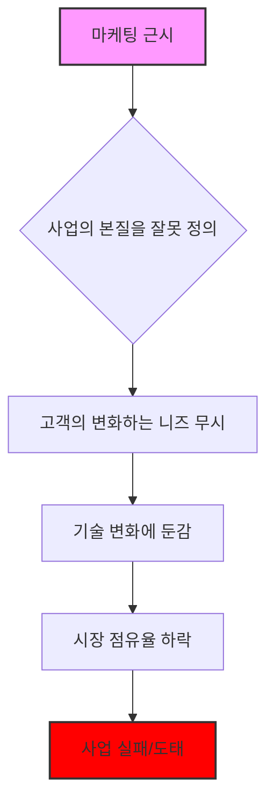
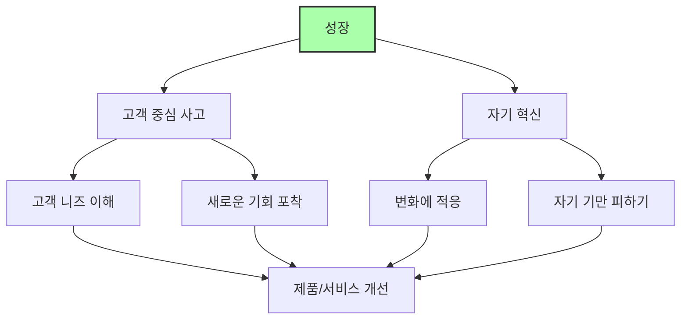

## 마케팅 근시: 테오도르 레빗의 통찰
이 책은 기업들이 왜 성장에 실패하는지, 그리고 어떻게 하면 지속적으로 성장할 수 있는지에 대한 테오도르 레빗 교수의 핵심 통찰을 담고 있다. 기업이 제품 중심적인 사고에서 벗어나 고객 중심적인 사고로 전환해야 한다는 메시지를 전달한다.

## 1. 마케팅 근시란 무엇일까? 

마케팅 근시(Marketing Myopia)는 기업이 자기 제품이나 서비스에만 너무 집중해서, 고객의 진짜 필요나 시장의 변화를 제대로 보지 못하는 현상을 말한다. 마치 눈앞의 것만 보느라 멀리 있는 중요한 것을 놓치는 것과 같다고 보면 된다.

1. 테오도르 레빗** 교수와 그의 통찰** 
  - 테오도르 레빗은 하버드 비즈니스 스쿨 교수이자 독일 태생의 미국 경제학자이다.
  - 그는 '세계화(globalization)'라는 용어를 대중화시킨 것으로도 유명하다.
  - 레빗 교수는 마케팅의 역할이 과소평가되고 있다고 비판하며, 기업이 무엇을 만들고 팔아야 하는지, 그리고 마케팅 노력을 어떻게 해야 하는지에 대해 많은 글을 썼다.
  - 그의 가장 유명한 논문 중 하나가 바로 1960년 하버드 비즈니스 리뷰에 실린 '마케팅 근시'이다.
  - 이 논문에서 그는 기업 경영진들이 자기 회사의 사업을 너무 좁게 정의하는 것을 비판했다.

2. 철도** 산업의 사례: 사업의 본질을 잘못 이해한 경우** 
  - 레빗 교수는 철도 산업이 항공, 트럭, 자동차 산업에 고객을 빼앗긴 이유를 설명했다.
  - 철도 회사 경영진들은 자신들이 '기차를 운행하는 사업'을 한다고 생각했다.
  - 하지만 레빗 교수는 그들이 '운송 서비스를 제공하는 사업'을 한다고 생각했어야 한다고 주장했다.
  - 만약 철도 회사들이 자신들이 운송 사업에 있다고 생각했다면, 기차뿐만 아니라 자동차나 트럭 같은 다른 형태의 운송 수단으로도 사업을 확장했을 것이다.
  - 이것은 마치 사람들이 1/4인치 드릴을 원하는 것이 아니라, 1/4인치 구멍을 원하는 것과 같은 이치이다. 즉, 고객은 제품 자체가 아니라 제품이 해결해주는 문제를 원하는 것이다.

3. **생산 중심에서 고객 중심으로의 전환** 
  - 레빗 교수는 경영진들에게 '생산 중심(production orientation)' 사고방식에서 '고객 중심(consumer orientation)' 사고방식으로 전환하라고 강조했다.
  - 기업들은 현재 자신들이 하는 일에 너무 많은 시간, 에너지, 돈을 투자하지만, 정작 중요한 고객의 필요에는 충분히 집중하지 못한다는 것이다.
  - 고객의 변화하는 필요를 이해하고 충족시키는 것이 기업 성장의 핵심이다.

## 2. 마케팅 근시가 생기는 이유들 

마케팅 근시는 여러 가지 이유로 발생하는데, 마치 눈이 나빠지는 것처럼 기업의 시야를 좁게 만드는 원인들이 있다.

1. **사업이 계속 성장할 것이라는 착각** 
  - 어떤 회사들은 자신들이 '성장 산업'에 있거나, 자기 제품이 시장에서 경쟁할 만한 대체재가 없다고 믿는다.
  - 이런 생각은 잘못된 안정감을 주고, 근시안적인 시각을 갖게 한다.
  - 모든 형태의 경쟁을 항상 고려해야 하며, 시장 조사를 꾸준히 하고 환경 변화를 주시해야 경쟁력을 유지할 수 있다.

2. **명확한 목표의 부족** 
  - 기업은 명확한 단기 및 장기 목표를 가지고 있어야 한다.
  - 진공 상태에서 존재할 수 없듯이, 장기적인 성장 전략과 단기적인 사업 목표가 모두 필요하다.
  - 아무리 좋은 제품을 가지고 있어도, 지금 당장 고객이 필요로 하는 것인지 항상 고려해야 한다.

3. **빠른 결과에 대한 욕심** 
  - 리더들이 단기적인 성과나 '쉬운 승리(quick wins)'만을 원할 때 마케팅 근시가 생길 수 있다.
  - 물론 당장 얻을 수 있는 성과도 중요하지만, 이것에만 의존하면 경쟁 우위를 확보하거나 회사를 성장시킬 수 없다.
  - 결국 회사는 정체될 수밖에 없다.

4. **긍정적인 마케팅 데이터에 대한 과도한 요구** 
  - 경영진이 계속해서 성과를 요구하면, 직원들은 마케팅 아이디어가 성공적이라는 데이터를 만들어내야 한다는 압박을 느낄 수 있다.
  - 이런 방식은 장기적으로 생산적이지 않다. 당장의 성공률을 보여주기 위해 결과가 조작될 수도 있기 때문이다.
  - 항상 큰 그림을 보고, 때로는 좋든 나쁘든 현재 상황을 더 비판적으로 바라볼 필요가 있다.

5. **지나친 자신감** 
  - 사업은 항상 변화에 유연하게 대응할 수 있어야 한다. 지나친 자신감은 금물이다.
  - 고객 트렌드는 순식간에 바뀔 수 있다. 예를 들어, 팬데믹은 우리가 사업을 하고 제품과 서비스를 제공하는 방식을 완전히 바꿔놓았다.
  - 이는 경쟁 우위를 유지하고 고객의 필요에 귀 기울이는 것과 직결된다.

6. **기본적인 타겟 고객층을 파악하지 못함** 
  - 가장 기본적인 실수 중 하나는 기본적인 타겟 고객층을 제대로 파악하지 못하는 것이다.
  - 무작정 광고를 뿌리는 방식(throw paint at the wall)은 효과적이지 않다.
  - 수백만 달러의 예산이 있는 경우가 아니라면, 대부분의 기업은 더 틈새시장(niche)에 집중해야 한다.
  - 다양한 제품과 서비스를 위한 '구매자 페르소나(buyer personas)'를 만드는 것이 마케팅 캠페인의 방향을 정하는 데 큰 도움이 된다.

## 3. 마케팅 근시를 피하는 방법 

마케팅 근시를 피하려면 마치 시력 교정을 하듯이 기업의 시야를 넓히고 초점을 제대로 맞춰야 한다.

1. **시장의 진짜 요구에 집중하기** 
  - 마케팅 근시를 피하는 가장 간단한 방법은 시장이 정말로 무엇을 원하는지에 집중하는 것이다.
  - 명확한 비전을 가지고, 당신의 제품이나 서비스가 지금 그리고 미래에 어떤 변화를 만들 수 있을지 고민해야 한다.

2. **제품보다 고객을 우선시하기** 
  - 이것이 레빗 교수의 이론의 핵심이다.
  - 제품의 기능(features)에만 집중하기보다는, 그 제품이 고객의 어떤 문제를 해결해줄 수 있는지에 초점을 맞춰야 한다.
  - 예를 들어, 아마존은 어떤 사업을 하는지에 얽매이지 않고, 고객을 만족시키는 사업을 한다고 생각한다. 그들은 고객의 필요를 채우기 위해 핵심 사업을 클라우드 서비스(AWS)처럼 다른 분야로도 확장했다. 

3. **마케팅을 먼저 생각하기** 
  - 대부분의 회사는 제품이나 서비스를 먼저 만들고 나서, 어떻게 마케팅할지 고민한다.
  - 하지만 실제로는 그 반대가 되어야 한다.
  - 사람들이 무엇을 원하고 필요로 하는지 미리 파악한 다음, 그 필요를 충족시키는 제품이나 서비스를 제공해야 한다.

4. **유연한 **마케팅 전략** 유지하기** 
  - 마케팅 전략이 정체되지 않도록 항상 유연하게 유지해야 한다.
  - 시장에 끊임없이 적응해야 하므로, 환경 분석 등을 통해 지속적으로 연구하는 자세를 가져야 한다.
  - 이는 고객의 변화하는 필요를 주시하는 것뿐만 아니라, 경쟁자들이 어떻게 진화하는지도 면밀히 관찰하는 것을 포함한다.

5. **사업 다각화 및 차별점 찾기** 
  - 고객의 변화하는 필요를 충족시키면서, 제공하는 제품이나 서비스를 확장하거나 적응시킬 방법을 모색해야 한다.
  - 오늘 통하는 것이 내일은 통하지 않을 수 있다.
  - 항상 회사의 차별점, 즉 무엇이 당신을 진정으로 독특하게 만드는지, 그리고 당신이 제공하는 것이 고객에게 왜 최고의 선택인지에 집중해야 한다.

## 4. 마케팅 근시로 실패하거나 성공한 기업 사례들 

마케팅 근시가 얼마나 위험한지, 그리고 이를 극복했을 때 어떤 결과가 나타나는지 실제 기업 사례를 통해 더 자세히 알아보자.

1. **실패 사례: 사업의 본질을 잘못 이해한 경우**
  - **할리우드** 
  - 할리우드는 처음에는 자신들이 '영화 사업'을 한다고 생각했다.
  - 하지만 사실은 '엔터테인먼트 사업'에 있었다.
  - 고객들은 TV나 넷플릭스, 훌루, 아마존 같은 OTT 서비스에서 편리하고 저렴한 엔터테인먼트를 원했지만, 할리우드는 이에 늦게 적응했다.
  - 과거에는 소수의 스튜디오 경영진이 어떤 영화를 볼지 결정했지만, 지금은 유튜브, 넷플릭스 등 다양한 플랫폼에서 엔터테인먼트를 소비한다.

- **코닥(Kodak)** 
  - 코닥은 필름과 사진으로 유명한 선구적인 브랜드였다.
  - 그들은 자신들이 '필름 사업'을 한다고 좁게 생각했다.
  - 하지만 세상은 디지털 사진으로 바뀌고 있었고, 코닥은 이를 예측하고 대응하는 데 실패했다.
  - 반면 후지(Fuji)와 소니(Sony) 같은 회사들은 디지털 이미징 기술에 투자하여 이 분야의 선두 주자가 되었다.
  - 코닥은 필름에 계속 매달리다가 결국 시장 점유율이 하락하고 2012년에 파산했다.

- **노키아(Nokia)** 
  - 노키아는 한때 휴대폰 시장의 강자였다.
  - 하지만 그들은 '모바일 폰과 기기 사업'에만 집중했고, 스마트폰과 소프트웨어 생태계로의 전환을 예측하지 못했다.
  - 애플과 구글이 모바일 소프트웨어와 생태계로 시장을 혁신하는 동안, 노키아는 하드웨어 사업에만 매달렸다.
  - 결국 노키아는 시장 점유율을 잃고 마이크로소프트에 인수되었다가 지금은 HMD 글로벌로 넘어갔다.

- **야후(Yahoo!)** 
  - 야후는 자신들을 '웹 포털 및 홈페이지 사업'으로 좁게 정의했다.
  - 구글이 검색 엔진으로 성장하고 있을 때, 구글은 야후에게 두 번이나 인수 제안을 했다.
  - 하지만 야후는 근시안적인 시각으로 이를 거절했고, 결국 검색 엔진 시장을 구글에게 내주었다.
  - 구글은 이후 다양한 혁신적인 온라인 서비스를 개발하여 고객의 필요를 충족시켰다.
2. **성공 사례: 마케팅 근시를 극복한 경우**
  - **올드 스파이스(Old Spice)** 
  - 올드 스파이스는 남성 향수 및 그루밍 브랜드였다.
  - 하지만 오래된 브랜드 이미지가 강해서 40~50대 이상을 위한 제품으로 인식되었고, 젊은 세대에게는 인기가 없었다.
  - 올드 스파이스는 이 문제를 해결하기 위해 브랜드 및 광고 회사를 고용했다.
  - 2010년에 '당신의 남자가 맡을 수 있는 향기(The Man Your Man Could Smell Like)'라는 캠페인을 진행하여 브랜드 이미지를 혁신했다.
  - 이 캠페인 덕분에 올드 스파이스는 젊은 세대 사이에서 큰 인기를 얻으며 위기에서 벗어날 수 있었다.

## 5. 성장을 위한 핵심 원칙: 고객 중심 사고와 자기 혁신 

기업이 지속적으로 성장하려면 두 가지 핵심 원칙을 반드시 지켜야 한다. 바로 고객 중심 사고와 끊임없는 자기 혁신이다.

1. 성장 산업은 없다**, 성장 기회를 포착하는 회사만 있을 뿐이다** 
  - 레빗 교수는 "성장 산업이라는 것은 없다. 오직 성장 기회를 만들고 활용하도록 조직되고 운영되는 회사만 있을 뿐이다"라고 말했다.
  - 이 말은 어떤 산업이든 저절로 성장하는 것이 아니라, 기업이 스스로 변화하고 적응해야만 성장할 수 있다는 뜻이다.
  - 우리는 빠르게 변화하는 환경에 살고 있기 때문에, 항상 '깨끗한 백지 상태(white, clean sheet of paper)'의 마음가짐으로 적응하고 변화해야 한다.
  - 고객의 필요는 끊임없이 변하므로, 기업도 그에 맞춰 계속해서 변해야 한다.

2. **자기 기만과 나태함은 실패로 이어진다** 
  - 기업의 리더들은 종종 '우리는 꽤 잘하고 있어, 시장에서 좋은 위치에 있고, 계속 성장할 거야'라는 자기 기만(self-deception)에 빠진다.
  - 이런 생각은 스스로를 재창조하고 혁신하는 것을 막는다.
  - 결국에는 시장에 새로운 경쟁자가 나타나 사업을 방해하고 망하게 할 것이다.
  - 성장 산업에서 사라져가는 기업들의 역사를 보면, 풍요로운 확장과 함께 '감지되지 않은 쇠퇴(undetected decay)'의 주기가 나타난다.
  - 이는 경영진이 나태해지고, 끊임없이 혁신하고 고객의 움직임을 파악하려는 긴급함(sense of urgency)을 잃기 때문에 발생한다.

3. **성장을 위한 두 가지 핵심 원칙** 
  - **첫째, 제품 중심이 아닌 **고객 중심** 사고를 가져야 한다.**
  - 항상 고객이 무엇을 필요로 하는지에 집중하고, 그 필요에 맞춰 움직여야 한다.
  - 제품만 계속 좋게 만드는 것은 한계가 있다. 경쟁자는 항상 더 좋은 제품으로 따라잡거나, 새로운 기술이 시장을 파괴할 수 있기 때문이다.
  - 고객의 필요를 이해하고, 새로운 고객을 찾고, 새로운 기회를 발견하며, 그 기회를 채우기 위해 열심히 노력해야 한다.
  - **둘째, 자기 기만(ego self-deception)을 경계해야 한다.**
  - 자신이 시장에서 근본적으로 우월한 제품이나 위치를 가지고 있다고 믿고 안주하면 안 된다.
  - 지금은 새로운 제품으로 시장에 진입하기가 훨씬 쉬워졌고, 스타트업을 위한 자금도 많다.
  - 따라서 항상 변화하고 혁신하지 않으면, 언제든 사업이 파괴될 수 있다.
  - 결론적으로, 성장하고 싶다면 생각하고 행동하는 방식을 바꿔야 한다. 우리 자신에게 집중하는 것이 아니라, 고객과 시장에 집중해야 한다.

