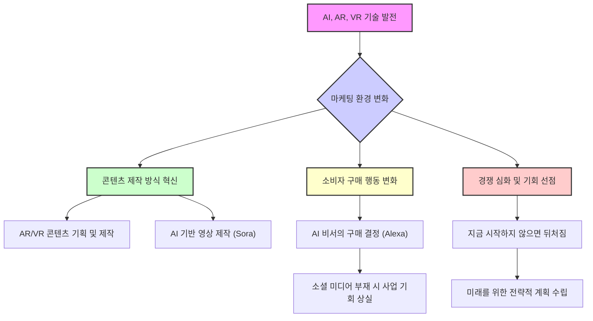

## 1. 책 소개 
이 책은 게리 비(Gary Vee)의 최신작 '데이 트레이딩 어텐션(Day Trading Attention)'이야. 이 책은 빠르게 변하는 소셜 미디어 세상에서 어떻게 사람들의 관심을 사로잡고, 그걸로 브랜드와 매출을 늘릴 수 있는지 알려주는 실용적인 지침서라고 보면 돼. 마치 주식 시장에서 저평가된 주식을 찾아 투자하듯이, 사람들의 관심이 어디로 향하는지 빠르게 파악하고 선점하는 전략을 알려주는 책이야.

## 2. 관심은 마케팅의 핵심 화폐: '데이 트레이딩 어텐션'의 기본 원칙 

게리 비는 지금 시대에 가장 중요한 마케팅 자산은 바로 '관심(Attention)'이라고 말해. 마치 주식 시장에서 저평가된 주식을 찾아 빠르게 사고파는 '데이 트레이딩'처럼, 마케터들도 사람들의 관심이 어디로 향하는지 끊임없이 살피고, 그 관심이 저렴할 때(underpriced) 빠르게 선점해야 한다는 거야.

### 2.1. 관심이 왜 중요한 화폐일까? 
1. **관심은 희소하고 유한하다**: 사람들의 관심은 무한하지 않아. 마치 한정된 자원처럼, 모든 브랜드와 콘텐츠가 이 한정된 관심을 얻기 위해 경쟁하고 있어.
  1. 유튜브의 Mr. Beast 같은 인기 크리에이터들이 사람들의 관심을 많이 가져가면, 다른 브랜드가 얻을 수 있는 관심은 줄어드는 셈이야. 
2. **대부분의 마케터는 관심을 소홀히 다룬다**: 많은 마케터가 관심을 중요하게 생각하지 않고, 그저 콘텐츠를 만들면 사람들이 알아서 봐줄 거라고 착각해.
  1. 이런 태도는 낮은 품질의 콘텐츠를 만들게 하고, 과거의 광고 방식이 지금도 통할 거라고 믿게 만들어. 
  2. 새로운 플랫폼이나 트렌드에 너무 늦게 뛰어들어 기회를 놓치기도 해. 마치 틱톡이 한창 뜰 때 시작하지 않고 이제야 계정을 만드는 것처럼 말이야. 

### 2.2. 관심을 화폐처럼 다루는 방법 
1. **저평가된 관심 기회를 찾아 투자한다**: 새로운 플랫폼, 떠오르는 콘텐츠 형식, 또는 문화적인 이슈처럼 사람들이 관심을 많이 쏟지만 아직 경쟁이 덜한 곳을 찾아야 해.
  1. 클럽하우스(Clubhouse)처럼 새로운 플랫폼에 일찍 뛰어들었다가 실패할 수도 있지만, 그런 시도 없이는 대박을 터뜨릴 기회도 없어. 
2. **빠르게 움직이고, 자주 실험한다**: 새로운 플랫폼이나 콘텐츠 형식이 나타나면 주저하지 말고 빠르게 시도해봐야 해.
  1. 예를 들어, 새로운 소셜 미디어 플랫폼인 '블루 스카이(Blue Sky)'가 나오면 6개월 정도 시험 삼아 콘텐츠를 올려보는 거야. 
3. **광고 예산을 유연하게 재분배한다**: 효과 없는 광고에 돈을 계속 낭비하지 말고, 사람들의 관심이 집중되는 곳(예: 페이스북)으로 예산을 빠르게 옮겨야 해. 
4. **허세 지표(**Vanity Metrics**)보다 **참여도**(Engagement Quality)를 중시한다**: 단순히 조회수나 팔로워 수 같은 겉으로만 좋아 보이는 숫자보다는, 사람들이 콘텐츠에 얼마나 깊이 참여하는지(댓글, 공유, 저장 등)를 중요하게 봐야 해.
  1. 수천 명이 스쳐 지나가는 것보다, 단 한 명의 핵심 고객이 1분 동안 당신의 콘텐츠에 집중하는 것이 훨씬 가치 있다는 뜻이야. 

## 3. 소셜 미디어의 변화: 팔로워 중심에서 관심사 중심으로 

소셜 미디어는 이제 누가 누구를 팔로우하는지보다, 사람들이 무엇에 관심이 있는지를 훨씬 중요하게 여기는 방향으로 바뀌고 있어. 마치 틱톡이 그랬던 것처럼 말이야.

### 3.1. '틱톡화(TikTok-ification)' 현상 
1. **과거의 **소셜 미디어: 예전에는 팔로워 수가 많아야 콘텐츠가 많은 사람에게 노출됐어. 페이스북은 팔로워의 3%에게만 콘텐츠를 보여주고, 더 많은 노출을 원하면 돈을 내라고 했지. 
2. **틱톡의 등장과 변화**: 틱톡은 팔로워가 적어도 사람들의 관심사에 맞는 콘텐츠라면 수백만 명에게 노출될 수 있다는 것을 보여줬어.
  1. 이런 변화를 '틱톡화'라고 부르는데, 이제는 팔로워가 5명밖에 없어도 5백만 명에게 도달할 수 있는 시대가 된 거야. 
3. **팔로워 수는 더 이상 중요하지 않다**: 이제 팔로워 수는 당신의 자존심을 만족시킬지는 몰라도, 실제 마케팅 성과에는 큰 영향을 주지 않아. 

### 3.2. 관심사 중심 플랫폼에 적응하는 방법 
1. **발견 가능성(Discoverability)을 높이는 콘텐츠를 만든다**: 사람들이 무엇을 좋아하고, 무엇을 공유하며, 무엇을 찾아다니는지 고민해서 콘텐츠를 만들어야 해.
  1. 단순히 팔로워가 많으니 아무거나 올려도 된다는 생각은 버려야 해. 
2. **팔로워보다 사람들의 관심사에 집중한다**: 당신의 콘텐츠가 자연스럽게 당신이 원하는 사람들에게 찾아가도록 만들어야 해.
  1. 이를 위해 잠재 고객의 관심사, 두려움, 유머 코드 등을 깊이 이해해야 해. 
  2. 은행이 단순히 예금 금리를 홍보하는 것보다, 사람들이 공감하고 웃을 수 있는 '재미있는 은행원 이야기' 같은 콘텐츠를 만드는 게 훨씬 효과적이라는 뜻이야. 
3. **공유되고 저장되는 콘텐츠를 분석하고 재창조한다**: 어떤 콘텐츠가 사람들에게 많이 공유되고 저장되는지 주의 깊게 살펴보고, 당신의 브랜드와 목소리에 맞춰 비슷한 콘텐츠를 만들어야 해.
  1. 이렇게 하면 알고리즘이 당신의 콘텐츠를 팔로워가 아닌 더 많은 관심사 기반의 사람들에게 노출시켜 줄 거야. 

## 4. 유기적(Organic) 콘텐츠와 유료(Paid) 광고의 새로운 활용법 

이제 유기적 콘텐츠(돈을 들이지 않고 만드는 콘텐츠)는 아이디어를 실험하는 '연구실'이고, 유료 광고(돈을 내고 하는 광고)는 검증된 아이디어를 널리 알리는 '확성기' 역할을 해야 해.

### 4.1. 기존의 잘못된 접근 방식 
1. 유기적** 콘텐츠와 유료 광고를 별개로 취급한다**: 많은 기업이 유기적 콘텐츠와 유료 광고를 서로 다른 섬처럼 생각해서, 유기적 콘텐츠는 무작정 바이럴(입소문)을 기대하고, 유료 광고는 돈만 쓰면 된다고 착각해. 
2. **검증 없이 유료 광고에 큰돈을 쓴다**: 어떤 메시지나 콘텐츠가 효과적인지 미리 테스트하지 않고, 무작정 유료 광고에 많은 돈을 쏟아부어.
  1. 이는 마치 제품을 시장에 내놓기 전에 고객 피드백을 받지 않고 무작정 대량 생산하는 것과 같아. 
3. **유료 광고를 약한 콘텐츠의 '목발'로 사용한다**: 콘텐츠 자체가 별로인데도 돈만 쓰면 잘 될 거라고 믿고 유료 광고를 해.
  1. 하지만 유료 광고는 성공적인 콘텐츠의 효과를 '증폭시키는 도구'이지, 약한 콘텐츠를 살리는 마법 지팡이가 아니야. 

### 4.2. 현대적인 유기적 콘텐츠 및 유료 광고 전략 
1. **고품질 유기적 콘텐츠를 '연구실'처럼 활용한다**: 잠재 고객의 관심사와 통찰력을 바탕으로 고품질의 유기적 콘텐츠를 만들어.
  1. 이 콘텐츠를 통해 사람들의 반응(댓글, 공유, 저장 등)을 면밀히 살피고, 어떤 메시지나 형식이 잘 통하는지 데이터를 수집해. 
2. **가장 잘 통하는 콘텐츠만 '확성기'로 증폭시킨다**: 유기적 콘텐츠로 검증된, 즉 사람들에게 좋은 반응을 얻은 콘텐츠에만 유료 광고 예산을 투입해.
  1. 이렇게 하면 돈을 낭비하지 않고, 이미 성공이 입증된 콘텐츠의 도달 범위와 영향력을 극대화할 수 있어. 
3. **고객이 무엇을 증폭시킬지 결정하게 한다**: 회의실에서 마케터들이 '이 광고가 잘 될 거야'라고 추측하는 대신, 고객의 반응(유기적 콘텐츠에 대한 참여도)을 통해 어떤 콘텐츠에 돈을 쓸지 결정해야 해. 

## 5. 콘텐츠 제작의 핵심 질문: '왜 이 콘텐츠를 만드는가?' 

콘텐츠를 만들 때마다 스스로에게 '나는 왜 이 콘텐츠를 만드는가?'라고 물어봐야 해. 명확한 목적 없이 만드는 콘텐츠는 아무도 보지 않을 거야.

### 5.1. 목적 없는 콘텐츠의 문제점 
1. **내부 일정 맞추기 위해 무작정 올린다**: 많은 마케터가 단순히 '콘텐츠 달력'에 맞춰 기계적으로 콘텐츠를 올려.
  1. 이는 마치 숙제하듯이 콘텐츠를 만드는 것과 같아서, 정작 고객의 관심사나 필요는 전혀 고려하지 않게 돼. 
2. **제품 중심의 홍보만 한다**: 고객에게 유용할지 생각하지 않고, 오로지 제품이나 서비스만 홍보하는 콘텐츠를 만들어.
  1. 예를 들어, 자동차 딜러가 단순히 '우리 차 가격은 얼마입니다'라고 말하는 것보다, '재미있는 자동차 영업사원 이야기'를 만드는 게 훨씬 효과적이야. 
3. **습관적으로 콘텐츠를 만든다**: 아무 생각 없이 습관적으로 콘텐츠를 만들면, 결국 아무도 보지 않는 비효율적인 콘텐츠가 돼. 

### 5.2. 목적 있는 콘텐츠를 만드는 방법 
1. **모든 콘텐츠에 명확한 목적을 부여한다**: 콘텐츠는 다음 네 가지 중 하나 이상의 목적을 가져야 해.
  1. **교육(Educate)**: 사람들에게 유용한 정보를 알려준다.
  2. **오락(Entertain)**: 사람들을 즐겁게 해준다.
  3. **영감(Inspire)**: 사람들에게 동기 부여나 영감을 준다.
  4. **판매 허락(Build Permission to Sell)**: 나중에 제품을 판매할 수 있도록 신뢰와 관계를 쌓는다. 
2. 고객 여정**(Customer Journey)에 맞춰 콘텐츠를 기획한다**: 고객이 브랜드를 인지하고(Awareness), 고려하고(Consideration), 구매하는(Conversion) 각 단계에 맞춰 적절한 목적의 콘텐츠를 만들어야 해. 
3. **'내가 고객이라면 이 콘텐츠에 관심 있을까?' 자문한다**: 콘텐츠를 올리기 전에 항상 이 질문을 던져봐야 해. 만약 스스로도 관심이 없다면, 그 콘텐츠는 올리지 않는 게 좋아. 

## 6. 최고의 콘텐츠 전략: 경청(Listening)과 소통(Conversation) 

마케팅은 단순히 말하는 것이 아니라, 고객의 목소리에 귀 기울이고 소통하는 것이 훨씬 중요해. 댓글과 대화는 당신의 콘텐츠 전략을 위한 '금광'과 같아.

### 6.1. 듣지 않는 마케팅의 문제점 
1. **댓글을 허세 지표로만 본다**: 많은 브랜드가 댓글 수를 단순히 '우리가 인기가 많다'는 증거로만 여기고, 실제로는 댓글 내용을 깊이 분석하지 않아.
  1. 이는 마치 선물을 받고 포장지만 보고 내용물은 버리는 것과 같아. 
2. **불편한 피드백을 무시한다**: 고객의 솔직한 피드백, 특히 비판적인 내용은 듣기 싫어서 무시해버려.
  1. 하지만 이런 불편한 피드백 속에 가장 중요한 개선점이 숨어있을 수 있어. 
3. **가장 큰 기회를 놓친다**: 고객의 목소리를 듣지 않고 마케터가 혼자서 '고객은 이걸 원할 거야'라고 추측하면, 결국 고객이 정말로 원하는 것을 놓치게 돼. 

### 6.2. 경청을 콘텐츠 전략으로 바꾸는 방법 
1. **댓글, DM, 외부 대화를 적극적으로 모니터링한다**: 당신의 콘텐츠뿐만 아니라, 다른 곳에서 고객들이 무엇을 이야기하고, 무엇에 관심을 두는지 끊임없이 살펴봐야 해.
  1. 이는 마치 탐정이 단서를 모으듯이, 고객의 생각과 관심사를 파악하는 과정이야. 
2. **피드백을 미래 콘텐츠로 전환한다**: 고객의 댓글이나 질문에서 얻은 아이디어를 새로운 콘텐츠 주제나 캠페인으로 만들어.
  1. 이렇게 하면 고객들은 '이 브랜드는 정말 우리 이야기를 듣고 있구나'라고 느끼고, 더 깊이 참여하게 될 거야. 
3. **콘텐츠 달력을 실제 대화로 채운다**: 회의실에서 나온 아이디어가 아니라, 고객과의 실제 대화에서 얻은 주제들로 콘텐츠 달력을 채워야 해.
  1. 이는 고객이 정말로 듣고 싶어 하는 이야기를 전달하는 가장 확실한 방법이야. 

## 7. 게리 비의 핵심 조언: 빠르게 움직이고, 끊임없이 변화하라 

소셜 미디어 세상은 너무나 빠르게 변하기 때문에, 당신도 그 변화에 맞춰 끊임없이 움직이고 적응해야 해. 마치 시시각각 변하는 날씨에 맞춰 옷을 갈아입듯이 말이야.

### 7.1. 변화에 둔감하면 뒤처진다 
1. **과거의 성공에 안주하지 마라**: 예전에 TV 광고가 라디오보다 효과적이라고 말했던 사람이나, 웹사이트가 있는데 이메일 마케팅이 왜 필요하냐고 했던 사람들은 결국 변화를 놓쳤어.
  1. 지금 링크드인(LinkedIn)이 구글(Google)만큼 효과적일 수 없다고 말하는 사람들도 미래의 변화를 과소평가하는 거야. 
2. **AI, **AR**, **VR** 같은 미래 기술에 대비하라**: 인공지능(AI), 증강현실(AR), 가상현실(VR) 같은 기술은 모든 산업을 완전히 바꿀 거야.
  1. 애플 비전 프로(Apple Vision Pro) 같은 AR 헤드셋이 아직 초기 단계라고 무시하면 안 돼. 10~20년 후에는 일반 안경처럼 AR 기기를 쓰고 다닐 수도 있어. 
  2. 지금부터 AR/VR 환경에 맞는 영상 콘텐츠를 어떻게 만들지 계획해야 해. 
  3. AI는 이미 광고 산업을 바꾸고 있고, 챗GPT(ChatGPT)나 소라(Sora) 같은 기술은 영상 콘텐츠 제작 방식까지 혁신할 거야. 

### 7.2. 지금 당장 시작하고, 빠르게 움직여라 
1. 소셜** 미디어는 '지금'이 기회다**: 많은 사람들이 소셜 미디어의 기회를 뒤늦게 알아보고 뛰어들고 있어.
  1. 이는 마치 좋은 땅을 사려는 사람이 많아지면 땅값이 오르는 것과 같아. 지금 시작하지 않으면 나중에는 훨씬 어려워질 거야. 
2. **완벽을 기다리지 말고, 일단 시작하라**: 다른 사람의 승인을 기다리거나, 남들이 어떻게 생각할지 걱정하지 말고, 지금 당장 콘텐츠를 만들고 올려야 해. 
3. **'벼락 맞을 일'을 기대하지 마라**: 콘텐츠 몇 개 올린다고 갑자기 대박이 터질 거라고 기대하지 마.
  1. 콘텐츠는 마치 '탄산음료 캔'처럼 소비되는 일회성 제품이야. 꾸준히 많이 만들고, 계속 실험해야 해. 
4. **전략적으로 생각하고, 유연하게 대처하라**: 큰 그림(전략)을 보고 어디로 가야 할지 파악하는 것이 중요해.
  1. 하지만 동시에 작은 변화에도 빠르게 대응할 수 있어야 해. 예를 들어, 영상 아이디어가 별로라고 생각되면 마감 이틀 전이라도 과감히 바꾸는 유연함이 필요해. 

## 8. 소셜 미디어 성공을 위한 실질적인 조언들 

게리 비는 소셜 미디어에서 성공하기 위해 필요한 구체적인 행동 지침들을 제시해. 이 조언들은 단순히 이론이 아니라, 실제 현장에서 통하는 실용적인 방법들이야.

### 8.1. 두려워 말고, 일단 시작하라 
1. **'일단 올려라(Just Post It)'**: 사람들이 무엇을 말할지 걱정하며 망설이지 마.
  1. 오션 스프레이(Ocean Spray)를 마시며 스케이트보드를 타는 영상이 우연히 수백만 조회수를 기록하고 한 사람의 인생을 바꾼 것처럼, 예상치 못한 기회는 일단 시작해야 찾아와. 
  2. 악플이나 비판에 신경 쓰지 마. 당신의 콘텐츠를 싫어하는 사람들은 다른 채널을 찾아갈 거야. 
2. 소셜** 미디어는 '무료' 기회다**: 라디오 광고에 월 5천 달러, TV 광고에 10만 달러 이상을 쓰는 시대에, 소셜 미디어는 완전히 무료로 브랜드를 만들고 사업을 시작할 수 있는 유일한 기회야. 
  1. '섀도우밴(Shadowbanned)'이나 '조회수가 안 나온다'고 불평하지 마. 그건 당신의 콘텐츠가 효과가 없다는 신호이니, 다른 것을 시도해야 해. 
  2. 소셜 미디어는 역사상 전례 없는 '평등한 경쟁의 장'이야. 아무것도 없는 사람도 재능만 있다면 성공할 수 있어. 
3. **남의 시선이나 자존심에 얽매이지 마라**: 가족이나 친구들이 당신의 소셜 미디어 활동을 비웃을까 봐 걱정하지 마.
  1. 당신의 인생을 남들의 시선에 맡길 건지, 아니면 스스로 통제할 건지 결정해야 해. 
  2. '내가 너무 잘난 척하는 것처럼 보일까 봐' 같은 자존심 때문에 좋은 콘텐츠를 만들지 못하는 것도 문제야. 사람들을 돕는 데 집중하면 돼. 
4. **조언은 행동하는 사람에게서만 받아라**: 당신이 하려는 일을 실제로 하고 있지 않은 사람들의 조언이나 비판은 무시해.
  1. 당신을 비판하는 사람들이 정작 자신은 아무것도 하지 않는 경우가 대부분이야. 

### 8.2. 콘텐츠의 질과 전략 
1. **대중문화(**Pop Culture**)를 활용하라**: 가능하면 대중문화를 콘텐츠에 녹여내야 해.
  1. 리눅스(Linux) 관련 영상 썸네일에 유명한 밈(meme)을 사용했더니, 평소보다 훨씬 높은 조회수를 기록한 사례처럼 말이야. 
2. **'질'이 중요하지만, '제작 품질'을 의미하는 건 아니다**: 콘텐츠의 질은 중요하지만, 화려한 영상미나 고가의 장비를 의미하는 게 아니야.
  1. **교육 또는 오락**: 콘텐츠는 사람들에게 유익한 정보를 주거나(교육), 즐거움을 줘야 해(오락). 이 둘을 억지로 섞으려 하지 마. 
  2. **깊이 있는 정보**: 챗GPT(ChatGPT)처럼 뻔한 답변을 주는 2분짜리 영상 대신, 깊이 있는 정보를 제공해서 사람들의 궁금증을 제대로 해결해 줘야 해. 
  3. **화려한 편집은 '가치 부족'의 목발이 아니다**: 화려한 편집, 스톡 영상, 효과음 등은 콘텐츠의 가치가 부족할 때 이를 가리기 위한 수단이 될 수 없어.
  - 사람들은 넷플릭스(Netflix) 같은 고품질 영상을 보러 유튜브에 오는 게 아니야. 오히려 단순하고 깔끔한 편집을 선호하는 경우가 많아. 
3. **'관심사'에 집중하고, '팔로워'에 집착하지 마라**: 사람들의 관심사는 계속 변하기 때문에, 과거에 인기 있었던 콘텐츠나 팔로워 수에 연연하지 마.
  1. 유튜브의 퓨디파이(PewDiePie)처럼 구독자가 1억 명이 넘어도 조회수가 예전 같지 않은 건, 사람들의 관심사가 변했기 때문이야. 
  2. 유튜브는 이제 팔로워가 적은 채널의 영상도 관심사에 맞으면 추천해 줘. 모든 영상은 '각자의 섬'과 같아. 
4. **대기업은 **소셜** 미디어를 '무시'하고 있다**: 많은 대기업이 소셜 미디어의 특성을 이해하지 못하고, 시대에 뒤떨어진 콘텐츠를 만들어.
  1. 기업 임원들이 탁상공론으로 만든, 공감대 없는 영상들은 조회수가 50회도 안 나오는 경우가 많아. 
  2. 이는 개인 크리에이터나 소규모 브랜드에게 엄청난 기회가 돼. 
5. **'고정관념'을 버리고 '**실험**'하라**: '우리 브랜드는 이런 스타일이어야 해' 같은 고정관념에 갇히지 마.
  1. 항상 썸네일, 텍스트, 배경, 주제, 접근 방식 등을 바꿔가며 실험해야 해. 
  2. 만약 영상 100개를 올렸는데도 구독자가 500명 이하라면, 제목, 썸네일, 내용, 전달 방식 중 뭔가 바꿔야 한다는 강력한 신호야. 
6. **댓글에 '가치'를 더하라**: 댓글 섹션에서 단순히 '감사합니다' 같은 형식적인 답변만 하지 마.
  1. 질문에는 성의껏 자세히 답변하고, 대화에 적극적으로 참여해서 가치를 더해야 해. 

### 8.3. 전문성과 효율성 
1. **'**포스트 크리에이티브 전략**(Post-Creative Strategy, PCS)'을 활용하라**: 콘텐츠를 만든 후에는 반드시 댓글을 포함한 모든 피드백을 분석해야 해.
  1. '댓글이 너무 악플 투성이라 보기 싫다'고 피하면 안 돼. 경쟁자들의 90~95%는 댓글을 보지 않으니, 당신에게는 엄청난 경쟁 우위가 될 수 있어. 
  2. 광고를 집행할 때도 마찬가지야. 10개의 광고 중 1개가 잘 되면, 그 광고에 더 많은 예산을 투입해야 해. 
2. **'데이 트레이딩'처럼 빠르게 대응하라**: 장기적인 계획만 세우고 잠자코 기다리지 마.
  1. 주식 시장의 데이 트레이더처럼, 매일매일 시장의 변화를 살피고 빠르게 대응해야 해. 그렇지 않으면 경쟁자에게 기회를 빼앗길 거야. 
3. **기본을 지키고 '전문성'을 보여라**: 링크가 작동하지 않거나, 웹사이트가 죽어있거나, 오디오 품질이 나쁘면 당신의 비즈니스는 신뢰를 잃을 거야.
  1. 특히 영상 콘텐츠에서는 '마이크'가 가장 중요한 장비야. 오디오가 나쁘면 아무도 보지 않아. 
4. **마케팅은 '심리학'이다**: 소셜 미디어 마케팅을 10대 조카에게 맡기지 마.
  1. 마케팅은 인간 심리에 대한 깊은 이해가 필요해. 단순히 광고 설정 방법을 아는 것만으로는 부족해. 
  2. 카피라이팅, 사진, 대중문화, 구매 행동, 습관 형성 등 복합적인 요소를 이해해야 해. 
  3. SMMA(Social Media Marketing Agency)가 유행하지만, 단순히 광고를 돌리는 기술만으로는 성공하기 어려워. 
5. **'**참호전(Trench Warfare)**'처럼 매일매일 참여하라**: 소셜 미디어는 매일매일 현장에서 싸우는 '참호전'과 같아.
  1. 비록 소셜 미디어 팀이 있더라도, 당신 스스로 하루 30분~1시간이라도 댓글에 답하고 커뮤니티에 참여해야 해. 
  2. 소셜 미디어는 책으로만 배울 수 없어. 직접 뛰어들어 경험해야 해. 

### 8.4. 개인적인 연결과 진정성 
1. **개인적인 이야기를 공유하여 깊은 관계를 맺어라**: 당신의 개인적인 이야기를 조금씩 공유하면 청중과 더 깊은 유대감을 형성할 수 있어.
  1. 하지만 너무 과하게 개인적인 문제(가족 싸움, 재정 문제 등)를 털어놓는 것은 좋지 않아. 동정심을 구하는 것처럼 보일 수 있으니, 신중하고 품위 있게 접근해야 해. 
2. **브랜드보다 '사람'에게서 구매한다**: 많은 사람들이 대기업보다 소규모 브랜드나 개인 크리에이터에게서 물건을 사고 싶어 해.
  1. 이는 기업의 이윤만 생각하는 거대 기업 대신, 진정성 있는 사람에게 돈을 쓰고 싶어 하는 심리 때문이야. 

## 9. 미래를 위한 준비: AI와 AR/VR 시대의 마케팅 

미래는 이미 와 있어. 인공지능(AI)과 증강현실(AR), 가상현실(VR) 같은 기술은 마케팅의 판도를 완전히 바꿀 거야. 지금부터 준비하지 않으면 살아남기 어려울 거야.

### 9.1. 기술 변화에 대한 경고 
1. **'구걸하는 자'가 되지 마라**: 앞으로 5~10년 안에 소셜 미디어 경쟁은 훨씬 치열해질 거야.
  1. 미리 준비하지 않으면, 마치 '구걸하는 자'처럼 기회를 선택할 여지 없이 끌려다니게 될 거야. 
2. **AI 비서가 구매를 결정하는 시대**: 미래에는 알렉사(Alexa) 같은 AI 비서가 당신의 취향과 지역 정보를 바탕으로 피자를 주문해 줄 거야.
  1. 만약 당신의 사업체가 소셜 미디어나 웹사이트에 없다면, AI 비서는 당신의 존재조차 알지 못하고, 당신은 엄청난 사업 기회를 잃게 될 거야. 
3. **AI 영상 기술의 폭발적인 발전**: 챗GPT(ChatGPT)나 소라(Sora) 같은 AI 기술은 영상 제작 방식을 상상할 수 없을 정도로 빠르게 발전시키고 있어.
  1. 1년 전과 지금을 비교해도 엄청난데, 1년 후에는 또 얼마나 달라질지 예측하기 어려워. 

### 9.2. 지금 당장 미래를 준비하라 
1. **변화를 외면하지 마라**: 당신이 좋아하든 싫어하든, 미래는 이미 정해진 방향으로 가고 있어.
  1. '나중에 걱정해도 돼'라고 생각하며 머리를 모래 속에 파묻는 것은 어리석은 행동이야. 
2. **'지금'이 마지막 기회다**: '3~5년 후면 문이 닫힐 테니, 4년 정도 기다렸다가 막차를 타야지'라고 생각하면 안 돼.
  1. 지금 당장 뛰어들어 준비해야 해. 더 이상 미룰 시간이 없어. 

## 10. 게리 비의 책에 대한 비평 

게리 비의 책은 전반적으로 훌륭하지만, 오디오북 형식에는 한 가지 아쉬운 점이 있어.

### 10.1. 오디오북의 반복적인 안내 문제 
1. **PDF 자료 안내의 과도한 반복**: 오디오북의 전반부에서는 PDF 자료(QR 코드 스캔)를 참조하라는 안내가 5~6번 정도 나와.
  1. 하지만 5부(콘텐츠 예시)에서는 2분마다 한 번꼴로, 총 50번 정도 반복돼서 매우 거슬려. 
2. **개선 제안**: 다음 책에서는 PDF 자료 안내를 각 챕터 시작 부분에 한 번만 하거나, 5~6번 정도로 줄이는 것이 좋을 거야.
  1. 어차피 PDF를 찾아볼 만큼 똑똑하지 않은 사람이라면, 아무리 반복해도 찾아보지 않을 것이기 때문이야. 

### 10.2. 책의 전반적인 평가 
1. **사업 및 **소셜 미디어** 종사자에게 필수**: 이러한 사소한 단점에도 불구하고, 이 책은 사업을 하거나 소셜 미디어를 활용하는 모든 사람에게 반드시 필요한 책이야. 
2. **소셜 미디어에 대한 깊은 이해**: 게리 비는 대부분의 사람보다 소셜 미디어를 훨씬 더 잘 이해하고 있기 때문에, 그의 통찰력은 매우 가치가 있어. 

