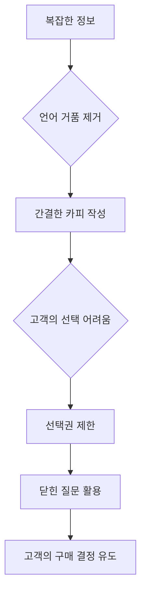
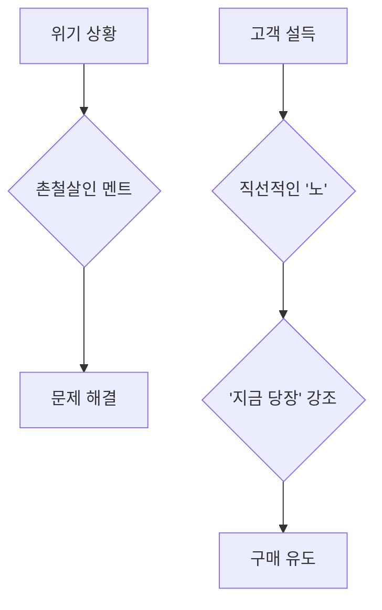

## 한마디면 충분하다: 설득의 기술로 원하는 것을 얻는 법
이 책은 우리가 일상생활에서, 그리고 비즈니스 현장에서 어떻게 말을 해야 상대방을 설득하고 원하는 결과를 얻을 수 있는지 알려주는 책이야. 단순히 말 잘하는 기술이 아니라, 상대방의 마음을 움직이는 언어 전략과 포장 기술을 총망라해서 보여준다고 보면 돼. 

## 1. 모든 것은 모방에서 시작된다: 새로운 것은 없어! 

우리는 늘 새로운 것을 찾고 있다고 생각하지만, 사실 세상에 완전히 새로운 것은 없다고 해. 

1. **모든 것은 모방의 연속**:
  - 3천 년 전 솔로몬 왕조차 "새로운 것이 없다"고 고백했을 정도로, 우리는 계속해서 기존의 것을 조합하고 변형해서 새로운 것처럼 보이게 만드는 거야. 
  - 마치 레고 블록으로 다양한 모양을 만들듯이, 기존의 재료들을 더하고 빼고, 조합하고 재해석해서 새로운 것을 만들어내는 거지. 
  - 한글도 겨우 50개도 안 되는 기본 자음과 모음으로 50만 개 이상의 단어를 만들어내잖아. 
2. **예술도 모방이다**:
  - 파블로 피카소는 "예술은 도둑질이다"라고 말했고, "독창성이란 들키지 않는 표절이다"라는 말도 있어. 
  - 좋은 아이디어나 문구가 있다면 그걸 가져와서 내 것으로 만들고 활용하는 것이 중요해. 
  - 이런 걸 벤치마킹(다른 사람의 좋은 점을 배우고 따라 하는 것)이라고 하는데, 요즘 시대에는 이걸 잘하는 사람이 이득을 본다고 해. 

## 2. 지식은 활용해야 가치가 있다: 머릿속 지식은 쓸모없어! 

아무리 많은 지식을 가지고 있어도 그걸 실제로 써먹지 못하면 아무 소용이 없다고 해.

1. **지식과 이해력의 차이**:
  - 지식이 있는 사람은 단순히 정보나 사실을 알고 있는 사람이야. 
  - 하지만 이해력 있는 사람은 그 지식을 꺼내서 마음껏 쓸 줄 아는 사람이지. 
  - 머릿속에만 있는 지식은 죽은 지식이나 마찬가지야. 그걸 밖으로 끄집어내서 활용해야만 살아있는 지식이 되는 거야. 
2. **실행의 중요성**:
  - 책을 읽고 "아, 이거 괜찮네" 하고 느끼는 순간은 많지만, 책을 덮는 순간 빠르게 잊어버리게 돼. 
  - 정말 괜찮다고 생각하는 부분은 직접 실행해보고, 실천해보고, 내 것으로 만들어서 써먹어야 해. 
  - 그래야만 책을 읽는 진짜 효과를 볼 수 있다고 저자는 강조해. 

## 3. '어떻게'보다 '왜'에 집중하라: 말의 내용이 중요해! 

사람을 설득할 때 말의 표현(어떻게 말하는지)보다 내용(무엇을 말하는지)이 훨씬 중요하다고 해.

1. **메리디안 차트의 함정**:
  - 예전에는 사람의 이미지가 시각 55%, 청각 38%, 언어 7%로 구성된다는 메리디안 차트(사람이 상대방으로부터 받는 이미지를 시각, 청각, 언어 등 비언어적인 요소와 언어적인 요소로 나눈 법칙)가 있었어. 
  - 이 때문에 많은 사람이 내용보다 표현이 중요하다고 생각했지. 
  - 하지만 저자는 이런 이론이 실제 비즈니스 현장에서는 맞지 않는다고 강하게 반대해. 
2. **내용이 핵심이다**:
  - 제스처나 표정 같은 비언어적인 요소가 중요하지만, 전화 통화처럼 이런 걸 쓸 수 없는 상황도 많잖아. 
  - 이럴 때는 목소리의 높낮이, 억양, 강조 등으로 감정을 전달해야 해. 
  - 말 한마디 한마디에 영혼을 실어서 이야기하면, 그 마음이 상대방에게 전달되고 마음을 움직일 수 있다고 해. 
  - 결국, 어떤 표정이나 옷차림으로 말하느냐보다, 어떤 내용을 어떤 카피(광고 문구)로 말하느냐가 훨씬 중요하다는 거야. 

## 4. 노른자만 남기고 다 버려라: 간결함이 힘이다! 

고객을 설득할 때는 길게 설명하는 것보다 핵심만 간결하게 전달하는 것이 훨씬 효과적이라고 해.

1. 언어 거품** 제거**:
  - 지금은 정보가 너무 많아서 고객들이 소화불량 상태야. 
  - 길게 늘어놓으면 아무도 듣지 않고, 들을 시간도 없어. 
  - 메시지는 최대한 간략하게 줄여야 하는데, 이게 생각보다 정말 어려운 일이야. 
  - 뮤지컬이 소설 수십 쪽 내용을 노래 한 곡으로 압축하고, 광고인이 어려운 제품 설명을 한 문장으로 표현하는 것처럼, 압축은 얼마든지 가능해. 
2. 한 방에 꽂히는 카피:
  - 마치 금을 채취할 때 무가치한 돌들을 골라내듯이, 말에서도 찌꺼기를 제거하고 알맹이만 사용해야 해. 
  - 길고 복잡한 문장, 주어와 동사가 불분명한 문장, 한 번 더 생각하게 만드는 말은 피해야 해. 
  - 예를 들어, '적지 않다' 대신 '많다', '짧지 않다' 대신 '길다'처럼 직접적이고 간결하게 표현하는 것이 좋아. 
  - 영업 현장에서는 말이 곧바로 귀에 꽂히는 것이 진리야. 
3. **선택과 집중**:
  - 상품의 특징이 많다고 해서 그걸 일일이 나열하는 것은 최악이야. 
  - 마치 생선 가게에서 모든 생선을 다 좋다고 늘어놓으면 고객이 그냥 지나가버리듯이, 고객을 다 놓치게 돼. 
  - 과감히 생략하고 딱 한 가지 장점만 찍어서 강하게 어필해야 해. 
  - "오늘 삼치는 진짜 끝내줍니다!"처럼 말이야. 
4. 일침 기술:
  - 급소는 작을수록 아프듯이, 말도 한 방이 아파. 
  - 가능한 한 짧고 간단하게, 한 방으로 끝내야 해. 
  - 옛날 약장수들이 "애들은 가라", "날이면 날마다 오는 것이 아닙니다", "일단 잡사 봐"라고 했던 멘트처럼, 핵심을 찌르는 말이 중요해. 
  - 이 멘트들은 돈 없는 사람을 걸러내고(애들은 가라), 지금 당장 구매해야 함을 강조하며(날이면 날마다 오는 것이 아닙니다), 일단 사용해보라고 권유하는(일단 잡사 봐) 뛰어난 세일즈 전략이야. 

## 5. 고객에게 한 박자 쉴 여지를 주지 마라: 지금 당장! 

고객에게 구매를 망설일 시간을 주면 안 된다고 해.

1. **미루지 않게 하는 단언**:
  - 고객이 "다음에 살게요", "생각해보고 연락할게요"라고 말하는 건 사실상 거절이나 마찬가지야. 
  - 이런 여지를 주는 순간 고객은 구매하지 않아도 된다고 생각하게 돼. 
  - 단언(단호하게 말하는 것) 기술은 이런 미루는 것을 원천 봉쇄하고, 지금 당장 결정하게 만드는 거야. 
  - 단언이 실현되지 않을까 걱정하기보다, 고객을 놓치는 것보다 단언하는 것이 낫다고 해. 
2. **직선적인 소통**:
  - 길을 갈 때 직선으로 가는 것이 가장 빠르고 정확하듯이, 말할 때도 빙빙 돌리지 말고 직선으로 말해야 해. 
  - 영업 현장에서는 한 번 더 생각하게 만드는 말은 통하지 않아. 
  - 보이는 대로, 들리는 대로, 느끼는 대로 곧장 전달해야 임팩트(강한 인상) 있게 들려. 
3. **'지금 당장'의 힘**:
  - 사람들은 지금 당장 필요하다고 느껴야 움직여. 
  - 배고프면 식당을 찾고, 아프면 병원에 가는 것처럼 말이야. 
  - 고객이 겪고 있는 상황을 정확히 건드려서 빨리 움직이게 해야 해. 
  - "지금 여유가 없어요"라고 거절하면, 즉각 "지금 당장!"을 외쳐야 해. 
  - 마케팅은 원래 천박하다고 할 정도로, 돈을 벌기 위해서는 어쩔 수 없이 '지금'을 강조해야 한다고 해. 
  - 고객은 다음 날까지 당신을 기억해주지 않기 때문에, 우리의 메시지에도 다음 시간은 없다고 생각해야 해. 

## 6. 쉽게 말하고, 가치를 뽑아내라: 고객의 눈높이에 맞춰! 

고객이 알아들을 수 있는 쉬운 말로 설명하고, 상품의 숨겨진 가치를 찾아내서 어필하는 것이 중요해.

1. **초등학생도 알아듣게**:
  - 고객은 어려우면 눈길도 주지 않아. 
  - "와, 피가 미인이시네요" 같은 어려운 칭찬보다 "와, 딱이네요!"처럼 짧고 임팩트(강한 인상) 있는 말이 더 효과적이야. 
  - 초등학교 3학년도 알아들을 수 있는 아주 쉬운 말로 설명해야 해. 
  - 보험 상품처럼 판매자는 쉽다고 생각해도 소비자는 이해하기 어려운 경우가 많아. 
  - 판매자는 자신의 수준에서 판단하지 말고, 늘 최대한 쉽게 접근하려는 노력을 해야 해. 
2. **상품에 대한 몰입과 애정**:
  - 내가 먼저 그 상품을 좋아하고 감동받아야 남을 감동시킬 수 있어. 
  - 나태주 시인의 "자세히 보아야 예쁘다. 오래 보아야 사랑스럽다."라는 시처럼, 하찮은 풀꽃도 오래 보면 예쁜 구석이 드러나듯이, 상품도 급히 보면 모르고 천천히 오래 봐야 가치가 보여. 
  - 오랫동안 관찰하고, 곱씹고, 대입해보고, 용도를 전환하고, 편집하고, 빼고 더하고, 조합하는 노력을 해야 가치가 계속 쏟아져 나와. 
  - 마치 폐가전에서도 금을 뽑아내듯이, 무가치해 보이는 대상에도 가치는 반드시 존재해. 
  - 마케팅 포인트가 없다는 것은 제품에 매력이 없는 것이 아니라, 생각하기를 멈춘 것이라고 저자는 말해. 
3. 히스토리 기술:
  - 상품의 겉모습이 별로라도 대단하고 멋진 스토리를 밝혀주면 다시 보이게 돼. 
  - 상품의 숨은 비밀, 매력, 정성 등을 찾아내서 소비자에게 어필하는 것이 히스토리(역사, 배경) 기술이야. 
  - 오리온 초코파이가 5년간 숙성시킨 다음 출고되고, 해태 맛동산이 반죽을 20년 동안 숙성시킨다는 이야기는 상품에 대한 인식을 바꾸는 좋은 예시야. 
  - 단순히 상품을 파는 것이 아니라, 오리온 초코파이는 '정'을 팔고, 바카스는 '에너지'를 팔고, 할리데이비슨은 '자유'를 파는 것처럼 의미를 부여하는 것이 중요해. 
  - 무균무때 세정제가 개발에 17년이 걸렸다는 홍보, 오뚜기 진짬뽕이 전국 짬뽕 맛집 80곳을 가보고 개발했다는 스토리, CJ 맛밤이 설탕을 전혀 넣지 않은 자연의 밤 그대로라는 스토리는 모두 히스토리 기술의 좋은 예시들이야. 
  - 어떤 식당에서 "18가지 한약재로 만든 특제 쌈장이에요"라고 말하면 평소 같으면 쳐다보지도 않았을 쌈장을 남김없이 먹게 되는 것처럼, 스토리는 고객의 마음을 움직여. 

## 7. 착한 마케팅은 없다: 스스로 알려야 한다! 

불황의 시대에는 가만히 있으면 아무도 알아주지 않아. 스스로 적극적으로 알려야 한다고 해.

1. **춘향이의 전략**:
  - 세상에 겸손하고 착한 마케팅은 존재하지 않아. 
  - 춘향이가 집에 틀어박혀 있지 않고, 일부러 눈에 띄는 야외에서 속옷을 나풀거리며 그네를 타 이몽룡의 눈에 띄었던 것처럼, 스스로 어필해야 알아줘. 
  - 이처럼 상품을 파는 것뿐만 아니라, 나 자신을 알리는 것도 마케팅이라고 볼 수 있어. 

## 8. 꿀팁으로 영혼까지 사로잡아라: 유용한 정보 제공! 

고객이 모르는 솔깃한 정보를 제공해서 지적 호기심을 자극하고 마음을 열게 해야 해.

1. **양질의 정보 제공**:
  - 오염된 저질 정보가 넘쳐나는 시대에 양질의 좋은 정보를 제공하면 고객의 지적 호기심이 생기고 경청의 의지도 커져. 
  - 고객이 "어, 그래, 난 몰랐네"라고 반응할 만한 탐스러운 정보를 비축해서 던져주는 것이 꿀팁 기술이야. 
  - 이런 꿀팁을 주면 고객은 당신을 단순히 세일즈맨이 아니라 정보 제공자로 보고 고마워하게 돼. 
  - 정보를 주는 행동은 사행성(운에 맡기는 것)을 배제한 듯한 느낌을 주기 때문에 고객은 비교적 쉽게 마음을 열어. 
2. **정보 제공의 예시**:
  - 마트에서 콩나물이나 무를 고르는 꿀팁을 알려주거나, 수박이 맛있는지 골라주는 것처럼 말이야. 
  - 보험 상품을 소개할 때 만기환급형 보험(나중에 돈을 돌려주는 보험)보다 순수보장형 보험(보험료가 저렴하고 보장에만 집중하는 보험)이 더 좋다는 정보를 주는 것도 꿀팁이 될 수 있어. 
  - 무는 핀 부분보다 초록색이 더 많은 것을 고르는 것이 달콤하고 쓰임새가 많다는 정보는 고객에게 유용하게 다가갈 수 있어. 
  - 무항생제 마크가 붙은 고기가 항생제를 전혀 쓰지 않은 것이 아니라 휴약 기간(항생제를 쓰지 않는 기간)이 일반 축산물보다 두 배 길다는 정보, 프리미엄 우유가 원유 100%가 아니라 첨가물이 들어간 강화 우유라는 정보, 무설탕 제품에 설탕 대신 합성감미료가 들어간다는 정보 등은 고객이 몰랐던 사실을 일깨워주는 꿀팁이 될 수 있어. 
  - 과일 바코드 스티커의 숫자로 재배 방법을 알 수 있다는 정보(4자리 숫자가 3이나 4로 시작하면 농약으로 키운 과일, 5자리 숫자가 8로 시작하면 유전자 변형 과일, 9로 시작하면 유기농 과일)도 고객에게 매우 유용한 꿀팁이야. 
  - 샴푸나 화장품의 '천연', '친환경' 광고 문구가 법적 규제 없이 사용될 수 있으며, '유기농 화장품'만이 엄격한 기준을 따른다는 정보도 고객에게 중요한 꿀팁이 될 수 있어. 
3. 넘버링** 기술**:
  - 말이 3가지 이상이면 듣는 사람이 어지러워해. 
  - 듣는 사람이 쉽게 이해하도록 돕는 가장 좋은 방법은 넘버링(숫자를 매기는 것)이야. 
  - 첫째, 둘째, 셋째처럼 숫자를 매겨가며 정리해서 말해주면 훨씬 효과적이야. 

## 9. 불편함을 인식시키고 대안을 제시하라: 자각 기술! 

고객이 현재 삶에 문제가 있음을 깨닫게 하고, 그 문제의 해결책이 내 상품임을 어필해야 해.

1. **문제점 부각**:
  - 마케팅의 핵심은 실제로는 필요치 않은 것도 필요하다고 믿게 만드는 데 있어. 
  - 이를 위해 현재 고객의 삶에 문제가 있음을 강조하고, 내 상품이 그 문제의 해결책임을 어필해야 해. 
  - "당신의 삶에 이러저러한 문제가 있는데 모르셨나요? 이 상품이 그 문제를 해결해 줍니다."처럼 문제점을 찾아내서 부각시키기만 하면 돼. 
  - 고객의 입장에서 "왜 바쁜 내가 지금 당신의 이야기를 듣고 있어야 해?"라는 질문에 명확히 답할 수 있어야 해. 
  - 고객의 문제를 깊이 살피고 밖으로 끄집어내 보여줌으로써, 그들이 자신의 문제를 돌아보게 해야 해. 
2. **한의원의 침술처럼**:
  - 자각 기술은 한의원에서 몸에 침을 놓아 증상을 치료하는 것과 유사해. 
  - 침을 놓으면 따끔하지만 그 과정을 거쳐야 혈이 풀리듯이, 고객에게 끊임없이 삶의 문제라는 침을 놓아야 해. 
  - 문제를 찌르면 내 상품이 대안이 될 수 있다는 것을 깨닫게 되는 거지. 
  - 내 상품을 제시하기 전에, 그것을 쓰지 않았을 때 불편한 상황을 크게 강조한 뒤, 내 상품을 제시하면 그 편리함과 가치를 더 크게 느낄 거야. 
  - 이러한 대조 효과(비교해서 차이를 느끼게 하는 것)를 통해 고객이 스스로 수긍하고 자발적으로 구매 의지를 불태우게 해야 해. 

## 10. 고객 스스로 결론을 내리게 하라: 연상 기술! 

고객이 스스로 구매 결론을 내리도록 유도하는 것이 중요해.

1. **미래를 그리게 하라**:
  - 소비자는 물건을 사기 전까지는 희망을 바라보고, 사고 나서야 현실을 바라보는 경향이 있어. 
  - 우리는 고객이 원하는 믿음을 쫓게 해야 해. 
  - 고객은 구매와 관련해 멋진 미래를 생각하지 못하는 경우가 많아. 
  - 우리는 연상 작용(어떤 것을 떠올리면 다른 것이 함께 떠오르는 것)을 통해 그들의 머릿속에 미래에 벌어질 그림을 체계적으로 그려줘야 해. 
  - 마치 계단을 밟고 올라가듯이, 한 계단씩 미래를 그려주는 거야. 
2. **스스로 결론 내리기**:
  - 모든 것을 다 설명하려 하지 말고, 최소한 결론만큼은 고객 스스로 내리게 해야 해. 
  - 충분히 연상하게 한 뒤 동의를 구하면 간단해. 
  - 상대가 "그럴 수도 있겠네"라고 하거나 고개만 끄덕여도 8부 능선은 넘은 셈이야. 
  - 이런 연상 기법은 고객이 나의 상품을 사용함으로써 얻게 될 미래의 모습을 상상하게 하고, 스스로 선택하게 만드는 고도의 기술이야. 

## 11. 언어 자폭을 피하고 자신감을 보여라: 말실수 조심! 

자신을 깎아내리는 말이나 불필요한 변명은 오히려 상대방에게 불안감을 주고 신뢰를 떨어뜨린다고 해.

1. **겸손은 독이다**:
  - "제가 부족하지만", "제가 경험이 없습니다" 같은 말은 겸손이 아니라 상대방에게 불안감을 주는 언어 자폭이야. 
  - 마치 라식 수술을 처음 시도하는 의사가 환자에게 "제가 아직 경험이 없고 당신이 처음이라서 자신할 수는 없지만"이라고 말하는 것과 같아. 
  - 이런 말은 안경을 벗는 기쁨보다 심봉사가 될지도 모른다는 두려움을 더하게 돼. 
  - 면접에서 "제가 지금 많이 긴장해서요"라고 말하거나, 메이크업이 이상하게 되었다고 변명하는 것도 언어 자폭에 해당해. 
  - 피부과 의사회에서 "피부과 약이 독하다는 것은 그릇된 편견입니다"라고 홍보하는 것도, 오히려 사람들이 약이 독하다고 생각하게 만드는 언어 자폭의 예시야. 
  - 요즘 세상에는 "제가 부족합니다", "제가 경험이 없습니다" 같은 말은 전혀 할 필요가 없어. 
2. **칭찬도 조심해야 해**:
  - 칭찬인 줄 알았는데 오히려 상대방의 기분을 나쁘게 만드는 언어 자폭도 있어. 
  - 예를 들어, "피부 하나는 끝내준다, 역시 하늘은 공평해"라고 말하면 "피부 빼고 다 안 좋다는 거야?"라고 생각하게 돼. 
  - "너 그 스타일 되게 좋아하나 봐, 또 맨날 그런 거만 입고 다니지"라고 말하면 옷이 별로라는 뜻으로 들릴 수 있어. 
  - "소장님은 진짜 돈 안 쓰시는 편인데 오늘 밥 사줘서 정말 고맙습니다"라고 말하면 짠돌이라는 인상을 줄 수 있어. 
  - "와, 사진 예쁘게 나왔다, 너 같지 않아"라고 말하면 못생겼다는 소리로 들릴 수 있지. 
3. **조건 달기도 금지**:
  - "기분 나쁘게 들릴지도 모르겠지만", "잔소리라고 생각하지 말고 들어", "어려운 부탁 하나 해도 될까요?" 같은 조건 달기도 언어 자폭이야. 
  - 이런 말은 이미 상대방의 기분을 나쁘게 만들거나 부담을 주게 돼. 
  - 학부모가 선생님에게 "우리 아이는 회심(회색 심장, 소심하다는 뜻)이 되게 많아요"라고 말하는 대신 "새로운 것에 별로 참 좋아요"라고 긍정적으로 표현해야 해. 

## 12. 이미지 선언과 슬로건: 각인시키는 힘! 

특정 이미지를 선언하거나 강력한 슬로건을 내세우면 사람들의 인식을 바꾸고 각인시킬 수 있어.

1. 이미지 선언:
  - 이미지 선언은 먼저 특정 이미지를 선언하면, 실제 상태나 본 모습과 상관없이 사람들이 선언한 그대로 믿는 심리를 이용하는 거야. 
  - 마치 '들국화'나 '참나무'처럼 실제로는 존재하지 않는 종이지만, 사람들이 특정 이미지를 떠올리듯이 말이야. 
  - 교보생명이 "인생의 비바람을 닦아주는 생명보험은 손수건입니다"라고 정의를 내려버리면, 사람들은 그렇게 믿게 돼. 
  - "저는 까칠해서 화를 잘 내요"라고 선언하면 사람들이 말조심하게 되는 것과 같아. 
  - 캐논 카메라가 "인물 사진에 강하다"고 선언한 것도 이미지 선언의 대표적인 예시야. 
  - 실제로 캐논으로 찍은 사진과 다른 카메라로 찍은 사진을 구분하기 어렵지만, 캐논이 그렇게 선언했기 때문에 사람들은 캐논이 인물 사진에 강하다고 각인하게 돼. 
  - 이미지 선언을 할 때는 "한마디로 말하자면", "한 줄로 요약하자면" 같은 표현을 사용해서 집중도를 높일 수 있어. 
  - 예를 들어, 티셔츠를 설명할 때 "한마디로 말씀드리면 자연을 입는 겁니다"라고 말하며 옥수수로 만들었다는 점을 강조하는 거지. 
  - 남성 수트의 장점을 "한마디로 말씀드릴게요, 광택감입니다"라고 정의하고, 실내 조명 아래에서 더 돋보인다고 설명하는 것도 좋은 방법이야. 
  - 간 건강식품을 "한마디로 말씀드리면 우리 몸의 필터입니다"라고 설명하며, 간이 독소와 노폐물을 걸러주는 역할을 강조하는 것도 효과적이야. 
2. **슬로건의 힘**:
  - 슬로건(기업이나 단체의 목표를 간결하게 표현한 문구)은 원래 전쟁 때 대중을 선동하고 사람을 동요하기 위해 사용됐어. 
  - 지금은 마케팅 전쟁에서 소비자를 모으기 위해 많이 이용되지. 
  - 대학로 연극이 "TV보다 더 생생한 개그, 눈앞에서 웃겨 드립니다!"라는 슬로건으로 관객을 유치하고, 신세계 푸드 '올반'이 "올바르게 만들어, 반듯하게 차린다"는 슬로건을 내세우는 것처럼 말이야. 
  - 유한킴벌리의 "우리강산 푸르게 푸르게"나 스텝2 '링고 의자'의 "생각이 자라는 의자" 같은 슬로건은 브랜드 이미지를 높이고 고객의 인식을 바꾸는 데 큰 역할을 해. 

## 13. 간결한 카피와 질문 기술: 고객의 선택을 돕는 법! 

광고 카피를 쓸 때는 최대한 간결하게 줄이고, 고객이 쉽게 선택할 수 있도록 질문하는 기술이 중요해.

1. **광고 **카피** 소거법**:
  - 신문 전면 광고나 홈쇼핑 자막 카피를 쓸 때는 마침표를 안 쓰는 것이 좋아. 
  - 문법적으로는 마침표가 있어야 하지만, 가독성(읽기 쉬운 정도)이 더 중요하기 때문이야. 
  - 조사(은, 는, 이, 가 등)도 빼서 줄여야 한눈에 들어와. 
  - 예를 들어, "하루 금씩 빠져본 경험이 있다면 집에서 혼자 하는 두피 케어만으로는 탈모 진행을 막을 수 없습니다"라는 긴 문장을 "탈모 전쟁 혼자서 약국이 동맥"처럼 짧고 임팩트 있게 줄이는 거야. 
  - 아인슈타인도 "단순하게 설명하지 못하면 충분히 이해하지 못한 것이다"라고 말했듯이, 간결함은 이해의 핵심이야. 
2. **'골라 드릴까요?' 기술**:
  - 고객은 선택 장애가 있기 때문에 혼자 선택하기 어려워해. 
  - 스위스 식품점에서 24종의 잼을 진열했을 때보다 6종의 잼을 진열했을 때 매출이 더 높았던 것처럼, 선택권을 많이 제공할수록 고객은 더 고민하고 혼란스러워해. 
  - 정육점 주인이 손님에게 "골라보세요" 대신 "골라 드릴까요?"라고 말하는 것처럼, 전문가가 나서서 선택을 도와줘야 해. 
3. 닫힌 질문** 활용**:
  - 질문은 크게 개방형 질문(자유롭게 답하는 질문)과 닫힌 질문(뚜렷한 답이 있는 질문)으로 나눌 수 있어. 
  - "나 어때 보여요?", "이 집은 뭐가 제일 맛있어요?" 같은 개방형 질문은 세일즈에서는 취약해. 
  - 반면, "같은 값이면 작은 거 할래요, 큰 거 할래요?"처럼 A 아니면 B 둘 중 하나를 선택하게 하는 닫힌 질문이 효과적이야. 
  - 보험 설계사가 고객에게 "언제 시간 괜찮으세요?"라고 묻는 대신 "이번 주 목요일이 편하세요, 금요일이 편하세요?"처럼 구체적인 선택지를 주는 것이 좋아. 
  - 교육 상품을 팔 때도 "씨앗이 중요할까요, 토양이 중요할까요?"처럼 질문을 던져 고객의 생각을 유도하고, 반전을 통해 메시지를 각인시키는 방법을 사용할 수 있어. 
  - 이때, 씨앗의 놀라운 가능성을 강조한 뒤, 아무리 좋은 씨앗도 비옥한 토양이 없으면 싹조차 나지 않는다는 점을 들어 토양의 중요성을 강조하고, 아이들에게 좋은 교육 환경을 조성해주는 것이 부모의 몫임을 어필하는 거지. 
4. **통계 활용**:
  - 보험 지점장이 설계사 지원자에게 "이 업을 해서 얼마를 벌고 싶습니까?"라고 물은 뒤, 원하는 액수를 입력하면 전 세계 임금 근로자 중 몇 퍼센트에 해당하는지 알려주는 사이트를 활용하는 것도 좋은 방법이야. 
  - 억대를 입력하면 상위 0.09%로 나온다는 사실에 지원자들이 놀라게 되고, 그만큼 열심히 활동해야 한다는 동기를 부여할 수 있어. 
  - "아름다운 것은 비쌉니다"라고 말하거나, 아이 교육보다 더 급하고 중요한 것이 있냐고 물으며 지갑을 열게 하는 것도 효과적인 방법이야. 

## 14. 위기 탈출과 설득의 기술: '노'라고 말할 때와 '지금 당장'의 중요성! 

위기 상황에서는 촌철살인(짧은 말로 핵심을 찌르는 것) 멘트로 상황을 모면하고, 고객을 설득할 때는 '노'라고 말해야 할 때 단호하게 말하며, '지금 당장'의 중요성을 강조해야 해.

1. **위기 탈출 멘트**:
  - 술자리에서 잔을 돌리는 것이 싫을 때 "저는 A형 간염 환자입니다"라고 말하며 잔을 패스하게 하는 것처럼, 위기 상황에서 한마디로 상황을 모면할 수 있어. 
  - 안전띠 미착용으로 경찰에게 걸렸을 때 "제가 가슴 수술을 해서 안전벨트를 맬 수 없거든요"라고 말해 위기를 넘긴 사례도 있어. 
  - 부모님이 지어준 이름이 마음에 안 들 때 "그 이름은 아내를 만나기 전에 사귀다가 안 좋게 헤어진 첫사랑 이름이거든요"라고 말해 이름을 바꾸게 하는 것도 촌철살인 멘트의 예시야. 
2. **'노'라고 말해야 할 때**:
  - 윌리엄 반스 커뮤니케이션 센터에서는 '노'라고 말해야 하는 상황에서도 부정하지 않는 편이 협상을 잘하는 것이라고 가르치기도 해. 
  - 하지만 진짜 협상에서는 안 된다고 할 때 단호하게 '노'라고 말해줘야 해. 
  - 썬팅이 불법 아니냐는 질문에 "걱정 마세요, 썬팅이 짙다고 단속 받은 사례가 있으면 제가 가게를 접겠습니다"처럼 강력하게 말하면 상대방이 꼬리를 내릴 거야. 
  - 이불이 비싸다고 투덜댈 때 "첨단 침구는 제2의 피부입니다. 아무리 살아가는 사람도 인생의 3분의 1을 침구에서 지내지 않아요. 비싼 거 아닙니다"라고 말하는 것도 효과적이야. 
3. **동사를 맨 앞에 놓아라**:
  - 우리가 말할 때 명사형으로 말하는 경우가 많은데, 동사를 맨 앞에 놓으면 더 빠르고 강력하게 전달돼. 
  - "아들 밥 먹어라"보다 "밥 먹어, 아들"이 더 강력하고, "여러분은 저를 보시기 바랍니다"보다 "보세요, 저를"이 더 임팩트 있어. 
  - 에너지 절약 표어처럼 "걸어요, 짧은 거리 함께 타요, 대중교통"처럼 동사를 앞에 놓는 것이 효과적이야. 
4. **'**지금 당장**'의 중요성**:
  - 우리 인생에 과연 여유가 생길 때가 있을까? 
  - 미래를 위해 일부는 저축해야 하지만, 지금 당장 시작하는 것이 중요해. 
  - 고속도로에서 기름을 넣지 않고 가다가 차가 멈춰 낭패를 당하거나, 빨래를 미루다가 비가 와서 낭패를 겪는 것처럼, 미루면 안 돼. 
  - 경제력이 꺾이는 미래에 우왕좌왕하기보다 지금 작은 것부터 시작해야 해. 
  - "소나기는 가뭄 해결에 도움이 되지 않습니다. 지금부터 비를 촉촉히 적셔줘야 합니다"처럼 미리미리 준비해야 함을 강조하는 멘트도 좋아. 
  - 박태환 선수와 수영 시합을 할 때 이길 수 있는 유일한 방법은 '먼저 출발하는 것'이라고 말하며, 먼저 시작하는 것의 중요성을 강조할 수 있어. 
  - 행복을 저축할 수 없다는 점을 강조하며, "다리 떨릴 때가 아니고요, 가슴 떨릴 지금 가야 됩니다"라고 말하며 여행 상품을 판매하는 것도 효과적인 방법이야. 
  - 고객을 설득할 때는 먼 미래보다 지금 당장 그 상품이 필요한 이유를 깨닫게 하고 자극해야 해. 
  - 고객은 다음 날까지 당신을 기억해주지 않기 때문에, 바로 지금, 다음은 없다는 것을 강조해야 해. 

## 15. 지식의 저주를 피하고 실용적 지능을 활용하라: 쉽게 설명하는 능력! 

전문가들이 자신의 지식에 갇혀 일반인들이 이해하기 어렵게 설명하는 '지식의 저주'를 피하고, 실용적인 지능을 활용해야 해.

1. **지식의 저주**:
  - 커먼 크래프트사의 밀의 피버라가 말한 '지식의 저주'는 전문가들이 자신의 지식에 대해 오히려 저주를 받는 현상을 말해. 
  - 삼성전자나 증권사 펀드 매니저들이 상품 교육이나 PT(프레젠테이션)를 할 때 너무 전문 용어를 많이 쓰고 텍스트 위주로 설명해서 일반인들이 알아듣기 어려운 경우가 많아. 
  - 이것은 전문가들이 자신은 쉽다고 생각하지만, 판매자와 소비자 사이에 지식 격차가 존재하기 때문이야. 
  - 아무리 좋은 지식이라도 제대로 사용하지 않으면 가치가 없어. 
  - 자동차 작동 원리를 다 안다고 해서 훌륭한 운전자가 되는 것이 아니듯이, 지식은 사용할 줄 알아야 진정한 가치를 발휘해. 
  - 직원을 뽑을 때도 IQ(지능 지수) 숫자가 높은 사람보다 실용적 지능(실생활에서 문제를 해결하는 능력)이 높은 사람을 뽑아야 해. 
2. **상품의 가치를 전달하는 법**:
  - 카메라의 가치를 설명할 때 "사람의 인생은 사진으로 시작해서 사진으로 끝난다"고 말하며, 초음파 사진부터 영정사진까지 인생의 모든 순간을 기록하는 것이 사진임을 강조할 수 있어. 
  - 오메가3를 판매할 때는 혈액 검사나 혈액 측정의 중요성을 언급하며, 건강의 기본은 '혈행'(피의 흐름)임을 강조하고 미리 관리해야 한다고 설득할 수 있어. 
  - 향수를 판매할 때는 마릴린 먼로가 "나는 향수를 입고 잔다"고 말했듯이, 향수는 뿌리는 것이 아니라 입는 것이며, 하나의 패션이자 가치를 담는 것이라고 설명할 수 있어. 
  - 커피 한 잔의 가치를 설명할 때는 원두를 키우고 커피 한 잔을 만드는 데 물이 1000잔 이상 필요하다는 사실을 언급하며, 커피가 얼마나 귀한 것인지 강조할 수 있어. 
3. **가치를 뽑아내는 **포모도로 기법:
  - 상품의 가치를 뽑아낼 때 '포모도로 기법'(시간을 정해놓고 집중해서 아이디어를 내는 방법)을 활용할 수 있어. 
  - 10분이나 30분처럼 시간을 정해놓고 알람을 맞춰놓은 뒤, 브레인스토밍(자유롭게 아이디어를 내는 것)처럼 무슨 말이든 막 쓰는 거야. 
  - 여러 가지 아이디어를 뽑아내고, 더 이상 나올 것이 없을 때까지 계속 시도하면 많은 아이디어가 나올 수 있어. 
  - 병뚜껑 하나만 하더라도 20년간 특허청에 150건의 특허가 등록될 정도로 많은 아이디어를 짜낼 수 있다고 해. 

