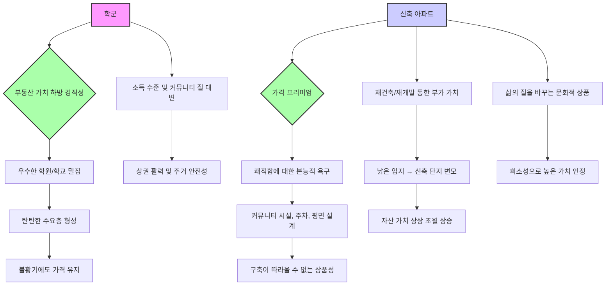

## 3040 부린이 처음 부동산 투자: 내 집 마련, 두려워 말고 시작해!
이 책은 부동산 초보자, 특히 30대와 40대 '부린이(부동산 어린이)'들을 위해 쓰여진 현실적인 부동산 투자 지침서야. 단순히 돈을 버는 투자를 넘어, 인플레이션으로부터 내 자산을 지키고 안정적인 보금자리를 마련하는 방법을 쉽고 친절하게 알려주는 책이라고 보면 돼. 저자는 부동산 시장의 본질과 입지의 중요성, 그리고 정책의 이면을 읽는 눈을 키워주면서, 첫 집 마련부터 상급지로 갈아타는 전략까지 구체적인 로드맵을 제시하고 있어. 

## 1. 부동산 투자의 첫걸음: 두려움을 깨고 시작하기 

부동산 투자를 처음 시작하는 사람들은 걱정이 많을 수밖에 없어. 마치 처음 운전대를 잡는 것처럼 말이야. 하지만 대부분의 걱정은 '모르기 때문에' 생기는 거야. 

1. **걱정은 대부분 시간이 해결해 준다**:
  - 부동산 시장에 대한 막연한 불안감은 정보 부족에서 오는 경우가 많아. 마치 처음 가보는 길을 내비게이션 없이 가는 것과 같지. 
  - 뉴스에서는 같은 현상을 두고도 '괜찮다'와 '문제다'라는 상반된 의견이 계속 나오기 때문에, 자기 기준이 없으면 혼란스러울 수밖에 없어. 
  - 이럴 때일수록 객관적인 사실(팩터)을 바탕으로 나에게 유리하게 해석하는 연습이 필요해. 마치 날씨 예보를 보고 내 옷차림을 결정하는 것처럼 말이야. 

2. **첫 주택 구매는 실패하더라도 일단 시작해야 한다**:
  - 저자는 첫 주택 구매는 실패하더라도 일단 집을 사라고 강력하게 권해. 마치 자전거를 처음 배울 때 넘어지더라도 일단 타봐야 하는 것처럼 말이야. 
  - 첫 집을 사봐야 다음 집을 살 때 실패할 가능성이 줄어들고, 성공적인 결정을 내릴 확률이 높아지기 때문이야. 
  - 노트북이나 컴퓨터를 살 때 아무리 찾아봐도 막상 사서 써봐야 '아, 이거였구나!' 하고 알게 되는 것처럼, 집도 직접 살아봐야 무엇이 좋고 나쁜지 알 수 있어. 
  - 대부분의 사람들은 첫 집을 사고 후회하는 경우가 많아. 하지만 그 후회는 대부분 '더 비싼 걸 살 걸', '대출을 더 많이 받을 걸' 같은 후회야. 
  - 처음에는 대출을 '빚'이라고 생각해서 보수적으로 접근하지만, 한 번 경험하고 나면 '레버리지(지렛대 효과)'라고 생각하며 더 좋은 기회를 잡을 수 있는 도구로 인식하게 돼. 
  - 월세는 당연하게 내면서도 집 대출 이자는 부담스럽다고 생각하는 경우가 많은데, 이는 생각이 거꾸로 된 거야. 월세는 그냥 사라지는 돈이지만, 대출 이자는 내 자산을 늘리는 데 쓰이는 돈이거든. 

## 2. 부동산 시장의 본질: 입지와 가치에 집중하기 

부동산 투자는 단순히 건물을 사는 게 아니야. 마치 보물찾기에서 보물 상자만 보는 게 아니라, 그 보물 상자가 묻혀 있는 '땅'의 가치를 보는 것과 같아. 

1. **입지는 모든 투자의 시작이자 끝이다**:
  - 사람들은 흔히 새 아파트의 화려한 겉모습에 현혹되지만, 진짜 중요한 건 그 아파트가 서 있는 '입지(위치)'가 얼마나 특별하고 대체 불가능한지 파악하는 거야. 
  - 입지는 시간이 흘러도 변하지 않는 가치를 지니고, 그 희소성은 시간이 갈수록 더 빛을 발하게 돼. 마치 오래된 명품 시계처럼 말이야. 
  - 초보자일수록 화려한 외관보다는 입지의 본질적인 힘을 읽는 눈을 길러야 해. 10년 후에도 그 자리가 여전히 사람들에게 인기 있는 곳일지 가늠하는 능력이 중요해. 
  - 건물은 시간이 지나면 낡고 가치가 떨어지지만, 땅의 가치는 수요가 몰릴수록 계속 올라갈 수밖에 없어. 

2. **좋은 입지의 현실적인 기준**:
  - **일자리**: 입지 분석에서 가장 중요한 건 '일자리'야. 일자리가 없으면 입지 분석 자체가 필요 없어. 그건 그냥 별장이나 전원주택 같은 거거든. 
  - 일자리가 많은 지역 옆에 있는 아파트가 가장 좋지만, 그런 곳은 이미 비싸. 강남이 비싼 이유도 학군이나 투기꾼 때문이 아니라, 전국에서 일자리가 가장 많기 때문이야. 
  - 강남구는 인구가 50만 명인데 출퇴근하는 고정 인구가 80만 명이야. 4인 가족 기준으로 320만 명이 강남구에 살아야 편하게 출퇴근할 수 있지만, 실제로는 50만 명만 살 수 있는 주택만 있어. 그래서 강남에 남으려면 남들보다 돈을 더 많이 내야 하는 거야. 
  - 집값이 비싼 지역들은 대부분 거주 인구보다 일자리가 더 많다는 공통점이 있어. 
  - 인프라: 실제 거주하는 집은 일자리 외에도 다양한 인프라(생활 편의 시설)가 필요해.
  - 아빠에게는 직주근접(직장과 집이 가까운 것), 엄마에게는 생활 편의 시설, 아이들에게는 학군이 중요해. 
  - 이 모든 것이 다 갖춰지면 가장 비싼 입지가 되고, 하나씩 빠질수록 가격이 떨어지는 거야. 
  - 예를 들어, 용산구가 아무리 비싸져도 강남구를 역전하기 어려운 건 '학군 인프라'가 없기 때문이야. 
  - 교통망: 일자리가 많은 곳이 비싸다면, 그 일자리와 연결된 '교통망'이 좋은 곳이 그다음으로 좋은 입지가 돼. 
  - 강남구처럼 주요 일자리 지역에 한 번에 갈 수 있는 지하철 노선(2호선, 3호선, 7호선, 9호선 등)의 역세권은 좋은 입지가 되는 거지. 

## 3. 정책과 시장의 관계: 현명하게 대처하기 

정부의 정책은 시장을 이길 수 없지만, 투자 환경에는 큰 영향을 미쳐. 마치 강물이 흐르는 방향을 바꾸지는 못해도, 댐을 만들어서 물의 흐름을 조절하는 것과 같아. 

1. **정책 뉴스에 겁먹지 마라**:
  - 정부의 정책은 전략적으로 만들어지는 거야. 부동산 시장 안정화를 위해 집을 못 사게 규제하는 건, 단기간에 주택 공급을 늘리기 어렵기 때문에 수요를 억누르려는 목적이 커. 
  - 정부는 '공급이 적어서 규제한다'고 노골적으로 말하기 어려워. 그러면 '너희가 정책을 못 해서 아파트를 못 만드는 거 아니냐'는 비판을 받기 때문이야. 
  - 예를 들어, 2021년 1월 27일에 발표된 수도권 127만 호 공급 대책은 언뜻 보면 공급이 많아 보여 집값이 빠질 것 같지만, 문구를 자세히 보면 '2030년부터 착공하겠다'는 내용이었어. 
  - 이는 2030년까지는 입주 물량이 적다는 것을 의미해. 정부는 이런 사실을 직접 말하기 어려우니, 다주택자 탓으로 시선을 돌리는 경우가 많아. 
  - 결국 정책의 이면을 읽고, 그 변화가 가져올 미래의 희소 가치를 선점하는 능력이 중요해. 

2. 건축비** 상승과 눈높이**:
  - 최근 건축비가 오르는 건 이란 전쟁 같은 외부 요인도 있지만, 우리들의 '눈높이'가 높아진 탓도 커. 
  - 옛날 주공 아파트처럼 골조만 만들면 평당 500만 원에도 지을 수 있지만, 요즘 사람들은 수영장, 커뮤니티 시설, 스카이 브릿지, 넓은 주차 공간 등 고급스러운 시설을 원해. 
  - 이런 높은 눈높이를 맞추려면 공사비는 계속 올라갈 수밖에 없어. 

## 4. 실거주와 투자의 균형: 버틸 집을 골라라 

실거주 집은 단순히 사는 곳을 넘어, 투자의 시작이자 최후의 보루(마지막 방어선)가 돼. 마치 든든한 방패처럼 인플레이션으로부터 내 자산을 지켜주는 역할을 하는 거야. 

1. **오를 집보다는 버틸 집을 골라라**:
  - 실거주 집을 고를 때는 당장 오를 집보다는 '버틸 집'을 골라야 해. 장기적으로 보면 버틸 수 있는 집이 결국 오르는 집이거든. 
  - 부동산은 주식처럼 단기적인 상승 하락을 맞추기 어려워. 자가로 사는 사람들은 보통 10년 이상 거주하기 때문에, 10년 후에 올라가 있을 집을 사는 것이 중요해. 
  - 10년 동안 수요가 유지되거나 더 많아질 곳을 선택해야 해. 이사 오는 사람이 많고 상권이 활기찬 곳이 좋은 버틸 집이야. 

2. **내 집 마련은 **인플레이션** 방어의 가장 확실한 수단**:
  - 많은 사람들이 완벽한 타이밍을 기다리며 집을 사지 않지만, 인플레이션(물가 상승)의 파도를 막을 수 있는 가장 확실한 방법은 내 집 마련이야. 
  - 실거주 집은 주거의 안정을 제공하면서 동시에 자산 가치 상승의 혜택을 온전히 누리게 해 줘. 
  - 무리한 '영끌(영혼까지 끌어모아 대출)'은 경계해야 하지만, 감당 가능한 범위 내에서의 내 집 마련은 부자로 가는 가장 빠른 지름길이야. 
  - 집값이 떨어질까 봐 망설이는 동안 화폐 가치는 계속 떨어지고, 내 구매력은 점점 약해질 수밖에 없어. 
  - 하락장에 대한 두려움보다 자산 시장에서 소외되는 것에 대한 두려움을 먼저 가져야 진정한 경제적 자립이 가능해져. 
  - 내 집이라는 든든한 기반이 있어야 흔들리지 않고 다음 단계의 투자 전략을 구상할 수 있는 심리적 여유를 얻게 돼. 
  - 전세나 월세로 사는 것은 결국 자산 상승의 기회를 놓치는 것과 같아. 실거주 집은 단순한 부동산을 넘어 우리 가족의 경제적 울타리가 되어주는 셈이야. 

3. **누구의 의견을 들어야 할까?**:
  - 직장 생활에 지친 40대 이상 남자 직장인들에게 집을 물어보면 안 돼. 그들은 공기 좋은 곳으로 가서 은퇴하고 싶어 하기 때문에, 정반대의 결과를 얻을 수 있어. 
  - 맛집을 추천해 달라고 했는데, 정말 맛있는 곳이 아니라 한가하고 줄 안 서는 곳을 추천해 주는 것과 같지. 
  - 남자들은 주로 산, 물, 공기 좋은 곳(수공간, 녹지 공간)을 좋아하지만, 그런 곳은 인프라(편의 시설)가 부족해서 생활이 불편하고 수요가 없어. 
  - 10년 동안 버틸 곳을 찾을 때는 아이를 키워본 중고등학생 엄마들의 심정으로 골라야 해. 그들이 찍어주는 곳은 100% 성공할 가능성이 높아. 

## 5. 자산 성장의 핵심 공식: 상급지로 갈아타기 

처음부터 강남 같은 최고급지에 들어갈 수 없다면, 자신이 감당할 수 있는 최선의 입지에서 시작해서 점진적으로 더 좋은 입지로 이동해야 해. 마치 게임에서 레벨업을 하듯이 말이야. 

1. 주거 사다리** 전략**:
  - 멈춰 있지 말고 계속해서 시장을 관찰하며 다음 단계를 준비하는 열정이 필요해. 주거 사다리는 끊어지지 않았고, 노력하는 사람에게는 반드시 기회가 와. 
  - 한 번의 선택으로 끝내는 것이 아니라, 더 나은 환경을 향해 끊임없이 상향 이동하는 과정 그 자체가 부를 쌓는 과정이야. 
  - 작은 성공을 발판 삼아 더 높은 곳을 바라보는 도전을 멈추지 않을 때, 내 자산 지도는 비로소 완성될 거야. 
  - 현재의 한계에 좌절하지 않고, 매일 조금씩 상급지(더 좋은 지역)와의 거리를 좁혀가는 구체적인 계획이 내 평생 자산 경로를 좌우하게 될 거야. 
  - 현재 위치에 만족하지 않고 끊임없이 상급지를 동경하며 이동하는 전략은 부를 확장하는 데 필수적이야. 

## 6. 부동산 트렌드와 실전 전략 

부동산 시장의 흐름을 읽고, 나에게 맞는 실전 전략을 세우는 것이 중요해. 마치 날씨를 예측해서 옷을 입고 우산을 챙기는 것처럼 말이야. 

1. 종잣돈** 2억부터 시작하는 현실적인 전략**:
  - 이 책은 종잣돈 2억 전후의 '부린이'들을 위한 책이야. 2억이 안 돼도 시작할 수 있는 방법들을 제시하고 있어. 
  - 서울에는 2억으로 살 수 있는 아파트가 거의 없지만, 경기도나 인천부터 시작해서 경험을 쌓는 것을 추천해. 
  - 2억으로 갑자기 10억짜리 아파트를 사는 것을 추천하는 게 아니라, 일단 살아보면서 다음에는 더 좋은 입지, 좋은 상품을 사야겠다는 것을 느껴보라는 의미야. 

2. **다양한 투자 선택지**:
  - **지방 **핵심지: 서울과 전혀 상관없다면, 조정이 많이 되었던 지방의 상급지(좋은 지역)를 찾아보는 것도 좋은 방법이야. 
  - **수도권 광역 **교통망: 서울 수도권에 수요가 많으니, 서울 진입이 어렵다면 경기 인천부터 시작하는 것을 추천해. 특히 GTX(수도권 광역급행철도) 같은 획기적인 교통망이 생기는 지역에 주목해야 해. 
  - 올해 GTX A 노선이 파주 운정부터 화성 동탄까지 연결되는데, 이미 경기 남부는 비싸니 경기 북부 지역에서 찾아보는 것이 좋아. 
  - 고양시 덕양구 화정동이나 삼성신도시 같은 곳을 추천하는데, 1억대부터 시작할 수 있는 곳도 있어. 
  - 이런 지역은 비규제 지역이라 대출 비율(LTV)이 70%까지 나오기 때문에, 종잣돈이 적어도 시작할 수 있어. 
  - 부동산 자체는 움직이지 않지만, 부동산을 둘러싼 인프라(교통, 편의 시설 등)는 계속 움직여. 이런 인프라 변화를 잘 보는 것이 중요해. 
  - 청약** 및 **재개발: 청약이나 재개발도 좋은 선택지가 될 수 있어. 

3. 대출** 활용 전략**:
  - 대출은 단순히 빚이 아니라, 더 좋은 집을 살 수 있는 '지렛대' 역할을 해. 
  - 안전한 대출을 설계하는 방법을 배우면, 생각보다 더 많은 대출을 받을 수 있고 이를 활용해 더 좋은 집을 살 수 있어. 
  - 1금융권, 2금융권 대출은 물론, P2P(개인 간 대출)나 대부업도 한시적으로 활용할 수 있어. 모르니까 못 쓰는 것이지, 알면 다 할 수 있는 거야. 

4. **시장 충격 속에서 기회를 찾아라**:
  - 시장의 충격이나 압박 속에서 오히려 기회를 찾을 수 있어. 마치 폭풍우가 지나간 뒤에 더 좋은 날씨가 오는 것처럼 말이야. 
  - 남들이 주춤거리고 있을 때 움직이는 것이 중요해. 남들이 다 뛰어들 때는 이미 너무 많이 올랐을 가능성이 크거든. 
  - 위기 속에서 기회를 읽는 방법들을 배우고 실천하는 것이 중요해. 

## 7. 성공적인 투자를 위한 마음가짐과 실천 방안 

부동산 투자는 단거리 경주가 아니라 긴 마라톤과 같아. 조급함을 버리고 꾸준히 노력하는 마음가짐이 중요해. 

1. **대중의 심리와 반대로 움직일 용기**:
  - 모두가 부동산 시장이 끝났다고 외칠 때가 사실은 가장 저렴하게 좋은 자산을 살 수 있는 기회야. 반대로 모두가 환호하며 시장에 뛰어들 때는 내 자산을 지키고 수익을 확정 지어야 할 때지. 
  - 시장의 소음에서 벗어나 데이터와 가치에 집중하는 사람만이 진정한 부의 추월 차선에 올라탈 수 있어. 
  - 남들과 같은 방향으로 뛰어서는 결코 선두에 설 수 없어. 고독한 결정이 큰 수익으로 돌아온다는 투자의 생리를 깨달아야 해. 
  - 비관론자들은 모든 기회 속에서 문제를 찾지만, 낙관론적인 투자자들은 모든 문제 속에서 숨겨진 기회를 발견해. 
  - '공포에 사서 탐욕에 팔라'는 말은 쉽지만 실천하기는 매우 어려워. 하지만 시장 분위기에 휩쓸리지 않는 자기만의 단단한 기준이 반드시 필요해. 

2. **장기적인 관점과 **복리의 마법:
  - 단기적인 시세 차익보다는 10년, 20년 뒤에도 가치가 상승할 수 있는 좋은 자산을 모아가는 마음가짐이 필요해. 
  - 복리(이자에 이자가 붙는 것)의 마법은 부동산에서도 똑같이 적용돼. 좋은 입지의 물건을 오래 보유할수록 시간이라는 자산이 나를 부자로 만들어 줄 거야. 
  - 조급함을 버리고 우량주(좋은 주식)를 모으듯이 부동산을 대해야 해. 짧은 수익을 쫓아 잦은 매매를 반복하기보다는, 보유하는 것만으로도 가슴 벅찬 최고의 입지를 끝까지 지켜내는 인내심이 진정한 큰 부자를 만들어. 
  - 시간은 결코 배신하지 않고, 좋은 부동산은 보유한 기간만큼 경제적 자유라는 큰 선물을 안겨 줄 거야. 
  - 투자의 성공은 얼마나 많은 거래를 했느냐가 아니라, 얼마나 오랫동안 가치 있는 자산을 엉덩이 무겁게 지켜냈느냐에 의해 결정돼. 
  - 팔지 않아도 될 만큼 좋은 물건을 사는 것이 최고의 투자라는 의미야. 

3. **지역 분석의 기본: 인구 이동과 **공급 물량:
  - 특정 지역에 입주 물량이 쏟아지면 일시적으로 전세가와 매매가가 흔들릴 수 있어. 하지만 이는 오히려 좋은 입지를 저렴하게 살 수 있는 역발상 투자의 기회가 되기도 해. 
  - 인구가 순유입(들어오는 인구가 나가는 인구보다 많은 것)되는 지역인지, 인근 도시에 비해 공급이 부족한 상황인지를 데이터로 확인하는 습관을 들여야 해. 
  - 숫자는 거짓말을 하지 않아. 공급이 부족한 곳에 가격 상승의 에너지가 응축된다는 사실은 시장의 변하지 않는 진리야. 
  - 수요가 어디로 흐르는지, 그리고 그 수요를 받아줄 공급이 어디에 위치하는지를 끊임없이 추적하며 시장의 다음 수를 읽어내야 해. 
  - 데이터라는 나침반 없이 무작정 뛰어드는 투자는 도박과 같아. 객관적인 수치를 통해 시장의 온도를 정확히 읽어내는 훈련을 게을리해서는 안 돼. 
  - 감에 의존하는 투자는 위험해. 철저하게 숫자를 믿고 시장의 수급 불균형(수요와 공급이 맞지 않는 상황)이 일어나는 지점을 공략하는 영리함이 필요해. 

4. **실질적인 실행 방안 10가지**:
  - **동네 마트 장바구니 물가와 배달앱 활성도 확인**: 해당 지역의 가처분 소득(마음대로 쓸 수 있는 돈) 수준을 체감할 수 있어. 현지인들의 소비 방식과 객단가(1인당 평균 구매액)를 확인하면 통계 자료보다 훨씬 생생한 입지 수준을 파악할 수 있지. 
  - **타깃 지역 도서관/커뮤니티 센터 프로그램 분석**: 어떤 강의가 열리고 어떤 연령층이 모이는지 보면 그 동네의 문화적 수준과 교육적 니즈(필요)를 명확히 알 수 있어. 인문학 강의가 넘쳐나는 곳과 실버 프로그램이 줄을 이루는 곳의 미래 가치는 다를 수밖에 없어. 
  - **밤 10시 이후 주차난과 불 켜진 창문 비율 확인**: 실제 거주 밀도와 해당 아파트의 실거주 선호도를 보여주는 강력한 지표야. 주차난이 심각할수록 대기 수요가 많다는 증거이고, 불 켜진 창문이 많을수록 공동화 현상(사람들이 빠져나가 텅 비는 현상)이 없는 탄탄한 지역임을 방증해. 
  - **유력 공인중개사와 심리적 유대감 쌓기**: 금매물(급하게 파는 물건)은 인터넷에 올라오기 전에 중개사의 수첩에서 결정돼. 전문가에게 진심 어린 관심을 보이고 예비 매수자로서의 신뢰를 줄 때 남들이 모르는 진짜 기회가 찾아와. 
  - **자산 상황 반영한 10년 **갈아타기** 지도 작성**: 현재 자금으로 살 수 있는 A 지역에서 시작해 3년 뒤 B 지역, 7년 뒤 C 지역으로 이동하겠다는 구체적인 시나리오를 그려보는 거야. 목표가 시각화될 때 저축의 동기 부여와 투자 몰입도가 비약적으로 상승해. 
  - **부동산 뉴스 **원문 보도 자료** 찾아 읽기**: 제목에 속지 말고 국토교통부나 지자체의 원문 공고문에는 훨씬 담백하고 정확한 투자의 단서가 숨겨져 있어. 팩트(사실) 중심의 독해 능력을 기르는 것이 정보의 홍수 속에서 살아남는 길이야. 
  - **매주 한 번 드림 하우스 동네 산책**: 내가 살고 싶은 동네를 산책하며 미래의 내 모습을 시각화하는 거야. 그 지역의 공기, 사람들의 분위기, 주변 편의 시설을 몸소 느끼며 투자의 감각을 세포 하나하나에 새기는 과정이지. 간절함은 공부의 밀도를 바꿔. 
  - **부동산 하락론자 논리 정독 및 반박 보고서 작성**: 내 생각과 반대되는 의견을 철저히 분석할 때 비로소 내 투자의 허점이 보이고 리스크(위험)를 관리할 수 있는 능력이 생겨. 무지성(생각 없이) 상승론자가 아닌 합리적 낙관론자가 되어야 해. 
  - **가계부 항목을 **투자 준비금** 중심으로 재편**: 커피 값을 아끼는 수준을 넘어, 내 월급의 몇 %가 미래 부동산 자산의 종잣돈으로 변환되고 있는지 매달 수치화하는 거야. 자산의 성격이 바뀌는 과정을 지켜보는 즐거움을 깨달아야 해. 
  - **투자 스터디 참여 및 내용 설명 역할 자처**: 최고의 공부는 남을 가르치는 거야. 특정 지역의 입지 분석 보고서를 작성해 공유하고 피드백을 받는 과정에서 실력이 전문가 수준으로 수직 상승할 거야. 

## 8. 학군과 신축 아파트의 가치 

학군과 신축 아파트는 부동산 가치를 높이는 강력한 요소들이야. 마치 좋은 재료와 훌륭한 요리법이 만나 맛있는 음식을 만드는 것과 같지. 

1. **학군의 힘**:
  - 학군은 부동산 가치를 하방 경직성<u>(가격이 잘 떨어지지 않는 특성)</u> 있게 지켜주는 강력한 요소야. 
  - 대한민국은 교육열이 매우 높아서, 우수한 학원과 학교가 밀집된 지역은 경기가 안 좋을 때도 가격이 잘 떨어지지 않아. 
  - 자녀 교육을 위해 기꺼이 높은 비용을 지불하려는 수요층이 탄탄하게 형성되어 있기 때문이야. 
  - 안정적인 투자를 원한다면 해당 지역의 학업 성취도와 학원가 형성 여부를 반드시 확인해야 해. 
  - 학군은 단순히 성적을 넘어 그 지역의 소득 수준과 커뮤니티의 질을 대변하는 척도(기준)가 되기도 해. 
  - 학원가가 번성한 곳은 밤늦게까지 유동 인구(움직이는 사람)가 유지되어 상권의 활력과 주거의 안전성까지 동시에 확보되는 마법 같은 입지가 돼. 
  - 부모들의 간절한 교육 열망은 경기 변동에도 흔들리지 않는 가장 강력한 실수요(실제로 필요한 수요)의 버팀목이 되어 내 자산을 지켜줄 거야. 
  - 학군지는 단순히 공부를 잘하는 동네를 넘어, 중산층 이상의 탄탄한 수요가 뒷받침되는 곳이야. 이는 자산 가치의 안정성을 확보하는 데 매우 중요한 지표가 돼. 

2. **신축 아파트의 매력**:
  - 신축 아파트에 대한 선호 현상은 인간의 본능적인 쾌적함에 대한 욕구에서 비롯돼. 
  - 커뮤니티 시설, 주차 공간, 평면 설계 등 구축(오래된 건물)이 따라올 수 없는 상품성은 가격 프리미엄(추가적인 가치)을 정당화해. 
  - 재건축이나 재개발을 통해 낡은 입지가 신축 단지로 탈바꿈할 때 발생하는 부가 가치(추가적인 가치)는 상상을 초월해. 
  - 이러한 정비 사업의 흐름을 이해하고 단계별 투자 전략을 세우는 것이 자산을 크게 불리는 핵심 전략이야. 
  - 새 아파트는 단순히 거주 공간을 넘어 삶의 질을 바꾸는 문화적 상품이며, 그 희소성은 시간이 갈수록 더 높은 가치를 인정받게 돼. 
  - 구축 밭에서 신축으로 변모할 가능성이 높은 곳을 미리 찾아내는 혜안(통찰력)이야말로 '부린이'를 탈출하는 가장 확실한 기술이야. 
  - 오늘날의 주거 트렌드는 단순히 잠자는 곳을 넘어 집 안에서 모든 것을 해결하려는 욕구를 반영하고 있으므로, 이러한 변화를 충족시키는 신축의 힘은 더욱 막강해질 거야. 
  - '몸테크(불편함을 감수하고 미래 가치를 노리는 투자)'라는 말이 있듯이, 불편함을 감수하고 미래의 신축을 선점하는 전략은 여전히 유효해. 새 아파트가 줄 편리함과 그 가치를 미리 계산해 보는 습관이 중요해. 

