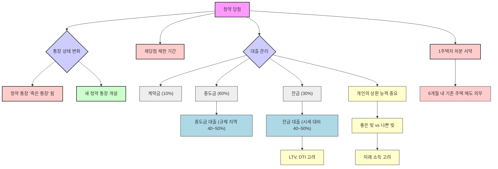

## 대한민국 청약지도: 내 집 마련을 위한 똑똑한 청약 전략
이 책은 복잡한 청약 제도를 쉽고 명확하게 설명하여, 집이 없는 사람부터 집이 있는 사람까지 누구나 새 아파트에 당첨될 수 있는 실질적인 전략을 알려주는 책이야. 저자는 청약이 내 집 마련의 가장 쉽고 좋은 방법이라고 강조하며, 다양한 상황에 맞는 맞춤형 청약 노하우를 제공하고 있어. 

## 1. 청약, 왜 지금 공부해야 할까? 

1. **내 집 마련의 가장 쉬운 길**:
  - 청약은 기존 아파트 매수, 분양권 입주, 경매, 증여 등 여러 내 집 마련 방법 중 가장 쉽게 접근할 수 있는 방법이라고 해. 
  - 특히 지금은 정부가 실수요자(실제로 살 집을 찾는 사람)를 위한 청약 제도를 많이 바꾸고 있어서, 내 집 마련을 원하는 사람들에게는 청약이 정말 좋은 기회가 될 수 있어. 

2. **새 아파트의 가치 상승**:
  - 우리나라 아파트 중에는 90년대에 지어진, 거의 30년이 다 되어가는 오래된 아파트가 많아. 그래서 새 아파트에 대한 사람들의 관심과 열망이 점점 커지고 있어. 
  - 새 아파트는 분양할 때 항상 비쌌지만, 시간이 지나면서 그 가치가 더 오르는 경우가 많아. 
  - 새 아파트는 입주까지 2년 6개월 정도 걸리는데, 그동안 집값이 계속 오르는 경우가 많고, 건물이 지어지고 조경이 완성되면 사람들의 선호도가 더 높아져. 
  - 특히 청약 당첨은 대부분 무주택자들이 되기 때문에, 이 사람들이 어렵게 얻은 집을 쉽게 팔지 않아서 매물이 잘 나오지 않고, 이는 새 아파트 가격 상승으로 이어지기도 해. 

3. **규제 시대의 기회**:
  - 지금은 부동산 규제가 많은 시대인데, 오히려 이런 규제가 무주택자들에게는 새 아파트 당첨의 기회를 더 많이 열어주고 있어. 
  - 청약 제도가 복잡하고 계속 바뀌지만, 이런 어려움 때문에 오히려 기회가 생기는 거라고 보면 돼. 

## 2. 청약 통장, 어떻게 활용해야 할까? 

1. **1인 1통장 전략**:
  - 청약에 성공하려면 가장 기본적으로 청약 통장이 꼭 필요해. 
  - 남편만, 아내만 가지고 있는 게 아니라, 가족 구성원 각자 **1인 1통장**을 가지고 있는 게 중요해. 
  - 과거에 청약 통장이 없어서 기회를 놓친 경우가 많기 때문에, 지금이라도 꼭 통장을 만들고 유지하는 게 좋아. 

2. **청약 통장의 종류와 활용**:
  - 지금은 주택청약종합저축 통장만 가입할 수 있어. 예전에 가입했던 청약저축, 청약예금 통장이 있다면 그대로 유지하면 돼. 
  - 이 주택청약종합저축 통장 하나로 공공분양(정부나 LH가 짓는 집)이든 민간분양(건설사가 짓는 브랜드 아파트)이든 모두 청약할 수 있어. 
  - 청년 우대형 청약통장은 만 19세부터 34세 이하의 청년이라면 꼭 가입해야 하는 통장이야. 
  - **가입 조건**: 무주택 세대주(집이 없는 세대의 가장)여야 하고, 월평균 소득이 3천만 원 이하인 근로소득, 사업소득, 기타소득이 있는 사람이라면 가입할 수 있어. 
  - **혜택**: 이 통장은 이자에 대한 세금을 내지 않는 **비과세** 혜택이 있고, 일반 통장보다 이자율도 높아. 
  - 기존에 청약 통장이 있다면 은행에 가서 청년 우대형으로 변경할 수 있어. 

3. **납입 금액과 횟수**:
  - 청약 통장은 매달 10만 원씩 꾸준히 납입하는 게 가장 좋아. 
  - 한 번에 많은 돈을 넣어도 바로 인정되는 게 아니라, 시간이 지나야 인정되기 때문에 꾸준함이 중요해. 
  - 납입 횟수가 많을수록 공공주택 청약 시 우선순위가 올라가. 
  - 예치금: 민간분양 아파트에 청약하려면 일정 금액의 예치금(미리 넣어두는 돈)이 통장에 있어야 해. 
  - 일반적으로 많이 찾는 34평 아파트(85제곱미터 이하)의 경우, 서울/부산은 300만 원, 기타 광역시는 250만 원, 기타 시/군은 200만 원이 필요해. 
  - 하지만 더 큰 평수(예: 102제곱미터 이하)에 청약하고 싶을 수도 있으니, 서울/부산 기준 600만 원 정도로 넉넉하게 넣어두는 게 유리할 수 있어. 
  - 예치금은 청약 자격 통장이 된 후(보통 2년 후)에 한 번에 넣어두면 돼. 

4. **어린 자녀 **청약 통장:
  - 많은 부모가 어린 자녀에게 청약 통장을 만들어주지만, 성년(만 19세)이 되기 전 가입 기간은 최대 2년만 인정돼. 
  - 따라서 갓난아기 때부터 통장을 만들어주는 것보다는, 만 17세가 되는 생일 전날에 통장을 개설하는 것이 가장 효율적이야. 
  - 어린 자녀의 종잣돈 마련을 위해 청약 통장을 이용하는 것보다는, 비과세 저축 통장(20년 이상 불입 시)이나 보험사 상품 등을 고려하는 것이 더 유리할 수 있어. 

## 3. 청약 당첨 확률을 높이는 전략 

1. **남들과 다르게 행동하라 (역발상 전략)**:
  - 청약에 당첨되는 가장 좋은 전략은 남들이 많이 지원하는 곳이 아니라, 남들이 잘 보지 않는 곳을 노리는 거야. 
  - 예를 들어, 많은 사람이 공공분양(싸니까)에 몰릴 때, 민간분양을 노리는 것처럼 말이야. 
  - 모두가 A급 단지만을 원하지만, A급 단지는 오랫동안 준비한 사람들에게 주어지는 기회야. 한 번에 A급 단지를 얻기 어렵다면, 징검다리처럼 B급 단지부터 시작하는 것도 좋은 방법이야. 

2. **특별 공급을 찾아라 (**특공** 전략)**:
  - 특별 공급**(**특공**)**은 특정 조건을 가진 사람들에게 주어지는 특별한 기회야. 평생 단 한 번, 1세대당 1주택에 한해 신청할 수 있어. 
  - 자신이 특별 공급에 해당하지 않는다고 미리 포기하지 말고, 혹시 해당될 수 있는지 꼼꼼히 찾아보는 게 중요해. 
  - **주요 특별 공급 종류**:
  - 기관 추천: 국가유공자, 장애인, 중소기업 장기근속자 등 특정 기관의 추천을 받은 사람들을 위한 거야. 
  - 중소기업 특공은 중소벤처기업청에 문의하면 자세한 정보를 얻을 수 있어. 
  - 군인 특별공급은 지역에 상관없이 제주도, 서울 등 어디든 가능해. 
  - 이런 특공은 본인만 가능하며, 무주택자여야 해. 
  - 만약 집이 있다면, 주택을 매도한 순간부터 특별 공급 대상자가 될 수 있어. 
  - 다자녀 특공: 미성년 자녀가 3명 이상인 무주택 세대에게 주어지는 기회야. 집이 있더라도 팔고 나면 신청할 수 있어. 
  - 해당 지역 거주자에게 50%, 인근 지역 거주자에게 50%의 비율로 당첨 기회가 주어져. 
  - 노부모 부양** 특공**: 만 65세 이상의 직계존속(부모님이나 조부모님)을 3년 이상 모시고 사는 무주택 세대주에게 주어지는 기회야. 싱글도 가능해. 
  - 신혼부부 특공: 결혼한 지 얼마 안 된 신혼부부나 예비 신혼부부도 청약할 수 있어. 
  - 자녀 수에 따라 당첨 확률이 결정되는 경우가 많아. 
  - 공공분양(LH 등)의 신혼부부 특공은 소득 제한이 있어. 
  - 민간분양(브랜드 아파트)의 신혼부부 특공도 소득 제한이 있어. 소득이 낮은 신혼부부에게 기회가 주어지는 셈이야. 
  - 생애 최초 특공: 태어날 때부터 한 번도 집을 소유한 적이 없는 무주택 세대에게 주어지는 기회야. 
  - 이 특공은 국민주택(공공분양)에만 해당돼. 
  - **주의사항**: 분양가 9억 원 이상의 비싼 집은 특별 공급이 없어. 
  - 특별 공급과 일반 공급은 동시에 신청할 수 있지만, 특별 공급에 당첨되면 일반 공급 청약은 무효가 돼. 

3. **그 지역에 살아라 (지역 우선 전략)**:
  - 우리나라는 청약 단지가 건설되는 지역에 사는 사람에게 우선권을 줘. 
  - 거주 요건:
  - 투기과열지구(부동산 과열이 심한 지역)는 2년 이상 거주해야 해. 
  - 조정대상지역(투기과열지구보다 규제가 덜하지만 규제가 있는 지역)은 1년 이상 거주해야 해. 
  - 비조정대상지역(규제가 없는 지역)은 해당 지역에 살기만 하면 돼. 
  - 해당 지역에 거주하면 청약 가점에서 큰 이점을 얻을 수 있어. 예를 들어, 하남시의 경우 2년 거주자와 비거주자의 가점 차이가 10점이나 났는데, 이는 무주택 기간 3년의 가점과 맞먹는 큰 점수야. 
  - 따라서 서울 아파트에 당첨되고 싶다면 서울에 거주하는 것이 유리하고, 원하는 지역이 있다면 그 지역에 전월세로 거주하는 것도 좋은 전략이 될 수 있어. 

4. **추첨제를 노려라 (운도 실력이다 전략)**:
  - 청약은 가점제(점수가 높은 사람에게 우선권)와 추첨제(운에 맡기는 방식)로 나뉘어. 
  - 가점이 낮거나 싱글, 자녀가 없는 딩크족(자녀 없이 맞벌이하는 부부)이라면 추첨제를 노리는 것이 좋은 전략이야. 
  - 추첨제** 비율**:
  - 투기과열지구의 85제곱미터 이하 아파트는 100% 가점제라 추첨제가 없어. 
  - 하지만 85제곱미터 초과 아파트는 50%가 가점제, 50%가 추첨제야. 
  - 조정대상지역은 85제곱미터 이하 아파트의 25%가 추첨제이고, 85제곱미터 초과 아파트는 30%가 가점제, 70%가 추첨제야. 
  - 추첨제는 운이 중요하지만, 계속해서 청약에 도전하다 보면 아파트에 대한 이해도 높아지고, 언젠가 기회가 올 수 있어. 

## 4. 청약 정보, 어디서 얻을 수 있을까? 

1. 청약 홈** (Cheongyak Home)**:
  - 예전의 '아파트 투유'가 바뀐 곳으로, 청약 신청의 모든 것이 이루어지는 공식 사이트야. 
  - **주요 기능**:
  - **청약 신청**: 원하는 단지에 직접 청약할 수 있어. 
  - **청약 알리미 서비스**: 관심 있는 지역이나 단지의 분양 일정을 문자로 받아볼 수 있어. 
  - **청약 **가점** 계산**: 내 청약 가점을 자동으로 계산해줘서 헷갈릴 일이 없어. 
  - **당첨 조회**: 당첨 여부를 확인할 수 있어. 
  - 통장** 정보 확인**: 내가 어떤 청약 통장을 가지고 있고, 제대로 준비하고 있는지 확인할 수 있어. 
  - 공인인증서만 있으면 쉽게 가입하고 이용할 수 있어. 

2. **부동산 정보 사이트 및 앱**:
  - **닥터아파트**: 향후 분양 예정 물량과 분양 계획을 지역별로 볼 수 있어. 
  - **네이버 부동산**: 분양 페이지에서 전매 제한 기간, 프리미엄 정보, 분양 정보를 확인할 수 있어. 
  - **부동산 114**: 분양 칼럼, 분양 일정, 분양 정보를 제공해. 
  - **호갱노노**: 입주 물량과 사람들이 선호하는 단지를 표시해줘. 
  - **직방**: 경쟁률, 가점, 분양 시기 등 다양한 정보를 알 수 있어. 

3. 모델하우스** 및 은행**:
  - 관심 있는 아파트의 **모델하우스**에 직접 방문해서 상담원들에게 궁금한 점을 물어보면 친절하게 알려줘. 
  - 모델하우스에 관심 등록을 해두면 분양 일정이나 진행 상황에 대한 문자 안내를 받을 수 있어. 
  - **은행**에 방문해서 청약 통장에 대한 자세한 설명을 듣고, 내가 어떤 청약을 할 수 있는지 문의할 수 있어. 
  - 동네 **공인중개사무실**에서도 청약 정보를 얻을 수 있어. 

## 5. 청약 당첨 후 관리 및 주의사항 

1. 청약 통장** 관리**:
  - 청약에 당첨되는 순간, 그 통장은 '죽은 통장'이 되어 더 이상 사용할 수 없어. 
  - 당첨되자마자 바로 새로운 청약 통장을 개설해서 다시 납입을 시작해야 해. 그래야 시간이 지나면서 가점이 다시 쌓일 수 있어. 
  - 청약 통장을 깨면(해지하면) 그동안 쌓았던 기회가 사라지니, 당첨되기 전까지는 절대 깨지 않는 것이 중요해. 

2. **가점과 **재당첨 제한:
  - 당첨되는 순간, 무주택 기간 가점과 청약 통장 가점은 0점이 돼. 
  - 부양가족 가점은 남아있지만, 당첨이 되면 **재당첨 제한 기간**이 적용돼. 이 기간 동안에는 규제 지역(투기과열지구, 조정대상지역)에 다시 당첨될 수 없어. 
  - 이런 제한은 공평하게 기회를 나누기 위한 제도라고 보면 돼. 

3. **대출 계획**:
  - 아파트 분양 대금은 보통 계약금(10%), 중도금(60%), 잔금(30%)으로 나눠서 내게 돼. 
  - **중도금 대출**: 투기과열지구는 분양가의 40%, 조정대상지역은 50%까지 대출이 가능해. 
  - **잔금 대출**: 입주 시점에 받는 대출인데, 이때는 분양가가 아니라 그 시점의 아파트 시세 대비 40~50%까지 대출이 나와. 
  - 만약 분양받은 아파트의 시세가 많이 올랐다면, 대출받을 수 있는 금액도 늘어날 수 있어. 
  - 정확한 시세는 입주 전 사전 점검 후 1~2주 뒤에 나오는 KB 시세 등을 통해 확인할 수 있어. 
  - **대출 한도**: LTV(주택담보대출비율)와 DTI(총부채상환비율) 등 개인의 신용도와 소득 조건에 따라 대출 한도가 달라지니, 모델하우스나 은행에서 자세히 상담받는 것이 중요해. 
  - **상환 능력**: 대출은 이자와 원금을 갚아야 하는 '빚'이지만, 내 집 마련을 위한 대출은 '좋은 빚'이 될 수도 있어. 하지만 자신이 감당할 수 있는 수준인지, 미래 소득을 고려해서 신중하게 결정해야 해. 

4. **1주택자의 처분 서약**:
  - 만약 이미 집이 있는 1주택자가 청약에 당첨되었다면, 기존 집을 팔겠다는 **처분 서약**을 해야 해. 
  - 당첨된 아파트에 입주하고 나서 6개월 안에 기존 집을 반드시 팔아야 해. 

## 6. 미계약분과 무순위 청약 활용하기 

1. 미계약분 공략:
  - **미계약분**은 청약 당첨자가 계약을 포기하거나, 부적격자(자격 미달)로 판명되어 계약하지 못한 물량을 말해. 
  - 이런 미계약분은 청약 통장이 없어도 신청할 수 있어서, 집이 있는 사람에게도 기회가 될 수 있어. 
  - 2019년 2월 1일 이후부터는 '아파트투유'에서 **자녀 세대 신청**을 접수받고 있어. 
  - 관심 있는 단지의 모델하우스에 미리 연락해서 미계약분이 나오면 문자를 달라고 요청해두면, 공고 일정이 잡힐 때 안내를 받을 수 있어. 
  - 꾸준히 관심을 가지고 도전하는 사람에게 당첨의 행운이 찾아올 수 있어. 

2. 무순위 청약:
  - **무순위 청약**은 정당 계약(정식 계약)과 예비 당첨자 계약까지 끝난 후에도 남은 주택을 대상으로 하는 청약이야. 
  - 예전에는 '묻지도 따지지도 않고' 청약할 수 있었지만, 법이 바뀔 예정이야. 
  - 앞으로는 무순위 청약도 당첨 포기자가 많아지는 것을 막기 위해 재당첨 제한, 무주택자만 가능, 해당 지역 거주자만 가능 등의 규제가 생길 수 있어. 
  - 무순위 청약 당첨 비법은 청약 물량이 많은 지역에 거주하는 것이 될 수 있어. 
  - 무순위 청약도 입주자 모집 공고가 나오니, 자세한 내용은 공고문을 확인해야 해. 

## 7. 3기 신도시와 사전 청약, 핵심 지역은? 

1. **3기 신도시의 중요성**:
  - 3기 신도시는 서울의 높은 집값과 주택 부족 문제를 해결하기 위해 조성되는 대규모 택지 지구야. 
  - 이곳은 앞으로 수십만 명의 사람들이 모여 살게 될 새로운 도시가 될 거야. 
  - 따라서 3기 신도시의 위치와 특징을 미리 알아두고 청약을 고민하는 것이 중요해. 

2. **신도시 분석 방법**:
  - **교통망**: 신도시의 가치를 판단하는 가장 중요한 기준은 교통망이야. 서울의 일자리와 얼마나 빠르고 편리하게 연결되는지 살펴봐야 해. 
  - 남양주 왕숙: 풍양역, 진접선, 경춘선, 경의중앙선 별내역 등 다양한 노선이 연결돼. 
  - 하남 교산: 송파 1 도시철도(3호선 연장 미확정)가 연결될 예정이야. 
  - 고양 창릉: 고양선(6호선, 3호선 연결), GTX(수도권 광역급행철도)와 연결돼. 
  - 과천: 기존 4호선, GTX-C, 위례과천선 등이 있어. 
  - 장상 지구: 신안산선이 여의도(주요 일자리 지역)를 관통할 예정이야. 
  - **입지 가치**: 주변에 이미 잘 형성된 택지 지구가 붙어있는 곳이 좋아. 예를 들어, 하남 교산은 강일지구, 미사지구, 송파, 위례와 붙어있고, 과천은 재건축 단지, 지식정보타운과 붙어있어. 
  - **미래 가치**: 신축 아파트의 프리미엄은 입지, 신축 여부, 미래 가치 세 가지를 따져봐야 해. 

3. 사전 청약** 전략**:
  - 사전 청약은 본청약(실제 입주까지 2~3년 걸리는 청약)보다 1~2년 먼저 일부 물량을 미리 청약하는 제도야. 
  - **신청 자격**: 무주택 세대 구성원, 청약 통장, 지역 거주 요건, 특별 공급 자격 등이 필요해. 
  - **중복 신청**: 여러 사전 청약 단지에 동시에 신청할 수는 없어. 한 곳에 당첨되면 다른 사전 청약은 불가능해. 
  - 하지만 사전 청약에 당첨되더라도 일반 청약(본청약)에는 다시 도전할 수 있어. 일반 청약에 당첨되면 사전 청약은 무효가 되는 '양다리 전략'을 활용할 수 있는 셈이야. 
  - 사전 청약 물량은 매우 많으니, 미리 리스트를 확인하고 고민하는 것이 중요해. 

4. **사전 청약 핵심 지역**:
  - **서울 지역**: 노량진, 우면, 오금, 지행, 남태령, 용산 정비창 등 서울에도 사전 청약 물량이 나올 예정이야. 
  - 3기 신도시: 하남 교산, 고양 창릉 신도시가 특히 주목할 만해. 
  - **성남 지역**: 복정 1지구, 2지구, 신천지구, 낙생지구, 금토지구 등 5개의 소규모 택지 지구가 있어. 성남에 거주하는 사람들에게는 큰 기회가 될 수 있어. 
  - **안양 인덕원**: 이곳에도 사전 청약 물량이 나올 예정이야. 

## 8. 청약 공부, 어떻게 시작해야 할까? 

1. **꾸준한 관심과 공부**:
  - 지금 당장 집을 살 돈이 없더라도, 부동산 관련 책을 읽고 꾸준히 공부하는 것이 중요해. 
  - 나중에 집을 살 때가 되어서야 알아보려고 하면 이미 늦을 수 있어. 지금부터 감각을 익히는 시간이 필요해. 
  - 어렵게 느껴지더라도 조금씩 공부하다 보면 좋은 기회가 올 수 있어. 

2. 모델하우스 방문:
  - 관심 있는 단지의 모델하우스를 직접 방문해서 둘러보고, 상담원들에게 궁금한 점을 물어보는 것이 좋아. 
  - 모델하우스를 다니면서 어떤 아파트가 인기가 많고, 프리미엄이 붙는지 등을 직접 경험하고 배울 수 있어. 

3. **자신만의 전략 세우기**:
  - 청약에 당첨된 사람들의 90%는 자신만의 전략을 가지고 있었어. 
  - 자신의 상황(가점, 거주 지역, 특별 공급 해당 여부 등)을 정확히 파악하고, 그에 맞는 전략을 세우는 것이 중요해. 
  - 예를 들어, 서울에 살고 싶지만 가점이 낮다면, 인천처럼 조금 역세권과 멀더라도 자신이 살 수 있는 곳을 선택하는 'B급 전략'도 고려해볼 수 있어. 

4. **정보 공유 및 활용**:
  - 청약 정보는 매우 중요하니, 주변 사람들과 공유하고 함께 공부하는 것도 좋은 방법이야. 
  - 저자의 유튜브 채널 '아임해피 TV' 등 다양한 온라인 채널을 통해 최신 청약 정보를 얻을 수 있어. 
  - 궁금한 점이 있다면 댓글을 남기거나 직접 문의해서 해결하는 적극적인 자세가 필요해. 

