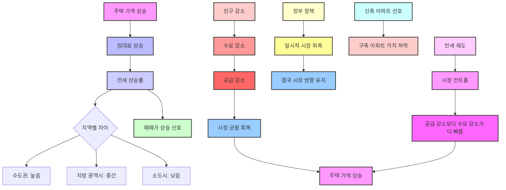

## 결국엔 오르는 집값의 비밀: 부동산 시장의 숨겨진 원리
이 책은 부동산 시장의 복잡한 흐름을 임대료와 공급이라는 핵심 요소를 통해 쉽고 명확하게 설명해. 인구 감소나 정부 정책 같은 외부 변수에도 불구하고, 결국 집값이 오를 수밖에 없는 근본적인 이유를 알려주는 책이야. 마치 기업의 매출과 이익처럼, 부동산 시장의 성장을 결정하는 진짜 비밀을 파헤쳐 볼 거야.

## 1. 부동산 시장의 핵심 지표: 전세 상승률 

1. 주택** 가격의 근본적인 평가 기준은 임대료야.**
  1. 주택 가격이 계속 오른다는 건, 그 집을 사용했을 때 얻는 가치(임대료)가 계속 오른다는 뜻과 같아 .
  2. 그래서 주택 시장을 길게 보려면, 임대료가 왜 오르는지, 그리고 수익률 개념을 제대로 아는 게 중요해 .
2. **기업의 성장과 부동산의 성장은 비슷해.**
  1. 기업이 성장한다는 건 매출이 늘고 이익이 커져서 수익률이 높아지는 걸 말하지 .
  2. 부동산에서는 상가 월세나 주거용 부동산의 월세, 그리고 전세가 오르는 게 바로 성장이야 .
3. **성장률과 수익률은 다른 개념이야.**
  1. 성장률은 월세나 전세가 얼마나 오르는지를 말해 .
  2. 수익률은 내가 투자한 돈 대비 월세를 얼마나 받는지에 따라 달라지는 거야 .
4. **도시별 전세 상승률을 보면 성장이 보여.**
  1. 수도권 도시와 지방 광역시는 연평균 전세 상승률에서 큰 차이가 나 .
  2. 지방 광역시 중에서도 성장하는 곳은 전세 상승률이 높게 나타나 .
  3. **데이터로 본 전세 상승률 (1987년~2023년, 36년간 평균)** 
  - 서울: 7.83%
  - 인천: 8.11%
  - 대전: 6.97%
  - 부산: 6.27%
  - 대구: 6.01%
  - 울산: 5.48%
  - 광주: 5.14%
  4. 이 수치들은 서울 아파트가 36년 동안 연평균 7.83%의 임대료를 만들어냈고, 광주 아파트는 5.14%를 만들어냈다는 의미야 .
  5. 지역별 주택 가격 차이처럼, 임대료 상승률을 통해서도 지역의 성장 차이를 알 수 있어 .
  6. 인구 감소나 성장이 느린 소도시일수록 임대료 상승률이 낮아지는 경향이 통계로 확인돼 .
  7. 결국, 이런 임대료 상승률이 그 지역의 주택 가치로 이어지고, 장기적인 미래 주택 가격이 될 가능성이 크다는 거야 .

## 2. 인구 감소에도 집값이 오르는 이유: 시장의 자기 균형 능력 

1. **인구 감소가 꼭 **집값** 하락으로 이어지는 건 아니야.**
  1. 최근 부동산 시장이 안 좋았을 때, 인구 감소나 수요 감소가 큰 문제로 떠올랐어 .
  2. 하지만 수요 감소가 무조건 부동산 시장의 침체로 이어진다고 단정하는 건 너무 섣부른 생각이야 .
2. **수요가 줄면 공급도 따라서 줄어들어.**
  1. 사람들이 원하지 않는 물건을 계속 만들 수 없듯이, 주택도 수요가 줄면 공급도 따라서 줄게 돼 .
  2. 시장은 스스로 균형을 맞추는 능력이 있기 때문이야 .
  3. **지방 시장의 예시** 
  - 지방에서는 이미 인구 감소에 맞춰 공급도 줄고 있어.
  - 특히 빌라는 수요가 줄어들면서 새로운 빌라 공급이 거의 없어졌지.
  - 이처럼 시장은 줄어든 수요만큼 공급을 줄여.
3. 아파트** 시장도 마찬가지야.**
  1. 만약 기존 아파트에서 수익이 안 나면, 사람들은 새로운 아파트를 살 이유가 없어 .
  2. 집값이 계속 떨어지면 아무도 집을 사려 하지 않을 거고, 결국 매수자가 없으면 공급도 계속될 수 없으니 공급이 줄어들게 돼 .
  3. 그래서 일시적으로 집값이 떨어질 수는 있어도, 계속해서 떨어지기는 어렵다는 거야 .
  4. 20년 동안 인구가 줄어든 도시들도 공급량이 줄어들면 오히려 집값이 조금씩 오르는 현상이 나타나 .
  5. 이렇게 줄어든 수요에 맞춰 공급이 조절되면서 시장은 다시 균형을 찾아가는 거지 .
4. **수요는 인구수만으로 결정되지 않아.**
  1. 인구수가 비슷해도 수요가 많은 도시는 재고 주택도 많고 신규 공급도 많아. 이건 시장이 스스로 수요에 맞는 공급량을 찾아가기 때문이야 .
  2. **광주광역시와 대전광역시의 예시** 
  - 광주광역시의 수요가 대전광역시보다 많은 건 전남 지역 사람들이 광주를 선택했기 때문이야.
  - 그래서 광주광역시의 재고 주택이 대전보다 많고, 전남 지역의 수요는 줄어들어 신규 공급도 감소하게 돼.
  - 결과적으로 인구수 대비 주택 수가 가장 적은 곳이 전남 지역이야.
  3. 중심 도시는 인구 감소 때문에 장기적으로 침체될 가능성이 매우 낮아 .
  4. 주택 수요를 단순히 인구수에만 한정해서 보는 건 너무 좁은 생각일 수 있어 .
  5. 소득이 늘어나면 여러 채의 집을 소유할 수도 있기 때문이야 .
  6. 물론 작은 도시와 도심의 차이는 있겠지만, 인구 감소가 우리나라 전체 주택 시장의 문제라고 보기는 어려워 .
5. **건설사들의 **리스크** 관리도 공급 감소에 영향을 줘.**
  1. 우리나라 주택 시장은 아파트처럼 대규모로 지어지는 경우가 많아 .
  2. 사업 규모가 크다 보니 리스크도 엄청 커 .
  3. 만약 아파트 단지 하나라도 분양에 실패하거나 미분양이 되면, 건설사나 시행사는 엄청난 손실을 보게 돼 .
  4. 그래서 수요가 줄거나 집값이 떨어지는 상황이 되면, 건설사들은 공급을 확 줄여버려 .
  5. 결국, 수요가 줄어드는 것보다 공급이 줄어드는 속도가 훨씬 더 빠르다는 거야 .
  6. 인구 10만 명 미만의 소도시들을 보면, 몇 년에 한 번씩만 아파트를 분양할 정도로 공급이 줄어있어 .
  7. 이건 건설사들이 대규모 아파트 사업의 리스크를 피하려는 결과지 .
  8. 상주 시의 예시처럼, 수요가 감소해도 공급이 더 빠르게 감소하기 때문에, 우리가 생각하는 것처럼 주택 시장의 암울한 미래가 현실이 되지 않을 수 있어 .

## 3. 2025년 서울 집값 전망과 내집마련 조언: 전세 시장이 핵심 

1. 수도권** **집값**, 지방 시장에서 힌트를 얻어.**
  1. 수도권 집값에 대한 관심이 많지만, 지방 시장의 흐름을 먼저 살펴보면 수도권의 미래를 예측하는 데 도움이 돼 .
  2. 똑같은 규제 속에서도 지방의 작은 도시들이 오르는 이유를 알면, 그걸 수도권에 그대로 적용할 수 있거든 .
2. **최근 1~2년간 시장 흐름: 전세 상승이 **매매가** 상승을 이끌어.**
  1. **두 가지 시장 흐름** 
  - 처음에는 강남부터 많이 올랐고, 이어서 마용성(마포, 용산, 성동) 같은 지역도 올랐어.
  - 보금자리론 특례 대출이 시작되면서 10월까지 전국적으로 올랐고, 심지어 대구도 조금 올랐지 .
  - 그러다 10월 이후 주춤하다가 수도권이 다시 오르고, 지방은 다시 가라앉았어 .
  2. **핵심은 **전세 상승** 연결 여부** 
  - 전세 상승이 매매가 상승으로 이어진 곳은 계속 올랐고, 그렇지 않은 곳은 하락했어 .
  - 서울에서는 비아파트(빌라 등)에서 아파트로 전세 수요가 많이 넘어왔어 .
  3. **전세는 주택 시장의 '매출과 이익'과 같아.** 
  - 기업에서 매출과 이익이 기업 가치를 말해주듯이, 주택 시장에서는 전세와 월세가 집의 가치를 평가하는 기준이야.
  - 매출이 늘어나는데 기업이 망한다고 할 수 없듯이, 전세나 월세가 오르는데 집값이 폭락한다고 말할 수 없어.
  4. **전세 상승은 매매가 상승의 신호.** 
  - 전세가 오르면 매매가도 오를 확률이 높아.
  - 물론 GTX 같은 개발 호재나 신생아 대출처럼 전세 상승 없이 매매가만 오르는 경우도 있지만, 이런 건 일시적이고 연결성이 없어 .
  5. **서울은 전세 상승이 매매가 상승으로 연결되고, 지방은 그렇지 않아.** 
  - 그래서 서울은 계속 오르고 있고, 지방은 다시 안 좋아진 거야.
3. **지방 시장의 공급 문제와 서울의 과수요.** 
  1. **지방 하락의 원인: 공급 과잉** 
  - 지방은 공급이 많아서 다시 안 좋아졌어.
  2. **서울은 공급 부족이 아니라 '수요 과잉' 문제야.** 
  - 예를 들어, 편의점에 물을 사러 오는 사람이 평소 5명인데 7명이 오면 물 2병이 부족하지? 
  - 이건 물이 부족한 게 아니라, 물을 사려는 사람이 많다는 뜻이야. 서울은 빌라에서 넘어온 수요가 많아서 이런 상황이야 .
  - 그런데 내년에는 5명이 오는데 물이 3병밖에 없는 상황이 될 거야 . 똑같이 2병이 부족해도, 물 자체가 줄어든 내년이 훨씬 더 위험한 상황이지 .
  - 이게 바로 공급 부족이 더 위험하다는 의미야 .
  - 만약 물이 3병인데 빌라에서 7명이 넘어오면 정말 큰일 나는 거야 .
  - 이처럼 서울은 '과수요' 상태라고 보면 돼 .
4. **정부 정책과 시장의 반응: 일시적인 영향일 뿐.** 
  1. **8.8 대책: 비아파트 공급 확대** 
  - 정부가 비아파트(빌라 등) 신축을 무제한으로 매입하겠다고 한 건, 빌라에서 아파트로 넘어오는 수요를 막기 위한 조치야 .
  - 이 정책은 내년에 효과가 나타날 거야 .
  2. 대출 규제**: 수요 위축 효과는 일시적.** 
  - 대출 규제(스트레스 DSR 2단계, 9월부터)는 수요를 위축시키려는 목적이지만, 시장에 미치는 영향은 잠시뿐이야 .
  - 대출 금액이 조금 줄어들어도, 같은 단지에서 층수만 낮추면 되는 정도라 큰 의미는 없어 .
  3. **전세자금 대출 규제: 미지수의 변수.** 
  - 만약 전세자금 대출까지 규제되면 수요가 위축될 수 있지만, 그 사람들이 어떤 선택을 할지는 예측하기 어려워 .
5. **강남 불패와 **똘똘한 한 채**: 안전 자산 선호 심리.** 
  1. **지방의 불안감과 강남 선호** 
  - 강남 집값이 많이 오른 건, 사람들이 강남을 '안전 자산'이라고 생각하기 때문이야 .
  - 특히 지방 소멸론 같은 이야기가 많아지면서, 지방 사람들이 불안해져 지방 물건을 팔고 서울 강남에 투자하는 경우가 많았어 .
  2. **똘똘한 한 채와 **갈아타기 수요 
  - 서울이나 경기도 내에서도 강남을 많이 샀고, '똘똘한 한 채'나 '갈아타기' 수요도 핵심 지역 아파트를 많이 사면서 집값이 많이 올랐어.
  3. **선호도에 따른 가격 차이** 
  - 하지만 핵심 지역 외에는 선호도가 떨어져서, '우리 집은 안 팔린다'는 이야기도 많아.
6. **본격적인 전세 부족 시기: 매매 전환 가속화.** 
  1. **전세 부족은 이제 시작.** 
  - 올 하반기나 늦어도 내년 상반기부터는 전세 부족 현상이 본격적으로 시작될 거야.
  - 물이 없으면 매매를 선택해야 하는 상황이 오는 거지.
  2. **비핵심 지역까지 매매 수요 확산.** 
  - 지금은 핵심 지역만 올랐지만, 시간이 지나면 비핵심 지역이나 외곽 지역까지 전세 수요가 매매 수요로 전환되면서 집값이 오를 가능성이 커.
7. **전세 상승은 아직 시작도 안 했다?** 
  1. **기저 효과와 갱신권 만료** 
  - 1년 넘게 전세가 올랐지만, 매매 상승은 아직 시작도 아니라고 봐 .
  - 그동안 오르지 못했던 '기저 효과'(과거에 낮았던 가격이 정상화되는 현상)와 갱신권(전세 계약 갱신 청구권)을 썼던 아파트들의 만기가 돌아오면서 시장 가격으로 회복되는 과정이야.
  - 그래서 많이 올라 보이지만, 사실 예전처럼 폭등한 건 아니야.
  2. **매물 감소 현상** 
  - 매물도 계속 줄고 있는 건 사실이야.
8. **울산의 사례: **전세 수급 지수** 160 돌파 임박.** 
  1. **울산은 이미 상승장 진입** 
  - 본격적인 전세 부족 시기는 아직 남았지만, 울산은 이미 상승장에 진입했다고 볼 수 있어.
  - 전세 수급 지수가 160을 넘으면 공급 부족이 시작됐다고 보는데, 울산은 현재 156이야 .
  2. **전국 최고 수준의 전세 수급 지수** 
  - 서울은 142밖에 안 되는데, 울산은 전국에서 가장 높아.
  - 이는 수요가 많다는 명확한 증거야 .
9. **부동산 시장의 수요는 사라지지 않아.** 
  1. **수요는 잠시 멈출 뿐** 
  - 부동산 시장에서 수요는 완전히 없어지지 않아.
  - 집을 사려던 사람이 금융 위기나 해고 때문에 잠시 멈출 수는 있지만, 직장을 다시 얻으면 결국 집을 사게 돼. 수요는 잠시 멈춰 있는 거지.
  2. **매매가 멈추면 전세가 오르고, 다시 매매가를 밀어 올려.** 
  - 매매가 멈추면 그 수요는 전세 시장으로 가서 전세가를 더 올리게 돼.
  - 전세가가 오르면 다시 매매가를 끌어올리는 구조야.
  - 결국 방향은 똑같아. 속도만 다를 뿐이지 .
10. **정부 정책의 한계: 속도만 늦출 뿐 방향은 못 바꿔.** 
  1. **문재인 정부 정책의 교훈** 
  - 문재인 정부 때 수많은 정책이 나왔지만, 시장의 방향을 바꾸지는 못했어.
  - 금리가 떨어져서 잠시 주춤했을 뿐, 결국 지방은 공급이 부족해지면서 시장은 바뀌지 않았어 .
  2. **정책은 속도만 조절할 뿐** 
  - 어떤 정책이 나와도 시장의 방향을 바꾸는 건 불가능하고, 단지 속도만 늦출 뿐이야.
11. **8.8 부동산 대책의 영향: 비아파트 효과는 있지만, 아파트는 늦어.** 
  1. **비아파트 공급 효과는 1~1.5년 후** 
  - 8.8 대책으로 비아파트 공급에는 효과가 있을 거야.
  - 하지만 실제 입주까지는 1년에서 1년 반 정도 걸릴 거야.
  2. **아파트 공급은 더 늦어** 
  - 3기 신도시 같은 아파트 공급은 더 뒤로 밀렸기 때문에, 2025년, 2026년 상반기까지는 시장에 큰 변화가 없을 거야.
12. **지방 소도시의 반등: 인구 감소에도 공급 부족이 원인.** 
  1. **지방도 슬슬 오르고 있어.** 
  - 수도권에 관심이 집중되어 있지만, 지방도 울산을 시작으로 한두 곳씩 오르고 있어.
  - 영천, 상주, 문경 같은 소도시들은 관심이 적지만, 두 자릿수 상승률을 보이는 곳도 많아 .
  2. **인구 감소에도 오르는 이유: 누적된 **공급 부족 
  - 이런 소도시들이 오르는 이유는 전부 '공급 부족' 때문이야 .
  - 문경이나 상주는 인구가 24%나 줄었지만, 공급 부족으로 인해 집값이 오르고 있어 .
  - 대구도 전세가 연결된 곳은 오르고, 그렇지 않은 곳은 다시 떨어지는 차이를 보여 .
13. **전세 수급 지수와 매물 추이: 시장의 바닥과 상승 신호.** 
  1. **전세 수급 지수는 시장의 방향.** 
  - 전세 수급 지수는 계절적 등락이 심하지만, 최저점을 연결해보면 하나의 사이클을 만들어 .
  - 2012년 12월과 2023년 12월이 실거래가 최저점과 수도권 전세 수급 최저점이 똑같아 .
  - 이는 전세가 우리 시장의 방향을 알려주는 지표라는 뜻이야 .
  - 매매가는 GTX 같은 호재로 일시적으로 움직일 수 있지만, 시장을 밀어 올리는 진짜 힘은 '전세 부족'이야 .
  - 전세 부족이 전세 상승을 만들고, 이 상승이 매매가 상승으로 이어지는 곳이 울산, 전주 같은 곳이야 .
  - 이런 현상은 내년에는 전국으로 번질 거야 .
  2. **주요 도시별 전세 수급 지수 (8월 기준)** 
  - 울산: 156 (가장 높음, 160에 가까움)
  - 인천: 145
  - 서울: 142
  - 경기도: 128
  - 부산: 102
  - 대구: 77.3 (가장 낮음, 아직 최악)
  - 지수가 160까지 와야 공급 부족이 심각하다고 보는데, 아직 시간이 더 필요해 보여 .
  3. **시장의 바닥은 이미 찍었어.** 
  - 2023년 12월~2024년 1월이 투자자들이 역전세와 세금 문제로 가장 힘들었던 시기였어 .
  - 많은 사람들이 급매를 엄청나게 던졌던 그때가 바로 시장의 바닥이었지 .
  4. **서울 매물 추이: 계속 감소 중.** 
  - 서울의 매물은 2023년 1월이 최고점이었고, 이후 계속 줄어들고 있어 .
  - 이는 과거 아파트 줄 서서 사고, 가위바위보로 집을 정하던 시기처럼 매물이 줄고 있다는 의미야 .
  - 서울, 인천, 경기도 모두 매물이 줄고 있고, 전국적으로도 매물이 감소 추세야 .
  - 대구는 물량이 많아서 매물 감소가 좀 늦게 나타나고 있어 .
  5. **매매가 바닥은 전세 수급으로 확인.** 
  - 매매가 바닥을 잡기 위해서는 전세 수급을 봐야 해.
  - 과거에는 공포 때문에 바닥을 알기 어려웠지만, 최근에는 매물 지수가 나와서 훨씬 보기 편해졌어 .
14. **매물의 '성격'이 중요해: 급매물 소진 후 가격 방어.** 
  1. **매물 양보다 성격이 중요.** 
  - 방송에서는 매물이 쌓여있다고 하지만, 팔 사람이 급하지 않으면 의미가 없어 .
  - 급한 물건들이 다 팔리고 나면, 급매물이 없어지기 때문에 가격이 덜 떨어지게 돼 .
  - 2023년 12월~2024년 1월에 급한 물건들이 많이 팔렸고, 지금은 현금화해서 투자 시점을 기다리는 사람들이 많아 .
  - 현재 서울이나 지방 모두 급매물이 거의 없어 .
  - 결국 매물의 물리적인 양보다 '성격'(급한 매물인지 아닌지)을 분석하는 게 중요해 .
  2. **전세 물량이 더 중요.** 
  - 매매 물량보다 전세 물량이 더 중요하다고 봐.
  - 전세에서 매매로 넘어갈 때가 핵심이거든.
15. **부산의 전세 시장: 심각한 전세 부족 예상.** 
  1. **부산 전세 매물 급감.** 
  - 부산은 올해부터 공급이 적은데, 한 달에 전세 500건이 사라지고 있어.
  - 1년에 6천 건 가까이 사라지는 셈이지.
  - 현재 매물 추이로 볼 때, 부산은 3~4월쯤 전세난이 아주 심각해질 거야.
  2. **전세 부족은 매매가 상승으로 이어져.** 
  - 전세가 사라지는 속도가 빠르면 전세 수급 지수가 움직이고, 이는 매매가 상승으로 이어져.
  - 물이 원래 있는데 사람이 늘어나는 것과, 물 자체가 부족한 건 전혀 다른 문제야. 물이 부족한 건 훨씬 심각한 문제지.
16. **금리 영향은 제한적: 임대료 변동성이 더 중요.** 
  1. **금리는 주거 문제를 해결하지 못해.** 
  - 금리가 주택 가격을 떨어뜨릴 수는 있지만, 주거 문제 자체를 해결하지는 못해.
  - 일시적으로 가격이 떨어져도 결국 다시 반영돼.
  2. **금리 변동은 시장에 큰 영향 없어.** 
  - 금리가 오르든 내리든 시장에 미치는 영향은 크지 않다고 봐.
  - 이미 금리 변동에 대한 시장의 반응은 다 나타났고, 더 이상 크게 오르거나 내리기 힘든 상황이야.
  - 임대료 변동성이 금리 변동성보다 크면, 금리는 무시돼.
17. **지역별 투자 전략: 전세 수급과 **전세가율**.** 
  1. **지방은 전세 수급이 가장 중요.** 
  - 지방에서는 전세 수급이 제일 중요해.
  - 전세 수급을 만드는 공급량을 찾는 건 투자자들의 몫이지만, 일반인들은 전세 상승이 나오면 그냥 매수해도 돼.
  - 울산처럼 전세가 상승하고 오랜 시간이 지나면 매매가도 오르니, 시차가 있어도 선택하면 돼.
  2. **서울은 전세가율이 중요.** 
  - 서울은 전세가율(매매가 대비 전세가 비율)이 중요해.
  - 전세가율은 전세(사용 가치) 대비 매매가(평가 가치)가 얼마나 반영되었는지를 보여주는 지표야.
  - 2008년 금융 위기 때 서울 전세가율이 38%까지 떨어졌는데, 이는 매매가가 62%나 과하게 반영되었다는 의미야 .
  - 이때는 전세가가 올라도 매매가는 오르지 않았어. 마치 실적은 조금 나왔는데 주가는 미리 많이 오른 것과 같지.
  - 현재 서울은 53% 이상, 경기도는 60% 이상으로 계속 오르고 있어 .
  - 이는 사용 가치(전세) 대비 매매가 반영이 아직 적다는 뜻이야.
  - 그래서 전세가 계속 오르면 매매가도 계속 오를 수밖에 없어 .
18. **강남의 저항성과 외곽 확산: 가격 부담과 가성비 투자.** 
  1. **강남의 가격 저항성.** 
  - 강남 같은 핵심 지역은 이미 최고점에 가까워져서, 더 높은 금액에 사는 것에 대한 심리적인 저항이 생겨.
  - '내가 최고점에 사도 괜찮을까?' 하는 확신이 없기 때문에 시간이 좀 필요해.
  - 이런 현상이 강남부터 시작되어 외곽으로 번지는 거야.
  2. **외곽 상승 후 강남 재평가.** 
  - 외곽 지역이 움직이다가, 오히려 강남이 싸 보일 때 다시 강남이 움직이는 순환이 일어날 수 있어.
  3. **반포의 50억 돌파.** 
  - 반포 아파트가 단기간에 50억을 돌파했는데, 이는 과거 수성구와 해운대 아파트 가격의 3배 정도 되는 예상 가격과 일치해.
  4. **지방의 저평가와 가성비 투자.** 
  - 지금은 지방이 저평가된 상태야. 과거 17억 하던 곳이 15억까지 떨어졌으니, 다시 17억까지는 가야 하는 거지.
  - 수익률 관점에서는 지방이 좋지만, 관심이 적어.
  - 투자금이 적은 사람들에게는 지방이 좋은 투자 대상이 될 수 있지만, 선택의 폭은 좁혀야 해.
19. **지방 투자 시 주의할 점: 지역 특성 이해.** 
  1. **서울 기준 적용 금지.** 
  - 서울 사람들이 지방을 투자할 때 서울의 기준(역세권 등)을 그대로 적용하는 경우가 많아.
  - 하지만 지방은 역세권 효과가 생각보다 크지 않아. 대전처럼 차 타고 다니는 곳은 역세권이 큰 의미가 없지.
  2. **지역별 특성 파악 필수.** 
  - 해운대 같은 해안 도시는 '다리가 두 개 보이는 뷰'가 아니면 의미가 없어. 웬만한 아파트는 바다가 다 보이니까.
  - 해운대도 다 같은 해운대가 아니고, 반여동처럼 외곽은 다르게 봐야 해.
  - 수성구도 주소만 수성구인 곳에 투자하면 망할 수 있어.
  - 제주도는 수요 공급이 육지와 반대야. 주택 수가 수요보다 더 많아.
  - 이처럼 각 지역의 특성을 알고 들어가야 안전하게 투자할 수 있어.
  3. **데이터 종합 분석으로 안전한 투자처 발굴.** 
  - 여러 데이터를 종합해보면, '더 이상 방어하기 힘들겠구나' 하는 지점이 보여. 울산처럼 말이지.
  - 지금은 전망할 때가 아니라, 어떤 물건을 찾아서 더 많은 수익을 낼지 고민할 시점이야.
20. **지방 물건 선택 전략: 반영되지 않은 가치 찾기.** 
  1. **반영된 가치와 반영되지 않은 가치.** 
  - 지역마다 이미 가격에 반영된 가치와 아직 반영되지 않은 가치가 있어.
  - 예를 들어 부산 아파트를 분석할 때, 언덕의 신축이 반영됐는지, 평지의 구축이 반영됐는지 등을 엑셀로 조사하면 아직 오르지 않은 곳을 찾아낼 수 있어.
  - 이런 분석은 일주일 정도면 혼자서도 할 수 있고, 스터디를 같이 하면 더 빨리 할 수 있어.
  2. **지금은 물건을 찾는 시간.** 
  - 지금은 '내년에 다 오를 텐데' 하고 전망할 때가 아니라, 어떤 물건을 찾을지 고민할 시점이야.
  - 내년에는 거의 모든 지역이 오를 거라고 봐. 몇몇 특수한 도시를 제외하고는 말이야.
21. 인구 감소** 시대에도 집값이 오르는 이유: 공급 감소가 더 빨라.** 
  1. **공급 부족이 집값 상승의 핵심.** 
  - 문경, 밀양, 상주, 영천 같은 소도시들은 2~3년에 한 번씩만 아파트가 공급돼. 2024년에는 아예 공급이 없는 곳도 많아.
  - 이런 곳들이 인구가 줄어도 집값이 오르는 이유는 오직 '수급'(수요와 공급) 때문이야. 대출이나 금리 같은 다른 요인은 똑같거든.
  2. **인구 감소보다 공급 감소가 더 빨라.** 
  - 상주 시는 인구가 24% 감소했지만, 공급은 80%나 줄었어.
  - 건설사들은 아파트 같은 대규모 주거 형태를 지을 때 리스크가 커서, 시장이 안 좋으면 함부로 들어가지 못해.
  - 그래서 시장이 하락하면 공급부터 빠르게 줄어드는 거야.
22. **전세 제도의 중요성: 시장을 컨트롤하는 핵심.** 
  1. **전세 제도가 시장을 컨트롤.** 
  - 전세 제도를 공부하면 주택 시장의 미래가 보이고, 전세가 모든 것을 컨트롤한다는 걸 알게 될 거야.
  - 전세 가격, 전세 수급, 전세가율, 전세 수요 등 모든 것이 전세 제도와 연결되어 있어.
  - 우리가 생각하는 것만큼 주택 시장은 쉽게 망하지 않아. 상주나 문경 같은 곳도 망하지 않는 건 전세 제도가 그렇게 설계되어 있기 때문이야.
  2. **건설사들의 공급 중단.** 
  - 건설사들이 먼저 망하거나 리스크 때문에 공급을 못 하게 되면, 공급이 절대 늘어날 수 없어.
  - 그래서 인구 감소 문제는 솔직히 크게 신경 쓰지 않아도 돼.
23. **미래 주택 시장 트렌드: **신축 아파트 선호** 심화.** 
  1. **선택의 폭은 좁아져.** 
  - 수도권은 핵심 입지나 신축 아파트처럼 선호하는 상품만 오를 가능성이 커.
  - 5년 전 책에서도 브랜드 아파트와 신축 아파트는 계속 갈 거라고 예측했어.
  2. **지방에서 시작된 '얼죽신' 트렌드.** 
  - 신축 아파트 선호 현상(얼어 죽어도 신축)은 이미 지방에서 먼저 시작됐어.
  - 소득이 늘어나면 구축(오래된 아파트)보다는 신축을 선호하게 돼.
  - 젊은 세대들은 구축 전세도 잘 안 살려고 하고, 전세 대출까지 나오니 굳이 구축을 선택할 이유가 없어.
  - 지방에서는 신축 25평 아파트가 아니면 결혼도 안 해주려는 분위기까지 있어.
  3. **성장하지 않는 상품은 피해야 해.** 
  - 과거 2억 미만 아파트나 빌라 투자가 유행했지만, 전세 상승이 안 되고 젊은 사람들이 살지 않는 상품은 결국 떨어지게 돼.
  - 서울 빌라도 재건축이 안 되면 전세가가 올라붙으면서 사기나 역전세 문제가 생길 수 있어.
  - 이런 성장하지 않는 상품에는 투자하지 말아야 해.
24. **비아파트(빌라, 오피스텔) 투자: 매우 제한적이고 위험.** 
  1. **일시적이고 제한적인 효과.** 
  - 빌라나 오피스텔은 일시적으로 오를 수 있지만, 매우 제한적이야.
  - 아파트 공급이 엄청 적을 때 수요가 밀려나가면서 일시적으로 오르다가, 아파트 공급이 다시 늘면 가격이 떨어져.
  2. **지방 오피스텔은 특히 위험.** 
  - 지방 오피스텔은 정말 특수한 경우가 아니면 망할 가능성이 커.
  - 강남처럼 오피스 수요가 많은 지역은 괜찮지만, 그렇지 않은 지역은 엄청 힘들어.
  - 타이밍을 잘못 맞추면 본인이 역전세 사기범이 될 수도 있으니, 투자를 정말 조심해야 해.
25. **높은 집값의 이유: 공급과 임대료의 순환.** 
  1. **집값이 높을 수밖에 없는 이유.** 
  - 서울 집값이 40억, 50억 하는 건, 우리 주택 시장의 가격이 높을 수밖에 없는 이유가 있기 때문이야.
  - 이걸 인정하지 못하면 월세가 높아야 해.
  2. **가격이 오르지 않으면 공급이 안 돼.** 
  - 가격이 오르지 않고 월세도 오르지 않으면 절대 공급이 안 돼.
  - 결국 공급이 되려면 가격이 올라야 하는 거야.
  3. **미국과 일본의 월세 시장.** 
  - 미국은 투자자에게 세금 혜택을 많이 줘서 수익률이 좋지만, 매매가 하락 리스크가 커서 공급을 많이 못 해.
  - 일본과 미국처럼 월세 시장으로 가면, 매매가는 낮아지고 월세는 올라가게 돼 있어.
26. **전세 시장의 특성과 **미분양**: 투자자의 역할.** 
  1. **후분양과 **미분양** 문제.** 
  - 다른 나라처럼 신축 아파트를 지어놓고 월세를 홍보하는 후분양 시장으로 가면, 지금처럼 선분양으로 시세 차익을 보고 사는 구조에서는 미분양이 엄청 많이 생길 거야.
  - 신도시 상가처럼 월세 측정이 안 되면 가격 책정이 어려워 미분양이 되는 것과 같지.
  2. **주택 시장의 재고 문제.** 
  - 핸드폰처럼 주택도 내가 원하는 지역에 원하는 아파트가 딱 나오기 어려워.
  - 어떤 지역에 100세대를 지으면, 그 지역 수요는 70명 정도밖에 안 될 수 있어.
  - 나머지 30세대는 투자자가 리스크를 안고 사서 전세를 놓게 돼.
  - 시간이 지나면서 그 지역에 맞는 수요가 생기면 투자자는 팔고 나오고, 이렇게 전세가 공급되는 거야.
  3. **투자자가 빠지면 미분양 증가.** 
  - 그래서 미분양은 늘 생기고, 특히 투자자가 빠진 시장에서는 미분양이 더 많이 생겨.
  - 경기도는 매매가가 상승하는데도 미분양이 늘고 있어. 투자자들을 다 배제시켜 놨기 때문이야.
  - 투자자가 없으면 다 미분양이 되는 거지.
27. **2025년 이후 공급 문제: 전세 물량 부족 심화.** 
  1. **3년 누적 공급량과 투자자 부재.** 
  - 2022년 하락기 이후 2023년, 2024년을 지나 내년(2025년)이 3년 차인데, 이때부터 공급이 본격적으로 시작돼.
  - 하지만 이 분양 물량 안에는 투자자가 없어서, 전세로 나올 물량이 거의 없어.
  - 이는 실제 입주 물량과 시장에 미치는 영향이 다를 수 있다는 의미야. 시장에 미치는 영향은 훨씬 적을 거야.
  2. **2025년 이후 전세 물량 부족 심화.** 
  - 2025년부터 입주하는 물량 안에서 전세가 안 나오기 때문에, 기존 물량을 소화해야 하는데 그 물량은 이미 누군가 살고 있어서 효과가 크지 않아.
  - 그래서 내년(2025년)부터 문제가 심각해질 거라고 계속 이야기하는 거야.
28. **정부의 공급 대책과 시장 안정화 노력.** 
  1. **장기적인 공급 계획.** 
  - 2025년, 2026년, 2027년 이후는 공급이 어떻게 되느냐에 따라 달라져.
  - 지금 분양하는 아파트는 2027년 말이나 2029년 초에 입주하기 때문에, 정부는 지금부터 열심히 공급해야 해.
  2. **정부의 시장 안정화 노력.** 
  - 정부는 시장 안정을 위해 공급을 늘리고, 비아파트를 매수하고, 추가 대책을 계속 내놓을 거야.
  - 이런 정책이 시장에 얼마나 먹힐지는 지켜봐야 해.
  3. **비아파트 매입과 아파트 공급.** 
  - 비아파트 무제한 매입은 효과가 있을 거고, 1년에서 1년 반 정도 걸릴 거야.
  - 재건축 활성화로 공기를 단축시키려 하지만, 아파트 공급은 여전히 늦었다고 봐.
  4. **유휴 부지 활용과 대기업 참여.** 
  - 정부는 놀고 있는 유휴지나 공공기관, 학생 없는 학교 부지를 활용해 단기간에 공급하려 하고 있어.
  - 개인보다는 대기업을 참여시켜 공급하려는 측면도 있어.
  - 이는 주택 생태계를 건전하게 만들고 주택 문화를 선진화하기 위해 대기업이 더 필요하다는 생각 때문이야.
  5. **적절한 시장 가격으로 비아파트 매입.** 
  - 정부가 비아파트를 매입할 때, 공급하는 사람들이 수익을 낼 수 있도록 적절한 시장 가격으로 매입해야 실효성이 있을 거야.
  - 수익이 안 나면 아무도 공급하지 않거든.
  - 이렇게 매입한 전세를 통해 젊은 층의 수요를 분산시키려는 전략이야.
  6. **공급은 과하게 준비해야 해.** 
  - 공급은 항상 과하게 준비해야 한다고 생각해.
  - 건설 주체가 위기에 빠지면 공급을 안 하기 때문에, 과하게 준비해 놔도 시장이 나빠지면 멈추면 되거든.
  - 광주처럼 공급이 고르게 들어가면 가격 변동률이 낮아져.
29. **강남 불패의 원리: 신규 공급 부족과 투자자의 역할.** 
  1. **강남은 왜 계속 오를까?** 
  - 강남은 새로운 땅을 공급할 수 없기 때문에, 임대 수요가 계속 들어와.
  - 임대 수요가 늘면 임대료가 계속 오르고, 임대료가 오르면 매매가도 오르거나 월세 수익이 좋아져.
  2. **투자자가 공급 역할을 해.** 
  - 그러면 투자자들이 강남에 들어가서 집을 사고, 다시 임대로 내놓으면서 '공급' 역할을 하는 거야.
  - 이런 순환이 계속 반복되면서 임대료가 오르고, 매매가도 조금씩 오르는 구조가 돼.
  3. **주요 도시의 공통된 구조.** 
  - 뉴욕, 런던, 도쿄, 서울 같은 주요 도시들이 모두 이런 구조를 가지고 있어.
  - 신규 공급이 어렵기 때문에 투자자가 만드는 물량으로 시장이 돌아가는 거지.
  - 그래서 강남은 떨어졌다가 오르고, 떨어졌다가 오르는 '강남 불패' 현상이 나타나는 거야.
30. **강남 투자는 현명한 선택: 좋은 기업에 투자하는 것과 같아.** 
  1. **강남은 좋은 기업과 같아.** 
  - 주식에서 애플, 아마존, 엔비디아 같은 좋은 기업에 투자하듯이, 서울에서 임대료가 가장 많이 나오는 강남에 투자하는 건 현명한 선택이야.
  - 좋은 기업들이 다 서울에 있는데, 그걸 투자하지 말라고 규제하는 건 이상한 일이지.
  2. **지방의 현명한 선택.** 
  - 지방의 똑똑한 사람들은 나스닥과 강남 아파트가 답이라고 생각하고 투자해.
31. **취득세 완화와 규제 완화 시점: 전세 시장 문제 심화가 관건.** 
  1. **전세 시장 문제 심화가 필요.** 
  - 취득세 완화나 규제 완화는 임대료, 즉 전세 시장의 수급 문제가 심각해져야 이루어질 거야.
  - 투자자에 대한 사회적 인식이 개선되고, '투자자 없이는 시장을 안정시킬 수 없다'는 여론이 형성되어야 하거든.
  - 그러려면 지금보다 전세 문제가 더 심각해져야 할 거야.
32. **신축 아파트의 압도적인 상승률: 미래 가치 반영.** 
  1. **신축 아파트의 높은 상승률.** 
  - 충남 지역의 상승 원인을 보면, 신축 아파트가 88% 넘게 가장 많이 상승했어.
  - 재건축 효과가 있는 구축도 오르지만, 결국 신축이 압도적으로 많이 올라.
  2. **갈수록 신축을 해야 해.** 
  - 갈수록 우리는 무조건 신축을 해야 해.
  - 구축은 매매가와 전세가율이 딱 붙어있지만, 신축은 벌어져 있어.
  - 전세가율이 벌어져 있다는 건 '성장'한다는 전조이고, 전세 상승을 의미해.
  - 전세가율이 붙어있다는 건 성장을 못 한다는 증거야.
33. **전세 상승률과 전세가율의 역설: 지방의 높은 전세가율은 위험 신호.** 
  1. **도시별 전세 상승률.** 
  - 도 단위 지역은 전세 상승률이 4%밖에 안 되지만, 광역시는 6%대, 수도권은 7~8%대야.
  - 서울은 7.8%, 인천은 8%로 가장 높아.
  - 이는 기업의 매출과 같아서, 전세 상승률이 높은 곳이 매출이 많은 곳이라고 볼 수 있어.
  2. **전세 상승률이 높으면 전세가율은 낮아져.** 
  - 사람들은 전세 상승률이 높으면 전세가율이 붙는다고 생각하지만, 사실은 반대야.
  - 전세 상승률이 낮으면 전세가율이 붙고, 높으면 매매가가 더 많이 가기 때문에 전세가율은 낮아져.
  - 마치 주식에서 미래 현금 흐름이 현재 가치에 반영되듯이, 미래의 임대료 상승이 현재 매매가에 반영되는 거야.
  3. **지방의 높은 전세가율은 위험 신호.** 
  - 지방에 가면 전세가율이 90%인 곳이 많아.
  - 이는 수익률은 좋지만, 매매 상승률이 낮다는 의미야.
  - 금융에서 리스크가 크면 수익률이 좋고, 리스크가 없으면 수익률이 낮은 것과 같아.
  - 서울은 리스크가 작아 월세 수익률은 낮지만 매매 상승률은 컸고, 지방은 수익률은 좋지만 매매 상승률이 낮아.
  - 빌라나 오피스텔도 전세가율이 딱 붙어있어 리스크는 크고 수익률은 높지.
34. **수요 공급의 특성과 지역별 차이.** 
  1. **수요 공급이 안 맞는 도시의 특성.** 
  - 수요 공급이 통계적으로 잘 맞지 않는 도시들은 그 지역만의 특성이 반영된 경우가 많아.
  - 제주도는 임대가 많고, 광주는 전남 사람들이 광주를 많이 사서 좀 달라.
  2. **인구수 대비 아파트 수 비율.** 
  - 광주는 인구수 대비 아파트 수가 16.5%밖에 안 돼. 대부분 도시는 20~24% 정도인데 말이야.
  - 하지만 전남과 합치면 22%가 되어 평균에 맞춰져. 이는 전남 사람들이 광주 아파트를 많이 산다는 의미야.
  - 서울도 아파트 수가 적어서 경기도로 많이 빠져나가.
  - 제주도는 아파트 선호도가 낮아서 9%밖에 안 돼.
  - 세종은 새롭게 생긴 도시라 아파트 수가 많아.
  - 이처럼 통계는 거짓말을 하지 않아. 지역 특성을 이해하고 공급을 대비시켜야 확률을 높일 수 있어.
  3. **관광 수요가 집값에 미치는 영향.** 
  - 양양, 속초 같은 인구 10만도 안 되는 도시들이 거래량이 많은 건, 놀러 오는 수요가 많기 때문이야.
  - 이런 관광 수요는 임대료를 올리고, 다시 매매 수요를 끌어들여 거래량을 늘려.
  - 관광이 활성화되면 인구가 늘지 않아도 집값이 떨어지지 않아.
  4. **대전 아파트 가격이 높은 이유.** 
  - 대전은 인구가 광주와 비슷하지만, 아파트 가격이 높아. 특히 구축 가격이 높아.
  - 이는 2012년부터 세종시에 공급이 집중되면서 대전에는 신축 공급이 적었기 때문이야.
  - 세종으로 갈 수 없는 사람들이 구축을 선택하면서 구축 가격이 상대적으로 높아진 거지.
  - 그래서 대전은 신축 공급에 관심을 가져야 해.
35. **다주택자 및 갈아타기 전략: 수도권 핵심지 집중.** 
  1. **다주택자 스탠스: 수도권은 유지, 지방은 정리.** 
  - 수도권은 다주택자 스탠스를 유지해도 괜찮아.
  - 지방은 경쟁력이 없는 물건들은 정리하고, 신축이나 지역을 옮기는 걸 고려해야 해.
  2. **세금 문제와 갈아타기.** 
  - 종부세는 많이 완화됐지만, 취득세가 문제야.
  - 이미 다주택자인 사람은 굳이 매도해서 갈아탈 필요는 없어.
  - 하지만 매도했다면 반드시 상급지(더 좋은 지역)로 옮겨타야 해. 그렇지 않으면 손해야.
  3. **갈아타기 고민: 돈이 없어도 가야 해.** 
  - 갈아타려는 사람들은 내가 갈 곳은 이미 올랐고, 내 물건은 버벅대고 있어서 고민이 많을 거야.
  - 3억을 더 줘야 하는 상황이라도, 돈이 없으면 못 가지만, 어떻게든 구해서 가는 게 맞아.
  - 단기적으로는 비용이 많이 들지만, 길게 보면 그게 더 효과적이야.
  - 지역 간 격차는 계속 벌어지기 때문에, 무조건 상급지로 갈아타고 시간을 보내야 해.
  - 적당한 '영끌'(영혼까지 끌어모아 대출)도 필요하다고 봐.
  4. **고소득 맞벌이 부부의 이동.** 
  - 소득이 많은 맞벌이 부부들은 대출도 충분히 나오고, 기본 자산도 있어서 더 좋은 지역으로 많이 옮겨가.
  - 의사-의사, 공무원-공무원처럼 비슷한 직업군끼리 결혼하면서 소득 규모가 커지는 경우가 많아.
  - 이런 고소득층의 움직임은 현재 시장의 움직임이 잘못된 판단이 아니라는 걸 보여줘.
36. **무주택자 전략: 서울 구축이라도 지금 사야 해.** 
  1. **가격이 안 오른 지역 선택.** 
  - 무주택자들은 지금 가격이 아직 반영되지 않은 지역을 선택하는 게 좋아. 곧 반영될 거니까.
  2. **서울은 구축이라도 괜찮아.** 
  - 서울은 아파트 수가 적고, 비아파트가 많아. 자가 보유율도 50%가 안 돼.
  - 그래서 서울은 구축이라도 유주택자가 되는 게 중요해.
  - 물론 상승률은 떨어지겠지만, 괜찮아.
  3. **발판 삼아 계속 옮겨가야 해.** 
  - 안 사는 것보다 어떤 쪽이라도 사서, 그걸 발판 삼아 계속 더 좋은 곳으로 옮겨가야 해.
37. **인구 감소는 걱정 마: 전세 제도가 시장을 지탱해.** 
  1. **인구 감소는 집값 하락으로 이어지지 않아.** 
  - 인구 감소 문제 때문에 집을 안 사는 사람들이 많지만, 결국 후회할 거라고 봐.
  - 우리 주택 시장은 전세 제도가 시장을 컨트롤하기 때문이야.
  2. **전세 제도의 설계.** 
  - 전세 제도는 인구가 줄고 수요가 줄면, 반드시 공급이 더 많이 줄도록 설계되어 있어.
  - 그래서 우리 주택 시장은 그렇게 쉽게 망하지 않아.
  3. **장기적인 관점에서 투자.** 
  - 주택 시장을 너무 단기적으로 보지 말고, 처음 진입하는 사람들은 지금 선택해도 나쁜 선택이 아니야.
  - 서울은 2045년까지 가구 수가 증가할 거라 걱정할 필요 없어.
  - 물론 주택이 늘어나면서 구축보다는 신축을 선호하는 특성이 나타나겠지만, 시장이 아주 나빠지는 건 아니야.
  - 너무 비관적으로 생각하지 말고, 내 능력에 맞춰 적당한 선에서 선택하는 게 도움이 될 거야.
38. **서울 구축 vs 지방 신축: 장기적으로는 서울 구축.** 
  1. **서울 구축 한강 뷰는 무조건 해야 해.** 
  2. **젊다면 서울 구축.** 
  - 서울 구축과 지방 신축 중 선택하라면, 젊은 사람이라면 서울 구축을 선택할 거야.
  - 단기 수익은 지방 신축이 좋을 수 있지만, 길게 보면 무조건 서울 구축이야.
  - 서울은 임대료 상승이 계속되지만, 지방은 신축일 때만 가격이 오르다가 구축이 되면 상승률이 줄어들거든.
  - 결국 시간이 지나면 서울이 더 유리해.
  3. **서울 구축 vs 수도권 준신축.** 
  - 수도권 준신축이 경기도 1급지가 아니라면, 서울 구축을 선택할 거야.
39. **구축 아파트의 위험성: 10년 이상 가격 하락.** 
  1. **구축은 가격이 크게 빠질 수 있어.** 
  - 99년식 구축 아파트의 경우, 2014년 1월 가격이 2014년 5월 가격으로 돌아갔어. 11년 전 가격으로 돌아간 거지.
  - 또 다른 예시로는 2006년 6월 가격이 2019년 10월 가격과 같아. 13년이 빠진 거야.
  - 구축은 일시적으로 올랐다가 뒤로 확 빠지는 경향이 있어. 특히 지방 아파트가 많은 경우에 이런 현상이 심해.
  - 수요가 적으면 빌라도 밀려나듯이, 구축도 밀려나면서 신축으로 수요가 다 가버리는 거야.
  2. **1억 미만 상품은 피해야 해.** 
  - 1억 미만 아파트 같은 성장하지 않는 상품은 하지 말아야 해.
  - 지방에 5천만 원짜리 아파트가 많지만, 40억, 50억짜리 아파트가 오르는 동안 5천만 원짜리는 천만 원도 안 오르는 경우가 많아.
  - 성장이 안 되는 상품은 투자 가치가 없어.
  3. **재건축 이슈가 있는 구축은 예외.** 
  - 물론 재건축 이슈가 있는 구축은 이야기가 달라. 그런 경우는 오를 수 있어.
40. **전세가율과 성장 에너지: 지역별 차이.** 
  1. **전세가율은 성장하고 남은 부분.** 
  - 전세가율은 성장이 이루어지고 남은 부분이라고 볼 수 있어.
  - 수도권은 서울이 55%로, 아직 45%의 성장 에너지가 남아있어 매매가가 더 오를 수 있어.
  - 하지만 지방은 전세가율이 높아서 성장 에너지가 별로 없어.
  2. **전세가율 순위 (낮은 곳부터).** 
  - 수도권 (서울 55%, 경기도 낮은 곳)
  - 제주도 (특수 지역 제외)
  - 부산, 대구
  - 대전 (구축이 많아서 높음)
  - 전북, 경북 (가장 안 좋음)
  3. **현명한 선택을 하는 사람들.** 
  - 전북 사람들은 자기 도시가 안 되니 광주에 가서 집을 사고, 경북 사람들은 대구에 가서 집을 사.
  - 지방에서 서울 강남에 투자하는 것도 현명한 선택이야.
  - 마치 삼성 같은 좋은 기업이 규제를 받으면 미국에 공장을 짓는 것과 같지.
41. **수요 공급 원리와 거래량 예측.** 
  1. 입주 물량** 부족 시 **재고 주택** 거래 증가.** 
  - 분양에서 입주까지 3년 정도 걸리는데, 이 공백기 동안 사람들은 거주할 곳이 필요해.
  - 분양을 받은 사람들은 재고 주택을 살 필요 없지만, 분양을 못 받은 사람들은 재고 주택을 사게 돼.
  - 그래서 입주 물량이 부족하면 재고 주택 거래가 늘어나고, 거래가 늘면서 가격이 상승하는 원리야.
  2. **미래 거래량 예측.** 
  - 지금 부산은 물량이 줄어들고 있어서 내년에는 거래량이 더 늘어날 거야.
  - 거래량을 가지고 시장 상승 여부를 판단하는 건 의미가 없어. 늘어날지 안 늘어날지를 예측해야 해.
  - 내년에는 올해보다 거래량이 더 늘고, 내후년에는 더 늘어날 거야.
  - 이 책에는 2025년, 2026년 거래량 예측이 다 나와 있어.
  - 거래량이 늘어난다는 건 기존 구축 거래량이 늘고 가격이 올라간다는 의미야.
  - 그래서 2025년부터 2026년에 가격 상승이 더 클 거라고 예측하는 거야.
  - 규제가 나오면 일시적으로 줄어들 수 있지만, 다시 늘어날 거야.
  - 계절적인 요인도 있어서 7, 8월은 비수기이고, 1, 2월도 줄었다가 3월부터 다시 늘어나.
  - 대출 규제 때문에 일시적으로 줄어들 수 있지만, 얼마 못 갈 거고 다시 상승할 거야.
  - 시장이 반대로 돌아간 적은 한 번도 없어.
42. **책에 담긴 전망과 트렌드.** 
  1. **책에 담긴 시장 예측.** 
  - 책 뒤 부록에 시장 예측이 다 담겨 있어.
  - 울산은 많이 올라갈 거라고 예측했고, 지방도 다 예측해 놨어.
  - 규제가 나오면 예측이 조금 밀릴 수 있지만, 대전도 오를 거야.
  - 대전은 2026년에 거래량이 많이 늘어날 거고, 2025년에는 물량이 좀 될 거야.
  - 2025년부터 2026년에 가격 상승이 더 클 거라고 예측해.
  2. **도시별 특성 반영.** 
  - 광주는 다른 도시와 그래프가 좀 다르듯이, 도시마다 특성이 다 반영되어 있어.

