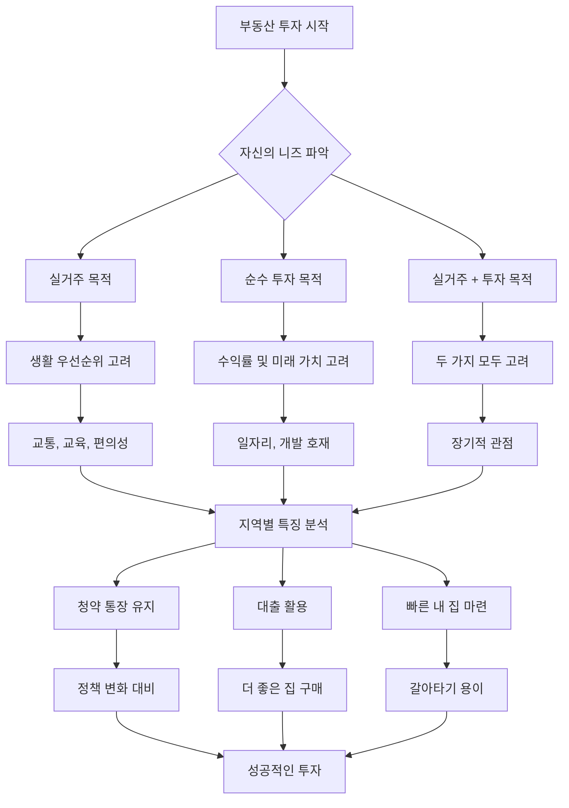

## 경기도 부동산의 힘: 기회의 땅, 경기도 부동산을 파헤치다
이 책은 부동산 전문가 빠숑(김학렬 소장)이 경기도 부동산의 잠재력과 투자 전략을 쉽고 명확하게 설명하는 책이다. 서울보다 더 많은 변화와 성장 가능성을 가진 경기도의 31개 시군을 분석하여, 독자들이 자신에게 맞는 투자처를 찾고 현명한 의사결정을 내릴 수 있도록 돕는다. 특히, 부동산 초보자나 사회 초년생도 쉽게 이해할 수 있도록 대출, 청약, 지역별 특징 등 다양한 궁금증을 해소해준다.

## 1. 왜 지금 경기도 부동산에 주목해야 할까? 

경기도는 서울보다 더 많은 변화와 성장 가능성을 가진 지역으로, 부동산 시장에서 매우 중요한 역할을 한다.

1. **수요의 폭발적 증가**:
  - 경기도는 인구, 일자리, 교통망, 새 아파트 공급 등 모든 면에서 수요가 질적, 양적으로 크게 성장하고 있다.
  - 이는 마치 작은 씨앗이 큰 나무로 자라나는 것처럼, 경기도가 부동산 시장에서 가장 확실하게 커가고 있는 지역이라는 의미이다.
2. **서울과의 격차 해소**:
  - 과거에는 서울이 무조건 인기가 많았지만, 1990년대부터 경기도 내에서도 서울보다 인기 있는 지역이 생기기 시작했다.
  - 2000년대 이후에는 분당, 과천, 동탄처럼 서울 못지않게, 혹은 서울보다 더 선호되는 지역들이 나타나면서 각자도생(각자 살길을 찾아 나서는 것)의 시대가 되었다.
  - 이제는 행정구역(서울, 경기도, 인천)을 따지기보다, 사람들이 얼마나 좋아하는 입지(지역)인지가 부동산 가치를 결정하는 중요한 기준이 되었다.
3. **기회의 땅**:
  - 서울은 이미 개발이 많이 진행되어 새로운 기회가 적지만, 경기도는 아직 택지(건물을 지을 수 있는 땅)가 남아있어 개발 여지가 많다.
  - 공공에서 택지 가격을 지원해주는 경우도 있어, 건축비만 내고 들어갈 수 있는 기회가 많다.
  - 이러한 지역들은 나중에 수요가 많아지면 땅값도 올라가기 때문에, 미리 선점하면 큰 수익을 얻을 수 있다.
  - 마치 아직 덜 알려진 보물섬처럼, 경기도에는 숨겨진 기회들이 많다는 의미이다.

## 2. 경기도 부동산 투자의 핵심 원칙: '나'를 아는 것이 먼저다 

경기도 부동산에 투자할 때는 무조건적인 투자가 아니라, 자신의 상황과 목표를 명확히 아는 것이 가장 중요하다.

1. **자신의 니즈(Needs) 파악**:
  - **목적**: 실거주(내가 살 집) 목적, 순수 투자 목적, 또는 실거주를 고려한 투자 목적인지 명확히 해야 한다.
  - **개인 상황**: 연령대, 재산, 소득 수준을 고려해야 한다.
  - **생활 우선순위**: 출퇴근 거리, 자녀 교육 환경, 부모님과의 동거 여부, 당장의 편의성 또는 미래 가치 중 무엇을 더 중요하게 생각하는지 파악해야 한다.
  - 마치 옷을 살 때 내 몸에 맞고, 내가 어떤 상황에서 입을지 생각하는 것처럼, 부동산도 나에게 맞는 것을 찾아야 한다.
2. **경기도의 다양성 이해**:
  - 경기도는 31개 시군으로 이루어져 있으며, 각 지역마다 특성과 시세가 천차만별이다.
  - 예를 들어, 과천시는 서울 강남 못지않은 시세를 자랑하지만, 연천군은 과천시의 10분의 1 수준으로 저렴하다.
  - 따라서 경기도 전체의 평균 시세는 아무 의미가 없으며, 각 지역별, 심지어 아파트별로 꼼꼼하게 분석해야 한다.
  - 마치 여러 종류의 과일이 있는 과일 바구니에서 내가 좋아하는 과일을 고르듯이, 경기도 내에서도 나에게 맞는 지역을 찾아야 한다.
3. **공부의 중요성**:
  - 서울처럼 정보가 많고 모두가 아는 지역은 그냥 사도 오르는 경우가 많지만, 경기도처럼 잘 모르는 지역은 반드시 공부해야 한다.
  - 과거 부모님 세대에는 아무 부동산이나 사도 올랐지만, 지금은 오르지 않거나 오히려 떨어지는 부동산이 많기 때문에, 내가 산 부동산이 오를 가치가 있는지 공부하는 것이 필수적이다.
  - 공부는 리스크(위험) 요인을 제거하고 성공 확률을 높이는 가장 좋은 방법이다.
  - 마치 시험을 볼 때 공부를 해야 좋은 점수를 받을 수 있는 것처럼, 부동산 투자도 공부를 해야 성공할 수 있다.

## 3. 경기도 주요 지역별 부동산 특징과 투자 팁 

경기도는 넓고 다양한 지역으로 이루어져 있어, 각 지역의 특징을 이해하는 것이 중요하다.

1. **광명시**:
  - **특징**: 서울과 인접해 있고, 대규모 뉴타운 개발로 환경이 크게 개선되고 있는 지역이다.
  - **장점**:
  - **교통**: 7호선 라인을 통해 강남 접근성이 좋다.
  - **주거 환경**: 대규모 새 아파트 단지가 많이 들어서면서 신도시 같은 쾌적한 환경으로 변모하고 있다.
  - **미래 가치**: 공급이 완료되면 완벽한 입지가 될 가능성이 높다.
  - **투자 팁**:
  - 실거주 목적이라면 광명 뉴타운 중 7호선 철산역과 가까운 단지를 고려하는 것이 좋다.
  - 특히 철산역 인근의 12, 13단지는 재건축이 완료된 구역으로, 지금은 저렴하지만 미래 가치가 높다.
  - 새 아파트를 선호한다면 4, 5단지나 11구역을 고려할 수 있다. 11구역은 광명 뉴타운에서 가장 선호되는 구역 중 하나이다.
  - 아이들이 있다면 안양천과 가까워 녹지가 풍부한 12, 13단지가 더 쾌적할 수 있다.
  - 마치 오래된 건물을 리모델링해서 새 건물로 만드는 것처럼, 광명은 대규모 개발을 통해 새로운 도시로 탈바꿈하고 있다.
2. **파주시**:
  - **특징**: 과거에는 전방 지역으로 인식되었으나, 운정신도시 개발과 GTX 개통으로 서울 접근성이 획기적으로 개선되고 있는 지역이다.
  - **장점**:
  - **교통**: GTX 개통으로 파주 운정역에서 서울역까지 21분, 삼성역까지 26~27분이면 도착할 수 있어 서울 강남까지 30분 이내로 이동 가능하다.
  - **주거 환경**: 운정신도시는 대규모 택지 개발로 쾌적한 주거 환경을 제공한다.
  - **미래 가치**: GTX 개통으로 서울의 베드타운(직장은 서울에 두고 잠만 자는 도시)으로서의 가치가 크게 상승할 것으로 예상된다.
  - **투자 팁**:
  - 아직 저렴한 편이므로, GTX 개통 효과를 기대하고 투자하기에 좋은 시기이다.
  - 운정신도시 내에서도 GTX 역에 가까운 아파트를 선택하는 것이 유리하다.
  - 교하 지역도 운정신도시와 같은 생활권이므로, 운정신도시 가격이 오르면 함께 오를 가능성이 높다.
  - 마치 고속도로가 새로 뚫리면 주변 지역의 가치가 올라가는 것처럼, GTX는 파주의 가치를 크게 높이고 있다.
3. **평택시**:
  - **특징**: 삼성전자, LG 등 대기업의 대규모 산업단지가 들어서면서 일자리 중심 도시로 성장하고 있는 지역이다.
  - **장점**:
  - **일자리**: 삼성전자 반도체(고덕신도시), LG 산업단지(브레인시티) 등 대한민국을 이끄는 대기업들이 대거 입주해 있다.
  - **미래 가치**: 일자리가 계속 늘어나면서 장기적인 성장 가능성이 매우 높다.
  - **투자 팁**:
  - 평택은 일자리가 먼저 들어오기 전에 아파트 공급이 많아 미분양(팔리지 않은 아파트)이 많았지만, 정부에서 미분양 관리 지역에서 해제할 정도로 상황이 개선되고 있다.
  - 평택 브레인시티는 LG 산업단지와 대학교가 들어서는 일자리 중심 지역으로, 장기적인 관점에서 투자 가치가 높다.
  - 다만, 일자리가 완전히 들어서고 미분양이 해소되기까지는 최소 5년 이상의 시간이 걸릴 수 있으므로, 장기적인 안목으로 접근해야 한다.
  - 마치 씨앗을 심고 열매를 맺기까지 시간이 걸리는 것처럼, 평택은 장기적인 성장을 기다려야 하는 투자처이다.
4. 과천시:
  - **특징**: 경기도에 속하지만, 사실상 서울 강남구, 서초구와 같은 상급 입지로 평가받는 지역이다.
  - **장점**:
  - 입지: 서초구, 강남구와 붙어 있어 일자리, 교통, 학군, 편의시설 등 모든 면에서 완벽한 조건을 갖추고 있다.
  - **안정성**: 인구가 적지만, 서울 상급 지역과 같은 가치를 지니므로 시세가 빠질 가능성이 거의 없다.
  - **투자 팁**:
  - 과천에 있는 아파트는 신축이든 구축이든 상관없이 투자 가치가 높다.
  - 마치 서울 강남의 아파트처럼, 과천은 이미 검증된 최고의 입지라고 보면 된다.

## 4. 부동산 투자, 불안감 속에서도 기회를 찾는 방법 

경제 대공황이나 부동산 폭락에 대한 불안감은 늘 존재하지만, 중요한 것은 그런 상황 속에서도 자신만의 기회를 찾는 것이다.

1. **불안감은 늘 존재한다**:
  - 세계 경제 대공황이나 부동산 폭락에 대한 이야기는 300년 전부터 지금까지 늘 있어왔고, 앞으로도 계속될 것이다.
  - 특히 젊은 세대는 자산이 없는 상태에서 자산 가치만 오르니 불안감이 더 커질 수 있다.
  - 부정적인 뉴스나 유튜브 콘텐츠는 클릭수를 유도하기 때문에 더욱 확산되는 경향이 있다.
  - 마치 날씨 예보에서 늘 비 올 확률이 있는 것처럼, 경제에도 늘 불안 요소는 존재한다.
2. **부정적인 정보에 매몰되지 않기**:
  - 불안감을 조성하는 정보에만 귀 기울이면 삶이 바뀌는 것은 아무것도 없다.
  - 오히려 이런 어려운 상황에서도 성공하거나 자산을 늘리려고 노력하는 사람들의 모습을 보고 배우는 것이 중요하다.
  - 로버트 기요사키(『부자 아빠 가난한 아빠』 저자)처럼 특정 분야를 넘어 모든 분야를 다 아는 것처럼 주장하는 전문가들의 말은 경계해야 한다.
  - 마치 나쁜 소식만 듣고 아무것도 하지 않으면 아무것도 변하지 않는 것처럼, 부정적인 정보에만 갇히지 않아야 한다.
3. **공부를 통한 기회 발굴**:
  - 호황기에는 아무거나 사도 오르지만, 불황기나 불안정한 시기에는 더 철저하게 공부해야 한다.
  - 공부는 리스크(위험) 요인을 제거하고 성공 확률을 높이는 가장 좋은 방법이다.
  - 성공 사례뿐만 아니라 실패 사례를 통해 '이렇게 하면 안 되겠구나'를 배우는 것도 중요하다.
  - 마치 어려운 시험일수록 더 열심히 공부해야 합격할 수 있는 것처럼, 불안정한 시장일수록 더 깊이 공부해야 한다.
4. **도박이 아닌 투자**:
  - 단기간에 큰 수익을 얻으려는 몰빵 투자(한 곳에 모든 돈을 투자하는 것)나 레버리지(빚을 내서 투자하는 것)는 매우 위험하다.
  - 코인 거래에서 120배 레버리지를 써서 큰돈을 번 사례도 있지만, 이는 극히 일부의 성공 사례일 뿐 대부분은 실패한다.
  - 차근차근 인플레이션(물가 상승) 이상으로 돈을 벌어도 평생 먹고사는 데 지장이 없다.
  - 마치 복권 당첨을 노리는 것보다 꾸준히 저축하고 투자하는 것이 더 안전하고 확실한 방법인 것처럼, 부동산 투자도 도박처럼 접근해서는 안 된다.
5. **심리 다스리기**:
  - 부동산 공부는 결국 자신의 심리를 다스리는 일과 같다.
  - 남들이 몰릴 때 따라 사기보다는 한 발 물러서서 신중하게 판단하고, 여유를 가지고 공부하는 것이 중요하다.
  - 마치 급하게 서두르면 실수를 하는 것처럼, 부동산 투자도 조급한 마음을 버리고 침착하게 접근해야 한다.

## 5. 부동산 초보자를 위한 내 집 마련 및 투자 가이드 

부동산 투자를 처음 시작하는 사회 초년생이나 무주택자에게는 몇 가지 중요한 원칙이 있다.

1. 청약** 통장은 무조건 유지**:
  - **필요성**: 청약 통장은 주택 유무와 관계없이 평생 갖고 가는 것이 이득이다.
  - **혜택**:
  - 이자율이 일반 적금보다 높은 편이다.
  - 청약 정책은 자주 바뀌므로, 통장을 갖고 있으면 어떤 정책 변화에도 유리하게 대응할 수 있다.
  - 1순위 자격을 유지하고, 무주택 기간, 부양가족, 납입 기간 등에 따라 가산점을 받을 수 있다.
  - 최근에는 청년 주택 청약으로 전환하여 대출 혜택을 더 많이, 더 싸게 받을 수 있다.
  - **의미**: 청약 통장은 '나는 부동산에 관심 있고, 내 집 마련을 하려 하며, 적극적으로 갈아타기를 준비하는 사람'이라는 일종의 티켓과 같다.
  - 마치 중요한 시험을 볼 때 응시표를 미리 준비하는 것처럼, 청약 통장은 미래를 위한 필수적인 준비물이다.
2. **집은 무조건 빨리 사라**:
  - **이유**: 월급이나 저축액이 늘어나는 속도보다 집값(특히 좋은 집)이 오르는 속도가 훨씬 빠르다.
  - 갈아타기** 전략**:
  - 처음부터 비싼 강남 아파트를 살 수는 없지만, 3억짜리 집을 사서 6억이 되면, 대출을 보태 10억짜리 집으로 갈아탈 수 있다.
  - 이런 식으로 세네 번 갈아타기를 하면 20억, 30억짜리 집도 마련할 수 있다.
  - 이는 내가 저축한 돈뿐만 아니라, 인플레이션과 집값 상승분에 편승하여 자산을 늘리는 방법이다.
  - **사회 초년생**: 29살에 6천만 원을 모았다면 매우 훌륭한 시작이다. 서울에서는 당장 어렵더라도 경기도 신도시에서 시작할 수 있다.
  - 마치 계단을 하나씩 밟고 올라가야 높은 곳에 도달할 수 있는 것처럼, 작은 집부터 시작해서 점차 좋은 집으로 갈아타는 것이 현명하다.
3. **대출에 대한 인식 전환**:
  - **명언**: "대출로 집을 사는 것이고, 대출은 집으로 갚는 것이다." 즉, 대출을 빨리 갚으려 하지 말고, 집을 통해 대출을 관리하라는 의미이다.
  - **장점**:
  - 대출을 끼고 있으면 더 좋은 집을 살 수 있다. 좋은 집은 더 많이, 더 빨리 오른다.
  - 대출이 있어도 이사하거나 집을 팔 수 있으며, 대출 조건이 좋으면 매수자에게도 유리할 수 있다.
  - **고려 사항**: 자신의 소득으로 대출을 감당할 수 있는지, 그리고 대출 이자를 잘 갚을 수 있는지를 신중하게 고려해야 한다.
  - 마치 사업을 할 때 은행에서 돈을 빌려 사업을 확장하는 것처럼, 대출은 더 좋은 자산을 얻기 위한 도구가 될 수 있다.
4. **투자가 아닌 실수요라도 '팔릴 집'을 사라**:
  - **원칙**: 순수하게 내가 살 집이라고 해도, 나중에 팔 것을 염두에 두어야 한다.
  - **이유**: 모든 부동산이 잘 팔리는 것은 아니며, 내가 원할 때 팔 수 없는 부동산도 많다.
  - **예시**: 2000년대 초반 은퇴자들이 많이 샀던 전원주택은 20년이 지나도 가격이 오르지 않고 팔리지 않는 경우가 많다.
  - **결론**: 만약 팔 것을 전혀 고려하지 않는다면, 굳이 집을 사지 말고 임차(전세나 월세)로 사는 것을 추천한다.
  - 마치 내가 아무리 좋아하는 물건이라도 나중에 팔 수 없다면 가치가 떨어지는 것처럼, 부동산도 팔릴 가능성을 고려해야 한다.
5. 신도시 부동산** 투자 시 고려사항**:
  - 거품** 판단**: 신도시는 새로 생겨서 가격이 적정한지 판단하기 어려울 수 있다.
  - **기준**:
  - 거래량: 특정 가격대로 꾸준히 거래가 이루어진다면 그 가격은 합리적인 시세로 볼 수 있다.
  - **주변 **시세: 강남처럼 이미 검증된 지역의 시세와 비교하여 판단할 수 있다.
  - 수요: 실제로 그 지역에 살고 있는 사람들이 지불하는 가격이 가장 정확한 평가 기준이다.
  - **예시**: 동탄역 롯데캐슬이 4억에 분양되었을 때는 로또라고 했지만, 20억이 넘어가자 거품 논란이 일었다. 하지만 꾸준히 그 가격대로 거래된다면 그것이 시세가 된다.
  - 마치 새로운 브랜드의 옷이 나왔을 때 처음에는 비싸다고 생각하지만, 많은 사람이 사기 시작하면 그 가격이 시장 가격이 되는 것처럼, 신도시 부동산도 수요에 따라 가격이 형성된다.

