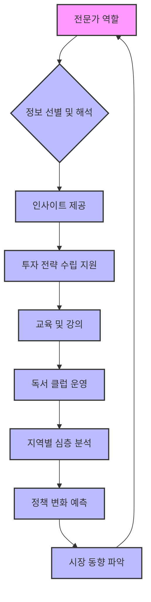

## 1. 책 소개
이 책은 부동산 투자에 대한 기본적인 원칙들을 쉽고 명확하게 설명하는 책이다. 저자는 부동산 시장의 변화를 읽고, 미래 가치가 높은 곳에 투자하는 방법을 알려준다. 특히 초보 투자자들이 흔히 겪는 오류를 지적하고, 성공적인 투자를 위한 실질적인 조언을 제공한다. 이 책은 부동산 시장의 흐름을 이해하고, 자신만의 투자 전략을 세우는 데 도움을 줄 것이다.

## 2. 본문 정리

### 2.1. 부동산 시장의 현재와 미래 

1. **2023년 3월 시장 분위기**:
  1. 작년에는 부동산 시장이 많이 침체되어 있었지만, 2023년 3월부터는 조금씩 풀려나가는 느낌이 든다. 
  2. 이러한 변화는 개인적인 상황뿐만 아니라 전반적인 경기와도 관련이 있다. 
  3. 긍정적인 분위기 속에서 4월을 준비하며, 부동산 시장의 업그레이드를 기대한다. 
2. **부동산 뉴스 브리핑의 중요성**:
  1. 매일 쏟아지는 부동산 뉴스 속에서 중요한 정보를 선별하고, 그 의미를 파악하는 것이 중요하다. 
  2. 단순히 기사를 옮기는 것을 넘어, 자신만의 인사이트(통찰력)를 더해 정보를 해석해야 한다. 
  3. 뉴스 브리핑을 통해 독자들이 부동산 시장을 이해하고, 현명한 의사결정을 할 수 있도록 돕는 것이 목표이다. 
3. **부동산 시장의 변화와 투자 기회**:
  1. 부동산 시장은 항상 변동하며, 이러한 변화 속에서 새로운 투자 기회가 생긴다. 
  2. 특히 규제 완화나 정책 변화는 시장에 큰 영향을 미치므로, 이를 주시해야 한다. 
  3. 현재는 거래량이 살아나고 있는 시기이므로, 가치 있는 아파트를 선별하여 투자할 좋은 기회이다. 

### 2.2. 재건축 및 분양 시장 동향 

1. **신반포 2차 재건축**:
  1. 신반포 2차 아파트가 50층, 2050세대로 재건축되는 신속통합기획(재건축 사업을 빠르게 진행하기 위한 서울시의 지원 프로그램)이 확정되었다. 
  2. 이 소식은 이틀 전에 기사로 나왔지만, 서울시의 공식 보도자료는 어제 저녁에 발표되었다. 
  3. 신반포 2차는 저자가 늘 추천하는 몇 안 되는 단지 중 하나로, 입지가 매우 좋은 아파트이다. 
2. **4월 분양 시장 전망**:
  1. 4월에는 37,000여 가구의 분양 물량이 쏟아질 예정이며, 이는 5년 내 최대 규모이다. 
  2. 하지만 단순히 물량의 숫자에 속지 말고, 우리가 원하는 입지와 상품이 얼마나 공급되는지 꼼꼼히 골라내야 한다. 
  3. 전체 숫자나 평균보다는 지역별, 단지별로 쪼개서 분석하는 것이 중요하다. 
3. **역사적 사건을 통한 부동산 통찰**:
  1. 행주산성 전투(행주대첩)처럼, 7만 명의 일본군에 맞서 3천 명의 정예 군단이 승리한 것처럼, 부동산 시장에서도 37,000개의 물량 중 알짜배기 몇 천 세대가 중요하다. 
  2. 이처럼 역사적 사건을 통해 부동산 시장의 본질을 이해하고, 알짜배기 투자를 찾아내는 교훈을 얻을 수 있다. 
4. **주요 재건축 단지 현황**:
  1. 강남 지역의 주요 재건축 단지들이 신속통합기획을 통해 사업을 추진하고 있다. 
  2. **서초동**: 신반포 2차, 진흥아파트 등이 재건축을 진행 중이다. 진흥아파트는 경부고속도로 소음 문제에도 불구하고, 미래에는 경부고속도로 덮개 공사 등으로 인해 인기가 높아질 가능성이 있다. 
  3. **압구정동**: 현대 9, 11, 12차, 현대 17, 10, 13, 14차, 현대 8차, 한양 3, 4, 6차, 한양 1, 2차, 신현대 등 여러 단지에서 신고가(최고가)가 갱신되고 있다. 
  4. **대치동**: 우성, 미도, 선경 아파트(우선미)가 대치동의 대장 아파트가 될 가능성이 높다. 은마 아파트보다 대형 평수가 많고 입지가 더 좋기 때문이다. 
  5. **개포동**: 우성, 경남, 현대 단지들도 신속통합기획으로 재건축을 추진 중이다. 
  6. **송파동**: 한양 2차, 신천동 장미 3차 등도 재건축을 진행하고 있다. 
5. **아파트 브랜드와 연식**:
  1. 주공, 한신, 한양, 장미 같은 브랜드는 주로 1970년대에서 1980년대 초에 대규모로 공급된 아파트들이다. 
  2. 브랜드를 통해 아파트의 대략적인 연식을 파악할 수 있다. 
  3. 신반포 2차 같은 한신 아파트는 한신공영에서 분양한 단지이다. 

### 2.3. 부동산 정책 변화와 시장 영향 

1. 공공분양** **다자녀 특별공급** 조건 완화**:
  1. 원래 세 자녀부터였던 다자녀 특별공급(특공) 조건이 두 자녀로 낮아질 예정이다. 
  2. 이는 저출산 시대에 다자녀 혜택을 확대하려는 의도이지만, 두 자녀 가구가 많아지면서 경쟁률이 높아질 수 있다. 
  3. 결과적으로 세 자녀 이상 가구의 혜택이 줄어들고, 다자녀 특공의 메리트가 감소할 수 있다. 
  4. 이러한 정책 변화는 투자 전략을 다시 짜야 할 필요성을 제기한다. 
2. 분양권 전매 제한 완화** 및 **실거주 의무 폐지:
  1. 분양권 전매 제한 완화와 실거주 의무 폐지가 4월 초 국회에서 통과될 가능성이 높다. 
  2. **실거주 의무 폐지의 필요성**:
  - 실거주 의무는 투기꾼 보호가 아니라, 임차 물건 공급을 원활하게 하는 데 필요하다. 
  - 새 아파트의 절반 정도가 임차 물건으로 공급되어야 하는데, 실거주 의무 때문에 집주인만 입주하게 되어 임차 물건이 없어진다. 
  - 이는 임차인들이 가장 저렴하게 새 아파트에 살 수 있는 기회를 박탈하는 것이다. 
  - 실거주 의무는 임차인, 건설사, 조합, 정부 모두에게 손해를 끼치는 '루즈-루즈' 상황을 만든다. 
  - 국가에서 임차 시장의 공급을 100% 책임질 수 없다면, 민간 시장의 자율성을 존중해야 한다. 
  3. **정책의 부작용**:
  - 정책이 특정 집단에만 이득을 주고 다른 집단에 피해를 주면 안 된다. 
  - 국민에게 피해를 주는 쓸데없는 법은 직무유기이며, 합리적인 공론화를 통해 개선해야 한다. 
  - 지난 정부에서 만든 실거주 의무는 세입자들을 괴롭히는 정책이었으므로, 빨리 폐지해야 한다. 
3. **공공분양 '줍줍' 기회**:
  1. 수서, 위례 등 2기 신도시에서 주변 시세의 절반 가격으로 공공분양 '줍줍'(미계약 물량 재분양) 기회가 많다. 
  2. 이러한 물량은 입지가 검증된 곳에 저렴하게 공급되므로, 당첨만 되면 로또와 같은 기회가 될 수 있다. 
  3. 정부 정책이 투자를 돕는 시기에 적극적으로 내 집 마련을 하는 것이 현명하다. 
4. 생활형 숙박시설**(생숙) 문제**:
  1. 생활형 숙박시설을 주거용으로 사용하는 것을 방치했던 지난 정부의 책임이 크다. 
  2. 분양 당시 주거용으로 홍보했지만, 법적으로 주거용이 아니어서 현재 8만 가구가 벌금 폭탄 위기에 처해 있다. 
  3. 생숙은 오피스텔이나 아파트처럼 활용도가 높지 않아 애물단지가 되었으며, 정부도 해결책을 찾기 어렵다. 
  4. 주거 수요는 아파트로 해결해야 하며, 생숙이나 오피스텔은 대체 상품이 될 수 없다. 
5. **빌라 전세 사기 및 공시가 하락**:
  1. 빌라 전세 사기(빌라왕 사태)와 공시가(정부가 정한 부동산 가격) 하락으로 빌라 시장이 불안정하다. 
  2. 2021년 전후로 아파트 공급이 부족하자 빌라 공급이 늘면서 가격이 비정상적으로 높아졌고, 이는 서민들에게 큰 피해를 주었다. 
  3. 정책 실패가 서민들에게 직접적인 피해를 주는 사례이므로, 시장의 필요를 반영한 정책이 중요하다. 
6. 3기 신도시** 착공과 임차 수요**:
  1. 고양 창릉 등 3기 신도시 착공은 토지 조성 사업이므로, 당장 입주할 아파트를 만드는 것이 아니다. 
  2. 사전 청약 당첨자들은 입주 전까지 임차(전세나 월세)로 살아야 하므로, 안정적인 임차 물량 공급이 필요하다. 
  3. 실거주 의무 폐지가 필요한 이유 중 하나도 3기 신도시 입주 예정자들의 임차 수요를 해소하기 위함이다. 
  4. 1가구 2주택 규제는 이사 수요를 막아 시장의 유동성을 저해하므로, 절대 규제해서는 안 된다. 
7. 토지 임대부** 주택의 문제점**:
  1. 토지 임대부 주택(토지는 국가 소유, 건물만 개인 소유)은 재건축이 어렵다는 구조적인 문제가 있다. 
  2. 재건축은 토지와 건물을 동시에 소유해야 조합원 자격이 주어지는데, 토지 임대부 주택은 이 조건에 맞지 않는다. 
  3. 회원 시범 아파트 등 오래된 토지 임대부 주택들이 재건축을 못 하고 있는 상황이다. 
  4. 토지 임대부 제도가 지속되려면 재건축 기준을 변경하는 등 제도 개선이 필요하다. 

### 2.4. 부동산 시장의 주요 지표와 분석 

1. 상권 활성화** 지표**:
  1. 명동, 강남역, 압구정 로데오 등 주요 상권의 공실률(빈 상가 비율)이 줄어들고 임대료가 상승하며 활기를 되찾고 있다. 
  2. 서울시에서 140개 상권에 대한 임대료, 업종, 면적, 매출액 등 상세 데이터를 제공하고 있어 상권 분석에 유용하다. 
  3. 이러한 데이터는 상가 투자자들에게 좋은 자료가 될 수 있다. 
2. **서울 아파트 거래량 증가**:
  1. 서울 아파트 월 거래량이 2월에 2,400건을 돌파했으며, 이는 1월(1,400건) 대비 거의 두 배 가까이 증가한 수치이다. 
  2. 부동산 신고 기간을 고려하면 실제 거래량은 더 늘어날 수 있다. 
  3. 정상적인 시장의 거래량은 5,000건에서 1만 건 정도이므로, 아직 더 증가해야 한다. 
  4. 거래량 증가는 시장이 살아나고 있다는 긍정적인 신호이다. 
3. **분양 시장의 **양극화:
  1. 평택 고덕 자이처럼 입지가 좋은 단지는 높은 경쟁률로 완판(모든 물량이 다 팔림)되지만, 같은 평택 내에서도 화양지구처럼 입지가 좋지 않은 곳은 미분양(팔리지 않은 물량)이 발생한다. 
  2. 거제 지역은 여전히 미분양이 많아 시장이 어렵다. 
  3. 이는 분양 시장에서도 '옥석 가리기'(좋은 것과 나쁜 것을 구별하는 것)가 중요함을 보여준다. 
4. **부동산 기사의 **팩트 체크:
  1. 언론에서 '압구정 현대 3억 하락', '타워팰리스 1억 하락' 등 자극적인 기사를 내보내지만, 이는 전체 시장을 반영하지 못하는 경우가 많다. 
  2. 고가 아파트의 몇 억 단위 변동은 일반적인 시세 변동 범위 내에 있을 수 있으며, 신고가(최고가)를 갱신하는 단지도 많다. 
  3. 일부 고가 주택(상지 리츠빌 카일룸 등)은 일반 아파트와는 다른 특성을 가지므로, 단순 비교는 어렵다. 
  4. 기사 내용을 맹신하기보다는, 다양한 각도에서 시장을 분석하고 팩트를 확인하는 것이 중요하다. 
5. **직방 통계의 한계**:
  1. 직방(부동산 앱)에서 발표하는 '집값 하락 전망' 통계는 직방 사용자(부동산에 관심이 많은 무주택자, 투자자 등)를 대상으로 하므로, 일반 국민의 인식을 대변한다고 보기 어렵다. 
  2. 투자자들은 현재 급매(급하게 파는 물건)를 팔고 있는 상황이 많아 하락에 대한 인식이 강할 수 있다. 
  3. 통계를 볼 때는 조사 대상, 샘플링 방법 등을 고려하여 해석해야 한다. 
6. **전월세 시장 동향**:
  1. 금리 인상으로 전세 대출 이자가 높아지면서, 전세보다 월세가 이득인 상황이 발생하고 있다. 
  2. 하지만 이는 일시적인 현상으로, 금리가 안정화되면 다시 전세의 인기가 높아질 것이다. 
  3. 전세 제도는 집주인과 세입자 모두에게 이득이 되는 좋은 제도이므로, 쉽게 사라지지 않을 것이다. 
  4. 월세화가 고착화되려면 시장 안정화와 높은 월세 수익률이라는 두 가지 조건이 충족되어야 하는데, 현재 한국 시장에서는 어렵다. 
7. **정부 정책과 지지율**:
  1. 윤석열 대통령의 지지율 하락은 경기 침체와 세금 부담 증가 등 경제적 요인이 크다. 
  2. 정부는 세금 부담을 줄여 지지율을 회복하려 노력하고 있지만, 공공임대나 무주택자 금융 지원에는 예산 제약이 따른다. 
  3. 결국 민간 임대 사업자 활성화나 상생 임대인 제도 확대 등 민간의 역할을 활용하는 정책이 필요하다. 
8. **하남 교산 **신도시** **토지 보상 완료:
  1. 하남 교산 신도시의 토지 보상이 100% 완료되어 사업 진척에 대한 기대감이 높다. 
  2. 하지만 수도권 신도시 개발 시 문화재 발굴 등으로 공사가 지연될 가능성이 있어, 이를 주의해야 한다. 
  3. 하남 교산은 많은 사람들이 선호하는 입지이므로, 빠른 개발을 통해 주택 공급이 이루어지기를 바란다. 

### 2.5. 부동산 투자 절대 원칙 

1. **어떤 집을 사야 하는가**:
  1. 현재 가치는 낮고** **미래 가치가 높은 곳: 지금은 저평가되어 있지만, 앞으로 발전 가능성이 큰 지역에 투자해야 한다. 
  - **현재 가치**: 교통, 직장, 일자리, 생활 환경, 주변 인프라, 자연환경 등 현재의 편리함을 말한다. 
  - **미래 가치**: 앞으로 생겨날 일자리, 교통망, 호재(좋은 소식) 등 미래에 가치를 높일 요소를 말한다. 
  2. **현재 수요는 낮고 미래 수요가 높은 곳**: 지금은 사람들이 많이 찾지 않지만, 미래에는 많은 사람이 몰릴 곳을 선점해야 실패할 일이 없다. 
2. **주목해야 할 지역**:
  1. **서울 및 수도권**: 서울은 앞으로도 계속 상승할 것이며, 경기, 인천도 입지가 좋아질 지역이다. 
  - **경기도 성남**: 강남과 강북의 차이는 있지만, 한강변과 맞닿은 지역은 크게 상승할 것이다. 
  - **인천**: 송도, 청라, 검단 신도시가 주목할 만하다. 
  2. **저자가 꼽은 5곳**: 고양시, 평택시, 의정부시, 성남시, 화성시를 주목해야 한다. 
  - **화성시**: 아파트 세대수(28.3만) 대비 인구수(87만)가 많고, 사업체 수와 종사자 수가 앞으로 늘어날 계획이 있어 미래 가치가 높다. 
  - **고양시**: 현재 가치는 낮지만, 2023년 대곡소사선, 2024년 GTX-A 개통 등 교통 호재로 미래 가치가 크게 상승할 것이다. 
  - 고양시 덕양구 삼송 벨트(삼송, 원흥, 지축)는 서울과 비교해도 좋을 지역으로, 특히 주목해야 한다. 
  - 현재 고양시의 평당가는 경기도 평균과 비슷하지만, 앞으로 15억 이상으로 치솟을 가능성이 있다. 
3. **부동산 시장의 양극화와 상승 전망**:
  1. 서울을 포함한 수도권은 일자리, 학군, 편의시설(병원 등)이 집중되어 있어 수요가 계속 몰릴 것이다. 
  2. 코로나19 이후 건강과 웰빙에 대한 관심이 높아지면서 수도권으로의 수요 집중 현상이 심화될 것이다. 
  3. 부동산 가격은 계속 오를 것이며, 특히 이미 오르고 있는 곳들이 더 오르는 양극화 현상이 심화될 것이다. 
  4. 무주택자(집이 없는 사람)는 하루라도 빨리 내 집 마련을 해야 한다. 
4. **매수 및 **매도 타이밍** 전략**:
  1. 매수 타이밍: 남들이 안 살 때 사야 한다. 
  2. **매도 타이밍**: 남들이 안 팔 때 팔아야 한다. 
  3. **매수 단계부터 매도 전략 수립**: 집을 살 때부터 나중에 팔 것을 고려하여 전략을 세워야 한다. 
  - 예를 들어, 대장 아파트(지역 내 가장 좋은 아파트)를 살 것인지, 차선책을 살 것인지 미리 판단해야 한다. 
  - 싸다고 무조건 사는 것이 아니라, 싼 이유를 파악하고 팔 때를 생각하며 신중하게 결정해야 한다. 
  4. **첫 주택 마련의 중요성**:
  - 무주택자는 빌라나 다가구보다는 아파트를 첫 주택으로 마련하는 것이 좋다. 
  - 자금 상황에 맞춰 20평대부터 시작하여 신중하게 결정해야 한다. 
5. **수익률과 주택 선택**:
  1. 가장 좋은 주택(예: 강남의 최고급 아파트)은 수익률이 낮을 수 있으며, 오히려 애매한 주택이 수익률이 높을 때도 있다. 
  2. 무조건 서울에 있는 집을 사는 것보다, 서울과 비교해도 좋을 지역(광명, 구리, 하남, 고양 등)을 선택하는 것이 현명하다. 
  3. 나쁜 것을 팔기보다는 상황에 맞춰 매도 전략을 세워야 한다. 
  - 예를 들어, 다주택자(집을 여러 채 가진 사람)는 종합부동산세(집을 많이 가진 사람에게 부과하는 세금) 부담 때문에 매도해야 할 경우, 임대사업자(집을 빌려주고 월세를 받는 사업자) 전환이나 증여(재산을 물려주는 것) 등 장기적인 플랜을 고려해야 한다. 
6. **투자 리스크와 주택 보유 전략**:
  1. 하이 리스크 하이 리턴(위험이 높으면 수익도 높고), 로우 리스크 로우 리턴(위험이 낮으면 수익도 낮다)의 원칙이 부동산에도 적용된다. 
  2. 1등 주택(가장 좋은 주택)은 리스크가 낮지만 비싸다. 
  3. **1가구 2주택 전략**:
  - 능력이 된다면 1가구 2주택(집을 두 채 가진 것)까지는 문제없다고 본다. 
  - 한 채는 본인이 거주하고, 다른 한 채는 임대(전세나 월세)를 주면서 장기적으로 가져가는 전략이 좋다. 
  - 자식에게 증여하거나 양도(재산을 넘겨주는 것)하는 등 다양한 활용이 가능하다. 
  4. **무주택자의 1주택 마련**:
  - 무주택자는 무조건 1주택을 마련해야 한다. 
  - 이왕이면 지역의 대장 주택을 매수하고, 자금 여건이 안 되면 차선책(2등, 3등 아파트)을 선택해도 좋다. 
7. **기관별 관심 부동산**:
  1. **장기 투자**: 국가에서 개발하는 신도시, 3기 신도시, GTX(수도권 광역급행철도) 노선 주변 지역 등이다. 
  - 종잣돈(투자 시작 자금)이 없는 무주택자는 사전 청약(본격적인 분양 전 미리 신청하는 것)에 도전하는 것이 좋다. 
  - 고양 창릉, 양주 장흥 등 3기 신도시 지역과 덕은지구 국방대학교 부지 분양을 노려볼 만하다. 
  2. **중기 투자**: 기존 아파트, 재건축, 재개발, 리모델링 단지 등이다. 
  - 청약(새 아파트 분양 신청)은 전략적으로 접근해야 하며, 무조건 도전하기보다는 신중한 계획이 필요하다. 
  3. **단기 투자**: 변동성이 큰 아파트, 각종 비규제 상품 등이다. 
8. **주목해야 할 주거 트렌드**:
  1. **새 아파트 선호**: 앞으로도 새 아파트에 대한 수요는 계속 급증할 것이다. 
  2. **교육 환경과 주거 타운**: 교육 환경이 좋고 주거 인프라가 잘 갖춰진 지역(강남, 삼성동, 잠실동 등)은 더욱 인기가 높아질 것이다. 
  3. 입지** 이론보다 입지 회귀**: 단순히 이론적인 입지 분석보다는, 실제로 사람들이 선호하고 가치가 회귀하는(원래 가치를 찾아가는) 입지가 중요하다. 
9. **부동산 공부의 중요성**:
  1. 부동산 시장은 끊임없이 변화하므로, 꾸준히 공부하고 정보를 습득해야 한다. 
  2. 뉴스 브리핑이나 관련 서적을 통해 자신만의 인사이트를 키우는 것이 중요하다. 
  3. 책을 읽을 때는 밑줄을 긋고 여러 번 읽으면서 내용을 완전히 이해해야 한다. 
10. **내 집 마련의 필요성**:
  1. 가격이 오르든 내리든, 서울에 집이 필요하면 서울에, 지방에 집이 필요하면 지방에 집을 사야 한다. 
  2. 하락장에서도 오르는 아파트가 있고, 상승장에서도 오르지 않는 아파트가 있으므로, 묻지마 투자는 피해야 한다. 
  3. 무주택자는 하루라도 빨리 내 집 마련을 하는 것이 중요하다. 

### 2.6. 부동산 시장의 오해와 진실 

1. **언론 보도의 맹점**:
  1. 언론은 종종 자극적인 헤드라인(기사 제목)으로 독자의 클릭을 유도한다. 
  2. '압구정 현대 3억 하락', '타워팰리스 1억 하락' 같은 기사는 전체 시장의 흐름을 왜곡할 수 있다. 
  3. 고가 아파트의 몇 억 단위 변동은 일반적인 시세 변동 범위 내에 있을 수 있으며, 오히려 신고가(최고가)를 갱신하는 단지도 많다. 
  4. 일부 초고가 주택(상지 리츠빌 카일룸)은 일반 아파트와는 다른 특성을 가지므로, 단순 비교는 적절하지 않다. 
  5. 기사 내용을 맹신하기보다는, 양쪽의 시각을 모두 보고 팩트를 확인하는 것이 중요하다. 
2. **직방 통계의 오해**:
  1. 직방(부동산 앱)에서 발표하는 '집값 하락 전망' 통계는 직방 사용자(부동산에 관심이 많은 층)를 대상으로 하므로, 일반 국민의 인식을 대변한다고 보기 어렵다. 
  2. 투자자들은 현재 급매(급하게 파는 물건)를 팔고 있는 상황이 많아 하락에 대한 인식이 강할 수 있다. 
  3. 통계를 볼 때는 조사 대상, 샘플링 방법 등을 고려하여 해석해야 한다. 
3. **전월세 시장의 진실**:
  1. 금리 인상으로 전세 대출 이자가 높아지면서, 전세보다 월세가 이득인 상황이 발생하고 있다. 
  2. 하지만 이는 일시적인 현상으로, 금리가 안정화되면 다시 전세의 인기가 높아질 것이다. 
  3. 전세 제도는 집주인과 세입자 모두에게 이득이 되는 좋은 제도이므로, 쉽게 사라지지 않을 것이다. 
  4. 월세화가 고착화되려면 시장 안정화와 높은 월세 수익률이라는 두 가지 조건이 충족되어야 하는데, 현재 한국 시장에서는 어렵다. 
4. **정부 정책과 지지율의 상관관계**:
  1. 윤석열 대통령의 지지율 하락은 경기 침체와 세금 부담 증가 등 경제적 요인이 크다. 
  2. 정부는 세금 부담을 줄여 지지율을 회복하려 노력하고 있지만, 공공임대나 무주택자 금융 지원에는 예산 제약이 따른다. 
  3. 결국 민간 임대 사업자 활성화나 상생 임대인 제도 확대 등 민간의 역할을 활용하는 정책이 필요하다. 
5. 신도시** 개발의 현실**:
  1. 하남 교산 신도시의 토지 보상이 100% 완료되어 사업 진척에 대한 기대감이 높다. 
  2. 하지만 수도권 신도시 개발 시 문화재 발굴 등으로 공사가 지연될 가능성이 있어, 이를 주의해야 한다. 
  3. 하남 교산은 많은 사람들이 선호하는 입지이므로, 빠른 개발을 통해 주택 공급이 이루어지기를 바란다. 

### 2.7. 부동산 투자 전문가의 역할 

1. **정보의 선별과 해석**:
  1. 매일 쏟아지는 수많은 부동산 뉴스 속에서 중요한 정보를 선별하고, 그 의미를 정확하게 해석하는 것이 전문가의 역할이다. 
  2. 단순히 기사를 전달하는 것을 넘어, 자신만의 통찰력(인사이트)을 더해 독자들이 시장을 이해하도록 돕는다. 
  3. 예를 들어, 언론의 자극적인 기사나 통계의 함정을 지적하고, 실제 시장의 본질을 파악하도록 돕는다. 
2. **실질적인 투자 전략 제시**:
  1. 수많은 분양 물량 속에서 알짜배기 단지를 골라내는 방법이나, 정책 변화에 따른 투자 전략을 제시한다. 
  2. 역사적 사건이나 시장의 흐름을 통해 투자에 대한 교훈을 얻도록 돕는다. 
  3. 특히 무주택자나 초보 투자자들이 현명하게 내 집 마련을 할 수 있도록 구체적인 조언을 제공한다. 
3. **교육 및 강의 활동**:
  1. 온라인 강의(아이매피님 강의, 앨리스님 강의 등)를 통해 청약, 분양권, 재건축, 재개발, 갭 투자 등 다양한 분야의 전문 지식을 전달한다. 
  2. 오프라인 특강이나 독서 클럽을 운영하여 수강생들이 직접 질문하고 소통하며 배울 수 있는 기회를 제공한다. 
  3. 강의를 통해 수억 원의 수익을 얻을 수 있는 실질적인 투자 노하우를 알려준다. 
4. **지역별 심층 분석**:
  1. 특정 지역(예: 인천)의 과거, 현재, 미래를 깊이 있게 분석하여 투자 지도를 제시한다. 
  2. 이를 통해 독자들이 해당 지역의 부동산 시장을 정확하게 이해하고 투자 결정을 내릴 수 있도록 돕는다. 
5. **정책 변화 예측 및 대응**:
  1. 정부의 부동산 정책 변화(다자녀 특공, 실거주 의무 폐지 등)가 시장에 미칠 영향을 예측하고, 이에 대한 대응 전략을 제시한다. 
  2. 정책의 부작용을 지적하고, 합리적인 개선 방안을 제시하여 국민들의 피해를 최소화하는 데 기여한다. 
6. **지속적인 콘텐츠 제공**:
  1. 매일 뉴스 브리핑을 진행하고, 블로그나 프리미엄 콘텐츠를 통해 양질의 정보를 꾸준히 제공한다. 
  2. 독자들이 부동산 시장의 흐름을 놓치지 않고, 항상 최신 정보를 접할 수 있도록 노력한다. 

