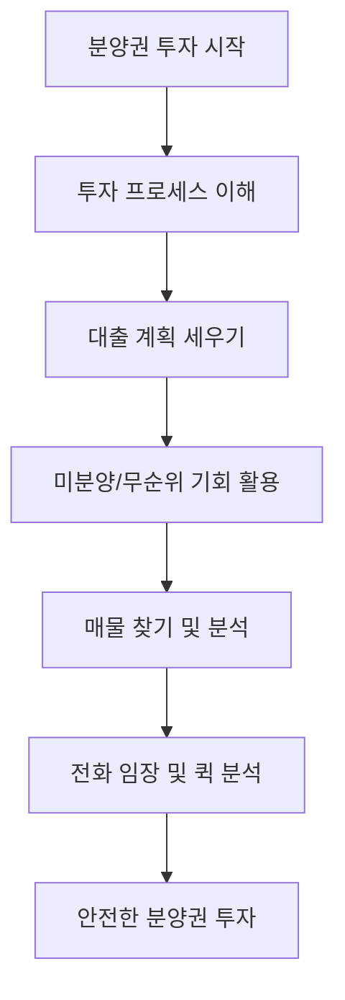
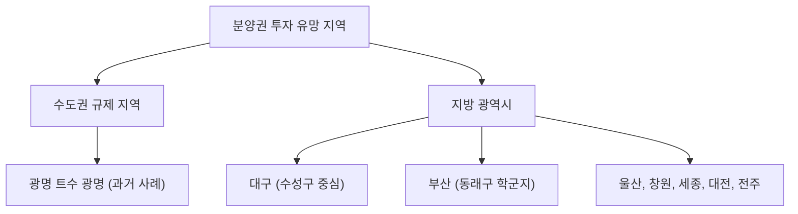

## 나는 당첨 없이 분양권으로 새 아파트 산다: 책 요약
이 책은 청약 당첨 없이도 분양권 투자를 통해 새 아파트를 마련하고 경제적 자유를 얻는 방법을 알려주는 실용적인 가이드이다. 저자는 평범한 워킹맘에서 분양권 투자로 자산을 불린 경험을 바탕으로, 적은 자본으로도 새 아파트를 소유할 수 있는 전략과 노하우를 쉽고 자세하게 설명한다.

## 1. 분양권 투자가 지금 가장 좋은 이유 

지금처럼 부동산 시장이 복잡하고 규제가 많은 시기에도 분양권 투자는 아주 좋은 기회가 될 수 있다. 마치 복잡한 길에서 지름길을 찾는 것과 같다고 보면 된다.

1. **규제가 오히려 기회**:
  - 정부의 대출 규제(대출을 못 받게 막는 것)가 많아지면서, 원래는 새 아파트에 들어가 살려고 했던 사람들이 갑자기 돈을 마련하기 어려워지는 경우가 많다. 
  - 이런 사람들은 어쩔 수 없이 자기가 가지고 있던 분양권을 싸게 내놓게 되는데, 이걸 '급매'라고 부른다. 
  - 이때 돈을 미리 준비해 둔 사람들은 좋은 아파트를 싸게 살 수 있는 절호의 기회를 잡을 수 있다. 
  - 마치 다른 사람들이 급하게 물건을 팔 때, 내가 싸게 살 수 있는 것과 같은 이치이다. 
2. 새 아파트** **공급 부족:
  - 앞으로 몇 년간은 새 아파트가 지어지는 양이 많이 줄어들 예정이다. 
  - 특히 서울은 작년보다 새 아파트 입주 물량이 절반으로 줄어들었다. 
  - 새 아파트는 점점 귀해지고, 사람들은 계속 새 아파트를 원하기 때문에 그 가치는 더 올라갈 수밖에 없다. 
  - 마치 한정판 물건처럼, 구하기 어려워지면 가격이 오르는 것과 같다.
3. 청약보다 유리한** 점**:
  - 요즘 청약(새 아파트 분양 신청)은 경쟁률이 너무 높고(수백 대 1), 분양가도 비싸다. 
  - 분양권은 이미 분양된 아파트의 권리를 사는 것이기 때문에, 내가 원하는 동과 호수를 직접 선택할 수 있다. 
  - 청약은 당첨될지 안 될지 운에 맡겨야 하지만, 분양권은 내가 직접 선택해서 살 수 있다는 장점이 있다. 
  - 마치 복권 당첨을 기다리는 것보다, 내가 원하는 물건을 직접 골라 사는 것과 비슷하다.

## 2. 분양권과 입주권, 무엇이 다를까? 

새 아파트를 얻는 방법 중에는 '분양권'과 '입주권'이 있는데, 이 둘은 비슷해 보이지만 중요한 차이가 있다. 마치 새 차를 사는 방법 중에 '완성된 차를 사는 것'과 '조립 키트를 사서 만드는 것'의 차이라고 보면 된다.

1. 분양권** (**새 아파트** 분양 **계약** 권리)**:
  - 아파트가 다 지어지기 전에, 건설사로부터 아파트를 분양받을 수 있는 권리이다. 
  - 초기 비용이 적게 든다는 큰 장점이 있다. 보통 분양가의 10% 정도만 있으면 살 수 있다. 
  - 예를 들어, 3억짜리 아파트라면 3천만 원만 있으면 시작할 수 있다. 
  - 잔금을 치를 때까지 2~3년 정도의 시간적 여유가 있어서, 그동안 돈을 모을 수 있다. 
  - 내가 원하는 동과 호수를 직접 선택할 수 있다. 
  - 마치 새 차를 계약금만 내고 미리 예약해두는 것과 같다.
2. 입주권** (재개발/재건축 조합원 권리)**:
  - 재개발이나 재건축을 통해 새 아파트에 입주할 수 있는 권리이다. 
  - 조합원 분양가로 일반 분양보다 조금 더 저렴하게 살 수 있고, 좋은 동호수를 먼저 선점할 수 있다. 
  - 무상 옵션(추가 비용 없이 제공되는 것) 같은 혜택도 있는 경우가 많다. 
  - 하지만 초기 투자 비용이 분양권보다 훨씬 많이 들어간다. 
  - 마치 새 차를 사기 위해 부품을 미리 사두고 조립하는 것과 비슷해서, 초기 비용이 많이 드는 셈이다.
3. **분양권이 더 유리한 경우**:
  - 요즘처럼 대출 규제가 심하고 자금이 부족할 때는 초기 비용이 적게 드는 분양권이 더 유리할 수 있다. 
  - 입주권은 좋지만 돈이 많이 들어가서 못 사는 경우가 많다. 
  - 동호수가 아주 좋지 않더라도, 분양권으로 새 아파트를 마련하는 것이 현명한 선택이 될 수 있다. 

## 3. 분양권 투자, 이것만은 조심하자! 

분양권 투자는 분명 좋은 기회지만, 잘못하면 큰 손해를 볼 수도 있다. 마치 맛있는 음식을 먹으러 갔는데, 잘못된 식당을 고르면 배탈이 날 수 있는 것과 같다.

1. **충동적인 **미분양** 계약은 위험**:
  - 미분양 아파트(분양이 안 된 아파트)는 분양가 그대로 살 수 있어서 싸게 느껴질 수 있다. 
  - 모델하우스에 가면 상담사들이 말을 너무 잘해서, 나에게 딱 맞는 것처럼 느껴지게 한다. 
  - 하지만 주변 시세와 비교해보면 비싸게 사는 경우도 많다. 
  - 계약을 쉽게 생각하고 했다가, 나중에 해제하려고 해도 안 되는 경우가 많다. 
  - 계약을 해제하지 못하면 중도금 대출 이자가 계속 붙고, 신용도도 나빠질 수 있다. 
  - 마치 홈쇼핑에서 충동적으로 물건을 샀다가 후회하는 것과 비슷하다.
2. **비싼 분양권은 피해야 한다**:
  - 분양권이라고 해서 무조건 싸다고 생각하면 안 된다. 
  - 요즘 분양하는 아파트 중에는 분양가가 너무 비싼 경우가 많다. 
  - 아무리 '마피'(마이너스 프리미엄, 분양가보다 싸게 파는 것)가 붙어도, 전체 가격이 비싸면 이득이 없을 수 있다. 
  - 항상 주변의 비슷한 새 아파트나 기존 아파트 가격과 비교해서, 적정한 가격인지 확인해야 한다. 
  - 마치 할인한다고 해서 무조건 사는 게 아니라, 원래 가격이 얼마인지 따져봐야 하는 것과 같다.
3. 중도금 대출** 승계 확인 필수**:
  - 분양권을 살 때, 이전에 계약한 사람이 받았던 중도금 대출을 내가 이어서 받을 수 있는지(승계) 꼭 확인해야 한다. 
  - 당연히 될 거라고 생각했다가 승계가 안 되면, 내가 직접 중도금을 내야 하는 큰 문제가 생긴다. 
  - 중도금은 보통 분양가의 계약금과 잔금을 뺀 나머지 금액을 여러 번 나눠 내는 것인데, 3억짜리 아파트라면 1억 5천만 원 정도 될 수 있다. 
  - 이 큰돈을 갑자기 내야 한다면 정말 끔찍한 상황이 될 수 있다. 
  - 마치 친구에게 차를 빌려 탔는데, 보험 승계가 안 돼서 사고 나면 내가 다 책임져야 하는 것과 비슷하다.

## 4. 분양권 투자, 이렇게 시작하자! 

분양권 투자를 성공적으로 하려면 체계적인 준비와 전략이 필요하다. 마치 처음 가는 여행을 떠나기 전에, 여행 계획을 꼼꼼하게 세우는 것과 같다고 보면 된다.

1. 분양권** 매수 절차 이해**:
  - 분양권을 어떻게 사야 하는지, 그 과정을 정확히 알아야 한다. 
  - 책에는 분양권 매수 절차가 자세히 정리되어 있으니, 이 프로세스를 먼저 익히는 것이 중요하다. 
  - 마치 요리를 하기 전에 레시피를 먼저 읽어보는 것과 같다.
2. **대출 계획 철저히 세우기**:
  - 분양권은 중도금 대출과 잔금 대출을 받아야 하는 경우가 많다. 
  - 많은 사람들이 대출이 당연히 될 거라고 생각하지만, 안 되는 경우도 있으니 미리 확인해야 한다. 
  - 특히 잔금 대출은 규제 지역(정부가 정한 특별 관리 지역)에서는 대출 규제가 적용될 수 있으니, 미리 대출 상담을 받아보는 것이 좋다. 
  - 마치 큰돈을 빌리기 전에 은행에 가서 내가 얼마나 빌릴 수 있는지 미리 알아보는 것과 같다.
3. 미분양** 및 **무순위** 분양권 활용**:
  - 미분양(분양이 안 된 아파트)이나 무순위(청약 미달로 다시 분양하는 것) 분양권은 잘만 활용하면 아주 저렴하게 살 수 있는 기회가 된다. 
  - 저자도 미분양으로 분양권을 매수해서 성공한 경험이 있다. 
  - 하지만 무조건 싸다고 사는 것이 아니라, 해당 지역의 흐름(수요와 공급 상황)을 잘 보고 신중하게 결정해야 한다. 
  - 마치 떨이 상품을 살 때, 물건의 상태와 유통기한을 확인하는 것과 같다.
4. **매물 찾기 및 분석 노하우**:
  - 분양권 매물을 찾는 방법부터, 고분양가(너무 비싼 분양가)인지 아닌지 확인하는 간단한 방법까지 책에 자세히 나와 있다. 
  - 전화 임장법: 직접 현장에 가지 않고도 전화로 물건을 확인하는 방법이다. 바쁜 직장인들에게 아주 유용하다. 
  - 퀵 분석법: 복잡한 계산 없이도 이 분양권이 좋은지 나쁜지 빠르게 판단하는 방법이다. 
  - 마치 인터넷으로 물건을 살 때, 후기를 찾아보고 가격 비교를 하는 것과 같다.

## 5. 분양권 투자, 어디에 해야 할까? 

분양권 투자는 지역 선택이 매우 중요하다. 마치 씨앗을 심을 때, 어떤 땅에 심어야 잘 자랄지 아는 것과 같다고 보면 된다.

1. **수도권 **규제** 지역의 일시적 **마피:
  - 규제(정부의 부동산 정책) 때문에 일시적으로 '마피'(마이너스 프리미엄, 분양가보다 싸게 파는 것)가 나온 곳들이 있다. 
  - 이런 곳들은 입주 물량이 적고 미분양도 없어서, 흐름이 괜찮은 경우가 많다. 
  - **광명 트수 광명 사례**: 2024년 12월쯤 광명 트수 광명 아파트에서 마피가 나왔을 때, 어떤 사람들은 광명이 끝났다고 했지만, 저자는 아니라고 보았다. 
  - 당시 33평이 10억 정도였는데, 지금은 13억~15억에 거래되고 있다. 
  - 마치 일시적으로 주가가 떨어진 우량주를 싸게 사는 것과 같다.
2. **지방 광역시의 흐름**:
  - **대구**: 수성구를 중심으로 신축 아파트들이 계속 가격이 오르고 있다. 
  - 범어W 같은 대장 아파트는 최근 30평대가 18억에 계약되기도 했다. 
  - 주변 아파트들도 이 흐름을 따라가는 분위기이다. 
  - **부산**: 분위기가 매우 뜨겁다. 2024~2025년이 거의 바닥이었다고 본다. 
  - 동래구 같은 학군지(좋은 학교가 많은 지역)는 매물이 없고 호가가 계속 올라가고 있다. 
  - **울산, 창원**: 창원은 특히 분위기가 뜨겁고, 울산도 괜찮다. 
  - **세종, 대전, 전주**:
  - 세종은 전세 가격이 많이 오르고 있다. 
  - 대전도 점차 회복되는 분위기이다. 
  - 전주는 예전부터 계속 좋았고, 앞으로도 나쁠 것 같지 않다. 
  - 마치 지역별로 날씨가 다르듯이, 부동산 시장도 지역별로 흐름이 다르니 잘 살펴봐야 한다.
3. **피해야 할 지역**:
  - **평택**: 현재 미분양이 너무 많고, 앞으로도 공급이 많아서 회복되려면 시간이 오래 걸릴 것으로 예상된다. 
  - 마치 물건이 너무 많이 쌓여서 가격이 떨어지는 시장과 같다.

## 6. 분양권 투자, 성공을 위한 핵심 조언 

분양권 투자를 통해 성공하려면 몇 가지 중요한 마음가짐과 전략이 필요하다. 마치 운동선수가 경기에 이기기 위해 훈련하고 전략을 세우는 것과 같다.

1. **좋은 물건은 오래 보유하자**:
  - 저자의 지인 사례처럼, 좋은 분양권은 급하게 팔지 않고 오래 가지고 있으면 큰 수익을 얻을 수 있다. 
  - 지인은 3억 7천만 원에 분양받은 아파트를 10년 보유하여 10억 5천만 원(6억 8천만 원 상승)이 되었고, 월세로 130만 원씩 받고 있다. 
  - 마치 좋은 씨앗을 심었으면, 인내심을 가지고 기다려야 열매를 맺는 것과 같다.
2. 청약** 당첨을 기다리지 말고 행동하자**:
  - 청약 당첨은 운에 맡겨야 하는 것이지만, 분양권 투자는 내가 직접 전략을 세워서 할 수 있다. 
  - 무주택자(집이 없는 사람)라면 하루빨리 내 집 마련을 해야 한다. 
  - 시간은 우리 편이 아니기 때문에, 기다리는 동안 집값은 계속 오르고 내 집 마련은 더 어려워질 수 있다. 
  - 마치 버스를 기다리다가 놓치면 다음 버스를 기다려야 하지만, 택시를 타면 바로 갈 수 있는 것과 같다.
3. **분양권은 가장 확실하고 저렴한 방법**:
  - 분양권은 저자에게 첫 부동산 수익을 안겨준 고마운 존재이자, 새 아파트를 가장 저렴하게 살 수 있는 유일한 방법이다. 
  - 재개발 투자는 불확실한 요소가 많지만, 분양권은 상대적으로 확실하다. 
  - 마치 여러 가지 길 중에서 가장 빠르고 안전한 길을 선택하는 것과 같다.
4. **꼼꼼한 준비와 공부는 필수**:
  - 분양권 옵션 선택, 사전 점검 팁, 입주장 전세 맞추는 비결, 분양권 세금 등 알아야 할 내용이 많다. 
  - 책에는 이 모든 내용이 총 348쪽에 걸쳐 자세히 담겨 있다. 
  - 마치 시험을 보기 전에 교과서를 꼼꼼히 공부해야 좋은 점수를 받을 수 있는 것과 같다.

## 7. 이 책이 필요한 사람들 

이 책은 특히 다음과 같은 사람들에게 큰 도움이 될 것이다.

1. **청약에 계속 떨어지는 **무주택자:
  - 오랫동안 청약에 도전했지만 번번이 당첨되지 못해 지쳐있는 사람들에게 새로운 길을 제시한다. 
2. **적은 자본으로 내 집 마련을 꿈꾸는 2030세대**:
  - 목돈이 부족해서 내 집 마련이 어렵다고 생각하는 젊은 세대에게, 분양권 투자가 적은 돈으로 시작할 수 있는 방법임을 알려준다. 
3. **더 좋은 지역으로 갈아타고 싶은 1주택자**:
  - 현재 집을 가지고 있지만, 더 좋은 입지의 새 아파트로 이사 가고 싶은 사람들에게 유용한 전략을 제공한다. 
4. **부동산 투자 초보자**:
  - 부동산 투자를 처음 시작하는 사람들도 쉽게 이해하고 따라 할 수 있도록, 기본적인 내용부터 실전 노하우까지 자세히 설명한다. 
5. **시간이 부족한 워킹맘이나 직장인**:
  - 바쁜 일상 속에서도 효율적으로 분양권 투자를 할 수 있는 전화 임장법 등 실용적인 팁을 제공한다. 

