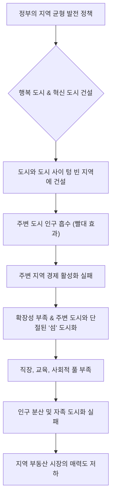
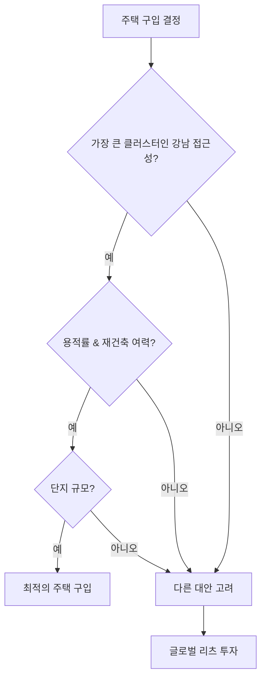
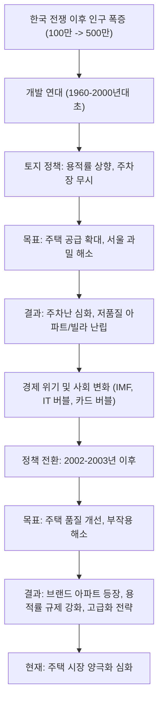

## 대한민국 부동산의 역사: 왜 강남은 계속 오르고, 제2의 강남은 없을까?
이 책은 한국 부동산 시장의 과거를 깊이 파고들어 현재를 이해하고 미래를 전망하는 데 필요한 통찰력을 제공해. 특히 강남 아파트 가격 상승의 비밀과 제2의 강남이 탄생하기 어려운 이유를 역사적, 경제적 관점에서 쉽고 재미있게 풀어내고 있어. 부동산 시장의 큰 흐름을 읽고 싶은 사람이라면 꼭 읽어봐야 할 책이야.

## 1. 서울 아파트, 팔고 수도권 단독 주택으로 갈아타면 안 될까? 

서울 아파트를 팔고 경기도 단독 주택으로 이사 가는 걸 고민하는 사람들이 많을 거야. 서울 아파트 중위 가격이 10억~15억 정도인데, 경기도 단독 주택은 5억 5천만 원 정도니까 5억 정도가 남는다는 계산이 나오거든. 하지만 여기에는 두 가지 큰 함정이 숨어 있어.

1. **첫 번째 함정: 직주근접의 원칙 위배 **
  - 직장과 집이 멀어지면 출퇴근 시간이 길어져서 돈과 시간을 많이 쓰게 돼.
  - 예를 들어, 시급 2만 원인 사람이 하루 1시간 반씩 출근하면 하루 6만 원을 출퇴근에 쓰는 셈이야.
  - 한국 근로자의 평균 통근 시간은 73.9분이고, 수도권은 82분으로 더 길어.
  - 통근 시간이 길어지면 삶의 만족도가 떨어지고 건강에도 안 좋다는 연구 결과도 있어.
  - 그러니까 싸다고 수도권 단독 주택으로 가면, 매일매일 출퇴근에 드는 비용과 스트레스를 생각하면 결코 좋은 선택이 아닐 수 있다는 거야.

2. **두 번째 함정: 단독 주택 가격은 잘 오르지 않아 **
  - 1986년 이후 한국의 아파트와 단독 주택 가격 추이를 보면, 아파트 가격은 엄청나게 강하게 올랐지만 단독 주택 가격은 아주 완만하게 올랐어.
  - 1986년부터 2024년까지 아파트 가격은 473% 상승했지만, 단독 주택 가격은 80%만 상승했어.
  - 물가 상승률을 고려하면 단독 주택 가격은 사실상 거의 오르지 않았다고 볼 수도 있어.
  - 예를 들어, 1980년대 1,000원 하던 투게더 아이스크림이 지금 7,000~8,000원 하는 것처럼 물가는 계속 올랐거든.
  - 결국 단독 주택을 전 재산으로 가진 사람은 상대적으로 가난해진 셈이고, 아파트를 가진 사람은 부자가 된 셈이지.

## 2. 왜 아파트 가격만 계속 오를까? 

아파트가 처음부터 이렇게 인기가 많았던 건 아니야. 오히려 옛날에는 '열등재' 취급을 받았어.

1. **아파트의 변화: 열등재에서 정상재로 **
  - 1970년대 초반에 지어진 아파트는 좁은 공간에 공동 화장실이 있는 등 주거 환경이 좋지 않았어.
  - 그래서 소득이 늘면 수요가 줄어드는 '열등재'로 여겨졌지. 마치 소득이 늘면 더 이상 싸구려 옷을 안 사는 것처럼 말이야.
  - 하지만 지금은 소득이 늘면 수요가 증가하는 '정상재'가 됐어.

2. **아파트 퀄리티의 향상 **
  - 요즘 아파트는 건폐율(건물이 땅을 차지하는 비율)이 15~20% 정도로 낮아서, 나머지 75~80%는 녹지나 커뮤니티 시설, 조경 등으로 꾸며져. 마치 넓은 공원 안에 집이 있는 것처럼 말이야.
  - 주차 공간도 편리해지고, 커뮤니티 시설도 잘 갖춰져서 주거의 질이 엄청나게 높아졌어.
  - 대형 건설사들이 아파트를 지으면서 브랜드 가치를 중요하게 생각하기 때문에, 문제가 생기면 가치가 급락할 수 있어서 퀄리티를 계속 높일 수밖에 없어.
  - 이런 변화 덕분에 아파트는 단순한 주거 공간을 넘어, 삶의 질을 높여주는 '보통재'가 된 거야.

## 3. 제2의 강남은 어디일까? 

많은 사람들이 '제2의 강남'을 찾고 있지만, 저자는 '제2의 강남은 없다'고 단호하게 말해. 왜 그럴까?

1. **직주근접의 중요성 **
  - 일자리가 서울, 특히 강남에 몰려 있기 때문에, 강남을 벗어나면 출퇴근 시간이 길어져서 삶의 만족도가 떨어지고 정신 건강에도 안 좋아.
  - 저자 홍춘욱 박사님도 일산 신도시에서 여의도로 출퇴근하다가 여의도 아파트로 이사한 후 삶의 만족도가 크게 높아졌다고 해.
  - 수도권 출근지 상위 지역(영등포구 여의도동, 강남구 역삼1동, 종로구, 금천구 가산동)과 밀접하게 연결된 지하철 2호선, 3호선, 7호선, 9호선은 '집값을 움직이는 황금 노선'이라고 불릴 정도야.
  - 결국 직장이 서울을 벗어나지 않는 한, 직장과 주거가 가까운 강남을 대체할 지역은 없다는 의미지.

2. 지역 균형 발전** 정책의 실패 **
  - 세종시와 혁신도시 건설을 통해 지역 균형 발전을 이루려 했지만, 사실상 실패했어.
  - 한국은행 분석가들은 청년층 인구가 수도권에 집중된 반면, 주택 공급은 지방에 집중된 것이 주택 양극화의 원인이라고 지적했어.
  - 사람들은 일자리를 찾아 수도권으로 오는데, 일자리를 옮기지 않고 신도시만 지어놓으면 사람들이 이동하지 않는다는 거야.
  - 세종시** 사례 **
  - 대전 세종 생활권이 제2의 강남이 될 가능성도 있었지만, 오송역과 세종시의 거리가 멀어서 수도권과의 연담화(도시들이 서로 연결되어 하나의 큰 도시처럼 되는 것)를 방지하려던 계획이 실패했어.
  - 일부러 멀리 떨어뜨려 놓으니 오히려 불편함만 커진 셈이지.
  - **천안 아산역 사례 **
  - KTX와 SRT가 정차하는 천안 아산역 일대에 임대주택과 오피스텔을 집중적으로 지었지만, 도보로 접근 가능한 아파트가 부족하고 상업 시설도 없어서 주민들의 불만이 많아.
  - 서울에서 이주할 사람들의 눈높이를 맞추지 못하고, 매력적인 신도시를 건설하지 못했기 때문에 인구 분산에 실패한 거야.
  - 상가 공실** 문제 **
  - 신도시 개발 시 건설사들이 수익성을 위해 상가 비율을 과하게 책정하는 경향이 있는데, 이로 인해 세종시 등 신도시에는 상가 공실이 심각해.
  - '공실은 공실을 낳는다'는 말처럼, 유령 도시 같은 분위기가 형성되어 악순환이 반복되고 있어.
  - 결론적으로, 정책적인 노력에도 불구하고 서울을 대체할 만한 매력적인 신도시를 만드는 데 실패했기 때문에 제2의 강남은 탄생하기 어렵다는 의견이야. 

## 4. 한국 부동산, 버블일까? 일본처럼 장기 불황에 빠질까? 

많은 사람들이 한국 부동산이 버블이고, 일본처럼 장기 불황에 빠질까 봐 걱정해. 하지만 저자는 다른 의견을 제시해.

1. **소득 대비 주택 가격 (**PIR**) 분석 **
  - 1인당 GDP(국민총생산)와 서울 아파트 가격 추이를 비교한 그래프를 보면, 1986년을 100으로 봤을 때 서울 아파트 가격은 737 수준으로 올랐지만, 1인당 GDP는 1980 수준으로 훨씬 더 많이 올랐어.
  - 이는 1인당 GDP 증가 속도보다 부동산 가격 상승 속도가 더 빠르다고 보기는 어렵다는 근거가 돼.
  - 물론 서울 아파트나 강남 아파트 같은 초고가 아파트는 버블이라고 볼 수도 있지만, 전국 평균 아파트 가격을 놓고 보면 그렇지 않을 수 있다는 거야.

2. 억대 연봉자** 증가와 **트로피 자산** **
  - 억대 연봉자 비중은 2019년 4.4%에서 2023년 6.7%로 꾸준히 증가했고, 2025~2026년에는 10%를 돌파할 것으로 전망돼.
  - 서울의 일부 지역(반포, 압구정 등) 실거래 가격은 소득 대비 주택 가격 비율(PIR)이 거의 100배에 근접할 것으로 추정되는데, 이는 연봉을 한 푼도 쓰지 않고 100년을 모아야 집을 살 수 있다는 뜻이야.
  - 하지만 저자는 이런 초고가 아파트가 '트로피 자산'의 성격을 가진다고 봐. 마치 슈퍼카를 타는 것이 사용 가치보다는 자신의 부를 과시하는 목적이 큰 것처럼 말이야.
  - 이런 트로피 자산 시장은 대다수 사람이 선호하는 주택 가격과 괴리된 면이 있기 때문에, 전체 부동산 시장의 버블 여부를 판단하는 데는 신중해야 한다는 의견이야.
  - 오히려 가격이 급등하거나 규제가 강화될 때, 희소성 때문에 더 강력한 매수를 유발할 수도 있다고 해.

3. **일본 부동산 장기 불황과의 비교 **
  - 일본이 인구 감소로 인해 부동산 시장이 장기 불황에 빠졌으니 한국도 그럴 것이라는 단편적인 시각은 잘못됐다고 지적해.
  - 일본의 인구 정점은 2008년으로 한국보다 10년 정도 빨랐지만, 일본의 실질 주택 가격 지수는 2015년 정도까지 조정되다가 그 이후 다시 상승세로 바뀌었어.
  - 이는 2000년대 고이즈미 개혁과 2013년 아베노믹스(양적 완화, 질적 완화) 같은 정책적 노력과 외국인 투자 유치 덕분이야.
  - 따라서 단순히 인구 감소만으로 한국 부동산 시장의 미래를 예측하는 것은 위험하다는 것이 저자의 주장이야.

## 5. 조선 시대부터 이어진 서울 집중 현상 

서울로 사람들이 몰리는 현상은 어제오늘의 일이 아니야. 조선 시대부터 지금까지 계속되어 온 역사적인 흐름이지.

1. **조선 시대의 서울 집중 **
  - "말은 제주도로 보내고 인물은 한양으로 보내라"는 속담처럼, 조선 시대에도 한양(서울)으로의 인구 쏠림 현상이 심했어.
  - 성종 임금 때는 서울에 집 한 채만 가지라는 명령이 있었고, 영조 시절에는 난개발을 막기 위해 철거 명령까지 내렸지만 소용없었어.
  - 조선 경제가 망가지고 부가 한쪽으로 집중되면서, 한양에 가서 정보를 얻고 과거 급제를 해야만 살아남을 수 있다는 인식이 강해졌어.
  - 정약용 선생도 귀양 가서 자손들에게 "한양 성에서 심리 밖을 벗어나지 말라"는 유언을 남길 정도였지.
  - 조선의 힘이 약해질수록 부동산에 대한 관심은 더 높아졌어.

2. **한국 전쟁 이후 서울 집중 심화 **
  - 한국 전쟁 이후에도 서울로의 인구 이동은 꺾이지 않았어.
  - 1953년 100만 명이었던 서울 인구는 1960년 245만 명, 1970년 500만 명, 현재는 950만 명으로 폭발적으로 증가했어.
  - 전쟁의 비극을 겪은 사람들이 작은 사회의 위험성을 깨닫고 익명성이 보장되는 큰 도시로 모여들고 싶어 했기 때문이야.

3. **서울 집중의 세 가지 이유 **
  - **교육:** 좋은 학교와 학원이 서울에 몰려 있어서 과거 시험 합격 가능성이 높았고, 지금도 명문 학군이 서울에 집중되어 있어.
  - **일자리:** 대기업 본사와 R&D 센터 등 좋은 일자리가 서울에 많아. 지방 근무를 꺼리는 현상 때문에 기업들도 서울에 본사를 두는 것을 선호해.
  - **파트너십 (사회적 연결):** 인구가 많은 대도시에서는 다양한 취향과 성향을 가진 사람들을 만날 확률이 높아. 연애뿐만 아니라 취미, 정치적 지향 등 자신에게 맞는 사회적 파트너를 찾기 유리하다는 의미야.

## 6. 강남 개발의 역사: 0원 땅이 수십억 된 비밀 

지금의 강남은 원래 사람이 살기 어려운 땅이었어. 하지만 정부의 정책과 개발 노력으로 '0원 땅'이 '수십억 땅'으로 변모했지.

1. **수도 이전 계획과 부평 평야 **
  - 이승만 정부 때는 전쟁 위험 때문에 서울을 분산시키려 했고, 인천 부평 평야가 수도 이전 후보지로 고려되기도 했어.
  - 경인운하와 연계하여 부평 평야에 새로운 수도를 만들려 했지만, 이미 농사를 짓는 사람들이 많고 땅값이 비싸서 수용하기 어려웠어.

2. **소양강댐 완공과 한강 개발 **
  - 1968년 소양강댐이 완공되면서 서울의 대규모 홍수 피해 위험이 사라졌어.
  - 한강 주변의 땅들이 섬이나 유수지(물이 흐르는 곳)가 아닌 마른 땅이 될 가능성이 생겼지.
  - 한강은 사실상 호수처럼 관리되면서 강폭이 줄고 남쪽에 거대한 섬인 잠실섬이 개발 가능해졌어.

3. **강남 개발의 시작 **
  - **한남대교와 경부고속도로:** 1969년 한남대교가 건설되고 경부고속도로가 강남 방향으로 뚫리면서 강남 개발이 본격화됐어.
  - **빈 땅의 활용:** 잠실섬, 압구정 섬(옛 한명회 별장 자리), 반포(옛 목이 천지) 등 원래 사람이 살 수 없었던 공유수면(강물에 잠겨 있던 땅)을 매립하여 개발했어.
  - **일석삼조 효과:**
  - 강북 인구를 남쪽으로 이동시켜 북한의 남침 위협으로부터 한강을 방어선으로 만들 수 있었어.
  - 땅값이 0원인 곳을 개발하여 정부가 막대한 개발 차익을 얻을 수 있었어.
  - 강북에 있던 수도권 핵심 기능들을 강남으로 옮기는 데 성공했어. (과천 정부 종합청사 이전 등)

4. **강남 개발 전 변두리 지역의 폭등 **
  - 강남 개발 전에도 서울 외곽 변두리 지역의 집값은 폭발적으로 상승했어.
  - 1960년대 종로와 중구 등 도심권은 14년 동안 14배 올랐지만, 잠실동은 140배, 성동구 화양동은 120배, 동대문구 망우동은 100배 올랐어.
  - 이는 서울이 확대되고 신도시가 만들어질 것이라는 기대감 때문이었어.
  - 신사동 같은 지역은 한남대교 완공 전부터 1년에 10배씩 오르기도 했어.
  - 강남역 침수 사건처럼 지금은 선호받는 지역들이 옛날에는 골짜기나 저지대여서 홍수에 취약했지만, 정부가 빈 땅을 개발하면서 엄청난 차익을 얻을 수 있었지.

## 7. 한국 부동산 시장의 위기와 사이클 

한국 부동산 시장은 여러 차례의 위기와 회복을 반복해 왔어. 정부 정책과 외부 충격이 복합적으로 작용하면서 사이클을 만들어냈지.

1. **1970년대 오일쇼크와 부동산 폭등 **
  - 1970년대 내내 주택 가격이 폭등했는데, 두 가지 이유가 있었어.
  - **중동 붐:** 베트남 전쟁 이후 중동 건설 붐으로 경제가 폭발적으로 성장했어.
  - **8.3 **사채 동결 조치**:** 1971년 정부가 사채 이자율을 50~60%에서 20% 이하로 통제하면서, 부자들이 금융 시장에 돈을 굴리기 어려워졌어.
  - 당시 주식 시장은 작았고, 인플레이션(물가 상승)이 30%에 달했는데 대출 금리는 20%로 억제되니, 돈 가진 사람들은 땅 말고는 답이 없다고 생각하고 부동산으로 몰렸어.

2. **1979년 부동산 붕괴 **
  - 1978년 정부는 양도소득세 인상(30%→50%, 2년 내 매도 시 70%) 등 강력한 8.8 부동산 대책을 내놓았지만, 시장은 꺾이지 않았어.
  - 하지만 1979년 이란 회교 혁명으로 유가가 폭등하고, 중동 건설 경기가 종말을 맞았어.
  - 여기에 박정희 대통령 시해 사건과 군부 쿠데타로 정치적 불안정까지 겹치면서 부동산 시장은 순식간에 붕괴됐어.
  - 1979년부터 1984년까지 4년 동안 인플레이션이 20%씩 발생하는데도 집값은 전혀 오르지 않아, 실질 주택 가격이 -80% 폭락하는 최악의 사태를 겪었어.
  - 이는 정부 규제만으로는 시장을 완전히 꺾기 어렵지만, 외부 충격이 오면 순식간에 붕괴될 수 있다는 것을 보여주는 사례야.

3. 외환 위기** (**IMF**) 경험과 깨달음 **
  - 저자 홍춘욱 박사님은 외환 위기 때 아버지가 사업 실패로 돌아가시고, 광역시에 있던 집을 핵심 지역으로 옮겼지만, 외환 위기로 인해 눈물을 머금고 최저가에 집을 팔아야 했던 아픈 경험이 있어.
  - 당시 은행 대출은 극히 어려웠고, 2금융권에서 빚을 내 집을 샀다가 높은 금리를 감당하지 못했던 거야.
  - 이 경험 때문에 집에 대해 부정적인 생각을 가졌지만, 2004~2005년부터 전세 가격이 오르고 임대료 부담이 커지면서 주택 매매의 필요성을 느끼게 됐어.

4. **2022년 매수 타이밍 포착 **
  - 2022년 환율이 1,450원까지 급등하고, 레고랜드 사태로 한국전력 채권 금리가 6%까지 오르며 신용 경색이 왔을 때, 부동산 담보 대출 금리가 8%까지 치솟았어.
  - 하지만 저자는 이때가 오히려 집을 살 타이밍이라고 판단했어. 세 가지 이유 때문이야.
  - **정부의 규제 완화:** 둔촌주공(올림픽파크 포레온) 살리기를 위해 투기과열지구를 해제하고, 15억 이상 아파트 대출 금지를 풀었어. 다주택자 양도세 중과 유예 등 건설사와 금융 기관의 위기를 막기 위해 정부가 규제를 완화했지.
  - **환율 안정:** 급등했던 환율이 1,450원에서 1,300원 밑으로 급락하면서 물가가 안정되고, 한국은행이 금리를 인하할 가능성이 높아졌어.
  - **경제 회복 기대:** 물가 안정과 금리 인하는 경제 회복과 주택 시장 수요 회복으로 이어질 수 있어.
  - 이처럼 정부가 '제발 집 좀 사달라'고 할 정도로 규제를 풀어주고, 거시 경제 환경(환율, 금리)이 개선될 때가 주택 매수하기 가장 좋은 시기라는 것을 역사를 통해 알 수 있다는 거야.
  - 한국 부동산 시장은 정부 규제 → 외부 충격으로 인한 붕괴 → 정부의 부양 노력 → 외부 여건 개선으로 인한 회복이라는 사이클을 여섯 번이나 반복해 왔어.

## 8. 현재 부동산 시장의 위치와 미래 전망 

현재 부동산 시장은 마치 산을 오르는 것에 비유할 수 있어. 저자는 지금이 '7부 능선' 정도에 와 있다고 봐.

1. **7부 능선 비유 **
  - 산에서 가장 힘들고 가파른 구간을 지나, 저 멀리 정상이 보이면서 완만해지는 구간이 7부 능선이야.
  - 즉, 가장 가파른 폭등장은 지났고, 이제는 완만한 능선을 타는 시기라는 의미지.
  - 서울을 비롯한 핵심 지역의 부동산 가격은 2021년 말 고점을 넘어 20~30% 이상 높아진 단지들이 많아.

2. 순환매** 현상 **
  - 정부가 다주택자 규제를 강화하면서 '똘똘한 한 채'로의 집중 현상이 2023년부터 2025년 말까지 진행됐고, 강남 3구를 비롯한 핵심 지역의 주택 가격이 폭등했어.
  - 이후 정부가 대출 규제와 양도세 중과 등 다주택자 규제를 더욱 강화하자, 이제는 15억 이하 아파트들이 폭등하기 시작했어.
  - 이는 2020년에도 있었던 현상으로, 서울 핵심 지역의 집값이 오르기 어려워지자 화성 동탄, 남양주 다산 등 2기 신도시로 수요가 확산되는 '풍선 효과'가 나타났어.
  - 서울의 핵심 지역은 2020년부터, 주변 지역은 2022년부터 조정을 받다가 다시 오르기 시작한 지 3년째이고, 올해는 노원, 금천, 성북구 등 그동안 마이너스였던 지역들도 상승률 최상위권에 올랐어.

3. **상승 동력 **
  - **낮은 금리:** 주택 시장의 가장 중요한 에너지인 금리가 2.5%로 낮은 수준이야.
  - **소득 증가:** 반도체 슈퍼사이클로 수출이 잘되면서 소득이 증가하고 있어. 2025년에는 연봉 1억 이상 근로소득자가 전체의 10%를 넘을 것으로 예상돼.
  - **주택 공급 부족:** 향후 수년 내 서울 주변으로 아파트 입주 물량이 잘 보이지 않아. 2028년 교산, 2027년 고양 창릉, 인천 대장 등 3기 신도시 분양이 예정되어 있지만, 입주까지는 시간이 걸려.

4. **외부 충격의 중요성 **
  - 현재 시장은 순환매가 진행되는 단계이며, 이 순환매가 얼마나 길어질지는 우리 내부 요인보다는 외부 충격(예: 이란 전쟁 심화)에 달려 있어.
  - 주도 지역의 가파른 폭등장은 지났지만, 능선을 따라 오르락내리락하는 순환매가 이어질 것이라는 전망이야.

## 9. 지역 부동산 시장의 현실: 정책 실패와 희망 있는 지역 

지역 부동산 시장은 역대 정부의 정책 실패로 인해 쉽지 않은 상황이야.

1. **혁신도시와 행복 도시의 실패 **
  - 역대 정부의 가장 큰 정책 실패는 전국에 열몇 개를 만든 혁신도시와 행복 도시(세종시) 건설이야.
  - 이 도시들은 도시와 도시 사이에 텅 빈 지역에 만들어져서, 주변 도시의 인구를 빨아들이는 '빨대 효과'만 가져왔을 뿐, 주변 지역 경제를 함께 활성화하는 데는 실패했어.
  - 특히 세종시는 행정 복합 도시로 제2의 수도를 만들려 했지만, 확장성이 없고 주변 도시와 떨어져 있는 '섬' 같은 도시가 되어버렸어.

2. **세종시의 문제점 **
  - **교통 불편:** 오송역에서 세종시 정부 종합청사까지 거리가 멀고, 대중교통(BRT)도 불편하며, 택시 요금도 비싸.
  - **주차난:** 자족 도시를 목표로 주차장을 잘 짓지 않고 도로를 좋게 만들었지만, 결국 주차난이 심각해.
  - 연담화** 실패:** 수도권과의 연담화(도시들이 서로 연결되어 하나의 큰 도시처럼 되는 것)를 방지하려던 계획이 오히려 도시 간 연결성을 떨어뜨려 거대 도시로 발전할 가능성을 낮췄어.
  - 상가 공실**:** 건설사들이 수익성을 위해 상가를 과하게 지으면서 상가 공실이 심각하고, 이는 도시의 매력을 떨어뜨리는 악순환으로 이어지고 있어.

3. **제2의 강남이 되기 위한 조건과 대세청의 한계 **
  - 제2의 강남이 되려면 세 가지 조건이 필요해.
  - **교통의 편리성:** 사통팔달의 교통망이 갖춰져야 해.
  - **인구 밀집:** 사람들이 엄청나게 밀집해서 살아야 해.
  - **교육 및 일자리:** 좋은 교육 기관과 일자리가 풍부해야 해.
  - 대전, 세종, 청주를 묶은 '대세청' 지역은 한때 제2의 강남이 될 만한 잠재력(행정 수도, 교통의 중심지, 카이스트 등 연구 기관)을 가지고 있었어.
  - 하지만 오송역 위치 문제, 세종시와 주변 도시 간의 연결성 부족, 지역 간 갈등, 상가 공실 문제 등으로 인해 그 잠재력을 제대로 발휘하지 못하고 있어.
  - 공무원이나 SK하이닉스 직원 등 핵심 인력들도 기회가 되면 서울로 올라가려는 마음이 커서, 지역에 뿌리내리고 정착하려는 분위기가 약해.
  - 인구 감소 시대에 지역 분산보다는 '선택과 집중'을 통해 잘 나가는 슈퍼스타 도시를 키워야 한다는 주장도 나오고 있어.

4. **희망 있는 지역: 부산, 울산 **
  - 저자는 부산, 울산 지역을 상대적으로 좋게 보고 있어.
  - 조선, 자동차 경기가 호황이고, 정부가 지방 거점 국립대를 키워주는 정책을 펼치면서 이 지역에 희망이 있다고 봐.
  - 하지만 혁신도시나 행복 도시에 대한 기대는 역사적인 시각에서 볼 때 현재로서는 매력적이지 않다는 의견이야.

## 10. 주택 구입 시 세 가지 포인트와 글로벌 투자 

주택을 구입할 때 고려해야 할 세 가지 중요한 포인트가 있어.

1. **강남에 대한 접근성 **
  - 우리나라에서 가장 큰 클러스터(일자리, 교육, 상권 등이 집중된 곳)인 강남에 얼마나 쉽게 접근할 수 있는지를 고려해야 해.

2. **용적률과 **재건축 여력** **
  - 단순히 인테리어만 보지 말고, 그 집의 용적률(땅에 건물을 얼마나 높게 지을 수 있는지)을 살펴봐야 해.
  - 용적률이 낮으면 나중에 재건축을 통해 더 큰 집을 지을 수 있는 여력이 있다는 뜻이야.

3. **아파트 단지의 규모 **
  - 아파트를 구입한다면 단지가 얼마나 큰지도 중요해. 대규모 단지는 편의 시설이나 커뮤니티 시설이 잘 갖춰져 있는 경우가 많아.

이 세 가지 조건을 모두 갖춘 단지는 비싸기 마련이야. 만약 주택 마련을 포기하는 사람이라면, 마지막으로 '글로벌 리츠(REITs) 투자'를 대안으로 제시해.

- **글로벌 리츠 투자 **
  - 우리나라 핵심 지역의 경기는 결국 글로벌 경기와 연동될 수밖에 없어.
  - 미국에 상장된 부동산 투자 신탁 증권(리츠)에 투자하면, 소액으로도 서울을 비롯한 거대 도시의 상승률을 충분히 쫓아가면서 자산을 분산시킬 수 있는 기회를 가질 수 있다는 거야.

## 11. 부동산 시장의 변화를 이끈 세 가지 요인 

우리나라 부동산 시장은 1990년대 말부터 2000년대 초반 사이에 엄청난 변화를 겪었어. 이 시기에 세 가지 큰 사건이 있었는데, 이 사건들이 부동산 시장의 판도를 완전히 바꿔놓았지.

1. **세 가지 큰 변화의 시기 **
  - **정보 통신 거품 (IT **버블**):** 인터넷과 IT 기술이 폭발적으로 성장하면서 주식 시장에 거품이 끼었다가 꺼지는 시기였어.
  - 외환 위기** (**IMF**):** 1997년 외환 위기로 국가 경제가 큰 어려움을 겪었어.
  - 카드 버블**:** 2002~2003년 신용카드 사용이 급증하면서 대규모 신용 불량자가 발생하고 금융 시스템이 흔들렸어.
  - 이 세 가지 사건은 각각 수십 년에 한 번 있을 법한 큰 변화였는데, 불과 3~4년 사이에 한꺼번에 터지면서 우리 경제를 완전히 바꿔버렸어.

2. **주택 담보 대출의 등장과 금리의 중요성 변화 **
  - 이전에는 주택 담보 대출이라는 개념이 거의 없었어. 주택 은행에서 대출을 받아도 최대 2천만 원 정도였고, 나머지는 부모님이나 사채(개인에게 돈을 빌리는 것)를 통해 조달해야 했어.
  - 사채 금리는 연 10~20% 초반으로 매우 높았지.
  - 그래서 옛날에는 금리가 올라도 부동산 시장에 큰 영향을 주지 않았어. 금리 상승은 경기가 좋다는 신호일 뿐이었지.
  - 하지만 카드 버블 붕괴 이후 은행들이 기업 대출이나 카드 대출에서 큰 손실을 보자, 새로운 수익원을 찾기 시작했어.
  - 그게 바로 '주택 담보 대출'이야. 은행들은 주택 담보 대출을 안전한 수익원으로 보고 적극적으로 늘리기 시작했어.
  - 이때부터 금리는 부동산 시장의 흐름을 좌우하는 결정적인 요인이 됐어. 금리가 오르면 대출 이자 부담이 커져서 집값이 영향을 받는 세상이 된 거지.

3. **미래의 변화: AI 혁명과 부동산 시장 **
  - 앞으로는 AI 혁명이 오면서 일자리가 사라지는 세상이 올 수도 있어.
  - 이런 변화 속에서 '서울 집값이 오르면 다 따라간다'는 과거의 공식이 더 이상 통하지 않을 수도 있다는 전망이야.

## 12. 부동산 버블 판단 기준: 소득과 금리 

부동산 시장이 버블인지 아닌지를 판단하는 데는 크게 두 가지 기준이 있어.

1. **투자 심리 (모멘텀) **
  - 한 달에 집값이 갑자기 3~5%씩 오르거나, 아무도 관심 없던 지역까지 돈이 몰리는 현상이 나타나면 버블일 가능성이 높아.
  - 이는 사람들의 투자 심리가 너무 급격하게 쏠리는 '행동 경제학적 버블'이라고 볼 수 있어.

2. **소득 대비 주택 가격 (**PIR**) **
  - 경제학에서는 '소득 대비 주택 가격 배율(PIR)'을 가장 중요한 기준으로 삼아.
  - PIR은 연봉으로 집값을 나누는 거야. 예를 들어 연봉 1억 원인 사람이 10억 원짜리 집을 사면 PIR은 10배가 돼.
  - PIR이 10배 정도면 꽤 비싼 지역이라고 볼 수 있어. 왜냐하면 소득에서 세금을 내야 하니까 실제 가처분 소득은 더 적거든.
  - **PIR의 역사적 변화 **
  - KB 국민은행의 주택 서베이 조사를 보면, 우리나라 역사상 집값이 가장 비쌌던 시기는 1986년이야.
  - 당시에는 연평균 임금 상승률이 20%가 넘어서 3년 반마다 연봉이 두 배씩 오르던 시절이었어.
  - 사람들은 지금 집값이 비싸도 내년에 소득이 오르면 감당할 수 있다고 느꼈기 때문에, 1980년대 후반 '3저 호황' 시기가 역사상 최악의 버블이었다고 볼 수 있어.
  - 이후 노태우 정부가 200만 호 주택 공급 정책(일산, 분당 등 1기 신도시)을 펼치면서 부동산 시장이 안정됐지.
  - **PIR의 국제 비교 **
  - 나라마다 인구 밀도 등이 달라서 PIR도 달라. 예를 들어 타이베이는 16배, 홍콩은 14배 정도야.
  - 서울 아파트의 PIR은 2022년 2분기 14.8배에서 현재 10.6배(2026년에는 11배 이상 예상)로 떨어졌어.
  - 이는 샌프란시스코나 멜버른 아파트와 비슷한 수준이야.
  - 따라서 서울의 특정 고가 아파트는 버블일 수 있지만, 전체적으로 봤을 때 역사상 최악의 버블이라고 단정하기는 어렵다는 의견이야.

3. 버블** 붕괴의 조건 **
  - 소득이 늘지 않았는데 집값이 오르면 버블이고, 금리가 높아질 때 버블이 꺼지는 경향이 있어.
  - 2022년이 딱 그런 시기였다고 볼 수 있지.

## 13. 아파트의 진화: 1세대에서 4세대까지 

우리나라 아파트는 시대의 변화와 사람들의 취향에 맞춰 계속 진화해 왔어.

1. **1세대 아파트 (1970년대) **
  - 서울 여의도 시범 아파트가 대표적이야.
  - 튼튼하게 지어졌고 넓은 녹지 면적을 자랑했지만, 1970년대에 지어졌기 때문에 주차 공간이 절대적으로 부족했어.

2. **2세대 아파트 (1990년대 1기 신도시) **
  - 1992년 1기 신도시(일산, 분당 등) 입주를 전후해서 등장했어.
  - '마이카 시대'가 열리면서 지하 주차장이 생기기 시작했고, 주차 대수가 중요해졌어.
  - 단지 안에 초등학교를 품은 '초품아' 아파트처럼 각종 편의 시설이 들어오고, 주변에 상가 지역이 집중적으로 분포하는 등 도시 계획 속에 제대로 된 아파트들이 만들어졌어.
  - 1988년 입주한 올림픽 선수촌 아파트가 2세대 아파트 문화의 시초라고 볼 수 있어.

3. **3세대 아파트 (2004년 이후) **
  - 2004~2005년 서울시의 용적률(땅에 건물을 얼마나 높게 지을 수 있는지) 규제가 강화되면서 건설사들이 고급화 전략을 쓰기 시작했어.
  - **세 가지 고급화 전략:**
  - **지상 주차장 최소화:** 지상 공간을 공원이나 산책로로 조성하여 아이들이 안전하게 뛰어놀 수 있게 했어.
  - 3베이** 아파트:** 남향으로 해가 잘 들어오는 베란다와 거실이 있는 구조로, 예전에는 대형 평형에만 적용되던 것이 24평 아파트에도 적용되기 시작했어.
  - **지하 주차장에서 바로 연결되는 엘리베이터:** 쇼핑 후 짐을 들고 이동하기 편리해졌어.
  - 이런 변화는 소득 수준이 높아진 한국 사람들의 취향을 제대로 저격했어.

4. **4세대 아파트 (2010년대 이후) **
  - 2010년 이후, 2015년 이후에 나온 아파트들은 더 높은 취향을 반영해서 단지 안에 커뮤니티 센터, 운동 시설, 수영장, 심지어 조식 서비스까지 제공하는 아파트들이 등장했어.
  - 이처럼 사람들의 소득 수준과 눈높이가 높아지면서, 그 취향에 맞는 아파트들만 독점적으로 가치가 상승하는 양극화 현상이 나타나고 있어.

## 14. 부동산 정책의 변화와 시민의 역할 

부동산 정책은 우리나라 경제의 중요한 축일 뿐만 아니라, 우리 시민들의 삶에 큰 영향을 미쳐. 정책의 변화를 이해하는 것이 중요해.

1. **개발 연대의 주택 정책 (1960년대~2000년대 초반) **
  - 한국 전쟁 이후 서울 인구가 폭발적으로 늘어나면서, 정부는 주택 공급을 늘리기 위해 용적률을 계속 상향하고 주차장 등은 고려하지 않고 건물을 높게 짓도록 했어.
  - '야, 올려 올려!'라는 식의 정책으로 서울의 과밀 문제를 해결하려 했지.
  - 이때 지어진 빌라나 아파트들은 주차난이 심각한 경우가 많아.

2. **정책 전환과 브랜드 아파트의 등장 (2000년대 중반 이후) **
  - 2002~2003년 카드 버블 붕괴, 외환 위기, 정보 통신 혁명 등을 겪으면서 기존의 주택 공급 정책에 문제가 있다는 인식이 확산됐어.
  - 이후 용적률 규제가 강화되고, 건설사들은 고급화 전략을 통해 '브랜드 아파트'를 선보이기 시작했어.
  - 옛날에는 '라이프 주택'처럼 건설사 이름으로 불리던 아파트들이 '목화 아파트', '화랑 아파트' 같은 예쁜 이름을 달고 등장했지.

3. **시민의 역할 **
  - 부동산 정책은 우리 삶에 큰 영향을 미치기 때문에, 정책을 만드는 사람뿐만 아니라 정책을 선택하는 시민들도 부동산의 역사를 알아야 해.
  - 어떤 정치인이 상황을 제대로 이해하고 적절한 비전을 제시하는지 판단하려면, 시민 스스로가 부동산 시장에 대한 깊은 이해를 가지고 있어야 한다는 거야.

