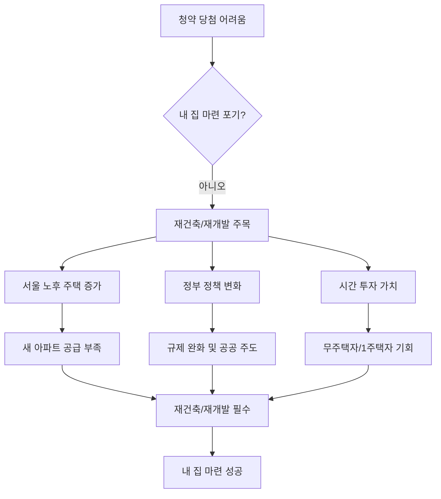

## 대한민국 재건축 재개발 지도: 내 집 마련의 새로운 기회
이 책은 청약으로 내 집 마련이 어려워진 시대에, 재건축과 재개발을 통해 새 아파트를 얻는 방법을 알려주는 안내서야. 어렵고 복잡하게 느껴지는 재건축·재개발을 쉽고 명확하게 설명해서, 누구나 내 집 마련의 꿈을 이룰 수 있도록 돕는 것이 목표라고 해. 특히 앞으로 10년은 재건축·재개발의 시대가 될 것이라고 강조하고 있어.

## 1. 왜 지금 재건축·재개발에 주목해야 할까? 

요즘 청약 당첨은 하늘의 별 따기처럼 너무 어려워졌어. 청약 가점은 계속 오르고, 집값은 너무 비싸서 엄두도 못 내는 경우가 많지. 하지만 그렇다고 내 집 마련을 포기할 수는 없잖아? 이럴 때 재건축·재개발이 아주 좋은 대안이 될 수 있어.

1. **청약의 대안이자 100% 당첨 방법이야.**
  - 청약 가점이 낮아도, 심지어 청약 통장이 없어도 새 아파트를 가질 수 있는 방법이 바로 재건축·재개발이야. 
  - 재건축·재개발 입주권을 사면 새 아파트의 주인이 100% 될 수 있어. 
  - 청약으로 나오는 일반 분양가는 보통 조합원 분양가에 프리미엄(웃돈)과 시세 차익이 붙어서 더 비싸게 형성되거든. 
2. **서울은 점점 늙어가고 있어.**
  - 서울에는 빈 땅이 거의 없어서, 앞으로 지어질 새 아파트는 대부분 낡은 건물을 허물고 다시 짓는 재건축·재개발을 통해서만 나올 수밖에 없어. 
  - 2021년 조사에 따르면 서울 주택의 약 47.2%가 20년 이상 된 노후 주택이고, 30년 이상 된 주택도 약 20%나 돼. 30년이 넘으면 재건축을 시작할 수 있는 나이가 되는 거지. 
  - 이런 낡은 아파트들이 마치 기차처럼 줄줄이 재건축 연한(나이)을 채우고 있어서, 앞으로 10년 동안 재건축·재개발이 활발해질 수밖에 없어. 
3. **정부 정책도 재건축·재개발을 밀어주고 있어.**
  - 지난 10년간은 여러 정치적인 이유로 재건축·재개발이 잘 진행되지 못해서 서울의 아파트 공급이 부족했어. 
  - 하지만 2021년 서울시장 재보궐 선거 때 모든 후보가 재건축·재개발 규제 완화를 공약으로 내세울 정도로, 이제는 정치권에서도 이 문제의 심각성을 인지하고 있어. 
  - 최근에는 공공재개발, 공공 주도 재개발, 신속 통합기획 등 정부가 직접 재건축·재개발을 추진하려는 움직임도 보이고 있어. 
  - 이는 앞으로 10년 동안 내 집 마련을 하려는 사람들에게 재건축·재개발이 필수적인 공부가 될 거라는 신호라고 볼 수 있어. 
4. **돈이 없어도, 집이 있어도 재건축·재개발은 중요해.**
  - "돈이 없는데 재건축·재개발을 알아야 하나요?"라고 묻는 사람들이 많지만, 오히려 돈이 없으니까 재건축·재개발을 해야 하는 거야. 
  - 재건축·재개발은 '시간으로 하는 투자'라고 불리는데, 지금 당장 돈이 없는 젊은 사람들에게는 시간을 투자해서 미래의 자산을 만드는 가장 값진 방법이 될 수 있어. 
  - 1주택자(집이 한 채 있는 사람)나 다주택자(집이 여러 채 있는 사람)에게도 재건축·재개발은 좋은 기회가 될 수 있어. 
  - 집값이 올라도 다른 집도 같이 올라서 이사 가기 어려운 1주택자들에게는 '똘똘한 구축(오래된 아파트)'을 사서 새 아파트로 갈아타는 전략이 유용해. 
  - 재건축·재개발 입주권은 환금성(현금으로 바꾸기 쉬운 정도)이 뛰어나서, 단기 투자를 선호하는 사람들에게도 좋은 상품이 될 수 있어. 

## 2. 재건축과 재개발, 무엇이 다를까? 

재건축과 재개발은 둘 다 낡은 동네를 새롭게 바꾸는 사업이지만, 시작하는 재료가 조금 달라. 마치 요리할 때 어떤 재료를 쓰느냐에 따라 요리법이 달라지는 것과 같다고 보면 돼.

1. **재건축은 낡은 아파트를 새 아파트로 바꾸는 거야.**
  - 재건축은 주로 <u>오래된 아파트 같은 공동 주택</u>을 허물고 다시 짓는 사업이야. 
  - 아무 아파트나 재건축할 수 있는 건 아니고, <u>준공(건물이 완성된 날) 후 </u>30년<u> 이상</u>이 지나야 해. 
  - 재건축 지역은 보통 소방차가 지나다닐 수 있을 정도로 길이 넓고 주거 환경이 비교적 괜찮은 편이야. 
2. **재개발은 낡은 동네 전체를 새롭게 만드는 거야.**
  - 재개발은 <u>아파트가 아닌 빌라, 다세대, 다가구 주택 등 낡고 허름한 주거 지역</u>을 통째로 개발하는 사업이야. 
  - 재개발 지역은 건물이 너무 낡고(노후도), 길이 좁아서 소방차가 지나가기 어려운 곳(접도율), 집들이 너무 다닥다닥 붙어 있는 곳(호수 밀도) 등 주거 환경이 매우 열악한 곳이 많아. 
  - 재개발은 30년 연한 같은 기준보다는 <u>노후도(낡은 정도)</u>가 중요해. 
  - 재개발 지역에 신축 빌라(새로 지은 빌라)가 너무 많으면 노후도 기준을 맞추기 어려워서 재개발이 어려워질 수도 있어. 
3. 입주권**(새 아파트를 받을 권리)은 어떻게 받을까?**
  - 재건축이든 재개발이든, <u>땅만 가지고 있든, 낡은 건물을 가지고 있든, 심지어 무허가 건물(허가 없이 지은 건물)을 가지고 있든</u>, 조건만 맞으면 새 아파트를 받을 수 있는 권리(입주권)를 받을 수 있어. 
  - 하지만 큰 땅이나 건물을 가지고 있다고 해서 여러 채의 새 아파트를 받을 수 있는 건 아니야. 보통 <u>세대당 한 채의 </u>입주권을 주는 것이 원칙이야. 
  - 다만, '원 플러스 원'이라고 해서 <u>두 채까지 주는 경우</u>도 있는데, 이 경우 한 채는 큰 평수, 다른 한 채는 작은 평수로 받게 돼. 
  - 이런 내용은 '도시정비법'이라는 법에 정해져 있어서, 법을 잘 알아야 해. 

## 3. 재건축·재개발, 어떻게 진행될까? (조합이 사업을 관리한다!) 

재건축·재개발은 여러 단계를 거쳐서 진행돼. 마치 긴 마라톤 경주와 같다고 보면 돼. 이 모든 과정을 '조합(사업을 추진하는 주민들의 모임)'이 관리한다고 생각하면 돼. 

1. **재건축의 첫 관문: **안전진단** (안전한지 검사하는 거야!)** 
  - 재건축은 30년 연한이 되면 주민들이 돈을 모아 시군청에 '예비 안전진단'을 신청해. 
  - 1차 예비 안전진단과 1차 정밀 안전진단은 대부분 통과하지만, <u>2차 정밀 안전진단</u>을 통과하는 게 정말 어려워. 
  - 2차 정밀 안전진단은 국가 기관 두 곳에서 검사하는데, 규제가 강화되면서 통과율이 10~20%밖에 안 될 정도로 힘들어졌어. 
  - 그래서 재건축에서는 <u>안전진단 통과</u>가 가장 큰 고비이자 중요한 산이라고 할 수 있어. 
2. 조합 설립 인가** (주민들이 모여 회사를 만드는 거야!)** 
  - 안전진단을 통과하거나(재건축), 노후도 기준을 맞추면(재개발) 주민들이 모여 '조합'이라는 사업체를 만들어. 
  - 조합을 만들려면 <u>전체 소유자의 75% 이상 동의</u>가 필요해. 
  - 재건축은 여기에 <u>각 동(건물)별로 2분의 1 이상 동의</u>도 필요해서, 한 동이라도 반대하면 그 동은 재건축에서 빠지거나 사업이 지연될 수 있어. 
  - 재개발은 조합 설립 동의율을 얻는 게 정말 힘든데, 동의율이 낮으면 나중에 사업이 취소될 수도 있어. 
  - 이 단계에서는 아직 사업이 구체화되지 않아서 불안할 수도 있지만, <u>초기 단계에 진입할수록 나중에 더 큰 수익</u>을 기대할 수 있어. 
3. 사업 시행 인가** (어떻게 지을지 계획을 세우는 거야!)** 
  - 조합이 설립되면, 이제 어떤 아파트를 지을지, 몇 동을 지을지, 몇 층으로 지을지 등 <u>구체적인 사업 계획</u>을 세워서 정부(지자체)의 허락을 받아. 
  - 이 단계가 되면 마치 모델하우스에 있는 조감도(미니어처 모형)처럼 <u>새 아파트의 모습이 어느 정도 가시화</u>돼. 
  - 이때부터는 사업이 확실해지는 단계라서 투자자들이 많이 관심을 갖기 시작해. 
4. 관리처분** 인가 (돈 계산을 하고 이주하는 거야!)** 
  - 사업 시행 인가를 받으면, 이제 <u>기존의 낡은 집을 부수기 전에 돈 계산</u>을 해. 
  - "너는 얼마를 더 내야 새 아파트를 받을 수 있고, 너는 얼마를 돌려받을 수 있다"는 식으로 조합원들의 부담금(추가로 내야 할 돈)을 정하는 단계야. 
  - 이 단계가 되면 조합원들은 <u>기존 주택에서 이주(다른 곳으로 이사)</u>를 시작하고, 낡은 건물은 철거돼. 
  - 관리처분 인가가 나면 거의 사업이 막바지에 다다랐다고 볼 수 있어. 
5. 일반 분양** 및 입주 (새 아파트가 완성되는 거야!)** 
  - 철거가 끝나면 새 아파트를 짓기 시작하고, 조합원들에게 배정된 물량을 제외한 나머지 아파트는 <u>일반인들에게 청약으로 분양</u>해. 
  - 공사가 끝나면 드디어 새 아파트에 입주하게 되는 거지. 
  - 이 모든 단계를 거치면서 사업이 순조롭게 진행되면, <u>시간이 지날수록 아파트의 가치는 크게 올라</u>. 

## 4. 재건축·재개발 투자, 돈은 얼마나 필요할까? 

재건축·재개발은 큰돈이 들어간다고 생각하기 쉽지만, 돈이 들어가는 시점이 여러 단계로 나뉘어 있어서 잘 계획하면 생각보다 부담을 줄일 수 있어. 마치 할부로 물건을 사는 것과 비슷하다고 보면 돼. 

1. **일반 분양과 **재건축**·재개발의 돈 내는 방식 차이.**
  - 일반 분양은 보통 계약금 10%, 중도금 60%, 잔금 30%처럼 정해진 비율로 돈을 내. 
  - 하지만 재건축·재개발은 처음에 돈이 많이 들어가고, 그 다음부터는 중간중간에 조금씩 돈이 들어가는 경우가 많아. 
  - 이런 단계별 돈 계산을 잘 이해하면, 분양보다 더 저렴하게 새 아파트를 마련할 수도 있어. 
2. **돈이 들어가는 주요 단계.**
  - **낡은 집 매수(사는 것):** 처음에는 낡은 집을 사는 거니까, 일반 아파트를 살 때처럼 계약금, 중도금, 잔금을 내야 해. 
  - 만약 전세 세입자가 있는 집을 사면, 전세금을 제외한 나머지 돈(갭 투자)만 내면 돼서 초기 투자금을 줄일 수 있어. 
  - 분담금**(**공사비**):** 낡은 집을 허물고 새 아파트를 짓는 데 필요한 공사비가 바로 '분담금'이야. 
  - 이 분담금은 중간중간에 나눠서 내게 돼. 
  - 사업성이 아주 좋은 지역(예: 잠실주공 5단지)은 분담금이 거의 없거나, 오히려 돈을 돌려받는 경우도 있어. 
  - 대출** 활용:** 재건축·재개발은 여러 단계에서 대출을 받을 수 있어. 
  - <u>주택담보대출</u>: 낡은 집을 살 때 일반 주택처럼 받을 수 있어. 
  - 이주비 대출: 낡은 집에서 이사 갈 때 필요한 돈을 빌릴 수 있어. 
  - <u>중도금 대출</u>: 새 아파트를 짓는 공사비(분담금)를 낼 때 받을 수 있어. 
  - 이런 대출들을 잘 활용하면 초기 부담을 줄일 수 있어. 
3. **정확한 돈 계산은 어려워도, 보수적으로 잡는 게 좋아.**
  - 재건축·재개발은 미래에 대한 투자라서, 정확히 얼마가 들어갈지 미리 알기는 어려워. 
  - 하지만 '관리처분 인가' 단계가 되면 대략적인 분담금(추정 분담금)이 나오기 시작해. 
  - 이때는 <u>조금 보수적으로(넉넉하게) 돈을 계산</u>해서 준비하는 게 좋아. 
  - 주변에 이미 재건축·재개발이 완료된 새 아파트의 시세를 참고하면, 내가 투자하려는 곳의 미래 가치(안전 마진)를 예측하는 데 도움이 돼. 

## 5. 재건축·재개발 투자, 어떤 곳을 골라야 할까? 

재건축·재개발 투자는 마치 보물찾기와 같아. 어떤 곳이 돈이 될지, 어떤 곳이 빨리 진행될지 잘 찾아야 해.

1. **주변에 '**대장 아파트**'가 있는 곳을 찾아봐.**
  - 주변에 이미 재건축·재개발로 지어진 '대장 아파트(가장 비싸고 좋은 아파트)'가 있는 곳을 눈여겨봐야 해. 
  - 대장 아파트가 있는 곳은 그 주변 지역의 집값도 함께 끌어올리는 경향이 있어. 
  - 예를 들어, 수색증산 뉴타운의 다른 구역들이 성공적으로 분양되면서 주변 지역의 초기 재개발 구역들도 활발해진 사례가 있어. 
  - '개포주공'처럼 예전에는 인기가 없던 동네도 재건축이 되면서 강남에서 가장 비싼 아파트 중 하나가 된 경우도 있어. 
2. **'입지'가 좋고 '속도'가 빠른 곳이 중요해.**
  - 가장 중요한 건 <u>입지(위치)</u>야. 교통이 편리하고 주변 환경이 좋은 곳이 좋아. 
  - 두 번째는 <u>속도</u>야. 사업이 빨리 진행될수록 투자금을 회수하고 수익을 얻는 시기가 빨라지거든. 
  - 정부의 규제(안전진단 강화, 주거정비지수제 등) 때문에 사업 속도가 늦어지는 경우도 많으니, 이런 정책 변화에도 관심을 가져야 해. 
  - 특히 부동산 경기가 좋을 때 사업이 진행되는 것이 중요해. 경기가 꺾이면 재건축·재개발도 영향을 받을 수 있거든. 
3. **'초기 **재개발**'에 주목해봐.**
  - 지금 당장 돈이 없다면 <u>'초기 </u>재개발<u>' 지역</u>을 노려보는 것도 좋은 방법이야. 
  - 초기 재개발은 아직 사업 초기 단계라서 가격이 저렴한 경우가 많아. 
  - 물론 초기 단계는 사업이 취소될 수도 있다는 불안감이 있지만, 주민들의 단합된 의지가 강하고 주변에 성공적인 재개발 사례가 있다면 충분히 도전해볼 만해. 
  - 정부 주도 재개발 후보지였던 '증산 4구역'은 주민들의 절박함과 주변 뉴타운의 성공 사례 덕분에 빠르게 사업이 진행된 경우도 있어. 
4. **서울의 '큰 놈, 갈 놈, 들어올 놈'을 알아두자.** 
  - **큰 놈 (대한민국 부동산을 움직이는 대장):** 강남, 서초, 용산 지역의 재건축 단지들이야. 이 지역들은 돈이 없어도 어떻게 움직이는지 눈여겨봐야 해. 
  - **갈 놈 (지금 잘 가고 있는 곳):** 송파구(잠실주공 5단지 외 방이동, 송파동, 가락동 등), 여의도 아파트 단지들이야. 이미 사업이 잘 진행되고 있는 곳들이지. 
  - **들어올 놈 (곧 움직일 곳):** 목동, 상계 지역의 아파트 단지들이야. 아직 안전진단 통과 등 제약 조건이 있지만, 곧 재건축이 활발해질 곳들이야. 
  - 특히 상계주공은 적은 돈으로도 투자할 수 있는 재건축 단지로 꼽히기도 해. 
5. **'징검다리 전략'으로 시야를 넓혀봐.** 
  - 서울만이 정답은 아니야. 서울 공부에 지쳤다면 다른 지역으로 눈을 돌려보는 것도 좋아. 
  - 부동산 가치는 결국 돌고 돌아서 함께 오르기 때문에, 처음부터 완벽한 곳에 안착하려 하기보다는 <u>단계적으로 좋은 곳으로 옮겨가는 '징검다리 전략'</u>을 활용하는 것도 방법이야. 
  - 재건축·재개발 입주권을 꼭 끝까지 가지고 갈 필요는 없어. 중간에 팔아서 시세 차익을 얻고 더 좋은 곳으로 갈아탈 수도 있거든. 

## 6. 재건축·재개발 투자, 이것만은 꼭 알아두자! 

재건축·재개발은 무주택자에게 특히 유리한 점이 많지만, 몇 가지 규제와 주의할 점도 있어.

1. **무주택자에게 유리한 점.**
  - 정부의 부동산 규제는 주로 투기 세력이나 다주택자를 막기 위한 것이 많아. 
  - 하지만 무주택자는 대출도 잘 나오고, 세금 면에서도 유리한 점이 많아. 
  - '대체 주택 비과세 특례' 같은 제도를 활용하면, 재건축·재개발로 인해 이주해야 할 때 미리 다른 집을 사도 세금 혜택을 받을 수 있어. 
2. 재건축** **초과이익 환수제** (돈 많이 벌면 세금 내는 거야!)** 
  - 재건축으로 얻는 이익이 너무 크면, 그 이익의 일부를 세금으로 내야 하는 제도야. 
  - 이 세금은 새 아파트가 완성되고 등기(소유권 등록)가 나올 때 내게 돼. 
  - 하지만 그전에 집을 팔면 이 세금을 내지 않아도 되고, 파는 사람이 이 세금을 가격에 얹어서 파는 경우도 많아. 
  - 초과이익 환수금이 많다는 건 그만큼 집값이 많이 올랐다는 뜻이기도 해. 
3. 조합원** **지위 양도 금지** (입주권을 함부로 팔 수 없어!)** 
  - '투기과열지구'로 지정된 지역에서는 재건축 조합 설립 인가가 나면, <u>새 아파트를 받을 수 있는 권리(</u>입주권<u>)를 등기가 나올 때까지 사고파는 것이 금지</u>돼. 
  - 하지만 <u>예외 조건</u>도 있어. 
  - 10년 이상 보유하고 5년 이상 거주한 1주택자(집이 한 채 있는 사람)는 팔 수 있어. 
  - 질병, 이민, 직장 이동 등 특별한 사유가 있는 경우에도 팔 수 있어. 
  - 사업시행인가 후 3년 동안 사업이 진행되지 않거나, 조합 설립 인가 후 3년 동안 사업시행인가 신청이 없으면 <u>일시적으로 사고파는 것이 가능</u>해지는 '세일 기간'이 생기기도 해. 
  - 재개발은 재건축보다 규제가 조금 더 복잡한데, 2018년 1월 24일 이전에 사업시행인가를 신청한 조합은 관리처분 인가 이후에도 사고파는 것이 가능하지만, 그 이후에 신청한 조합은 소유권 이전 등기까지 사고파는 것이 안 돼. 
  - 따라서 투자를 할 때는 내가 사려는 지역이 어떤 규제를 받고 있는지, 언제 사고파는 것이 가능한지 <u>반드시 확인</u>해야 해. 
4. **리모델링은 재건축과 달라.** 
  - 리모델링은 <u>15년 이상 된 아파트</u>가 할 수 있어. 재건축(30년)보다 연한이 짧지. 
  - 리모델링은 기존 건물의 뼈대를 유지하면서 고치고 증축하는 방식이라, 재건축처럼 완전히 허물고 새로 짓는 것과는 달라. 
  - 일반 분양분이 적게 나와서 수익성이 재건축보다 낮을 수 있지만, 사업 속도는 더 빠를 수 있어. 
  - 재건축 규제가 너무 많거나, 30년까지 기다리기 힘들 때 리모델링을 추진하기도 해. 

## 7. 재건축·재개발 공부, 어떻게 시작해야 할까? 

재건축·재개발은 어렵다고 지레 겁먹지 말고, 지금부터 차근차근 공부를 시작하는 게 중요해. 마치 운동을 시작할 때 처음부터 무리하지 않고 기초부터 다지는 것과 같다고 보면 돼. 

1. **기본 지식을 쌓는 '**손품**'부터 시작해.**
  - <u>온라인 플랫폼</u>: 서울시 '서울부동산정보광장'이나 각 지자체 홈페이지에 들어가면 재건축·재개발 관련 데이터베이스(정보 모음)를 확인할 수 있어. 
  - <u>뉴스/신문</u>: 매일 쏟아지는 부동산 기사, 특히 재건축·재개발 관련 기사를 꾸준히 읽어봐. 모르는 단어가 나오면 검색해서 공부해. 
  - 청약<u> 시장</u>: 청약 단지의 분양가나 경쟁률을 살펴보면서 시장의 흐름을 파악해봐. 모델하우스 사이트도 참고하면 입지 공부에 도움이 돼. 
  - 이런 정보들을 모아서 자신만의 데이터(자료)를 만들어두는 게 중요해. 
2. **전화로 정보를 얻는 '입품'을 팔아봐.**
  - 관심 있는 지역의 <u>부동산 중개사무소에 전화</u>해서 최근 시장 분위기나 매물(살 수 있는 집) 정보를 물어봐. 
  - 이걸 '전화 임장(현장 답사)'이라고 하는데, 직접 가기 어려운 곳의 정보를 얻는 데 아주 유용해. 
3. **직접 현장을 방문하는 '발품'을 팔아봐.**
  - 손품과 입품으로 90% 정도 정보를 모았다면, 이제 <u>직접 현장에 가서 나머지 10%를 채우고 확인</u>하는 거야. 
  - 현장에서는 <u>사업을 반대하는 세력(</u>비대위<u>)이 있는지, 어떤 이유로 반대하는지</u>를 확인하는 게 중요해. 
  - 상가 임차인(세입자)이나 종교 시설(교회, 절 등)은 사업 진행에 걸림돌이 되는 경우가 많아. 
  - 건물 높이 제한이나 비행장 등 지역 특성상 사업에 영향을 미칠 수 있는 요소도 확인해야 해. 
  - 한쪽 부동산 소장님 말만 듣지 말고, <u>반대편 지역의 부동산에도 가서 의견을 들어보는 게 좋아</u>. 
  - 현장 답사 후에는 <u>'</u>임장<u> 기록'을 남기고 블로그나 SNS에 공유</u>해서 다른 사람들의 피드백을 받아보는 것도 좋은 방법이야. 
4. **용어를 쉽게 이해하는 나만의 방법을 찾아봐.** 
  - 재건축·재개발은 '조합설립인가', '사업시행인가', '관리처분인가' 등 어려운 용어가 많아. 
  - 이런 용어들을 <u>자신만의 언어로 쉽게 풀어서 이해</u>하려고 노력해봐. 
  - 예를 들어, '안전진단'은 '집이 무너질지 모르니까 안전한지 검사하는 거야'라고 생각하면 돼. 
  - 이 책은 이런 어려운 용어들을 최대한 쉽게 풀어서 설명하고 있으니, 책을 통해 용어에 익숙해지는 것도 좋은 방법이야. 

