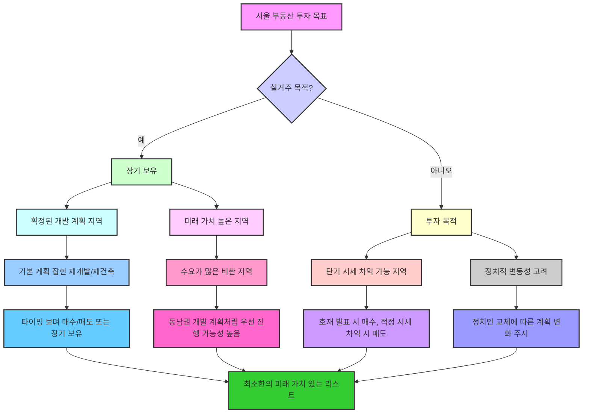
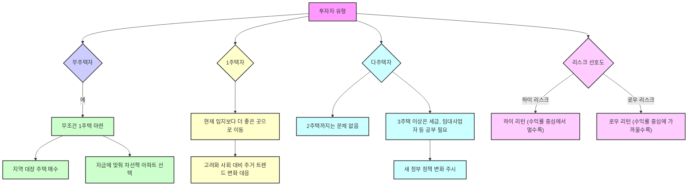

이 책은 부동산 전문가 빠숑 김학렬 작가가 쓴 '서울 부동산 절대 원칙'에 대한 내용을 담고 있어. 서울 부동산 시장의 본질을 이해하고, 미래를 예측하며, 현명한 의사결정을 내리는 데 필요한 기본적인 원칙들을 알려주는 책이야. 단순히 오르고 내리는 시장 상황보다는 부동산의 근본적인 가치, 즉 '입지'에 집중해서 서울 부동산의 과거, 현재, 미래를 분석하고, 이를 통해 지방 부동산까지 이해할 수 있는 통찰력을 제공하는 것이 목표라고 보면 돼.
## 1. '서울 부동산 절대 원칙' 책 소개: 본질에 집중하는 서울 부동산 이야기 

이 책은 부동산 시장의 오르내림보다는 본질에 집중해서 서울 부동산을 이해하는 기본적인 원칙을 알려주는 책이야.  부동산은 '입지'를 빼놓고는 이야기할 수 없기 때문에, 가장 좋은 스터디(공부) 대상인 서울을 가지고 부동산의 원칙을 설명하고 있어.  서울 부동산이 어떻게 만들어졌고, 어떻게 흘러갈지, 그리고 이 과정을 통해 우리가 어떤 메시지를 얻어야 하는지를 다루고, 서울을 제외한 지방 부동산을 이해할 때도 이런 논리를 적용할 수 있도록 돕는 것이 목적이야. 

### 1.1. 책의 구성: 1부 서울 부동산 분석, 2부 2040 서울 도시기본계획 

이 책은 크게 두 부분으로 나뉘어 있어.

1. **1부: 서울 부동산의 다양한 각도 분석** 
  - 우리가 태어나서 죽을 때까지 연령대별로 어떤 활동을 하는지 부동산 입장에서 정의하고, 가장 편리하고 행복하게 살 수 있는 공간들을 정리했어. 
  - 교육, 일자리, 의료, 복지, 환경 등 분야별로 서울 부동산의 가치가 어떻게 자연스럽게 정리되는지를 설명해. 
  - 서울의 과거, 현재, 미래 이야기를 쭉 풀어나가. 
  - 2017년에 나왔던 '서울 부동산 미래'라는 책과 비교해서 6년 동안 어떤 점이 변했고, 그때 이야기했던 것들이 어떻게 진행되었는지를 설명하는 부분이야. 

2. **2부: **2040 서울 도시기본계획 
  - 최근 서울시에서 발표한 2040 서울 도시기본계획(서울의 미래를 위한 큰 그림)에 대한 내용이 담겨 있어. 
  - 이 계획은 2,000페이지나 되는 방대한 내용인데, 그중에서 여러분에게 필요한 내용과 실제로 실현 가능한 부분들을 뽑아서 정리했어. 
  - 이 계획을 어떻게 이해하고, 어떻게 활용하며, 어떤 의사결정을 해야 하는지를 정리한 부분이야. 

### 1.2. 1부 심층 분석: 서울의 역사와 뉴타운 개발 

1. **강남의 오래된 역사** 
  - 많은 사람이 몽촌토성이나 풍납토성(송파구, 강동구)을 오래된 유적지로 생각하지만, 구석기, 신석기 시대까지 거슬러 올라가면 강남구 삼성동 쪽이 더 오래된 유적지가 나와. 
  - 박정희 대통령 시절 강남 개발 당시, 삼성동 경기고등학교 앞에서 큰 유적지가 발견되었지만, 공사를 위해 메꿔지고 비석만 세워졌어. 
  - 이는 강남구가 생각보다 훨씬 오래전부터 사람이 살았던 지역이라는 증거가 돼. 

2. 뉴타운** 개발의 성공 사례와 미래** 
  - 뉴타운(낡은 동네를 새롭게 개발하는 사업)은 서울시 개발 계획 중 가장 성공적인 케이스(사례)라고 할 수 있어. 
  - **강남 개발과의 차이점**: 강남 개발은 국가 주도로 인위적으로 밀어붙인 것이라 실패하기 어려웠지만, 뉴타운은 기존 주민들과 함께 개발하는 방식을 찾은 거야. 
  - 강남 개발은 단기간에 600년 중심지였던 종로, 중구, 용산구를 제치고 1등 지역이 되었어. 
  - 하지만 강남만 개발되면서 강북 지역은 점점 낙후되었고, 이를 개선하기 위해 뉴타운 계획이 나오게 된 거지. 
  - **이명박 시장의 뉴타운 계획**: 2000년대 초반 이명박 시장이 제안했고, 4년이라는 짧은 임기 동안 버스 전용차선, 청계천 복원과 함께 뉴타운 사업을 성공적으로 추진했어. 
  - 특히 뉴타운과 버스 전용차선은 서울 서민들을 위해 가장 공헌한 사업이라고 평가돼. 
  - **시범 뉴타운 사례**:
  - **길음 뉴타운**: 낙후된 산동네, 달동네를 개발한 사례야. 
  - **은평 뉴타운**: 택지 신도시(새로운 땅에 도시를 만드는 것) 사업에 가까워. 
  - **왕십리 뉴타운**: 기존 도심을 재개발한 사례야. 
  - **주목해야 할 뉴타운**: 길음 뉴타운과 왕십리 뉴타운은 앞으로 서울에서 진행될 도시 정비 사업의 모델이 될 수 있어. 
  - 산동네 개발 형태는 길음 뉴타운, 도심 역세권 상권 밀집 지역 개발 형태는 왕십리 뉴타운을 참고하면 돼. 
  - 이 두 뉴타운은 20년 정도의 시간을 거쳐 개발이 검증되었고, 서울 지역도 이렇게 개발하면 좋아질 수 있다는 것을 보여줬어. 
  - **미래 투자 관점**: 길음 뉴타운이나 왕십리 뉴타운처럼 될 수 있는 남은 뉴타운 지역이나 개발 가능한 부지들을 이런 관점으로 보면, 지금은 불편하고 시세가 낮지만, 개발 후에는 살기 편해지고 수요를 더 많이 끌어올 수 있는 곳들을 찾을 수 있어. 

### 1.3. 서울 데이터 분석: 매매가와 전세가의 차이 

1. **매매가와 전세가의 격차** 
  - 2017년과 2022년 데이터를 비교했을 때, 서울의 매매 가격은 분명히 많이 올랐지만, 전세 가격은 다른 지역들과 비교했을 때 큰 격차가 없어. 
  - 이 현상은 해석하는 사람에 따라 폭등론(가격이 폭발적으로 오를 거라는 주장)의 근거도 되고, 폭락론(가격이 폭락할 거라는 주장)의 근거도 될 수 있어. 
  - 하락론자들은 "실거주 가치는 변하지 않았는데 매매가만 오른 것은 거품이다, 빠져야 한다"고 주장할 수 있어. 
  - 상승론자들은 "미래 가치가 미리 반영된 것이 아니냐"고 주장할 수 있어. 

2. **개별 입지와 상품으로 판단해야 하는 이유** 
  - 단순히 전세 가격은 오르지 않는데 매매 가격이 올라갔다는 것만으로는 판단할 수 없어. 
  - 개별 입지(지역)와 개별 상품(아파트 단지)을 일일이 따져봐야 해. 
  - 실제로 거품이 생겨서 올라간 지역이나 상품도 분명히 있기 때문에, 그런 경우는 위험하다고 이야기해야 해. 

3. **압구정 현대아파트 사례** 
  - 압구정 현대아파트는 10년 동안 전세 가격은 별로 오르지 않았지만, 매매 가격은 3배나 올랐어. 
  - **전세 가격이 낮은 이유**: 현재 거주 가치(살기 좋은 정도)가 낮기 때문이야. 아무리 인테리어를 잘해도 오래된 아파트라 추운 날 난방이 잘 안 되거나, 생활 공간이 줄어드는 등 근본적인 문제가 해결되지 않아. 
  - 미래 가치: 하지만 압구정 현대아파트의 미래 가치는 지금보다 높을 것으로 예상돼. 새 아파트로 바뀌고 나면 전세가도 크게 오를 거야. 
  - **선택의 문제**: 압구정 현대아파트 30평대 전세 가격이 10억이 안 되는데, 그 돈이면 차라리 개포동이나 반포동의 새 아파트에 가는 것이 훨씬 살기 좋다고 느끼는 사람들이 많아. 

4. **새 아파트의 가치와 개포동 사례** 
  - 새 아파트가 살기 좋은 것은 사실이야. 
  - **개포자이 프레지던스 사례**: 최근 입주를 시작한 개포자이 프레지던스 34평 전세가 9억에 거래되었어. 
  - 이 아파트는 스크린 골프장, 실내 골프장, 수영장, 인피니티 풀(하늘과 맞닿은 듯한 수영장) 등 최고급 시설을 갖추고 있어. 
  - 입주민은 이런 시설을 저렴하게 이용할 수 있어. 
  - 주상복합이나 오피스텔보다 관리비가 저렴한 편인데, 로비식 공간이 아니기 때문이고, 세대수가 많으면 1/n(나누기)로 공용 관리비가 줄어들기 때문이야. 
  - 최근 아파트들은 태양열 같은 신재생에너지를 이용해 공용 전기료를 절약하기도 해. 
  - **실거주 가치와 전세가**: 실거주 가치만 놓고 보면, 구축(오래된 아파트)이 많을수록 전세 가격은 오르지 않고, 새 아파트만 오르는 경향이 있어. 

5. 재건축**/리모델링과 거품 판단** 
  - **구축의 장점**: 구축 아파트의 장점은 리모델링(고쳐서 쓰는 것)이나 재건축(새로 짓는 것)을 할 수 있다는 점이야. 
  - 미래 가치: 재건축/리모델링이 확정되었거나 가능성이 높은 구축 아파트는 미래 가치가 높아. 
  - **거품 판단의 기준**: 전세가가 낮은데 매매가가 올라가는 경우, 지방에서는 '이 가격이면 서울을 사지, 여길 왜 사지?' 싶은 단지들이 있는데, 이런 곳은 거품일 가능성이 높아. 
  - **진정한 거품은 무엇인가**:
  - 2021년 서초구 반포동 아크로리버파크 34평이 46억 6천만 원(평당 1억 3천만 원)에 거래된 것이 거품일까? 
  - 아니면 1억짜리 빌라를 1억 5천에 전세 끼고 대출받는 것이 거품일까? 
  - 후자가 더 거품이라고 볼 수 있어. 1억짜리 빌라에 1억 5천 전세를 받는 것은 법적인 빈틈을 노려 주택도시보증공사(HUG)의 보증을 받으려는 것이지, 실제 가치가 1억 5천이 아니기 때문이야. 
  - **정부 지원 없는 자발적 지불 가치**: 절대 가격이 높은 곳이 거품이 아니라, 정부 지원 없이도 자발적으로 그 금액을 지불할 가치가 있는 단지인지를 따져봐야 해. 

### 1.4. 전세가 상승과 매매가 상승의 관계 

1. **전세가가 매매가를 밀어 올리는 경우** 
  - 전세 가격이 매매 가격을 밀어 올릴 정도로 붙어 있는 단지들은 솔직히 아주 좋은 단지는 아니야. 
  - 인플레이션**(물가 상승) 반영**: 전세 가격이 오르지 않다가 갑자기 오르는 경우는, 그동안 인플레이션만큼 전세 가격이 반응하지 않았던 것이 뒤늦게 올라가는 자연스러운 현상일 수 있어. 
  - **단기 투자자들의 영향**: 단기간에 전세가가 매매가를 올리는 경우는 투자자들(투기 수요) 때문에 발생하기도 해. 
  - 투자자들이 들어와야 임차 물건(전세, 월세)도 공급될 수 있고, 시장 전반적으로 자연스러운 흐름이라고 볼 수 있어. 

2. **2020-2021년 전세 대란과 시세 왜곡** 
  - **임대차 3법의 영향**: 2020년 임대차 3법(세입자 보호를 위한 법) 시행으로 전세 매물이 묶이면서, 임차인들이 이사를 가고 싶어도 갈 수 없는 상황이 발생했어. 
  - **매물 부족과 가격 폭등**: 전세 매물이 하나도 없다 보니, 말도 안 되는 전세 가격을 불러도 이사를 꼭 가야 하는 사람들은 그 가격을 받아들일 수밖에 없었어. 
  - **시세 왜곡**: 2021년 같은 경우는 매도자(집 파는 사람)나 임대인(집주인)이 부르는 가격이 시세(시장 가격)가 되어버리는 현상이 나타났어. 
  - 거래량이 많지 않은 상태에서 형성된 가격이었기 때문에, 이런 가격은 언제든지 빠질 수 있는 거품이었어. 
  - **2021년 시세는 지워라**: 작년에 "2021년 시세는 지우라"고 수천 번 강조했던 이유가 바로 여기에 있어. 

## 2. 2040 서울 도시기본계획: 복합 기능 도시로의 전환 

### 2.1. 2040 서울 도시기본계획의 핵심: 용도 복합화 

1. **기존 용도 지역의 한계**: 기존에는 용도가 정해지면 한 가지 용도(예: 주거, 상업)밖에 할 수 없었어. 
  - 예를 들어, 여의도 지구, 압구정 지구, 동부이촌동 지구는 아파트밖에 지을 수 없었지. 
2. **용도 복합화**: 2040 계획의 가장 큰 핵심은 이런 지역들을 아파트만 짓는 것이 아니라, 상업 시설, 일자리, 다른 시설들을 복합적으로 넣겠다는 거야. 
  - 서울은 더 이상 활용할 부지(땅)가 없기 때문에, 기존 부지를 재생(다시 개발)할 때 단순하게 주거나 상업 용도로만 활용하는 것이 아니라, 여러 가지 복합적인 기능들을 한 공간에 짬뽕(섞어서)해서 넣겠다는 계획이야. 

### 2.2. 복합 기능 도시의 예시와 미래 

1. **롯데월드타워와 같은 **복합 시설: 국내에는 크게 없지만, 뉴욕이나 도쿄 같은 곳에 일부 되어 있고, 서울에서는 잠실 롯데월드타워를 생각해보면 감이 올 거야. 
  - 롯데월드타워는 위에 아파트, 고급 레지던스(호텔식 주거 시설), 호텔이 있고, 대형 백화점, 공원, 그리고 도보권(걸어서 갈 수 있는 거리)에 학교와 학원가까지 있어. 
  - 잠실이라는 지역 자체가 복합 시설로 개발된 사례라고 볼 수 있지. 
2. **미래 복합 개발 지역**:
  - GBC**(글로벌 비즈니스 센터)**: 봉은사역부터 삼성역까지 개발하겠다는 계획이 이런 복합 시설 개발의 대표적인 예시야. 
  - 용산역 국제업무지구: 정비창 부지(기차 정비 시설이 있던 땅)에 말 그대로 복합 기지(여러 기능이 합쳐진 곳)를 만들 계획이야. 
  - 오세훈 시장이 직접 브리핑(설명)하며 "용산역 개발이 실질적인 서울의 미래다"라고 말했어. 
  - **서울 전역으로 확대**: 이런 시설들을 규모는 다르겠지만 서울 25개 구(자치구) 전역에 골고루 배분하겠다는 것이 이번 계획의 목표야. 
  - **실현 가능성**: 하지만 계획은 계획이고 다 실현되지는 않기 때문에, 우선순위와 실현 가능성을 잘 살펴봐야 해. 

### 2.3. 새로운 교통수단과 호재에 대한 반응 

1. **새로운 교통수단에 대한 태도**: UAM(도심 항공 교통, 하늘을 나는 택시 같은 것) 같은 새로운 교통수단이 생기면 일단 즐기고, 두려워하지 않는 것이 중요해. 
  - 먼저 이용해보고 괜찮다고 생각하면 급속하게 퍼질 거야. 
  - 전기차도 처음에는 우려했지만, 지금은 빠른 속도로 퍼지고 충전소도 많이 생기고 있잖아. 
  - 부동산을 공부하는 사람이라면 새로운 것이 나올 때 먼저 도전해보는 것도 나쁘지 않아. 
  - 시범 지역에서 성공하면 확장될 텐데, 얼마나 빨리 확장될지는 사람들이 얼마나 많이 이용하는지에 따라 달라질 거야. 

2. **투자 타이밍과 전략** 
  - **사용 목적**: 만약 새로운 교통수단을 직접 사용하려는 목적이라면, 가시화(눈에 보이게 실현)될 때 들어가는 것이 맞아. 
  - **투자 목적**: 투자 목적이라면 걱정할 필요가 없어. 가격이 올라가는 기간이 짧고, 올라갔다가 조정(잠시 멈추거나 내려가는 것)을 거치다가 다시 오르기도 해. 
  - 투자자들은 호재(좋은 소식)가 보이면 사는 것이고, 장기로 가져가는 것이 아니라 여차하면 파는 거야. 
  - '무조건 장기 투자해야 한다'는 것은 실거주(직접 살기)하는 사람들의 마인드(생각)이고, 투자자라면 사이클(주기), 타이밍(시기), 가격, 상품에 대한 공부를 해야 해. 
  - 투자는 실패할 확률(리스크)도 있기 때문에 본인이 감당해야 해. 

3. GTX**(수도권 광역급행철도) 사례** 
  - GTX A: 이미 착공(공사 시작)했기 때문에 확정된 사업이야. 
  - 2023년 하반기부터 삼성역을 제외하고 부분 개통을 시작하고, 삼성역 포함 전 구간은 2025년 이후에 개통될 예정이야. 
  - **GTX B, C**: 확정은 되어 있지만 아직 착공을 안 했어. 
  - 발표와 확정 소식만으로 가격이 올랐지만, 대세 상승장(부동산 가격이 전반적으로 오르는 시기)이었기 때문에 호재가 있는 곳이 더 올랐던 거야. 
  - 투자라면 단타(짧은 기간 투자)로 적당한 시세 차익을 보고 빠지는 것이 맞아. 
  - **정치적 영향**: 단타 호재는 정치인들에 따라 계획이 확확 바뀌기도 해. 
  - GTX A, B, C 노선 중 C가 먼저 추진된 것은 당시 정권과 관련된 정치적 이유가 있었을 수 있어. 
  - 정권이 바뀌자 최근에는 C보다는 B 노선 이야기가 더 많이 나오고 있어. 

### 2.4. 서울 부동산 투자 추천 리스트와 판단 기준 

1. **추천 리스트의 의미**: 책에 실린 추천 리스트는 "그래서 뭘 사란 말이야?"라고 반문할 사람들을 위한 하나의 제안이야. 
  - 이 리스트는 정답이 아니라 참고 답안이며, 미래 가치가 있는 곳들을 담고 있어. 
  - 기본 계획이 잡힌 재개발, 재건축 지역만 넣었기 때문에 언제 될지는 모르지만, 일단 시작은 한 곳들이야. 
  - 이런 곳들을 타이밍을 보면서 샀다 팔았다 하거나, 실거주 목적으로 장기간 가져갈 수 있는 최소한의 리스트라고 보면 돼. 

2. **가장 기대되는 지역**: 당연히 능력이 된다면 가장 비싼 지역이 좋아. 
  - **동남권 개발 계획 사례**: 동남권(강남 3구 등) 개발 계획은 페이지 수는 제일 많지만, 진도가 나간 것이 거의 없어. 
  - 반면, 동남권(강남 3구 등)은 페이지 수는 제일 적은데 거의 다 개발이 완료되었어. 
  - 이는 수요가 어디에 몰려있는지를 객관적으로 보여주는 지표야. 
  - 결국 비싼 지역들이 수요가 많고, 수요가 많으면 개발 계획이 있을 때 우선적으로 진행될 가능성이 높아. 

## 3. 부동산 투자 절대 원칙: 현재 가치와 미래 가치 

### 3.1. 어떤 집을 사야 할까? 

1. 현재 가치는 낮고** 미래 가치는 높은 곳**: 빠숑님은 현재 가치는 낮지만 미래 가치가 높은 곳을 사야 한다고 강조해. 
  - 현재 가치: 교통, 직장(일자리), 생활 환경, 주변 인프라(기반 시설), 자연환경 등을 말해. 
  - 미래 가치: 앞으로 생겨날 일자리, 교통망, 호재(좋은 소식)나 이슈(쟁점) 등을 말해. 
  - **실패 없는 투자**: 현재 수요는 낮지만 미래 수요가 높은 곳을 사면 실패할 일이 거의 없어. 

### 3.2. 주목해야 할 지역 5곳 

빠숑님은 방송에서 공개적으로 다섯 곳을 꼽았어. 이 지역에 살고 있거나 집을 살 계획이 있다면 관심을 가져보는 것이 좋아.

1. 고양시
2. **평택시**
3. **의정부시**
4. **성남시**
5. **화성시**

### 3.3. 서울 및 지역별 평당가 분석 

1. **전국 평균 평당가**:
  - 인천: 200만 원 
  - 서울: 4,300만 원 
  - 경기도: 2,050만 원 
  - 고양시: 2,050만 원 (경기도 평균과 같아) 
2. **서울의 높은 가격**: 송파구, 강남구 같은 곳은 평당가가 상당히 높아. 강남구와 서초구는 거의 같은 강남 생활권으로 볼 수 있어. 
3. **서울의 미래**: 서울은 앞으로도 계속 상승할 것으로 전망돼. 

### 3.4. 서울처럼 입지가 좋아질 지역 

1. **서울, 경기, 인천**: 앞으로 5년 동안 가장 많이 변화할 지역으로 서울, 경기, 인천이 꼽혀. 
2. **경기도 성남**: 강남과 강북의 차이가 있겠지만, 성남을 중심으로 한 한강변 지역들은 상당히 많이 상승할 것으로 예상돼. 
3. **인천**: 송도, 청라, 검단 신도시가 주목받고 있어. 
4. **개인적인 추가 지역**: 성남시, 광명시, 고양시, 하남시, 시흥시, 화성시 등 3기 신도시가 들어서는 지역들은 앞으로 입지가 계속 좋아질 거야. 

### 3.5. 화성시와 고양시의 잠재력 

1. **화성시 분석**:
  - **아파트 세대수**: 28만 3천 세대 (고양시보다 적어). 
  - **인구수**: 87만 명 (세대수에 비해 인구가 많아). 
  - **사업체 수 및 종사자 수**: 현재는 부족하지만, 앞으로 많은 일자리가 들어올 계획이라 늘어날 거야. 
  - **아파트 시세**: 21평형이 1,729만 원 정도로, 아직 투자하기에 나쁘지 않은 지역이야. 

2. 고양시** 분석**:
  - 현재 가치** 낮고 **미래 가치** 높음**: 고양시는 현재 가치가 낮고 미래 수요가 증가하며 미래 가치가 상승할 것으로 예상돼. 
  - **교통 호재**:
  - 2023년: 대곡-소사선(일산에서 소사로 연결되는 서해선) 개통 예정. 
  - 2024년: GTX-A(수도권 광역급행철도 A노선) 개통 예정 (GTX B, C, D보다 6~7년 빠름). 
  - 미래 가치** 상승 전망**: 이런 교통 호재로 인해 미래 가치가 계속 상승할 거야. 
  - **현재 시세 순위**:
  - 일산동구: 시세 2위 
  - 고양시 덕양구: 14위 
  - 일산서구: 28위 
  - **가격 상승 전망**: 앞으로 15억 이상으로 오를 것으로 예상돼. 

3. **추가 주목 지역**: 평택시, 성남시, 의정부시도 주목할 만해. 

### 3.6. 부동산 시장의 양극화와 서울의 가치 

1. **현재 수요 가치는 낮고 미래 가치는 높은 곳**: 많은 사람들이 현재 수요가 부족하고 낮은 곳에 투자해서 미래 수요가 높은 곳을 사면 실패는 없어. 
2. **2021년 **평당가** 기준**:
  - 서울: 4,040만 원 
  - 전국: 2,070만 원 
  - **서울 내 **양극화: 서울 안에서도 강남구부터 송파구까지는 서울 평균보다 높고, 강남구는 평당 1억 원에 달하지만, 구로구 같은 곳은 2천만 원대도 있어. 
  - **부동산 시장의 양극화 심화**: 앞으로 부동산 시장은 양극화가 계속 심해질 거야. 
3. **경기도 평당가**: 경기도 상위 1위부터 9위까지는 과천시부터 시작해서 용인시까지 평당가가 높아. 
  - 고양시 평당가는 올 하반기 금리 인상 후 내년부터 경기도 평균보다 더 높게 치솟을 것으로 예상돼. 
4. **인천 평당가**: 연수구(송도 포함)는 1,821만 원으로 상당히 높고, 청라, 검단 신도시가 있는 서구도 앞으로 상승 여지가 높아. 
5. **고양 특례시의 미래**: 올 상반기, 빠르면 올 하반기, 늦으면 내년부터 고양 특례시의 변화를 주목해야 해. 
6. **주택 가격 상승의 이유**:
  - **수요와 공급**: 지방의 중소도시나 군면 단위는 빈집이 많지만, 수도권(서울, 경기, 인천, 충청권까지 확장 예상)은 교통, 일자리, 인구가 계속 증가하면서 수요가 몰려. 
  - **일자리, 학군, 편의시설**: 일자리, 학군(좋은 학교), 병원 같은 편의시설이 서울 중심에 다 위치하고 있기 때문에 사람들이 계속 몰리는 거야. 
  - **코로나19 영향**: 코로나19 이후 건강과 웰빙(잘 먹고 잘 사는 것)에 대한 관심이 높아지면서 서울 수도권으로 수요가 더 몰릴 것으로 예상돼. 
  - **오르는 곳만 계속 올라**: 이미 많이 올랐지만, 앞으로도 계속 오를 것이고, 특히 그동안 오르던 곳들만 계속 오를 거야. 
  - 무주택자: 무주택자(집이 없는 사람)는 하루라도 빨리 내 집 마련을 해야 해. 

## 4. 부동산 매수/매도 타이밍과 전략 

```mermaid
graph TD
    A["부동산 매수/매도 타이밍"] --> B{"시장 상황 판단"};
    B -- 대세 상승장 --> C["모든 부동산이 상승하지 않음"];
    B -- 대세 하락장 --> D["모든 부동산이 하락하지 않음"];

    A --> E["매수 타이밍"];
    E --> F["남들이 안 살 때 매수"];

    A --> G["매도 타이밍"];
    G --> H["남들이 안 팔 때 매도"];

    A --> I["매수 단계부터 매도 전략 필요"];
    I --> J["팔 때를 생각하고 매수"];
    I --> K["싼 이유를 판단하고 매수"];

    A --> L["무주택자의 첫 주택 마련"];
    L --> M["신중하게 결정"];
    L --> N["빌라/다가구보다 아파트 선호"];
    L --> O["능력에 맞춰 20평대부터 시작"];

    A --> P["가장 좋은 주택 vs. 애매한 주택"];
    P --> Q["가장 좋은 주택: 수익률 낮음, 리스크 낮음"];
    P --> R["애매한 주택: 수익률 높음"];

    A --> S["서울과 비교해도 좋을 지역 선택"];
    S --> T["나쁜 것을 팔기보다 상황에 맞춰 매도"];
    S --> U["장기적인 플랜 (임대사업자, 증여 등)"];

    style A fill:#f9f,stroke:#333,stroke-width:2px;
    style B fill:#ccf,stroke:#333,stroke-width:2px;
    style C fill:#cfc,stroke:#333,stroke-width:2px;
    style D fill:#ffc,stroke:#333,stroke-width:2px;
    style E fill:#cff,stroke:#333,stroke-width:2px;
    style F fill:#fcf,stroke:#333,stroke-width:2px;
    style G fill:#fcc,stroke:#333,stroke-width:2px;
    style H fill:#ccc,stroke:#333,stroke-width:2px;
    style I fill:#9cf,stroke:#333,stroke-width:2px;
    style J fill:#f9c,stroke:#333,stroke-width:2px;
    style K fill:#c9f,stroke:#333,stroke-width:2px;
    style L fill:#99f,stroke:#333,stroke-width:2px;
    style M fill:#6cf,stroke:#333,stroke-width:2px;
    style N fill:#f6c,stroke:#333,stroke-width:2px;
    style O fill:#3c3,stroke:#333,stroke-width:2px;
    style P fill:#f9f,stroke:#333,stroke-width:2px;
    style Q fill:#ccf,stroke:#333,stroke-width:2px;
    style R fill:#cfc,stroke:#333,stroke-width:2px;
    style S fill:#ffc,stroke:#333,stroke-width:2px;
    style T fill:#cff,stroke:#333,stroke-width:2px;
    style U fill:#fcf,stroke:#333,stroke-width:2px;
```

### 4.1. 매수/매도 타이밍의 원칙 

1. **대세 상승장/하락장**: 대세 상승장(전반적으로 가격이 오르는 시기)이라고 해서 모든 부동산이 상승하는 것은 아니고, 대세 하락장(전반적으로 가격이 내리는 시기)이라고 해서 모든 부동산이 하락하는 것도 아니야. 
2. 매수 타이밍: 남들이 안 살 때 사는 것이 좋아. 
3. 매도 타이밍: 남들이 안 팔 때 파는 것이 좋아. 
  - 작년 9~10월처럼 인기가 약하게 올라갔을 때 판 사람도 있고, 안 판 사람도 있는데, 지금은 팔려고 해도 여러 여건 때문에 잘 안 팔려. 
  - 남들이 살 때 안 사고, 남들이 안 팔 때 파는 반대 전략을 쓰는 것이 중요해. 

### 4.2. 매수 단계부터 매도 전략 세우기 

1. **팔 때를 생각하고 사기**: 매수(사는 것) 단계부터 매도(파는 것) 전략이 필요해. 
  - 사람들은 살 때는 "무릎을 꿇고 사라"는 말처럼 무조건 사려고 하지만, 팔 때를 생각하고 사야 해. 
  - 싸더라도 싼 이유를 판단하고, 팔 때를 생각해서 매수해야 더 좋은 결과를 얻을 수 있어. 

### 4.3. 무주택자의 첫 주택 마련 

1. **신중한 결정**: 무주택자(집이 없는 사람)가 처음 집을 살 때는 아무 집이나 사면 안 돼. 
  - 충분히 준비하고 공부해서 신중하게 결정해야 해. 
2. **아파트 우선**: 빌라나 다가구보다는 아파트를 첫 주택으로 마련하는 것을 추천해. 
3. **능력에 맞춰 시작**: 능력에 맞춰 30평이 안 되면 20평대부터 시작하는 것이 좋아. 

### 4.4. 수익률과 주택 선택 

1. **가장 좋은 주택 vs. 애매한 주택**:
  - **가장 좋은 주택**: 수익률이 낮을 수 있어. 
  - **애매한 주택**: 오히려 수익률이 높을 수 있어. 
2. **서울과 비교해도 좋을 지역 선택**: 가장 좋은 주택은 많은 사람들이 서울, 특히 강남에 있는 주택이라고 생각하지만, 비싸기 때문에 모두에게 좋은 것은 아니야. 
  - 서울 중에서도 아직 2천만 원대인 구들도 있기 때문에 무조건 서울이라고 해서 이사하려는 것보다는, 앞으로 서울과 비교해도 좋을 지역을 선택하는 것이 중요해. 
  - **나쁜 것을 팔기보다 상황에 맞춰 매도**: 나쁜 것을 무조건 팔기보다는 상황에 맞춰 매도하는 것이 좋아. 
  - 예를 들어, 종합부동산세(집을 많이 가진 사람에게 부과하는 세금) 때문에 매도해야 할 경우, 다음 집을 살 수 없다면 임대사업자(집을 빌려주고 월세 등을 받는 사업자)로 전환하거나 증여(재산을 물려주는 것)를 고려하는 등 장기적인 플랜(계획)을 가져가는 것이 좋아. 

## 5. 투자 리스크와 주택 보유 전략 

### 5.1. 하이 리스크 하이 리턴 vs. 로우 리스크 로우 리턴 

1. **수익률 중심에 가까울수록**: 리스크(위험)는 낮지만 비싸기 때문에 수익률도 낮아. 
  - 1등 주택(가장 좋은 집)을 사면 리스크는 거의 없지만, 비싸서 모두가 살 수는 없어. 
2. **수익률 중심에서 멀수록**: 리스크는 높지만 하이 리턴(높은 수익)을 기대할 수 있어. 
3. 1가구 2주택: 능력이 된다면 1가구 2주택(집 두 채 보유)까지는 괜찮다고 봐. 
  - 서울에 한 채, 수도권에 한 채, 혹은 서울에 두 채를 가질 수도 있지만, 세금이 많이 나올 수 있어. 
  - 매도하지 않고 장기적으로 가져간다면, 한 채는 보유하고 한 채는 임대(세 놓는 것)를 주면서 자식들에게 증여하거나 양도(팔아서 이익을 보는 것)할 수도 있어. 
4. 무주택자: 무조건 1주택을 마련해야 해. 
  - 이왕이면 지역의 대장 주택(가장 좋은 아파트)을 매수하고, 능력이 안 된다면 자금에 맞춰 2등, 3등 차선책 아파트를 선택해도 괜찮아. 

### 5.2. 고양시 덕양구의 미래 가치 

1. **고양 덕양구의 상승률**: 2011년 기준 경기도 전체에서 고양 덕양구가 11.8% 상승률로 5위를 기록했어. 
  - 2011년에 이미 많이 올랐기 때문에 지금은 주춤하고 있지만, 올 하반기 이후에는 다시 상승할 것으로 예상돼. 
2. 삼송** 벨트 주목**: 고양 특례시 중에서도 일산동구, 일산서구도 많이 오르겠지만, 삼송 벨트(삼송 지역)를 주목해야 해. 
  - 덕양구 삼송은 몇 년 전부터 미래 가치가 높다고 강조해왔고, 빠숑님도 주목하라고 이야기했어. 
  - 10년이 지나면 개발과 입지가 더 좋아질 것이고, 용산과 고양시 덕양구가 1등 지역이 될 거야. 

### 5.3. 기관별 관심 부동산과 주거 트렌드 

1. **기관별 관심 부동산**:
  - **장기적**: 국가에서 개발하는 투영 신도시(3기 신도시 등), GTX(수도권 광역급행철도) 노선이 지나가는 지역. 
  - 무주택자 중 종잣돈(투자 씨드머니)이 없는 사람들은 무조건 도전해야 해. 
  - 새 정부에서 집을 시정(정책을 펼치다)한다면, 전화 주변(전철역 주변)을 중심으로 동쪽과 위쪽으로 사전 동의(미리 동의를 받는 것)를 받아 특구(특별 구역)로 지정될 가능성이 높아. 
  - 내년에 대곡-소사선이 개통하면 고양시는 한 단계 상승할 거야. 
  - 고양시 무주택자 중 종잣돈이 있다면 지금이라도 아파트 대출이 풀리면 내 집 장만을 하고, 안 된다면 창릉, 장항, 풍동의 일반 분양이나 덕은 지구 국방대학교 부지 분양을 노려봐야 해. 
  - **중기적**: 기존 아파트, 재건축, 재개발, 리모델링 단지. 
  - 현재는 분양가 상한제(아파트 분양 가격을 제한하는 제도) 때문에 청약(새 아파트 분양 신청)을 많이 하지만, 다음 정부에서 어떻게 될지 모르니 전략을 잘 짜야 해. 
  - **단기적**: 변동성이 큰 아파트, 각종 비주거 상품. 

2. **주목해야 할 주거 트렌드**:
  - 새 아파트: 앞으로도 계속 수요가 급증할 거야. 
  - **교육 환경**: 교육 환경이 잘 갖춰진 주거 타운(주거 단지)은 수요가 많아. 
  - 고속터미널 주변의 강남, 삼성동, 잠실동 같은 곳은 앞으로 더 많은 사람들이 찾을 것이고, 가격도 더 많이 오를 거야. 
  - **입지대 이론보다 **입지** 회귀 동인**: 입지대 이론(도시 중심에서 멀어질수록 지대가 낮아진다는 이론)보다는 입지 회귀 동인(사람들이 다시 좋은 입지로 돌아가려는 경향)이 더 강해지고 있어. 

### 5.4. 부동산 시장의 변화와 개인의 대응 

1. **코로나19와 주거 트렌드**: 코로나19가 감기처럼 계속 진행된다면, 주거 트렌드도 계속 변할 거야. 
  - 과거 임대로 살던 사람들도 내 집 마련을 해야 한다는 생각을 갖게 될 거야. 
  - 고령화 사회(나이 든 사람이 많은 사회)에서는 집 없이는 살 수 없기 때문에 무주택자는 반드시 집을 사야 해. 
2. **1주택자**: 현재 살고 있는 입지보다 더 좋은 곳을 찾아가야 해. 
  - 삼송에 살다가 갑자기 연천이나 더 외곽으로 이사 가는 것은 좋지 않아. 
3. 다주택자: 2주택까지는 다주택자로 생각하지 않아. 
  - 3주택 이상부터는 세금, 임대사업자 등 여러 가지 공부를 해야 해. 
  - 새 정부에서 부동산 정책을 펼칠 것이므로 꾸준히 공부해야 해. 
4. **빠숑님의 '세상 답사기' 추천**: 빠숑님의 채널을 꾸준히 들으면 생각하지 못했던 인사이트(통찰력)를 얻을 수 있어. 
  - 책을 읽다가 이해가 안 되는 부분이 있다면 한 번으로 끝내지 말고, 세 번 이상 읽어보고 밑줄을 치면서 공부해야 해. 
5. **집은 언제나 필요하다**: 가격이 올라도 집은 필요하고, 가격이 내려도 집은 필요해. 
  - 서울에 집이 필요한 사람은 서울에 집을 사야 하고, 지방에 집이 필요한 사람은 지방에 집을 사야 해. 
  - 하락장 속에서도 살 아파트는 있고, 상승장 속에서도 살 아파트는 있어. 
  - 2022년에 집을 사려는 사람들은 묻지마(무조건) 매수하지 말고, 하루라도 빨리 내 집 마련을 해야 해. 

## 6. 부동산 투자의 핵심 요소: 입지 선택의 7가지 기반 

### 6.1. 부동산 선택의 7가지 기반 요소 

부동산, 특히 아파트를 구매할 때 가장 중요하게 고려해야 할 최소한의 요인들이 있어. 이것들을 '기반 팩터(요인)'라고 부르는데, 총 7가지야. 이 7가지 요소는 사람의 삶과 수요(원하는 것)를 조사한 결과라고 보면 돼. 

1. **일자리 (가장 중요)** 
  - 너무 중요해서 사람들이 아예 언급도 안 할 정도로 당연한 요소야. 
  - 먹고사는 문제(돈벌이)가 해결되지 않는 부동산 입지는 없어. 
  - 대학에 가는 이유도 대부분 좋은 일자리를 얻기 위해서인 것처럼, 우리 생활의 모든 것이 좋은 일자리를 얻기 위해 이루어진다고 볼 수 있어. 
  - 좋은 일자리가 있는 곳에 좋은 부동산이 많다는 기준을 가지면, 나머지는 대부분 해결돼. 

2. **교육 환경** 
  - 일자리가 해결되면 보통 결혼을 하고, 아파트 구매는 4인 가족(아빠, 엄마, 아들, 딸)을 기준으로 생각하는 것이 좋아. 
  - 자녀가 태어나기 전에는 역세권(지하철역 근처)이 중요하지만, 자녀가 생기면 유치원, 초등학교, 중고등학교 학군(학교가 좋은 지역) 등 교육 환경이 1순위도 아닌 0순위가 돼. 
  - 아이들이 자라면서 학원가도 보게 될 거야. 

3. **생활 환경 (상권)** 
  - 남편이 출근하고 아이들이 학교나 학원에 간 후, 전업주부인 엄마가 혼자 있을 때 생활해야 하는 환경이야. 
  - 청소, 밥, 자기계발, 친구들과의 모임 등 생활에 필요한 상권(가게들이 모여있는 곳)이 잘 갖춰져 있어야 해. 
  - 이것이 일반적으로 꼭 필요한 세 가지 요인이라고 볼 수 있어. 

4. **쾌적성 (환경)** 
  - 과거에는 입지가 좋고 교통, 상권이 좋으면 다른 욕망들이 생기기 시작했어. 
  - 최근에는 '환경의 쾌적성'에 대한 욕망이 부각되기 시작했어. 
  - 녹지 공간, 수변 공간(강이나 호수 주변)이 잘 갖춰진 곳이면 더 프리미엄(추가적인 가치)이 붙어. 
  - 과거에는 플러스 알파(있으면 좋은 것) 선택 요인이었지만, 지금은 필수 요인이 되었어. 
  - 결국 일자리가 근본적인 해결책이고, 여기에 교통, 학군, 상권, 환경이 필수 요인으로 갖춰져야 해. 

### 6.2. 미래 가치를 높이는 3가지 변화 

현재 입지를 분석하는 방법 외에, 미래 가치를 따질 때는 이 5가지 요소(일자리, 교육, 생활 환경, 쾌적성, 교통)가 어떻게 좋아질지를 봐야 해. 

1. **일자리 변화** 
  - 일자리가 많지만 더 많아질 곳, 일자리가 증가하는 곳을 보면 수도권이든 지방이든 투자 포인트를 찾을 수 있어. 
  - **1기 신도시와 **2기 신도시:
  - 노태우 대통령 때 만든 1기 신도시는 초반에는 비어있었지만 4년 만에 다 찼어. 
  - 노무현 대통령 때 만든 2기 신도시는 인구가 줄어들고, 지방에 혁신도시, 기업도시를 만들면서 수요가 분산되어 생각보다 지나치게 채워지지 않았어. 
  - **수도권 집중 현상**:
  - 2010년도 이후 중국의 급성장으로 제조업 분야의 경제력이 중국으로 많이 넘어가면서 지방의 제조업 일자리가 줄었어. 
  - 서울 사람들이 혁신도시나 기업 도시로 잘 내려가지 않으면서 지방 성장이 꺾였어. 
  - 2013년부터는 서울 수도권이 다시 오르기 시작했고, 인력이 서울 수도권에만 몰리다 보니 기업들도 서울 수도권에 새로 만들어져. 
  - 결국 서울과 연결된 지역의 역세권 아파트 시세가 오르는 현상이 나타나. 

2. 교통망** 개선** 
  - 특정 지역에 살고 싶어 하는 사람이 많아지는데, 수요를 감당하지 못할 때 신도시를 만들 수 있지만, 서울은 더 확장할 곳이 없어. 
  - 광역 교통망(넓은 지역을 연결하는 교통망)을 만들면 프리미엄이 생기고 가격이 올라. 

3. 새 아파트** 수요 증가** 
  - **아파트 문화의 변화**: 1970년대부터 시작된 아파트 문화는 10년 단위로 계속 발전해왔어. 
  - 신축** 선호 현상**: 2010년대, 특히 2015년 이후에 지어진 새 아파트에 살아본 사람들은 2000년대 이전 아파트를 선택하지 않아. 
  - **수요 증가**: 단독, 다세대, 빌라에 살던 사람들도 아파트로 가고 싶어 하고, 구축(오래된 아파트)에 살던 사람들도 신축(새 아파트)에 살고 싶어 해. 
  - **가장 중요한 기반**: 결국 새 아파트 수요가 증가하는 것이 현재 7가지 기반 요소 중에서 가장 중요하다고 볼 수 있어. 
  - 일자리, 교통망, 새 아파트 수요가 미래 가치를 따질 때 가장 중요한 기반이 돼. 

### 6.3. 입지 요소의 중요성 변화와 미래 전망 

1. 입지** 요소의 가중치 변화**: 7가지 기반 요소가 모든 입지에 똑같은 중요도로 적용되는 것은 아니야. 
  - **수도권**: 서울, 경기, 인천 같은 수도권에서는 교통이 가장 중요해. 
  - **지방**: 부산 정도를 제외한 지방에서는 교육 환경이 가장 중요해. 
  - 지방은 전철이 없거나 하나밖에 없는 경우가 많아 교통의 중요성이 떨어져. 
  - 대구처럼 도시가 크더라도 택시로 15~20분이면 이동 가능한 지역은 교통보다 교육 환경이 더 중요할 수 있어. 
  - **지역 특성 반영**: 지역에 따라 가중치를 다르게 줘야 하지만, 기본적으로 이 4가지 요소(일자리, 교통, 교육, 상권)를 체크하면서 가중치를 바꾸는 것이 중요해. 

### 6.4. 과거 예측과 실제 결과: 강남 아파트 가격 상승 

1. **과거 예측의 충격**: 5년 전, 빠숑님이 강남 압구정 아파트가 평당 1억 원까지 갈 것이라고 예측했을 때 많은 사람들이 충격을 받았어. 
  - 어떤 사람은 믿을 수 없다고 했고, 어떤 사람은 빨리 투자해야 한다고 반응이 갈렸어. 
  - 하지만 지금은 평당 1억 원을 넘어섰어. 
2. **예측의 한계와 실제 상승**: 얼마까지 갈지 예측하는 것은 어렵지만, 지금보다는 계속 더 많이 올라갈 거야. 
  - 과거에 추천했던 압구정 현대아파트, 반포주공 1단지, 잠실주공 5단지 같은 단지들은 5년 안에 10억 정도 오를 것이라고 예측했지만, 실제로는 30억 이상 올랐어. 
  - 수요가 증가하면 현재 가치보다 더 많이 오를 것이고, 미래 가치가 반영되면 더 많은 가치를 가질 것이라는 것은 확실해. 
3. **반포주공 1단지 사례**:
  - 책이 나올 당시 20억이었던 반포주공 1단지 32평이 최근 64억 원에 거래되었어. 
  - 평당 2억 원이 넘는 가격이지만, 이는 싼 가격이라고 볼 수 있어. 
  - 반포주공 1단지는 5천 세대가 넘고 2025년 이후 입주 예정인데, 옆 아크로리버파크(2016년 입주, 1600세대)가 46억 6천만 원인 것을 고려하면, 반포주공 1단지는 재건축 후 100억 이상이 될 수도 있어. 
  - 64억을 주고 100억짜리를 사는 것이기 때문에 싼 것이 맞아. 
  - 이것을 살 수 있는 경제적 능력을 가진 사람이 한정되어 있기 때문에 저평가될 수밖에 없어. 

### 6.5. 잠실주공 5단지 사례와 대출 규제 

1. **잠실주공 5단지 사례**:
  - 옆 리센츠 아파트와 같은 평형대(34평)가 28억 원 전후로 가격이 비슷해. 
  - 하지만 리센츠는 2008년 입주한 낡은 아파트이고 재건축 계획이 없지만, 잠실주공 5단지는 30평대, 45평대를 가지고 있으면 48평을 받을 수 있어. 
  - 재건축 후에는 50억 이상 갈 것이기 때문에, 현재 28억 원은 저평가된 가격이라고 볼 수 있어. 
  - 사람들은 현재 가격만 보고 거품이라고 하지만, 미래 가치를 따지면 그렇지 않아. 

2. **대출 규제와 시장 영향**:
  - **대출 규제**: 잠실주공 5단지를 사려면 대출 없이 현금으로 사야 해. 
  - LTV(주택담보대출비율) 규제로 15억 이상 아파트는 대출이 거의 나오지 않아. 
  - 대출을 받으면 이자와 원금을 상환해야 하는데, 감당할 수 있는 상태가 되어야 해. 
  - 정부는 가격 상승을 억제하기 위해 대출을 규제했고, 이는 실수요층(실제로 살 집을 찾는 사람)을 억제하고 현찰(현금)을 가진 사람들에게만 기회를 주는 결과로 이어졌어. 
  - **사다리 걷어차기**: 대출 규제로 돈이 없는 사람들은 집을 아예 못 사게 되면서 '사다리 걷어차기'(기회를 박탈하는 것)라는 비판을 받았어. 
  - **대출 규제 완화 가능성**:
  - 새 정부에서는 대출 규제를 풀겠다고 공약했어. 
  - 특히 LTV는 풀릴 가능성이 높아. 
  - DSR(총부채원리금상환비율, 소득 대비 빚 갚는 능력)은 고려해야 할 부분이 많기 때문에 풀기 어려울 수 있지만, 소득이 있으면 대출 이자를 낼 정도가 되면 15억 이상 대출도 풀릴 수 있어. 
  - 이렇게 되면 15억에서 20억 구간의 아파트를 매수하려는 수요가 증가할 것으로 예상돼. 

