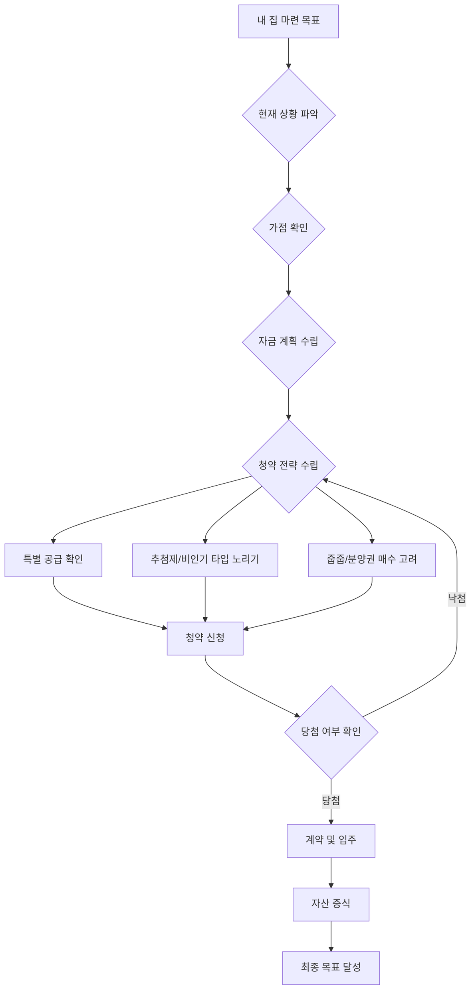

## 아는 만큼 당첨되는 청약의 기술: 내 집 마련 성공 전략
이 책은 책을 읽을 시간이 없는 사람들을 위해, 온라인 오디오북과 요약 팟캐스트 내용을 종합하여, '아는 만큼 당첨되는 청약의 기술'이라는 책의 핵심 내용을 쉽고 해설적으로 풀어낸 책 요약본이야. 청약 초보자부터 다주택자까지, 내 집 마련을 꿈꾸는 모든 사람에게 실질적인 도움을 줄 수 있는 청약 전략과 팁들을 담고 있어. 저자는 단 4년 만에 피아노 전공자에서 베스트셀러 작가이자 인기 강사가 된 '열정 로즈' 정숙희 님으로, 그녀의 경험과 노하우가 이 책에 고스란히 녹아있지.

## 1. 청약, 왜 지금 시작해야 할까? 

1. **인생을 바꿀 수 있는 기회**:
  - 저자는 4년 만에 분양권 투자를 통해 인생을 바꿨다고 말해. 피아노 전공자였던 그녀가 부동산 분야에서 작가와 강사가 된 것처럼, 누구나 마음먹으면 인생을 바꿀 수 있다는 거야. 
  - 많은 사람들이 전공이나 학력, 자격증 때문에 새로운 도전을 망설이지만, 우리는 무한한 가능성을 가진 존재라고 강조해. 
  - 인생에서 4년 정도는 충분히 투자할 수 있는 시간이라고 생각해. 좋아하는 일에 집중해서 도전하면 좋은 결과를 얻을 수 있다는 메시지를 전달하고 있어. 

2. 분양권** 투자의 매력**:
  - 저자는 여러 투자 방법 중 분양권이 최고라고 말해. 
  - 2010년부터 분양권 시장에 관심을 가졌고, 열심히 공부하고 강의를 들으며 전문가가 되었지. 
  - 과거에는 분양권 프리미엄(분양가보다 비싸게 사는 것)에 대한 두려움 때문에 투자를 망설였지만, 지금은 그 가치를 깨달았다고 해. 
  - 예를 들어, 2010년 서울 신길뉴타운 아파트는 7억대에 분양했지만 지금은 15억이 되었고, 고덕지구 아파트는 8억대에 분양했지만 지금은 16억이 되었어. 모두 2배 이상 오른 셈이지. 
  - 심지어 전세가가 분양가를 뛰어넘는 경우도 많아. 세입자들이 선호하는 입지의 아파트는 분양가를 주고서라도 들어가 살려는 수요가 많아진다는 거야. 

3. **지금이 매수 적기인 이유**:
  - 경제가 안 좋다고 집값이 오르겠냐는 생각에 당첨될 기회를 포기하는 사람들이 많아 안타깝다고 해. 
  - 하지만 저자는 지금이 오히려 매수 적기라고 보고 있어. 가격이 떨어지기를 기다리다가는 기회를 놓칠 수 있다는 거지. 
  - 코로나19로 인해 전 세계적으로 돈이 많이 풀렸고, 한국에도 86조 원이 풀렸어. 최근 카카오프렌즈 공모전에도 52조 원이 몰린 것처럼, 시중에 돈이 넘쳐나고 있다는 거야. 
  - 돈 많은 사람들은 계속해서 부동산에 투자하고 있기 때문에, 나만 돈이 없다고 생각하며 기회를 놓치지 말아야 해. 

## 2. 청약, 복잡하지만 전략이 있다면 가능해! 

1. **청약은 수능과 비슷해**:
  - 청약은 마치 수능 보고 대학 입시를 준비하는 것과 비슷하다고 비유할 수 있어. 
  - 내 점수(가점)로 어느 대학(단지)의 무슨 과(타입)를 갈 수 있는지 파악하는 게 중요해. 
  - 내 스펙(가점)은 낮은데 인기 단지만 고집하면 당첨되기 어려워. 
  - 청약은 가점제(점수 순)로 당첨자를 뽑기 때문에, 대학 입시보다 더 어려울 수 있어. 대학은 점수를 올릴 방법이라도 있지만, 청약은 마냥 기다려야 하는 경우가 많거든. 

2. **가점 올리는 방법**:
  - 부양가족: 60세 이상 부모님을 3년 이상 주민등록상 같이 모시고 살면 특별 공급 대상이 될 수 있고, 가점도 많이 받을 수 있어. 
  - **재혼 가정**: 재혼 가정의 아이들도 부양가족으로 인정받아 가점을 높일 수 있어. 하지만 당첨 후 바로 파양하면 계약이 취소될 수 있으니 주의해야 해. 
  - 무주택** 기간**: 만 30세부터 무주택 기간을 인정받아 15년 이상 무주택이면 높은 가점을 받을 수 있어. 하지만 10대 결혼은 인정되지 않아. 
  - 청약** 통장 가입 기간**: 청약 통장 가입 기간도 가점에 영향을 줘. 1년마다 1~2점씩 오르지만, 나만 오르는 게 아니라 다 같이 오르기 때문에 경쟁은 계속 치열해질 수밖에 없어. 
  - **태아**: 태아는 특별 공급(특공)에서만 인정되고, 1순위 가점제에서는 아이가 태어나 등본상에 올라가 있어야 인정돼. 

3. **가점이 낮아도 당첨될 수 있는 전략**:
  - 추첨제** 활용**: 가점이 낮은 싱글이나 무주택자도 추첨제를 활용하면 당첨될 수 있어. 
  - 특히 서울 외 지역, 예를 들어 세종시 같은 투기과열지구는 85제곱미터 초과 물량의 50%를 추첨제로 뽑기 때문에 싱글도 당첨될 가능성이 있어. 
  - 핫한 지역의 추첨제는 인기가 많고 경쟁률도 세지만, 통계 전략을 잘 세우면 당첨될 수 있어. 
  - 인기 없는 평형(예: 59제곱미터)이나 비인기 타입을 노리는 것도 좋은 전략이야. 
  - **지방 중소도시 노리기**: 수도권이나 광역시의 추첨제는 무주택자 우선 배정(75%)이 있지만, 지방 중소도시는 1주택자, 다주택자도 무작위 추첨으로 당첨될 수 있어. 
  - 지방 중소도시는 전매 제한이 없거나 짧은 경우가 많아 분양권을 매수해서 단기간에 팔아 시세 차익을 얻는 방법도 있어. 
  - 하지만 2020년 9월 22일 이후로는 지방 광역시도 소유권 이전 등기 시까지 전매 제한이 생겼으니 주의해야 해. 
  - 줍줍**(**잔여 세대** **추첨**) 활용**: 미분양 물량이나 부적격 당첨으로 계약이 취소된 물량이 잔여 세대로 나올 때, 이를 '줍줍'이라고 불러. 
  - 청약홈 사이트에서 사전/사후 접수를 받거나, 모델하우스에서 현장 접수를 하는 경우도 있어. 
  - 부지런하게 동호수 배치도 등을 분석하고 빠르게 움직이면 좋은 기회를 잡을 수 있어. 
  - 분양권** 매수**: 청약 당첨이 어렵다면, 분양권을 직접 매수하는 것도 좋은 방법이야. 
  - 프리미엄(P)을 주고 사는 것을 꺼리는 사람들이 많지만, 결국 더 많이 오르는 경우가 많아. 
  - 빨리 사는 사람이 위너가 되는 경우가 많다는 것을 기억해야 해. 
  - **예비로지(경매 방식)**: 서울 아파트 정비 사업(재개발, 재건축)에서는 조합들이 모든 아파트를 분양하지 않고 1~2%를 예비 물량으로 남겨둬. 
  - 이 물량은 준공 5~6개월 전에 경매 방식으로 팔리는데, 청약 통장 없이 입찰 가격을 써서 낙찰받을 수 있는 방법이야. 

## 3. 특별 공급, 놓치지 마! 

1. **특별 공급의 중요성**:
  - 특별 공급(특공)은 일반 공급보다 당첨 확률이 훨씬 높아. 
  - 공공 분양은 전체 물량의 85%를 특별 공급으로 뽑고, 민간 분양도 50%를 특별 공급으로 뽑아. 
  - 특공은 가점제가 아닌 추첨 방식이 많아 가점이 낮은 사람들에게 유리해. 

2. **주요 **특별 공급** 종류**:
  - 신혼부부** 특공**:
  - 혼인 기간 7년 이내의 신혼부부가 대상이야. 
  - 무자녀, 1자녀 등 자녀 수에 따라 조건이 달라질 수 있어. 
  - 소득 조건이 완화되어 맞벌이의 경우 연봉 1억이 넘어도 신청할 수 있는 기회가 생겼지만, 그만큼 경쟁이 치열해질 수 있어. 
  - 미혼자는 신청할 수 없어. 
  - **생애 최초 특공**:
  - 태어나서 지금까지 한 번도 집을 소유한 적 없는 무주택자가 대상이야. 
  - 공공 분양에만 있었지만, 2020년 9월 29일 이후부터는 민간 택지에서도 생애 최초 특공이 생겼어. 
  - 공공 택지는 15%, 민간 택지는 7% (내년부터 5%) 비율로 배정돼. 
  - 생애 최초 특공은 100% 추첨으로 뽑기 때문에 가점이 낮아도 당첨될 수 있는 강력한 기회야. 
  - 하지만 혼인을 했거나 아이가 있어야 신청할 수 있어. 미혼 싱글은 해당되지 않아. 
  - 중소기업 특공:
  - 중소기업에 5년 이상 근무했거나, 한 직장에서 3년 이상 근무한 사람이 대상이야. 
  - 무주택 기간 점수가 아예 없기 때문에 무주택 기간이 짧아도 유리해. 
  - 회사를 장기간 근속하거나, 표창장, 자격증(기능사, 산업기사, 기사 등)이 있으면 가점을 더 받을 수 있어. 
  - 본인 거주지가 아닌 회사 주소를 기준으로 당해(해당 지역)를 인정받아. 회사와 반경 6km 이내 단지에 청약하면 5점 추가 가점도 받을 수 있어. 
  - 세대주가 아니어도 세대원으로 신청할 수 있고, 세대주를 바꾸는 것도 쉬워. 
  - 대기업이나 중견기업 직원은 해당되지 않아. 
  - **노부모 특공**:
  - 60세 이상 부모님을 3년 이상 모시고 살면 신청할 수 있어. 
  - 부모님이 집을 가지고 있는 경우에도 본인이 무주택자라면 신청할 수 있지만, 부양가족 점수 10점은 빠져. 
  - **국가유공자 특공**:
  - 국가유공자라면 보훈처에 문의하여 자격 여부를 확인하고 추천서를 받아 신청할 수 있어. 
  - 규제 지역, 비규제 지역 모두 가능하며, 무주택자만 신청할 수 있어. 

## 4. 3기 신도시, 신중하게 접근해야 해! 

1. **3기 신도시의 목적과 현실**:
  - 3기 신도시는 수도권 주택 공급을 늘리기 위한 정부 정책이야. 
  - 올해 3만 가구, 내년 3만 가구의 사전 청약을 받을 예정인데, 이는 30대 영끌족(영혼까지 끌어모아 투자하는 사람)의 주택 매수를 잠재우기 위한 조치로 보여져. 
  - 대표적인 지역은 하남 교산, 고양 창릉, 남양주 왕숙, 인천 계양, 부천 대장 등이야. 

2. **사전 청약의 함정**:
  - **긴 입주 소요 기간**: 사전 청약은 본 청약 1년 전에 미리 접수하는 방식인데, 실제 입주까지는 10년 이상 걸릴 수도 있어. 
  - 과거 하남 미사지구 사례를 보면, 2010년 사전 청약 후 2020년에 본 청약을 받았고, 입주는 2021년에 시작되었어. 총 11년이 걸린 셈이지. 
  - 이처럼 30대에 사전 청약에 당첨되어도 40대, 50대가 되어서야 입주하거나 전매 제한이 풀릴 수 있어. 
  - 무주택** 유지 조건**: 공공 분양인 사전 청약은 입주 시까지 무주택 조건을 반드시 유지해야 해. 중간에 집을 사면 당첨 자격이 박탈돼. 
  - 분양가** 변동 가능성**: 사전 청약 시 제시되는 분양가는 '예정 금액'일 뿐, 본 청약 시 건축비, 인건비, 자재비 상승 등으로 인해 분양가가 올라갈 수 있어. 
  - 토지 보상** 문제**: 3기 신도시의 토지 보상이 지연되고 있어 사업 진행이 불확실해. 하남 교산, 과천 계양만 일부 진행되었고, 다른 지역은 전혀 진행되지 않고 있어. 
  - 특히 하남 교산은 문화재 발굴 문제로 사업이 지연될 가능성이 높아. 
  - **낮은 신뢰도**: LH 사태 등으로 인해 공공 주도 사업에 대한 국민들의 신뢰가 낮아졌어. 
  - **높은 포기율**: 과거 사례를 보면 당첨 포기자가 당첨자보다 압도적으로 많았어. 

3. 3기 신도시** 활용 전략**:
  - **최후의 보루로 생각하기**: 3기 신도시만 맹목적으로 기다리기보다는, 지금 당장 분양하는 좋은 단지들을 먼저 노리는 것이 현명해. 
  - 재당첨** 제한 없음**: 3기 신도시 사전 청약에 당첨되어도 재당첨 제한에 걸리지 않아. 
  - 따라서 사전 청약에 당첨된 후에도 다른 일반 분양 단지에 계속 청약을 넣을 수 있어. 만약 다른 단지에 당첨되면 3기 신도시 사전 청약은 자동 무효가 돼. 
  - 공공 분양** 방식 이해**: 사전 청약은 공공 분양만 해당되며, 특별 공급(85%)과 저축 납입액 순(15%)으로 당첨자를 뽑아. 
  - 가점이 아닌 저축액이 많은 순으로 뽑기 때문에, 매월 10만 원씩 꾸준히 납입하여 저축액을 높이는 것이 중요해. 
  - 인기 단지의 경우 2,000만 원 이상 납입해야 당첨될 수 있어. 이는 12년 이상 꾸준히 납입해야 가능한 금액이야. 

## 5. 수도권 유망 청약 단지 및 전략 

1. 의무 거주 기간** 확인**:
  - 2021년 2월 19일 이후 수도권 민간 택지 분양가 상한제 적용 단지에는 의무 거주 기간이 도입되었어. 
  - 서울 25개 구 전체와 강남, 서초, 송파 일부 동, 그리고 경기도 광명, 과천, 하남만 해당돼. 
  - 수원, 의왕, 안양 등 다른 수도권 민간 택지 단지는 의무 거주가 없어. 
  - 의무 거주가 없는 단지는 당첨 후 실입주하지 않고 전세로 잔금을 치를 수 있으니, 자금 계획이 빠듯한 사람들에게 유리한 선택지가 될 수 있어. 

2. **2021년 상반기 유망 **청약** 단지 (6곳)**:
  - **고덕강일지구 10블록 (서울)**: 
  - 서울의 마지막 공공 택지 민간 분양 단지야. 
  - 85제곱미터 초과 물량도 있어 저가점자도 노려볼 만해. 
  - 하지만 분양가가 9억 2천만 원(84제곱미터 기준) 이상으로 예상되어 중도금 대출이 안 나올 가능성이 높아. 
  - 의무 거주 기간 3년이 적용되고, 투기과열지구라 서울 50%, 수도권 50%로 당첨자를 뽑아. 
  - 주변 시세 대비 2억 이상의 프리미엄이 예상돼. 
  - **과천 지정타 S8 블록 (과천)**: 
  - 과천 지정타의 마지막 노른자 땅이자 마지막 분양 단지야. 
  - 공공 분양으로 진행되며, 의무 거주 5년이 예상돼. 
  - 과천뿐 아니라 경기도, 수도권 거주자 모두 청약 가능해. 
  - 특별 공급 물량이 많고, 일반 공급은 소득 및 자산 조건이 있어. 
  - 저축액 커트라인이 매우 높을 것으로 예상되며, 10억 이상의 프리미엄이 붙을 로또 단지야. 
  - **동탄2 대방 DM 시티 (동탄)**: 
  - 동탄2에서 가장 입지가 좋은 마지막 단지로 평가돼. 
  - 전매 제한 8~10년이 예상되며, 수도권 거주자 누구나 청약 가능해. 
  - 84타입과 101타입에 추첨제 물량이 있고, 중도금 무이자 대출이 가능해 경쟁률이 매우 높을 거야. 
  - 주변 시세 대비 10억 이상의 프리미엄이 예상돼. 
  - **광교신도시 에듀타운 C 블록 (광교)**: 
  - 광교 중학교 바로 앞 노른자 땅에 위치하며, 경기도 신청사 부지에 들어서는 초직주근접 단지야. 
  - 84제곱미터만 분양하며, 100% 가점제로 진행되어 추첨제 물량은 없어. 
  - 주변 시세 대비 8억 이상의 시세 차익이 예상돼. 
  - **검단신도시 RC3, RC4 블록 (인천)**: 
  - 과거 미분양의 무덤이었지만 지금은 인기가 많아진 지역이야. 
  - 초역세권 주상복합 단지로, RC3은 4월, RC4는 6월에 분양 예정이라 시간차를 두고 둘 다 청약할 수 있어. 
  - 인천 50%, 수도권 50%로 당첨자를 뽑고, 85제곱미터 초과 물량에 추첨제가 있어 저가점자도 노려볼 만해. 
  - 롯데가 수주한 넥스트 콤플렉스(대규모 상업시설)가 들어설 예정이라 입지가 더욱 좋아질 거야. 
  - 분양가는 5억대, 완성 시 10억 이상으로 시세 차익이 클 것으로 예상돼. 
  - **송도 아크 베이 (인천)**: 
  - 분양가 상한제 지역이 아니라 분양가가 싸지는 않지만, 늘 완판되고 프리미엄이 붙는 곳이야. 
  - 워터프론트 조망이 가능한 좋은 입지로, 송도를 선호하는 사람들이 많이 기다리고 있어. 
  - 인천 50%, 수도권 50%로 당첨자를 뽑고, 가점제와 추첨제가 있어. 
  - 분양가가 9억을 넘어갈 것으로 예상되지만, 건설사가 중도금 대출을 알선해 준다면 추첨제를 노려볼 만해. 
  - 84제곱미터 기준 9억대 분양가에, 향후 15억까지 오를 것으로 예상되어 5억 정도의 시세 차익이 기대돼. 

3. **청약 성공을 위한 5가지 팁**:
  - **철저한 자금 계획**: 고분양가, 중도금 대출 불가, 의무 거주 등 변수가 많아졌으니, 계약금, 중도금 자납(스스로 납부) 계획을 꼼꼼히 세워야 해. 
  - 특별 공급** 적극 활용**: 자신뿐 아니라 가족 중 특별 공급에 해당되는 사람이 있는지 꼼꼼히 찾아보고, 배점표를 확인하여 가장 유리한 특공을 노려야 해. 
  - 추첨** 비율 높은 단지 노리기**: 가점이 낮다면 추첨 비율이 높은 단지를 노리는 것이 유리해. 
  - 비조정 지역의 85제곱미터 초과 물량은 추첨 비율이 100%에 달하기도 해. 
  - 전략적으로 비인기 타입이나 소형 타입을 넣는 것도 당첨 확률을 높이는 방법이야. 
  - 잔여 세대**(**줍줍**) 및 **분양권** 매입**: 청약 당첨이 어렵다면, 무순위 청약(줍줍)이나 분양권 매입을 통해 새 아파트를 얻을 수 있어. 
  - 청약홈이나 건설사 홈페이지에서 잔여 세대 모집 공고를 확인하고 빠르게 움직여야 해. 
  - 시간차 청약** 활용**: 부부 중 한 명이 조정 대상 지역에 당첨된 후, 계약서 작성 전 1~2주 동안 무주택자 자격으로 배우자 통장을 이용해 다른 비조정 지역에 청약을 넣는 방법이야. 
  - 수도권 무주택자 우선 배정 75% 혜택을 활용하면 한 달 이내에 두 개의 아파트에 당첨될 수도 있어. 
  - 비조정 지역은 전매 제한이 없거나 짧아 매도 후 다시 청약 통장을 만들어 재도전할 수 있는 '통장 돌리기'도 가능해. 

## 6. 청약, 포기하지 말고 지금부터 준비하자! 

1. **포기하지 않는 실행력**:
  - 많은 사람들이 청약이 어렵다고 지레짐작하고 포기하지만, 실제로 도전하고 실행하는 사람만이 돈을 벌 수 있어. 
  - 저자의 수강생 중에는 집을 팔고 특별 공급에 도전하여 바로 당첨된 사례도 있어. 
  - 간절함을 가지고 노력하면 좋은 결과를 얻을 수 있다는 것을 기억해야 해. 

2. **꾸준한 공부와 정보 공유**:
  - 청약은 정책, 세금, 대출 등 복잡한 요소가 많아 제대로 공부해야 해. 
  - 책을 읽고 강의를 듣는 것도 중요하지만, 사람들과 소통하며 정보를 공유하는 것이 중요해. 
  - 기사나 언론 보도는 이미 늦은 정보일 수 있으니, 전문가나 커뮤니티를 통해 발 빠르게 정보를 얻는 것이 중요해. 
  - 청약홈, 국토교통부, 모델하우스에 직접 문의하는 것이 가장 정확한 정보를 얻는 방법이야. 

3. **자신을 객관적으로 파악하기**:
  - 내 점수(가점)를 객관적으로 파악하고, 내 스펙에 맞는 단지를 노리는 것이 중요해. 
  - 욕심을 내려놓고 전략적으로 접근해야 당첨 확률을 높일 수 있어. 
  - 전문가와의 상담을 통해 자신의 상황을 정확히 진단하고 맞춤형 전략을 세우는 것도 좋은 방법이야. 

4. 청약** 통장의 중요성**:
  - 청약 통장은 필수이며, 1인 1통장 시대에 부부 각자 통장을 만드는 것이 유리해. 
  - 청약 통장은 증여 및 상속이 가능하므로, 자녀에게 물려줄 수 있는 좋은 자산이야. 
  - 부모님이나 조부모님 중 잠자고 있는 옛날 청약 통장이 있다면 증여받아 활용할 수 있어. 옛날 통장은 증여가 가능하고, 가입 기간과 저축액을 그대로 가져올 수 있어. 
  - 저축액이 낮은 옛날 통장은 예금으로 전환하여 지역별 예치금을 한 번에 넣고 민간 청약을 노리는 것도 방법이야. 

5. **절약과 저축으로 계약금 마련**:
  - 청약에 당첨되려면 계약금을 마련하는 것이 중요해. 
  - 평소에 절약하고 저축하는 습관을 통해 1억, 2억의 계약금을 모을 수 있어. 
  - 지금 당장 돈이 없다고 좌절하지 말고, 지금부터 꾸준히 준비하면 미래에 최신 아파트의 주인이 될 수 있어. 

6. **가장 위험한 투자는 전세다**:
  - 워렌 버핏은 "가장 위험한 투자가 빚지기다"라고 했지만, 저자는 "가장 위험한 투자는 전세다"라고 말해. 
  - 지금처럼 저금리 시대에 자산의 열차에 올라타지 않으면 기회를 놓칠 수 있다는 경고야. 
  - 내 집 마련은 단순히 주거의 의미를 넘어, 자산을 증식하고 미래를 준비하는 중요한 투자라는 것을 강조하고 있어.

