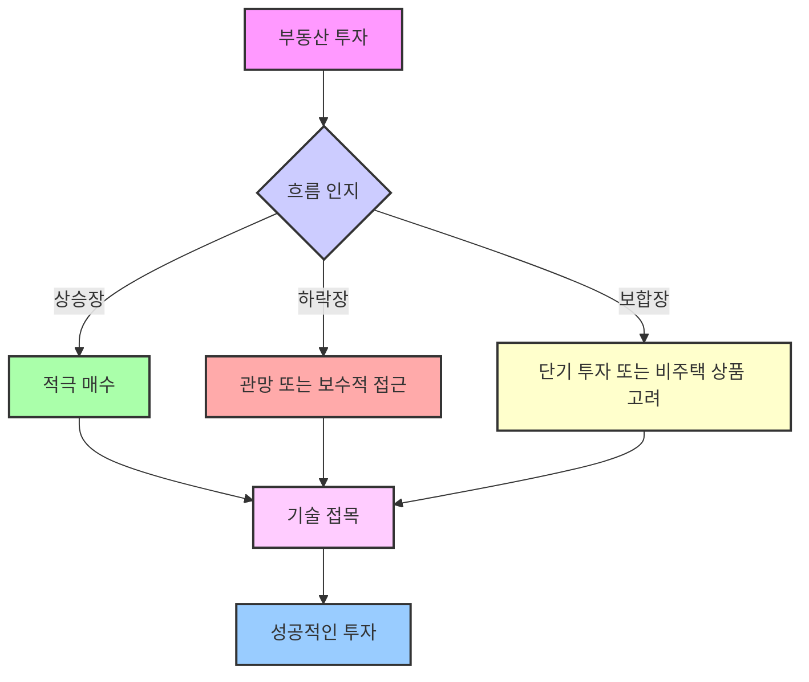
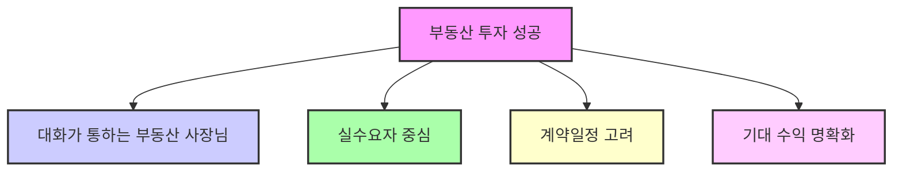

## 아파트 청약, 이렇게 쉬웠어?: 돈 없는 사람도 부자 되는 로또 청약 비법
이 책은 돈이 없어도 아파트 청약을 통해 경제적 자유를 이룰 수 있는 실전 노하우를 알려주는 책이야. 저자는 대기업을 그만두고 부동산 투자에 뛰어들어 청약으로 30억 이상의 자산을 만들었어. 이 책은 청약 초보부터 실전 투자자까지 누구나 쉽게 이해하고 활용할 수 있도록 단계별 전략과 실제 사례를 담고 있어. 

## 1. 돈이 없을수록 아파트 청약을 해야 하는 이유 

아파트 청약은 마치 적은 돈으로 큰 보물을 얻는 것과 같아. 돈이 부족한 사람일수록 청약을 통해 부자가 될 기회를 잡을 수 있어.

1. **적은 투자금으로 시작할 수 있어.**
  1. 분양가 5억짜리 아파트에 당첨되면, 처음 필요한 돈은 계약금 5천만 원 정도야. 
  2. 이 돈으로 3년 후에 5억에서 6억 정도의 프리미엄(시세 차익)을 기대할 수 있어. 
  3. 이건 마치 작은 씨앗을 심어 큰 나무를 키우는 것과 같아. 
2. **신경 쓸 일이 거의 없어.**
  1. 당첨되고 계약서 한 장만 쓰면, 임대, 수리, 명도(집 비우기), 세금 같은 복잡한 문제에 신경 쓸 필요가 없어. 
  2. 분양권 상태에서는 종합부동산세(종부세) 같은 세금 부담도 없어. 
  3. 이건 마치 잘 포장된 선물을 받는 것처럼, 복잡한 과정 없이 결과만 누릴 수 있다는 뜻이야. 
3. **큰 수익과 좋은 환금성을 기대할 수 있어.**
  1. 새 아파트에 대한 수요가 많아서 프리미엄이 빠르게 붙고, 팔고 싶을 때 쉽게 팔 수 있어. 
  2. 이건 마치 인기 있는 상품을 사서 나중에 더 비싸게 파는 것과 같아. 
4. **누구나 쉽게 도전할 수 있어.**
  1. 소액으로도 투자가 가능해서, 부동산 투자를 처음 하는 사람도 쉽게 시작할 수 있어. 
  2. 청약은 내가 잘 배워두면 주변 사람들에게도 좋은 기회를 알려줄 수 있는 은인이 될 수 있어. 
  3. 이건 마치 누구나 참여할 수 있는 보물찾기 게임과 같아. 

## 2. 청약 성공을 위한 5단계 전략 

아파트 청약은 운이 아니라 전략이야. 마치 시험공부처럼 체계적으로 준비하면 누구나 당첨될 수 있어.

1. **1단계: **아파트 청약** 기본 이론을 마스터해야 해.** 
  1. 청약 가점 계산이나 특별공급 조건을 잘못 기재하면 부적격자가 되어 2년간 청약이 제한될 수 있어. 
  2. 실제로 2019년에는 당첨자의 11.3%, 2020년에는 8.1%가 부적격자로 통보되었어. 
  3. 정부 정책과 제도가 자주 바뀌니까 항상 관심을 갖고 변경 사항을 확인해야 해. 
  4. 이건 마치 게임을 시작하기 전에 게임 규칙을 정확히 아는 것과 같아. 규칙을 모르면 실수해서 게임 오버될 수 있잖아.
2. **2단계: 개인 맞춤형 **당첨** 전략을 세워야 해.** 
  1. 청약은 100점을 맞을 필요 없이 합격점만 넘으면 돼. 
  2. 나뿐만 아니라 가족 중에 특별공급 대상자나 무주택 기간이 길어 가점이 높은 사람이 있는지 찾아보고, 가장 유리한 조건으로 전략을 세워야 해. 
  3. 사회 초년생처럼 자금이 적고 가점이 낮은 사람도 전략을 잘 세우면 당첨될 수 있어. 
  - 실제로 5천만 원 안팎의 자금을 가진 사회 초년생 수강생이 1년 동안 5번 당첨되고 4건을 계약한 사례도 있어. 
  4. 이건 마치 나에게 가장 잘 맞는 옷을 고르는 것과 같아. 남들이 좋다고 하는 옷이 아니라 나에게 딱 맞는 옷을 입어야 편하고 멋있잖아.
3. **3단계: 자금 계획을 미리 세워야 해.** 
  1. 아무리 좋은 단지에 당첨되어도 계약금을 낼 돈이 없으면 계약할 수 없어. 
  2. 계약금뿐만 아니라 잔금 시점에 필요한 자금도 미리 계산해 두어야 해. 
  3. 2020년 12월 DMC 파인시티 자이 무순위 청약에서는 30만 대 1의 경쟁률을 뚫고 당첨된 사람이 계약금을 마련하지 못해 계약을 포기한 사례도 있어. 
  4. 당첨은 갑자기 찾아올 수 있으니, 미리미리 준비해 두는 것이 중요해. 
  5. 이건 마치 여행 가기 전에 비행기 표와 숙소 예약뿐만 아니라 여행 경비까지 미리 계획하는 것과 같아. 돈이 없으면 아무리 좋은 여행지라도 갈 수 없잖아.
4. **4단계: 가치 판단 능력을 키워야 해.** 
  1. 새 아파트라고 해서 다 좋은 건 아니야. 적절한 분양가에 앞으로 오를 여지가 있는 곳을 찾아야 해. 
  2. 부동산 가치에는 직장과의 거리, 교통, 학군, 입지, 공급 물량, 매수/매도 심리, 정부 정책 등 다양한 요소가 영향을 미쳐. 
  3. 이런 요소들을 종합적으로 판단할 수 있는 능력을 키워야 해. 
  4. 이건 마치 좋은 물건을 고를 때 단순히 예쁘다고 사는 게 아니라, 품질, 가격, 실용성 등 여러 가지를 따져보는 것과 같아.
5. **5단계: 분양 정보는 스스로 확인해야 해.** 
  1. 아파트 청약은 정보가 생명이야. 분양 공부부터 계약까지 한 달 안에 빠르게 진행되거든. 
  2. 특히 '줍줍'(무순위 청약)처럼 자녀 세대 물량이 나왔을 때는 공고부터 계약까지 2~3일밖에 주어지지 않으니, 항상 분양 정보에 관심을 갖고 있어야 해. 
  3. 이런 정보를 잘 활용하면 청약 통장을 쓰지 않고도 당첨될 수 있어. 
  4. 실제로 한 수강생은 인천 지역의 선착순 모집 공고를 보고 회사에 조퇴하고 달려가 계약에 성공했어. 
  5. 선착순 계약은 동호수를 직접 고르기 때문에 빨리 계약할수록 좋은 동호수를 선점할 수 있어. 
  6. 이건 마치 인기 콘서트 티켓을 예매할 때, 정보가 빠르고 손이 빨라야 좋은 자리를 얻을 수 있는 것과 같아.

## 3. 청약 통장 활용법: 커피 5잔 값으로 펜트하우스 주인이 되는 비법 

청약 통장은 마치 영화 티켓과 같아. 이 티켓이 있어야 좋은 아파트라는 영화를 볼 수 있거든.

1. 청약 통장** 예치금은 미리미리 채워두는 게 중요해.** 
  1. 청약 통장에 일정 금액(예치금)이 들어가 있어야 청약을 신청할 수 있고, 돈이 많을수록 더 넓은 면적의 아파트에 넣을 수 있어. 
  2. 서울은 1,500만 원, 경기도는 500만 원, 인천은 300만 원 등 지역별로 필요한 예치금이 달라. 
  3. 지방에서는 예치금을 200만 원, 250만 원만 넣어두는 경우가 많아서 나중에 큰 면적에 청약할 기회를 놓치기도 해. 
  4. 이건 마치 놀이공원에 가기 전에 미리 자유이용권을 사두는 것과 같아. 현장에서 사려면 줄도 길고 원하는 놀이기구를 못 탈 수도 있잖아.
2. **예치금 마련은 생각보다 어렵지 않아.** 
  1. 천만 원을 예치금 담보대출로 받으면 한 달에 이자가 25,000원 정도인데, 이건 커피 5잔 값 정도밖에 안 돼. 
  2. 인터넷으로 10분이면 대출을 받을 수 있어. 
  3. 이건 마치 매일 마시는 커피 한두 잔을 아껴서 미래를 위한 투자를 하는 것과 같아.
3. 청약 통장** 관리도 꾸준히 해야 해.** 
  1. 청약 통장 가입일, 1년/2년 되는 시점, 현재 예치금 등을 엑셀 파일 같은 곳에 기록해두면 좋아. 
  2. 공공분양 청약 저축 통장이 있는데 인정 금액이 커트라인에 한참 못 미친다면, 과감하게 예금 통장으로 바꾸는 것도 방법이야. 
  3. 이건 마치 내 건강을 위해 꾸준히 운동 기록을 하고 식단을 관리하는 것과 같아. 꾸준히 관리해야 좋은 결과를 얻을 수 있어.
4. 당첨** 후 **청약 통장** 해지 시점은?** 
  1. 당첨되면 계약서 쓰고 모델하우스에서 나오면서 바로 은행에 들러 해지하고 다시 가입하는 게 가장 좋아. 
  2. 새로운 통장에는 매달 10만 원씩 넣어두는 게 일반적이야. 
  3. 이건 마치 영화를 다 보고 나서 다음 영화를 위해 미리 예매하는 것과 같아.

## 4. 무주택자, 1주택자, 다주택자를 위한 청약 전략 

청약은 내 상황에 맞춰 전략을 세우는 게 중요해. 마치 옷을 살 때 내 체형에 맞는 옷을 고르는 것처럼 말이야.

1. **무주택자를 위한 전략: 특별공급과 사전청약을 적극 활용해.** 
  1. 특별공급**(**특공**)을 노려봐.** 
  - 국민주택(공공분양)은 특별공급 비율이 85%로 매우 높아. 
  - 기관 추천(장애인, 중소기업, 군인 등), 다자녀, 노부모 부양, 신혼부부, 생애 최초 등 다양한 유형이 있어. 
  - 최근에는 맞벌이 신혼부부나 1인 가구도 청약할 수 있도록 소득 기준을 완화하고 자녀 수를 보지 않는 30% 물량이 추가되었어. 
  - 이건 마치 특정 자격이 있는 사람들에게만 주어지는 특별 할인 쿠폰과 같아.
  2. **사전청약을 꼭 확인해봐.** 
  - 본청약 2년 전쯤 미리 당첨자 지위를 부여하는 제도야. 
  - 시세보다 저렴하고, 사전청약 시에는 투자금이 들어가지 않아. 
  - 서울 외곽 핵심 지역이나 신도시 등 입지가 좋은 곳에 많이 나와. 
  - 공공분양 사전청약은 당첨되어도 다른 일반 청약이나 주택 구입이 가능해서 더 유리해. 
  - 신혼희망타운도 사전청약으로 동시에 분양하는데, 경쟁률이 낮은 편이야. 
  - 사전청약 당첨 시에는 거주 기간 충족 요건을 잘 확인해야 해. 
  - 사전청약 모집 공고일과 본청약 모집 공고일 이전에 해당 지역 거주 기간을 충족해야 해. 
  - 이건 마치 인기 있는 공연 티켓을 미리 예매해두는 것과 같아. 나중에 본 공연 티켓을 살 때 더 유리한 조건으로 살 수 있지.
2. **1주택자를 위한 전략: 갈아타기와 비조정 지역 투자를 고려해.** 
  1. **좋은 아파트는 그냥 가지고 있어.** 
  - 압구정 현대나 강동의 새 아파트처럼 좋은 곳은 팔고 다시 사기 어려우니 오래 가지고 있는 게 좋아. 
  2. **애매한 아파트는 더 좋은 곳으로 갈아타는 걸 고려해.** 
  - 추가로 매입하는 물건이 기존 주택보다 더 좋아야 하고, 자금 계획도 중요해. 
  - 요즘은 기존 주택을 먼저 팔고 나서 새로운 집을 사는 것도 고려해봐. 
  3. **비조정 지역에 투자하는 것도 팁이야.** 
  - 2년 후에 비과세 혜택을 받을 수 있어. 
  - 지방의 기준 시가 3억 이하 주택도 팁이지만, 양도 시점에도 3억 이하 조건이 유지되어야 해. 
  4. **주택 수에 포함되지 않는 상품(**생활형 숙박시설**, 오피스텔 등)도 경험치로 쌓아봐.** 
  - 이런 상품들은 청약 통장을 쓰지 않고, 청약 발표부터 계약까지 빠르게 진행돼. 
  - 신청금은 신탁 계좌로 안전하게 관리되고, 당첨 포기 시 계약금으로 대체되지 않는다는 문구가 있으면 불이익이 없어. 
  - 전매(되팔기)도 바로 가능하고 다주택자도 대출이 되는 경우가 많아. 
  - 이건 마치 메인 요리 말고 사이드 메뉴를 시켜서 맛보는 것과 같아. 메인 요리는 아니지만 새로운 경험을 할 수 있잖아.
  5. **전세가 상승도 수익의 한 종류로 봐.** 
  - 전세가가 오르면 내 실투자금이 줄어들고, 나중에는 '풀피'(내 돈이 하나도 안 들어가는 투자)가 될 수도 있어. 
  - 이건 마치 은행에 돈을 넣어두면 이자가 붙어 돈이 불어나는 것과 같아.

3. **다주택자를 위한 전략: **줍줍**(**무순위** **청약**)과 비주택 상품을 활용해.** 
  1. **줍줍(무순위 청약)을 노려봐.** 
  - 미분양이나 부적격 세대가 발생했을 때 선착순으로 분양하는 물량이야. 
  - 청약 통장을 쓰지 않고, 다주택자도 신청할 수 있는 경우가 많아. 
  - 인천 미추홀 더 리브 사례처럼, 평일 낮에 갑자기 공고가 뜨면 회사에 조퇴하고 달려가서 계약하는 사람들도 많아. 
  - 선착순은 동호수를 직접 고르기 때문에 빨리 갈수록 좋은 동호수를 선점할 수 있어. 
  - 이건 마치 길을 가다가 우연히 떨어진 돈을 줍는 것과 같아. 예상치 못한 행운을 잡을 수 있지.
  2. **생활형 숙박시설이나 오피스텔 같은 비주택 상품도 고려해봐.** 
  - 아파트와 비슷한 구조와 평형으로 구성되어 가족 단위도 충분히 생활할 수 있는 곳이 많아. 
  - 평촌처럼 구축 아파트가 많은 지역에서는 새 아파트 같은 이런 상품의 수요가 많아. 
  - 청약 통장을 쓰지 않고, 다주택자도 대출이 가능한 경우가 많아. 
  - 이건 마치 아파트가 아니지만 아파트처럼 살 수 있는 '대체 주택'을 찾는 것과 같아.

## 5. 부동산 투자, 흐름을 읽고 방향성을 잡는 것이 중요해 

부동산 투자는 단순히 기술만으로 성공하는 게 아니야. 마치 항해사가 바다의 흐름을 읽어야 목적지에 도착할 수 있는 것처럼, 부동산 시장의 흐름을 이해하는 게 훨씬 중요해.

1. **시장의 흐름을 인지하는 것이 가장 중요해.** 
  1. 경매로 싸게 샀다고 해도 시장이 하락장이라면 오히려 손해를 볼 수도 있어. 
  2. 상승장인지, 하락장인지, 보합장인지 시장의 흐름을 계속 예측하고 인지해야 해. 
  3. 흐름을 알면 다양한 투자 기술을 적절히 접목시킬 수 있어. 
  4. 이건 마치 날씨를 예측해서 우산을 챙길지, 선크림을 바를지 결정하는 것과 같아. 날씨를 모르면 낭패를 볼 수 있잖아.
2. **단기적인 결과에 초조해하지 말고, 장기적인 방향성을 잡는 게 중요해.** 
  1. 지금 당장 수익이 나지 않거나 결과가 없다고 해서 불안해할 필요 없어. 
  2. 3년 후, 5년 후 내 모습을 그려보고, 그 목표를 향해 꾸준히 나아가는 것이 중요해. 
  3. 6개월마다 조급해하거나 다양한 일을 벌이는 것보다, 1년에 한두 가지 큰일을 차분히 쌓아가는 게 훨씬 좋은 선택이야. 
  4. 이건 마치 마라톤을 할 때 처음부터 전력 질주하는 게 아니라, 페이스를 조절하며 꾸준히 달려서 완주하는 것과 같아.

## 6. 부동산 사장님과의 소통과 기대 수익 설정 

부동산 투자는 혼자 하는 게 아니야. 좋은 파트너를 만나고, 나만의 기준을 세우는 게 중요해.

1. **대화가 잘 통하는 부동산 사장님을 만나는 것이 중요해.** 
  1. 부동산 사장님은 마치 내 편에서 조언해 주는 조력자와 같아.
  2. 전화를 몇 번 해보면 대화가 잘 통하는지 느낌이 올 거야. 
  3. 물론 대화가 안 통해도 손님을 잘 맞춰주면 의미가 있지만, 이왕이면 소통이 잘 되는 곳이 좋아. 
2. **실수요자가 많은 곳이 좋아.** 
  1. 실제로 그 집에 살고 싶어 하는 사람이 많을수록 나중에 팔기도 쉽고 가격도 안정적이야. 
3. **계약일이 길거나 늦을수록 프리미엄이 오르는 경향이 있어.** 
  1. 이건 마치 인기 있는 상품이 출시되기 전까지 기다리면 기대감이 커져서 가격이 오르는 것과 같아.
4. **기대 수익을 먼저 정해놓고 투자해야 해.** 
  1. 처음에 500만 원 수익을 목표로 했는데, 주변에서 700만 원, 1,000만 원으로 올리라고 하면 영영 투자를 못 할 수도 있어. 
  2. 나만의 기준을 정하고 그 기준에 맞춰야 원하는 수익을 달성할 수 있어. 
  3. 이건 마치 쇼핑할 때 예산을 정해놓고 그 안에서 가장 좋은 물건을 고르는 것과 같아. 예산을 넘어가면 결국 아무것도 못 살 수 있잖아.

