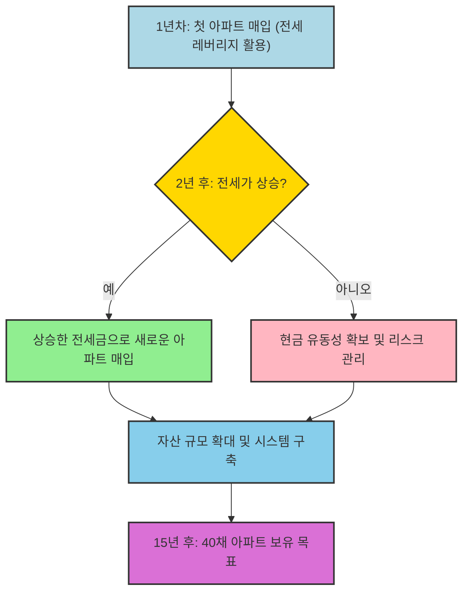
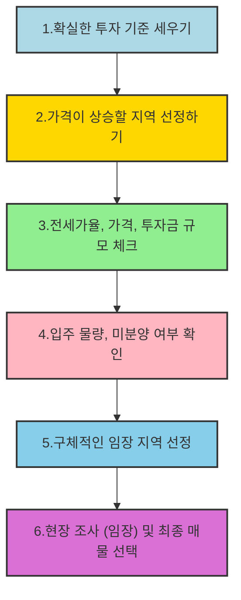

## 월급쟁이 부자로 은퇴하라: 평범한 직장인도 부자가 될 수 있는 부동산 투자 시스템 
이 책은 평범한 월급쟁이도 전세 레버리지 투자를 통해 여러 채의 아파트를 안전하게 사 모으고, 결국 경제적 자유를 얻어 부자로 은퇴할 수 있는 구체적인 방법을 알려주는 책이야. 저자 너나위 님은 이 방법을 통해 3년 만에 30년치 연봉을 벌고, 현재는 100억 자산가가 되었다고 해. 

## 1. 왜 투자를 해야 할까? 회사는 우리를 책임져 주지 않아 

우리가 투자를 해야 하는 이유는 크게 세 가지로 볼 수 있어.

1. **돈의 가치가 계속 떨어지고 있어 (**인플레이션**)** 
  1. 마치 뜨거운 물에 넣어둔 얼음처럼, 가만히 두면 돈의 가치는 점점 녹아내리는 거야. 
  2. 이건 은행이 돈을 계속 찍어내기 때문인데, 돈이 많아지면 돈의 가치가 떨어지는 건 당연한 일이야. 
  3. 은행은 우리가 맡긴 돈을 다른 사람에게 빌려주고 이자를 받아서 돈을 벌고, 그 과정에서 시장에 돈의 양이 계속 늘어나게 돼. 
  4. 결국 통장에 돈을 넣어두기만 하면 시간이 지날수록 그 돈으로 살 수 있는 게 줄어드는 셈이야. 
  5. 아파트도 물건이기 때문에 인플레이션의 영향을 받아서 장기적으로는 가격이 오를 수밖에 없어. 
2. **월급만으로는 부자가 되기 어려워 (소득 분배 불균형)** 
  1. 자본주의 사회에는 가계(우리), 기업, 정부 이렇게 세 명의 배우가 있는데, 이들이 함께 돈을 벌고 나눠 갖는 구조야. 
  2. 그런데 요즘은 가계의 몫은 줄어들고, 기업과 정부의 몫이 점점 늘어나고 있어. 
  3. 결국 직장인만으로는 부자가 되기 힘든 구조라는 거지. 
3. **우리의 노후는 우리가 책임져야 해 (고령화 사회)** 
  1. 지금은 아이는 적게 태어나고 나이 드신 분들은 많아지는 고령화 사회라서, 누가 우리의 노후를 책임져 줄지 불확실해. 
  2. 국민연금만으로는 노후 생활에 필요한 돈이 턱없이 부족하고, 나이 들어서도 힘든 일을 해야 하는 경우가 많아. 
  3. 심지어 우리나라 노인 빈곤율은 OECD 국가 중 1위라고 하니, 노후 준비는 스스로 해야만 해. 
  4. 저자도 처음에는 부자가 되는 게 목표가 아니라, 자신의 노후를 준비하기 위해 투자를 시작했다고 해. 

## 2. 돈을 버는 방식과 쓰는 방식을 바꿔야 해 

우리가 지금처럼 월급만 받아서는 부자가 되기 어려워. 돈을 버는 방식과 쓰는 방식을 바꿔야 해.

1. **시간과 무관하게 돈을 버는 방식으로 이동해야 해** 
  1. 지금 직장인들은 시간을 회사에 주고 돈을 받는 방식이야. 
  2. 이 방식은 내가 시간을 투입할 수 없게 되면 돈도 벌 수 없다는 큰 위험이 있어. 
  3. 우리는 내가 직접 일하지 않아도 돈이 스스로 돈을 벌어다 주는 방식으로 바꿔야 해. 
2. **돈을 쓰는 방식을 바꿔야 해: **소비 자산** 대신 생산 자산에 투자하기** 
  1. 돈을 쓰는 방식은 크게 두 가지로 나눌 수 있어. 
  - 생산 자산: 나중에 가격이 오를 가능성이 있는 것. 마치 씨앗을 심으면 나무가 자라 열매를 맺는 것처럼, 시간이 지날수록 가치가 늘어나는 자산이야. 
  - 부동산이나 주식이 대표적인 생산 자산이야. 
  - 소비 자산: 시간이 지날수록 가격이 떨어지거나 아예 사라져 버리는 것. 마치 새 차를 사자마자 중고차가 되는 것처럼, 가치가 줄어드는 자산이야. 
  - 옷, 차, 생필품, 사치품 등이 소비 자산이고, 심지어 저금리 시대에는 은행 예금 통장의 돈도 인플레이션 때문에 가치가 떨어지니 소비 자산으로 볼 수 있어. 
  2. 우리는 소비 자산을 사는 데 돈을 쓰는 대신, 생산 자산을 사는 데 돈을 써야 해. 
  3. 이것이 바로 자본주의 원리를 깨닫고 부를 쌓은 사람들이 사용했던 방법이야. 
3. **직장인의 **비근로 소득 창출** 6단계** 
  1. **1단계**: 직장에서 열심히 일하고 월급을 받는다. (시간과 근로 소득을 교환) 
  2. **2단계**: 소비 자산에 대한 지출을 최소화한다. (절약) 
  3. **3단계**: 남은 돈을 모은다. (자본화) 
  4. **4단계**: 모은 돈으로 생산 자산을 산다. (투자) 
  5. **5단계**: 2단계에서 4단계를 반복하며 자산 시스템을 만든다. (규모 확대) 
  6. **6단계**: 시스템으로부터 일하지 않고도 소득을 얻는다. (비근로 소득 확보) 

## 3. 왜 부동산, 그중에서도 아파트에 투자해야 할까? 

저자가 여러 투자 수단 중에서 부동산, 특히 아파트를 선택한 이유가 있어.

1. **예금과 보험은 인플레이션을 이기기 어려워** 
  1. 예금은 원금은 보존되지만, 인플레이션 때문에 돈의 가치가 떨어져서 사실상 손해를 보는 셈이야. 
  2. 보험은 보장 기능은 있지만, 장기적으로 돈이 묶이고 수수료도 높아서 투자라고 보기 어려워. 
2. **주식과 펀드는 정보 비대칭과 높은 수수료가 단점이야** 
  1. 펀드는 전문가가 운용해 주지만, 운용 보수(수수료)가 높아서 시작부터 손해를 보고 시작하는 것과 같아. 
  2. 주식은 복리 효과(이자에 이자가 붙는 것)를 누릴 수 있고 큰 수익을 올릴 가능성도 있지만, 정보가 비대칭적이야. 
  - 마치 나만 모르는 비밀 정보를 가지고 주식 투자를 하는 사람들이 있는 것처럼, 일반 투자자는 기업 내부 정보나 전문가의 정보에 접근하기 어려워. 
  - 반면 부동산은 매도자와 매수자가 거의 대등한 정보를 가지고 거래할 수 있어서, 정보 비대칭으로 인한 불이익이 적어. 
3. **부동산은 '**레버리지**'를 활용할 수 있어** 
  1. 레버리지는 '지렛대'라는 뜻인데, 내 돈이 적어도 남의 돈(대출이나 전세금)을 빌려서 더 큰 자산에 투자할 수 있는 것을 말해. 
  2. 마치 작은 힘으로 무거운 물건을 들어 올리는 지렛대처럼, 적은 돈으로 큰 수익을 얻을 수 있는 강력한 도구인 셈이야. 
  3. 특히 부동산은 전세금을 활용하면 무이자로 남의 돈을 빌릴 수 있다는 큰 장점이 있어. 
  4. 이 '눈덩이 효과'처럼, 자산의 크기가 클수록 기대 수익도 훨씬 커질 수 있어. 

## 4. 전세 레버리지 투자 시스템 구축 로드맵 

저자는 전세 레버리지를 활용해서 15년 동안 40채의 아파트를 모으는 시스템 구축 로드맵을 제시하고 있어. 

1. 전세 레버리지** 투자의 핵심 원리** 
  1. 처음에는 내 돈과 전세금을 합쳐서 아파트를 한 채 사. 
  2. 2년 뒤 전세 계약이 끝나면, 그동안 오른 전세금을 받아서 그 돈으로 또 다른 아파트를 사는 거야. 
  3. 이 과정을 계속 반복하면, 마치 눈덩이가 굴러가면서 점점 커지는 것처럼 자산이 불어나는 거지. 
2. **15년간 40채 아파트 시스템 구축 로드맵** 
  1. **1년차**: 아파트 1채 매입. 
  2. **2년차**: 아파트 1채 추가 매입 (총 2채). 
  3. **3년차**: 첫 번째 아파트의 전세가가 오르면, 그 돈으로 아파트 1채 추가 매입 (총 3채). 
  4. **4년차부터**: 두 번째 아파트의 전세가도 오르면, 오른 전세금으로 아파트를 계속 추가 매입할 수 있는 시스템이 만들어지는 거야. 
  5. 이렇게 꾸준히 반복하면 15년 후에는 40채의 아파트를 가질 수 있다는 목표를 세울 수 있어. 
3. **리스크 관리: 역전세에 대비해야 해** 
  1. 전세가가 하락하는 '역전세' 상황이 올 수도 있으니, 이에 대한 대비책을 마련해야 해. 
  2. **첫째, **전세가** 하락 우려가 적은 물건에 투자해야 해.** 
  - 전세 거주자(세입자)들은 직장과 교통이 편리한 입지 좋은 곳을 선호하니까, 이런 지역에 투자하는 것이 안전해. 
  3. **둘째, 신규 주택 입주 물량이 많은 곳은 신중하게 접근해야 해.** 
  - 새 아파트가 많이 들어서면 전세가가 떨어질 가능성이 크기 때문에, 주변 지역에 3~4년 이상 인구의 1% 이상 규모로 주택 공급이 예정되어 있다면 투자하지 않는 것이 좋아. 
  4. **셋째, 마이너스 통장이나 신용 대출 등으로 현금을 미리 확보해 둬야 해.** 
  - 하지만 처음부터 모든 대출을 끌어다 투자하면 안 되고, 비상 상황에 대비할 여유 자금을 남겨둬야 해. 
  5. **넷째, 현금화가 가능한 **투자** 물건을 한두 개 정도 남겨둬야 해.** 
  - 임대 사업자로 등록해서 세금 혜택을 받는 아파트라도, 급할 때 팔 수 있는 물건을 남겨두는 것이 중요해. 

## 5. 절대로 돈을 잃지 않는 투자법: '저평가'된 아파트를 찾아라 

투자와 투기를 구분하고, 절대로 돈을 잃지 않는 투자를 하려면 '저평가'된 아파트를 찾는 것이 가장 중요해.

1. **투자와 투기의 차이** 
  1. 투자: 사는 순간 돈을 버는 것. 
  - 마치 시장에서 똑같은 물건인데도 유난히 싸게 파는 것을 발견하고 사는 것과 같아. 
  2. 투기: 막연하게 앞으로 오를 것이라고 생각하고 사는 것. 
  - 지금 가격이 얼마든 상관없이, 그저 오를 것 같다는 기대감만으로 사는 것은 투기야. 
  - 설령 운 좋게 돈을 벌었더라도, 저자의 기준으로는 투기라고 볼 수 있어. 
2. 저평가된** 아파트를 찾는 방법** 
  1. **저평가란?** 물건의 가치에 비해 가격이 싼 상태를 말해. 
  - 부동산의 가치는 '입지'로 결정되기 때문에, 입지에 비해 가격이 싼지, 적정한지, 비싼지를 판단하는 것이 중요해. 
  - 마치 소고기를 살 때, 여러 마트를 돌아다니며 평균 가격을 알아본 뒤 가장 싼 곳에서 사는 것과 같아. 
  2. 입지** 판단 요령**: 사람들이 좋아하는 것을 항목별로 생각해 보면 돼. 
  - **일자리**: 직장이 가까운지. 
  - **교통**: 지하철역이나 버스 노선이 편리한지. 
  - **주변 환경**: 공원, 편의시설, 상권 등이 잘 갖춰져 있는지. 
  - **학군**: 좋은 학교나 학원가가 있는지. 
  - 이런 요소들이 우수할수록 그 지역의 선호도가 높고 가치가 높아. 
  3. **'**비교 평가**'를 통해 안목을 키워야 해.** 
  - 관심 있는 아파트가 있다면, 계약하기 전에 주변의 더 많은 아파트들을 직접 찾아가서 비교해 봐야 해. 
  - 마치 휴대폰을 살 때 여러 대리점을 돌아다니며 가격을 비교하는 것처럼, 비교 대상이 많을수록 더 정확한 판단을 내릴 수 있어. 
  - 이때 '발품'과 '손품'이 중요해. 
  - 발품: 직접 현장에 가서 주변 환경, 교통, 학군 등을 눈으로 확인하고 주민들의 이야기도 들어보는 거야. 
  - **손품**: 인터넷으로 시세, 입주 물량, 미분양 현황 등을 꼼꼼히 조사하는 거야. 
  - 이렇게 공부하고 발품을 팔다 보면, 어떤 아파트가 저평가되었는지 스스로 판단할 수 있는 '안목'이 생겨. 
  - 저자는 평촌 아파트 투자 시, 평촌의 입지가 산본보다 훨씬 좋지만 가격은 같았기 때문에 평촌이 저평가되었다고 판단하고 투자했어. 
3. **전세가율을 활용한 리스크 관리** 
  1. 전세가율(매매가 대비 전세가의 비율)이 높은 아파트에 투자하는 것이 좋아. 
  2. 부동산 시장이 하락할 때, 매매가는 떨어져도 전세가는 오히려 오르는 경향이 있어. 
  3. 이때 전세가는 매매가가 더 이상 떨어지지 않도록 막아주는 '하방 지지선' 역할을 해. 
  4. 매매가와 전세가의 차이(내 투자금)가 적을수록, 가격이 하락하더라도 내가 잃을 수 있는 돈이 적다는 뜻이야. 

## 6. 성공적인 투자를 위한 마인드셋 

투자는 단거리 경주가 아니라 마라톤과 같아. 꾸준함과 올바른 마음가짐이 중요해.

1. **현실을 직시하고 행동해야 해.** 
  1. "집값이 거품이야", "말도 안 돼"라고 불평만 해서는 아무것도 해결되지 않아. 
  2. 정부나 정책을 탓하기보다는, 주어진 현실 속에서 내가 무엇을 할 수 있을지 고민하고 행동해야 해. 
  3. 마치 어두운 동굴 속에서도 빛을 찾으려는 사람에게 기회가 오는 것처럼, 현실을 직시하고 노력하는 사람에게 더 많은 기회가 생겨. 
2. **조급함을 버리고 꾸준히 노력해야 해.** 
  1. 단기간에 큰 수익을 얻으려고 조급해하면 오히려 실패할 가능성이 커. 
  2. 투자는 끈기가 필요한 장기전이기 때문에, 자신의 페이스를 유지하며 꾸준히 해나가야 성과를 얻을 수 있어. 
  3. 저자도 좋은 투자처가 보이지 않거나 투자금이 없을 때도 꾸준히 현장을 찾아다니며 준비했다고 해. 
  4. 마치 씨앗을 심고 매일 물을 주며 기다려야 열매를 맺는 것처럼, 꾸준한 노력과 시간이 필요해. 
3. **미래를 예측하려 하지 마.** 
  1. 미래를 정확히 예측하는 것은 인간의 능력 밖이야. 
  2. 성공한 투자자들은 미래를 예측하는 '혜안'이 있어서 성공한 것이 아니라, '확률론적 사고'를 가지고 현재 가치 대비 저렴한 것을 사는 데 집중했어. 
  3. 마치 날씨를 100% 정확하게 예측할 수 없는 것처럼, 부동산 시장의 미래도 예측하기 어려워. 
  4. 예측에 의존하기보다는, 지금 당장 저평가된 물건을 찾고, 리스크에 대비하는 것이 중요해. 
4. 돈** 그릇을 키워야 해.** 
  1. 돈을 담을 수 있는 그릇이 커져야 더 많은 돈을 담을 수 있어. 
  2. 이 돈 그릇은 단순히 돈을 많이 버는 능력이 아니라, 돈을 대하는 태도, 즉 돈에 대한 지식과 경험, 그리고 인내심을 통해 키워지는 거야. 
  3. 투자를 통해 돈뿐만 아니라 자존감과 행복까지 얻을 수 있다고 저자는 말해. 
5. **가족을 잊지 마.** 
  1. 투자를 하는 궁극적인 목적은 나와 내 가족의 경제적 안정을 위해서라는 것을 잊지 말아야 해. 
  2. 돈을 버는 과정에서 가족과의 관계를 소홀히 하지 않고, 함께 행복을 추구하는 것이 중요해. 

## 7. 투자 매뉴얼: 구체적인 실천 방법 

성공적인 투자를 위해서는 자신만의 명확한 투자 기준을 세우고, 구체적인 매뉴얼에 따라 움직여야 해.

1. **확실한 투자 기준 세우기** 
  1. **1단계**: 어떤 투자 종목에 투자할지 정해. (예: 부동산) 
  2. **2단계**: 부동산 중 어떤 대상에 투자할지 정해. (예: 아파트) 
  3. **3단계**: 아파트 중 어떤 투자를 할지 정해. (예: 전세 레버리지 투자) 
  4. **4단계**: 가장 좋은 아파트 투자 기준을 더 구체적으로 만들어. (예: 저평가, 적은 투자금, 리스크 감당 여부) 
2. **가격이 상승할 지역 선정하기** 
  1. 부동산 시장은 수요와 공급의 시차(시간 차이) 때문에 냉각과 과열을 반복해. 
  - 아파트는 수요가 늘어도 바로 공급할 수 없기 때문에, 수요와 공급의 균형이 깨지는 기간이 생겨. 
  - 이 시차 때문에 가격이 오르내리는 현상이 발생하고, 정부 정책도 이에 맞춰서 나오게 돼. 
  2. **투자 아파트를 찾는 4가지 기준** 
  - 전세가율: 매매가 대비 전세가 비율이 높은 곳. 
  - **가격**: 저렴하게 느껴지는 저평가된 곳. 
  - **투자 금액 규모**: 적은 투자금으로 투자가 가능한 곳. 
  - **입주 물량 및 미분양 여부**: 주변 지역에 과도한 입주 물량이 예정되어 있거나 미분양이 쌓이지 않은 곳. 
  3. **지역 선정 과정** 
  - 매주 직접 지역들을 방문하며 가격에 대한 감을 잡아. 
  - 매달 전국 시/군/구 단위로 부동산 시세를 확인하고, 전세가율이 높고 가격이 저렴하게 느껴지는 지역을 몇 군데 정해. 
  - 각종 부동산 서비스(네이버 부동산, KB 부동산 등)에서 해당 지역의 높은 전세가율과 적정한 투자금 규모에 부합하는 단지가 많은지 다시 한번 확인해. 
  - 해당 지역의 입주 물량과 미분양 현황 등을 확인해서 구체적인 임장 지역을 선정해. 
  - 최종적으로 임장을 통해 매물을 선택해. 
3. 임장**(현장 조사)의 중요성** 
  1. 부동산 투자는 책상에서 하는 것이 아니라, 발로 뛰며 현장을 직접 확인하는 것이 가장 중요해. 
  2. 임장을 통해 아는 지역이 많아질수록, 어떤 물건이 싸고 투자금이 적게 드는지, 같은 투자금으로 어떤 물건이 가장 좋은지 더 정확하게 판단할 수 있어. 
  3. 임장 후에는 모의 투자처럼 시세 흐름과 변화를 모니터링하며 안목을 넓히는 공부를 해야 해. 
4. **협상 능력 키우기** 
  1. 부동산 거래는 매도자와 매수자뿐만 아니라 중개인, 임차인 등 많은 사람이 얽혀 있는 일이야. 
  2. 나의 입장만 주장하기보다는 상대방의 입장도 고려하며 인내심을 가지고 협상해야 좋은 결과를 얻을 수 있어. 
  3. 마치 선물을 주고받는 것처럼, 내가 상대에게 무엇을 줄 수 있는지 생각해야 원하는 것을 얻을 수 있어. 
  4. 협상 과정에서 상대방의 마음을 헤아리려고 노력하다 보면, 온실 속 화초 같던 직장인도 가족을 위해 자신을 내려놓고 굽힐 줄 아는 사람이 될 수 있어. 

